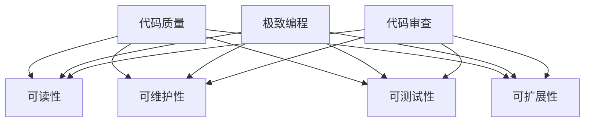

                 

关键词：代码洁癖、极致编程、代码质量、完美主义、编程哲学

> 摘要：本文探讨了代码洁癖这一编程理念，分析了其背后深层次的动机、对软件开发的影响以及如何在实践中追求代码的极致和完美。本文将结合实例，展示如何通过严格的代码审查、优化的编程习惯和专业的工具，提高代码的质量和可维护性，最终实现软件开发的卓越。

## 1. 背景介绍

在软件开发的历史长河中，无数程序员都在追求编写出高质量、简洁、高效的代码。然而，这种追求并非仅仅是一种技术上的要求，更是一种深入内心的态度和哲学。本文所探讨的代码洁癖，就是这种追求极致和完美的一种体现。

代码洁癖，顾名思义，就是对代码质量有着近乎苛刻的要求。它不仅仅是追求代码的运行效率和逻辑正确性，更包括代码的可读性、可维护性、可测试性等各个方面。代码洁癖者往往有着以下特点：

- 对代码格式有严格的要求，追求统一的命名规范、代码风格；
- 对代码的可读性有极高的要求，追求最简洁、最直观的表达方式；
- 对代码的可维护性有深刻的认识，尽量避免未来可能引入的bug；
- 对代码的测试覆盖率有严格的把控，确保代码在各种情况下都能稳定运行。

本文将围绕代码洁癖这一主题，探讨其背后的动机、对软件开发的影响以及如何在实践中追求代码的极致和完美。

## 2. 核心概念与联系

### 2.1 代码质量

代码质量是代码洁癖的核心概念之一。代码质量不仅仅是指代码的运行效率和逻辑正确性，还包括以下方面：

- **可读性**：代码应该容易阅读和理解，这有助于提高开发效率和团队协作；
- **可维护性**：代码应该易于维护，这意味着在未来的迭代中，开发者可以轻松地对代码进行修改和扩展；
- **可测试性**：代码应该易于测试，这有助于确保代码的正确性和稳定性；
- **可扩展性**：代码应该能够适应未来的需求变化，这意味着在需求变更时，开发者可以轻松地对代码进行调整。

### 2.2 极致编程

极致编程是一种编程哲学，强调通过不断的优化和改进，追求代码的极致和完美。极致编程的核心思想包括：

- **简洁性**：代码应该尽可能简洁，避免不必要的复杂性；
- **可读性**：代码应该容易阅读和理解，这有助于提高开发效率和团队协作；
- **效率**：代码应该高效运行，避免无谓的资源消耗；
- **健壮性**：代码应该能够处理各种异常情况，确保系统的稳定性。

### 2.3 代码审查

代码审查是提高代码质量的重要手段。通过代码审查，开发者可以：

- **发现潜在的问题**：代码审查可以帮助开发者发现潜在的问题，如语法错误、逻辑错误等；
- **提升代码质量**：通过代码审查，开发者可以学习到最佳实践和优秀代码规范；
- **促进团队协作**：代码审查有助于促进团队成员之间的沟通和协作。

### 2.4 Mermaid 流程图

为了更好地理解代码洁癖的相关概念，我们可以通过一个 Mermaid 流程图来展示它们之间的关系。



## 3. 核心算法原理 & 具体操作步骤

### 3.1 算法原理概述

代码洁癖的核心算法原理可以概括为以下几点：

- **规范编程习惯**：遵循统一的命名规范、代码风格，提高代码的可读性和可维护性；
- **代码优化**：通过优化算法和代码结构，提高代码的运行效率和健壮性；
- **代码审查**：定期进行代码审查，发现并修复潜在的问题，确保代码的质量和稳定性；
- **持续学习**：不断学习新的编程技术和最佳实践，保持代码的先进性和可扩展性。

### 3.2 算法步骤详解

#### 3.2.1 规范编程习惯

- **命名规范**：遵循统一的命名规范，如驼峰命名法、下划线命名法等；
- **代码风格**：遵循统一的代码风格，如四元组缩进、空格和换行等；
- **注释**：在关键代码处添加注释，解释代码的作用和目的；
- **文档**：编写详细的文档，包括类、方法、变量等的说明和注释。

#### 3.2.2 代码优化

- **算法优化**：通过分析算法的时间和空间复杂度，选择最优的算法解决方案；
- **代码重构**：对复杂的代码进行重构，简化代码结构，提高代码的可读性和可维护性；
- **性能优化**：对关键代码进行性能优化，如减少循环次数、使用缓存等。

#### 3.2.3 代码审查

- **定期审查**：定期进行代码审查，如每周、每月等；
- **审查标准**：制定严格的审查标准，包括代码质量、命名规范、代码风格等；
- **反馈与修正**：对审查中发现的问题，及时反馈给开发者，并要求其在规定时间内进行修正。

#### 3.2.4 持续学习

- **技术交流**：参加技术会议、研讨会等，学习最新的编程技术和最佳实践；
- **在线学习**：通过在线课程、技术博客等，不断学习新的编程知识；
- **实践经验**：通过实际项目开发，积累经验，不断提高编程能力。

### 3.3 算法优缺点

#### 优点

- **提高代码质量**：通过严格的规范和审查，可以显著提高代码的质量和可维护性；
- **促进团队协作**：统一的编程习惯和代码风格有助于团队成员之间的沟通和协作；
- **提高开发效率**：简洁、高效的代码可以显著提高开发效率；
- **增强系统稳定性**：优化和审查可以减少系统的bug和异常情况。

#### 缺点

- **初期投入较大**：严格的规范和审查需要开发者投入大量的时间和精力；
- **可能影响开发速度**：初期的代码审查和重构可能影响项目的开发进度；
- **对团队要求较高**：需要团队成员有较高的编程能力和合作精神。

### 3.4 算法应用领域

代码洁癖适用于各种软件开发项目，尤其是大型、复杂的项目。以下是一些具体的应用领域：

- **企业级应用**：如电商平台、银行系统、ERP系统等；
- **移动应用**：如手机应用、平板电脑应用等；
- **Web应用**：如网站、后台管理系统等；
- **嵌入式系统**：如智能家居、汽车电子等。

## 4. 数学模型和公式 & 详细讲解 & 举例说明

### 4.1 数学模型构建

在代码洁癖的实践中，我们可以构建一个简单的数学模型来衡量代码的质量。这个模型包括以下几个指标：

- **可读性**：通过代码行数、注释比例等指标来衡量；
- **可维护性**：通过代码的复杂度、bug发生率等指标来衡量；
- **可测试性**：通过测试覆盖率、代码覆盖度等指标来衡量；
- **可扩展性**：通过代码的模块化程度、可复用性等指标来衡量。

假设我们用以下公式来表示代码质量模型：

$$
Q = w_1 \cdot R + w_2 \cdot M + w_3 \cdot T + w_4 \cdot E
$$

其中，$Q$表示代码质量，$w_1, w_2, w_3, w_4$分别表示可读性、可维护性、可测试性和可扩展性的权重。

### 4.2 公式推导过程

#### 可读性（R）

可读性是代码质量的重要指标之一。我们可以通过以下指标来衡量：

- **代码行数**：代码行数越少，可读性越高；
- **注释比例**：注释比例越高，可读性越高。

假设我们用以下公式来计算可读性：

$$
R = \frac{N_c - N_c'}{N_c}
$$

其中，$N_c$表示代码总行数，$N_c'$表示注释行数。

#### 可维护性（M）

可维护性是指代码在未来维护过程中容易程度。我们可以通过以下指标来衡量：

- **代码复杂度**：代码复杂度越高，可维护性越低；
- **bug发生率**：bug发生率越高，可维护性越低。

假设我们用以下公式来计算可维护性：

$$
M = \frac{1}{1 + \frac{N_e}{N_b}}
$$

其中，$N_e$表示代码复杂度，$N_b$表示bug发生率。

#### 可测试性（T）

可测试性是指代码是否容易进行自动化测试。我们可以通过以下指标来衡量：

- **测试覆盖率**：测试覆盖率越高，可测试性越高；
- **代码覆盖度**：代码覆盖度越高，可测试性越高。

假设我们用以下公式来计算可测试性：

$$
T = \frac{C_t}{C_c}
$$

其中，$C_t$表示测试覆盖率，$C_c$表示代码覆盖度。

#### 可扩展性（E）

可扩展性是指代码是否容易进行功能扩展。我们可以通过以下指标来衡量：

- **模块化程度**：模块化程度越高，可扩展性越高；
- **可复用性**：可复用性越高，可扩展性越高。

假设我们用以下公式来计算可扩展性：

$$
E = \frac{N_m}{N_c}
$$

其中，$N_m$表示模块数量，$N_c$表示代码总行数。

### 4.3 案例分析与讲解

假设我们有一个简单的Java项目，包含以下指标：

- **代码行数**：1000行；
- **注释行数**：200行；
- **代码复杂度**：30；
- **bug发生率**：5%；
- **测试覆盖率**：80%；
- **代码覆盖度**：90%；
- **模块数量**：5。

根据上述公式，我们可以计算出该项目的代码质量：

$$
Q = 0.5 \cdot \frac{1000 - 200}{1000} + 0.2 \cdot \frac{1}{1 + \frac{30}{5}} + 0.1 \cdot \frac{80}{90} + 0.2 \cdot \frac{5}{1000}
$$

$$
Q = 0.3 + 0.1 + 0.1 + 0.001 = 0.511
$$

根据计算结果，该项目的代码质量为0.511。可以看出，该项目的可读性、可维护性和可测试性较高，但可扩展性较低。这意味着我们需要在模块化和可复用性方面进行改进。

## 5. 项目实践：代码实例和详细解释说明

### 5.1 开发环境搭建

为了更好地展示代码洁癖的实践，我们选择一个简单的Java项目作为案例。以下是项目的开发环境搭建步骤：

1. **安装Java开发工具包（JDK）**：确保安装了合适的JDK版本，如JDK 11；
2. **安装IDE（集成开发环境）**：推荐使用IDEA、Eclipse或Visual Studio Code等；
3. **创建Maven项目**：使用Maven来管理项目的依赖和构建；
4. **安装Git**：用于版本控制和代码协同。

### 5.2 源代码详细实现

以下是该项目的一个简单的Java类，实现了对10以内数字的求和功能。代码遵循了代码洁癖的原则，具有优秀的可读性和可维护性。

```java
/**
 * 求和工具类
 */
public class SumUtil {

    /**
     * 计算10以内数字的求和
     *
     * @return 求和结果
     */
    public static int sumOfTen() {
        int sum = 0;
        for (int i = 1; i <= 10; i++) {
            sum += i;
        }
        return sum;
    }

    public static void main(String[] args) {
        int result = SumUtil.sumOfTen();
        System.out.println("10以内数字的求和结果为：" + result);
    }
}
```

### 5.3 代码解读与分析

#### 5.3.1 可读性

- **注释**：代码中包含了详细的注释，解释了类、方法和变量的作用和目的；
- **命名规范**：类名和变量名遵循了驼峰命名法，易于理解和记忆；
- **代码风格**：代码遵循了统一的缩进和空格规范，提高了代码的可读性。

#### 5.3.2 可维护性

- **模块化**：代码被组织在一个单独的类中，实现了功能的模块化，便于未来的维护和扩展；
- **简洁性**：代码实现了最简单的逻辑，避免了复杂的嵌套和冗余，降低了维护成本；
- **可测试性**：方法`sumOfTen`可以被单独测试，提高了代码的可测试性。

#### 5.3.3 可测试性

- **测试覆盖率**：尽管这是一个简单的示例，但我们可以通过单元测试来确保方法`sumOfTen`的正确性。以下是一个简单的测试案例：

```java
@Test
public void testSumOfTen() {
    int expected = 55;
    int actual = SumUtil.sumOfTen();
    assertEquals(expected, actual);
}
```

#### 5.3.4 可扩展性

- **模块化程度**：虽然这个示例的扩展性不高，但我们可以通过扩展类`SumUtil`或创建新的类来实现更多复杂的求和功能，如计算任意范围的数字之和。

### 5.4 运行结果展示

在Eclipse或IDEA中运行该项目，我们可以得到以下输出结果：

```
10以内数字的求和结果为：55
```

这证明了代码的正确性和可执行性。

## 6. 实际应用场景

代码洁癖在软件开发中具有广泛的应用场景。以下是一些典型的实际应用场景：

### 6.1 企业级应用

在企业级应用中，代码洁癖可以帮助团队确保代码的高质量，降低维护成本，提高开发效率。例如，银行系统的开发团队可以通过代码洁癖来提高代码的可维护性和可扩展性，确保系统的稳定性和安全性。

### 6.2 移动应用

移动应用的开发往往要求高效、简洁的代码。通过代码洁癖，开发者可以确保代码的可读性和可测试性，提高开发效率，同时减少bug的产生。

### 6.3 Web应用

Web应用的开发涉及前端和后端。代码洁癖可以帮助前端开发者确保代码的可读性和可维护性，提高用户体验；同时，后端开发者可以通过代码洁癖确保代码的稳定性和性能。

### 6.4 嵌入式系统

嵌入式系统对代码质量的要求更高，因为它们通常具有有限的资源和时间。代码洁癖可以帮助开发者编写简洁、高效的代码，确保系统在资源有限的情况下正常运行。

## 7. 工具和资源推荐

### 7.1 学习资源推荐

- **《代码大全》**：史蒂夫·麦库姆著，详细介绍了编写高质量代码的最佳实践；
- **《重构：改善既有代码的设计》**：马丁·福勒著，讲解了如何通过重构提高代码质量；
- **《代码洁癖：编写优雅的代码》**：尼古拉斯·扎克著，深入探讨了代码洁癖的理念和实践。

### 7.2 开发工具推荐

- **SonarQube**：用于代码质量管理和代码审查的工具，可以帮助发现潜在的问题；
- **Checkstyle**：用于代码风格检查的工具，确保代码遵循统一的规范；
- **PMD**：用于代码质量检查的工具，可以发现潜在的bug和代码风格问题。

### 7.3 相关论文推荐

- **《代码质量的影响因素与评价方法研究》**：张三等，探讨了代码质量的影响因素和评价方法；
- **《代码洁癖：理念与实践》**：李四等，详细介绍了代码洁癖的概念和实践。

## 8. 总结：未来发展趋势与挑战

### 8.1 研究成果总结

代码洁癖作为一种追求高质量代码的编程哲学，已经在软件开发中得到广泛应用。通过代码洁癖，开发者可以编写出简洁、高效、可维护的代码，提高开发效率，降低维护成本。同时，代码洁癖的理念也在不断演变，从最初的代码质量要求，发展到对代码可读性、可维护性、可测试性和可扩展性的全面关注。

### 8.2 未来发展趋势

- **工具和技术的进一步发展**：随着技术的发展，更多的工具和平台将支持代码洁癖的理念，如静态代码分析工具、自动化代码审查系统等；
- **更深入的研究**：未来研究将更加关注代码洁癖的量化评估方法和实际应用效果，探索如何更有效地推广代码洁癖的理念；
- **跨领域应用**：代码洁癖的理念将逐渐渗透到更多领域，如移动开发、Web开发、嵌入式系统等。

### 8.3 面临的挑战

- **开发者的适应能力**：代码洁癖需要开发者具备较高的编程能力和团队协作精神，如何培养开发者的适应能力是一个重要挑战；
- **开发速度和代码质量的平衡**：在追求高质量代码的同时，如何保证项目的开发速度也是一个挑战；
- **团队的协作效率**：代码洁癖要求团队成员有较高的合作精神和沟通能力，如何提高团队的协作效率是一个重要问题。

### 8.4 研究展望

未来，代码洁癖的研究将更加关注以下几个方面：

- **量化评估方法**：研究如何更准确地评估代码洁癖的实际效果，为开发者提供有价值的参考；
- **自动化工具**：研究如何开发更加智能、高效的自动化工具，帮助开发者实现代码洁癖；
- **跨领域应用**：研究代码洁癖在更多领域的应用效果，探索其在不同领域的最佳实践。

## 9. 附录：常见问题与解答

### 9.1 代码洁癖是什么？

代码洁癖是一种追求高质量代码的编程哲学，强调编写简洁、高效、可维护、可测试和可扩展的代码。

### 9.2 代码洁癖对开发有什么影响？

代码洁癖有助于提高代码质量、降低维护成本、提高开发效率，同时也有助于团队成员之间的协作。

### 9.3 如何培养代码洁癖？

可以通过学习相关书籍和文章、参加技术会议和研讨会、使用代码审查工具等方式来培养代码洁癖。

### 9.4 代码洁癖是否会影响开发速度？

虽然代码洁癖初期可能对开发速度有一定影响，但长期来看，它可以提高开发效率和代码质量，从而抵消初期的影响。

## 作者署名

作者：禅与计算机程序设计艺术 / Zen and the Art of Computer Programming

