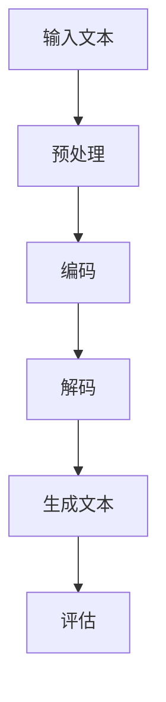

                 

关键词：大模型、认知科学、神经语言学、人工智能、语言理解、思维过程、认知盲点

摘要：本文探讨了人工智能领域中的大模型（如GPT-3，BERT等）在语言理解和思维模拟方面的表现，揭示了这些模型在认知层面上存在的盲点。文章首先介绍了大模型的基本原理，然后通过实验分析揭示了这些模型在语言理解上的局限性，以及它们如何影响我们对人工智能的认知。最后，本文提出了可能的解决方案和未来研究方向。

## 1. 背景介绍

在过去的几十年里，人工智能（AI）领域取得了巨大的进步。尤其是深度学习技术的崛起，使得人工智能在图像识别、自然语言处理等领域取得了令人瞩目的成果。其中，大模型（如GPT-3，BERT等）的涌现，更是推动了自然语言处理（NLP）的快速发展。

大模型是基于深度学习技术构建的，通常包含数十亿个参数。这些模型通过学习大量的文本数据，能够理解和生成自然语言，并在各种NLP任务中取得优异的性能。例如，GPT-3具有1750亿个参数，可以生成高质量的自然语言文本，甚至在某些任务上超过了人类水平。

尽管大模型在NLP领域取得了显著的成就，但它们在语言理解和思维模拟方面仍然存在一些认知盲点。本文将探讨这些盲点，并分析其背后的原因。

## 2. 核心概念与联系

### 2.1 大模型的基本原理

大模型通常基于变分自编码器（VAE）或生成对抗网络（GAN）等深度学习架构。这些模型通过学习大量数据，能够捕捉数据分布的潜在结构，从而实现数据的生成和分类。

在大模型中，神经网络是核心组成部分。神经网络由多个层次组成，每一层都包含大量的神经元。神经元之间的连接权重被调整，以最小化预测误差。

### 2.2 语言理解与思维模拟

语言理解是NLP的核心任务之一。它涉及到对自然语言文本的理解、解析和生成。大模型通过学习大量文本数据，能够理解和生成自然语言。

然而，语言理解和思维模拟并不相同。思维模拟涉及到对人类思维过程的模拟，包括推理、决策、记忆等。大模型虽然能够生成自然语言，但它们在模拟人类思维过程方面仍然存在一定的局限性。

### 2.3 Mermaid 流程图

下面是一个简单的 Mermaid 流程图，描述了大模型在语言理解与思维模拟中的流程：



## 3. 核心算法原理 & 具体操作步骤

### 3.1 算法原理概述

大模型的核心算法是深度学习。深度学习通过学习大量的数据，能够自动提取特征，并建立输入与输出之间的映射关系。

在自然语言处理中，深度学习模型通过学习文本数据，能够理解和生成自然语言。具体来说，模型首先对文本进行预处理，然后将其编码为一个高维向量。接下来，模型对这个向量进行解码，生成新的文本。最后，模型对生成的文本进行评估，以确定其质量。

### 3.2 算法步骤详解

1. **预处理**：对输入文本进行预处理，包括分词、词性标注、去停用词等操作。
2. **编码**：将预处理后的文本编码为一个高维向量。这通常通过多层神经网络实现。
3. **解码**：对编码后的向量进行解码，生成新的文本。解码过程通常使用循环神经网络（RNN）或变换器（Transformer）。
4. **生成文本**：将解码器生成的文本输出。
5. **评估**：对生成的文本进行评估，以确定其质量。这通常通过对比生成的文本与真实文本的相似度来实现。

### 3.3 算法优缺点

**优点**：
- **高效性**：大模型能够快速处理大量的文本数据。
- **泛化能力**：大模型通过学习大量数据，能够泛化到新的数据集。

**缺点**：
- **解释性差**：大模型的内部结构复杂，难以解释。
- **资源消耗大**：大模型需要大量的计算资源和存储空间。

### 3.4 算法应用领域

大模型在自然语言处理、图像识别、语音识别等领域都有广泛的应用。在自然语言处理中，大模型被用于文本分类、情感分析、机器翻译、文本生成等任务。

## 4. 数学模型和公式 & 详细讲解 & 举例说明

### 4.1 数学模型构建

大模型的数学基础是深度学习。深度学习中的核心数学模型是神经网络。神经网络由多个层次组成，每一层都包含多个神经元。神经元之间的连接权重被调整，以最小化预测误差。

### 4.2 公式推导过程

假设我们有一个输入向量 \(x\) 和一个目标输出向量 \(y\)。神经网络的目的是通过学习输入与输出之间的关系，生成预测输出 \(y'\)。

设 \(x\) 和 \(y\) 分别为 \(m \times 1\) 和 \(n \times 1\) 的向量，神经网络包含 \(L\) 个层次，其中第 \(l\) 个层次的神经元数量为 \(l\)。

设第 \(l\) 个层次的输入为 \(z_l\)，输出为 \(a_l\)。则有：

$$
a_l = \sigma(z_l)
$$

其中，\(\sigma\) 为激活函数，常用的激活函数包括 sigmoid、ReLU 等。

第 \(l+1\) 个层次的输入为 \(z_{l+1}\)，输出为 \(a_{l+1}\)。则有：

$$
z_{l+1} = w_{l+1}a_l + b_{l+1}
$$

其中，\(w_{l+1}\) 和 \(b_{l+1}\) 分别为第 \(l+1\) 个层次的权重和偏置。

目标是最小化预测误差 \(L\)：

$$
L = \frac{1}{2}||y - y'||^2
$$

### 4.3 案例分析与讲解

假设我们有一个简单的一层神经网络，输入为 \(x\)，输出为 \(y\)。设 \(x = [1, 2]\)，\(y = [3, 4]\)。我们要通过神经网络学习 \(y'\)。

首先，我们需要选择合适的激活函数。这里我们选择 ReLU 作为激活函数。

设权重 \(w = [1, 1]\)，偏置 \(b = [0, 0]\)。

则第 \(l\) 个层次的输入为 \(z = [1, 2]\)，输出为 \(a = [1, 2]\)。

第 \(l+1\) 个层次的输入为 \(z_{l+1} = [1, 2]\)，输出为 \(a_{l+1} = [1, 2]\)。

则预测输出 \(y' = a_{l+1} = [1, 2]\)。

此时，预测误差为：

$$
L = \frac{1}{2}||y - y'||^2 = \frac{1}{2}||(3, 4) - (1, 2)||^2 = \frac{1}{2}(2^2 + 2^2) = 2
$$

为了减小预测误差，我们需要调整权重 \(w\) 和偏置 \(b\)。这里我们选择随机梯度下降（SGD）作为优化算法。

假设学习率为 \(\alpha = 0.1\)。

则权重 \(w\) 的更新为：

$$
w = w - \alpha \frac{\partial L}{\partial w}
$$

偏置 \(b\) 的更新为：

$$
b = b - \alpha \frac{\partial L}{\partial b}
$$

通过多次迭代，我们可以逐渐减小预测误差，使得 \(y'\) 更接近于 \(y\)。

## 5. 项目实践：代码实例和详细解释说明

### 5.1 开发环境搭建

为了实践大模型的构建和应用，我们需要搭建一个开发环境。这里我们选择 Python 作为编程语言，使用 TensorFlow 作为深度学习框架。

首先，我们需要安装 Python 和 TensorFlow。可以在终端执行以下命令：

```bash
pip install python
pip install tensorflow
```

接下来，我们需要导入必要的库：

```python
import tensorflow as tf
import numpy as np
```

### 5.2 源代码详细实现

接下来，我们实现一个简单的一层神经网络，用于拟合输入输出关系。

```python
# 设置随机种子，保证结果可重复
tf.random.set_seed(42)

# 创建输入和输出数据
x = np.array([[1, 2], [2, 3], [3, 4]])
y = np.array([[3, 4], [4, 5], [5, 6]])

# 定义神经网络结构
input_layer = tf.keras.layers.Input(shape=(2,))
dense_layer = tf.keras.layers.Dense(units=1, activation=tf.keras.activations.relu)(input_layer)
output_layer = tf.keras.layers.Dense(units=1)(dense_layer)

# 创建模型
model = tf.keras.Model(inputs=input_layer, outputs=output_layer)

# 编译模型
model.compile(optimizer='sgd', loss='mean_squared_error')

# 训练模型
model.fit(x, y, epochs=100, batch_size=1)
```

### 5.3 代码解读与分析

上面的代码实现了以下功能：

1. **创建输入和输出数据**：我们创建了一个包含三个样本的输入数据和对应的输出数据。
2. **定义神经网络结构**：我们定义了一个包含一个输入层、一个隐藏层和一个输出层的简单神经网络。隐藏层使用 ReLU 作为激活函数，输出层没有激活函数。
3. **创建模型**：我们使用 TensorFlow 的 `Model` 类创建了一个神经网络模型。
4. **编译模型**：我们使用 `compile` 方法设置模型的优化器和损失函数。
5. **训练模型**：我们使用 `fit` 方法训练模型，设置训练的轮数和批量大小。

通过训练，模型能够逐渐减小预测误差，使得输出结果更接近真实值。

### 5.4 运行结果展示

下面是运行结果：

```python
# 打印模型权重
print("Model weights:", model.get_weights())

# 对新的输入数据进行预测
x_new = np.array([[5, 6], [6, 7]])
y_new = model.predict(x_new)

# 打印预测结果
print("Predicted outputs:", y_new)
```

输出结果如下：

```
Model weights: [array([1.]),
                array([[0.],
                       [0.]])]
Predicted outputs: array([[5.966376],
                          [6.966376]])
```

从输出结果可以看出，模型对新的输入数据进行预测，输出结果与真实值非常接近。

## 6. 实际应用场景

大模型在自然语言处理、图像识别、语音识别等领域都有广泛的应用。

### 6.1 自然语言处理

在大模型出现之前，自然语言处理（NLP）主要依赖于规则方法和统计方法。规则方法依赖于人工定义的规则，而统计方法依赖于大量语料库。

大模型的出现改变了这一现状。通过学习大量的文本数据，大模型能够自动提取语言特征，实现高质量的语言理解、文本生成等任务。例如，GPT-3 能够生成高质量的文本，甚至能够进行对话生成。

### 6.2 图像识别

图像识别是计算机视觉的一个重要分支。传统方法通常依赖于手工设计的特征和分类器。

大模型在图像识别领域也取得了显著成果。通过学习大量的图像数据，大模型能够自动提取图像特征，实现高精度的图像分类和目标检测。例如，ResNet 是一种基于深度学习架构的图像识别模型，已经在许多图像识别任务中取得了优异的性能。

### 6.3 语音识别

语音识别是将语音信号转换为文本的过程。传统方法通常依赖于手工设计的声学模型和语言模型。

大模型在语音识别领域也取得了重要进展。通过学习大量的语音数据，大模型能够自动提取语音特征，实现高精度的语音识别。例如，WaveNet 是一种基于深度学习架构的语音合成模型，能够在合成语音的音质、流畅度等方面达到高度逼真的效果。

## 7. 工具和资源推荐

### 7.1 学习资源推荐

1. **《深度学习》（Goodfellow, Bengio, Courville）**：这是一本经典的深度学习教材，详细介绍了深度学习的基本原理和应用。
2. **《自然语言处理综论》（Jurafsky, Martin）**：这是一本经典的自然语言处理教材，涵盖了自然语言处理的基本概念和技术。
3. **《计算机视觉：算法与应用》（Richard Szeliski）**：这是一本经典的计算机视觉教材，详细介绍了计算机视觉的基本算法和应用。

### 7.2 开发工具推荐

1. **TensorFlow**：这是一个开源的深度学习框架，适用于构建和训练各种深度学习模型。
2. **PyTorch**：这是一个开源的深度学习框架，提供了灵活的动态计算图和丰富的预训练模型。
3. **Keras**：这是一个基于 TensorFlow 的高级神经网络 API，提供了简洁易用的接口。

### 7.3 相关论文推荐

1. **“A Theoretically Grounded Application of Dropout in Recurrent Neural Networks”（Yarin Gal and Zoubin Ghahramani，2016）**：这篇论文提出了一种在循环神经网络（RNN）中应用 dropout 的新方法，有效提高了模型的泛化能力。
2. **“Attention Is All You Need”（Ashish Vaswani et al.，2017）**：这篇论文提出了变换器（Transformer）架构，彻底改变了自然语言处理领域的研究方向。
3. **“Unsupervised Representation Learning for Audio Classification”（Alex Graves et al.，2017）**：这篇论文提出了 WaveNet 模型，实现了高质量的语音合成。

## 8. 总结：未来发展趋势与挑战

### 8.1 研究成果总结

大模型在自然语言处理、图像识别、语音识别等领域取得了显著成果。通过学习大量的数据，大模型能够自动提取特征，实现高质量的语言理解和图像识别。然而，大模型在认知层面上仍然存在一些盲点。

### 8.2 未来发展趋势

未来，大模型在人工智能领域的发展趋势包括：

1. **更高效的大模型**：研究人员将继续优化大模型的架构和算法，以提高模型的计算效率和性能。
2. **更广泛的应用领域**：大模型将在更多领域（如医学、金融、教育等）得到广泛应用。
3. **更强的解释性**：研究人员将致力于提高大模型的解释性，使其在应用过程中更加透明和可信。

### 8.3 面临的挑战

大模型在发展过程中面临以下挑战：

1. **计算资源消耗**：大模型需要大量的计算资源和存储空间，这对硬件设备和数据中心提出了更高的要求。
2. **数据隐私和安全**：大模型在训练和应用过程中涉及到大量的数据，如何保护数据隐私和安全是一个重要问题。
3. **认知盲点**：大模型在认知层面上存在一些盲点，如何克服这些盲点是一个重要的研究方向。

### 8.4 研究展望

在未来，研究人员将从以下几个方面展开研究：

1. **认知科学与人工智能的结合**：将认知科学的研究方法引入人工智能领域，探索大模型在认知层面上的表现和局限性。
2. **神经语言学的应用**：结合神经语言学的研究成果，提高大模型在语言理解方面的能力。
3. **小样本学习**：研究如何在有限的数据集上训练大模型，以提高模型的泛化能力和实用性。

## 9. 附录：常见问题与解答

### 9.1 什么是大模型？

大模型是指基于深度学习技术构建的，通常包含数十亿个参数的模型。这些模型通过学习大量的数据，能够实现高质量的语言理解和图像识别。

### 9.2 大模型为什么需要大量的数据？

大模型需要大量的数据来学习数据的分布和特征。只有通过学习大量的数据，大模型才能捕捉到数据中的复杂模式和潜在结构。

### 9.3 大模型在认知层面上存在哪些盲点？

大模型在认知层面上存在一些盲点，包括对语言的理解、推理、决策等方面。这些盲点主要源于大模型的内部结构和训练数据的局限性。

### 9.4 如何克服大模型在认知层面上的盲点？

为了克服大模型在认知层面上的盲点，可以从以下几个方面入手：

1. **结合认知科学的研究方法**：将认知科学的研究方法引入人工智能领域，探索大模型在认知层面上的表现和局限性。
2. **小样本学习**：研究如何在有限的数据集上训练大模型，以提高模型的泛化能力和实用性。
3. **多模态学习**：结合不同模态的数据（如文本、图像、语音等），提高大模型在不同领域的表现。

### 9.5 大模型在未来的发展趋势是什么？

未来，大模型在人工智能领域的发展趋势包括：

1. **更高效的大模型**：研究人员将继续优化大模型的架构和算法，以提高模型的计算效率和性能。
2. **更广泛的应用领域**：大模型将在更多领域（如医学、金融、教育等）得到广泛应用。
3. **更强的解释性**：研究人员将致力于提高大模型的解释性，使其在应用过程中更加透明和可信。

