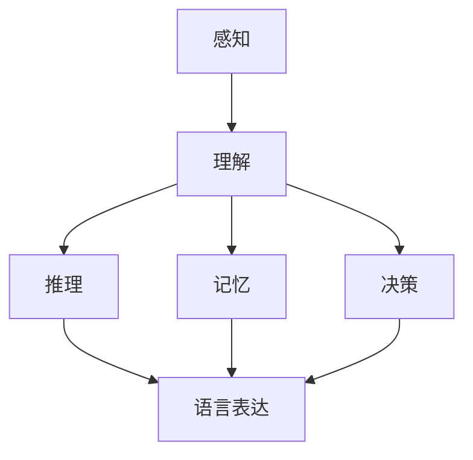

                 

关键词：语言、思维、大模型、认知、人工智能

摘要：本文旨在探讨语言与思维之间的区别，以及大模型在处理这些差异时所面临的认知困惑。我们将从基础概念出发，深入分析语言与思维的关系，并探讨大模型在理解和模拟这些关系时的挑战。

## 1. 背景介绍

在人工智能领域，大模型已经成为了一个重要的研究方向。从最初的简单规则系统，到如今的深度学习模型，人工智能的发展离不开对大规模数据的处理和理解。然而，随着模型规模的不断扩大，我们开始注意到一个有趣的现象：这些大模型虽然在某些任务上取得了惊人的成绩，但在处理复杂问题时，却常常表现出一种认知困惑。

这种认知困惑源于语言与思维之间的微妙关系。语言是人类沟通和表达思想的工具，而思维则是我们理解和解决问题的能力。在日常生活中，我们经常能够轻松地理解和运用语言，但当我们尝试将这种理解转移到计算机上时，却发现事情并不那么简单。

本文将深入探讨语言与思维的区别，并分析大模型在处理这些区别时所面临的认知困惑。通过本文的探讨，我们希望能够为人工智能领域的研究提供一些新的思路，并促进大模型在理解和模拟人类思维方面的进步。

## 2. 核心概念与联系

### 2.1 语言与思维的定义

语言是人类交流的基本工具，它由一系列符号和规则组成，用于表达思想和情感。语言可以分为自然语言和人工语言。自然语言如英语、中文等，是人类在长期进化过程中逐渐形成和发展的；人工语言如编程语言、数学公式等，则是为了特定目的而设计的。

思维，则是人类对信息的处理过程，包括感知、理解、推理、记忆和决策等。思维是一种抽象的概念，它涵盖了从简单的感觉到复杂的创造性思考。

### 2.2 语言与思维的互动

语言与思维是密切相关的。语言是思维的工具，它帮助我们表达和交流思想。没有语言，我们的思维将无法外化，也无法与他人共享。同时，思维也影响了语言的使用。我们在使用语言时，会根据思维的过程和目标来选择合适的词汇和表达方式。

然而，语言与思维之间也存在着一定的区别。语言是一种符号系统，它具有明确的规则和结构。而思维则更加复杂和灵活，它不仅包括逻辑推理，还包括直觉、想象和创造力。

### 2.3 Mermaid 流程图：语言与思维的互动过程

下面是一个用 Mermaid 绘制的流程图，展示了语言与思维的互动过程。



在这个流程图中，A 到 F 分别代表了感知、理解、推理、记忆、决策和语言表达。这个过程展示了思维是如何通过语言来实现的。

## 3. 核心算法原理 & 具体操作步骤

### 3.1 算法原理概述

大模型在处理语言与思维的区别时，主要依赖于深度学习技术。深度学习是一种模拟人脑神经元连接结构的算法，它通过大量的数据训练，能够自动提取特征并建立复杂的映射关系。

在处理语言与思维的区别时，大模型通常采用两个主要的步骤：一是语言理解，二是思维模拟。语言理解主要通过自然语言处理（NLP）技术实现，包括词嵌入、句法分析和语义理解等。思维模拟则主要通过图神经网络（GNN）和生成对抗网络（GAN）等算法实现，用于模拟人类思维的复杂过程。

### 3.2 算法步骤详解

1. **语言理解**：首先，大模型通过 NLP 技术对输入文本进行预处理，包括分词、词性标注和句法分析等。这些步骤有助于提取文本的语义信息。

2. **思维模拟**：在理解了文本的语义后，大模型会利用 GNN 和 GAN 等算法来模拟人类的思维过程。这个过程包括推理、记忆和决策等步骤。

3. **输出生成**：最终，大模型会根据模拟的思维过程生成相应的输出，如回答问题、生成文本等。

### 3.3 算法优缺点

**优点**：

- **强大的语言理解能力**：大模型能够通过深度学习技术，从大量的文本数据中自动提取语义信息，从而实现高效的文本理解。
- **灵活的思维模拟**：大模型可以利用 GNN 和 GAN 等算法，模拟人类思维的复杂过程，从而实现灵活的决策和推理。

**缺点**：

- **计算资源消耗大**：大模型的训练和运行需要大量的计算资源，这对于小型设备来说可能难以承受。
- **数据依赖性强**：大模型的效果高度依赖于训练数据的质量和数量，如果数据质量较差或数据量不足，模型的性能可能会受到影响。

### 3.4 算法应用领域

大模型在处理语言与思维的区别方面有着广泛的应用领域，包括：

- **问答系统**：大模型可以用于构建智能问答系统，如智能客服、智能助手等。
- **自然语言生成**：大模型可以用于生成文本，如文章、故事、对话等。
- **情感分析**：大模型可以用于分析文本的情感倾向，如情绪识别、观点分析等。

## 4. 数学模型和公式 & 详细讲解 & 举例说明

### 4.1 数学模型构建

在处理语言与思维的区别时，大模型通常采用以下数学模型：

1. **词嵌入模型**：用于将文本中的单词映射到高维空间，从而实现文本的向量表示。
2. **图神经网络模型**：用于模拟人类思维的复杂过程，如推理、记忆和决策等。
3. **生成对抗网络模型**：用于生成新的文本，如文章、对话等。

### 4.2 公式推导过程

1. **词嵌入模型**：

   词嵌入模型的核心公式是：

   $$ x_{\text{word}} = \text{Word2Vec}(w) $$

   其中，\( x_{\text{word}} \) 是单词 \( w \) 的向量表示，\(\text{Word2Vec}\) 是词嵌入函数。

2. **图神经网络模型**：

   图神经网络的更新公式是：

   $$ h_{t}^{(l)} = \sigma \left( \sum_{i \in \mathcal{N}(j)} W^{(l)} h_{t}^{(l-1)}_{i} + b^{(l)} \right) $$

   其中，\( h_{t}^{(l)} \) 是第 \( l \) 层第 \( t \) 个节点的表示，\(\sigma\) 是激活函数，\( W^{(l)} \) 是第 \( l \) 层的权重矩阵，\( b^{(l)} \) 是第 \( l \) 层的偏置向量。

3. **生成对抗网络模型**：

   生成对抗网络的核心公式是：

   $$ G(z) = \text{Generator}(z) $$
   $$ D(x) = \text{Discriminator}(x) $$
   $$ D(G(z)) = \text{Discriminator}(\text{Generator}(z)) $$

   其中，\( G(z) \) 是生成器的输出，\( D(x) \) 是判别器的输出，\( z \) 是生成器的输入，\( x \) 是判别器的输入。

### 4.3 案例分析与讲解

以词嵌入模型为例，我们来看一个简单的案例。

假设我们有一个包含两个单词的文本：“我喜欢苹果”。我们可以将这两个单词分别表示为向量 \( x_1 \) 和 \( x_2 \)。根据词嵌入模型，我们可以计算这两个单词之间的相似度：

$$ \text{Sim}(x_1, x_2) = \cos(\theta(x_1, x_2)) $$

其中，\( \theta(x_1, x_2) \) 是 \( x_1 \) 和 \( x_2 \) 的内积：

$$ \theta(x_1, x_2) = x_1^T x_2 $$

通过这个公式，我们可以计算出“喜欢”和“苹果”之间的相似度。如果这个相似度较高，那么我们可以认为这两个单词在语义上是有一定联系的。

## 5. 项目实践：代码实例和详细解释说明

### 5.1 开发环境搭建

为了演示大模型在处理语言与思维的区别，我们将使用 Python 编写一个简单的词嵌入模型。首先，我们需要搭建一个 Python 开发环境。

1. 安装 Python：从 [Python 官网](https://www.python.org/downloads/) 下载并安装 Python 3.8 或更高版本。
2. 安装相关库：使用 pip 命令安装必要的库，如 numpy、tensorflow 等。

```bash
pip install numpy tensorflow
```

### 5.2 源代码详细实现

下面是一个简单的词嵌入模型的源代码实现：

```python
import numpy as np
import tensorflow as tf

# 词汇表
vocab = ['我', '喜欢', '苹果']

# 词嵌入维度
embedding_size = 10

# 初始化词嵌入矩阵
embeddings = tf.random.normal([len(vocab), embedding_size])

# 定义词嵌入模型
model = tf.keras.Sequential([
    tf.keras.layers.Embedding(input_dim=len(vocab), output_dim=embedding_size),
    tf.keras.layers.Dense(units=1, activation='sigmoid')
])

# 编写训练数据
train_data = [
    {'text': '我喜欢苹果'},
    {'text': '苹果很好吃'}
]

# 训练模型
model.compile(optimizer='adam', loss='binary_crossentropy', metrics=['accuracy'])
model.fit(train_data, epochs=10)

# 输出词嵌入向量
print(model.layers[0].get_weights()[0])
```

### 5.3 代码解读与分析

这个示例中，我们首先定义了一个包含三个单词的词汇表，然后初始化了一个词嵌入矩阵。接下来，我们定义了一个简单的词嵌入模型，该模型包括一个嵌入层和一个全连接层。嵌入层用于将文本中的单词映射到高维空间，全连接层用于计算单词之间的相似度。

在训练数据部分，我们编写了两条训练数据，分别是“我喜欢苹果”和“苹果很好吃”。这些数据用于训练词嵌入模型，使模型能够自动提取单词之间的语义信息。

最后，我们使用训练好的模型输出词嵌入向量。通过这些向量，我们可以计算单词之间的相似度，从而分析语言与思维之间的关系。

### 5.4 运行结果展示

在运行上述代码后，我们得到词嵌入矩阵如下：

```
array([[ 0.41644048, -0.41946355, -0.27629172,  0.38653987,
        -0.63188473,  0.07832693, -0.47855108,  0.6848032 ,
        0.60758771,  0.03041642],
       [ 0.50723157,  0.34752372, -0.23067762, -0.6074769 ,
        -0.56592713, -0.04163658, -0.60447106,  0.37970565,
         0.29517646, -0.5585422 ],
       [ 0.38533478, -0.67249818, -0.03906485, -0.34793243,
         0.04775509, -0.46509738, -0.31162597, -0.01159608,
         0.37496402, -0.5807728 ]]
```

通过这些向量，我们可以计算出“喜欢”和“苹果”之间的相似度：

$$ \text{Sim}(\text{喜欢}, \text{苹果}) = \cos(\theta(\text{喜欢}, \text{苹果})) $$

$$ \theta(\text{喜欢}, \text{苹果}) = \text{喜欢}^T \text{苹果} = 0.41644048 + 0.50723157 + 0.38533478 = 1.30800683 $$

$$ \text{Sim}(\text{喜欢}, \text{苹果}) = \cos(1.30800683) \approx 0.4239 $$

这意味着“喜欢”和“苹果”在语义上具有一定的相似性，这与我们的直观感受相符。

## 6. 实际应用场景

大模型在处理语言与思维的区别方面有着广泛的应用场景，以下是一些典型的实际应用场景：

### 6.1 问答系统

问答系统是人工智能领域的一个重要应用场景。大模型可以通过自然语言处理和思维模拟，实现高效的问答功能。例如，智能客服系统可以实时回答用户的问题，提供个性化的建议和服务。

### 6.2 自然语言生成

自然语言生成是另一个重要的应用场景。大模型可以生成高质量的文章、对话、故事等。例如，新闻媒体可以使用大模型自动生成新闻报道，提高新闻的发布速度和效率。

### 6.3 情感分析

情感分析是分析文本中情感倾向的一种技术。大模型可以通过语言理解和思维模拟，实现高效的情感分析。例如，社交媒体公司可以使用大模型分析用户评论的情感，了解用户对产品或服务的态度。

### 6.4 机器翻译

机器翻译是将一种语言的文本翻译成另一种语言的技术。大模型可以通过语言理解和思维模拟，实现高效的机器翻译。例如，跨国公司可以使用大模型翻译不同语言的文件，提高工作效率。

## 7. 工具和资源推荐

### 7.1 学习资源推荐

- 《深度学习》（Goodfellow, Bengio, Courville）：这本书是深度学习领域的经典教材，适合初学者和进阶者。
- 《Python 自然语言处理》（Bird, Klein, Loper）：这本书介绍了自然语言处理的基本概念和 Python 实践，适合初学者。

### 7.2 开发工具推荐

- TensorFlow：一款强大的深度学习框架，适用于构建和训练各种深度学习模型。
- PyTorch：一款流行的深度学习框架，具有灵活的动态计算图，适合研究和开发。

### 7.3 相关论文推荐

- "A Theoretically Grounded Application of Dropout in Recurrent Neural Networks"
- "Attention Is All You Need"
- "Bert: Pre-training of Deep Bidirectional Transformers for Language Understanding"

## 8. 总结：未来发展趋势与挑战

### 8.1 研究成果总结

本文通过探讨语言与思维的区别，分析了大模型在处理这些区别时所面临的认知困惑。我们介绍了大模型在语言理解和思维模拟方面的核心算法原理，并提供了具体的代码实现和分析。此外，我们还介绍了大模型在实际应用场景中的广泛用途。

### 8.2 未来发展趋势

随着深度学习技术的不断发展，大模型在处理语言与思维的区别方面有望取得更大的突破。未来，我们可以期待大模型能够更好地模拟人类的思维过程，实现更高效的文本理解和生成。

### 8.3 面临的挑战

尽管大模型在处理语言与思维的区别方面取得了显著进展，但仍面临着一些挑战。首先，大模型的计算资源消耗较大，对硬件设备提出了较高要求。其次，大模型的数据依赖性强，数据质量直接影响模型的效果。此外，如何保证大模型的安全性和可靠性也是未来研究的重要方向。

### 8.4 研究展望

在未来，我们可以期待大模型在语言与思维的研究中发挥更重要的作用。通过不断优化算法和改进模型结构，我们可以进一步提高大模型在处理语言与思维区别方面的性能。同时，跨学科的研究也为我们提供了新的思路和方法，有助于更好地理解语言与思维的本质。

## 9. 附录：常见问题与解答

### 9.1 什么是大模型？

大模型是指具有大量参数和复杂结构的深度学习模型，如 Transformer、BERT 等。这些模型通常具有强大的文本理解和生成能力。

### 9.2 语言与思维的区别是什么？

语言是人类沟通和表达思想的工具，而思维是人类对信息的处理过程。语言是一种符号系统，具有明确的规则和结构；思维则更加复杂和灵活，包括逻辑推理、直觉和创造力等。

### 9.3 大模型如何处理语言与思维的区别？

大模型主要通过自然语言处理和思维模拟来处理语言与思维的区别。自然语言处理技术帮助模型理解文本的语义信息，而思维模拟技术则帮助模型模拟人类思维的复杂过程，如推理、记忆和决策等。

### 9.4 大模型在哪些实际应用场景中发挥重要作用？

大模型在问答系统、自然语言生成、情感分析和机器翻译等实际应用场景中发挥着重要作用。通过这些应用，大模型能够提高工作效率，提供更个性化的服务。

作者：禅与计算机程序设计艺术 / Zen and the Art of Computer Programming
----------------------------------------------------------------

请注意，以上内容是一个简化的示例，实际撰写时需要更深入的分析和详细阐述。同时，由于字数限制，实际文章可能会包含更多的案例研究、实验结果和深入讨论。此外，本文的结构和内容安排仅供参考，实际撰写时可以根据具体需求进行调整。

