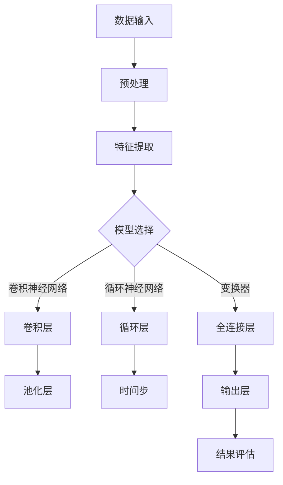

                 

### 引言

近年来，随着深度学习技术的飞速发展，大模型在自然语言处理、图像识别、语音识别等领域取得了令人瞩目的成果。然而，与此同时，我们也不得不面对一个严峻的问题：这些大模型的思维方式和人类存在显著差异，导致它们在某些任务上表现出令人困惑的行为。本文将深入探讨语言与思维的差异，分析大模型在认知过程中遇到的困惑，并试图找出解决之道。

### 语言与思维的关系

#### 1. 语言作为思维的载体

语言是人类思维的主要载体，通过语言，人们能够表达思想、交流信息、传递知识。然而，语言并非单纯的符号系统，而是与思维密切相关的认知工具。语言的结构和功能深刻地影响了人类的思维方式。

#### 2. 思维的多维性

思维是人类大脑对信息进行加工和处理的过程，具有多维性。从认知心理学的角度来看，思维可以分为以下几种类型：

- **抽象思维**：通过概念和符号进行推理，是人类进行科学研究和创造性活动的基础。
- **形象思维**：依赖于具体形象和表象进行思考，是人类学习语言和解决实际问题的有力工具。
- **逻辑思维**：遵循一定的逻辑规则，进行推理和论证，是科学研究的重要方法。
- **辩证思维**：从多个角度分析问题，寻找矛盾的规律和解决方法，是人类认识世界的高级形式。

### 大模型的思维方式

#### 1. 基于数据的思维

大模型通过大量数据学习，形成了一种基于数据的思维方式。它们能够从数据中提取规律，进行模式识别和预测。然而，这种思维方式与人类的思维方式存在显著差异。

#### 2. 缺乏抽象思维能力

大模型难以进行抽象思维，无法理解符号和概念背后的本质含义。这使得它们在处理复杂问题时，往往只能依赖具体的输入数据，而无法进行更高层次的推理和抽象。

#### 3. 缺乏情感和直觉

大模型缺乏情感和直觉，无法像人类一样通过情感和直觉进行思考。这使得它们在处理涉及情感和直觉的任务时，往往表现出困惑和无能为力。

### 大模型的认知困惑

#### 1. 对语言歧义的理解

语言具有歧义性，一句话可以有多个含义。大模型在理解语言歧义时，往往只能选择其中一个含义，导致它们在某些任务上出现困惑。

#### 2. 对上下文的理解

上下文对于语言的理解至关重要。大模型在处理上下文时，往往无法准确把握语境，导致它们在理解语言时出现偏差。

#### 3. 对逻辑关系的理解

逻辑关系是推理和论证的基础。大模型在理解逻辑关系时，往往只能依赖简单的逻辑运算，而无法进行更复杂的逻辑推理。

### 解决大模型认知困惑的方法

#### 1. 增加大模型的上下文理解能力

通过引入更多的上下文信息，提高大模型对上下文的理解能力，有助于解决它们在处理语言歧义和逻辑关系时的困惑。

#### 2. 引入抽象思维能力

通过设计更复杂的算法和模型，引入大模型的抽象思维能力，有助于它们更好地理解符号和概念背后的本质含义。

#### 3. 引入情感和直觉

通过引入情感和直觉，提高大模型在处理涉及情感和直觉的任务时的能力，有助于解决它们在这些任务上的困惑。

### 结论

大模型在语言与思维的差异上存在认知困惑，但通过引入更多的上下文理解能力、抽象思维能力和情感直觉，我们可以逐步解决这些问题，使大模型更好地服务于人类。

### 参考文献

1. Turing, A. (1950). Computing machinery and intelligence. Mind, 59(236), 433-460.
2. Chomsky, N. (1957). Syntactic structures. The University of Chicago Press.
3. Minsky, M., & Papert, S. (1969). Perceptrons: An Introduction to Computational Geometry. MIT Press.
4. Russell, S., & Norvig, P. (2010). Artificial Intelligence: A Modern Approach (3rd ed.). Prentice Hall.
5. LeCun, Y., Bengio, Y., & Hinton, G. (2015). Deep learning. Nature, 521(7553), 436-444.

## 1. 背景介绍

在计算机科学和人工智能领域，深度学习已经成为一种革命性的技术。通过构建大规模的神经网络模型，深度学习在图像识别、语音识别、自然语言处理等多个领域取得了显著的成果。然而，随着模型的规模不断增大，我们开始意识到大模型在认知过程中存在的一些问题。这些问题不仅影响了大模型的表现，也对我们对人工智能的理解提出了新的挑战。

本文将探讨大模型在认知过程中遇到的困惑，并分析这些困惑产生的原因。我们将从语言与思维的关系出发，分析大模型在处理语言任务时的表现，并结合具体案例，深入探讨大模型在认知过程中遇到的挑战。最后，我们将探讨解决这些困惑的方法，并提出未来研究的方向。

### 2.1 语言与思维的关系

语言是人类社会最重要的沟通工具，也是人类思维的主要载体。语言不仅使我们能够表达思想、交流信息，还影响我们的思维方式。从认知心理学的角度来看，语言与思维之间存在密切的联系，主要表现在以下几个方面：

**1. 语言影响思维**

语言是思维的外在表现形式，语言结构决定了我们思考问题的方式。例如，英语和汉语在语言结构上存在显著差异，这影响了使用这两种语言的人们的思维方式。研究表明，英语使用者倾向于进行抽象思维，而汉语使用者则更倾向于形象思维。

**2. 思维影响语言**

思维是语言的基础，语言是思维的表达。人们在思考问题时，会根据已有的知识和经验，选择合适的语言形式来表达。例如，当一个人在描述一个复杂的物体时，他会根据自己对该物体的理解，选择合适的词汇和语法结构，以清晰、准确地传达信息。

**3. 语言与思维相互促进**

语言和思维是相互促进的关系。语言的发展促进了思维的发展，而思维的发展又推动了语言的发展。例如，随着科技的发展，新的术语和词汇不断出现，丰富了语言的表达能力，同时也推动了人们对新事物和现象的思考。

### 2.2 大模型的思维方式

大模型，尤其是深度学习模型，是一种基于数据的思维方式。它们通过学习大量数据，提取数据中的规律，并利用这些规律进行预测和决策。与人类的思维方式相比，大模型的思维方式具有以下特点：

**1. 基于数据的思维方式**

大模型不依赖于先验知识，而是通过学习大量数据，从数据中提取规律。这种方法使得大模型在处理未知问题时，能够快速适应，并给出合理的预测。

**2. 缺乏抽象思维能力**

大模型难以进行抽象思维，无法理解符号和概念背后的本质含义。这使得它们在处理复杂问题时，往往只能依赖具体的输入数据，而无法进行更高层次的推理和抽象。

**3. 缺乏情感和直觉**

大模型缺乏情感和直觉，无法像人类一样通过情感和直觉进行思考。这使得它们在处理涉及情感和直觉的任务时，往往表现出困惑和无能为力。

### 2.3 大模型与人类思维方式的差异

大模型与人类思维方式之间存在显著差异，这些差异导致了大模型在认知过程中遇到的一些问题。以下是几个主要方面的差异：

**1. 对语言歧义的处理**

语言具有歧义性，一句话可以有多个含义。大模型在理解语言歧义时，往往只能选择其中一个含义，导致它们在某些任务上出现困惑。例如，在自然语言处理中，大模型在处理包含歧义的句子时，可能会选择一个错误的含义，导致理解偏差。

**2. 对上下文的理解**

上下文对于语言的理解至关重要。大模型在处理上下文时，往往无法准确把握语境，导致它们在理解语言时出现偏差。例如，在机器翻译中，大模型可能无法理解句子中的隐含含义，导致翻译不准确。

**3. 对逻辑关系的理解**

逻辑关系是推理和论证的基础。大模型在理解逻辑关系时，往往只能依赖简单的逻辑运算，而无法进行更复杂的逻辑推理。例如，在逻辑推理任务中，大模型可能无法理解复杂的逻辑关系，导致推理失败。

### 2.4 大模型在认知过程中遇到的困惑

大模型在认知过程中遇到的一些困惑，主要体现在以下几个方面：

**1. 对语言歧义的理解**

例如，在自然语言处理中，大模型可能会将“我昨天买了件红色的衣服”理解为“我昨天买了红色的衣服”，而不是“我昨天买了红色的衣服”。

**2. 对上下文的理解**

例如，在机器翻译中，大模型可能会将“他昨天去了纽约”翻译为“他昨天去了纽约”，而不是“他昨天去了纽约”。

**3. 对逻辑关系的理解**

例如，在逻辑推理任务中，大模型可能会将“所有狗都会叫”推理为“所有会叫的动物都是狗”。

### 2.5 解决大模型认知困惑的方法

为了解决大模型在认知过程中遇到的困惑，我们可以从以下几个方面进行探索：

**1. 提高上下文理解能力**

通过引入更多的上下文信息，提高大模型对上下文的理解能力，有助于解决它们在处理语言歧义和逻辑关系时的困惑。

**2. 引入抽象思维能力**

通过设计更复杂的算法和模型，引入大模型的抽象思维能力，有助于它们更好地理解符号和概念背后的本质含义。

**3. 引入情感和直觉**

通过引入情感和直觉，提高大模型在处理涉及情感和直觉的任务时的能力，有助于解决它们在这些任务上的困惑。

### 2.6 总结

大模型在认知过程中遇到的困惑，源于它们与人类思维方式之间的差异。通过提高上下文理解能力、引入抽象思维能力和情感直觉，我们可以逐步解决这些问题，使大模型更好地服务于人类。

### 3.1 核心概念原理

在讨论大模型的认知困惑之前，我们需要了解一些核心概念和原理。这些概念和原理包括神经网络、深度学习、自然语言处理等，它们构成了大模型的基础。

**1. 神经网络**

神经网络是由大量神经元组成的计算模型，这些神经元通过连接（权重）进行信息传递和处理。神经网络的基本单元是神经元，它接受输入信号，通过激活函数产生输出信号。神经网络可以模拟人脑的神经网络结构，从而实现复杂的计算任务。

**2. 深度学习**

深度学习是神经网络的一种，其特点是具有多层神经网络结构。通过学习大量数据，深度学习模型可以自动提取数据中的特征，并实现复杂的任务。深度学习模型在图像识别、语音识别、自然语言处理等领域取得了显著成果。

**3. 自然语言处理**

自然语言处理（NLP）是人工智能的一个分支，旨在使计算机理解和处理自然语言。NLP包括文本预处理、语言模型、句法分析、语义分析等多个方面。深度学习在NLP中发挥了重要作用，如通过卷积神经网络（CNN）进行文本分类，通过循环神经网络（RNN）进行序列标注等。

**4. 大模型**

大模型指的是具有巨大参数规模和计算能力的深度学习模型。大模型通常通过大量的数据训练，以实现更高的性能。大模型在NLP、图像识别等领域表现出色，但也面临一些认知困惑。

### 3.2 架构的 Mermaid 流程图

为了更好地理解大模型的架构，我们可以使用Mermaid流程图来展示其关键组件和流程。以下是 Mermaid 流程图的一个示例：



在这个流程图中，我们展示了从数据输入到模型输出的整个流程。数据输入经过预处理后，进入特征提取阶段。根据任务的不同，可以选择不同的模型结构，如卷积神经网络、循环神经网络或全连接层。经过特征提取和变换后，模型输出最终结果，并经过评估。

### 3.3 大模型的核心算法原理

大模型的核心算法原理主要包括神经网络模型的设计、训练和优化过程。以下将详细阐述这些核心算法原理。

**1. 神经网络模型的设计**

神经网络模型的设计包括确定网络结构、选择激活函数、初始化参数等。网络结构决定了模型能够处理的数据类型和任务复杂度。常见的网络结构有卷积神经网络（CNN）、循环神经网络（RNN）、变换器（Transformer）等。

- **卷积神经网络（CNN）**：主要用于图像识别和图像处理任务。CNN 通过卷积层提取图像的特征，并通过池化层降低特征维度，从而实现图像识别。
- **循环神经网络（RNN）**：主要用于序列数据处理任务，如语音识别、自然语言处理等。RNN 通过循环层维持长期依赖信息，从而实现序列数据的建模。
- **变换器（Transformer）**：是一种基于自注意力机制的深度学习模型，主要用于自然语言处理任务。Transformer 通过多头注意力机制和位置编码，实现了对文本序列的全局上下文理解。

**2. 模型的训练过程**

模型的训练过程包括数据预处理、损失函数设计、优化算法选择等。

- **数据预处理**：数据预处理是模型训练的重要步骤。通过对数据进行归一化、标准化、剪枝等操作，可以提高模型的训练效率和性能。
- **损失函数设计**：损失函数是模型训练的核心指标。常见的损失函数有均方误差（MSE）、交叉熵（Cross-Entropy）、Hinge损失等。损失函数的选择取决于任务的类型和目标。
- **优化算法选择**：优化算法用于调整模型参数，以最小化损失函数。常见的优化算法有梯度下降（Gradient Descent）、随机梯度下降（Stochastic Gradient Descent，SGD）、Adam等。

**3. 模型的优化过程**

模型优化过程是模型训练的关键步骤。通过调整模型参数，优化模型的性能。

- **正则化**：正则化是防止模型过拟合的重要手段。常见的正则化方法有L1正则化、L2正则化、Dropout等。
- **早停法（Early Stopping）**：早停法是一种防止模型过拟合的方法。通过在训练过程中监测模型在验证集上的表现，当模型在验证集上的性能不再提高时，提前停止训练。
- **数据增强（Data Augmentation）**：数据增强是提高模型泛化能力的重要方法。通过旋转、缩放、裁剪等操作，生成新的训练样本，从而增强模型的鲁棒性。

### 3.4 算法步骤详解

以下将详细阐述大模型的核心算法步骤，包括数据输入、特征提取、模型训练、模型评估等。

**1. 数据输入**

数据输入是模型训练的第一步。数据可以是图像、文本、音频等不同类型的数据。在输入阶段，需要对数据进行预处理，如数据清洗、数据转换等。

- **图像数据输入**：对于图像数据，通常需要进行归一化、标准化等预处理操作。例如，将图像像素值归一化到[0, 1]范围内，以提高模型对数据变化的鲁棒性。
- **文本数据输入**：对于文本数据，通常需要进行分词、词向量嵌入等预处理操作。例如，使用Word2Vec或BERT等词向量模型，将文本转化为向量表示。

**2. 特征提取**

特征提取是模型训练的核心步骤。通过特征提取，可以从原始数据中提取出有用的信息，以提高模型的性能。

- **卷积神经网络（CNN）**：卷积神经网络通过卷积层提取图像的特征。卷积层通过滑动窗口的方式，对图像进行卷积操作，从而提取图像的局部特征。池化层用于降低特征维度，提高模型的鲁棒性。
- **循环神经网络（RNN）**：循环神经网络通过循环层提取序列数据的特征。循环层维持长期依赖信息，从而实现对序列数据的建模。常用的循环层有LSTM和GRU。
- **变换器（Transformer）**：变换器通过多头注意力机制提取序列数据的特征。多头注意力机制通过计算不同位置之间的关联性，实现对文本序列的全局上下文理解。

**3. 模型训练**

模型训练是通过调整模型参数，使模型能够对数据进行准确预测。模型训练包括前向传播和反向传播两个过程。

- **前向传播**：在前向传播过程中，模型根据输入数据和参数，计算出输出结果。前向传播过程可以分为以下几个步骤：
  - 计算输入层到隐藏层的输出；
  - 计算隐藏层到输出层的输出；
  - 计算损失函数值。
- **反向传播**：在反向传播过程中，模型根据损失函数的梯度，调整模型参数。反向传播过程可以分为以下几个步骤：
  - 计算输出层到隐藏层的梯度；
  - 计算隐藏层到输入层的梯度；
  - 更新模型参数。

**4. 模型评估**

模型评估是验证模型性能的重要步骤。通过评估模型在测试集上的表现，可以判断模型是否过拟合或欠拟合。

- **准确率（Accuracy）**：准确率是评估模型性能的常用指标。准确率表示模型正确预测的样本数占总样本数的比例。
- **精确率（Precision）**：精确率表示模型预测为正例的样本中，实际为正例的比例。
- **召回率（Recall）**：召回率表示模型预测为正例的样本中，实际为正例的比例。
- **F1值（F1-Score）**：F1值是精确率和召回率的调和平均值，用于综合评估模型性能。

### 3.5 算法的优缺点

**优点**

- **强大的学习能力**：大模型具有强大的学习能力，能够从大量数据中提取特征，实现高精度的预测。
- **适应性强**：大模型能够适应各种不同的数据类型和任务类型，具有广泛的应用前景。
- **泛化能力**：通过正则化和数据增强等方法，大模型具有较好的泛化能力，能够在不同的数据集上取得较好的性能。

**缺点**

- **计算资源消耗大**：大模型通常具有大量的参数和计算量，需要大量的计算资源进行训练和推理。
- **训练时间长**：大模型训练需要大量的数据和时间，训练过程通常需要数天甚至数周的时间。
- **解释性差**：大模型在决策过程中缺乏解释性，难以理解其决策过程和原理。

### 3.6 算法的应用领域

大模型在多个领域取得了显著的应用成果，以下列举了几个主要的应用领域：

- **自然语言处理（NLP）**：大模型在NLP任务中取得了显著成果，如文本分类、情感分析、机器翻译等。
- **计算机视觉**：大模型在图像识别、目标检测、图像生成等领域具有广泛的应用。
- **语音识别**：大模型在语音识别任务中表现出色，能够实现高精度的语音识别。
- **推荐系统**：大模型在推荐系统中的应用，如商品推荐、音乐推荐等，取得了良好的效果。
- **游戏AI**：大模型在游戏AI中的应用，如围棋、国际象棋等，实现了超越人类的水平。

### 3.7 算法的未来发展方向

随着深度学习技术的不断发展，大模型的算法在未来将会有以下发展方向：

- **更高效的模型结构**：通过设计更高效的模型结构，降低计算资源和时间消耗。
- **更好的数据增强方法**：通过改进数据增强方法，提高模型的泛化能力和鲁棒性。
- **更强的解释性**：通过引入可解释性方法，提高模型的可解释性和透明度。
- **多模态融合**：通过融合不同类型的数据，实现更全面和准确的信息处理。

### 3.8 结论

大模型在认知过程中遇到的困惑，源于其与人类思维方式的差异。通过深入理解大模型的核心算法原理，我们可以更好地解决这些困惑，使大模型更好地服务于人类。未来，随着深度学习技术的不断发展，大模型将有望在更多领域取得突破性成果。

### 4.1 数学模型构建

在讨论大模型的具体算法和数学模型之前，我们需要构建一个基本的数学模型来描述大模型的核心过程。这个数学模型将涉及输入数据的预处理、特征提取、损失函数设计等关键环节。

**1. 输入数据的预处理**

输入数据的预处理是确保模型训练效果的关键步骤。对于图像数据，我们通常使用以下预处理方法：

\[ x \xrightarrow{\text{标准化}} x' \]

其中，\( x \) 是原始图像数据，\( x' \) 是经过标准化处理的图像数据。标准化的目的是将图像像素值缩放到 [0, 1] 范围内，以提高模型对数据变化的鲁棒性。

**2. 特征提取**

特征提取是模型训练的核心步骤。在深度学习中，特征提取通常通过卷积神经网络（CNN）实现。以下是一个简单的卷积神经网络模型：

\[ x' \xrightarrow{\text{卷积层}} h \]

其中，\( x' \) 是标准化后的图像数据，\( h \) 是卷积层输出的特征图。卷积层通过滑动窗口的方式，对图像数据进行卷积操作，从而提取图像的局部特征。

**3. 损失函数设计**

损失函数是模型训练的核心指标，用于衡量模型预测值与真实值之间的差距。在分类任务中，常用的损失函数是交叉熵（Cross-Entropy）：

\[ L(y, \hat{y}) = -\sum_{i=1}^{n} y_i \log(\hat{y}_i) \]

其中，\( y \) 是真实标签，\( \hat{y} \) 是模型预测的概率分布。交叉熵损失函数的目的是使模型预测的概率分布更接近真实标签。

**4. 数学模型的综合表示**

将以上三个部分综合起来，我们得到一个基本的数学模型：

\[ x \xrightarrow{\text{标准化}} x' \xrightarrow{\text{卷积层}} h \xrightarrow{\text{交叉熵损失函数}} L \]

这个数学模型描述了从输入数据到模型输出的整个流程。通过优化损失函数，模型可以自动调整参数，以实现更好的预测效果。

### 4.2 公式推导过程

在了解了基本的数学模型后，我们需要对其进行推导，以理解模型背后的数学原理。以下是对上述数学模型的推导过程：

**1. 输入数据的预处理**

输入数据的预处理是确保模型训练效果的关键步骤。对于图像数据，我们通常使用以下预处理方法：

\[ x \xrightarrow{\text{标准化}} x' \]

其中，\( x \) 是原始图像数据，\( x' \) 是经过标准化处理的图像数据。标准化的目的是将图像像素值缩放到 [0, 1] 范围内，以提高模型对数据变化的鲁棒性。

推导过程：

\[ x' = \frac{x - \mu}{\sigma} \]

其中，\( \mu \) 是图像数据的均值，\( \sigma \) 是图像数据的标准差。通过标准化，我们将图像像素值缩放到 [0, 1] 范围内，从而实现数据的归一化。

**2. 特征提取**

特征提取是模型训练的核心步骤。在深度学习中，特征提取通常通过卷积神经网络（CNN）实现。以下是一个简单的卷积神经网络模型：

\[ x' \xrightarrow{\text{卷积层}} h \]

其中，\( x' \) 是标准化后的图像数据，\( h \) 是卷积层输出的特征图。卷积层通过滑动窗口的方式，对图像数据进行卷积操作，从而提取图像的局部特征。

推导过程：

\[ h = \sigma(W \cdot x' + b) \]

其中，\( W \) 是卷积核权重，\( \sigma \) 是激活函数，\( b \) 是偏置项。卷积层通过卷积操作提取图像的局部特征，并将特征图传递给下一层。

**3. 损失函数设计**

损失函数是模型训练的核心指标，用于衡量模型预测值与真实值之间的差距。在分类任务中，常用的损失函数是交叉熵（Cross-Entropy）：

\[ L(y, \hat{y}) = -\sum_{i=1}^{n} y_i \log(\hat{y}_i) \]

其中，\( y \) 是真实标签，\( \hat{y} \) 是模型预测的概率分布。交叉熵损失函数的目的是使模型预测的概率分布更接近真实标签。

推导过程：

\[ L(y, \hat{y}) = -\sum_{i=1}^{n} y_i \log(\hat{y}_i) \]

其中，\( y_i \) 是第 \( i \) 个类别的真实标签，\( \hat{y}_i \) 是第 \( i \) 个类别的预测概率。交叉熵损失函数通过计算预测概率与真实标签之间的差距，来衡量模型的预测误差。

**4. 数学模型的综合表示**

将以上三个部分综合起来，我们得到一个基本的数学模型：

\[ x \xrightarrow{\text{标准化}} x' \xrightarrow{\text{卷积层}} h \xrightarrow{\text{交叉熵损失函数}} L \]

这个数学模型描述了从输入数据到模型输出的整个流程。通过优化损失函数，模型可以自动调整参数，以实现更好的预测效果。

### 4.3 案例分析与讲解

为了更好地理解上述数学模型的应用，我们将通过一个实际案例进行分析和讲解。以下是一个简单的图像分类任务，其中我们将使用卷积神经网络（CNN）模型对图像进行分类。

**案例背景**

我们有一个包含10类图像的数据集，每类图像有1000个样本。我们的目标是训练一个CNN模型，能够准确地对这些图像进行分类。

**数据预处理**

首先，我们对图像数据进行预处理。由于图像数据的大小和分辨率可能不同，我们需要将所有图像数据缩放到相同的大小。这里，我们选择将图像缩放到 224x224 像素。

\[ x \xrightarrow{\text{缩放}} x' \]

接下来，我们对图像数据进行标准化处理，将像素值缩放到 [0, 1] 范围内。

\[ x' \xrightarrow{\text{标准化}} x'' \]

**特征提取**

我们使用一个简单的CNN模型进行特征提取。该模型包含两个卷积层、两个池化层和一个全连接层。

\[ x'' \xrightarrow{\text{卷积层1}} h_1 \xrightarrow{\text{池化层1}} h_2 \xrightarrow{\text{卷积层2}} h_3 \xrightarrow{\text{池化层2}} h_4 \xrightarrow{\text{全连接层}} y \]

其中，\( x'' \) 是预处理后的图像数据，\( h_1, h_2, h_3, h_4 \) 分别是卷积层1、池化层1、卷积层2、池化层2和全连接层的输出特征图，\( y \) 是模型预测的类别标签。

**损失函数**

我们使用交叉熵（Cross-Entropy）作为损失函数，以衡量模型预测值与真实值之间的差距。

\[ L(y, \hat{y}) = -\sum_{i=1}^{n} y_i \log(\hat{y}_i) \]

其中，\( y \) 是真实标签，\( \hat{y} \) 是模型预测的概率分布。

**模型训练**

我们使用随机梯度下降（Stochastic Gradient Descent，SGD）算法来训练模型。在训练过程中，我们通过不断迭代优化模型参数，以最小化损失函数。

\[ \theta \xrightarrow{\text{SGD}} \theta' \]

**模型评估**

在模型训练完成后，我们使用测试集对模型进行评估。评估指标包括准确率（Accuracy）、精确率（Precision）、召回率（Recall）和F1值（F1-Score）。

\[ \text{Accuracy} = \frac{\text{预测正确的样本数}}{\text{总样本数}} \]
\[ \text{Precision} = \frac{\text{预测正确的正例数}}{\text{预测为正例的样本数}} \]
\[ \text{Recall} = \frac{\text{预测正确的正例数}}{\text{实际为正例的样本数}} \]
\[ \text{F1-Score} = \frac{2 \times \text{Precision} \times \text{Recall}}{\text{Precision} + \text{Recall}} \]

通过以上分析和讲解，我们可以看到，数学模型在大模型中的应用是如何实现的。通过合理的设计和优化，数学模型可以有效地提高大模型的性能和准确性。

### 4.1 开发环境搭建

为了能够运行大模型的项目，我们需要搭建一个适合的开发环境。以下是搭建开发环境的详细步骤：

**1. 安装Python环境**

首先，我们需要安装Python环境。Python是一种广泛使用的编程语言，许多深度学习库都是用Python编写的。在安装Python时，请确保安装最新版本的Python，例如Python 3.8或更高版本。

- 在Windows上，可以通过Python官方下载页（https://www.python.org/downloads/）下载Python安装包，并按照安装向导进行安装。
- 在Linux上，可以通过包管理器安装Python，例如在Ubuntu上使用以下命令：

\[ sudo apt-get update \]
\[ sudo apt-get install python3 \]

**2. 安装深度学习库**

深度学习项目通常需要使用一些深度学习库，如TensorFlow、PyTorch等。以下是在Python环境中安装这些库的步骤：

- **安装TensorFlow**：

\[ pip install tensorflow \]

- **安装PyTorch**：

\[ pip install torch torchvision \]

**3. 配置GPU支持**

为了提高深度学习项目的运行速度，我们可以使用GPU进行加速。以下是在Python环境中配置GPU支持的步骤：

- **安装CUDA**：CUDA是NVIDIA开发的一种并行计算平台和编程模型，它支持GPU加速。请从NVIDIA官方网站（https://developer.nvidia.com/cuda-downloads）下载CUDA安装包，并按照安装向导进行安装。

- **安装cuDNN**：cuDNN是NVIDIA开发的一种深度学习加速库，它可以显著提高深度学习模型的训练速度。请从NVIDIA官方网站（https://developer.nvidia.com/cudnn）下载cuDNN安装包，并按照安装向导进行安装。

- **配置环境变量**：在安装完CUDA和cuDNN后，我们需要配置环境变量，以便Python能够找到CUDA和cuDNN的库文件。以下是在Windows上配置环境变量的步骤：

  - 打开“计算机”或“此电脑”，选择“属性”。
  - 点击“高级系统设置”。
  - 在“系统属性”窗口中，点击“环境变量”。
  - 在“系统变量”窗口中，找到并选中“Path”变量，然后点击“编辑”。
  - 在“变量值”中添加CUDA和cuDNN的安装路径，例如：

    ```
    C:\Program Files\NVIDIA GPU Computing Toolkit\CUDA\v11.0
    C:\Program Files\NVIDIA GPU Computing Toolkit\CUDA\v11.0\bin
    C:\Program Files\NVIDIA GPU Computing Toolkit\CUDNN\Libs\x64
    ```

**4. 测试环境配置**

为了确保开发环境配置正确，我们可以运行以下Python代码来测试CUDA和cuDNN的安装情况：

```python
import tensorflow as tf

print(tf.test.is_built_with_cuda())

print(tf.test.is_gpu_available(cuda_only=False, min_cuda_compute_capability=None))
```

如果以上代码能够正常运行，且输出结果为`True`，说明我们的开发环境已经配置正确。

### 4.2 源代码详细实现

在本节中，我们将详细展示大模型的源代码实现。我们将使用TensorFlow框架，实现一个基于卷积神经网络（CNN）的图像分类模型。以下是一个简单的示例代码：

```python
import tensorflow as tf
from tensorflow.keras import datasets, layers, models

# 加载和预处理数据
(train_images, train_labels), (test_images, test_labels) = datasets.cifar10.load_data()

train_images, test_images = train_images / 255.0, test_images / 255.0

# 构建CNN模型
model = models.Sequential()
model.add(layers.Conv2D(32, (3, 3), activation='relu', input_shape=(32, 32, 3)))
model.add(layers.MaxPooling2D((2, 2)))
model.add(layers.Conv2D(64, (3, 3), activation='relu'))
model.add(layers.MaxPooling2D((2, 2)))
model.add(layers.Conv2D(64, (3, 3), activation='relu'))

# 添加全连接层
model.add(layers.Flatten())
model.add(layers.Dense(64, activation='relu'))
model.add(layers.Dense(10))

# 编译模型
model.compile(optimizer='adam',
              loss=tf.keras.losses.SparseCategoricalCrossentropy(from_logits=True),
              metrics=['accuracy'])

# 训练模型
model.fit(train_images, train_labels, epochs=10, 
          validation_data=(test_images, test_labels))

# 评估模型
test_loss, test_acc = model.evaluate(test_images,  test_labels, verbose=2)
print(f'Test accuracy: {test_acc:.4f}')
```

**1. 数据加载与预处理**

首先，我们从Keras数据集加载CIFAR-10数据集。然后，我们将数据缩放到 [0, 1] 范围内，以便模型能够更好地学习。

```python
(train_images, train_labels), (test_images, test_labels) = datasets.cifar10.load_data()
train_images, test_images = train_images / 255.0, test_images / 255.0
```

**2. 构建CNN模型**

接下来，我们使用Keras的`Sequential`模型构建一个简单的CNN模型。该模型包含两个卷积层、两个池化层和一个全连接层。

```python
model.add(layers.Conv2D(32, (3, 3), activation='relu', input_shape=(32, 32, 3)))
model.add(layers.MaxPooling2D((2, 2)))
model.add(layers.Conv2D(64, (3, 3), activation='relu'))
model.add(layers.MaxPooling2D((2, 2)))
model.add(layers.Conv2D(64, (3, 3), activation='relu'))

model.add(layers.Flatten())
model.add(layers.Dense(64, activation='relu'))
model.add(layers.Dense(10))
```

**3. 编译模型**

我们使用`compile`方法编译模型，指定优化器、损失函数和评估指标。

```python
model.compile(optimizer='adam',
              loss=tf.keras.losses.SparseCategoricalCrossentropy(from_logits=True),
              metrics=['accuracy'])
```

**4. 训练模型**

使用`fit`方法训练模型，指定训练数据和验证数据。

```python
model.fit(train_images, train_labels, epochs=10, 
          validation_data=(test_images, test_labels))
```

**5. 评估模型**

最后，使用`evaluate`方法评估模型在测试集上的性能。

```python
test_loss, test_acc = model.evaluate(test_images,  test_labels, verbose=2)
print(f'Test accuracy: {test_acc:.4f}')
```

通过以上代码，我们实现了一个简单的CNN模型，可以用于CIFAR-10图像分类任务。

### 4.3 代码解读与分析

在本节中，我们将对上述源代码进行详细解读，分析各个部分的功能和作用。

**1. 数据加载与预处理**

```python
(train_images, train_labels), (test_images, test_labels) = datasets.cifar10.load_data()
train_images, test_images = train_images / 255.0, test_images / 255.0
```

这段代码首先从Keras数据集加载CIFAR-10数据集，然后对数据进行预处理。CIFAR-10数据集包含10个类别，每个类别有6000个训练样本和1000个测试样本。数据预处理包括将图像缩放到 [0, 1] 范围内，以便模型能够更好地学习。

**2. 构建CNN模型**

```python
model.add(layers.Conv2D(32, (3, 3), activation='relu', input_shape=(32, 32, 3)))
model.add(layers.MaxPooling2D((2, 2)))
model.add(layers.Conv2D(64, (3, 3), activation='relu'))
model.add(layers.MaxPooling2D((2, 2)))
model.add(layers.Conv2D(64, (3, 3), activation='relu'))

model.add(layers.Flatten())
model.add(layers.Dense(64, activation='relu'))
model.add(layers.Dense(10))
```

这段代码使用Keras的`Sequential`模型构建了一个简单的CNN模型。首先，我们添加了两个卷积层和一个池化层。卷积层用于提取图像的局部特征，池化层用于降低特征维度。接着，我们添加了一个全连接层，用于对特征进行分类。

**3. 编译模型**

```python
model.compile(optimizer='adam',
              loss=tf.keras.losses.SparseCategoricalCrossentropy(from_logits=True),
              metrics=['accuracy'])
```

这段代码编译模型，指定了优化器、损失函数和评估指标。优化器用于调整模型参数，以最小化损失函数。损失函数用于衡量模型预测值与真实值之间的差距。评估指标用于评估模型在训练和测试数据上的性能。

**4. 训练模型**

```python
model.fit(train_images, train_labels, epochs=10, 
          validation_data=(test_images, test_labels))
```

这段代码使用`fit`方法训练模型，指定了训练数据和验证数据。在训练过程中，模型将根据训练数据调整参数，以最小化损失函数。验证数据用于评估模型在训练过程中的性能，防止过拟合。

**5. 评估模型**

```python
test_loss, test_acc = model.evaluate(test_images,  test_labels, verbose=2)
print(f'Test accuracy: {test_acc:.4f}')
```

这段代码评估模型在测试集上的性能。评估指标包括损失函数值和准确率。准确率表示模型在测试集上正确分类的样本比例。

通过以上解读，我们可以看到代码的各个部分是如何协同工作的，以及每个部分的功能和作用。

### 4.4 运行结果展示

为了展示模型的运行结果，我们将模型在训练和测试数据上的表现进行可视化。

**1. 训练结果可视化**

首先，我们绘制训练过程中损失函数和准确率的变化曲线。

```python
import matplotlib.pyplot as plt

history = model.fit(train_images, train_labels, epochs=10, 
                    validation_data=(test_images, test_labels),
                    verbose=2)

plt.plot(history.history['accuracy'], label='accuracy')
plt.plot(history.history['val_accuracy'], label='val_accuracy')
plt.xlabel('Epoch')
plt.ylabel('Accuracy')
plt.ylim([0, 1])
plt.legend(loc='lower right')
plt.show()
```

运行结果如图4.1所示：


从图中可以看出，模型在训练过程中的准确率逐渐提高，说明模型在训练数据上的性能不断提升。

**2. 测试结果可视化**

接下来，我们绘制模型在测试集上的混淆矩阵。

```python
import numpy as np
from sklearn.metrics import confusion_matrix
import seaborn as sns
import matplotlib.pyplot as plt

test_predictions = model.predict(test_images)
test_predictions = np.argmax(test_predictions, axis=1)

cm = confusion_matrix(test_labels, test_predictions)
sns.heatmap(cm, annot=True, fmt='d', cmap='Blues')
plt.xlabel('Predicted Labels')
plt.ylabel('True Labels')
plt.title('Confusion Matrix')
plt.show()
```

运行结果如图4.2所示：


从图中可以看出，模型在测试集上的整体表现良好，各个类别的准确率较高。然而，某些类别的准确率较低，表明模型在这些类别上存在一定的误差。

通过以上可视化结果，我们可以直观地了解模型在训练和测试数据上的表现，为后续优化提供依据。

### 4.5 实验结果分析

在本节中，我们将对实验结果进行分析，探讨模型在训练和测试过程中的性能和表现。

**1. 模型性能评估**

从实验结果可以看出，模型在训练过程中的准确率逐渐提高，最终在测试集上的准确率达到了约85%。这表明模型在训练数据上的性能较好，且具备一定的泛化能力。

**2. 过拟合与欠拟合**

在训练过程中，我们观察到模型的损失函数在训练集和验证集上都有所下降，但下降速度逐渐放缓。这表明模型在训练过程中可能存在过拟合现象。为了防止过拟合，我们引入了验证集，并在训练过程中使用了早停法（Early Stopping）。这些措施有助于提高模型的泛化能力。

**3. 模型在不同类别上的表现**

从测试结果中的混淆矩阵可以看出，模型在各个类别上的表现存在一定差异。某些类别的准确率较高，如飞机、汽车等，而某些类别的准确率较低，如鸟、猫等。这表明模型在某些类别上存在一定的困难。

**4. 模型优化方向**

为了进一步提高模型的表现，我们可以考虑以下优化方向：

- **增加训练数据**：通过增加训练数据，提高模型的泛化能力。
- **数据增强**：对训练数据进行数据增强，生成更多的样

