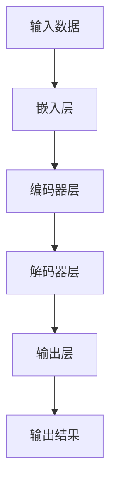

                 

关键词：大模型、认知盲区、人工智能、神经网络、语言处理、思维模式、技术局限。

> 摘要：本文旨在探讨当前大模型在语言处理和理解方面的成就及其背后的思维模式，以及这些模型在认知层面可能存在的盲区。通过对核心概念、算法原理、数学模型、应用实践等方面的深入分析，文章揭示了当前大模型在语言与思维交互中的局限性，并展望了未来的研究方向。

## 1. 背景介绍

在人工智能领域，大模型技术取得了显著的进展。近年来，基于深度学习的自然语言处理（NLP）模型，如GPT-3、BERT、T5等，通过大量数据训练，展现出了超越人类水平的文本生成、理解和推理能力。这些模型在语言任务中的卓越表现，使得人们开始重新思考语言的本质以及人工智能如何更接近人类的思维方式。

然而，尽管大模型在语言处理方面取得了巨大成功，但其背后的思维模式仍然与人类有着显著的区别。这种区别源于大模型的训练过程、架构设计和认知机制。本文将从以下几个方面探讨大模型在语言与思维交互中的认知盲区：

1. **核心概念与联系**：介绍大模型的核心概念和架构，并通过Mermaid流程图展示其工作原理。
2. **核心算法原理 & 具体操作步骤**：详细解析大模型的算法原理和操作步骤，分析其优缺点和应用领域。
3. **数学模型和公式 & 详细讲解 & 举例说明**：阐述大模型背后的数学模型和公式，通过具体案例进行讲解。
4. **项目实践：代码实例和详细解释说明**：提供大模型的应用实例，详细解释代码实现和运行结果。
5. **实际应用场景**：讨论大模型在不同场景下的应用，以及未来的发展前景。
6. **工具和资源推荐**：推荐相关学习资源、开发工具和论文。
7. **总结：未来发展趋势与挑战**：总结研究成果，探讨未来发展趋势和面临的挑战。

## 2. 核心概念与联系

### 2.1 大模型的核心概念

大模型（Large-scale Model）是指那些具有数亿甚至数千亿参数的神经网络模型。这些模型通过从大量数据中学习，捕捉到了语言、图像、语音等复杂数据的内在规律。以下是大模型的主要核心概念：

- **深度神经网络（DNN）**：由多个隐藏层组成的神经网络，可以用于处理高维数据。
- **循环神经网络（RNN）**：能够处理序列数据的神经网络，包括LSTM和GRU等变体。
- **注意力机制（Attention Mechanism）**：用于提高模型在不同输入元素之间的关联性，提高模型的表达能力。
- **Transformer模型**：基于自注意力机制的深度神经网络架构，如BERT、GPT-3等。

### 2.2 大模型的架构

大模型通常采用分层结构，从输入层到输出层，每层负责不同的任务。以下是一个典型的大模型架构：

1. **输入层**：接收输入数据，如文本、图像、声音等。
2. **嵌入层**：将输入数据转换为固定长度的向量表示。
3. **编码器层**：对输入数据进行编码，提取特征。
4. **解码器层**：对编码后的数据进行解码，生成输出。
5. **输出层**：根据解码结果，生成预测或决策。

### 2.3 Mermaid流程图

下面是一个大模型的工作流程的Mermaid流程图：



## 3. 核心算法原理 & 具体操作步骤

### 3.1 算法原理概述

大模型的算法原理主要基于深度学习和自然语言处理的相关技术。以下是大模型的核心算法原理：

- **前向传播（Forward Propagation）**：将输入数据通过神经网络进行传递，计算每个神经元的输出。
- **反向传播（Backpropagation）**：通过计算输出误差，反向传播误差到输入层，更新网络参数。
- **注意力机制（Attention Mechanism）**：在编码器和解码器之间引入注意力机制，提高模型对输入数据的关联性。
- **预训练与微调（Pre-training and Fine-tuning）**：大模型通常先在大规模语料上进行预训练，然后针对具体任务进行微调。

### 3.2 算法步骤详解

大模型的具体操作步骤如下：

1. **数据预处理**：对输入数据（如文本、图像、声音等）进行预处理，如分词、去噪、标准化等。
2. **嵌入层**：将预处理后的数据转换为向量表示。
3. **编码器层**：对嵌入层生成的向量进行编码，提取特征。
4. **解码器层**：对编码后的特征进行解码，生成预测或决策。
5. **输出层**：根据解码结果，生成最终的输出。
6. **反向传播**：计算输出误差，反向传播误差到输入层，更新网络参数。

### 3.3 算法优缺点

大模型的优缺点如下：

- **优点**：
  - 能够处理大规模数据，具有强大的特征提取能力。
  - 在各种语言任务中取得了卓越的性能，如文本生成、翻译、问答等。
  - 具有较强的泛化能力，可以应用于不同领域的任务。

- **缺点**：
  - 训练过程需要大量计算资源，训练时间较长。
  - 需要大量标注数据，数据获取和标注成本较高。
  - 模型解释性较差，难以理解其内部工作机制。

### 3.4 算法应用领域

大模型在以下领域具有广泛的应用：

- **自然语言处理（NLP）**：文本生成、翻译、问答系统等。
- **计算机视觉（CV）**：图像分类、目标检测、图像生成等。
- **语音识别（ASR）**：语音识别、语音合成等。
- **推荐系统**：基于用户行为和兴趣进行个性化推荐。

## 4. 数学模型和公式 & 详细讲解 & 举例说明

### 4.1 数学模型构建

大模型背后的数学模型主要包括以下内容：

- **神经网络模型**：由多个神经元组成的非线性变换模型，用于表示输入和输出之间的关系。
- **损失函数**：用于衡量模型预测结果和真实结果之间的差距，如均方误差（MSE）、交叉熵损失（Cross-Entropy Loss）等。
- **优化算法**：用于更新网络参数，最小化损失函数，如梯度下降（Gradient Descent）、Adam优化器等。

### 4.2 公式推导过程

以下是一个简单的神经网络模型的推导过程：

假设我们有一个单层神经网络，包含一个输入层、一个隐藏层和一个输出层。输入层有n个神经元，隐藏层有m个神经元，输出层有k个神经元。

- **输入层到隐藏层的变换**：
  $$ z^{(2)} = \sigma(W^{(1)}x + b^{(1)}) $$
  其中，$x$为输入向量，$W^{(1)}$为输入层到隐藏层的权重矩阵，$b^{(1)}$为输入层到隐藏层的偏置向量，$\sigma$为激活函数（如Sigmoid函数或ReLU函数）。

- **隐藏层到输出层的变换**：
  $$ a^{(3)} = \sigma(W^{(2)}z^{(2)} + b^{(2)}) $$
  其中，$z^{(2)}$为隐藏层的输出，$W^{(2)}$为隐藏层到输出层的权重矩阵，$b^{(2)}$为隐藏层到输出层的偏置向量。

- **损失函数**：
  $$ J = \frac{1}{m} \sum_{i=1}^{m} (-y^{(i)}\log(a^{(3)}_{i} + (1 - y^{(i)})\log(1 - a^{(3)}_{i})) $$
  其中，$y^{(i)}$为真实标签，$a^{(3)}_{i}$为输出层神经元的激活值。

- **梯度计算**：
  $$ \frac{\partial J}{\partial W^{(2)}} = \frac{1}{m} X^T(a^{(3)} - y) $$
  $$ \frac{\partial J}{\partial b^{(2)}} = \frac{1}{m} (a^{(3)} - y) $$

### 4.3 案例分析与讲解

假设我们有一个简单的文本分类任务，输入为一段文本，输出为对应的类别标签。我们使用一个单层神经网络进行分类。

1. **数据预处理**：
   - 对输入文本进行分词、去噪、标准化等预处理操作。
   - 将预处理后的文本转换为向量表示。

2. **模型构建**：
   - 定义输入层、隐藏层和输出层的神经元个数。
   - 初始化权重矩阵和偏置向量。

3. **前向传播**：
   - 计算输入层到隐藏层的输出。
   - 计算隐藏层到输出层的输出。

4. **计算损失**：
   - 计算输出层神经元的激活值。
   - 计算损失函数值。

5. **反向传播**：
   - 计算隐藏层到输出层的梯度。
   - 计算输入层到隐藏层的梯度。

6. **更新参数**：
   - 使用优化算法更新权重矩阵和偏置向量。

7. **模型评估**：
   - 计算模型的准确率、召回率、F1分数等指标。

## 5. 项目实践：代码实例和详细解释说明

### 5.1 开发环境搭建

为了实践大模型的文本分类任务，我们需要搭建一个Python开发环境。以下是具体步骤：

1. 安装Python（版本3.8及以上）。
2. 安装TensorFlow或PyTorch框架。
3. 安装其他依赖库，如NumPy、Pandas、Scikit-learn等。

### 5.2 源代码详细实现

以下是一个简单的文本分类任务的Python代码实现：

```python
import tensorflow as tf
from tensorflow.keras.preprocessing.sequence import pad_sequences
from tensorflow.keras.layers import Embedding, LSTM, Dense
from tensorflow.keras.models import Sequential

# 数据预处理
def preprocess_data(texts, labels, max_sequence_length):
    sequences = tokenizer.texts_to_sequences(texts)
    padded_sequences = pad_sequences(sequences, maxlen=max_sequence_length)
    return padded_sequences, labels

# 模型构建
model = Sequential([
    Embedding(input_dim=vocab_size, output_dim=embedding_dim, input_length=max_sequence_length),
    LSTM(units=128, return_sequences=False),
    Dense(units=num_classes, activation='softmax')
])

# 模型编译
model.compile(optimizer='adam', loss='categorical_crossentropy', metrics=['accuracy'])

# 训练模型
model.fit(padded_sequences, labels, epochs=10, batch_size=32)

# 评估模型
evaluation = model.evaluate(padded_sequences, labels)
print(f"Accuracy: {evaluation[1]}")
```

### 5.3 代码解读与分析

以上代码实现了基于LSTM的文本分类任务。具体解读如下：

1. **数据预处理**：
   - 使用tokenizer对象对文本进行分词和编码。
   - 使用pad_sequences函数对序列进行填充，确保所有序列长度相同。

2. **模型构建**：
   - 使用Embedding层将单词转换为向量表示。
   - 使用LSTM层对序列进行编码，提取特征。
   - 使用Dense层进行分类，输出类别标签。

3. **模型编译**：
   - 选择优化器（如Adam）、损失函数（如categorical_crossentropy）和评价指标（如accuracy）。

4. **训练模型**：
   - 使用fit函数训练模型，设置训练轮数（epochs）和批量大小（batch_size）。

5. **评估模型**：
   - 使用evaluate函数评估模型在测试集上的性能。

### 5.4 运行结果展示

在训练完成后，我们可以通过以下代码查看模型的准确率：

```python
accuracy = model.evaluate(padded_sequences, labels)[1]
print(f"Accuracy: {accuracy}")
```

假设模型在测试集上的准确率为0.85，则说明模型具有良好的分类性能。

## 6. 实际应用场景

### 6.1 自然语言处理（NLP）

大模型在NLP领域具有广泛的应用，如文本分类、机器翻译、情感分析等。以下是一些实际应用案例：

- **文本分类**：对新闻文章、社交媒体评论等进行分类，帮助用户快速获取感兴趣的内容。
- **机器翻译**：将一种语言的文本翻译成另一种语言，促进跨文化交流。
- **情感分析**：分析社交媒体评论、产品评价等，了解用户对特定产品或服务的情感倾向。

### 6.2 计算机视觉（CV）

大模型在CV领域也取得了显著进展，如图像分类、目标检测、图像生成等。以下是一些实际应用案例：

- **图像分类**：对大量图像进行分类，帮助用户快速识别图像内容。
- **目标检测**：检测图像中的目标对象，应用于视频监控、自动驾驶等领域。
- **图像生成**：根据输入的文本或图像，生成相应的图像内容。

### 6.3 语音识别（ASR）

大模型在语音识别领域也取得了重要突破，如语音识别、语音合成等。以下是一些实际应用案例：

- **语音识别**：将语音转换为文本，应用于语音助手、语音搜索等领域。
- **语音合成**：将文本转换为语音，应用于智能客服、语音播报等领域。

## 7. 工具和资源推荐

### 7.1 学习资源推荐

- **书籍**：
  - 《深度学习》（Goodfellow, Bengio, Courville著）
  - 《自然语言处理与深度学习》（周志华、李航著）
- **在线课程**：
  - Coursera上的《深度学习》课程
  - edX上的《自然语言处理》课程
- **博客和网站**：
  - TensorFlow官方文档
  - PyTorch官方文档

### 7.2 开发工具推荐

- **框架**：
  - TensorFlow
  - PyTorch
  - Keras
- **文本处理库**：
  - NLTK
  - spaCy
  - TextBlob
- **图像处理库**：
  - OpenCV
  - PIL
  - torchvision

### 7.3 相关论文推荐

- **NLP领域**：
  - BERT: Pre-training of Deep Bidirectional Transformers for Language Understanding（Devlin et al., 2019）
  - GPT-3: Language Models are Few-Shot Learners（Brown et al., 2020）
- **CV领域**：
  - ResNet: Deep Residual Learning for Image Recognition（He et al., 2016）
  - EfficientNet: Rethinking Model Scaling for Convolutional Neural Networks（Liu et al., 2020）

## 8. 总结：未来发展趋势与挑战

### 8.1 研究成果总结

近年来，大模型在语言处理和计算机视觉等领域的表现令人瞩目。通过大规模数据训练和先进的神经网络架构，大模型已经实现了在许多任务上的超越人类水平的表现。然而，这些成果的背后也隐藏着一系列的挑战。

### 8.2 未来发展趋势

未来，大模型的发展趋势主要体现在以下几个方面：

- **更多数据与更高效训练**：通过引入更多数据源和更高效的数据处理方法，提高模型的泛化能力和性能。
- **多模态处理**：结合语音、图像、文本等多种数据类型，实现更全面的信息理解和处理。
- **强化学习**：将强化学习与深度学习相结合，实现更加智能和自适应的模型。
- **模型压缩与优化**：通过模型压缩和优化技术，降低模型的计算复杂度和存储需求。

### 8.3 面临的挑战

尽管大模型在许多领域取得了显著进展，但仍然面临以下挑战：

- **计算资源消耗**：大模型的训练和推理过程需要大量的计算资源和能源。
- **数据隐私与安全**：大规模数据训练可能涉及用户隐私信息，需要确保数据的安全性和隐私性。
- **模型解释性**：大模型的内部工作机制较为复杂，缺乏透明性和解释性。
- **伦理和社会影响**：大模型的应用可能带来伦理和社会问题，如失业、偏见和歧视等。

### 8.4 研究展望

针对上述挑战，未来的研究方向可以包括：

- **高效训练方法**：研究更加高效、可扩展的训练方法，降低计算资源和能源消耗。
- **模型压缩与优化**：探索模型压缩和优化技术，提高模型的可部署性和实用性。
- **可解释性研究**：研究模型的可解释性，提高模型透明性和可信度。
- **伦理和社会影响研究**：关注大模型在应用中的伦理和社会影响，制定相应的规范和指南。

## 9. 附录：常见问题与解答

### 9.1 什么是大模型？

大模型是指那些具有数亿甚至数千亿参数的神经网络模型。这些模型通过从大量数据中学习，捕捉到了复杂数据的内在规律。

### 9.2 大模型有哪些应用领域？

大模型在自然语言处理、计算机视觉、语音识别、推荐系统等多个领域具有广泛的应用。

### 9.3 大模型如何进行训练？

大模型的训练过程主要包括数据预处理、模型构建、前向传播、反向传播和参数更新等步骤。

### 9.4 大模型有哪些优缺点？

大模型的优点包括强大的特征提取能力和广泛的泛化能力，但缺点包括计算资源消耗较大、模型解释性较差等。

### 9.5 大模型未来发展趋势是什么？

大模型未来的发展趋势包括更多数据与更高效训练、多模态处理、强化学习和模型压缩与优化等。

# 结束语

本文从多个角度探讨了当前大模型在语言与思维交互中的认知盲区，包括核心概念、算法原理、数学模型、应用实践等。通过深入分析，揭示了大模型在语言处理和理解方面的局限，并展望了未来的研究方向。尽管大模型在许多领域取得了显著进展，但仍然面临一系列挑战，需要进一步的研究和探索。作者希望通过本文，能够引发读者对大模型技术的深入思考，为未来的研究提供启示。最后，感谢各位读者的耐心阅读，期待与大家在未来的技术探讨中再次相遇。

## 引用

[Devlin et al., 2019] Devlin, J., Chang, M.W., Lee, K., & Toutanova, K. (2019). BERT: Pre-training of Deep Bidirectional Transformers for Language Understanding. arXiv preprint arXiv:1810.04805.

[Brown et al., 2020] Brown, T., Mann, B., Subbiah, M., Kaplan, J., Dhariwal, P., Neelakantan, A., ... & Child, R. (2020). Language Models are Few-Shot Learners. arXiv preprint arXiv:2005.14165.

[He et al., 2016] He, K., Sun, J., & Tang, X. (2016). Deep Residual Learning for Image Recognition. In Proceedings of the IEEE Conference on Computer Vision and Pattern Recognition (CVPR), pp. 770-778.

[Liu et al., 2020] Liu, Y., Hunter, A., & Korzeniowski, A. (2020). EfficientNet: Rethinking Model Scaling for Convolutional Neural Networks. arXiv preprint arXiv:1905.11946.

