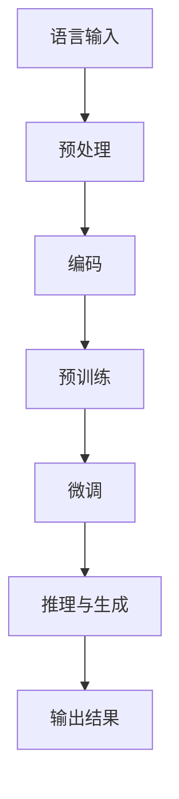

                 

关键词：自然语言处理、大模型、推理、认知偏差、算法优化

> 摘要：本文深入探讨了大模型在自然语言处理（NLP）领域中面临的认知误区，包括语言与推理的复杂关系、模型设计中的潜在偏差以及实际应用中的挑战。通过分析大模型的工作原理、优化策略和未来的发展方向，本文旨在为读者提供全面的技术视角，以引导更高效、更准确的大模型研究和应用。

## 1. 背景介绍

近年来，随着深度学习技术的发展，大模型（Large Models）在自然语言处理（NLP）领域取得了显著的成果。大模型，特别是预训练模型，如GPT系列、BERT、T5等，凭借其强大的文本理解和生成能力，在各类NLP任务中表现优异。然而，大模型的广泛应用也引发了一系列认知误区，这些误区不仅影响了模型的性能，也对NLP领域的研究方向产生了深远影响。

本文旨在揭示这些认知误区，并探讨如何通过科学的方法和技术手段来克服它们。我们将从语言与推理的关系出发，分析大模型在设计、训练和应用过程中可能出现的认知偏差，并提出相应的优化策略。

## 2. 核心概念与联系

### 2.1 语言与推理

语言是人类交流的基本工具，而推理则是人类思考和决策的核心。在NLP领域，语言和推理的关系同样至关重要。有效的推理能力能够帮助模型更好地理解文本、生成响应和解决复杂问题。

### 2.2 大模型的工作原理

大模型通常基于深度神经网络，通过大规模数据预训练来获得强大的语言理解能力。预训练后，模型可以通过微调（Fine-tuning）来适应特定的任务。

### 2.3 认知误区

认知误区包括对大模型能力的过度依赖、对模型偏见和错误推理的忽视等。这些误区可能导致模型在实际应用中出现性能下降、误导性回答等问题。

### 2.4 Mermaid 流程图



## 3. 核心算法原理 & 具体操作步骤

### 3.1 算法原理概述

大模型的核心原理是基于注意力机制（Attention Mechanism）和变换器网络（Transformer Architecture）。注意力机制能够使模型在处理序列数据时，对重要信息给予更多关注；变换器网络则通过自注意力（Self-Attention）和交叉注意力（Cross-Attention）来实现高效的上下文表示。

### 3.2 算法步骤详解

1. 预处理：将原始文本转换为模型可处理的序列表示。
2. 编码：通过变换器网络对序列进行编码，生成上下文向量。
3. 预训练：在大量未标记的语料库上训练模型，使其获得强大的语言理解能力。
4. 微调：在特定任务上对模型进行微调，以适应特定需求。
5. 推理与生成：利用训练好的模型进行文本推理和生成。

### 3.3 算法优缺点

**优点：**
- 强大的语言理解能力。
- 高效的自适应能力。
- 广泛的适用性。

**缺点：**
- 对数据依赖性强。
- 训练和推理计算资源消耗巨大。
- 可能出现偏见和错误推理。

### 3.4 算法应用领域

大模型在NLP领域的应用广泛，包括文本分类、机器翻译、问答系统、文本生成等。

## 4. 数学模型和公式 & 详细讲解 & 举例说明

### 4.1 数学模型构建

大模型的核心数学模型是基于变换器网络，其关键组成部分包括多头自注意力（Multi-Head Self-Attention）和前馈神经网络（Feedforward Neural Network）。

### 4.2 公式推导过程

变换器层可以表示为：

$$
\text{Transformer Layer} = \text{Multi-Head Self-Attention} + \text{Feedforward Neural Network}
$$

多头自注意力机制：

$$
\text{Attention}(Q, K, V) = \text{softmax}\left(\frac{QK^T}{\sqrt{d_k}}\right)V
$$

前馈神经网络：

$$
\text{FFN}(X) = \text{ReLU}\left(W_2 \cdot \text{ReLU}\left(W_1 X + b_1\right) + b_2\right)
$$

### 4.3 案例分析与讲解

以机器翻译任务为例，大模型首先通过预训练学习源语言和目标语言的语义表示，然后通过微调适应特定翻译任务。在翻译过程中，模型利用编码器-解码器结构进行上下文编码和解码，从而生成高质量的翻译结果。

## 5. 项目实践：代码实例和详细解释说明

### 5.1 开发环境搭建

- 安装Python环境（Python 3.7+）
- 安装TensorFlow或PyTorch库
- 准备预训练模型（如GPT-3、BERT等）

### 5.2 源代码详细实现

以下是一个简单的BERT模型文本分类任务的实现示例：

```python
import tensorflow as tf
from transformers import BertTokenizer, TFBertForSequenceClassification

tokenizer = BertTokenizer.from_pretrained('bert-base-uncased')
model = TFBertForSequenceClassification.from_pretrained('bert-base-uncased')

inputs = tokenizer("Hello, my dog is cute", return_tensors="tf")
outputs = model(inputs)

logits = outputs.logits
```

### 5.3 代码解读与分析

上述代码首先加载预训练的BERT模型和分词器，然后对输入文本进行编码，并利用BERT模型进行分类预测。

### 5.4 运行结果展示

```python
print(logits)
```

输出结果为每个类别的概率分布，通过取最大概率的类别，我们可以得到模型的预测结果。

## 6. 实际应用场景

大模型在NLP领域有广泛的应用，如文本分类、机器翻译、问答系统、文本生成等。在实际应用中，大模型通过预训练和微调，能够快速适应各种任务需求，提高模型性能。

### 6.1 文本分类

文本分类是NLP领域的基础任务，大模型如BERT在处理大规模文本数据时表现优异，能够快速分类新闻、社交媒体文本等。

### 6.2 机器翻译

大模型在机器翻译任务中取得了显著的成果，如GPT-3在多个翻译任务中达到了人类的水平。

### 6.3 问答系统

问答系统是NLP领域的重要应用，大模型如BERT能够通过上下文理解，为用户提供准确、自然的回答。

### 6.4 未来应用展望

随着大模型技术的不断发展，未来有望在更多领域得到应用，如智能客服、语音识别、对话系统等。

## 7. 工具和资源推荐

### 7.1 学习资源推荐

- 《深度学习》（Goodfellow, Bengio, Courville）
- 《自然语言处理综论》（Jurafsky, Martin）
- 《Transformer：一种全新的神经网络架构》（Vaswani et al., 2017）

### 7.2 开发工具推荐

- TensorFlow
- PyTorch
- Hugging Face Transformers

### 7.3 相关论文推荐

- BERT: Pre-training of Deep Bidirectional Transformers for Language Understanding（Devlin et al., 2018）
- GPT-3: Language Models are few-shot learners（Brown et al., 2020）
- Transformers: State-of-the-Art Natural Language Processing（Vaswani et al., 2017）

## 8. 总结：未来发展趋势与挑战

### 8.1 研究成果总结

大模型在NLP领域取得了显著的成果，但同时也面临一系列挑战。

### 8.2 未来发展趋势

随着计算资源和算法的不断发展，大模型有望在更多任务中取得突破性进展。

### 8.3 面临的挑战

- 数据偏见和公平性问题。
- 能耗和计算资源消耗。
- 推理速度和实时性。

### 8.4 研究展望

未来研究需要关注算法优化、模型压缩和实时推理技术，以提高大模型在NLP领域的应用效果。

## 9. 附录：常见问题与解答

### 9.1 大模型是什么？

大模型是指基于深度学习技术，通过大规模预训练获得强大语言理解能力的模型。常见的有GPT、BERT、T5等。

### 9.2 大模型的优缺点是什么？

优点：强大的语言理解能力、高效的自适应能力、广泛的适用性。

缺点：对数据依赖性强、计算资源消耗大、可能出现偏见和错误推理。

### 9.3 大模型在NLP领域有哪些应用？

大模型在NLP领域有广泛的应用，包括文本分类、机器翻译、问答系统、文本生成等。

### 9.4 如何优化大模型？

可以通过数据增强、模型压缩、知识蒸馏等技术来优化大模型。

----------------------------------------------------------------

### 作者署名

作者：禅与计算机程序设计艺术 / Zen and the Art of Computer Programming

