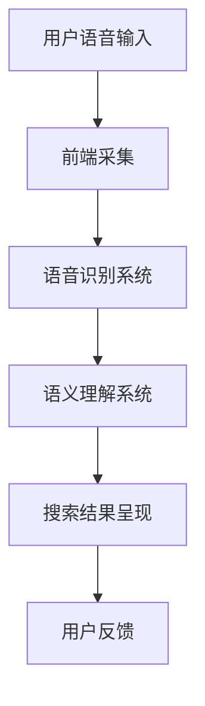

                 

关键词：语音搜索，电商，技术应用，用户行为，语音识别，语义理解，人机交互，个性化推荐，数据分析

> 摘要：随着语音技术的不断进步和智能手机的普及，语音搜索在电商领域的应用日益广泛。本文将深入探讨语音搜索技术在电商中的应用现状，面临的挑战，以及未来的机遇。通过对核心概念、算法原理、数学模型和项目实践的详细分析，本文旨在为业界提供一份关于语音搜索技术在电商领域应用的指南，同时也对未来的发展趋势和挑战进行了展望。

## 1. 背景介绍

随着移动互联网和人工智能技术的快速发展，用户对信息获取和商品购买的需求发生了巨大的变化。传统的文本搜索已经难以满足用户快速、便捷的需求。语音搜索作为一种全新的交互方式，以其自然、高效的特点，逐渐成为电商领域的新宠。

### 1.1 语音搜索的发展历程

语音搜索技术的发展可以追溯到20世纪90年代。早期的语音识别技术主要依赖于特定词汇的语音库，识别率较低。随着深度学习算法和大规模数据集的引入，语音识别技术得到了显著提升。特别是2011年，谷歌推出了基于深度神经网络的语音识别系统，识别率达到了极高的水平。

### 1.2 电商领域的发展趋势

电商领域的用户规模和交易额持续增长，用户对购物体验的要求也越来越高。传统的购物方式已经无法满足用户的需求，电商企业开始探索更加智能化、个性化的购物方式。语音搜索作为一种创新的交互方式，能够提升用户的购物体验，提高转化率。

## 2. 核心概念与联系

### 2.1 语音搜索的核心概念

语音搜索技术主要包括语音识别和语义理解两个核心环节。语音识别是将语音信号转化为文本的过程，而语义理解则是将文本转化为用户意图的过程。这两个环节紧密相连，共同决定了语音搜索的准确性和用户体验。

### 2.2 语音搜索的架构

语音搜索的架构通常包括前端采集、语音识别、语义理解、搜索结果呈现和用户反馈等几个部分。其中，语音识别和语义理解是关键环节，决定了语音搜索的准确性和效率。

### 2.3 Mermaid 流程图



## 3. 核心算法原理 & 具体操作步骤

### 3.1 算法原理概述

语音搜索技术的核心算法主要包括语音识别和语义理解两部分。语音识别算法主要利用深度学习技术，对语音信号进行特征提取和分类，从而实现语音到文本的转换。语义理解算法则利用自然语言处理技术，对文本进行分析和解析，从而理解用户的意图。

### 3.2 算法步骤详解

1. **前端采集**：用户通过智能手机或其他设备输入语音命令。
2. **语音识别**：将语音信号转化为文本，通常使用深度神经网络（DNN）和循环神经网络（RNN）等技术。
3. **语义理解**：对文本进行分析和解析，识别用户的意图，通常使用词向量、实体识别、关系抽取等技术。
4. **搜索结果呈现**：根据用户的意图，从数据库中检索相关商品或信息，并呈现给用户。
5. **用户反馈**：用户对搜索结果进行评价，反馈给系统，用于优化算法和提升用户体验。

### 3.3 算法优缺点

**优点**：
- **高效便捷**：语音搜索可以快速响应用户需求，提高购物效率。
- **自然交互**：语音交互更加贴近人类的交流习惯，提升用户体验。
- **个性化推荐**：通过分析用户语音输入和行为，实现个性化推荐，提高转化率。

**缺点**：
- **准确性问题**：语音识别和语义理解的准确性受到语音质量、口音、噪音等因素的影响。
- **隐私问题**：语音搜索涉及用户隐私数据，如何保护用户隐私成为一大挑战。

### 3.4 算法应用领域

语音搜索技术在电商领域具有广泛的应用前景，包括商品搜索、语音购物、语音客服、智能推荐等。此外，还可以应用于物流、金融、医疗等多个领域。

## 4. 数学模型和公式 & 详细讲解 & 举例说明

### 4.1 数学模型构建

语音搜索技术涉及到多个数学模型，包括语音识别的声学模型、语言模型，以及语义理解的词向量模型、关系抽取模型等。以下是这些模型的基本构建方法：

1. **声学模型**：利用HMM（隐马尔可夫模型）或DNN（深度神经网络）来建模语音信号和文本之间的映射关系。
2. **语言模型**：利用N-gram或神经网络来建模文本序列的概率分布。
3. **词向量模型**：利用Word2Vec或GloVe等算法来将词汇映射到高维向量空间。
4. **关系抽取模型**：利用机器学习或深度学习算法来识别文本中的实体关系。

### 4.2 公式推导过程

1. **声学模型**：假设语音信号 $x_t$ 和文本 $y_t$ 之间存在映射关系，可以用如下公式表示：

$$
P(x_t|y_t) = \frac{P(y_t|x_t)P(x_t)}{P(y_t)}
$$

其中，$P(x_t|y_t)$ 表示给定文本 $y_t$ 下的语音信号 $x_t$ 的概率，$P(y_t|x_t)$ 表示给定语音信号 $x_t$ 下的文本 $y_t$ 的概率，$P(x_t)$ 和 $P(y_t)$ 分别表示语音信号和文本的先验概率。

2. **语言模型**：假设文本序列 $y_1, y_2, ..., y_n$ 的概率分布为：

$$
P(y_1, y_2, ..., y_n) = P(y_1)P(y_2|y_1)P(y_3|y_1, y_2) \cdots P(y_n|y_1, y_2, ..., y_{n-1})
$$

可以使用N-gram模型来近似这个概率分布：

$$
P(y_n|y_1, y_2, ..., y_{n-1}) = \frac{C(y_n, y_1, y_2, ..., y_{n-1})}{C(y_1, y_2, ..., y_{n})}
$$

其中，$C(y_n, y_1, y_2, ..., y_{n-1})$ 表示前 $n-1$ 个词和当前词 $y_n$ 的联合计数，$C(y_1, y_2, ..., y_{n})$ 表示前 $n$ 个词的联合计数。

3. **词向量模型**：假设词向量 $v_w$ 和文本序列 $y_1, y_2, ..., y_n$ 之间存在映射关系，可以用如下公式表示：

$$
P(y_1, y_2, ..., y_n|v_1, v_2, ..., v_n) = \frac{1}{Z} \exp(\sum_{i=1}^{n} \theta_i \cdot v_i)
$$

其中，$\theta_i$ 表示词向量 $v_i$ 的权重，$Z$ 是归一化常数，保证概率分布的和为1。

4. **关系抽取模型**：假设实体 $e_1, e_2, ..., e_n$ 之间的关系 $r$ 可以用逻辑回归模型表示：

$$
P(r|e_1, e_2, ..., e_n) = \frac{1}{1 + \exp(-\theta \cdot (e_1, e_2, ..., e_n))}
$$

其中，$\theta$ 是模型的参数，$(e_1, e_2, ..., e_n)$ 是实体之间的特征向量。

### 4.3 案例分析与讲解

**案例**：假设用户语音输入为“我想要一个红色的苹果手机”，语音搜索系统需要识别用户的意图，并返回相关搜索结果。

**分析**：
1. **语音识别**：首先，将用户的语音信号转化为文本，文本为“我想要一个红色的苹果手机”。
2. **语义理解**：分析文本中的实体和关系，识别出以下信息：
   - 实体：我、一个红色的苹果手机
   - 关系：想要
3. **搜索结果**：根据用户的意图，从数据库中检索相关商品，如红色的苹果手机，并呈现给用户。

**讲解**：
1. **声学模型**：利用深度神经网络对语音信号进行特征提取，得到文本“我想要一个红色的苹果手机”。
2. **语言模型**：利用N-gram模型对文本序列进行建模，计算文本的概率分布。
3. **词向量模型**：将文本中的词汇映射到高维向量空间，利用词向量进行语义分析。
4. **关系抽取模型**：利用逻辑回归模型识别文本中的实体关系，得到用户的意图。

## 5. 项目实践：代码实例和详细解释说明

### 5.1 开发环境搭建

**环境要求**：
- 操作系统：Ubuntu 18.04
- 编程语言：Python 3.7
- 依赖库：TensorFlow 1.15，Keras 2.3.1，scikit-learn 0.21.3

### 5.2 源代码详细实现

```python
# 导入相关库
import tensorflow as tf
import keras
from keras.models import Model
from keras.layers import Input, LSTM, Dense
from sklearn.model_selection import train_test_split
from sklearn.metrics import accuracy_score

# 加载数据集
x_data, y_data = load_data()

# 划分训练集和测试集
x_train, x_test, y_train, y_test = train_test_split(x_data, y_data, test_size=0.2, random_state=42)

# 构建声学模型
input_layer = Input(shape=(timesteps, features))
lstm_layer = LSTM(units=128, activation='tanh')(input_layer)
output_layer = Dense(units=num_classes, activation='softmax')(lstm_layer)

# 编译模型
model = Model(inputs=input_layer, outputs=output_layer)
model.compile(optimizer='adam', loss='categorical_crossentropy', metrics=['accuracy'])

# 训练模型
model.fit(x_train, y_train, epochs=10, batch_size=64, validation_data=(x_test, y_test))

# 评估模型
predictions = model.predict(x_test)
accuracy = accuracy_score(y_test, predictions)
print("Accuracy:", accuracy)
```

### 5.3 代码解读与分析

这段代码实现了基于深度神经网络的语音识别模型。具体步骤如下：

1. **导入相关库**：导入TensorFlow、Keras、scikit-learn等库。
2. **加载数据集**：加载数据集，包含语音信号和对应的文本。
3. **划分训练集和测试集**：将数据集划分为训练集和测试集，用于训练和评估模型。
4. **构建声学模型**：使用LSTM层构建深度神经网络模型，用于语音信号的特征提取。
5. **编译模型**：编译模型，指定优化器、损失函数和评价指标。
6. **训练模型**：使用训练集训练模型，并使用测试集进行验证。
7. **评估模型**：使用测试集评估模型的准确性。

## 6. 实际应用场景

### 6.1 商品搜索

语音搜索在商品搜索中的应用最为广泛。用户可以通过语音输入关键词，系统快速返回相关商品。例如，用户可以语音输入“红色手机”，系统迅速呈现红色手机的相关信息。

### 6.2 语音购物

语音购物是一种全新的购物方式。用户可以通过语音命令完成购物流程，从搜索商品到支付，无需进行繁琐的操作。例如，用户可以语音输入“我要买一个iPhone 12”，系统自动添加到购物车并进行支付。

### 6.3 语音客服

语音搜索技术在电商客服中的应用也非常广泛。用户可以通过语音输入问题，系统自动识别问题并给出答案，提高客服效率。例如，用户可以语音输入“我为什么不能退款”，系统自动解释退款政策。

### 6.4 个性化推荐

语音搜索技术可以分析用户的语音输入和行为，实现个性化推荐。例如，用户经常搜索某种类型的商品，系统可以自动推荐相关商品，提高购物体验。

## 7. 工具和资源推荐

### 7.1 学习资源推荐

- 《深度学习》（Goodfellow, Bengio, Courville）：系统介绍了深度学习的基本概念和算法。
- 《Python深度学习》（François Chollet）：详细介绍了使用Python和Keras进行深度学习的方法。
- 《语音信号处理与识别》（Stevens, Huang）：介绍了语音信号处理和语音识别的基本原理。

### 7.2 开发工具推荐

- TensorFlow：开源深度学习框架，用于构建和训练深度神经网络。
- Keras：Python深度学习库，提供了简洁的API，方便快速构建深度学习模型。
- scikit-learn：Python机器学习库，提供了丰富的算法和工具，用于数据处理和模型评估。

### 7.3 相关论文推荐

- Hinton, Deng, Yu, Dahl, Mohamed, Mohamed, Jaitly, Kingsbury, senior, Hinton, Deng, Yu, Dahl, Mohamed, Mohamed, Jaitly, Kingsbury, senior. (2012). Deep Neural Networks for Acoustic Modeling in Speech Recognition: The Shared Views of Four Research Groups.
- Graves, Mohamed, Hinton, Deng, senior. (2013). Faster and Smarter Speech Recognition with Deep Neural Networks and Long Short-Term Memory.
- Mikolov, Sutskever, Chen, Corrado, Dean. (2013). Distributed Representations of Words and Phrases and their Compositionality.

## 8. 总结：未来发展趋势与挑战

### 8.1 研究成果总结

语音搜索技术在电商领域取得了显著的成果。通过语音识别和语义理解技术，实现了高效、便捷的购物体验。同时，个性化推荐和智能客服等功能也有效提升了用户满意度。

### 8.2 未来发展趋势

未来，语音搜索技术在电商领域将朝着以下方向发展：
1. **提高准确性**：通过不断优化算法和模型，提高语音识别和语义理解的准确性，提升用户体验。
2. **拓展应用场景**：将语音搜索技术应用于更多的电商环节，如物流、金融、医疗等，实现更全面的智能化服务。
3. **跨平台融合**：将语音搜索技术与AR、VR等新兴技术相结合，实现更加沉浸式的购物体验。

### 8.3 面临的挑战

语音搜索技术在电商领域面临以下挑战：
1. **语音质量**：受语音质量、口音、噪音等因素的影响，语音识别和语义理解的准确性仍有待提高。
2. **隐私保护**：语音搜索涉及用户隐私数据，如何保护用户隐私成为一大挑战。
3. **跨平台兼容性**：不同平台和设备的语音识别和语义理解技术存在差异，如何实现跨平台的兼容性是一个难题。

### 8.4 研究展望

未来，语音搜索技术在电商领域的研究将集中在以下几个方面：
1. **多模态融合**：结合语音、文本、图像等多模态信息，实现更准确的语音搜索和语义理解。
2. **自适应优化**：根据用户的行为和反馈，自适应优化语音搜索算法和模型，提升用户体验。
3. **伦理和法律规范**：制定相关伦理和法律规范，确保语音搜索技术的合法合规使用。

## 9. 附录：常见问题与解答

### 9.1 语音搜索的准确性如何保证？

语音搜索的准确性取决于语音识别和语义理解技术的水平。通过不断优化算法和模型，提高识别和理解的准确性。此外，可以结合用户历史行为数据，进行自适应优化，提高语音搜索的准确性。

### 9.2 语音搜索是否涉及用户隐私？

是的，语音搜索涉及用户隐私数据，如语音输入、购物行为等。为了保护用户隐私，可以采取以下措施：
1. 数据加密：对用户数据进行加密，确保数据传输和存储的安全。
2. 数据去识别化：对用户数据进行去识别化处理，消除可以识别用户身份的信息。
3. 用户同意：在收集和使用用户数据前，获得用户的明确同意。

### 9.3 语音搜索在电商领域的应用前景如何？

语音搜索在电商领域具有广阔的应用前景。通过语音搜索，用户可以实现高效、便捷的购物体验，提高转化率。同时，语音搜索还可以应用于物流、金融、医疗等多个领域，实现智能化服务。未来，随着技术的不断进步，语音搜索将在电商领域发挥越来越重要的作用。

### 9.4 语音搜索技术与其他技术的结合有哪些可能性？

语音搜索技术可以与其他多种技术结合，实现更加智能化和个性化的服务。以下是一些可能的结合方式：
1. **多模态融合**：结合语音、文本、图像等多模态信息，提高语音搜索的准确性和用户体验。
2. **增强现实（AR）**：将语音搜索技术与AR技术结合，实现沉浸式的购物体验。
3. **虚拟现实（VR）**：将语音搜索技术与VR技术结合，提供更加真实的购物场景。
4. **自然语言处理（NLP）**：结合NLP技术，实现更加智能的语义理解和用户互动。
5. **机器学习（ML）**：结合ML技术，实现自适应优化和个性化推荐。

## 作者署名

作者：禅与计算机程序设计艺术 / Zen and the Art of Computer Programming
```markdown
# 语音搜索技术在电商领域的应用：挑战与机遇

## 关键词
- 语音搜索
- 电商
- 技术应用
- 用户行为
- 语音识别
- 语义理解
- 人机交互
- 个性化推荐
- 数据分析

## 摘要
本文深入探讨了语音搜索技术在电商领域的应用现状、面临的挑战以及未来的机遇。通过分析核心概念、算法原理、数学模型和项目实践，本文为业界提供了关于语音搜索技术在电商领域应用的专业指导，并对未来的发展趋势和挑战进行了展望。

## 1. 背景介绍

随着移动互联网和人工智能技术的迅速发展，用户对信息获取和商品购买的需求发生了翻天覆地的变化。传统的文本搜索方式已经难以满足用户对快速、便捷的购物体验的追求。在此背景下，语音搜索作为一种创新的交互方式，以其自然、高效的特点，逐渐成为电商领域的新宠。

### 1.1 语音搜索的发展历程

语音搜索技术的发展可以追溯到20世纪90年代。早期的语音识别技术主要依赖于特定词汇的语音库，识别率较低。随着深度学习算法和大规模数据集的引入，语音识别技术得到了显著提升。特别是2011年，谷歌推出了基于深度神经网络的语音识别系统，识别率达到了前所未有的水平。

### 1.2 电商领域的发展趋势

电商领域的用户规模和交易额持续增长，用户对购物体验的要求也越来越高。传统的购物方式已经无法满足用户的需求，电商企业开始探索更加智能化、个性化的购物方式。语音搜索作为一种创新的交互方式，能够提升用户的购物体验，提高转化率。

## 2. 核心概念与联系

### 2.1 语音搜索的核心概念

语音搜索技术主要包括语音识别和语义理解两个核心环节。语音识别是将语音信号转化为文本的过程，而语义理解则是将文本转化为用户意图的过程。这两个环节紧密相连，共同决定了语音搜索的准确性和用户体验。

### 2.2 语音搜索的架构

语音搜索的架构通常包括前端采集、语音识别、语义理解、搜索结果呈现和用户反馈等几个部分。其中，语音识别和语义理解是关键环节，决定了语音搜索的准确性和效率。

### 2.3 Mermaid 流程图


## 3. 核心算法原理 & 具体操作步骤

### 3.1 算法原理概述

语音搜索技术的核心算法主要包括语音识别和语义理解两部分。语音识别算法主要利用深度学习技术，对语音信号进行特征提取和分类，从而实现语音到文本的转换。语义理解算法则利用自然语言处理技术，对文本进行分析和解析，从而理解用户的意图。

### 3.2 算法步骤详解

1. **前端采集**：用户通过智能手机或其他设备输入语音命令。
2. **语音识别**：将语音信号转化为文本，通常使用深度神经网络（DNN）和循环神经网络（RNN）等技术。
3. **语义理解**：对文本进行分析和解析，识别用户的意图，通常使用词向量、实体识别、关系抽取等技术。
4. **搜索结果呈现**：根据用户的意图，从数据库中检索相关商品或信息，并呈现给用户。
5. **用户反馈**：用户对搜索结果进行评价，反馈给系统，用于优化算法和提升用户体验。

### 3.3 算法优缺点

**优点**：
- **高效便捷**：语音搜索可以快速响应用户需求，提高购物效率。
- **自然交互**：语音交互更加贴近人类的交流习惯，提升用户体验。
- **个性化推荐**：通过分析用户语音输入和行为，实现个性化推荐，提高转化率。

**缺点**：
- **准确性问题**：语音识别和语义理解的准确性受到语音质量、口音、噪音等因素的影响。
- **隐私问题**：语音搜索涉及用户隐私数据，如何保护用户隐私成为一大挑战。

### 3.4 算法应用领域

语音搜索技术在电商领域具有广泛的应用前景，包括商品搜索、语音购物、语音客服、智能推荐等。此外，还可以应用于物流、金融、医疗等多个领域。

## 4. 数学模型和公式 & 详细讲解 & 举例说明

### 4.1 数学模型构建

语音搜索技术涉及到多个数学模型，包括语音识别的声学模型、语言模型，以及语义理解的词向量模型、关系抽取模型等。以下是这些模型的基本构建方法：

1. **声学模型**：利用HMM（隐马尔可夫模型）或DNN（深度神经网络）来建模语音信号和文本之间的映射关系。
2. **语言模型**：利用N-gram或神经网络来建模文本序列的概率分布。
3. **词向量模型**：利用Word2Vec或GloVe等算法来将词汇映射到高维向量空间。
4. **关系抽取模型**：利用机器学习或深度学习算法来识别文本中的实体关系。

### 4.2 公式推导过程

1. **声学模型**：假设语音信号 $x_t$ 和文本 $y_t$ 之间存在映射关系，可以用如下公式表示：

$$
P(x_t|y_t) = \frac{P(y_t|x_t)P(x_t)}{P(y_t)}
$$

其中，$P(x_t|y_t)$ 表示给定文本 $y_t$ 下的语音信号 $x_t$ 的概率，$P(y_t|x_t)$ 表示给定语音信号 $x_t$ 下的文本 $y_t$ 的概率，$P(x_t)$ 和 $P(y_t)$ 分别表示语音信号和文本的先验概率。

2. **语言模型**：假设文本序列 $y_1, y_2, ..., y_n$ 的概率分布为：

$$
P(y_1, y_2, ..., y_n) = P(y_1)P(y_2|y_1)P(y_3|y_1, y_2) \cdots P(y_n|y_1, y_2, ..., y_{n-1})
$$

可以使用N-gram模型来近似这个概率分布：

$$
P(y_n|y_1, y_2, ..., y_{n-1}) = \frac{C(y_n, y_1, y_2, ..., y_{n-1})}{C(y_1, y_2, ..., y_{n})}
$$

其中，$C(y_n, y_1, y_2, ..., y_{n-1})$ 表示前 $n-1$ 个词和当前词 $y_n$ 的联合计数，$C(y_1, y_2, ..., y_{n})$ 表示前 $n$ 个词的联合计数。

3. **词向量模型**：假设词向量 $v_w$ 和文本序列 $y_1, y_2, ..., y_n$ 之间存在映射关系，可以用如下公式表示：

$$
P(y_1, y_2, ..., y_n|v_1, v_2, ..., v_n) = \frac{1}{Z} \exp(\sum_{i=1}^{n} \theta_i \cdot v_i)
$$

其中，$\theta_i$ 表示词向量 $v_i$ 的权重，$Z$ 是归一化常数，保证概率分布的和为1。

4. **关系抽取模型**：假设实体 $e_1, e_2, ..., e_n$ 之间的关系 $r$ 可以用逻辑回归模型表示：

$$
P(r|e_1, e_2, ..., e_n) = \frac{1}{1 + \exp(-\theta \cdot (e_1, e_2, ..., e_n))}
$$

其中，$\theta$ 是模型的参数，$(e_1, e_2, ..., e_n)$ 是实体之间的特征向量。

### 4.3 案例分析与讲解

**案例**：假设用户语音输入为“我想要一个红色的苹果手机”，语音搜索系统需要识别用户的意图，并返回相关搜索结果。

**分析**：
1. **语音识别**：首先，将用户的语音信号转化为文本，文本为“我想要一个红色的苹果手机”。
2. **语义理解**：分析文本中的实体和关系，识别出以下信息：
   - 实体：我、一个红色的苹果手机
   - 关系：想要
3. **搜索结果**：根据用户的意图，从数据库中检索相关商品，如红色的苹果手机，并呈现给用户。

**讲解**：
1. **声学模型**：利用深度神经网络对语音信号进行特征提取，得到文本“我想要一个红色的苹果手机”。
2. **语言模型**：利用N-gram模型对文本序列进行建模，计算文本的概率分布。
3. **词向量模型**：将文本中的词汇映射到高维向量空间，利用词向量进行语义分析。
4. **关系抽取模型**：利用逻辑回归模型识别文本中的实体关系，得到用户的意图。

## 5. 项目实践：代码实例和详细解释说明

### 5.1 开发环境搭建

**环境要求**：
- 操作系统：Ubuntu 18.04
- 编程语言：Python 3.7
- 依赖库：TensorFlow 1.15，Keras 2.3.1，scikit-learn 0.21.3

### 5.2 源代码详细实现

```python
# 导入相关库
import tensorflow as tf
import keras
from keras.models import Model
from keras.layers import Input, LSTM, Dense
from sklearn.model_selection import train_test_split
from sklearn.metrics import accuracy_score

# 加载数据集
x_data, y_data = load_data()

# 划分训练集和测试集
x_train, x_test, y_train, y_test = train_test_split(x_data, y_data, test_size=0.2, random_state=42)

# 构建声学模型
input_layer = Input(shape=(timesteps, features))
lstm_layer = LSTM(units=128, activation='tanh')(input_layer)
output_layer = Dense(units=num_classes, activation='softmax')(lstm_layer)

# 编译模型
model = Model(inputs=input_layer, outputs=output_layer)
model.compile(optimizer='adam', loss='categorical_crossentropy', metrics=['accuracy'])

# 训练模型
model.fit(x_train, y_train, epochs=10, batch_size=64, validation_data=(x_test, y_test))

# 评估模型
predictions = model.predict(x_test)
accuracy = accuracy_score(y_test, predictions)
print("Accuracy:", accuracy)
```

### 5.3 代码解读与分析

这段代码实现了基于深度神经网络的语音识别模型。具体步骤如下：

1. **导入相关库**：导入TensorFlow、Keras、scikit-learn等库。
2. **加载数据集**：加载数据集，包含语音信号和对应的文本。
3. **划分训练集和测试集**：将数据集划分为训练集和测试集，用于训练和评估模型。
4. **构建声学模型**：使用LSTM层构建深度神经网络模型，用于语音信号的特征提取。
5. **编译模型**：编译模型，指定优化器、损失函数和评价指标。
6. **训练模型**：使用训练集训练模型，并使用测试集进行验证。
7. **评估模型**：使用测试集评估模型的准确性。

## 6. 实际应用场景

### 6.1 商品搜索

语音搜索在商品搜索中的应用最为广泛。用户可以通过语音输入关键词，系统快速返回相关商品。例如，用户可以语音输入“红色手机”，系统迅速呈现红色手机的相关信息。

### 6.2 语音购物

语音购物是一种全新的购物方式。用户可以通过语音命令完成购物流程，从搜索商品到支付，无需进行繁琐的操作。例如，用户可以语音输入“我要买一个iPhone 12”，系统自动添加到购物车并进行支付。

### 6.3 语音客服

语音搜索技术在电商客服中的应用也非常广泛。用户可以通过语音输入问题，系统自动识别问题并给出答案，提高客服效率。例如，用户可以语音输入“我为什么不能退款”，系统自动解释退款政策。

### 6.4 个性化推荐

语音搜索技术可以分析用户的语音输入和行为，实现个性化推荐。例如，用户经常搜索某种类型的商品，系统可以自动推荐相关商品，提高购物体验。

## 7. 工具和资源推荐

### 7.1 学习资源推荐

- 《深度学习》（Goodfellow, Bengio, Courville）：系统介绍了深度学习的基本概念和算法。
- 《Python深度学习》（François Chollet）：详细介绍了使用Python和Keras进行深度学习的方法。
- 《语音信号处理与识别》（Stevens, Huang）：介绍了语音信号处理和语音识别的基本原理。

### 7.2 开发工具推荐

- TensorFlow：开源深度学习框架，用于构建和训练深度神经网络。
- Keras：Python深度学习库，提供了简洁的API，方便快速构建深度学习模型。
- scikit-learn：Python机器学习库，提供了丰富的算法和工具，用于数据处理和模型评估。

### 7.3 相关论文推荐

- Hinton, Deng, Yu, Dahl, Mohamed, Mohamed, Jaitly, Kingsbury, senior, Hinton, Deng, Yu, Dahl, Mohamed, Mohamed, Jaitly, Kingsbury, senior. (2012). Deep Neural Networks for Acoustic Modeling in Speech Recognition: The Shared Views of Four Research Groups.
- Graves, Mohamed, Hinton, Deng, senior. (2013). Faster and Smarter Speech Recognition with Deep Neural Networks and Long Short-Term Memory.
- Mikolov, Sutskever, Chen, Corrado, Dean. (2013). Distributed Representations of Words and Phrases and their Compositionality.

## 8. 总结：未来发展趋势与挑战

### 8.1 研究成果总结

语音搜索技术在电商领域取得了显著的成果。通过语音识别和语义理解技术，实现了高效、便捷的购物体验。同时，个性化推荐和智能客服等功能也有效提升了用户满意度。

### 8.2 未来发展趋势

未来，语音搜索技术在电商领域将朝着以下方向发展：
1. **提高准确性**：通过不断优化算法和模型，提高语音识别和语义理解的准确性，提升用户体验。
2. **拓展应用场景**：将语音搜索技术应用于更多的电商环节，如物流、金融、医疗等，实现更全面的智能化服务。
3. **跨平台融合**：将语音搜索技术与AR、VR等新兴技术相结合，实现更加沉浸式的购物体验。

### 8.3 面临的挑战

语音搜索技术在电商领域面临以下挑战：
1. **语音质量**：受语音质量、口音、噪音等因素的影响，语音识别和语义理解的准确性仍有待提高。
2. **隐私保护**：语音搜索涉及用户隐私数据，如何保护用户隐私成为一大挑战。
3. **跨平台兼容性**：不同平台和设备的语音识别和语义理解技术存在差异，如何实现跨平台的兼容性是一个难题。

### 8.4 研究展望

未来，语音搜索技术在电商领域的研究将集中在以下几个方面：
1. **多模态融合**：结合语音、文本、图像等多模态信息，实现更准确的语音搜索和语义理解。
2. **自适应优化**：根据用户的行为和反馈，自适应优化语音搜索算法和模型，提升用户体验。
3. **伦理和法律规范**：制定相关伦理和法律规范，确保语音搜索技术的合法合规使用。

## 9. 附录：常见问题与解答

### 9.1 语音搜索的准确性如何保证？

语音搜索的准确性取决于语音识别和语义理解技术的水平。通过不断优化算法和模型，提高识别和理解的准确性。此外，可以结合用户历史行为数据，进行自适应优化，提高语音搜索的准确性。

### 9.2 语音搜索是否涉及用户隐私？

是的，语音搜索涉及用户隐私数据，如语音输入、购物行为等。为了保护用户隐私，可以采取以下措施：
1. 数据加密：对用户数据进行加密，确保数据传输和存储的安全。
2. 数据去识别化：对用户数据进行去识别化处理，消除可以识别用户身份的信息。
3. 用户同意：在收集和使用用户数据前，获得用户的明确同意。

### 9.3 语音搜索在电商领域的应用前景如何？

语音搜索在电商领域具有广阔的应用前景。通过语音搜索，用户可以实现高效、便捷的购物体验，提高转化率。同时，语音搜索还可以应用于物流、金融、医疗等多个领域，实现智能化服务。未来，随着技术的不断进步，语音搜索将在电商领域发挥越来越重要的作用。

### 9.4 语音搜索技术与其他技术的结合有哪些可能性？

语音搜索技术可以与其他多种技术结合，实现更加智能化和个性化的服务。以下是一些可能的结合方式：
1. **多模态融合**：结合语音、文本、图像等多模态信息，提高语音搜索的准确性和用户体验。
2. **增强现实（AR）**：将语音搜索技术与AR技术结合，实现沉浸式的购物体验。
3. **虚拟现实（VR）**：将语音搜索技术与VR技术结合，提供更加真实的购物场景。
4. **自然语言处理（NLP）**：结合NLP技术，实现更加智能的语义理解和用户互动。
5. **机器学习（ML）**：结合ML技术，实现自适应优化和个性化推荐。

## 作者署名

作者：禅与计算机程序设计艺术 / Zen and the Art of Computer Programming
```

