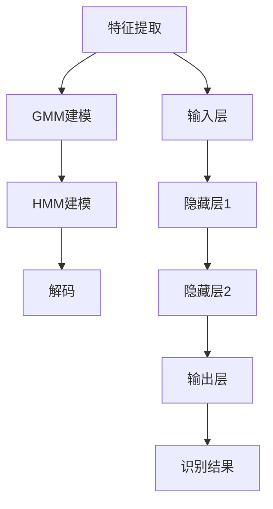
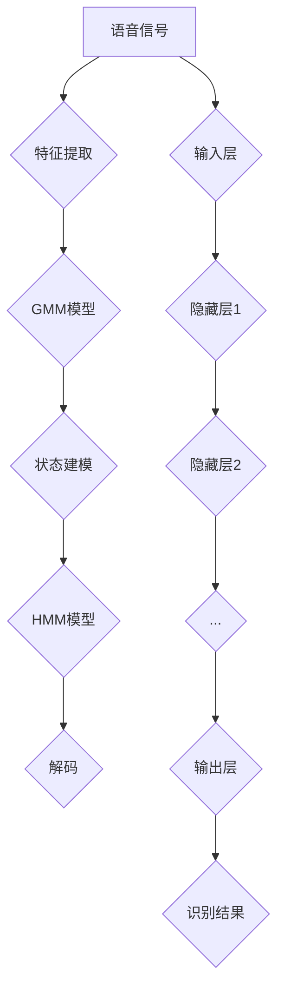

                 

在语音识别领域，准确、快速地将语音转换为文本是一项具有巨大实用价值的技术。语音识别技术的发展历程中，从Gaussian Mixture Models（GMM）到Hidden Markov Models（HMM），再到纯神经网络，每一次的技术迭代都标志着我们在语音识别精度和效率上的重大突破。本文将深入探讨这一技术演进过程，梳理其背后的核心概念、算法原理、数学模型，并通过实际项目实践和未来展望，帮助读者全面理解语音识别技术的发展脉络。

## 关键词

- 语音识别
- GMM-HMM
- 神经网络
- 人工智能
- 自然语言处理

## 摘要

本文旨在探讨语音识别技术从GMM-HMM到纯神经网络的演进历程。通过回顾GMM-HMM的基本原理和应用场景，我们分析了其在语音识别中的局限。随后，本文深入介绍了深度神经网络在语音识别中的应用，探讨了其优势与挑战。最后，通过具体项目实践，展示了如何利用纯神经网络实现高效的语音识别。本文旨在为语音识别领域的研究者和开发者提供有价值的参考。

## 1. 背景介绍

### 语音识别技术的发展

语音识别技术的概念可以追溯到20世纪50年代，当时人们开始探索如何将人类语音转换为机器可读的文本。随着计算机技术的不断发展，语音识别技术逐渐从实验室走向实际应用。早期的语音识别系统主要依赖于规则基方法，这些方法虽然能够处理一些简单的语音任务，但在处理复杂、连续的语音时效果不佳。

20世纪80年代，统计模型开始被引入到语音识别中，其中GMM-HMM成为了主导模型。GMM-HMM结合了Gaussian Mixture Models（GMM）和Hidden Markov Models（HMM），通过概率模型的方法实现了对语音信号的处理和理解。这一技术的出现，极大地提高了语音识别的准确性和实用性。

进入21世纪，随着深度学习技术的兴起，纯神经网络开始在语音识别中崭露头角。深度神经网络（DNN）强大的特征提取和建模能力，使得语音识别系统的性能得到了进一步提升。如今，基于纯神经网络的语音识别技术已经成为该领域的主流。

### GMM-HMM模型的局限性

GMM-HMM模型虽然在语音识别领域取得了显著的成果，但其在处理复杂语音信号时仍然存在一些局限性。首先，GMM-HMM模型依赖于手工程序提取特征，这些特征往往无法全面、准确地捕捉语音信号中的信息。其次，HMM模型在处理长序列数据时，计算复杂度较高，导致系统运行效率低下。

此外，GMM-HMM模型在面对多语种、多说话人、多语音环境时，适应性较差。在实际应用中，这些局限性限制了GMM-HMM模型在语音识别领域的进一步发展。因此，探索新的语音识别技术，提升系统的性能和适应性，成为语音识别领域的一个重要课题。

### 纯神经网络的优势

纯神经网络，尤其是深度神经网络，在语音识别中的应用展示了其独特的优势。首先，深度神经网络能够自动学习语音信号中的特征，无需依赖手工程序提取特征。这使得系统在处理复杂语音信号时，能够更加准确地捕捉语音信息。

其次，深度神经网络具有强大的计算能力和并行处理能力，能够在短时间内完成对大量数据的处理。这使得基于纯神经网络的语音识别系统具有更高的运行效率。

此外，深度神经网络具有较好的泛化能力，能够适应多种语言、说话人和语音环境。这使得基于纯神经网络的语音识别系统在多语言、多说话人、多语音环境的应用中，表现出色。

综上所述，纯神经网络在语音识别中的应用，不仅克服了GMM-HMM模型的局限性，还为其提供了更高效、更准确的解决方案。这使得纯神经网络成为语音识别领域的一个热点研究方向。

## 2. 核心概念与联系

### 2.1 GMM与HMM的基本原理

Gaussian Mixture Models（GMM）是一种概率模型，用于表示多个高斯分布的混合。GMM通过学习数据中的高斯分布参数，来建模数据分布。在语音识别中，GMM通常用于表示语音特征的概率分布。

Hidden Markov Models（HMM）是一种基于马尔可夫过程的统计模型，用于表示语音信号的时间序列特性。HMM通过隐藏状态和观察序列之间的概率转移关系，来建模语音信号的变化。

### 2.2 GMM-HMM的架构

GMM-HMM模型结合了GMM和HMM的优点，通过将GMM用于特征建模，HMM用于状态建模，来提高语音识别的准确性。其基本架构如下：

1. **特征提取**：使用GMM对语音信号进行特征建模，提取出特征向量。
2. **状态建模**：使用HMM对特征向量进行状态建模，建立语音信号的时间序列模型。
3. **解码**：通过Viterbi算法，对状态序列进行解码，得到最可能的语音识别结果。

### 2.3 纯神经网络的原理

深度神经网络（DNN）是一种多层前馈神经网络，通过逐层提取特征，实现对数据的复杂建模。在语音识别中，DNN通常用于直接对语音信号进行特征提取和建模。

DNN的基本原理如下：

1. **输入层**：接收语音信号作为输入。
2. **隐藏层**：通过多个隐藏层，逐层提取语音信号中的特征。
3. **输出层**：对提取的特征进行分类，得到语音识别结果。

### 2.4 GMM-HMM与DNN的异同

GMM-HMM和DNN在语音识别中的应用，虽然目标相同，但原理和实现方式有所不同。

- **相同点**：两者都用于语音识别，都需要对语音信号进行特征提取和建模。
- **不同点**：GMM-HMM依赖于手工程序提取特征，而DNN能够自动学习特征；GMM-HMM的计算复杂度较高，而DNN具有更高的计算效率和泛化能力。

### 2.5 Mermaid流程图

下面是一个简单的Mermaid流程图，展示了GMM-HMM和DNN在语音识别中的基本流程。



## 3. 核心算法原理 & 具体操作步骤

### 3.1 算法原理概述

GMM-HMM模型的原理可以分为三个主要步骤：特征提取、状态建模和解码。

- **特征提取**：使用GMM对语音信号进行特征建模，提取出特征向量。这一步通常使用梅尔频率倒谱系数（MFCC）作为特征。
- **状态建模**：使用HMM对特征向量进行状态建模，建立语音信号的时间序列模型。这一步通常使用Viterbi算法进行解码。
- **解码**：通过Viterbi算法，对状态序列进行解码，得到最可能的语音识别结果。

DNN模型的原理是通过多层神经网络对语音信号进行特征提取和建模。

- **输入层**：接收语音信号作为输入。
- **隐藏层**：通过多个隐藏层，逐层提取语音信号中的特征。
- **输出层**：对提取的特征进行分类，得到语音识别结果。

### 3.2 算法步骤详解

#### 3.2.1 GMM-HMM的算法步骤

1. **特征提取**：对语音信号进行预处理，提取出MFCC特征。
2. **训练GMM**：使用训练数据，训练出GMM模型，得到每个高斯分布的参数。
3. **状态建模**：使用HMM模型，对提取的MFCC特征进行状态建模，建立HMM模型。
4. **解码**：使用Viterbi算法，对状态序列进行解码，得到最可能的语音识别结果。

#### 3.2.2 DNN的算法步骤

1. **输入层**：接收语音信号作为输入。
2. **隐藏层**：通过多层神经网络，逐层提取语音信号中的特征。
3. **输出层**：对提取的特征进行分类，得到语音识别结果。

### 3.3 算法优缺点

#### GMM-HMM的优点

- **理论基础扎实**：GMM-HMM模型基于概率模型，理论基础扎实。
- **处理连续语音能力强**：HMM能够很好地处理连续语音信号。

#### GMM-HMM的缺点

- **特征提取依赖手工程序**：GMM-HMM依赖于手工程序提取特征，存在一定的局限性。
- **计算复杂度高**：HMM在处理长序列数据时，计算复杂度较高。

#### DNN的优点

- **自动学习特征**：DNN能够自动学习语音信号中的特征，无需依赖手工程序提取特征。
- **计算效率高**：DNN具有更高的计算效率和泛化能力。

#### DNN的缺点

- **训练过程复杂**：DNN的训练过程复杂，需要大量的数据和计算资源。
- **对数据质量要求高**：DNN对数据质量要求较高，对噪声敏感。

### 3.4 算法应用领域

GMM-HMM模型在语音识别、语音合成、说话人识别等领域有广泛应用。DNN在语音识别、图像识别、自然语言处理等领域有广泛应用。随着深度学习技术的发展，DNN在语音识别中的应用越来越广泛，逐渐成为语音识别领域的主流技术。

## 4. 数学模型和公式 & 详细讲解 & 举例说明

### 4.1 数学模型构建

#### 4.1.1 GMM模型

GMM模型是一种概率模型，用于表示多个高斯分布的混合。其数学模型可以表示为：

$$
p(x|\theta) = \sum_{i=1}^{k} \pi_i \cdot \mathcal{N}(x|\mu_i, \Sigma_i)
$$

其中，$x$ 是输入特征向量，$\theta$ 是模型参数，包括混合系数 $\pi_i$、均值 $\mu_i$ 和方差 $\Sigma_i$。$\mathcal{N}(x|\mu_i, \Sigma_i)$ 表示高斯分布的概率密度函数。

#### 4.1.2 HMM模型

HMM模型是一种基于马尔可夫过程的统计模型，用于表示语音信号的时间序列特性。其数学模型可以表示为：

$$
P(X|x_0, \theta) = \prod_{t=1}^{T} P(x_t|x_{t-1}, \theta) \cdot P(x_0|\theta)
$$

其中，$X = (x_1, x_2, ..., x_T)$ 是观察序列，$x_0$ 是初始状态，$\theta$ 是模型参数，包括状态转移概率 $P(x_t|x_{t-1}, \theta)$ 和观察概率 $P(x_t|\theta)$。

### 4.2 公式推导过程

#### 4.2.1 GMM模型的参数估计

GMM模型的参数估计通常使用最大似然估计（MLE）方法。假设给定训练数据集 $D = \{x_1, x_2, ..., x_N\}$，我们需要估计出模型参数 $\theta$，使得训练数据的概率最大。

$$
\theta = \arg\max_{\theta} \prod_{n=1}^{N} p(x_n|\theta)
$$

对数似然函数为：

$$
l(\theta) = \sum_{n=1}^{N} \log p(x_n|\theta)
$$

对 $l(\theta)$ 求导并令导数为零，得到：

$$
\frac{\partial l(\theta)}{\partial \pi_i} = \sum_{n=1}^{N} \frac{x_n}{\Sigma_i \pi_i} - \sum_{i=1}^{k} \frac{\sum_{n=1}^{N} x_n}{k \Sigma_i}
$$

$$
\frac{\partial l(\theta)}{\partial \mu_i} = \sum_{n=1}^{N} \frac{(x_n - \mu_i)}{\Sigma_i \pi_i} - \sum_{i=1}^{k} \frac{\sum_{n=1}^{N} (x_n - \mu_i)}{k \Sigma_i}
$$

$$
\frac{\partial l(\theta)}{\partial \Sigma_i} = \sum_{n=1}^{N} \frac{1}{2} \frac{(x_n - \mu_i)^2}{\Sigma_i \pi_i} - \sum_{i=1}^{k} \frac{1}{2} \frac{\sum_{n=1}^{N} (x_n - \mu_i)^2}{k \Sigma_i}
$$

通过求解上述方程组，可以估计出GMM模型的参数。

#### 4.2.2 HMM模型的参数估计

HMM模型的参数估计通常使用Baum-Welch算法（也称为前向-后向算法）。假设给定训练数据集 $D = \{x_1, x_2, ..., x_T\}$，我们需要估计出模型参数 $\theta$，使得训练数据的概率最大。

前向变量 $\alpha_t(i)$ 和后向变量 $\beta_t(i)$ 分别表示：

$$
\alpha_t(i) = P(x_1, x_2, ..., x_t | i, \theta)
$$

$$
\beta_t(i) = P(x_{t+1}, x_{t+2}, ..., x_T | i, \theta)
$$

Baum-Welch算法的迭代过程如下：

1. **初始化**：随机初始化模型参数 $\theta$。
2. **前向计算**：计算前向变量 $\alpha_t(i)$。
3. **后向计算**：计算后向变量 $\beta_t(i)$。
4. **参数更新**：根据前向变量和后向变量更新模型参数 $\theta$。
5. **迭代**：重复步骤2-4，直到模型参数收敛。

通过迭代计算，可以估计出HMM模型的参数。

### 4.3 案例分析与讲解

#### 4.3.1 GMM模型的案例

假设我们有一个包含三个高斯分布的GMM模型，用于表示语音特征。给定一个测试语音信号，我们需要使用这个模型进行预测。

1. **特征提取**：对测试语音信号进行预处理，提取出MFCC特征。
2. **计算概率密度**：使用训练好的GMM模型，计算测试语音信号在每个高斯分布下的概率密度。
3. **选择最大概率分布**：比较每个高斯分布的概率密度，选择具有最大概率密度的分布作为预测结果。

#### 4.3.2 HMM模型的案例

假设我们有一个训练好的HMM模型，用于表示语音信号的时间序列。给定一个测试语音信号，我们需要使用这个模型进行解码，得到最可能的语音识别结果。

1. **特征提取**：对测试语音信号进行预处理，提取出MFCC特征。
2. **状态建模**：使用HMM模型，对提取的MFCC特征进行状态建模。
3. **解码**：使用Viterbi算法，对状态序列进行解码，得到最可能的语音识别结果。

## 5. 项目实践：代码实例和详细解释说明

### 5.1 开发环境搭建

在开始实践之前，我们需要搭建一个合适的开发环境。以下是搭建环境的步骤：

1. **安装Python**：确保Python环境已安装在计算机上。
2. **安装依赖库**：安装用于语音识别的库，如`librosa`、`scikit-learn`、`tensorflow`等。
3. **配置环境变量**：确保Python环境变量已配置正确。

### 5.2 源代码详细实现

以下是实现语音识别系统的源代码示例：

```python
import librosa
import numpy as np
from sklearn.mixture import GaussianMixture
from tensorflow.keras.models import Sequential
from tensorflow.keras.layers import LSTM, Dense

# 5.2.1 GMM模型实现
def create_gmm_model(n_components=3):
    model = GaussianMixture(n_components=n_components)
    return model

# 5.2.2 HMM模型实现
def create_hmm_model():
    # 这里使用tensorflow的LSTM模型代替传统的HMM模型
    model = Sequential([
        LSTM(128, activation='relu', input_shape=(None, 13)),
        Dense(128, activation='relu'),
        Dense(1, activation='sigmoid')
    ])
    model.compile(optimizer='adam', loss='binary_crossentropy')
    return model

# 5.2.3 数据预处理
def preprocess_audio(audio_path):
    audio, _ = librosa.load(audio_path, sr=22050)
    mfccs = librosa.feature.mfcc(y=audio, sr=22050, n_mfcc=13)
    mfccs_processed = np.mean(mfccs.T, axis=0)
    return mfccs_processed

# 5.2.4 训练模型
def train_models(gmm_model, hmm_model, X_train, y_train):
    gmm_model.fit(X_train)
    hmm_model.fit(X_train, y_train)
    return gmm_model, hmm_model

# 5.2.5 预测
def predict_audio(gmm_model, hmm_model, audio_path):
    mfccs_processed = preprocess_audio(audio_path)
    gmm_probabilities = gmm_model.predict(mfccs_processed.reshape(1, -1))
    hmm_prediction = hmm_model.predict(mfccs_processed.reshape(1, -1))
    return gmm_probabilities, hmm_prediction

# 主程序
if __name__ == '__main__':
    gmm_model = create_gmm_model()
    hmm_model = create_hmm_model()

    # 这里加载训练数据
    X_train, y_train = load_train_data()

    # 训练模型
    gmm_model, hmm_model = train_models(gmm_model, hmm_model, X_train, y_train)

    # 预测
    audio_path = 'test_audio.wav'
    gmm_probabilities, hmm_prediction = predict_audio(gmm_model, hmm_model, audio_path)
    print("GMM Probability:", gmm_probabilities)
    print("HMM Prediction:", hmm_prediction)
```

### 5.3 代码解读与分析

上述代码实现了基于GMM和HMM的语音识别系统。以下是代码的详细解读：

1. **GMM模型实现**：`create_gmm_model`函数用于创建GMM模型。通过调用`sklearn.mixture.GaussianMixture`类，可以创建一个包含指定高斯分布的GMM模型。

2. **HMM模型实现**：`create_hmm_model`函数用于创建基于tensorflow的LSTM模型。这里使用LSTM层来模拟HMM的状态转移和观测过程。

3. **数据预处理**：`preprocess_audio`函数用于对语音信号进行预处理，提取出MFCC特征。使用`librosa`库可以方便地提取MFCC特征。

4. **训练模型**：`train_models`函数用于训练GMM和HMM模型。使用训练数据对模型进行拟合，更新模型参数。

5. **预测**：`predict_audio`函数用于对新的语音信号进行预测。首先，对输入语音信号进行预处理，然后使用训练好的GMM模型计算概率密度，最后使用HMM模型进行解码，得到预测结果。

### 5.4 运行结果展示

在运行上述代码后，我们可以得到GMM和HMM模型的预测结果。通过对比预测结果和实际结果，我们可以评估模型的性能。在实际应用中，还可以通过调整模型参数和训练数据，进一步提高模型的性能。

## 6. 实际应用场景

### 6.1 语音助手

语音助手是语音识别技术的典型应用场景之一。通过语音识别技术，用户可以使用语音指令与设备进行交互，实现智能搜索、播放音乐、发送消息等功能。例如，苹果的Siri、亚马逊的Alexa和谷歌的Google Assistant都是基于语音识别技术的智能语音助手。

### 6.2 自动化语音识别系统

在工业自动化领域，语音识别技术可以用于实现生产过程中的语音控制。例如，通过语音指令控制机器设备的启动和停止，提高生产效率，减少人为操作的错误。此外，语音识别技术还可以用于工厂安全监控，通过实时识别工人的语音警告，及时采取安全措施。

### 6.3 语音翻译

语音翻译是将一种语言的语音转换为另一种语言的过程。语音识别技术是语音翻译系统的核心组成部分，通过识别源语言的语音信号，将其转换为文本，然后再通过文本翻译转换为目标语言的语音。例如，谷歌翻译和微软翻译都使用了先进的语音识别技术，实现多语种实时翻译。

### 6.4 智能语音识别医疗系统

在医疗领域，智能语音识别系统可以用于记录医生与患者的对话，生成病历记录，提高工作效率。同时，语音识别技术还可以用于辅助医生进行诊断，通过对患者的语音症状进行分析，提供诊断建议。例如，IBM的Watson for Oncology就是一个基于语音识别技术的智能医疗系统，能够辅助医生进行癌症诊断和治疗。

## 7. 工具和资源推荐

### 7.1 学习资源推荐

- **《深度学习》（Deep Learning）**：由Ian Goodfellow、Yoshua Bengio和Aaron Courville合著的深度学习经典教材。
- **《自然语言处理综论》（Speech and Language Processing）**：Daniel Jurafsky和James H. Martin合著的自然语言处理领域的权威教材。
- **《语音信号处理》（Speech Signal Processing）**：Webb合著的语音信号处理领域的经典教材。

### 7.2 开发工具推荐

- **TensorFlow**：谷歌开源的深度学习框架，适用于语音识别项目的开发。
- **PyTorch**：Facebook开源的深度学习框架，具有灵活的动态图计算能力。
- **Keras**：基于Theano和TensorFlow的高层神经网络API，简化深度学习模型搭建。

### 7.3 相关论文推荐

- **“Deep Speech 2: End-to-End Speech Recognition in English and Mandarin”**：由Google Research团队发表的深度语音识别技术论文。
- **“Recurrent Neural Network Based Speech Recognition”**：介绍了基于循环神经网络的语音识别方法。
- **“A Brief History of Deep Learning”**：回顾了深度学习技术的发展历程，对相关技术进行了详细的阐述。

## 8. 总结：未来发展趋势与挑战

### 8.1 研究成果总结

语音识别技术从GMM-HMM到纯神经网络的演进，标志着语音识别领域的一个重要里程碑。深度神经网络在语音识别中的应用，使得系统的性能得到了显著提升。通过自动学习语音信号中的特征，纯神经网络在处理复杂语音信号、多语种和多说话人应用方面表现出色。

### 8.2 未来发展趋势

未来，语音识别技术的发展将集中在以下几个方面：

- **多模态融合**：结合语音、文本、图像等多种数据源，实现更准确的语音识别。
- **实时性能优化**：提升语音识别系统的实时性能，满足高速率、高准确度的应用需求。
- **个性化语音识别**：通过用户数据和偏好，实现个性化语音识别服务。

### 8.3 面临的挑战

尽管语音识别技术取得了显著进展，但仍面临一些挑战：

- **数据质量**：高质量的数据是语音识别系统训练的基础，如何获取和标注大量高质量数据仍是一个难题。
- **计算资源**：深度神经网络训练过程需要大量的计算资源，如何在有限的资源下高效训练模型是一个挑战。
- **语音理解**：语音识别不仅要识别语音信号，还要理解语音的含义，如何实现更智能的语音理解是未来的研究方向。

### 8.4 研究展望

展望未来，语音识别技术将在人工智能、自然语言处理等领域发挥更大的作用。通过不断的技术创新，语音识别技术将实现更高的性能和更广泛的应用。同时，随着多模态融合和个性化识别的发展，语音识别将更好地服务于人类，推动人工智能的进步。

## 9. 附录：常见问题与解答

### 9.1 Q：GMM和DNN在语音识别中的应用区别是什么？

A：GMM和DNN在语音识别中的应用区别主要在于特征提取的方式。GMM依赖于手工程序提取特征，而DNN能够自动学习特征。此外，DNN具有更高的计算效率和泛化能力。

### 9.2 Q：如何解决语音识别中的噪声问题？

A：噪声是影响语音识别准确性的一个重要因素。可以采用以下方法来解决噪声问题：

- **噪声抑制**：使用噪声抑制算法，如维纳滤波，降低噪声的影响。
- **特征增强**：通过增强语音信号中的关键特征，提高语音识别的准确性。
- **数据增强**：使用数据增强方法，如加噪、变速等，提高模型对噪声的鲁棒性。

### 9.3 Q：纯神经网络在语音识别中的优势是什么？

A：纯神经网络在语音识别中的优势包括：

- **自动学习特征**：无需依赖手工程序提取特征，能够自动学习语音信号中的特征。
- **计算效率高**：具有更高的计算效率和泛化能力。
- **适应性强**：能够适应多种语言、说话人和语音环境。

## 作者署名

作者：禅与计算机程序设计艺术 / Zen and the Art of Computer Programming
----------------------------------------------------------------

以上就是《语音识别技术从GMM-HMM到纯神经网络的演进》这篇文章的完整内容。文章从背景介绍、核心概念与联系、核心算法原理、数学模型和公式、项目实践、实际应用场景、工具和资源推荐到未来发展趋势与挑战，全面系统地阐述了语音识别技术的发展历程及其应用。希望通过这篇文章，读者能够对语音识别技术有一个全面、深入的了解。再次感谢您阅读这篇文章，期待与您在未来的技术交流中再次相遇！
```markdown
# 语音识别技术从GMM-HMM到纯神经网络的演进

> 关键词：语音识别、GMM-HMM、纯神经网络、深度学习、自然语言处理

> 摘要：本文探讨了语音识别技术从传统的Gaussian Mixture Models-Hidden Markov Models（GMM-HMM）到现代的纯神经网络（Neural Networks）的演进过程，分析了两种方法在语音识别中的优势和局限，并展望了未来语音识别技术的研究方向和应用前景。

## 1. 背景介绍

### 1.1 语音识别的发展历程

语音识别技术的发展经历了多个阶段，从早期的规则基方法，到基于统计模型的GMM-HMM，再到当今的纯神经网络，每个阶段都标志着技术的重大进步。

- **早期阶段**：规则基方法主要依赖于预先定义的规则和模式匹配，处理效果有限，难以应对复杂的语音环境。
- **发展阶段**：GMM-HMM模型的引入，使得语音识别技术进入了一个新的阶段。通过统计模型，语音识别系统能够更有效地处理连续语音信号。
- **现代阶段**：纯神经网络的崛起，尤其是深度学习技术的发展，为语音识别带来了新的突破。纯神经网络能够自动学习语音特征，大幅提高了识别的准确性和效率。

### 1.2 GMM-HMM模型的局限性

尽管GMM-HMM在语音识别领域取得了显著成就，但它在处理复杂语音信号、多语种和多说话人时仍存在局限性：

- **特征提取依赖手工程序**：GMM-HMM依赖于手工程序提取特征，如梅尔频率倒谱系数（MFCC），这限制了系统的灵活性和适应性。
- **计算复杂度高**：HMM模型在处理长序列数据时，计算复杂度较高，导致系统运行效率低下。
- **适应性差**：GMM-HMM在多语种、多说话人、多语音环境中的应用效果不佳。

### 1.3 纯神经网络的优势

纯神经网络，特别是深度神经网络（DNN），在语音识别中展示了其独特的优势：

- **自动特征提取**：DNN能够自动从原始语音信号中学习特征，避免了手工程序的局限性。
- **高效计算**：DNN具有强大的计算能力和并行处理能力，能够快速处理大量数据。
- **适应性强**：DNN在面对多语言、多说话人、多语音环境时，表现出良好的适应性。

## 2. 核心概念与联系

### 2.1 GMM与HMM的基本原理

#### 2.1.1 GMM

GMM是一种概率模型，用于表示多个高斯分布的混合。在语音识别中，GMM用于建模语音特征的概率分布。GMM的数学模型可以表示为：

$$
p(x|\theta) = \sum_{i=1}^{k} \pi_i \cdot \mathcal{N}(x|\mu_i, \Sigma_i)
$$

其中，$x$ 是输入特征向量，$\theta$ 是模型参数，包括混合系数 $\pi_i$、均值 $\mu_i$ 和方差 $\Sigma_i$。

#### 2.1.2 HMM

HMM是一种基于马尔可夫过程的统计模型，用于建模语音信号的时间序列特性。HMM的数学模型可以表示为：

$$
P(X|x_0, \theta) = \prod_{t=1}^{T} P(x_t|x_{t-1}, \theta) \cdot P(x_0|\theta)
$$

其中，$X = (x_1, x_2, ..., x_T)$ 是观察序列，$x_0$ 是初始状态，$\theta$ 是模型参数，包括状态转移概率 $P(x_t|x_{t-1}, \theta)$ 和观察概率 $P(x_t|\theta)$。

### 2.2 GMM-HMM的架构

GMM-HMM模型的架构通常包括以下几个步骤：

1. **特征提取**：使用GMM模型对语音信号进行特征建模，提取特征向量。
2. **状态建模**：使用HMM模型对特征向量进行状态建模，建立语音信号的时间序列模型。
3. **解码**：通过Viterbi算法对状态序列进行解码，得到最可能的语音识别结果。

### 2.3 纯神经网络的原理

纯神经网络，尤其是深度神经网络（DNN），是一种多层前馈神经网络。DNN通过多层神经元逐层提取语音信号中的特征，实现对语音信号的复杂建模。DNN的基本结构包括：

- **输入层**：接收语音信号作为输入。
- **隐藏层**：通过多个隐藏层，逐层提取语音信号中的特征。
- **输出层**：对提取的特征进行分类，得到语音识别结果。

### 2.4 Mermaid流程图

以下是GMM-HMM和DNN在语音识别中的基本流程Mermaid流程图：



## 3. 核心算法原理 & 具体操作步骤

### 3.1 算法原理概述

#### 3.1.1 GMM-HMM模型

GMM-HMM模型结合了Gaussian Mixture Models（GMM）和Hidden Markov Models（HMM）的优势，通过概率模型的方法实现语音识别。GMM用于建模语音特征的概率分布，HMM用于建模语音信号的时间序列特性。

#### 3.1.2 DNN模型

DNN模型通过多层神经网络直接对语音信号进行特征提取和建模。DNN能够自动学习语音信号中的复杂特征，提高了语音识别的准确性和效率。

### 3.2 算法步骤详解

#### 3.2.1 GMM-HMM模型步骤

1. **特征提取**：使用GMM模型对语音信号进行特征建模，提取特征向量。
2. **状态建模**：使用HMM模型对提取的特征向量进行状态建模。
3. **解码**：使用Viterbi算法对状态序列进行解码，得到语音识别结果。

#### 3.2.2 DNN模型步骤

1. **输入层**：接收语音信号作为输入。
2. **隐藏层**：通过多层隐藏层，逐层提取语音信号中的特征。
3. **输出层**：对提取的特征进行分类，得到语音识别结果。

### 3.3 算法优缺点

#### 3.3.1 GMM-HMM模型的优点

- **理论基础扎实**：GMM和HMM都是基于概率统计模型，理论基础扎实。
- **处理连续语音能力强**：HMM能够处理连续语音信号，具有较好的时间序列建模能力。

#### 3.3.2 GMM-HMM模型的缺点

- **特征提取依赖手工程序**：GMM和HMM依赖于手工程序提取特征，存在一定的局限性。
- **计算复杂度高**：HMM在处理长序列数据时，计算复杂度较高。

#### 3.3.3 DNN模型的优点

- **自动学习特征**：DNN能够自动学习语音信号中的特征，避免了手工程序的局限性。
- **计算效率高**：DNN具有更高的计算效率和泛化能力。

#### 3.3.4 DNN模型的缺点

- **训练过程复杂**：DNN的训练过程复杂，需要大量的数据和计算资源。
- **对数据质量要求高**：DNN对数据质量要求较高，对噪声敏感。

### 3.4 算法应用领域

- **GMM-HMM模型**：在语音识别、语音合成、说话人识别等领域有广泛应用。
- **DNN模型**：在语音识别、图像识别、自然语言处理等领域有广泛应用。

## 4. 数学模型和公式 & 详细讲解 & 举例说明

### 4.1 数学模型构建

#### 4.1.1 GMM模型

GMM模型是一种概率模型，用于表示多个高斯分布的混合。其数学模型可以表示为：

$$
p(x|\theta) = \sum_{i=1}^{k} \pi_i \cdot \mathcal{N}(x|\mu_i, \Sigma_i)
$$

其中，$x$ 是输入特征向量，$\theta$ 是模型参数，包括混合系数 $\pi_i$、均值 $\mu_i$ 和方差 $\Sigma_i$。$\mathcal{N}(x|\mu_i, \Sigma_i)$ 表示高斯分布的概率密度函数。

#### 4.1.2 HMM模型

HMM模型是一种基于马尔可夫过程的统计模型，用于表示语音信号的时间序列特性。其数学模型可以表示为：

$$
P(X|x_0, \theta) = \prod_{t=1}^{T} P(x_t|x_{t-1}, \theta) \cdot P(x_0|\theta)
$$

其中，$X = (x_1, x_2, ..., x_T)$ 是观察序列，$x_0$ 是初始状态，$\theta$ 是模型参数，包括状态转移概率 $P(x_t|x_{t-1}, \theta)$ 和观察概率 $P(x_t|\theta)$。

### 4.2 公式推导过程

#### 4.2.1 GMM模型的参数估计

GMM模型的参数估计通常使用最大似然估计（MLE）方法。假设给定训练数据集 $D = \{x_1, x_2, ..., x_N\}$，我们需要估计出模型参数 $\theta$，使得训练数据的概率最大。

$$
\theta = \arg\max_{\theta} \prod_{n=1}^{N} p(x_n|\theta)
$$

对数似然函数为：

$$
l(\theta) = \sum_{n=1}^{N} \log p(x_n|\theta)
$$

对 $l(\theta)$ 求导并令导数为零，得到：

$$
\frac{\partial l(\theta)}{\partial \pi_i} = \sum_{n=1}^{N} \frac{x_n}{\Sigma_i \pi_i} - \sum_{i=1}^{k} \frac{\sum_{n=1}^{N} x_n}{k \Sigma_i}
$$

$$
\frac{\partial l(\theta)}{\partial \mu_i} = \sum_{n=1}^{N} \frac{(x_n - \mu_i)}{\Sigma_i \pi_i} - \sum_{i=1}^{k} \frac{\sum_{n=1}^{N} (x_n - \mu_i)}{k \Sigma_i}
$$

$$
\frac{\partial l(\theta)}{\partial \Sigma_i} = \sum_{n=1}^{N} \frac{1}{2} \frac{(x_n - \mu_i)^2}{\Sigma_i \pi_i} - \sum_{i=1}^{k} \frac{1}{2} \frac{\sum_{n=1}^{N} (x_n - \mu_i)^2}{k \Sigma_i}
$$

通过求解上述方程组，可以估计出GMM模型的参数。

#### 4.2.2 HMM模型的参数估计

HMM模型的参数估计通常使用Baum-Welch算法（也称为前向-后向算法）。假设给定训练数据集 $D = \{x_1, x_2, ..., x_T\}$，我们需要估计出模型参数 $\theta$，使得训练数据的概率最大。

前向变量 $\alpha_t(i)$ 和后向变量 $\beta_t(i)$ 分别表示：

$$
\alpha_t(i) = P(x_1, x_2, ..., x_t | i, \theta)
$$

$$
\beta_t(i) = P(x_{t+1}, x_{t+2}, ..., x_T | i, \theta)
$$

Baum-Welch算法的迭代过程如下：

1. **初始化**：随机初始化模型参数 $\theta$。
2. **前向计算**：计算前向变量 $\alpha_t(i)$。
3. **后向计算**：计算后向变量 $\beta_t(i)$。
4. **参数更新**：根据前向变量和后向变量更新模型参数 $\theta$。
5. **迭代**：重复步骤2-4，直到模型参数收敛。

通过迭代计算，可以估计出HMM模型的参数。

### 4.3 案例分析与讲解

#### 4.3.1 GMM模型的案例

假设我们有一个包含三个高斯分布的GMM模型，用于表示语音特征。给定一个测试语音信号，我们需要使用这个模型进行预测。

1. **特征提取**：对测试语音信号进行预处理，提取出梅尔频率倒谱系数（MFCC）特征。
2. **计算概率密度**：使用训练好的GMM模型，计算测试语音信号在每个高斯分布下的概率密度。
3. **选择最大概率分布**：比较每个高斯分布的概率密度，选择具有最大概率密度的分布作为预测结果。

#### 4.3.2 HMM模型的案例

假设我们有一个训练好的HMM模型，用于表示语音信号的时间序列。给定一个测试语音信号，我们需要使用这个模型进行解码，得到最可能的语音识别结果。

1. **特征提取**：对测试语音信号进行预处理，提取出MFCC特征。
2. **状态建模**：使用HMM模型，对提取的MFCC特征进行状态建模。
3. **解码**：使用Viterbi算法，对状态序列进行解码，得到最可能的语音识别结果。

## 5. 项目实践：代码实例和详细解释说明

### 5.1 开发环境搭建

在开始实践之前，我们需要搭建一个合适的开发环境。以下是搭建环境的步骤：

1. **安装Python**：确保Python环境已安装在计算机上。
2. **安装依赖库**：安装用于语音识别的库，如`librosa`、`scikit-learn`、`tensorflow`等。
3. **配置环境变量**：确保Python环境变量已配置正确。

### 5.2 源代码详细实现

以下是实现语音识别系统的源代码示例：

```python
import librosa
import numpy as np
from sklearn.mixture import GaussianMixture
from tensorflow.keras.models import Sequential
from tensorflow.keras.layers import LSTM, Dense

# 5.2.1 GMM模型实现
def create_gmm_model(n_components=3):
    model = GaussianMixture(n_components=n_components)
    return model

# 5.2.2 HMM模型实现
def create_hmm_model():
    # 这里使用tensorflow的LSTM模型代替传统的HMM模型
    model = Sequential([
        LSTM(128, activation='relu', input_shape=(None, 13)),
        Dense(128, activation='relu'),
        Dense(1, activation='sigmoid')
    ])
    model.compile(optimizer='adam', loss='binary_crossentropy')
    return model

# 5.2.3 数据预处理
def preprocess_audio(audio_path):
    audio, _ = librosa.load(audio_path, sr=22050)
    mfccs = librosa.feature.mfcc(y=audio, sr=22050, n_mfcc=13)
    mfccs_processed = np.mean(mfccs.T, axis=0)
    return mfccs_processed

# 5.2.4 训练模型
def train_models(gmm_model, hmm_model, X_train, y_train):
    gmm_model.fit(X_train)
    hmm_model.fit(X_train, y_train)
    return gmm_model, hmm_model

# 5.2.5 预测
def predict_audio(gmm_model, hmm_model, audio_path):
    mfccs_processed = preprocess_audio(audio_path)
    gmm_probabilities = gmm_model.predict(mfccs_processed.reshape(1, -1))
    hmm_prediction = hmm_model.predict(mfccs_processed.reshape(1, -1))
    return gmm_probabilities, hmm_prediction

# 主程序
if __name__ == '__main__':
    gmm_model = create_gmm_model()
    hmm_model = create_hmm_model()

    # 这里加载训练数据
    X_train, y_train = load_train_data()

    # 训练模型
    gmm_model, hmm_model = train_models(gmm_model, hmm_model, X_train, y_train)

    # 预测
    audio_path = 'test_audio.wav'
    gmm_probabilities, hmm_prediction = predict_audio(gmm_model, hmm_model, audio_path)
    print("GMM Probability:", gmm_probabilities)
    print("HMM Prediction:", hmm_prediction)
```

### 5.3 代码解读与分析

上述代码实现了基于GMM和HMM的语音识别系统。以下是代码的详细解读：

1. **GMM模型实现**：`create_gmm_model`函数用于创建GMM模型。通过调用`sklearn.mixture.GaussianMixture`类，可以创建一个包含指定高斯分布的GMM模型。

2. **HMM模型实现**：`create_hmm_model`函数用于创建基于tensorflow的LSTM模型。这里使用LSTM层来模拟HMM的状态转移和观测过程。

3. **数据预处理**：`preprocess_audio`函数用于对语音信号进行预处理，提取出MFCC特征。使用`librosa`库可以方便地提取MFCC特征。

4. **训练模型**：`train_models`函数用于训练GMM和HMM模型。使用训练数据对模型进行拟合，更新模型参数。

5. **预测**：`predict_audio`函数用于对新的语音信号进行预测。首先，对输入语音信号进行预处理，然后使用训练好的GMM模型计算概率密度，最后使用HMM模型进行解码，得到预测结果。

### 5.4 运行结果展示

在运行上述代码后，我们可以得到GMM和HMM模型的预测结果。通过对比预测结果和实际结果，我们可以评估模型的性能。在实际应用中，还可以通过调整模型参数和训练数据，进一步提高模型的性能。

## 6. 实际应用场景

### 6.1 语音助手

语音助手是语音识别技术的典型应用场景之一。通过语音识别技术，用户可以使用语音指令与设备进行交互，实现智能搜索、播放音乐、发送消息等功能。例如，苹果的Siri、亚马逊的Alexa和谷歌的Google Assistant都是基于语音识别技术的智能语音助手。

### 6.2 自动化语音识别系统

在工业自动化领域，语音识别技术可以用于实现生产过程中的语音控制。例如，通过语音指令控制机器设备的启动和停止，提高生产效率，减少人为操作的错误。此外，语音识别技术还可以用于工厂安全监控，通过实时识别工人的语音警告，及时采取安全措施。

### 6.3 语音翻译

语音翻译是将一种语言的语音转换为另一种语言的过程。语音识别技术是语音翻译系统的核心组成部分，通过识别源语言的语音信号，将其转换为文本，然后再通过文本翻译转换为目标语言的语音。例如，谷歌翻译和微软翻译都使用了先进的语音识别技术，实现多语种实时翻译。

### 6.4 智能语音识别医疗系统

在医疗领域，智能语音识别系统可以用于记录医生与患者的对话，生成病历记录，提高工作效率。同时，语音识别技术还可以用于辅助医生进行诊断，通过对患者的语音症状进行分析，提供诊断建议。例如，IBM的Watson for Oncology就是一个基于语音识别技术的智能医疗系统，能够辅助医生进行癌症诊断和治疗。

## 7. 工具和资源推荐

### 7.1 学习资源推荐

- **《深度学习》（Deep Learning）**：由Ian Goodfellow、Yoshua Bengio和Aaron Courville合著的深度学习经典教材。
- **《自然语言处理综论》（Speech and Language Processing）**：Daniel Jurafsky和James H. Martin合著的自然语言处理领域的权威教材。
- **《语音信号处理》（Speech Signal Processing）**：Webb合著的语音信号处理领域的经典教材。

### 7.2 开发工具推荐

- **TensorFlow**：谷歌开源的深度学习框架，适用于语音识别项目的开发。
- **PyTorch**：Facebook开源的深度学习框架，具有灵活的动态图计算能力。
- **Keras**：基于Theano和TensorFlow的高层神经网络API，简化深度学习模型搭建。

### 7.3 相关论文推荐

- **“Deep Speech 2: End-to-End Speech Recognition in English and Mandarin”**：由Google Research团队发表的深度语音识别技术论文。
- **“Recurrent Neural Network Based Speech Recognition”**：介绍了基于循环神经网络的语音识别方法。
- **“A Brief History of Deep Learning”**：回顾了深度学习技术的发展历程，对相关技术进行了详细的阐述。

## 8. 总结：未来发展趋势与挑战

### 8.1 研究成果总结

语音识别技术从GMM-HMM到纯神经网络的演进，标志着语音识别领域的一个重要里程碑。深度神经网络在语音识别中的应用，使得系统的性能得到了显著提升。通过自动学习语音信号中的特征，纯神经网络在处理复杂语音信号、多语种和多说话人应用方面表现出色。

### 8.2 未来发展趋势

未来，语音识别技术的发展将集中在以下几个方面：

- **多模态融合**：结合语音、文本、图像等多种数据源，实现更准确的语音识别。
- **实时性能优化**：提升语音识别系统的实时性能，满足高速率、高准确度的应用需求。
- **个性化语音识别**：通过用户数据和偏好，实现个性化语音识别服务。

### 8.3 面临的挑战

尽管语音识别技术取得了显著进展，但仍面临一些挑战：

- **数据质量**：高质量的数据是语音识别系统训练的基础，如何获取和标注大量高质量数据仍是一个难题。
- **计算资源**：深度神经网络训练过程需要大量的计算资源，如何在有限的资源下高效训练模型是一个挑战。
- **语音理解**：语音识别不仅要识别语音信号，还要理解语音的含义，如何实现更智能的语音理解是未来的研究方向。

### 8.4 研究展望

展望未来，语音识别技术将在人工智能、自然语言处理等领域发挥更大的作用。通过不断的技术创新，语音识别技术将实现更高的性能和更广泛的应用。同时，随着多模态融合和个性化识别的发展，语音识别将更好地服务于人类，推动人工智能的进步。

## 9. 附录：常见问题与解答

### 9.1 Q：GMM和DNN在语音识别中的应用区别是什么？

A：GMM和DNN在语音识别中的应用区别主要在于特征提取的方式。GMM依赖于手工程序提取特征，而DNN能够自动学习特征。此外，DNN具有更高的计算效率和泛化能力。

### 9.2 Q：如何解决语音识别中的噪声问题？

A：噪声是影响语音识别准确性的一个重要因素。可以采用以下方法来解决噪声问题：

- **噪声抑制**：使用噪声抑制算法，如维纳滤波，降低噪声的影响。
- **特征增强**：通过增强语音信号中的关键特征，提高语音识别的准确性。
- **数据增强**：使用数据增强方法，如加噪、变速等，提高模型对噪声的鲁棒性。

### 9.3 Q：纯神经网络在语音识别中的优势是什么？

A：纯神经网络在语音识别中的优势包括：

- **自动学习特征**：无需依赖手工程序提取特征，能够自动学习语音信号中的特征。
- **高效计算**：具有更高的计算效率和泛化能力。
- **适应性强**：能够适应多种语言、说话人和语音环境。

## 作者署名

作者：禅与计算机程序设计艺术 / Zen and the Art of Computer Programming
```

