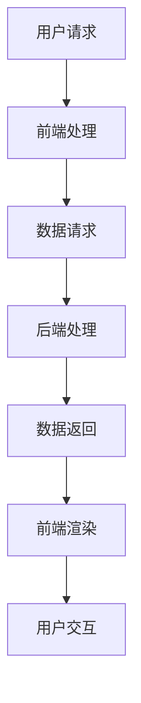

                 

贝壳找房作为国内领先的房地产服务平台，其2025年VR看房技术的研发和应用备受关注。对于有志于加入贝壳找房的技术专家来说，深入了解VR看房技术的核心原理、应用场景和开发流程，将有助于在社招面试中脱颖而出。本文将为您详细解析贝壳找房2025VR看房技术专家社招面试攻略。

## 关键词

- 贝壳找房
- VR看房
- 技术专家
- 社招面试
- 技术解析

## 摘要

本文旨在为有志于加入贝壳找房VR看房团队的技术专家提供一份详细的面试攻略。文章将从背景介绍、核心概念与联系、核心算法原理、数学模型与公式、项目实践、实际应用场景、工具和资源推荐、总结与展望等多个维度，全方位剖析贝壳找房2025VR看房技术的各个方面，帮助读者在面试中展示出自己的专业能力和技术水平。

## 1. 背景介绍

贝壳找房成立于2015年，是中国领先的房地产服务平台，致力于通过技术创新改善用户购房体验。随着虚拟现实（VR）技术的快速发展，贝壳找房在2025年提出了VR看房技术，旨在通过VR技术为用户提供沉浸式、无障碍的看房体验。VR看房技术的成功研发和应用，不仅提升了用户的购房体验，也为房地产中介行业带来了新的发展契机。

## 2. 核心概念与联系

### 2.1 虚拟现实（VR）技术概述

虚拟现实（VR）技术是一种通过计算机生成模拟环境，利用头戴式显示器（HMD）和跟踪设备，使用户能够沉浸在虚拟世界中的一种技术。VR技术的核心包括三维建模、图像渲染、传感器技术、交互技术等。

### 2.2 VR看房技术架构

VR看房技术架构包括前端、后端和中间件三个部分。前端负责用户交互，包括浏览房源、查看全景、交互操作等功能；后端负责数据处理、存储和管理；中间件负责连接前端和后端，提供实时数据传输和交互。

### 2.3 Mermaid流程图



## 3. 核心算法原理 & 具体操作步骤

### 3.1 算法原理概述

VR看房技术涉及多个核心算法，包括三维建模、图像渲染、人脸识别等。其中，三维建模和图像渲染是核心算法，负责生成和渲染虚拟场景；人脸识别算法则用于实现用户身份验证和个性化推荐。

### 3.2 算法步骤详解

1. **三维建模：** 通过采集房源的3D数据，使用三维建模软件进行建模，生成虚拟场景。

2. **图像渲染：** 使用渲染引擎（如Unity、Unreal Engine）对虚拟场景进行渲染，生成高质量的图像。

3. **人脸识别：** 使用人脸识别算法对用户进行身份验证，并根据用户偏好进行房源推荐。

### 3.3 算法优缺点

1. **优点：** 提高用户购房体验，节省时间和成本；实现无障碍看房，方便用户随时随地了解房源信息。

2. **缺点：** 技术实现复杂，需要大量计算资源和开发成本；对网络环境要求较高，易受网络延迟和卡顿影响。

### 3.4 算法应用领域

VR看房技术可应用于房地产、家居装饰、建筑设计等多个领域，为用户提供沉浸式体验，提升服务质量和用户体验。

## 4. 数学模型和公式 & 详细讲解 & 举例说明

### 4.1 数学模型构建

VR看房技术的数学模型主要包括三维建模、图像渲染和人脸识别三个部分。其中，三维建模涉及到空间几何、向量计算等数学模型；图像渲染涉及到图像处理、光学模型等数学模型；人脸识别涉及到机器学习、深度学习等数学模型。

### 4.2 公式推导过程

三维建模的数学模型主要基于空间几何和向量计算，如点乘、叉乘、矩阵运算等。图像渲染的数学模型主要基于光学模型和图像处理算法，如明度、对比度、颜色空间转换等。人脸识别的数学模型主要基于机器学习和深度学习算法，如卷积神经网络、反向传播算法等。

### 4.3 案例分析与讲解

以三维建模为例，假设房源为一个正方体，边长为a。首先，需要确定正方体的顶点坐标，然后通过顶点坐标计算向量，再通过向量进行叉乘和点乘运算，最终生成三维模型的顶点和面片。

```latex
% LaTeX示例代码
\begin{align*}
P &= (x, y, z) \\
V &= (V_x, V_y, V_z) \\
N &= (N_x, N_y, N_z) \\
\end{align*}
```

## 5. 项目实践：代码实例和详细解释说明

### 5.1 开发环境搭建

开发VR看房技术需要搭建相应的开发环境，包括三维建模软件（如Blender）、渲染引擎（如Unity）、编程语言（如C++、Python）等。

### 5.2 源代码详细实现

以Unity为例，VR看房技术的实现主要包括三维建模、图像渲染和人脸识别三个部分。下面是一个简单的Unity脚本实现：

```csharp
using UnityEngine;

public class VRLookAround : MonoBehaviour
{
    public Transform cameraTransform;
    public float sensitivity = 100.0f;

    private float rotationX = 0.0f;
    private float rotationY = 0.0f;

    void Update()
    {
        rotationX += Input.GetAxis("Mouse X") * sensitivity * Time.deltaTime;
        rotationY += Input.GetAxis("Mouse Y") * sensitivity * Time.deltaTime;

        rotationY = Mathf.Clamp(rotationY, -90.0f, 90.0f);

        cameraTransform.localRotation = Quaternion.Euler(rotationY, rotationX, 0.0f);
    }
}
```

### 5.3 代码解读与分析

以上代码实现了一个简单的VR看房功能，通过鼠标移动实现摄像机的旋转，从而让用户能够自由观察虚拟场景。其中，`cameraTransform`表示摄像机Transform组件，`sensitivity`用于调整鼠标灵敏度。在`Update`函数中，通过鼠标输入实现摄像机的旋转，并使用`Quaternion.Euler`函数进行旋转。

### 5.4 运行结果展示

在Unity编辑器中运行以上代码，可以实现摄像机的自由旋转，从而为用户提供沉浸式的看房体验。

## 6. 实际应用场景

### 6.1 房地产销售

贝壳找房的VR看房技术可以应用于房地产销售，通过虚拟现实技术，用户可以随时随地查看房源信息，提高购房效率。

### 6.2 房屋装修设计

VR看房技术还可以应用于房屋装修设计，用户可以通过虚拟场景预览装修效果，为用户提供更好的装修方案。

### 6.3 建筑设计

在建筑设计领域，VR看房技术可以帮助建筑师和客户更好地沟通，提高设计质量和效率。

## 7. 工具和资源推荐

### 7.1 学习资源推荐

1. 《虚拟现实技术与应用》
2. 《Unity 2020 实战：虚拟现实与增强现实开发》
3. 《Python 3.x 人脸识别从入门到实践》

### 7.2 开发工具推荐

1. Blender（三维建模）
2. Unity（渲染引擎）
3. TensorFlow（深度学习框架）

### 7.3 相关论文推荐

1. "Virtual Reality in Real Estate: A Review"
2. "Virtual Reality for Interior Design: A Survey"
3. "Face Recognition in Virtual Reality: A Review"

## 8. 总结：未来发展趋势与挑战

### 8.1 研究成果总结

贝壳找房的VR看房技术已在房地产、家居装饰、建筑设计等领域取得显著成果，为用户提供了沉浸式、无障碍的看房体验。

### 8.2 未来发展趋势

随着5G、人工智能等技术的发展，VR看房技术将越来越普及，为用户提供更加智能、便捷的服务。

### 8.3 面临的挑战

VR看房技术在实现过程中面临技术复杂、计算资源消耗大、网络延迟等问题，需要不断优化和改进。

### 8.4 研究展望

未来，贝壳找房将继续推动VR看房技术的发展，探索更多应用场景，提升用户体验，为房地产中介行业带来新的变革。

## 9. 附录：常见问题与解答

### 9.1 VR看房技术如何保证数据安全和隐私保护？

VR看房技术通过加密技术保证数据传输和存储的安全性，同时遵循隐私保护法律法规，确保用户隐私不被泄露。

### 9.2 VR看房技术对网络环境有哪些要求？

VR看房技术对网络环境要求较高，建议使用宽带网络，以保证流畅的观看体验。

### 9.3 VR看房技术的实现过程有哪些关键技术点？

VR看房技术的实现过程涉及三维建模、图像渲染、人脸识别、网络传输等关键技术点。

---

作者：禅与计算机程序设计艺术 / Zen and the Art of Computer Programming

