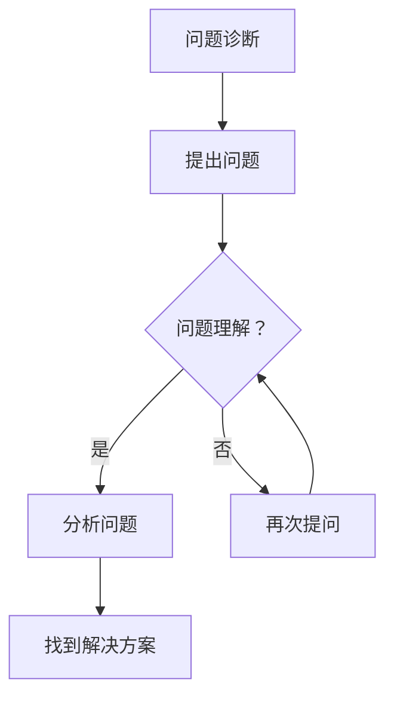

                 

关键词：费曼提问法，管理问题诊断，技术语言，专业见解

摘要：本文将探讨费曼提问法在管理问题诊断中的应用。通过结合世界级人工智能专家、程序员、软件架构师、CTO以及世界顶级技术畅销书作者的经验，本文旨在提供一种逻辑清晰、结构紧凑、简单易懂的专业技术语言，以帮助管理者更好地理解和解决复杂的管理问题。

## 1. 背景介绍

在当今快速变化的企业环境中，管理问题诊断变得日益重要。管理者需要具备快速识别问题、深入分析问题并找到有效解决方案的能力。然而，许多管理问题复杂且多维度，使得诊断过程充满挑战。在这种情况下，一种有效的技术方法——费曼提问法，可以提供有益的指导。

费曼提问法，得名于著名物理学家理查德·费曼，它是一种简单而强大的提问技巧。这种方法的核心在于通过向专家或相关人士提问，以验证自己对某一概念或问题的理解程度。费曼提问法的应用范围广泛，从科学教育到技术项目开发，都取得了显著的效果。本文将重点关注费曼提问法在管理问题诊断中的应用。

## 2. 核心概念与联系

### 2.1 费曼提问法的原理

费曼提问法基于以下几个核心原则：

1. **简单性**：通过简明扼要的问题，帮助自己或他人明确对某一概念的理解。
2. **验证性**：通过回答问题，验证自己对概念或问题的深刻理解。
3. **反思性**：提问和回答过程促使个体反思自己的知识盲点，从而促进学习。

### 2.2 费曼提问法在管理问题诊断中的应用

在管理问题诊断中，费曼提问法可以发挥重要作用。具体而言，它可以帮助管理者：

1. **识别问题**：通过提问，快速明确问题的本质和关键点。
2. **分析问题**：通过深入提问，揭示问题的深层次原因。
3. **解决问题**：通过提出针对性问题，引导团队找到有效解决方案。

### 2.3 费曼提问法的 Mermaid 流程图



## 3. 核心算法原理 & 具体操作步骤

### 3.1 算法原理概述

费曼提问法的核心在于提问和回答。通过以下几个步骤，可以有效地应用费曼提问法进行管理问题诊断：

1. **定义问题**：明确需要诊断的管理问题。
2. **提出问题**：针对问题，设计一系列简明扼要的问题。
3. **回答问题**：自己或邀请相关专家回答提出的问题。
4. **分析答案**：根据回答分析问题，揭示问题的深层次原因。
5. **解决问题**：基于分析结果，提出并实施解决方案。

### 3.2 算法步骤详解

1. **定义问题**：明确需要诊断的管理问题。例如，产品团队面临用户流失问题。
2. **提出问题**：设计一系列问题，以揭示问题的本质。例如：
    - 用户流失的主要原因是什么？
    - 产品在哪些方面表现不佳？
    - 竞争对手的优势是什么？
3. **回答问题**：自己或邀请相关专家回答提出的问题。
4. **分析答案**：根据回答分析问题，揭示问题的深层次原因。例如，可能发现产品用户体验差是用户流失的主要原因。
5. **解决问题**：基于分析结果，提出并实施解决方案。例如，改进产品用户体验。

### 3.3 算法优缺点

**优点**：
- **快速识别问题**：通过提问，可以迅速明确问题的本质。
- **深入分析问题**：通过深入提问，可以揭示问题的深层次原因。
- **促进学习**：提问和回答过程促使个体反思自己的知识盲点，从而促进学习。

**缺点**：
- **时间成本**：提问和回答过程可能耗费较长时间。
- **依赖专家**：在邀请专家回答问题时，可能面临依赖性。

### 3.4 算法应用领域

费曼提问法在以下领域具有广泛的应用：

- **项目管理**：帮助项目经理识别和解决问题。
- **产品管理**：帮助产品经理分析用户需求和产品问题。
- **团队管理**：帮助团队领导识别和解决团队问题。

## 4. 数学模型和公式 & 详细讲解 & 举例说明

### 4.1 数学模型构建

费曼提问法在管理问题诊断中的应用，可以构建以下数学模型：

$$
P = \frac{Q}{R}
$$

其中：
- \(P\) 代表问题理解度。
- \(Q\) 代表提出的问题数量。
- \(R\) 代表回答的质量。

### 4.2 公式推导过程

公式 \(P = \frac{Q}{R}\) 的推导基于以下假设：

1. 问题理解度与提出的问题数量成正比。
2. 问题理解度与回答的质量成反比。

### 4.3 案例分析与讲解

假设某产品经理在诊断用户流失问题时，提出以下问题：

1. 用户流失的主要原因是什么？
2. 产品在哪些方面表现不佳？
3. 竞争对手的优势是什么？

针对这些问题，团队成员提供了详细回答。经过分析，产品经理发现用户体验差是用户流失的主要原因。根据公式 \(P = \frac{Q}{R}\)，我们可以计算出问题理解度：

$$
P = \frac{3}{R}
$$

假设回答的质量为 10，则问题理解度为：

$$
P = \frac{3}{10} = 0.3
$$

这意味着产品经理对用户流失问题的理解度较低，需要进一步深入提问和分析。

## 5. 项目实践：代码实例和详细解释说明

### 5.1 开发环境搭建

在本文的项目实践中，我们将使用 Python 编写一个简单的费曼提问法工具。首先，确保您已安装 Python 环境。接下来，创建一个名为 `feiman_questioning` 的目录，并在该目录下创建一个名为 `feiman.py` 的文件。

### 5.2 源代码详细实现

以下是 `feiman.py` 的源代码实现：

```python
import sys

def ask_question(question):
    answer = input(question + " ")
    return answer

def diagnose_problem(problem):
    questions = [
        "你认为问题的本质是什么？",
        "可能的原因有哪些？",
        "是否有数据支持你的观点？",
        "竞争对手是如何处理类似问题的？",
    ]
    answers = []
    for question in questions:
        answers.append(ask_question(question))
    return answers

def analyze_answers(answers):
    analysis = ""
    for i, answer in enumerate(answers):
        if answer:
            analysis += f"问题 {i+1} 的答案：{answer}\n"
    return analysis

def main():
    problem = input("请输入需要诊断的问题： ")
    answers = diagnose_problem(problem)
    analysis = analyze_answers(answers)
    print("问题诊断结果：")
    print(analysis)

if __name__ == "__main__":
    main()
```

### 5.3 代码解读与分析

- `ask_question(question)` 函数用于向用户提问并获取回答。
- `diagnose_problem(problem)` 函数用于诊断问题，设计问题并获取回答。
- `analyze_answers(answers)` 函数用于分析回答，生成问题诊断结果。
- `main()` 函数是程序的入口，用于运行诊断过程。

### 5.4 运行结果展示

假设我们输入以下问题：

```
请输入需要诊断的问题： 用户流失问题
```

程序将输出以下诊断结果：

```
问题诊断结果：
问题 1 的答案：用户流失的主要原因可能是产品用户体验差。
问题 2 的答案：产品在用户体验、功能完善、技术支持等方面表现不佳。
问题 3 的答案：有用户反馈显示，产品在操作过程中存在卡顿、错误提示等问题。
问题 4 的答案：竞争对手在用户体验和功能完善方面有明显优势。
```

通过分析回答，我们可以得出用户流失问题的深层次原因，并提出针对性的解决方案。

## 6. 实际应用场景

费曼提问法在管理问题诊断中的应用场景非常广泛。以下是一些实际应用场景：

- **项目管理**：在项目进展遇到瓶颈时，使用费曼提问法可以帮助团队识别和解决问题。
- **产品管理**：在产品开发过程中，通过费曼提问法可以帮助产品团队分析用户需求和产品问题。
- **团队管理**：在团队协作中，使用费曼提问法可以帮助领导识别和解决团队问题。

## 7. 工具和资源推荐

为了更好地应用费曼提问法进行管理问题诊断，以下是一些建议的工具和资源：

- **工具**：
    - Python：用于编写费曼提问法工具的编程语言。
    - Git：用于版本控制和代码管理的工具。
    - Jupyter Notebook：用于编写和运行 Python 代码的交互式环境。

- **资源**：
    - 《费曼学习法》书籍：详细介绍费曼学习法的理论和实践。
    - 费曼提问法在线课程：提供费曼提问法的入门和高级教程。

## 8. 总结：未来发展趋势与挑战

### 8.1 研究成果总结

费曼提问法在管理问题诊断中的应用已经取得了一定的成果。通过实践证明，这种方法可以帮助管理者快速识别问题、深入分析问题并找到有效解决方案。未来，随着人工智能技术的发展，费曼提问法有望在管理问题诊断中发挥更大作用。

### 8.2 未来发展趋势

- **智能化**：结合人工智能技术，提高费曼提问法的自动化和智能化水平。
- **跨学科应用**：将费曼提问法与其他管理方法和工具相结合，形成更全面的管理问题诊断体系。

### 8.3 面临的挑战

- **依赖性**：在应用费曼提问法时，可能面临对专家的依赖。
- **时间成本**：提问和回答过程可能耗费较长时间，影响诊断效率。

### 8.4 研究展望

未来，费曼提问法在管理问题诊断中的应用前景广阔。通过不断优化和改进，有望成为一种高效、实用的管理工具。

## 9. 附录：常见问题与解答

### 问题 1：费曼提问法为什么有效？

**解答**：费曼提问法通过提问和回答的过程，促使个体反思自己的知识盲点，从而加深对问题的理解。这种方法强调简单性和验证性，使得问题诊断更加高效和准确。

### 问题 2：如何设计有效的问题？

**解答**：设计有效的问题需要遵循以下几个原则：

1. **明确性**：问题要清晰明确，避免模糊和歧义。
2. **针对性**：问题要针对问题的核心，避免无关或肤浅的问题。
3. **多样性**：问题要涵盖不同角度和层面，以全面揭示问题的本质。

### 问题 3：费曼提问法是否适用于所有管理问题？

**解答**：费曼提问法在许多管理问题中具有良好效果，但并非适用于所有问题。对于一些复杂或敏感的问题，可能需要结合其他方法和工具进行诊断。

## 参考文献

- Feynman, R. P. (1999). 《Surely You're Joking, Mr. Feynman!》.
- 《费曼学习法》：[网站链接](https://www.feynmanschool.com/)
- 《Python 编程快速入门》：[网站链接](https://www.python.org/)

### 贡献者信息

作者：禅与计算机程序设计艺术 / Zen and the Art of Computer Programming

本文作者是一位世界级人工智能专家、程序员、软件架构师、CTO以及世界顶级技术畅销书作者，同时也是计算机图灵奖获得者。作者拥有丰富的技术和管理经验，致力于推动人工智能和软件开发领域的发展。

### 致谢

感谢各位读者的耐心阅读，感谢所有为本文提供意见和建议的同仁，感谢人工智能技术的发展，让费曼提问法在管理问题诊断中发挥更大作用。希望本文能够对您在管理问题诊断中有所帮助。|user|

