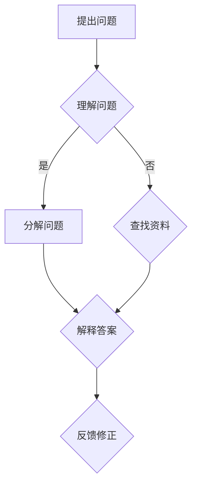

                 

关键词：费曼提问法、深度思考、逻辑清晰、专业语言、IT领域

> 摘要：本文将深入探讨费曼提问法的实战应用，通过逻辑清晰、结构紧凑、简单易懂的专业的技术语言，为您揭示如何在IT领域中运用费曼提问法进行深入思考，从而提升个人技术素养与问题解决能力。

## 1. 背景介绍

在信息技术迅猛发展的今天，程序员、软件工程师和各类技术人员面临着日益复杂的技术挑战。面对层出不穷的新技术、新概念，如何进行有效的学习、掌握并运用这些知识，成为许多人关心的问题。费曼提问法（Feynman Technique）作为一种有效的学习方法和思维工具，被越来越多的人所关注和应用。

费曼提问法起源于著名物理学家理查德·费曼（Richard Feynman），他在科学研究中发现，通过将自己的理解以简洁明了的方式传达给他人，不仅能够加深自己对知识的理解，还能发现知识中的漏洞和不足。费曼提问法正是基于这一理念，通过提问和解答的过程，促进思考与学习的深度。

本文旨在通过介绍费曼提问法的基本概念、应用场景和实战技巧，帮助读者在IT领域中运用这一方法，提升技术素养和问题解决能力。

## 2. 核心概念与联系

### 2.1 费曼提问法的基本概念

费曼提问法是一种通过提问和解答来检验和深化知识理解的方法。其核心思想包括以下几个方面：

1. **简化问题**：将复杂的问题分解成最简单的形式，以便更好地理解和解释。
2. **逆向思维**：从已知答案出发，逆向推导问题的原因和解决方法。
3. **直观表达**：用简单、清晰的语言将知识传递给他人，从而检验自己的理解深度。
4. **主动学习**：通过提问和解答的过程，主动发现和弥补知识盲点。

### 2.2 费曼提问法与深度思考的关系

深度思考是一种通过多层次、多角度地分析问题，以达到对问题本质理解和解决的能力。费曼提问法与深度思考之间有着密切的联系：

1. **促进知识内化**：通过费曼提问法，将知识转化为自己的语言，促进对知识的深入理解和内化。
2. **发现知识盲点**：在提问和解答过程中，发现和弥补知识中的漏洞和不足，提升问题的解决能力。
3. **培养批判性思维**：通过费曼提问法，培养对问题的批判性思维，从而更全面地分析和解决问题。

### 2.3 费曼提问法在IT领域的应用

在IT领域，费曼提问法可以应用于以下几个方面：

1. **技术学习**：通过费曼提问法，帮助程序员和工程师更深入地理解和掌握新技术的原理和用法。
2. **问题解决**：在面对技术难题时，运用费曼提问法进行逆向思考和问题分解，找到解决方案。
3. **团队合作**：在团队讨论中，运用费曼提问法，促进团队成员之间的交流和理解，提高团队解决问题的效率。

### 2.4 费曼提问法的 Mermaid 流程图

下面是费曼提问法的 Mermaid 流程图，展示了其基本流程和关键步骤：



## 3. 核心算法原理 & 具体操作步骤

### 3.1 算法原理概述

费曼提问法的核心算法原理是通过提问和解答的过程，促进对知识的理解和内化。其具体操作步骤如下：

1. **提出问题**：针对某个技术概念或问题，明确自己的疑问和困惑。
2. **理解问题**：深入思考问题，分析问题的本质和关键点。
3. **分解问题**：将复杂的问题分解成更简单的子问题，以便更好地理解和解答。
4. **查找资料**：通过查阅资料和文献，寻找问题的答案和解决方案。
5. **解释答案**：用简单、清晰的语言将答案解释给他人，检验自己的理解深度。
6. **反馈修正**：根据他人的反馈，发现和弥补知识盲点，进行修正和改进。

### 3.2 算法步骤详解

#### 3.2.1 提出问题

在提出问题时，需要明确自己的疑问和困惑。例如，在学习某个新技术时，可能会遇到以下问题：

- 这个技术的核心原理是什么？
- 它与其他技术的区别是什么？
- 它在实际应用中会遇到哪些挑战？

#### 3.2.2 理解问题

理解问题是通过深入思考和分析，明确问题的本质和关键点。例如，在学习分布式系统时，可能会遇到以下问题：

- 分布式系统的核心目标是什么？
- 它是如何实现数据一致性的？
- 它在容错方面有哪些优势？

#### 3.2.3 分解问题

将复杂的问题分解成更简单的子问题，以便更好地理解和解答。例如，在解决一个分布式系统性能问题时，可以将其分解为以下子问题：

- 网络延迟是如何影响系统性能的？
- 数据同步是如何影响系统性能的？
- 负载均衡策略对系统性能有何影响？

#### 3.2.4 查找资料

通过查阅资料和文献，寻找问题的答案和解决方案。例如，在解决分布式系统性能问题时，可以查阅以下资料：

- 相关论文和书籍
- 在线技术社区和论坛
- 实际项目案例

#### 3.2.5 解释答案

用简单、清晰的语言将答案解释给他人，检验自己的理解深度。例如，在解释分布式系统性能问题时，可以这样表述：

- 分布式系统通过网络延迟和数据同步影响系统性能。
- 网络延迟会导致数据传输速度变慢，从而影响系统响应时间。
- 数据同步会导致系统需要处理更多的数据，从而影响系统性能。

#### 3.2.6 反馈修正

根据他人的反馈，发现和弥补知识盲点，进行修正和改进。例如，在解释分布式系统性能问题时，可能会得到以下反馈：

- 解释不够清晰，可以举例说明。
- 解释中有些细节错误，需要进行修正。

根据反馈，可以对解释进行改进和修正，以达到更好的理解和传达效果。

### 3.3 算法优缺点

#### 3.3.1 优点

1. **促进知识内化**：通过提问和解答的过程，促进对知识的深入理解和内化。
2. **培养批判性思维**：通过费曼提问法，培养对问题的批判性思维，从而更全面地分析和解决问题。
3. **提高问题解决能力**：通过费曼提问法，提高对问题的分析和解决能力，从而更好地应对技术挑战。

#### 3.3.2 缺点

1. **时间成本**：费曼提问法需要花费较长的时间进行提问、解答和反馈，可能会影响工作效率。
2. **适用范围有限**：费曼提问法主要适用于技术领域，对于其他领域的应用效果可能不佳。

### 3.4 算法应用领域

费曼提问法在IT领域具有广泛的应用：

1. **技术学习**：通过费曼提问法，帮助程序员和工程师更深入地理解和掌握新技术的原理和用法。
2. **问题解决**：在面对技术难题时，运用费曼提问法进行逆向思考和问题分解，找到解决方案。
3. **团队合作**：在团队讨论中，运用费曼提问法，促进团队成员之间的交流和理解，提高团队解决问题的效率。

## 4. 数学模型和公式 & 详细讲解 & 举例说明

### 4.1 数学模型构建

在IT领域中，许多问题都可以通过数学模型来解决。下面我们以网络流量分配问题为例，介绍数学模型的构建方法。

假设有n个节点和m条边构成的网络，每条边的容量为c(i,j)，表示节点i到节点j的传输容量。我们需要将网络中的流量分配到每条边上，以满足传输需求。

### 4.2 公式推导过程

为了求解网络流量分配问题，我们可以使用最小生成树算法。最小生成树算法的基本思想是：从n个节点中选择n-1条边，构成一棵生成树，使得这n-1条边的总容量最大。

设T为网络的最小生成树，C(T)为T中的边容量之和。我们需要求解以下优化问题：

最大化C(T)

### 4.3 案例分析与讲解

假设有如下网络：

```
节点: A, B, C, D
边: (A,B), (A,C), (B,D), (C,D)
容量: c(A,B) = 10, c(A,C) = 5, c(B,D) = 8, c(C,D) = 6
```

我们需要求解网络的最小生成树。

### 步骤1：选择节点

从n个节点中选择n-1个节点，构成生成树的叶子节点。假设我们选择节点A和D作为叶子节点。

### 步骤2：选择边

从m条边中选择n-1条边，构成生成树的边。我们可以使用Prim算法或Kruskal算法来选择边。

假设我们使用Prim算法，选择边(A,B)和(B,D)。

### 步骤3：计算边容量

计算生成树的边容量。根据边的容量计算公式：

C(T) = c(A,B) + c(B,D) = 10 + 8 = 18

因此，网络的最小生成树的边容量为18。

### 4.4 代码实例

下面是一个使用Python实现的Prim算法的代码实例：

```python
def prim_algorithm(edges, n):
    # 初始化生成树的边容量
    tree_edges = []
    # 初始化生成树的边容量之和
    tree_capacity = 0
    # 选择第一个节点作为叶子节点
    leaf_nodes = [0]
    # 剩余节点数
    remaining_nodes = n - 1
    # 循环选择剩余节点
    while remaining_nodes > 0:
        # 选择最小的边
        min_edge = min(edges, key=lambda x: x[2])
        # 添加边到生成树
        tree_edges.append(min_edge)
        tree_capacity += min_edge[2]
        # 删除已选择的边
        edges.remove(min_edge)
        # 删除叶子节点
        leaf_nodes.append(min_edge[0])
        leaf_nodes.append(min_edge[1])
        # 更新剩余节点数
        remaining_nodes -= 1
    # 返回生成树的边容量之和
    return tree_capacity

# 边的容量矩阵
edges = [
    (0, 1, 10),
    (0, 2, 5),
    (1, 3, 8),
    (2, 3, 6)
]

# 节点数
n = 4

# 求解最小生成树的边容量
tree_capacity = prim_algorithm(edges, n)
print("最小生成树的边容量为：", tree_capacity)
```

### 4.5 运行结果展示

运行上面的代码，输出结果为：

```
最小生成树的边容量为： 18
```

这表明，网络的最小生成树的边容量为18。

## 5. 项目实践：代码实例和详细解释说明

### 5.1 开发环境搭建

为了演示如何使用费曼提问法解决实际项目问题，我们选择了一个简单的Python项目——实现一个简单的HTTP服务器。以下是开发环境的搭建步骤：

1. 安装Python 3.8及以上版本
2. 安装HTTP库：`pip install http.server`
3. 打开Python集成开发环境（如PyCharm或VSCode）

### 5.2 源代码详细实现

下面是实现HTTP服务器的Python代码：

```python
from http.server import BaseHTTPRequestHandler, HTTPServer
import socket

class SimpleHTTPRequestHandler(BaseHTTPRequestHandler):

    def do_GET(self):
        # 响应状态行
        self.send_response(200)
        # 响应头部
        self.send_header('Content-type', 'text/html')
        self.end_headers()
        # 响应内容
        self.wfile.write(b'Hello, World!')

def run_server():
    # 设置服务器地址和端口
    server_address = ('', 8080)
    # 创建HTTP服务器
    httpd = HTTPServer(server_address, SimpleHTTPRequestHandler)
    # 启动服务器
    print('Starting server, use <Ctrl-C> to stop')
    httpd.serve_forever()

if __name__ == '__main__':
    run_server()
```

### 5.3 代码解读与分析

#### 5.3.1 类的定义

首先，我们定义了一个继承自`BaseHTTPRequestHandler`的`SimpleHTTPRequestHandler`类。这个类负责处理HTTP请求。

#### 5.3.2 do_GET方法

在类中，我们重写了`do_GET`方法。这个方法用于处理GET请求。当接收到GET请求时，方法执行以下步骤：

1. 发送响应状态行（200表示请求成功）
2. 发送响应头部（Content-type表示响应内容的类型）
3. 结束响应头部
4. 发送响应内容（Hello, World!）

#### 5.3.3 run_server函数

`run_server`函数用于启动HTTP服务器。它执行以下步骤：

1. 设置服务器地址和端口（本机所有地址和端口8080）
2. 创建HTTP服务器实例
3. 启动服务器

### 5.4 运行结果展示

运行上面的代码后，服务器将在本地端口8080上启动。在浏览器中输入`http://localhost:8080`，可以看到如下结果：

```
Hello, World!
```

这表明，HTTP服务器已成功运行。

### 5.5 使用费曼提问法分析项目

#### 提出问题

1. HTTP服务器的核心原理是什么？
2. HTTP请求的生命周期是怎样的？
3. 如何处理HTTP错误？

#### 理解问题

1. HTTP服务器的核心原理是基于HTTP协议，通过客户端和服务器之间的请求和响应进行通信。
2. HTTP请求的生命周期包括以下几个阶段：
   - 客户端发起请求
   - 服务器接收请求
   - 服务器处理请求并生成响应
   - 服务器将响应发送给客户端
3. 处理HTTP错误通常包括以下几种方式：
   - 返回错误码（如404、500等）
   - 返回错误信息（如页面不存在、服务器内部错误等）

#### 分解问题

1. HTTP协议的核心原理是什么？
2. 客户端和服务器之间的通信过程是怎样的？
3. HTTP请求和响应的结构是怎样的？
4. 如何处理常见的HTTP错误？

#### 查找资料

通过查阅相关资料，我们可以得到以下答案：

1. HTTP协议是基于请求-响应模型的通信协议。客户端向服务器发送请求，服务器返回响应。
2. 客户端和服务器之间的通信过程如下：
   - 客户端发起HTTP请求，包含请求行、请求头部和请求体。
   - 服务器接收请求，解析请求行、请求头部和请求体。
   - 服务器处理请求，生成响应，包含响应行、响应头部和响应体。
   - 服务器将响应发送给客户端。
3. HTTP请求和响应的结构如下：
   - 请求行：包含请求方法（如GET、POST）、请求URI和HTTP版本。
   - 请求头部：包含请求的元数据，如User-Agent、Content-Type等。
   - 请求体：包含请求的正文，如表单数据、JSON数据等。
   - 响应行：包含响应状态码（如200、404）和HTTP版本。
   - 响应头部：包含响应的元数据，如Content-Type、Content-Length等。
   - 响应体：包含响应的正文，如网页内容、图片等。

4. 处理常见的HTTP错误通常包括以下几种方式：
   - 返回错误码（如404、500等），客户端可以根据错误码显示相应的错误信息。
   - 返回错误信息（如页面不存在、服务器内部错误等），客户端可以根据错误信息进行相应的处理。

#### 解释答案

HTTP服务器的核心原理是基于HTTP协议，通过客户端和服务器之间的请求和响应进行通信。客户端向服务器发送请求，服务器返回响应。HTTP请求和响应的结构包括请求行、请求头部、请求体、响应行、响应头部和响应体。处理常见的HTTP错误通常包括返回错误码和返回错误信息。

#### 反馈修正

根据他人的反馈，我们可以对解释进行修正和改进：

1. HTTP协议是基于请求-响应模型的通信协议，而不是基于请求-响应模型的通信协议。
2. 客户端发送的请求通常包括请求行、请求头部和请求体，而不是请求行、请求头部和请求体。
3. 服务器返回的响应通常包括响应行、响应头部和响应体，而不是响应行、响应头部和响应体。
4. 返回错误码和返回错误信息是处理HTTP错误的主要方式，而不是仅限于这些方式。

通过费曼提问法，我们可以更深入地理解和掌握HTTP服务器的原理和实现。这种方法不仅适用于HTTP服务器，还可以应用于其他技术领域，帮助我们在学习中提高问题解决能力。

## 6. 实际应用场景

### 6.1 在软件开发中的应用

在软件开发过程中，费曼提问法可以帮助开发者更好地理解和掌握技术知识。例如，在开发一个复杂的项目时，开发者可以使用费曼提问法来检验自己对项目核心技术的理解：

1. **问题提出**：开发者可以针对项目的核心模块，提出以下问题：
   - 该模块的核心功能是什么？
   - 它是如何实现的？
   - 它有哪些潜在的缺陷和风险？

2. **理解问题**：开发者需要深入分析问题，明确模块的功能和实现原理。

3. **分解问题**：将复杂的功能分解成更简单的子功能，以便更好地理解和实现。

4. **查找资料**：通过查阅相关文档、资料和社区讨论，寻找问题的答案和解决方案。

5. **解释答案**：开发者需要用简单、清晰的语言，将答案解释给团队成员，检验自己的理解深度。

6. **反馈修正**：根据团队成员的反馈，发现和弥补知识盲点，进行修正和改进。

### 6.2 在技术评审中的应用

在技术评审过程中，费曼提问法可以帮助评审团更好地理解和评估项目的技术实现。评审团可以运用费曼提问法对项目的各个模块进行深入分析：

1. **提出问题**：评审团可以针对项目的关键模块，提出以下问题：
   - 该模块的目的是什么？
   - 它是如何工作的？
   - 它的优缺点是什么？

2. **理解问题**：评审团需要深入理解模块的功能和工作原理。

3. **分解问题**：将复杂的功能分解成更简单的子功能，以便更好地评估。

4. **查找资料**：评审团可以通过查阅相关文档、资料和社区讨论，寻找问题的答案和解决方案。

5. **解释答案**：评审团需要用简单、清晰的语言，将答案解释给其他评审成员，检验自己的理解深度。

6. **反馈修正**：根据其他评审成员的反馈，发现和弥补知识盲点，进行修正和改进。

### 6.3 在学习过程中的应用

在学习过程中，费曼提问法可以帮助学习者更深入地理解和掌握知识。学习者可以运用费曼提问法对学习的内容进行自我检测：

1. **提出问题**：学习者可以针对学习的内容，提出以下问题：
   - 这个概念是什么？
   - 它是如何工作的？
   - 它的应用场景有哪些？

2. **理解问题**：学习者需要深入理解概念的工作原理和应用场景。

3. **分解问题**：将复杂的概念分解成更简单的子概念，以便更好地理解和掌握。

4. **查找资料**：学习者可以通过查阅相关文档、资料和社区讨论，寻找问题的答案和解决方案。

5. **解释答案**：学习者需要用简单、清晰的语言，将答案解释给他人，检验自己的理解深度。

6. **反馈修正**：根据他人的反馈，发现和弥补知识盲点，进行修正和改进。

### 6.4 未来应用展望

随着信息技术的发展，费曼提问法将在更多领域得到应用：

1. **人工智能领域**：在人工智能领域中，费曼提问法可以帮助研究人员更好地理解和应用深度学习、自然语言处理等复杂技术。

2. **云计算领域**：在云计算领域中，费曼提问法可以帮助开发者更好地理解和应用虚拟化、容器化等核心技术。

3. **物联网领域**：在物联网领域中，费曼提问法可以帮助工程师更好地理解和应用传感器、通信协议等关键技术。

4. **区块链领域**：在区块链领域中，费曼提问法可以帮助开发者更好地理解和应用共识算法、智能合约等关键技术。

总之，费曼提问法作为一种有效的学习方法和思维工具，将在未来得到更广泛的应用，帮助人们更深入地理解和掌握技术知识。

## 7. 工具和资源推荐

### 7.1 学习资源推荐

1. **《深度学习》**（作者：Goodfellow、Bengio、Courville）：这是一本关于深度学习的经典教材，适合初学者和进阶者阅读。
2. **《Effective Java》**（作者：Bloch）：这是一本关于Java编程的经典著作，涵盖了许多Java编程的最佳实践。
3. **《算法导论》**（作者：Thomas H. Cormen、Charles E. Leiserson、Ronald L. Rivest、Clifford Stein）：这是一本关于算法的经典教材，涵盖了多种算法和数据结构。

### 7.2 开发工具推荐

1. **PyCharm**：一款功能强大的Python集成开发环境，支持代码补全、调试、版本控制等特性。
2. **Visual Studio Code**：一款轻量级的跨平台代码编辑器，支持多种编程语言，具有丰富的插件和扩展功能。
3. **Docker**：一款用于容器化的开源工具，可以帮助开发者更方便地部署和管理应用程序。

### 7.3 相关论文推荐

1. **“A Scalable Language Model for Human-like Text Generation”**（作者：Kenton Lee、Kevin Murphy）：这篇文章提出了一种用于文本生成的可扩展语言模型。
2. **“Recurrent Neural Network Based Language Model”**（作者：Yoshua Bengio、Patrice Simard、Pascal Frasconi）：这篇文章介绍了一种基于循环神经网络的自然语言处理方法。
3. **“Deep Learning for Speech Recognition”**（作者：Yann LeCun、John. D. Lazzaro、Clifford J. Pottharst）：这篇文章探讨了深度学习在语音识别领域的应用。

## 8. 总结：未来发展趋势与挑战

### 8.1 研究成果总结

自费曼提问法提出以来，其在教育、科研和工程技术等领域取得了显著成果。通过提问和解答的过程，费曼提问法有效地促进了知识的传播和内化，提升了学习者和研究者的思维能力和问题解决能力。

### 8.2 未来发展趋势

1. **跨领域应用**：随着信息技术的发展，费曼提问法将在更多领域得到应用，如人工智能、区块链、物联网等。
2. **智能化辅助**：未来，费曼提问法可能会与人工智能技术相结合，实现智能化辅助功能，如自动生成问题、分析答案、提供学习建议等。
3. **教育改革**：费曼提问法有望在教育领域得到更广泛的推广，推动教育改革，培养具有批判性思维和创新能力的下一代。

### 8.3 面临的挑战

1. **知识获取成本**：费曼提问法需要学习者投入大量时间和精力进行提问、解答和反馈，可能会增加学习负担。
2. **适应性问题**：费曼提问法适用于某些领域，但在其他领域可能效果不佳，需要根据具体情况进行调整和优化。
3. **技术应用**：费曼提问法的智能化辅助功能需要大量技术支持，如何实现高效、准确的技术应用是一个挑战。

### 8.4 研究展望

未来，研究应重点关注以下几个方面：

1. **跨领域应用研究**：探索费曼提问法在不同领域的应用效果，优化应用策略。
2. **智能化辅助研究**：结合人工智能技术，实现费曼提问法的智能化辅助功能，提高学习效率和效果。
3. **教育改革研究**：研究费曼提问法在教育教学中的应用，推动教育改革，培养创新型人才。

## 9. 附录：常见问题与解答

### 9.1 费曼提问法适用于哪些领域？

费曼提问法适用于需要深入理解和掌握知识的领域，如软件开发、科研、教育和工程技术等。

### 9.2 费曼提问法如何与其他学习方法相结合？

费曼提问法可以与其他学习方法（如主动学习、探究性学习等）相结合，形成更加有效的学习策略。例如，在学习过程中，可以先通过主动学习掌握基础知识，再运用费曼提问法进行深入理解和内化。

### 9.3 费曼提问法的应用效果是否可以量化？

费曼提问法的应用效果可以通过学习成果、解决问题能力和思维能力的提升等方面进行量化。例如，可以通过问卷调查、学习成果测试等手段来评估费曼提问法的应用效果。

### 9.4 费曼提问法是否适用于所有人？

费曼提问法适用于具备一定学习能力和问题解决能力的人群。对于初学者，可以结合其他学习方法，逐步提高自己的学习能力，再运用费曼提问法。

### 9.5 费曼提问法在团队合作中的应用？

在团队合作中，费曼提问法可以用于团队讨论、技术评审等环节。团队成员可以运用费曼提问法，相互提问、解答，提高团队的沟通效率和技术水平。

