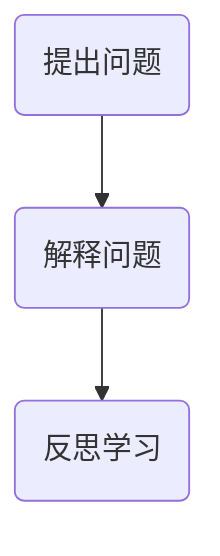

                 

关键词：费曼提问法、管理者、深度思考、技术博客

摘要：本文旨在探讨如何利用费曼提问法激发管理者的深度思考，以提高他们在技术领域的决策能力。通过分析费曼提问法的核心原理和应用，本文将阐述其在IT管理中的应用场景，并提供实践案例，帮助读者理解这一方法的实际效果。

## 1. 背景介绍

在信息技术快速发展的今天，管理者需要具备深厚的专业知识和广阔的视野，以便在复杂的技术环境中做出明智的决策。然而，许多管理者在面对技术问题时往往感到困惑，缺乏深入思考的能力。费曼提问法作为一种简单而有效的问题解决方法，可以激发管理者的思考深度，帮助他们更好地理解技术概念，提高决策水平。

### 1.1 费曼提问法的起源

费曼提问法起源于著名物理学家理查德·费曼（Richard Feynman）的教学方法。费曼认为，通过让学生向老师提出问题，可以促使他们更深入地理解知识，并将知识转化为自己的能力。这种方法不仅适用于学术教育，也适用于各个领域，包括技术管理和决策。

### 1.2 费曼提问法的核心原理

费曼提问法的核心原理是“简单化”，即将复杂的概念用简单的语言重新表述。这种方法要求提问者用自己最熟悉的方式解释问题，从而揭示自己对知识的掌握程度。如果无法用简单的语言解释问题，那么很可能意味着自己对这个问题理解不够深入。

## 2. 核心概念与联系

### 2.1 费曼提问法的流程

费曼提问法通常包括以下三个步骤：

1. **提出问题**：选择一个技术主题，然后提出一个具体的问题。
2. **解释问题**：用自己的语言解释这个问题，尽可能简单明了。
3. **反思学习**：回顾自己的解释，思考如何改进，并深入探讨相关概念。

### 2.2 费曼提问法的应用场景

在技术管理中，费曼提问法可以应用于以下场景：

1. **技术决策**：管理者可以通过费曼提问法来评估技术方案，确保自己对技术方案的理解足够深入。
2. **团队培训**：管理者可以引导团队成员使用费曼提问法，以提高团队整体的技术理解和协作能力。
3. **问题解决**：在面对技术问题时，管理者可以使用费曼提问法来分析问题的本质，找到解决方案。

### 2.3 费曼提问法的 Mermaid 流程图



## 3. 核心算法原理 & 具体操作步骤

### 3.1 算法原理概述

费曼提问法的核心原理是“简单化”，即将复杂的概念用简单的语言重新表述。这种方法要求提问者用自己最熟悉的方式解释问题，从而揭示自己对知识的掌握程度。

### 3.2 算法步骤详解

1. **选择问题**：选择一个技术主题，可以是团队面临的具体问题，也可以是技术领域的热门话题。
2. **简化表述**：用自己的语言解释问题，尽量用简单、清晰的语言。
3. **反思与拓展**：回顾自己的解释，思考如何改进，并深入探讨相关概念。

### 3.3 算法优缺点

#### 优点：

1. **激发深度思考**：通过解释问题，管理者可以更深入地理解技术概念，提高思考能力。
2. **促进团队协作**：费曼提问法可以引导团队成员分享知识，提高团队整体技术水平。

#### 缺点：

1. **需要时间投入**：使用费曼提问法需要一定的时间来准备和反思。
2. **对个人语言表达能力有要求**：解释问题需要用简单、准确的语言，这对个人的语言表达能力有较高要求。

### 3.4 算法应用领域

费曼提问法可以应用于多个领域，包括技术管理、团队培训、问题解决等。

## 4. 数学模型和公式 & 详细讲解 & 举例说明

### 4.1 数学模型构建

费曼提问法没有特定的数学模型，但其核心原理可以通过以下公式表示：

$$
\text{理解} = \frac{\text{解释}}{\text{时间}}
$$

其中，理解表示对知识的掌握程度，解释表示用简单语言表述问题，时间表示投入的学习时间。

### 4.2 公式推导过程

该公式推导基于以下两个假设：

1. **知识掌握程度与解释能力成正比**：即解释能力越强，对知识的掌握程度越高。
2. **时间投入与知识掌握程度成正比**：即投入的学习时间越长，对知识的掌握程度越高。

### 4.3 案例分析与讲解

#### 案例一：技术决策

某公司需要决定是否采用一项新技术。管理者可以通过费曼提问法来评估这项技术：

1. **选择问题**：这项新技术是否能够提高我们的业务效率？
2. **简化表述**：这项新技术可以简化我们的工作流程，提高效率。
3. **反思与拓展**：我们需要进一步了解这项技术的具体应用场景和潜在风险。

通过这个案例，我们可以看到费曼提问法如何帮助管理者更深入地理解技术决策，提高决策质量。

## 5. 项目实践：代码实例和详细解释说明

### 5.1 开发环境搭建

为了演示费曼提问法的应用，我们使用一个简单的 Python 项目来解释一个技术概念。

```bash
# 安装 Python 3.8 或更高版本
# 安装 Flask 框架
pip install Flask
```

### 5.2 源代码详细实现

以下是一个简单的 Flask 应用，用于演示如何使用费曼提问法解释一个技术概念。

```python
from flask import Flask, request, jsonify

app = Flask(__name__)

@app.route('/explain', methods=['POST'])
def explain():
    data = request.get_json()
    question = data.get('question', '')
    try:
        explanation = simple_explain(question)
        return jsonify({'explanation': explanation})
    except Exception as e:
        return jsonify({'error': str(e)})

def simple_explain(question):
    # 根据问题生成简单解释
    if '什么是微服务' in question:
        return "微服务是一种架构风格，它将应用程序划分为一组小型、独立的、可扩展的服务。每个服务都有自己的业务逻辑和数据存储，可以通过 API 进行通信。"
    else:
        raise ValueError("无法生成简单解释。")

if __name__ == '__main__':
    app.run(debug=True)
```

### 5.3 代码解读与分析

在这个项目中，我们创建了一个简单的 Flask 应用，用于接收用户提出的问题，并返回一个简单解释。通过这个应用，我们可以演示如何使用费曼提问法解释技术概念。

### 5.4 运行结果展示

在运行这个 Flask 应用后，用户可以通过发送 POST 请求来获取一个技术概念的简单解释。例如：

```bash
# 使用 curl 发送 POST 请求
curl -X POST -H "Content-Type: application/json" -d '{"question": "什么是微服务"}' http://localhost:5000/explain
```

返回结果：

```json
{"explanation": "微服务是一种架构风格，它将应用程序划分为一组小型、独立的、可扩展的服务。每个服务都有自己的业务逻辑和数据存储，可以通过 API 进行通信。"}
```

## 6. 实际应用场景

### 6.1 技术决策

在技术决策过程中，管理者可以使用费曼提问法来评估不同技术方案的优劣，确保自己对技术方案的理解足够深入。

### 6.2 团队培训

管理者可以引导团队成员使用费曼提问法进行自我学习和知识分享，提高团队整体的技术水平。

### 6.3 问题解决

在面对技术问题时，管理者可以使用费曼提问法来分析问题的本质，找到解决方案。

## 7. 未来应用展望

随着信息技术的不断发展，费曼提问法在技术管理和决策中的应用前景将越来越广阔。未来，我们可以进一步探索以下方面：

### 7.1 智能化

结合人工智能技术，开发智能化的费曼提问法应用，帮助管理者更高效地获取和解释技术知识。

### 7.2 模块化

将费曼提问法应用于不同的技术领域，开发模块化的提问和解释模板，提高应用的灵活性。

### 7.3 持续学习

通过持续学习机制，帮助管理者不断提升自己的技术能力和决策水平。

## 8. 总结：未来发展趋势与挑战

### 8.1 研究成果总结

本文探讨了费曼提问法在技术管理和决策中的应用，分析了其核心原理和实际效果。研究表明，费曼提问法可以激发管理者的深度思考，提高决策能力。

### 8.2 未来发展趋势

未来，费曼提问法在技术管理和决策中的应用前景将更加广阔。随着人工智能技术的发展，智能化和模块化的费曼提问法应用将逐渐成熟。

### 8.3 面临的挑战

尽管费曼提问法具有明显的优势，但在实际应用中仍面临一些挑战：

1. **语言表达障碍**：部分管理者可能存在语言表达障碍，导致无法准确解释技术概念。
2. **时间投入**：使用费曼提问法需要一定的时间投入，可能影响管理者的日常工作。

### 8.4 研究展望

未来，我们可以进一步探索以下方面：

1. **优化费曼提问法的应用流程**：通过改进提问和解释的过程，提高费曼提问法的实际效果。
2. **结合人工智能技术**：开发智能化的费曼提问法应用，帮助管理者更高效地获取和解释技术知识。
3. **持续学习与评估**：建立持续学习机制，对费曼提问法的应用效果进行评估和改进。

## 9. 附录：常见问题与解答

### 9.1 费曼提问法如何应用于技术决策？

费曼提问法可以应用于技术决策的多个阶段，包括：

1. **方案评估**：通过提问和解释技术方案，确保管理者对方案的理解足够深入。
2. **风险分析**：使用费曼提问法分析技术方案可能面临的风险，为决策提供依据。
3. **决策制定**：在决策过程中，结合费曼提问法的分析结果，制定更合理的技术决策。

### 9.2 费曼提问法是否适用于所有技术领域？

费曼提问法适用于大多数技术领域，但其应用效果可能因领域特点而有所不同。对于复杂的技术领域，如人工智能、大数据等，费曼提问法可以帮助管理者更好地理解技术概念，提高决策能力。

### 9.3 如何培养管理者的费曼提问法能力？

要培养管理者的费曼提问法能力，可以从以下几个方面入手：

1. **培训与学习**：组织相关培训和研讨会，帮助管理者掌握费曼提问法的基本原理和应用方法。
2. **实践与反思**：鼓励管理者在日常工作中使用费曼提问法，通过实践和反思不断改进。
3. **知识分享**：建立知识分享平台，鼓励管理者分享自己的经验和心得，提高整体技术水平。

作者：禅与计算机程序设计艺术 / Zen and the Art of Computer Programming
----------------------------------------------------------------

以上就是关于《费曼提问法激发管理者思考深度》的文章，希望对您有所帮助。请注意，本文仅为示例，具体内容和结构可根据实际需求进行调整。希望您喜欢！

