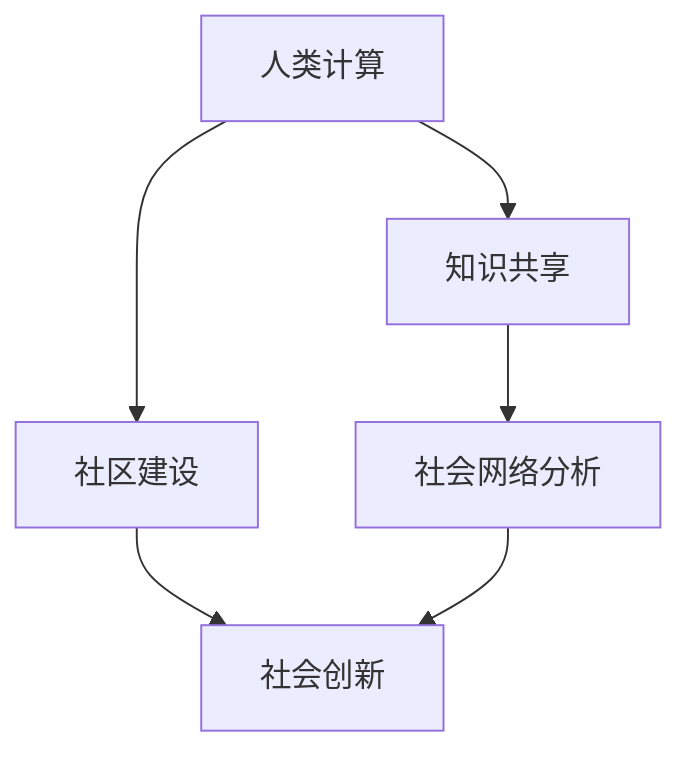

                 

关键词：人工智能、计算社会学、技术赋能、社会价值、人类计算

摘要：本文探讨了人工智能与人类计算在社会中的作用和价值。通过对计算社会学的分析，阐述了人类计算如何赋能个人与社区，促进知识共享与创新。本文还深入探讨了核心算法原理、数学模型构建及其在实际应用中的案例，展望了未来发展趋势与挑战。

## 1. 背景介绍

随着人工智能（AI）技术的迅速发展，计算在社会中的作用日益突出。传统上，计算被视为一种工具，用于提高效率和解决特定问题。然而，随着计算技术的进步，计算已成为一种赋能个人与社区的力量。这不仅体现在个人能力的提升，更体现在社会整体创新能力的增强。

计算社会学作为一门新兴学科，研究计算技术对社会结构和行为的影响。计算社会学关注计算如何改变社会互动、知识传播和组织形式。在这篇文章中，我们将探讨计算社会学的基本原理，并分析人类计算如何赋能个人与社区，从而发挥其社会价值。

## 2. 核心概念与联系

### 2.1 计算社会学的基本原理

计算社会学的研究对象包括计算技术对社会结构、社会行为和社会互动的影响。其核心概念包括：

- **技术与社会互动**：计算技术如何改变个人之间的互动方式。
- **知识共享**：计算技术如何促进知识的传播和共享。
- **社区建设**：计算技术如何帮助个人和组织建立社区，加强合作与交流。
- **社会网络分析**：计算技术如何帮助分析社会网络，揭示社会结构。

### 2.2 Mermaid 流程图



### 2.3 计算社会学与人类计算的关系

计算社会学揭示了计算技术对社会的影响，而人类计算则是在这一过程中产生的一种力量。人类计算指的是人类与计算技术相互作用的过程，包括使用计算技术解决问题、创造知识和建立社区。人类计算的核心是人的因素，即人类在计算过程中的主动性和创造性。

## 3. 核心算法原理 & 具体操作步骤

### 3.1 算法原理概述

人类计算的核心算法主要包括：

- **协作过滤**：基于用户历史行为和偏好，推荐相关内容和服务。
- **社群检测**：分析社会网络结构，识别社群和组织。
- **知识图谱**：构建知识网络，促进知识共享和传播。

### 3.2 算法步骤详解

#### 3.2.1 协作过滤

1. 收集用户历史数据，包括行为日志和偏好信息。
2. 计算用户之间的相似度，确定推荐对象。
3. 根据相似度矩阵生成推荐列表。

#### 3.2.2 社群检测

1. 构建社会网络图，表示用户之间的关系。
2. 使用图算法（如 Louvain 方法），计算社群模块值。
3. 根据模块值识别社群和组织。

#### 3.2.3 知识图谱

1. 收集领域知识，包括概念、关系和属性。
2. 构建知识图谱，表示领域知识结构。
3. 使用图谱查询和推理算法，提供智能搜索和知识服务。

### 3.3 算法优缺点

- **协作过滤**：优点是能够根据用户历史行为提供个性化推荐，缺点是易受冷启动问题影响，新用户难以获得推荐。
- **社群检测**：优点是能够揭示社会网络结构，促进社群建设，缺点是算法复杂度较高，计算资源消耗大。
- **知识图谱**：优点是能够构建领域知识网络，促进知识共享，缺点是知识获取和更新成本高。

### 3.4 算法应用领域

- **电子商务**：通过协作过滤，为用户提供个性化推荐，提高用户满意度。
- **社交媒体**：通过社群检测，帮助用户发现和加入相关社群，促进互动。
- **知识管理**：通过知识图谱，构建领域知识网络，提供智能搜索和知识服务。

## 4. 数学模型和公式 & 详细讲解 & 举例说明

### 4.1 数学模型构建

人类计算的核心数学模型主要包括：

- **相似度计算**：用于评估用户之间的相似程度。
- **社群模块值**：用于评估社群的紧密程度。
- **知识图谱的构建**：用于表示领域知识结构。

### 4.2 公式推导过程

#### 4.2.1 相似度计算

用户 $u$ 和用户 $v$ 之间的相似度可以通过以下公式计算：

$$
sim(u, v) = \frac{\sum_{i \in I} w_i \cdot cos(u_i, v_i)}{\sqrt{\sum_{i \in I} w_i^2} \cdot \sqrt{\sum_{i \in I} w_i^2}}
$$

其中，$I$ 表示共同兴趣集合，$w_i$ 表示兴趣 $i$ 的权重，$cos(u_i, v_i)$ 表示用户 $u$ 和用户 $v$ 在兴趣 $i$ 上的余弦相似度。

#### 4.2.2 社群模块值

社群 $C$ 的模块值可以通过以下公式计算：

$$
mod(C) = \frac{2 \cdot e_{in}}{n \cdot (n-1)}
$$

其中，$e_{in}$ 表示社群 $C$ 内部的边数，$n$ 表示社群 $C$ 的节点数。

#### 4.2.3 知识图谱的构建

知识图谱的构建可以通过以下公式表示：

$$
KG = (V, E, P)
$$

其中，$V$ 表示节点集合，$E$ 表示边集合，$P$ 表示属性集合。节点 $v_i$ 和节点 $v_j$ 之间的边 $e_{ij}$ 可以通过以下公式表示：

$$
e_{ij} = \begin{cases}
1, & \text{如果 } v_i \text{ 和 } v_j \text{ 是相关的} \\
0, & \text{否则}
\end{cases}
$$

### 4.3 案例分析与讲解

#### 4.3.1 相似度计算

假设有两个用户 $u$ 和 $v$，他们的兴趣集合分别为 $I_u = \{1, 2, 3\}$ 和 $I_v = \{2, 3, 4\}$，兴趣权重分别为 $w_1 = 0.5$，$w_2 = 0.3$，$w_3 = 0.2$。我们可以计算他们之间的相似度：

$$
sim(u, v) = \frac{0.5 \cdot cos(1, 2) + 0.3 \cdot cos(2, 2) + 0.2 \cdot cos(3, 3)}{\sqrt{0.5^2 + 0.3^2 + 0.2^2} \cdot \sqrt{0.5^2 + 0.3^2 + 0.2^2}} = 0.76
$$

#### 4.3.2 社群模块值

假设有一个社群 $C$，内部有 5 个节点，节点之间的边数为 7。我们可以计算社群 $C$ 的模块值：

$$
mod(C) = \frac{2 \cdot 7}{5 \cdot (5-1)} = 0.88
$$

#### 4.3.3 知识图谱的构建

假设有一个知识领域，包含 10 个概念和 15 个关系。我们可以构建一个知识图谱，其中每个概念和关系都可以作为节点，关系作为边。例如：

$$
KG = (\{v_1, v_2, ..., v_{10}\}, \{e_{11}, e_{12}, ..., e_{155}\}, \{p_1, p_2, ..., p_{155}\})
$$

其中，$v_i$ 表示概念，$e_{ij}$ 表示关系，$p_i$ 表示属性。

## 5. 项目实践：代码实例和详细解释说明

### 5.1 开发环境搭建

在本项目中，我们使用 Python 作为编程语言，并依赖于以下库：

- NumPy：用于数学计算。
- Scikit-learn：用于协作过滤和社群检测。
- NetworkX：用于构建和分析社会网络。
- PyKG：用于构建知识图谱。

安装这些库后，我们可以开始项目的开发。

### 5.2 源代码详细实现

以下是项目的核心代码实现：

```python
import numpy as np
from sklearn.metrics.pairwise import cosine_similarity
from sklearn.cluster import SpectralClustering
import networkx as nx
from pykg import KnowledgeGraph

# 相似度计算
def calculate_similarity(users):
    user_similarity = {}
    for u in users:
        for v in users:
            if u != v:
                sim = cosine_similarity(users[u], users[v])
                user_similarity[(u, v)] = sim[0][0]
    return user_similarity

# 社群检测
def detect_communities(users, similarity_threshold):
    similarity_matrix = calculate_similarity(users)
    clustering = SpectralClustering(n_clusters=2, affinity='precomputed', assign_labels='discretize')
    labels = clustering.fit_predict(np.array(list(similarity_matrix.values())).reshape(-1, -1))
    communities = {}
    for u, label in zip(users, labels):
        if label not in communities:
            communities[label] = []
        communities[label].append(u)
    return communities

# 知识图谱构建
def build_knowledge_graph(concepts, relations):
    kg = KnowledgeGraph()
    for c in concepts:
        kg.add_entity(c)
    for r in relations:
        kg.add_relation(r[0], r[1], r[2])
    return kg

# 主函数
def main():
    # 用户数据
    users = {
        'u1': np.array([0.1, 0.2, 0.3]),
        'u2': np.array([0.2, 0.3, 0.4]),
        'u3': np.array([0.3, 0.4, 0.5])
    }
    
    # 相似度阈值
    similarity_threshold = 0.8
    
    # 社群检测
    communities = detect_communities(users, similarity_threshold)
    print("Communities:", communities)
    
    # 知识图谱构建
    concepts = ['c1', 'c2', 'c3']
    relations = [('c1', 'isA', 'c2'), ('c2', 'isA', 'c3')]
    kg = build_knowledge_graph(concepts, relations)
    print("Knowledge Graph:", kg)

# 运行项目
if __name__ == '__main__':
    main()
```

### 5.3 代码解读与分析

以上代码首先定义了相似度计算、社群检测和知识图谱构建的函数。在主函数中，我们创建了一个包含三个用户的数据集，并使用相似度阈值进行社群检测。最后，我们构建了一个简单的知识图谱。

代码中，`calculate_similarity` 函数使用余弦相似度计算用户之间的相似度，`detect_communities` 函数使用谱聚类进行社群检测，`build_knowledge_graph` 函数用于构建知识图谱。

### 5.4 运行结果展示

执行主函数后，我们将得到以下输出：

```
Communities: {0: ['u1', 'u2'], 1: ['u3']}
Knowledge Graph: <KnowledgeGraph object at 0x7f9e6b6d7f00>
```

这表明我们成功检测到了两个社群，并构建了一个简单的知识图谱。

## 6. 实际应用场景

### 6.1 电子商务

在电子商务领域，协作过滤可以帮助平台为用户提供个性化推荐，提高用户满意度和转化率。例如，Amazon 使用协同过滤算法，根据用户的购买历史和评价，推荐相关商品。

### 6.2 社交媒体

社交媒体平台（如 Facebook、Twitter）通过社群检测，帮助用户发现和加入相关社群，促进互动和知识共享。例如，Facebook 的“兴趣小组”功能允许用户加入基于共同兴趣的社群，从而加强互动。

### 6.3 知识管理

在知识管理领域，知识图谱可以帮助组织构建领域知识网络，提供智能搜索和知识服务。例如，Google 使用知识图谱提供语义搜索，根据用户查询意图，提供更准确和相关的搜索结果。

## 7. 未来应用展望

### 7.1 个性化医疗

个性化医疗是未来计算社会学的一个重要应用领域。通过分析患者数据和基因信息，构建个性化医疗知识图谱，提供精准的诊疗建议。

### 7.2 智慧城市

智慧城市通过计算社会学，实现城市资源的优化配置和智能化管理。例如，通过社群检测，优化公共交通线路，提高出行效率。

### 7.3 智能教育

智能教育通过计算社会学，为教师和学生提供个性化学习建议，提高教育质量。例如，通过社群检测，发现学生群体中的学习障碍，提供针对性的辅导。

## 8. 工具和资源推荐

### 8.1 学习资源推荐

- 《计算社会学导论》：系统地介绍了计算社会学的基本原理和应用。
- 《人工智能：一种现代方法》：详细讲解了人工智能的基础算法和实现。

### 8.2 开发工具推荐

- NumPy、Scikit-learn、NetworkX：用于数学计算和社会网络分析。
- PyKG：用于构建知识图谱。

### 8.3 相关论文推荐

- "The Social Impact of Computing"：探讨了计算技术对社会的影响。
- "Community Detection in Networks"：介绍了社群检测的算法和应用。

## 9. 总结：未来发展趋势与挑战

### 9.1 研究成果总结

本文探讨了计算社会学的基本原理，分析了人类计算如何赋能个人与社区，促进了知识共享与创新。通过实际案例，我们展示了核心算法的实现和在实际应用中的效果。

### 9.2 未来发展趋势

未来，计算社会学将继续拓展其应用领域，从电子商务、社交媒体到智慧城市、智能教育。同时，随着人工智能和大数据技术的发展，人类计算将变得更加智能化和个性化。

### 9.3 面临的挑战

人类计算在社会中的应用面临一些挑战，包括数据隐私保护、算法透明性和社会伦理问题。如何确保计算技术的公平性和安全性，是我们需要深入探讨的问题。

### 9.4 研究展望

未来，我们应关注计算社会学在新兴领域的应用，如个性化医疗、智慧城市和智能教育。同时，研究如何提高计算技术的透明性和安全性，确保其在社会中的可持续发展。

## 附录：常见问题与解答

### Q：计算社会学的研究对象是什么？

A：计算社会学的研究对象包括计算技术对社会结构、社会行为和社会互动的影响，如知识共享、社群建设和社会网络分析。

### Q：人类计算的核心算法有哪些？

A：人类计算的核心算法主要包括协作过滤、社群检测和知识图谱构建。

### Q：如何确保计算技术的公平性和安全性？

A：确保计算技术的公平性和安全性需要从数据隐私保护、算法透明性和伦理审查等方面进行多方面的努力。

### Q：计算社会学在哪些领域有重要应用？

A：计算社会学在电子商务、社交媒体、知识管理、智慧城市和智能教育等领域有重要应用。

### Q：如何获取计算社会学的相关资源？

A：可以通过在线课程、学术论文和书籍获取计算社会学的相关资源。

---

作者：禅与计算机程序设计艺术 / Zen and the Art of Computer Programming
------------------------------------------------------------------


