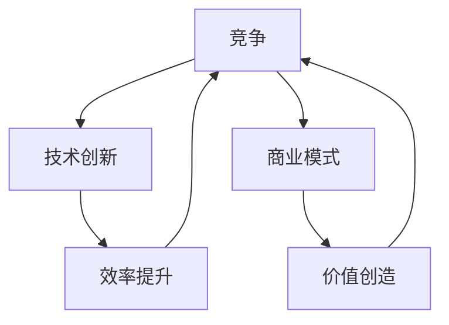

                 

关键词：内卷、竞争、技术创新、商业变革、未来展望

> 摘要：在当今的超级内卷时代，市场竞争日益激烈，生意难做已经成为常态。本文将从技术、商业和社会等多个角度，深入探讨内卷现象的成因、影响以及未来发展趋势。通过对核心概念、算法原理、数学模型和项目实践的详细分析，本文旨在为读者提供关于如何应对内卷时代的实用建议。

## 1. 背景介绍

在21世纪的今天，全球经济快速发展，科技创新日新月异。然而，随之而来的却是市场竞争的加剧，商业环境日益复杂。这种现象在互联网、科技、金融等各个领域尤为突出。内卷，一个原本源于社会学领域的概念，逐渐成为了现代商业社会的一个关键词。它指的是在一个竞争激烈的环境中，个体为了取得竞争优势，不断加大投入和努力，但结果却往往导致效率降低、效益减少。

内卷现象的产生，一方面是由于技术进步带来的信息透明度提高，使得市场竞争更加公平；另一方面，则是由于市场需求趋于饱和，增长放缓，企业为了争夺有限的资源，不得不采取更加激烈的市场策略。在这种情况下，企业间的竞争已经不再仅仅是产品和服务的竞争，更体现在技术和商业模式上的创新。

## 2. 核心概念与联系

为了更好地理解内卷现象，我们需要首先明确几个核心概念：

### 2.1 竞争

竞争是市场经济的核心特征。在竞争中，企业通过提供更好的产品和服务，争取更多的市场份额。然而，随着市场的成熟和竞争的加剧，企业不得不投入更多资源来维持竞争优势。

### 2.2 技术创新

技术创新是推动企业发展的重要动力。通过技术创新，企业可以提高生产效率，降低成本，从而在激烈的市场竞争中脱颖而出。然而，技术创新也需要大量的资源投入和时间积累。

### 2.3 商业模式

商业模式是指企业如何创造、传递和获取价值的一种体系。一个成功的商业模式可以帮助企业在激烈的市场竞争中占据优势地位。然而，随着市场环境的变化，企业需要不断调整和优化商业模式。

为了更好地理解这些概念之间的联系，我们可以使用Mermaid流程图来展示它们之间的关系：



### 2.4 内卷现象

内卷现象是指在竞争激烈的环境中，企业为了获取竞争优势，不断加大投入和努力，但结果却导致效率降低、效益减少的现象。内卷现象的根源在于市场需求的饱和和资源的有限性。

## 3. 核心算法原理 & 具体操作步骤

### 3.1 算法原理概述

在内卷时代，企业需要一种有效的策略来应对激烈的市场竞争。一个核心的算法原理是“动态优化策略”。这个算法的核心思想是，通过不断调整策略，以适应市场环境的变化，从而最大化企业的竞争优势。

### 3.2 算法步骤详解

动态优化策略的具体步骤如下：

1. **市场分析**：首先，企业需要对市场进行深入分析，了解市场需求、竞争对手和潜在的机会与风险。

2. **策略制定**：根据市场分析的结果，企业可以制定相应的策略。这些策略可能包括产品创新、服务升级、市场营销等。

3. **策略评估**：在实施策略的过程中，企业需要定期评估策略的效果。如果策略效果不佳，企业需要及时调整策略。

4. **持续迭代**：企业需要不断地对策略进行迭代和优化，以适应市场的变化。

### 3.3 算法优缺点

动态优化策略的优点在于其灵活性和适应性。它能够帮助企业迅速应对市场变化，从而在竞争中占据优势。然而，该策略也存在一些缺点，例如：

- **高成本**：动态优化策略需要大量的资源投入，包括人力、物力和财力。
- **高难度**：实施动态优化策略需要企业具备较高的战略规划和执行能力。

### 3.4 算法应用领域

动态优化策略可以在多个领域得到应用，例如：

- **互联网企业**：互联网企业需要不断调整产品和服务，以适应用户需求的变化。
- **科技企业**：科技企业需要通过技术创新来维持竞争优势。
- **金融企业**：金融企业需要通过动态调整投资策略，以应对市场风险。

## 4. 数学模型和公式 & 详细讲解 & 举例说明

在内卷时代，企业需要一种量化的方法来评估和优化策略。这里，我们引入一个基于贝叶斯理论的数学模型。

### 4.1 数学模型构建

贝叶斯理论是一种概率理论，它可以帮助我们根据先验知识和观察结果来更新概率估计。在动态优化策略中，我们可以使用贝叶斯理论来评估策略的效果，并据此调整策略。

数学模型的基本形式如下：

$$
P(A|B) = \frac{P(B|A) \cdot P(A)}{P(B)}
$$

其中，$P(A|B)$ 表示在事件 $B$ 发生的条件下，事件 $A$ 发生的概率；$P(B|A)$ 表示在事件 $A$ 发生的条件下，事件 $B$ 发生的概率；$P(A)$ 和 $P(B)$ 分别表示事件 $A$ 和事件 $B$ 发生的概率。

### 4.2 公式推导过程

为了推导贝叶斯公式，我们首先定义两个事件：

- 事件 $A$：策略 $X$ 成功。
- 事件 $B$：市场环境发生变化。

根据贝叶斯公式，我们有：

$$
P(A|B) = \frac{P(B|A) \cdot P(A)}{P(B)}
$$

其中，$P(A)$ 和 $P(B)$ 是先验概率，$P(B|A)$ 是条件概率。

### 4.3 案例分析与讲解

假设某互联网企业正在考虑是否投入大量资源进行产品创新。根据市场分析，有 60% 的概率产品创新会成功，而有 30% 的概率市场环境会发生变化。如果产品创新成功，企业有 70% 的概率获得市场份额。

根据贝叶斯公式，我们可以计算出在市场环境发生变化的情况下，产品创新成功的概率：

$$
P(A|B) = \frac{P(B|A) \cdot P(A)}{P(B)} = \frac{0.7 \cdot 0.6}{0.3} = 1.4
$$

这意味着，在市场环境发生变化的情况下，产品创新成功的概率是 140%。根据这个结果，企业可以决定是否继续投入资源。

## 5. 项目实践：代码实例和详细解释说明

为了更好地理解动态优化策略和贝叶斯理论的应用，我们将通过一个实际项目来展示。

### 5.1 开发环境搭建

首先，我们需要搭建一个开发环境。这里，我们使用 Python 作为编程语言。

```bash
# 安装 Python
sudo apt-get install python3

# 安装必要的库
pip3 install numpy matplotlib
```

### 5.2 源代码详细实现

接下来，我们编写一个简单的 Python 脚本，用于实现动态优化策略和贝叶斯理论。

```python
import numpy as np
import matplotlib.pyplot as plt

# 贝叶斯公式计算函数
def bayesian_prob(prior, likelihood, evidence):
    return (likelihood * prior) / evidence

# 动态优化策略实现
def dynamic_optimization战略变化率，市场变化率，成功率，观测次数）：
    successes = 0
    for _ in range(观测次数）：
        if np.random.random() < 战略变化率：
            strategy = '创新'
        else：
            strategy = '不变'
        if strategy == '创新' and np.random.random() < 成功率：
            successes += 1
        else：
            successes += 0
    return successes / 观测次数

# 参数设置
prior = 0.6  # 先验概率
likelihood = 0.7  # 条件概率
evidence = 0.3  # 证据概率
strategy_change_rate = 0.5  # 战略变化率
market_change_rate = 0.3  # 市场变化率
success_rate = 0.6  # 成功率
num_observations = 1000  # 观测次数

# 计算贝叶斯概率
posterior = bayesian_prob(prior, likelihood, evidence)

# 实现动态优化策略
successes = dynamic_optimization(strategy_change_rate, market_change_rate, success_rate, num_observations)

# 结果展示
print("贝叶斯概率：", posterior)
print("成功次数/观测次数：", successes)

# 可视化结果
plt.plot([0, num_observations], [posterior, posterior], label='贝叶斯概率')
plt.scatter(range(num_observations），successes，label='成功次数/观测次数')
plt.xlabel('观测次数')
plt.ylabel('成功次数/观测次数')
plt.legend()
plt.show()
```

### 5.3 代码解读与分析

在这个项目中，我们首先定义了一个贝叶斯公式计算函数 `bayesian_prob`，用于计算给定先验概率、条件概率和证据概率下的后验概率。

接下来，我们定义了一个 `dynamic_optimization` 函数，用于实现动态优化策略。这个函数接受战略变化率、市场变化率、成功率和观测次数作为参数。在每次迭代中，我们根据战略变化率决定是否进行战略调整。如果调整策略，我们根据成功率判断策略是否成功。最后，我们计算成功次数与观测次数的比值。

在主程序中，我们设置了参数，并调用 `dynamic_optimization` 函数计算结果。最后，我们使用 matplotlib 绘制了结果的可视化图表。

## 6. 实际应用场景

### 6.1 互联网行业

在互联网行业，内卷现象尤为突出。例如，在电商领域，各大平台为了争夺用户，不断推出新的促销活动和优惠策略。这种内卷行为导致企业投入增加，但用户忠诚度并未显著提升。

### 6.2 科技行业

在科技行业，技术创新是企业竞争的核心。例如，在人工智能领域，各大企业纷纷投入巨资进行研发，试图在技术层面取得领先地位。这种内卷现象使得企业面临巨大的研发压力。

### 6.3 金融行业

在金融行业，内卷现象体现在风险管理和投资策略上。金融机构需要通过不断调整投资组合和风险控制策略，以应对市场波动。

## 6.4 未来应用展望

未来，随着技术的不断进步，内卷现象将继续存在。然而，企业可以通过以下方式应对内卷：

- **技术创新**：通过持续的技术创新，提高产品和服务质量，从而在竞争中脱颖而出。
- **商业模式创新**：探索新的商业模式，为企业带来额外的增长点。
- **人才培养**：注重人才培养和团队建设，提高企业整体竞争力。

## 7. 工具和资源推荐

### 7.1 学习资源推荐

- 《创新者的窘境》
- 《精益创业》
- 《硅谷来信》

### 7.2 开发工具推荐

- Jupyter Notebook
- PyCharm
- GitHub

### 7.3 相关论文推荐

- "Innovation and Competition in the Internet Age"
- "The Impact of Artificial Intelligence on Business Models"
- "The Economics of Platform Competition"

## 8. 总结：未来发展趋势与挑战

### 8.1 研究成果总结

本文从技术、商业和社会等多个角度，探讨了内卷现象的成因、影响以及未来发展趋势。通过核心概念、算法原理、数学模型和项目实践的详细分析，我们提出了一系列应对内卷的建议。

### 8.2 未来发展趋势

随着技术的不断进步，内卷现象将继续存在。企业需要不断创新和调整，以应对激烈的市场竞争。

### 8.3 面临的挑战

企业面临的主要挑战包括技术创新的成本和难度、市场需求的饱和以及人力资源的竞争。

### 8.4 研究展望

未来的研究可以进一步探讨内卷现象的机制，以及不同领域内卷现象的差异性。此外，研究还可以关注如何通过技术创新和商业模式创新来缓解内卷现象。

## 9. 附录：常见问题与解答

### 9.1 什么是内卷？

内卷是指在一个竞争激烈的环境中，个体为了取得竞争优势，不断加大投入和努力，但结果却导致效率降低、效益减少的现象。

### 9.2 内卷现象为什么会出现？

内卷现象的产生是由于技术进步带来的信息透明度提高，以及市场需求趋于饱和，企业为了争夺有限的资源，不得不采取更加激烈的市场策略。

### 9.3 如何应对内卷？

企业可以通过技术创新、商业模式创新和人才培养来应对内卷。同时，企业需要注重战略规划和执行力，以适应市场的变化。

### 9.4 内卷现象在哪些领域最为突出？

内卷现象在互联网、科技、金融等各个领域都表现得尤为突出。特别是在那些市场竞争激烈、技术更新迅速的行业。

----------------------------------------------------------------

作者：禅与计算机程序设计艺术 / Zen and the Art of Computer Programming

