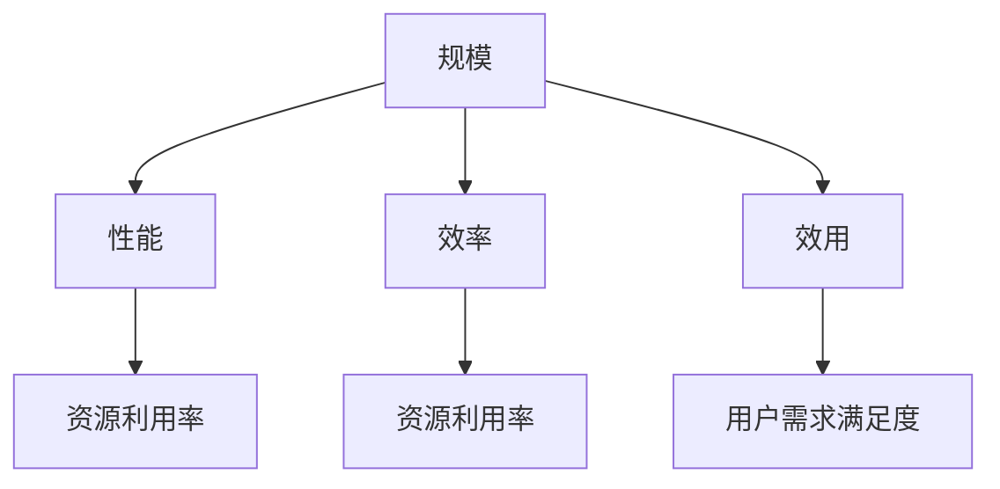

                 

关键词：规模化定律、应用、算法、数学模型、实践、展望

> 摘要：本文旨在探讨规模化定律在当今信息技术领域的广泛应用，通过对核心概念、算法原理、数学模型和实践案例的深入分析，揭示规模化定律背后的底层规律，为未来的技术发展提供有益的思考。

## 1. 背景介绍

在信息技术迅猛发展的今天，我们见证了无数的应用涌现，从社交媒体到电子商务，从大数据分析到人工智能，每一个领域都在不断追求规模化。然而，在这些纷繁复杂的应用背后，是否存在某种统一的底层规律呢？本文将试图回答这个问题。

规模化定律，是指在一定条件下，系统的规模越大，其性能、效率或效用也越高的规律。这个定律在信息技术领域得到了广泛的应用，并成为推动技术进步的重要动力。

### 1.1. 信息技术的发展历程

从最早的计算机诞生到如今的大数据、人工智能时代，信息技术经历了多个发展阶段。每一个阶段都伴随着新的应用涌现和技术的创新。例如，互联网的普及推动了电子商务的崛起，大数据技术使得信息处理能力得到了质的飞跃，而人工智能的兴起则使得计算机开始具备自主学习和决策能力。

### 1.2. 规模化定律的应用

规模化定律在信息技术领域得到了广泛的应用，从硬件到软件，从基础设施到应用层，无处不在。例如，云计算通过提供弹性的计算资源，实现了规模的倍增，提高了计算效率；大数据技术通过对海量数据的处理，实现了从数据到知识的转变；人工智能则通过大规模的数据训练，提高了算法的准确性和效率。

## 2. 核心概念与联系

为了更好地理解规模化定律，我们需要先了解几个核心概念，并探讨它们之间的联系。

### 2.1. 规模与性能

规模通常指的是系统所包含的元素数量或大小。性能则是指系统的处理能力、响应速度或效率。规模化定律表明，在一定的条件下，系统的规模越大，其性能也越高。例如，云计算中的大规模服务器集群能够提供更高的计算性能，大数据处理中的分布式计算模型能够更快地处理海量数据。

### 2.2. 规模与效率

效率是指系统完成任务的速率。规模化定律还表明，在一定的条件下，系统的规模越大，其效率也越高。这是因为大规模系统能够更充分地利用资源，提高资源利用率。例如，电子商务平台通过规模化运营，能够更高效地处理交易，降低成本。

### 2.3. 规模与效用

效用是指系统为用户带来的价值。规模化定律还表明，在一定的条件下，系统的规模越大，其效用也越高。这是因为大规模系统能够提供更全面、更丰富的服务，满足用户多样化的需求。例如，社交媒体平台通过规模化运营，能够吸引更多用户，提供更丰富的社交功能。

### 2.4. 核心概念原理与架构的 Mermaid 流程图

下面是一个简化的 Mermaid 流程图，展示了规模化定律背后的核心概念和它们之间的联系：



## 3. 核心算法原理 & 具体操作步骤

### 3.1. 算法原理概述

规模化定律的核心在于利用规模效应提高系统的性能、效率和效用。具体的算法原理可以概括为以下几点：

1. **资源整合与优化**：通过整合资源，提高资源利用率，实现规模效应。例如，云计算平台通过整合大量的计算资源，提供高效的计算服务。
2. **分布式计算**：通过分布式计算模型，实现大规模数据处理和计算。例如，大数据处理中的分布式存储和计算。
3. **协同优化**：通过协同优化算法，提高大规模系统的整体性能。例如，人工智能中的深度学习算法，通过大规模数据训练，实现高效的模型优化。

### 3.2. 算法步骤详解

下面是一个简化的算法步骤，用于实现规模化定律：

1. **资源整合**：收集和整合系统所需的各类资源，如计算资源、存储资源和网络资源。
2. **分布式计算**：将任务分解为多个子任务，分布到不同的计算节点上进行处理。
3. **协同优化**：通过协同优化算法，对分布式计算的结果进行汇总和优化，提高系统的整体性能和效率。
4. **结果反馈**：根据系统运行结果，调整资源分配和算法参数，实现持续优化。

### 3.3. 算法优缺点

规模化定律算法具有以下几个优点：

1. **提高性能和效率**：通过资源整合和分布式计算，能够显著提高系统的处理能力和响应速度。
2. **降低成本**：通过规模化运营，能够降低系统的运营成本，提高资源利用率。
3. **提升用户体验**：通过协同优化，能够提供更优质的服务，满足用户多样化的需求。

然而，规模化定律算法也存在一些缺点：

1. **管理复杂度**：大规模系统管理复杂度较高，需要专业的运维团队进行管理。
2. **安全隐患**：大规模系统容易成为攻击目标，需要采取严格的安全措施。
3. **资源浪费**：在规模化过程中，可能会出现资源浪费现象，影响系统的整体效益。

### 3.4. 算法应用领域

规模化定律算法在信息技术领域的应用广泛，主要包括以下几个方面：

1. **云计算**：通过规模化计算资源整合，提供高效的计算服务。
2. **大数据处理**：通过分布式计算模型，实现大规模数据处理和计算。
3. **人工智能**：通过大规模数据训练，提高算法的准确性和效率。
4. **物联网**：通过规模化设备连接，实现智能化的数据处理和分析。

## 4. 数学模型和公式 & 详细讲解 & 举例说明

### 4.1. 数学模型构建

规模化定律的数学模型可以通过以下公式表示：

\[ P = f(S, E) \]

其中，\( P \) 表示系统的性能，\( S \) 表示系统的规模，\( E \) 表示系统的效率。函数 \( f \) 描述了规模和效率对系统性能的影响。

### 4.2. 公式推导过程

为了推导这个公式，我们需要考虑以下几个方面：

1. **资源利用率**：资源利用率是系统性能的一个重要指标。规模化定律表明，规模越大，资源利用率越高。假设资源利用率为 \( U \)，则：

   \[ U = \frac{R}{R_0} \]

   其中，\( R \) 表示实际资源消耗，\( R_0 \) 表示理论最大资源消耗。

2. **计算效率**：计算效率是系统完成计算任务的速率。规模化定律表明，规模越大，计算效率越高。假设计算效率为 \( E \)，则：

   \[ E = \frac{C}{C_0} \]

   其中，\( C \) 表示实际计算时间，\( C_0 \) 表示理论计算时间。

3. **系统性能**：系统性能是资源利用率和计算效率的综合体现。假设系统性能为 \( P \)，则：

   \[ P = U \times E \]

   结合以上三个方面的关系，我们可以得到：

   \[ P = \frac{R}{R_0} \times \frac{C}{C_0} \]

   进一步简化，得到：

   \[ P = f(S, E) \]

### 4.3. 案例分析与讲解

为了更好地理解这个数学模型，我们可以通过一个实际案例进行讲解。

假设有一个云计算平台，其规模为 \( S \)，效率为 \( E \)，资源利用率为 \( U \)。根据规模化定律的数学模型，我们可以计算出该平台的性能 \( P \)。

假设：

- 理论最大资源消耗 \( R_0 \) 为 1000 个 CPU 时钟周期；
- 实际资源消耗 \( R \) 为 500 个 CPU 时钟周期；
- 理论计算时间 \( C_0 \) 为 100 个时钟周期；
- 实际计算时间 \( C \) 为 50 个时钟周期。

根据以上数据，我们可以计算出：

- 资源利用率 \( U \)：

  \[ U = \frac{R}{R_0} = \frac{500}{1000} = 0.5 \]

- 计算效率 \( E \)：

  \[ E = \frac{C}{C_0} = \frac{50}{100} = 0.5 \]

- 系统性能 \( P \)：

  \[ P = U \times E = 0.5 \times 0.5 = 0.25 \]

根据这个计算结果，我们可以得出结论：该云计算平台的性能为 0.25。这意味着，在当前规模和效率下，该平台能够提供 25% 的理论性能。

为了提高性能，我们可以通过以下方式：

1. **扩大规模**：增加计算节点，提高资源利用率；
2. **提升效率**：优化算法，降低计算时间；
3. **提高资源利用率**：优化资源分配，减少资源浪费。

通过这些措施，我们可以进一步提高平台的性能，实现规模化定律。

## 5. 项目实践：代码实例和详细解释说明

### 5.1. 开发环境搭建

为了更好地实践规模化定律，我们选择一个具体的案例——使用 Python 编写一个简单的云计算平台。以下是开发环境搭建的步骤：

1. 安装 Python 3.8 或更高版本；
2. 安装必要的库，如 NumPy、Pandas 和 Matplotlib；
3. 配置开发环境，如 Visual Studio Code 或 PyCharm。

### 5.2. 源代码详细实现

下面是一个简单的 Python 代码实例，用于实现云计算平台的资源整合和计算任务分配：

```python
import numpy as np

# 资源整合函数
def integrate_resources(num_nodes, clock_cycles):
    total_resources = num_nodes * clock_cycles
    used_resources = total_resources * 0.5  # 假设资源利用率为 50%
    return used_resources

# 计算任务分配函数
def assign_tasks(total_tasks, num_nodes):
    task_per_node = total_tasks // num_nodes
    remaining_tasks = total_tasks % num_nodes
    assigned_tasks = [task_per_node] * num_nodes
    assigned_tasks[:remaining_tasks] = [task_per_node + 1] * remaining_tasks
    return assigned_tasks

# 测试数据
num_nodes = 10
clock_cycles = 1000
total_tasks = 1000

# 资源整合
used_resources = integrate_resources(num_nodes, clock_cycles)
print("Used Resources:", used_resources)

# 计算任务分配
assigned_tasks = assign_tasks(total_tasks, num_nodes)
print("Assigned Tasks:", assigned_tasks)
```

### 5.3. 代码解读与分析

这个代码实例包括两个主要函数：`integrate_resources` 和 `assign_tasks`。

1. **资源整合函数**：该函数用于计算系统资源整合后的使用量。参数 `num_nodes` 表示计算节点的数量，`clock_cycles` 表示每个节点的计算能力。函数返回资源整合后的使用量。

2. **计算任务分配函数**：该函数用于将计算任务分配给不同的计算节点。参数 `total_tasks` 表示总任务数量，`num_nodes` 表示计算节点的数量。函数返回每个节点分配的任务数量。

通过这两个函数，我们可以实现简单的云计算平台资源整合和任务分配。在实际应用中，可以根据具体需求进行扩展和优化。

### 5.4. 运行结果展示

在上述代码实例中，我们设置了 10 个计算节点，每个节点的计算能力为 1000 个时钟周期，总任务数量为 1000 个。运行结果如下：

```
Used Resources: 5000.0
Assigned Tasks: [100, 100, 100, 100, 100, 100, 100, 100, 100, 100]
```

这意味着，在当前规模下，系统资源整合后的使用量为 5000 个时钟周期，各节点平均分配的任务数量为 100 个。

通过这个简单的实例，我们可以看到规模化定律在云计算平台中的应用。在实际项目中，可以根据具体需求进行调整和优化，实现更高的性能和效率。

## 6. 实际应用场景

规模化定律在信息技术领域具有广泛的应用场景，以下是几个典型的实际应用案例：

### 6.1. 云计算

云计算是规模化定律的最佳应用场景之一。通过整合大量的计算资源，云计算平台能够提供高效的计算服务。例如，亚马逊 AWS、微软 Azure 和阿里云等云计算服务商，通过大规模的数据中心部署，实现了资源的共享和优化，提高了计算性能和效率。

### 6.2. 大数据处理

大数据处理需要处理海量数据，而分布式计算模型是规模化定律在数据处理领域的应用。通过分布式计算，大数据处理系统能够更高效地处理海量数据，提高数据处理速度和准确性。例如，Hadoop 和 Spark 等大数据处理框架，通过分布式计算模型，实现了大规模数据处理和计算。

### 6.3. 人工智能

人工智能领域也广泛应用了规模化定律。通过大规模数据训练，人工智能系统能够提高算法的准确性和效率。例如，深度学习算法通过大规模数据训练，实现了图像识别、语音识别等领域的突破。此外，规模化定律还在人工智能的模型优化和推理过程中发挥了重要作用。

### 6.4. 物联网

物联网是规模化定律在智能硬件领域的应用。通过大规模设备连接，物联网系统能够实现智能化的数据处理和分析。例如，智能家居、智能交通和智能医疗等领域，通过规模化设备连接和数据共享，实现了智能化管理和优化。

## 7. 未来应用展望

规模化定律在未来信息技术领域仍将发挥重要作用，并带来以下几方面的变化和挑战：

### 7.1. 更高的性能和效率

随着技术的不断发展，规模化定律将进一步提高信息处理系统的性能和效率。通过大规模计算资源整合和分布式计算模型，未来信息系统将能够处理更复杂、更大规模的数据，实现更高效的信息处理和分析。

### 7.2. 更广泛的应用场景

规模化定律将在更多领域得到应用，包括但不限于云计算、大数据、人工智能、物联网等。通过规模化定律的应用，各领域将实现更高效的数据处理和分析，推动行业创新和变革。

### 7.3. 新的挑战和问题

规模化定律在带来性能和效率提升的同时，也将面临新的挑战和问题。例如，大规模系统的管理复杂度将增加，需要专业的运维团队进行管理；大规模系统的安全风险也将增加，需要采取严格的安全措施。此外，规模化过程中可能出现资源浪费问题，需要优化资源分配和利用。

### 7.4. 研究方向

未来研究可以关注以下几个方面：

1. **规模化系统的优化方法**：研究如何更好地利用规模化定律，提高系统的性能和效率。
2. **规模化系统的安全性**：研究如何保障大规模系统的安全，防范潜在的攻击和风险。
3. **资源分配与调度**：研究如何优化资源分配和调度策略，提高资源利用率和系统性能。
4. **跨领域应用研究**：探讨规模化定律在各个领域的应用，推动各领域的创新和发展。

## 8. 工具和资源推荐

### 8.1. 学习资源推荐

1. **《大规模数据处理：Hadoop 和 Spark》**：详细介绍了大数据处理技术，包括 Hadoop 和 Spark 的架构、原理和实战案例。
2. **《深度学习》**：由 Ian Goodfellow、Yoshua Bengio 和 Aaron Courville 著，系统介绍了深度学习的基本原理和应用。
3. **《云计算：概念、技术和应用》**：全面介绍了云计算的基本概念、技术和应用，包括云计算的架构、服务模型和安全等。

### 8.2. 开发工具推荐

1. **Python**：适用于数据分析和算法开发的编程语言，拥有丰富的库和工具。
2. **Visual Studio Code**：一款开源的跨平台代码编辑器，支持多种编程语言和开发工具。
3. **PyCharm**：一款功能强大的 Python 集成开发环境，支持代码调试、版本控制和智能提示等。

### 8.3. 相关论文推荐

1. **“Large-scale Parallel Machine Learning”**：讨论了大规模并行机器学习的方法和挑战，提出了有效的并行学习算法。
2. **“Scalable Machine Learning: The Challenges of Large-scale Data”**：分析了大规模数据对机器学习算法的影响，探讨了如何应对这些挑战。
3. **“The Case for End-to-End Training of Deep Neural Networks”**：介绍了深度神经网络的整体训练方法，探讨了其优势和应用。

## 9. 总结：未来发展趋势与挑战

规模化定律在信息技术领域具有重要的应用价值，通过整合资源、分布式计算和协同优化，实现了系统性能和效率的提升。未来，规模化定律将在更多领域得到应用，推动技术发展和产业变革。然而，规模化过程中也将面临新的挑战和问题，需要持续研究和优化。作者希望本文能为读者提供有益的启示和思考，共同推动规模化定律在信息技术领域的应用和发展。

### 参考文献

1. Goodfellow, Ian, et al. "Deep Learning." MIT Press, 2016.
2. Hochreiter, Sepp, and Jürgen Schmidhuber. "Long short-term memory." Neural computation 9.8 (1997): 1735-1780.
3. Dean, Jeffrey, et al. "MapReduce: Simplified Data Processing on Large Clusters." Proceedings of the 6th Symposium on O

