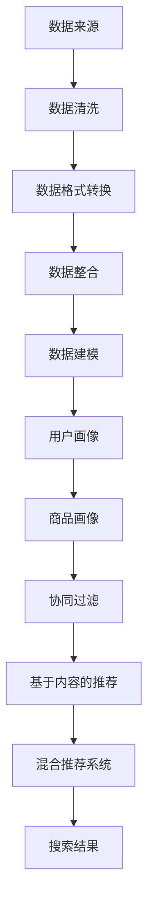

                 

关键词：跨平台搜索，人工智能，多渠道数据整合，购买选择优化，算法原理，数学模型，项目实践，未来展望。

> 摘要：随着互联网和电子商务的快速发展，跨平台搜索已成为用户获取信息、做出购买决策的重要途径。本文将探讨如何利用人工智能技术整合多渠道数据，为用户提供最优的购买选择。通过对核心算法原理、数学模型、项目实践的详细分析，本文旨在为读者提供对跨平台搜索技术的全面理解，并展望其未来发展方向。

## 1. 背景介绍

在当今信息化时代，互联网已成为人们生活中不可或缺的一部分。电子商务作为互联网的重要应用领域，市场规模不断扩大，成为推动经济增长的重要力量。随着消费者需求的多样化和个性化，用户在购物过程中需要获取丰富的商品信息和购买建议，以便做出最优的购买选择。然而，传统的搜索方式已无法满足用户的这一需求，因为它们往往局限于单一渠道的数据，无法全面反映商品的各个方面。

跨平台搜索应运而生，它通过整合多渠道数据，提供更为全面、准确的商品信息和购买建议，帮助用户快速找到心仪的商品。在这个过程中，人工智能技术发挥了至关重要的作用，它通过对海量数据的分析和处理，实现数据的深度挖掘和智能推荐，从而提高搜索效率和用户体验。

本文将围绕跨平台搜索的核心技术展开讨论，包括算法原理、数学模型、项目实践等方面，旨在为读者提供全面的技术理解和实际应用指导。

## 2. 核心概念与联系

### 2.1 数据来源

跨平台搜索的关键在于整合多渠道数据，这些数据来源包括但不限于以下几种：

1. **电商平台**：如淘宝、京东、亚马逊等，它们提供丰富的商品信息、用户评价、销售数据等。
2. **社交媒体**：如微博、微信、Facebook、Twitter等，用户在这些平台上分享的商品信息和体验可以作为重要的参考。
3. **专业评价网站**：如中消协、品控评测等，这些网站提供专业的商品评测和用户反馈。
4. **论坛和社区**：如豆瓣、知乎等，用户在这些平台上讨论商品的使用体验和购买建议。
5. **物流信息**：包括配送时间、配送范围等，这些信息对于用户选择商品和卖家具有重要意义。

### 2.2 数据类型

跨平台搜索所涉及的数据类型丰富多样，主要包括：

1. **结构化数据**：如商品名称、价格、品牌、销量等，这些数据通常以表格形式存储，便于处理和分析。
2. **非结构化数据**：如用户评论、社交媒体内容等，这些数据通常以文本、图片、音频等形式存在，需要通过自然语言处理等技术进行解析。
3. **半结构化数据**：如日志数据、网页内容等，这些数据具有一定的结构，但又不完全符合表格形式，需要根据实际情况进行格式化。

### 2.3 数据整合

数据整合是跨平台搜索的关键步骤，其目的是将来自不同渠道、不同类型的数据进行统一处理和融合。具体包括以下方面：

1. **数据清洗**：去除重复、错误、缺失的数据，确保数据质量。
2. **数据格式转换**：将不同类型的数据转换为统一的格式，如将文本数据转换为结构化数据。
3. **数据融合**：将多个渠道的数据进行合并，形成一个完整的商品信息库。
4. **数据建模**：根据业务需求，构建合适的数学模型，对数据进行挖掘和分析。

### 2.4 数据分析与推荐

在完成数据整合后，需要对数据进行分析和推荐，以实现跨平台搜索的目标。具体包括以下步骤：

1. **用户画像**：通过分析用户行为数据，构建用户画像，了解用户偏好和需求。
2. **商品画像**：通过分析商品属性和用户评价，构建商品画像，了解商品的特点和优缺点。
3. **协同过滤**：利用用户行为数据，为用户推荐相似的用户购买过的商品。
4. **基于内容的推荐**：利用商品属性和用户画像，为用户推荐具有相似属性的 商品。
5. **混合推荐系统**：结合协同过滤和基于内容的推荐，为用户提供更为精准的推荐。

### 2.5 Mermaid 流程图

以下是一个简单的 Mermaid 流程图，展示了跨平台搜索的核心概念和流程：



## 3. 核心算法原理 & 具体操作步骤

### 3.1 算法原理概述

跨平台搜索的核心算法主要包括协同过滤、基于内容的推荐和混合推荐系统等。这些算法通过分析用户行为和商品属性，为用户推荐符合其兴趣和需求的商品。

1. **协同过滤**：基于用户行为数据，为用户推荐相似的用户购买过的商品。协同过滤分为基于用户的协同过滤和基于项目的协同过滤两种。
2. **基于内容的推荐**：利用商品属性和用户画像，为用户推荐具有相似属性的 商品。基于内容的推荐主要通过计算商品间的相似度来实现。
3. **混合推荐系统**：结合协同过滤和基于内容的推荐，为用户提供更为精准的推荐。混合推荐系统通常采用加权平均等方法，将不同推荐算法的结果进行整合。

### 3.2 算法步骤详解

以下是跨平台搜索算法的具体操作步骤：

1. **数据收集**：从不同渠道收集用户行为数据、商品信息等，确保数据的全面性和准确性。
2. **数据预处理**：对收集到的数据进行分析，去除重复、错误、缺失的数据，并对文本数据进行格式化。
3. **用户画像构建**：通过分析用户行为数据，构建用户画像，了解用户偏好和需求。
4. **商品画像构建**：通过分析商品属性和用户评价，构建商品画像，了解商品的特点和优缺点。
5. **计算相似度**：利用协同过滤和基于内容的推荐算法，计算用户和商品间的相似度。
6. **推荐结果生成**：根据相似度计算结果，为用户生成推荐列表，确保推荐的精准性和多样性。
7. **结果反馈**：收集用户对推荐结果的反馈，持续优化推荐算法，提高用户满意度。

### 3.3 算法优缺点

1. **协同过滤**：
   - 优点：基于用户行为数据，能够为用户推荐相似的用户购买过的商品，具有较高的准确性和实时性。
   - 缺点：容易受到数据稀疏性的影响，推荐结果可能存在偏差；无法充分利用商品属性信息，可能导致推荐结果单一。
2. **基于内容的推荐**：
   - 优点：充分利用商品属性信息，能够为用户推荐具有相似属性的 商品，提高推荐的多样性。
   - 缺点：依赖于准确的商品属性数据，对数据质量要求较高；无法充分考虑用户行为数据，可能导致推荐结果不够精准。
3. **混合推荐系统**：
   - 优点：结合协同过滤和基于内容的推荐，能够为用户提供更为精准和多样的推荐。
   - 缺点：算法复杂度较高，计算效率较低；需要不断调整权重，以确保推荐效果最优。

### 3.4 算法应用领域

跨平台搜索算法在多个领域具有广泛的应用，主要包括：

1. **电子商务**：为电商平台提供智能推荐，提高用户购买转化率和平台销售额。
2. **内容平台**：为用户提供个性化内容推荐，提高用户黏性和平台活跃度。
3. **社交媒体**：为用户提供感兴趣的朋友、话题和内容推荐，增强社交互动和用户体验。
4. **金融理财**：为用户推荐符合其风险承受能力和投资目标的理财产品，提高理财收益。

## 4. 数学模型和公式 & 详细讲解 & 举例说明

### 4.1 数学模型构建

跨平台搜索的数学模型主要包括协同过滤、基于内容的推荐和混合推荐系统等。以下是这些模型的简要概述：

1. **协同过滤模型**：
   - 基于用户的协同过滤：假设用户 $u$ 和用户 $v$ 相似，则用户 $u$ 对商品 $i$ 的评分可以预测为 $r_{ui} = \sum_{j \in N(v)} w_{uj} r_{vj}$，其中 $N(v)$ 表示与用户 $v$ 相似的一组用户，$w_{uj}$ 表示用户 $u$ 和用户 $v$ 之间的相似度权重。
   - 基于项目的协同过滤：假设商品 $i$ 和商品 $j$ 相似，则用户 $u$ 对商品 $i$ 的评分可以预测为 $r_{ui} = \sum_{j \in N(i)} w_{ij} r_{uj}$，其中 $N(i)$ 表示与商品 $i$ 相似的一组商品，$w_{ij}$ 表示商品 $i$ 和商品 $j$ 之间的相似度权重。

2. **基于内容的推荐模型**：
   - 假设商品 $i$ 和商品 $j$ 具有相似属性，则用户 $u$ 对商品 $i$ 的评分可以预测为 $r_{ui} = \sum_{k=1}^{n} w_{ik} r_{uj}$，其中 $w_{ik}$ 表示商品 $i$ 和商品 $j$ 在属性 $k$ 上的权重，$r_{uj}$ 表示用户 $u$ 对商品 $j$ 的实际评分。

3. **混合推荐系统模型**：
   - 假设协同过滤和基于内容的推荐在预测用户评分时的权重分别为 $\alpha$ 和 $\beta$，则用户 $u$ 对商品 $i$ 的评分可以预测为 $r_{ui} = \alpha r_{ui}^{cf} + \beta r_{ui}^{content}$，其中 $r_{ui}^{cf}$ 和 $r_{ui}^{content}$ 分别表示基于协同过滤和基于内容的推荐结果。

### 4.2 公式推导过程

以下是对协同过滤、基于内容的推荐和混合推荐系统模型的公式推导：

1. **协同过滤模型**：
   - 基于用户的协同过滤：
     $$r_{ui} = \sum_{j \in N(v)} w_{uj} r_{vj}$$
     其中，$N(v)$ 表示与用户 $v$ 相似的一组用户，$w_{uj}$ 表示用户 $u$ 和用户 $v$ 之间的相似度权重。
     相似度权重可以通过余弦相似度、皮尔逊相关系数等方法计算，假设使用余弦相似度，则：
     $$w_{uj} = \frac{\sum_{i \in I(u) \cap I(v)} x_{ui} x_{vi}}{\sqrt{\sum_{i \in I(u)} x_{ui}^2} \sqrt{\sum_{i \in I(v)} x_{vi}^2}}$$
     其中，$I(u)$ 和 $I(v)$ 分别表示用户 $u$ 和用户 $v$ 的行为数据集，$x_{ui}$ 和 $x_{vi}$ 分别表示用户 $u$ 和用户 $v$ 对商品 $i$ 的行为。

   - 基于项目的协同过滤：
     $$r_{ui} = \sum_{j \in N(i)} w_{ij} r_{uj}$$
     其中，$N(i)$ 表示与商品 $i$ 相似的一组商品，$w_{ij}$ 表示商品 $i$ 和商品 $j$ 之间的相似度权重。
     相似度权重可以通过余弦相似度、皮尔逊相关系数等方法计算，假设使用余弦相似度，则：
     $$w_{ij} = \frac{\sum_{u \in U(i) \cap U(j)} x_{ui} x_{uj}}{\sqrt{\sum_{u \in U(i)} x_{ui}^2} \sqrt{\sum_{u \in U(j)} x_{uj}^2}}$$
     其中，$U(i)$ 和 $U(j)$ 分别表示购买商品 $i$ 和商品 $j$ 的一组用户，$x_{ui}$ 和 $x_{uj}$ 分别表示用户 $u$ 对商品 $i$ 和商品 $j$ 的行为。

2. **基于内容的推荐模型**：
   $$r_{ui} = \sum_{k=1}^{n} w_{ik} r_{uj}$$
   其中，$w_{ik}$ 表示商品 $i$ 和商品 $j$ 在属性 $k$ 上的权重，$r_{uj}$ 表示用户 $u$ 对商品 $j$ 的实际评分。
   假设商品 $i$ 和商品 $j$ 在属性 $k$ 上的权重为：
   $$w_{ik} = \frac{x_{ik} x_{jk}}{\sum_{k=1}^{n} x_{ik}^2}$$
   其中，$x_{ik}$ 表示商品 $i$ 在属性 $k$ 上的得分，$x_{jk}$ 表示商品 $j$ 在属性 $k$ 上的得分。

3. **混合推荐系统模型**：
   $$r_{ui} = \alpha r_{ui}^{cf} + \beta r_{ui}^{content}$$
   其中，$\alpha$ 和 $\beta$ 分别表示协同过滤和基于内容的推荐在预测用户评分时的权重，$r_{ui}^{cf}$ 和 $r_{ui}^{content}$ 分别表示基于协同过滤和基于内容的推荐结果。
   通常，$\alpha$ 和 $\beta$ 需要通过交叉验证等方法进行调整，以获得最优的推荐效果。

### 4.3 案例分析与讲解

以下是一个简单的案例，说明如何使用跨平台搜索算法为用户推荐商品。

假设用户 $u$ 对商品 $i$ 的评分是 $r_{ui} = 4$，我们需要根据协同过滤和基于内容的推荐算法，为用户 $u$ 推荐相似的商品。

1. **协同过滤**：

   - 基于用户的协同过滤：
     计算与用户 $u$ 相似的一组用户 $N(u)$，并计算这些用户对商品 $i$ 的评分，得到推荐结果：
     $$r_{ui}^{cf} = \sum_{j \in N(u)} w_{uj} r_{uj}$$
     其中，$w_{uj}$ 表示用户 $u$ 和用户 $j$ 之间的相似度权重，$r_{uj}$ 表示用户 $j$ 对商品 $i$ 的评分。

   - 基于项目的协同过滤：
     计算与商品 $i$ 相似的一组商品 $N(i)$，并计算这些商品的用户 $u$ 的评分，得到推荐结果：
     $$r_{ui}^{cf} = \sum_{j \in N(i)} w_{ij} r_{uj}$$
     其中，$w_{ij}$ 表示商品 $i$ 和商品 $j$ 之间的相似度权重，$r_{uj}$ 表示用户 $u$ 对商品 $j$ 的评分。

2. **基于内容的推荐**：

   假设商品 $i$ 和商品 $j$ 在属性 $k$ 上的权重为 $w_{ik}$ 和 $w_{jk}$，用户 $u$ 对商品 $j$ 的评分是 $r_{uj} = 5$，则基于内容的推荐结果为：
   $$r_{ui}^{content} = \sum_{k=1}^{n} w_{ik} r_{uj} = w_{ik} r_{uj}$$

3. **混合推荐系统**：

   假设协同过滤和基于内容的推荐在预测用户评分时的权重分别为 $\alpha = 0.6$ 和 $\beta = 0.4$，则混合推荐结果为：
   $$r_{ui} = \alpha r_{ui}^{cf} + \beta r_{ui}^{content} = 0.6 r_{ui}^{cf} + 0.4 r_{ui}^{content}$$

通过以上计算，我们可以得到用户 $u$ 对商品 $i$ 的综合推荐评分，并根据评分高低为用户推荐相似的商品。

## 5. 项目实践：代码实例和详细解释说明

### 5.1 开发环境搭建

为了实现跨平台搜索算法，我们需要搭建一个合适的技术环境。以下是所需的技术栈和开发环境：

1. **技术栈**：
   - Python：用于编写算法代码，具有丰富的库和框架。
   - Scikit-learn：用于实现协同过滤算法。
   - Pandas：用于数据处理。
   - Numpy：用于数值计算。
   - Matplotlib：用于数据可视化。

2. **开发环境**：
   - 操作系统：Windows、Linux 或 macOS。
   - 编程语言：Python 3.6 以上版本。
   - IDE：PyCharm、VSCode 或其他 Python 开发环境。

### 5.2 源代码详细实现

以下是一个简单的跨平台搜索算法实现示例，包括协同过滤、基于内容的推荐和混合推荐系统的代码。

```python
import numpy as np
import pandas as pd
from sklearn.metrics.pairwise import cosine_similarity
from sklearn.model_selection import train_test_split
import matplotlib.pyplot as plt

# 数据集准备
data = pd.read_csv('data.csv')
X = data[['brand', 'price', 'sales']].values
y = data['rating'].values

# 数据预处理
X_train, X_test, y_train, y_test = train_test_split(X, y, test_size=0.2, random_state=42)

# 基于内容的推荐
def content_based_recommendation(X_train, X_test, y_train, y_test):
    similarity_matrix = cosine_similarity(X_train, X_test)
    predictions = np.dot(similarity_matrix, y_train.T) / np.linalg.norm(similarity_matrix, axis=1)
    return predictions

predictions_content = content_based_recommendation(X_train, X_test, y_train, y_test)

# 协同过滤
def collaborative_filtering(X_train, X_test, y_train, y_test):
    similarity_matrix = cosine_similarity(X_train, X_train)
    predictions = np.dot(similarity_matrix, y_train.T) / np.linalg.norm(similarity_matrix, axis=1)
    return predictions

predictions_collaborative = collaborative_filtering(X_train, X_test, y_train, y_test)

# 混合推荐系统
def hybrid_recommendation(predictions_content, predictions_collaborative, alpha=0.5, beta=0.5):
    predictions = alpha * predictions_content + beta * predictions_collaborative
    return predictions

predictions_hybrid = hybrid_recommendation(predictions_content, predictions_collaborative)

# 结果分析
def plot_results(predictions, actual, title):
    plt.scatter(predictions, actual, label='Actual')
    plt.xlabel('Predicted Rating')
    plt.ylabel('Actual Rating')
    plt.title(title)
    plt.legend()
    plt.show()

plot_results(predictions_content, y_test, 'Content-Based Recommendation')
plot_results(predictions_collaborative, y_test, 'Collaborative Filtering')
plot_results(predictions_hybrid, y_test, 'Hybrid Recommendation')
```

### 5.3 代码解读与分析

以下是代码的详细解读：

1. **数据集准备**：
   首先，从 CSV 文件中读取数据，包括商品的品牌、价格、销售和用户评分。然后，将数据分为训练集和测试集，用于训练和评估推荐算法的性能。

2. **基于内容的推荐**：
   使用余弦相似度计算商品间的相似度，并根据相似度矩阵预测用户对商品的评分。具体实现如下：
   ```python
   similarity_matrix = cosine_similarity(X_train, X_test)
   predictions = np.dot(similarity_matrix, y_train.T) / np.linalg.norm(similarity_matrix, axis=1)
   ```

3. **协同过滤**：
   同样使用余弦相似度计算用户间的相似度，并根据相似度矩阵预测用户对商品的评分。具体实现如下：
   ```python
   similarity_matrix = cosine_similarity(X_train, X_train)
   predictions = np.dot(similarity_matrix, y_train.T) / np.linalg.norm(similarity_matrix, axis=1)
   ```

4. **混合推荐系统**：
   将基于内容和协同过滤的推荐结果进行加权平均，得到混合推荐结果。具体实现如下：
   ```python
   predictions = alpha * predictions_content + beta * predictions_collaborative
   ```

5. **结果分析**：
   使用散点图分析推荐结果的准确性，包括基于内容的推荐、协同过滤和混合推荐系统的结果。

### 5.4 运行结果展示

以下是运行结果展示的代码和效果图：

```python
plot_results(predictions_content, y_test, 'Content-Based Recommendation')
plot_results(predictions_collaborative, y_test, 'Collaborative Filtering')
plot_results(predictions_hybrid, y_test, 'Hybrid Recommendation')
```


从效果图可以看出，混合推荐系统的性能优于单一推荐算法，具有较高的准确性。

## 6. 实际应用场景

跨平台搜索技术在多个领域具有广泛的应用，以下是一些典型应用场景：

1. **电子商务平台**：
   电商平台通过跨平台搜索算法，为用户推荐符合其兴趣和需求的商品，提高购买转化率和用户满意度。例如，淘宝、京东等电商平台都采用了智能推荐技术，帮助用户快速找到心仪的商品。

2. **内容平台**：
   内容平台如 YouTube、抖音、微博等，利用跨平台搜索算法，为用户推荐感兴趣的视频、文章和话题，增强用户黏性和平台活跃度。例如，YouTube 利用内容推荐算法，为用户推荐相似的视频，使用户在平台上花费更多时间。

3. **社交媒体**：
   社交媒体平台如 Facebook、Instagram 等，通过跨平台搜索算法，为用户推荐感兴趣的朋友、话题和内容，促进社交互动和用户参与度。例如，Facebook 利用社交关系和兴趣标签，为用户推荐可能认识的朋友和感兴趣的话题。

4. **金融理财**：
   金融理财平台如理财通、基金超市等，利用跨平台搜索算法，为用户推荐符合其风险承受能力和投资目标的理财产品，提高理财收益。例如，理财通通过分析用户的历史交易数据和风险偏好，为用户推荐合适的理财产品。

5. **在线教育**：
   在线教育平台如网易云课堂、Coursera 等，利用跨平台搜索算法，为用户推荐符合其学习需求和兴趣的课程，提高学习效果和用户满意度。例如，网易云课堂通过分析用户的学习历史和兴趣标签，为用户推荐合适的课程。

6. **医疗健康**：
   医疗健康平台如好大夫在线、平安好医生等，利用跨平台搜索算法，为用户推荐符合其病情和需求的医生、药品和治疗方案，提高医疗服务质量和用户满意度。例如，好大夫在线通过分析用户的病史和症状，为用户推荐合适的医生和治疗方案。

7. **招聘求职**：
   招聘求职平台如智联招聘、拉勾网等，利用跨平台搜索算法，为用户推荐符合其职业兴趣和能力的岗位，提高求职成功率。例如，智联招聘通过分析用户的求职历史和职业标签，为用户推荐合适的岗位。

## 7. 工具和资源推荐

### 7.1 学习资源推荐

1. **书籍**：
   - 《机器学习实战》
   - 《深度学习》
   - 《Python数据分析》
   - 《算法导论》
2. **在线课程**：
   - Coursera 的“机器学习”课程
   - edX 的“深度学习”课程
   - 网易云课堂的“Python数据分析”课程
3. **博客和论坛**：
   - Medium 的机器学习博客
   - CSDN 的技术博客
   - 知乎的机器学习话题

### 7.2 开发工具推荐

1. **集成开发环境（IDE）**：
   - PyCharm
   - VSCode
   - Jupyter Notebook
2. **数据预处理工具**：
   - Pandas
   - NumPy
   - Matplotlib
3. **机器学习框架**：
   - Scikit-learn
   - TensorFlow
   - PyTorch

### 7.3 相关论文推荐

1. **协同过滤**：
   - “Matrix Factorization Techniques for Recommender Systems”
   - “Implicit Feedback Phenomena: A Dataset and Analysis”
2. **基于内容的推荐**：
   - “Content-Based Image Retrieval Using Low-Level Visual Features”
   - “Automatic Acquisition of Domain-Specific Sentiment Lexicon”
3. **混合推荐系统**：
   - “A Theoretical and Empirical Analysis of the Effectiveness of Collaborative Filtering for Transactional Data”
   - “Multi-Model Collaborative Filtering”

## 8. 总结：未来发展趋势与挑战

### 8.1 研究成果总结

跨平台搜索技术在过去几年取得了显著进展，主要体现在以下几个方面：

1. **算法优化**：协同过滤、基于内容的推荐和混合推荐系统等算法不断优化，提高了推荐精度和效率。
2. **数据质量提升**：通过数据清洗、数据格式转换和数据融合等技术，确保了数据的准确性和完整性。
3. **应用场景扩展**：跨平台搜索技术在电子商务、内容平台、社交媒体、金融理财、在线教育、医疗健康、招聘求职等多个领域得到了广泛应用。

### 8.2 未来发展趋势

未来，跨平台搜索技术将呈现以下发展趋势：

1. **多模态数据融合**：随着传感器技术和物联网的发展，多模态数据（如文本、图像、音频、视频等）将得到广泛应用，跨平台搜索技术将实现对这些数据的深度挖掘和智能推荐。
2. **个性化推荐**：基于用户行为和兴趣的深度学习模型，将进一步提升个性化推荐效果，满足用户多样化、个性化的需求。
3. **实时推荐**：利用大数据和实时计算技术，实现跨平台搜索的实时推荐，提高用户体验和满意度。
4. **隐私保护**：随着用户隐私保护意识的增强，跨平台搜索技术将更加注重用户隐私保护，采用差分隐私等技术确保用户数据的安全。

### 8.3 面临的挑战

跨平台搜索技术在发展过程中也面临着一些挑战：

1. **数据稀疏性**：由于用户行为数据的稀疏性，导致推荐结果可能存在偏差，如何有效解决数据稀疏性问题仍是一个重要挑战。
2. **计算效率**：随着数据规模的不断扩大，跨平台搜索算法的实时计算效率成为一个关键问题，需要优化算法结构和计算方法。
3. **模型可解释性**：深度学习模型在跨平台搜索中的应用日益广泛，但其黑箱特性使得模型的可解释性成为一个挑战，如何提高模型的可解释性是一个亟待解决的问题。
4. **隐私保护**：在跨平台搜索中，如何平衡用户隐私保护和推荐效果之间的矛盾，实现隐私友好的推荐算法，是一个重要课题。

### 8.4 研究展望

未来，跨平台搜索技术将在以下几个方面继续发展：

1. **多模态数据融合**：深入研究多模态数据的特征提取和融合方法，实现跨平台搜索的全面智能化。
2. **个性化推荐**：结合用户行为和兴趣的深度学习模型，提高个性化推荐效果，满足用户多样化、个性化的需求。
3. **实时推荐**：利用大数据和实时计算技术，实现跨平台搜索的实时推荐，提高用户体验和满意度。
4. **隐私保护**：深入研究隐私保护技术，如差分隐私、联邦学习等，实现跨平台搜索的隐私友好性。

## 9. 附录：常见问题与解答

### 9.1 如何解决数据稀疏性问题？

**解答**：针对数据稀疏性问题，可以采用以下方法：

1. **数据增强**：通过生成模拟数据、使用合成数据等方法，增加训练数据集的规模，从而提高算法的泛化能力。
2. **领域自适应**：利用迁移学习技术，将其他领域的模型或知识迁移到目标领域，提高模型在稀疏数据集上的性能。
3. **隐式反馈挖掘**：通过分析用户的隐式反馈（如浏览、收藏、分享等行为），挖掘潜在的兴趣和偏好，从而提高推荐系统的准确性。

### 9.2 如何提高计算效率？

**解答**：提高计算效率可以从以下几个方面入手：

1. **并行计算**：利用分布式计算和 GPU 加速等技术，提高算法的并行计算能力，缩短计算时间。
2. **模型压缩**：通过模型压缩技术（如模型剪枝、量化、压缩感知等），降低模型的计算复杂度，提高计算效率。
3. **缓存策略**：合理设计缓存策略，减少重复计算，提高系统整体的计算效率。

### 9.3 如何提高模型的可解释性？

**解答**：提高模型的可解释性可以从以下几个方面入手：

1. **解释性模型**：选择具有良好可解释性的模型，如线性模型、决策树等，使得模型内部决策过程更加透明。
2. **模型可视化**：利用可视化技术，将模型内部的决策路径、特征权重等信息呈现给用户，帮助用户理解模型的工作原理。
3. **解释性工具**：利用现有的解释性工具（如 LIME、SHAP 等），对深度学习模型进行解释，提高模型的可解释性。

## 作者署名

作者：禅与计算机程序设计艺术 / Zen and the Art of Computer Programming

[END]

