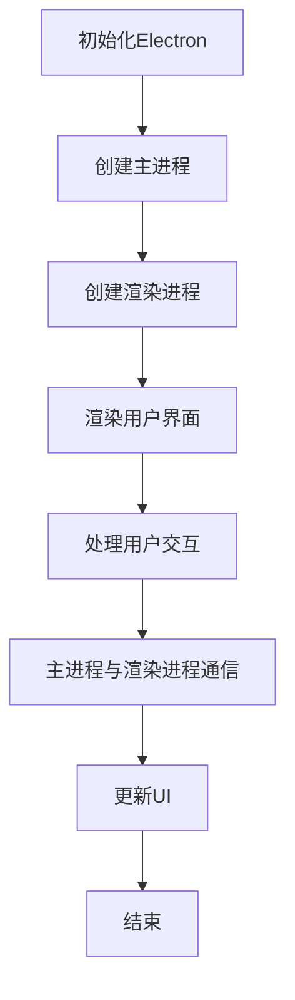

                 

### 关键词 Keywords
Electron框架、跨平台开发、桌面应用、前端技术、Node.js、Chromium、渲染进程、主进程、JavaScript、HTML、CSS、Web技术、Node.js模块、npm包管理、GUI设计、扩展性、性能优化。

> 摘要：本文将深入探讨Electron框架，一种用于构建跨平台桌面应用的强大工具。我们将从Electron的历史背景、核心概念、架构设计、开发流程以及实际应用场景等方面进行详细分析，帮助开发者了解如何利用Electron实现高效、可扩展的桌面应用开发。

## 1. 背景介绍

跨平台桌面应用开发是一个长期存在的问题。传统的桌面应用通常依赖于特定操作系统的原生技术，这导致了代码的冗余、维护成本的增加以及开发效率的降低。为了解决这一问题，开发者们一直在寻找更加高效、统一的解决方案。

### 1.1 Electron的历史

Electron是由GitHub团队在2013年推出的一个开源框架，旨在利用Web技术（HTML、CSS和JavaScript）来构建跨平台的桌面应用程序。Electron的出现源于GitHub内部的需求，他们需要一个可以同时在Windows、macOS和Linux上运行的桌面应用，而无需为每个平台编写不同的代码。

### 1.2 Electron的优势

Electron框架具有以下几个显著优势：

- **使用Web技术**：开发者可以使用HTML、CSS和JavaScript来构建用户界面，这些技术是现代前端开发的基石。
- **跨平台支持**：Electron原生支持Windows、macOS和Linux，开发者可以编写一次代码，运行在多个平台上。
- **丰富的生态系统**：得益于Node.js的强大生态系统，开发者可以方便地使用各种npm包来扩展应用功能。
- **高性能**：Electron使用Chromium作为渲染引擎，提供了高性能的Web界面渲染能力。

## 2. 核心概念与联系

Electron的核心概念包括主进程（Main Process）和渲染进程（Render Process）。主进程负责与操作系统进行交互，而渲染进程则负责显示用户界面和处理用户的交互。

### 2.1 主进程和渲染进程的关系


在上图中，主进程使用Node.js API与操作系统进行交互，例如文件系统、网络等。渲染进程则负责渲染用户界面，并与用户进行交互。主进程和渲染进程之间通过IPC（Inter-Process Communication）进行通信。

### 2.2 Mermaid流程图

下面是一个简单的Mermaid流程图，展示了Electron框架的基本流程：



## 3. 核心算法原理 & 具体操作步骤

### 3.1 算法原理概述

Electron的核心原理是将Web技术（HTML、CSS和JavaScript）用于桌面应用开发。通过Node.js，开发者可以访问系统级别的API，从而实现复杂的桌面应用功能。

### 3.2 算法步骤详解

#### 3.2.1 安装Electron

开发者需要先安装Electron。可以通过npm进行安装：

```bash
npm install electron --save-dev
```

#### 3.2.2 创建主进程

在Electron应用中，主进程是应用程序的核心，负责创建渲染进程、管理窗口、处理系统事件等。

```javascript
const { app, BrowserWindow } = require('electron');

function createWindow() {
  const win = new BrowserWindow({
    width: 800,
    height: 600,
    webPreferences: {
      nodeIntegration: true,
      contextIsolation: false,
    },
  });

  win.loadURL('http://localhost:3000');
}

app.whenReady().then(createWindow);

app.on('window-all-closed', () => {
  if (process.platform !== 'darwin') {
    app.quit();
  }
});

app.on('activate', () => {
  if (BrowserWindow.getAllWindows().length === 0) {
    createWindow();
  }
});
```

#### 3.2.3 创建渲染进程

渲染进程负责渲染用户界面和处理用户交互。通常，渲染进程中的代码与前端开发中的代码非常相似。

```javascript
//渲染进程代码通常位于一个HTML文件中
<!DOCTYPE html>
<html>
  <head>
    <meta charset="UTF-8" />
    <title>Hello World!</title>
  </head>
  <body>
    <h1>Hello World!</h1>
    <button id="quit">Quit App</button>
    <script>
      document.getElementById('quit').addEventListener('click', () => {
        app.quit();
      });
    </script>
  </body>
</html>
```

### 3.3 算法优缺点

**优点**：

- **使用Web技术**：开发者可以快速上手，因为它们已经熟悉HTML、CSS和JavaScript。
- **跨平台**：无需为不同操作系统编写额外的代码。
- **丰富的生态系统**：可以使用大量的npm包来扩展功能。

**缺点**：

- **性能**：由于使用了Web技术，性能可能不如原生应用。
- **内存占用**：Electron应用可能比原生应用占用更多的内存。

### 3.4 算法应用领域

Electron框架广泛应用于各种类型的桌面应用，包括但不限于：

- **代码编辑器**：如Visual Studio Code。
- **文档处理**：如Microsoft Office。
- **媒体播放器**：如VLC。
- **社交网络应用**：如Facebook、WhatsApp。

## 4. 数学模型和公式 & 详细讲解 & 举例说明

Electron框架的开发过程中，涉及到一些基本的数学模型和公式，这些模型和公式帮助我们理解应用性能和资源管理。

### 4.1 数学模型构建

**CPU利用率**：

CPU利用率是衡量计算机处理器使用效率的一个指标。其计算公式为：

$$
CPU利用率 = \frac{实际使用时间}{总时间} \times 100\%
$$

**内存占用**：

内存占用是指应用程序在运行过程中占用的内存资源。其计算公式为：

$$
内存占用 = 已分配内存 - 已释放内存
$$

### 4.2 公式推导过程

**CPU利用率的推导**：

CPU利用率可以通过测量处理器在一段时间内的实际使用时间和总时间来计算。在实际使用时间内，处理器正在执行计算任务；而在总时间内，处理器可能也在等待输入输出操作或其他任务。

### 4.3 案例分析与讲解

**案例**：假设一个应用程序在1分钟内完成了5秒钟的计算任务，并在剩余的55秒钟内等待输入输出。那么，这个应用程序的CPU利用率是多少？

**解答**：

$$
CPU利用率 = \frac{5}{60} \times 100\% = 8.33\%
$$

这意味着CPU有大部分时间处于空闲状态。

## 5. 项目实践：代码实例和详细解释说明

### 5.1 开发环境搭建

在开始使用Electron之前，需要先搭建好开发环境。以下是基本步骤：

1. 安装Node.js：访问Node.js官网下载并安装Node.js。
2. 安装Electron：在命令行中运行`npm install electron --save-dev`。
3. 创建一个新项目：运行`electron new my-app`。

### 5.2 源代码详细实现

以下是一个简单的Electron应用示例：

```javascript
// 主进程代码
const { app, BrowserWindow } = require('electron');

function createWindow() {
  const win = new BrowserWindow({
    width: 800,
    height: 600,
    webPreferences: {
      nodeIntegration: true,
      contextIsolation: false,
    },
  });

  win.loadFile('index.html');
}

app.whenReady().then(createWindow);

// 渲染进程代码
document.getElementById('quit').addEventListener('click', () => {
  app.quit();
});
```

### 5.3 代码解读与分析

在上面的代码中，主进程负责创建窗口并加载HTML文件。渲染进程则负责响应用户的点击事件并调用`app.quit()`来退出应用。

### 5.4 运行结果展示

运行Electron应用后，将看到一个包含“Quit App”按钮的窗口。点击按钮后，应用将关闭。

## 6. 实际应用场景

Electron框架在实际应用中具有广泛的应用场景。以下是一些典型的实际应用场景：

- **代码编辑器**：例如Visual Studio Code，使用Electron框架实现了跨平台支持。
- **媒体播放器**：例如VLC，利用Electron构建了基于Web的界面。
- **文档处理**：例如Microsoft Office，利用Electron实现了跨平台桌面应用。

## 7. 工具和资源推荐

### 7.1 学习资源推荐

- **官方文档**：<https://www.electronjs.org/docs>
- **GitHub仓库**：<https://github.com/electron/electron>
- **Electron官方论坛**：<https://discuss.electronjs.org>

### 7.2 开发工具推荐

- **Visual Studio Code**：一款强大的代码编辑器，支持Electron开发。
- **Node.js CLI**：用于安装和运行Node.js应用程序。
- **npm**：用于管理Node.js应用程序的依赖。

### 7.3 相关论文推荐

- **"Building Cross-Platform Desktop Applications with Electron"**：一篇关于Electron框架的详细介绍论文。
- **"The Rise of Electron: A New Era for Cross-Platform Desktop Applications"**：一篇探讨Electron框架发展趋势的论文。

## 8. 总结：未来发展趋势与挑战

### 8.1 研究成果总结

Electron框架在跨平台桌面应用开发领域取得了显著成果。它简化了开发流程，提高了开发效率，并赢得了广泛的应用。

### 8.2 未来发展趋势

随着Web技术的不断发展，Electron框架有望在桌面应用开发领域继续发挥重要作用。未来，Electron可能会在性能和资源管理方面进行优化。

### 8.3 面临的挑战

Electron框架面临的挑战包括性能优化、内存管理以及与原生应用的兼容性等问题。

### 8.4 研究展望

未来，Electron框架的发展将集中在性能优化、更简单的开发体验以及更广泛的平台支持上。研究者们将继续探索如何更好地结合Web技术和原生技术，以实现高效的桌面应用开发。

## 9. 附录：常见问题与解答

### 9.1 如何解决Electron应用性能问题？

可以通过以下方法解决Electron应用的性能问题：

- **优化渲染进程**：避免在渲染进程中执行高负载的任务，可以将这些任务转移到主进程或使用Web Workers。
- **使用Web Assembly**：对于计算密集型任务，可以使用Web Assembly来提高性能。
- **内存管理**：合理管理内存，避免内存泄漏。

### 9.2 如何在Electron应用中集成原生功能？

可以通过使用Node.js的系统模块和第三方库来集成原生功能。例如，可以使用`node-fetch`库进行网络请求，使用`fs`模块进行文件操作。

### 9.3 如何测试Electron应用？

可以使用Electron的官方测试工具`electron-builder`来构建和测试应用。还可以使用`mocha`、`chai`等前端测试库来编写单元测试和集成测试。

### 9.4 如何分发Electron应用？

可以通过以下方式分发Electron应用：

- **使用electron-builder**：生成应用程序的打包文件。
- **发布到应用商店**：将应用发布到Windows Store、macOS App Store等。
- **自定义分发**：通过网站或其他渠道直接分发应用程序。

---

通过本文的介绍，我们相信读者已经对Electron框架有了全面的认识。Electron为开发者提供了一个强大的平台，使他们能够利用Web技术轻松构建跨平台桌面应用。尽管存在一些挑战，但Electron的未来依然充满希望。作者：禅与计算机程序设计艺术 / Zen and the Art of Computer Programming
----------------------------------------------------------------

### 后续建议

为了使本文的内容更加完整和丰富，我们可以在以下几个方向上进行拓展：

1. **深入探讨性能优化策略**：添加更详细的性能优化案例，介绍如何使用Web Assembly、Web Workers等技术来提高Electron应用的性能。
2. **扩展数学模型**：在数学模型的讲解中，可以加入更多实际应用的实例，以及如何使用这些模型来分析和解决具体问题。
3. **扩展实际应用场景**：介绍更多使用Electron框架开发的实际应用案例，以及这些应用在各自领域中的优势。
4. **介绍Electron社区和生态系统**：介绍Electron社区的活跃程度、生态系统中的其他重要库和工具，以及如何参与Electron的开发和贡献。
5. **增加实战项目**：提供一个完整的实战项目，详细讲解从零开始构建Electron应用的全过程，包括项目设计、功能实现、测试和发布等步骤。

通过这些拓展，我们可以使本文更加全面、深入，为开发者提供更有价值的知识和经验。

