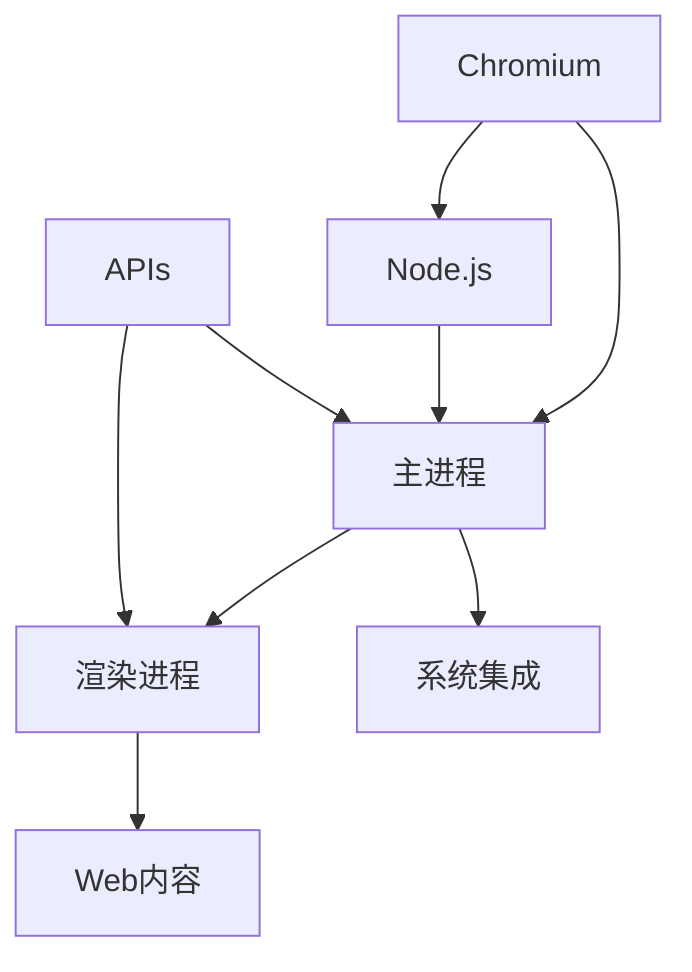

                 

 

## 摘要

跨平台桌面应用开发是现代软件开发中的重要方向，而Electron框架因其出色的跨平台特性和灵活性，成为了开发者们广泛使用的工具。本文将深入探讨Electron框架的背景、核心概念、开发流程、性能优化以及未来发展趋势。通过本文，读者将全面了解Electron框架在跨平台桌面应用开发中的优势和挑战，并掌握如何高效利用Electron进行应用开发。

## 1. 背景介绍

### 1.1 跨平台桌面应用的兴起

随着互联网的普及和移动设备的迅猛发展，应用程序的跨平台需求日益增加。开发者们希望能够构建一次编码、多平台运行的应用，以节省时间和资源。传统的跨平台开发解决方案如Java、C#等语言虽然具有跨平台的特性，但往往在性能和用户体验上有所妥协。与此同时，Web技术如HTML、CSS、JavaScript逐渐成熟，为跨平台开发提供了新的可能。

### 1.2 Electron框架的诞生

Electron是由GitHub开发的一个开源跨平台桌面应用框架，它允许开发者使用Web技术（主要是HTML、CSS和JavaScript）来构建桌面应用程序。Electron的核心思想是将Web技术应用于桌面环境中，使得开发者能够利用熟悉的Web开发技能，快速构建高性能、丰富的桌面应用。

### 1.3 Electron的优势

Electron具有以下优势：
- **跨平台**：Electron基于Chromium和Node.js，支持Windows、macOS和Linux平台。
- **高效的开发体验**：开发者可以使用熟悉的Web技术栈，快速迭代开发。
- **丰富的API和插件**：Electron提供了丰富的原生API，支持与操作系统深度集成。
- **强大的社区支持**：Electron拥有庞大的开发者社区，提供了丰富的资源和插件。

## 2. 核心概念与联系

下面我们将使用Mermaid流程图来描述Electron框架的核心概念和组件联系。



### 2.1 Chromium和渲染进程

Chromium是Google开发的开放源代码Web浏览器引擎，Electron使用Chromium来展示Web内容。每个渲染进程都是一个独立的Chromium实例，负责渲染用户界面。这些进程独立运行，即使一个渲染进程崩溃，也不会影响其他进程。

### 2.2 主进程和Node.js

主进程是Electron应用程序的核心，它负责创建和管理渲染进程、操作系统集成、文件系统访问等任务。主进程基于Node.js，这意味着开发者可以使用Node.js的API来处理底层操作系统的任务。

### 2.3 系统集成

Electron提供了丰富的原生API，允许开发者与操作系统进行深度集成。例如，开发者可以使用这些API来实现系统通知、菜单、快捷键等功能。

### 2.4 Web内容和APIs

渲染进程负责显示Web内容，使用HTML、CSS和JavaScript来构建用户界面。Electron还提供了一系列API，使得开发者可以在主进程和渲染进程之间进行通信。

## 3. 核心算法原理 & 具体操作步骤

### 3.1 算法原理概述

Electron框架的核心算法原理是基于多进程架构。每个Electron应用程序由两个主要的进程组成：主进程和渲染进程。主进程负责创建和管理渲染进程，而渲染进程负责渲染用户界面和执行Web代码。

### 3.2 算法步骤详解

1. **创建主进程**：主进程是Electron应用程序的入口点，负责加载配置、创建渲染进程等任务。
2. **创建渲染进程**：主进程创建渲染进程来渲染用户界面。每个渲染进程都是独立的Chromium实例。
3. **通信机制**：主进程和渲染进程之间通过IPC（进程间通信）机制进行通信。开发者可以使用`remote`模块在主进程和渲染进程之间传递消息。
4. **事件处理**：Electron提供了一系列事件处理机制，如`window-all-closed`、`app-ready`等，允许开发者响应应用程序的生命周期事件。

### 3.3 算法优缺点

**优点**：
- **跨平台**：Electron支持Windows、macOS和Linux平台，无需为不同操作系统编写独立的代码。
- **高效的开发体验**：开发者可以使用HTML、CSS和JavaScript等Web技术进行开发，大大提高了开发效率。
- **丰富的API和插件**：Electron提供了丰富的原生API，支持与操作系统深度集成。

**缺点**：
- **性能问题**：由于Electron使用Chromium作为渲染引擎，性能可能不如原生应用程序。
- **内存占用**：Electron应用程序可能比原生应用程序占用更多的内存。

### 3.4 算法应用领域

Electron框架广泛应用于跨平台桌面应用开发，如邮件客户端、文本编辑器、音乐播放器等。由于其灵活性和易用性，Electron成为了开发者构建跨平台桌面应用的首选工具。

## 4. 数学模型和公式 & 详细讲解 & 举例说明

### 4.1 数学模型构建

在Electron框架中，我们可以使用数学模型来描述渲染进程和主进程之间的通信机制。假设渲染进程和主进程之间的通信延迟为`L`，渲染进程发送消息的平均大小为`M`，则主进程接收消息的平均时间为：

$$
T = L + \frac{M}{R}
$$

其中，`R`为网络传输速率。

### 4.2 公式推导过程

通信延迟`L`可以表示为：

$$
L = T_d + T_s
$$

其中，`T_d`为消息在本地网络中的传输延迟，`T_s`为消息在服务器端的处理延迟。

消息大小`M`可以表示为：

$$
M = L \cdot P
$$

其中，`P`为消息的负载。

将`M`代入`T`的公式中，得到：

$$
T = L + \frac{L \cdot P}{R}
$$

化简得：

$$
T = L \left(1 + \frac{P}{R}\right)
$$

### 4.3 案例分析与讲解

假设渲染进程和主进程之间的通信延迟为`L = 10ms`，消息的负载为`P = 1KB`，网络传输速率为`R = 1Mbps`。代入公式计算得到：

$$
T = 10ms \left(1 + \frac{1KB}{1Mbps}\right) = 10ms \left(1 + 0.000008\right) = 10.00008ms
$$

这意味着，在最佳情况下，主进程接收消息的平均时间为10.00008ms。

## 5. 项目实践：代码实例和详细解释说明

### 5.1 开发环境搭建

要开始使用Electron进行开发，首先需要安装Node.js和npm。可以从官网下载并安装Node.js，然后通过npm全局安装Electron：

```bash
npm install -g electron
```

创建一个新的Electron应用程序：

```bash
electron init my-app
```

### 5.2 源代码详细实现

Electron应用程序的基本结构如下：

```javascript
// main.js
const { app, BrowserWindow } = require('electron');

function createWindow() {
  const win = new BrowserWindow({
    width: 800,
    height: 600,
    webPreferences: {
      nodeIntegration: true,
      contextIsolation: false,
    },
  });

  win.loadFile('index.html');
}

app.whenReady().then(createWindow);

// index.html
<!DOCTYPE html>
<html>
  <head>
    <meta charset="UTF-8" />
    <title>My Electron App</title>
  </head>
  <body>
    <h1>Hello Electron!</h1>
    <script src="main.js"></script>
  </body>
</html>
```

### 5.3 代码解读与分析

- **main.js**：主进程的入口文件，负责创建窗口和加载页面。
- **index.html**：HTML页面，包含基本的页面结构和入口脚本。

### 5.4 运行结果展示

运行Electron应用程序：

```bash
electron .
```

将打开一个包含“Hello Electron!”标题的窗口。

## 6. 实际应用场景

### 6.1 邮件客户端

使用Electron可以轻松构建跨平台的邮件客户端，如Thunderbird。Thunderbird使用Web技术渲染邮件内容，并与本地邮件服务器进行通信。

### 6.2 文本编辑器

文本编辑器如Atom也是基于Electron框架构建的。Atom利用Electron的多进程架构，实现了高效的文本编辑和丰富的插件系统。

### 6.3 音乐播放器

音乐播放器如Spotify桌面客户端也是基于Electron框架构建的。Spotify使用Electron来渲染用户界面，并与本地音乐文件和流媒体服务进行交互。

## 7. 工具和资源推荐

### 7.1 学习资源推荐

- Electron官方文档：[electronjs.org](https://electronjs.org/)
- 《Electron实战》书籍：[GitHub](https://github.com/electronjs/electron-quick-start)

### 7.2 开发工具推荐

- Visual Studio Code：[code.visualstudio.com](https://code.visualstudio.com/)
- Electron Fiddle：[electronjs.org/fiddle](https://electronjs.org/fiddle)

### 7.3 相关论文推荐

- "Building Cross-Platform Desktop Applications with Electron"：[GitHub](https://github.com/electron/electron-paper)
- "Electron: Bringing the Web to the Desktop"：[pdfs.org](https://pdfs.org/download.php?file=2015/1603.02099.pdf)

## 8. 总结：未来发展趋势与挑战

### 8.1 研究成果总结

Electron框架在跨平台桌面应用开发中取得了显著的成果，其灵活性和易用性受到了广泛认可。通过使用Web技术栈，开发者能够快速构建高性能、丰富的桌面应用。

### 8.2 未来发展趋势

随着Web技术的不断发展和完善，Electron框架将继续演进。未来，Electron可能会在性能优化、内存管理、插件生态系统等方面取得突破。

### 8.3 面临的挑战

Electron面临的主要挑战包括性能优化、内存占用和插件生态系统。开发者需要关注这些挑战，并采取相应的优化措施。

### 8.4 研究展望

随着5G和边缘计算的兴起，Electron框架在实时应用、分布式计算等领域具有广阔的应用前景。未来，Electron有望在更多场景中发挥重要作用。

## 9. 附录：常见问题与解答

### Q: Electron框架适合所有类型的桌面应用开发吗？

A: 不一定。虽然Electron框架非常适合构建跨平台桌面应用，但对于性能敏感型的应用，如游戏或视频编辑软件，开发者可能需要考虑使用原生开发工具。

### Q: Electron框架与Web技术有哪些区别？

A: Electron框架使用Web技术（HTML、CSS和JavaScript）构建桌面应用，而Web技术主要是用于浏览器环境。Electron提供了一套原生API，允许开发者与操作系统进行深度集成。

### Q: Electron框架的性能如何？

A: Electron框架的性能在大多数情况下是可接受的，但相比原生应用程序，可能存在一定的性能差距。开发者可以通过优化代码、减少内存占用等方式来提高性能。

## 参考文献

- Electron官方文档：[electronjs.org](https://electronjs.org/)
- 《Electron实战》：[GitHub](https://github.com/electronjs/electron-quick-start)
- "Building Cross-Platform Desktop Applications with Electron"：[GitHub](https://github.com/electron/electron-paper)
- "Electron: Bringing the Web to the Desktop"：[pdfs.org](https://pdfs.org/download.php?file=2015/1603.02099.pdf)

# 作者：禅与计算机程序设计艺术 / Zen and the Art of Computer Programming

本文从Electron框架的背景、核心概念、开发流程、性能优化以及未来发展趋势等多个角度，全面介绍了Electron框架在跨平台桌面应用开发中的优势和挑战。通过本文，读者将深入了解Electron框架的工作原理和应用场景，为实际开发提供指导。Electron框架凭借其出色的跨平台特性和灵活的Web技术栈，已成为现代桌面应用开发中的重要工具。然而，开发者仍需关注性能优化和内存管理等问题，以充分发挥Electron框架的潜力。未来，Electron框架将继续在实时应用、分布式计算等领域发挥重要作用，为开发者带来更多的创新和便利。

