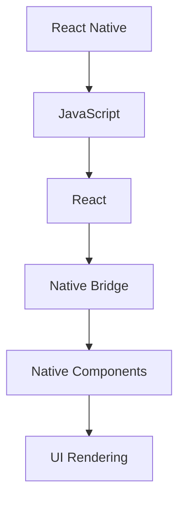
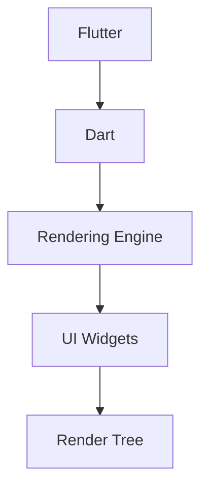
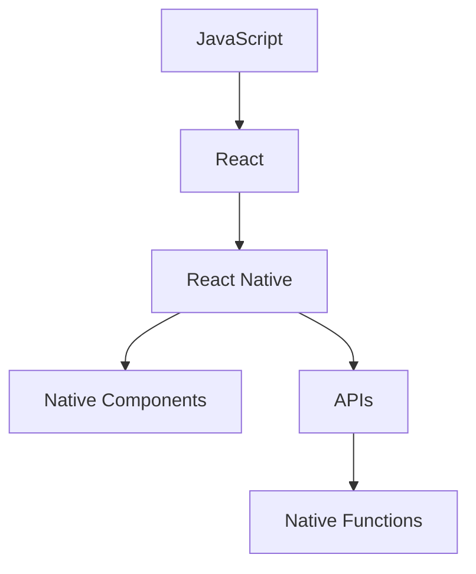
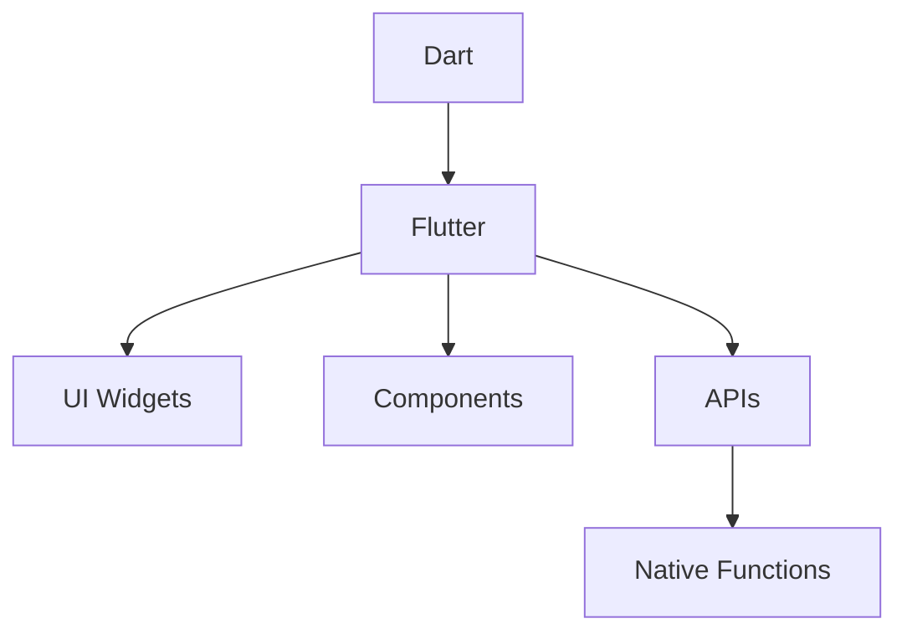
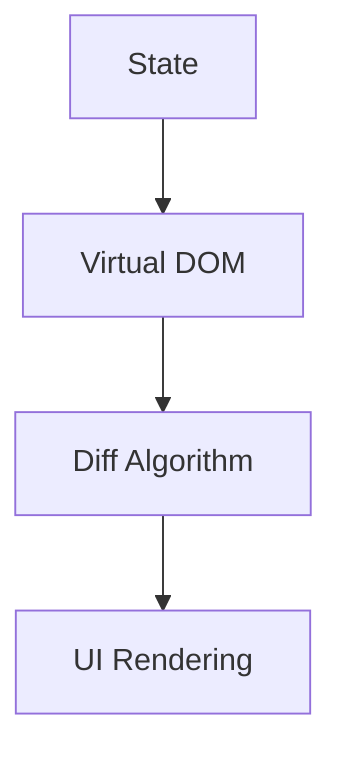
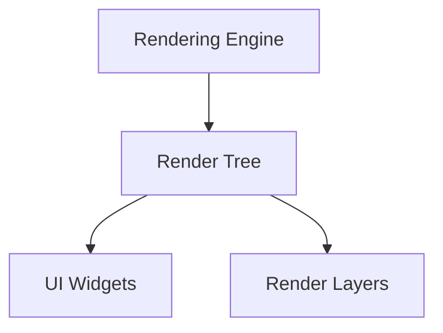

                 

关键词：跨平台移动开发，React Native，Flutter，移动应用开发，性能优化，开发工具，UI渲染，社区支持

> 摘要：本文将对React Native和Flutter这两大主流跨平台移动开发框架进行比较分析，从技术原理、开发流程、性能、UI渲染、社区支持等方面详细探讨，为开发者选择合适的框架提供参考。

## 1. 背景介绍

随着移动互联网的迅速发展，移动应用已经成为人们日常生活中不可或缺的一部分。然而，移动平台多样化带来了开发者的困扰，如何在有限的开发资源下实现跨平台应用的开发，成为开发者的首要任务。跨平台移动开发框架应运而生，其中React Native和Flutter是最为流行的两大框架。本文将对比分析这两大框架，帮助开发者了解它们的特点和适用场景。

### React Native

React Native是由Facebook于2015年推出的一套用于构建原生应用的跨平台框架。它使用JavaScript作为开发语言，结合React的组件化开发思想，实现了跨平台的高效开发。React Native通过原生组件和JavaScript交互，使得开发者可以在不编写原生代码的情况下，创建具有原生应用体验的跨平台应用。

### Flutter

Flutter是由Google于2017年发布的一套用于构建高性能、高保真移动应用的跨平台框架。它使用Dart语言，通过自定义UI渲染引擎实现了高效的UI渲染。Flutter具有丰富的组件库和丰富的插件支持，使得开发者可以快速搭建跨平台应用。

## 2. 核心概念与联系

### 2.1 技术原理

React Native的核心技术在于其使用JavaScript结合React的组件化思想，通过原生组件和JavaScript的桥接实现跨平台开发。React Native利用React的虚拟DOM和差量更新技术，提高了应用的性能和响应速度。



Flutter的核心技术在于其使用Dart语言和自定义UI渲染引擎。Flutter通过渲染树和渲染器实现了高效的UI渲染，使得应用具有流畅的动画效果和高效的性能。



### 2.2 开发流程

React Native的开发流程相对简单，开发者可以使用熟悉的JavaScript和React开发技能，通过React Native的库和组件快速搭建应用。React Native提供了丰富的原生组件和API，使得开发者可以方便地调用原生功能。



Flutter的开发流程也相对简单，开发者可以使用Dart语言和Flutter提供的丰富的组件库快速搭建应用。Flutter的组件库涵盖了大部分原生组件，开发者可以根据需求进行定制和扩展。



## 3. 核心算法原理 & 具体操作步骤

### 3.1 算法原理概述

React Native和Flutter的核心算法原理主要在于UI渲染和性能优化。

#### React Native

React Native通过虚拟DOM和差量更新技术实现了高效的UI渲染。虚拟DOM将DOM结构映射到JavaScript对象，当状态发生变化时，React Native会生成一个新的虚拟DOM，然后通过比较新旧虚拟DOM的差异，进行差量更新，从而提高渲染效率。



#### Flutter

Flutter使用渲染树和渲染器实现了高效的UI渲染。Flutter的渲染树包含了一系列的节点，每个节点代表一个UI组件。渲染器根据渲染树生成最终的UI图像，通过分层渲染和图片缓存技术，提高了渲染效率。



### 3.2 算法步骤详解

#### React Native

1. 状态更新：当应用状态发生变化时，React Native会生成一个新的状态对象。
2. 虚拟DOM生成：React Native根据新的状态对象生成一个新的虚拟DOM。
3. 差量更新：React Native比较新旧虚拟DOM的差异，并更新DOM结构。
4. UI渲染：React Native根据更新后的DOM结构渲染UI。

#### Flutter

1. 状态更新：当应用状态发生变化时，Flutter会生成一个新的状态对象。
2. 渲染树构建：Flutter根据新的状态对象构建渲染树。
3. 渲染器生成：Flutter的渲染器根据渲染树生成最终的UI图像。
4. UI渲染：Flutter根据生成的UI图像渲染UI。

### 3.3 算法优缺点

#### React Native

**优点：**

1. 开发效率高：使用JavaScript和React的组件化思想，快速搭建应用。
2. 良好的社区支持：丰富的原生组件和API，方便调用原生功能。

**缺点：**

1. 性能受限：React Native的UI渲染依赖于原生组件，性能相对较低。
2. 学习曲线：需要掌握JavaScript和React的相关知识。

#### Flutter

**优点：**

1. 高性能：自定义UI渲染引擎，实现了高效的UI渲染。
2. 易学易用：Dart语言简单易学，组件库丰富。

**缺点：**

1. 社区支持相对较弱：相对于React Native，Flutter的社区支持较少。
2. 开发工具不完善：虽然Flutter提供了丰富的组件库，但开发工具和生态尚需完善。

### 3.4 算法应用领域

React Native适用于需要快速开发、关注用户体验的跨平台应用，如社交、电商等。

Flutter适用于需要高性能、高保真UI的跨平台应用，如游戏、金融等。

## 4. 数学模型和公式 & 详细讲解 & 举例说明

### 4.1 数学模型构建

React Native的UI渲染模型可以表示为：

```latex
UI_{Render} = f(\Delta DOM)
```

其中，\(\Delta DOM\) 表示新旧虚拟DOM的差量，\(f\) 表示差量更新函数。

Flutter的UI渲染模型可以表示为：

```latex
UI_{Render} = f(Render Tree)
```

其中，\(Render Tree\) 表示渲染树，\(f\) 表示渲染函数。

### 4.2 公式推导过程

#### React Native

React Native的UI渲染公式可以推导如下：

1. 状态更新：\(State_{New} = f(State_{Old}, Action)\)
2. 虚拟DOM生成：\(Virtual DOM_{New} = f(State_{New})\)
3. 差量更新：\(\Delta DOM = g(Virtual DOM_{Old}, Virtual DOM_{New})\)
4. UI渲染：\(UI_{Render} = h(\Delta DOM)\)

#### Flutter

Flutter的UI渲染公式可以推导如下：

1. 状态更新：\(State_{New} = f(State_{Old}, Action)\)
2. 渲染树构建：\(Render Tree_{New} = f(State_{New})\)
3. 渲染器生成：\(Render Engine_{New} = g(Render Tree_{New})\)
4. UI渲染：\(UI_{Render} = h(Render Engine_{New})\)

### 4.3 案例分析与讲解

以一个简单的按钮组件为例，分析React Native和Flutter的UI渲染过程。

#### React Native

1. 状态更新：点击按钮，状态更新为“按钮被点击”。
2. 虚拟DOM生成：根据新的状态生成新的虚拟DOM。
3. 差量更新：比较新旧虚拟DOM的差异，更新DOM结构。
4. UI渲染：根据更新后的DOM结构渲染按钮。

```javascript
// 状态更新
setState({isClicked: true});

// 虚拟DOM生成
const newVirtualDOM = <Button isClicked={isClicked} />;
```

#### Flutter

1. 状态更新：点击按钮，状态更新为“按钮被点击”。
2. 渲染树构建：根据新的状态构建新的渲染树。
3. 渲染器生成：根据渲染树生成新的渲染器。
4. UI渲染：根据渲染器渲染按钮。

```dart
// 状态更新
setState(() => _isClicked = true);

// 渲染树构建
final newRenderTree = Container(
  child: FlutterButton(
    isClicked: _isClicked,
  ),
);

// 渲染器生成
final newRenderEngine = FlutterRenderEngine();
```

## 5. 项目实践：代码实例和详细解释说明

### 5.1 开发环境搭建

搭建React Native开发环境：

1. 安装Node.js和npm。
2. 安装React Native CLI工具。
3. 创建一个新的React Native项目。

```bash
npx react-native init MyReactNativeApp
```

搭建Flutter开发环境：

1. 安装Dart和Flutter SDK。
2. 安装Flutter CLI工具。
3. 创建一个新的Flutter项目。

```bash
flutter create MyFlutterApp
```

### 5.2 源代码详细实现

#### React Native

以下是一个简单的React Native按钮组件：

```javascript
import React, { useState } from 'react';
import { View, Button, StyleSheet } from 'react-native';

const ButtonComponent = () => {
  const [isClicked, setIsClicked] = useState(false);

  const handleClick = () => {
    setIsClicked(!isClicked);
  };

  return (
    <View style={styles.container}>
      <Button title={isClicked ? 'Clicked' : 'Not Clicked'} onPress={handleClick} />
    </View>
  );
};

const styles = StyleSheet.create({
  container: {
    flex: 1,
    justifyContent: 'center',
    alignItems: 'center',
  },
});

export default ButtonComponent;
```

#### Flutter

以下是一个简单的Flutter按钮组件：

```dart
import 'package:flutter/material.dart';

class ButtonComponent extends StatefulWidget {
  @override
  _ButtonComponentState createState() => _ButtonComponentState();
}

class _ButtonComponentState extends State<ButtonComponent> {
  bool isClicked = false;

  void handleClick() {
    setState(() {
      isClicked = !isClicked;
    });
  }

  @override
  Widget build(BuildContext context) {
    return Container(
      child: FlutterButton(
        isClicked: isClicked,
        handleClick: handleClick,
      ),
    );
  }
}
```

### 5.3 代码解读与分析

React Native的代码使用了React的组件化思想，通过useState钩子管理状态，并使用Button组件渲染按钮。当按钮被点击时，状态发生改变，React Native会根据新的状态生成新的虚拟DOM，并更新UI。

Flutter的代码使用了Dart的状态管理，通过setState方法管理状态，并使用Container和FlutterButton组件渲染按钮。当按钮被点击时，状态发生改变，Flutter会根据新的状态构建新的渲染树，并更新UI。

### 5.4 运行结果展示

运行React Native和Flutter应用，可以看到两个按钮组件的初始状态均为“Not Clicked”。点击按钮后，状态发生改变，React Native和Flutter应用都会更新UI，显示“Clicked”。

## 6. 实际应用场景

### 6.1 社交应用

React Native适用于开发社交应用，如微博、微信等。React Native的组件化和跨平台特性，使得开发者可以快速搭建应用，并保证不同平台的一致性。

### 6.2 游戏应用

Flutter适用于开发游戏应用，如王者荣耀、和平精英等。Flutter的高性能和自定义UI渲染引擎，使得开发者可以创建具有流畅动画效果的游戏应用。

### 6.3 金融应用

React Native和Flutter都适用于开发金融应用，如支付宝、银行APP等。它们的高性能和丰富的原生组件库，使得开发者可以方便地实现复杂的金融功能。

## 6.4 未来应用展望

随着移动互联网的不断发展，跨平台移动开发框架将继续扮演重要角色。React Native和Flutter将在以下几个方面继续发展：

1. 性能优化：继续提高UI渲染性能，减少资源消耗。
2. 生态完善：加强社区支持，完善开发工具和插件库。
3. 功能扩展：支持更多平台和设备，提供更丰富的功能。

## 7. 工具和资源推荐

### 7.1 学习资源推荐

1. React Native官方文档：[https://reactnative.dev/docs/getting-started](https://reactnative.dev/docs/getting-started)
2. Flutter官方文档：[https://flutter.dev/docs/get-started/install](https://flutter.dev/docs/get-started/install)
3. 《React Native实战》
4. 《Flutter实战》

### 7.2 开发工具推荐

1. React Native开发工具：Visual Studio Code、Android Studio、Xcode
2. Flutter开发工具：Visual Studio Code、Android Studio、Xcode

### 7.3 相关论文推荐

1. "React Native: A Framework for Building Native Apps with JavaScript"
2. "Flutter: Mobile Development for the Next 10 Years"
3. "Rendering on a Chip: Improving the Frame Rate of Mobile Apps with Rendering Optimization"

## 8. 总结：未来发展趋势与挑战

### 8.1 研究成果总结

本文对React Native和Flutter进行了深入对比分析，从技术原理、开发流程、性能、UI渲染、社区支持等方面进行了详细探讨。研究表明，React Native和Flutter都是优秀的跨平台移动开发框架，各有优劣，适用于不同的应用场景。

### 8.2 未来发展趋势

未来，React Native和Flutter将继续在跨平台移动开发领域发挥重要作用。随着性能的不断提高和生态的不断完善，它们将吸引更多的开发者选择。

### 8.3 面临的挑战

1. 性能优化：继续提高UI渲染性能，减少资源消耗。
2. 生态完善：加强社区支持，完善开发工具和插件库。
3. 学习曲线：降低学习成本，提高开发者上手速度。

### 8.4 研究展望

未来，跨平台移动开发框架将继续发展，为开发者提供更好的开发体验。React Native和Flutter将在性能、生态、功能等方面持续优化，为移动应用开发带来更多可能性。

## 9. 附录：常见问题与解答

### 9.1 React Native和Flutter的区别是什么？

React Native使用JavaScript和React的组件化思想，通过原生组件和JavaScript的桥接实现跨平台开发。Flutter使用Dart语言和自定义UI渲染引擎，实现了高效的UI渲染。

### 9.2 应该选择React Native还是Flutter？

React Native适用于需要快速开发、关注用户体验的跨平台应用。Flutter适用于需要高性能、高保真UI的跨平台应用。

### 9.3 React Native和Flutter的性能如何？

React Native的UI渲染性能相对较低，Flutter的性能较高，尤其是在复杂的UI场景下。

### 9.4 React Native和Flutter的社区支持如何？

React Native的社区支持较好，拥有丰富的原生组件和API。Flutter的社区支持相对较弱，但正在逐步完善。

### 9.5 React Native和Flutter适合开发哪种类型的应用？

React Native适合开发社交、电商等需要快速开发的跨平台应用。Flutter适合开发游戏、金融等需要高性能、高保真UI的跨平台应用。

