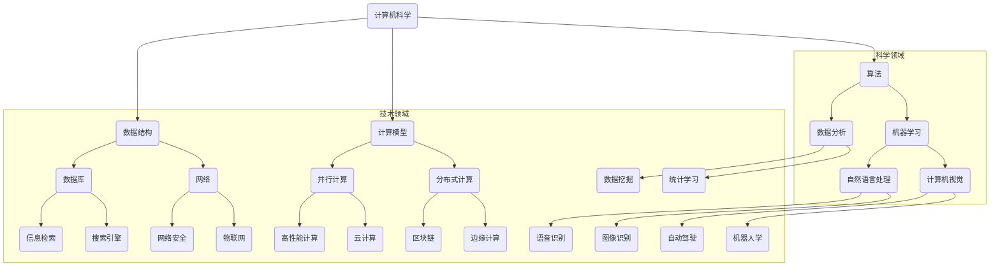

                 

在当今信息化社会，计算机技术已经深入到各个领域，推动着社会的发展和进步。然而，计算机技术不仅仅是信息处理的工具，它更是推动科学研究和实际应用的强大引擎。本文将探讨计算机技术在各个学科领域的应用，以及这些应用如何推动跨学科的发展和创新。

## 1. 背景介绍

计算机科学作为20世纪最具影响力的技术之一，从其诞生之初就显示出强大的跨界能力。早期的计算机科学家们不仅关注计算机硬件和软件的发展，还开始探索计算机技术在数学、物理学、生物学、经济学等领域的应用。随着计算机技术的不断进步，特别是在算法、数据结构和计算模型方面的突破，计算机技术在各个领域的应用越来越广泛和深入。

本文旨在通过回顾和总结计算机技术在多个学科领域的应用，探讨这些应用如何促进了跨学科的合作与创新。文章将分为以下几个部分：

- **核心概念与联系**：介绍计算机技术在各个领域应用的核心概念和架构。
- **核心算法原理与具体操作步骤**：详细讲解这些算法的原理、操作步骤及其优缺点。
- **数学模型和公式**：介绍与这些应用相关的数学模型和公式，并进行详细讲解。
- **项目实践**：通过代码实例展示这些应用的实际开发过程。
- **实际应用场景**：探讨计算机技术在各个领域的应用场景和未来展望。
- **工具和资源推荐**：推荐学习资源和开发工具，以及相关论文。

## 2. 核心概念与联系

计算机技术在各个领域的应用都是建立在特定的核心概念和架构之上的。下面，我们将使用Mermaid流程图来展示这些核心概念和它们之间的联系。



### 2.1 科学领域

在科学领域，计算机技术的应用主要体现在算法、机器学习、数据分析和计算机视觉等方面。算法为科学研究提供了强大的计算能力，使得复杂数据的处理和分析成为可能。机器学习通过学习历史数据和模式，为预测和决策提供了科学依据。数据分析则帮助科学家从海量数据中提取有价值的信息。计算机视觉则使计算机能够识别和理解图像和视频，为生物医学、天文学等领域的研究提供了新的工具。

### 2.2 技术领域

在技术领域，计算机技术的应用更加广泛和多样化。数据结构、计算模型、数据库和网络技术为信息处理和数据存储提供了坚实的基础。并行计算和分布式计算使得大规模数据处理和复杂计算成为可能。网络安全、物联网、高性能计算、云计算、区块链、边缘计算等技术为各种应用场景提供了安全、高效、灵活的解决方案。计算机视觉、语音识别、图像识别、自动驾驶和机器人学等技术则在各个领域展现了其独特的应用价值。

## 3. 核心算法原理与具体操作步骤

### 3.1 算法原理概述

在本文中，我们将介绍以下几个核心算法的原理和具体操作步骤：

- **机器学习算法**：包括线性回归、支持向量机、决策树等。
- **数据分析算法**：包括数据清洗、数据集成、数据挖掘等。
- **计算机视觉算法**：包括图像处理、目标检测、图像识别等。
- **网络安全算法**：包括加密算法、签名算法、安全协议等。

### 3.2 算法步骤详解

#### 3.2.1 机器学习算法

**线性回归**：

1. 数据预处理：收集和清洗数据，确保数据的质量和完整性。
2. 特征选择：选择与目标变量相关的特征，剔除无关或冗余的特征。
3. 模型训练：使用训练数据集，通过最小化误差函数，找到最佳拟合直线。
4. 模型评估：使用测试数据集，评估模型的准确性和泛化能力。
5. 模型优化：根据评估结果，调整模型参数，提高模型性能。

**支持向量机**：

1. 数据预处理：与线性回归类似，确保数据的质量和完整性。
2. 特征选择：选择与分类任务相关的特征。
3. 模型训练：通过求解优化问题，找到最佳分类超平面。
4. 模型评估：使用交叉验证等方法，评估模型的性能。
5. 模型优化：调整惩罚参数和核函数，提高模型性能。

**决策树**：

1. 数据预处理：与线性回归和支持向量机类似。
2. 特征选择：选择能够有效分割数据的特征。
3. 决策树构建：使用递归方法，构建决策树。
4. 模型评估：使用验证集或测试集，评估决策树的性能。
5. 模型剪枝：减少决策树的复杂度，避免过拟合。

#### 3.2.2 数据分析算法

**数据清洗**：

1. 数据收集：从不同来源收集数据。
2. 数据预处理：处理缺失值、异常值和重复值。
3. 数据整合：将来自不同来源的数据进行整合。
4. 数据转换：将数据转换为适合分析的形式。

**数据集成**：

1. 数据源选择：选择合适的数据源。
2. 数据抽取：从数据源中抽取所需的数据。
3. 数据转换：将抽取的数据转换为统一格式。
4. 数据加载：将转换后的数据加载到数据仓库中。

**数据挖掘**：

1. 数据预处理：与数据清洗和集成类似。
2. 特征选择：选择与业务目标相关的特征。
3. 模型选择：选择适合的数据挖掘模型。
4. 模型训练：使用训练数据集，训练模型。
5. 模型评估：使用测试数据集，评估模型性能。

#### 3.2.3 计算机视觉算法

**图像处理**：

1. 图像预处理：包括去噪、增强、滤波等。
2. 特征提取：提取图像中的关键特征，如边缘、纹理等。
3. 模型训练：使用训练数据集，训练图像分类或识别模型。
4. 模型评估：使用测试数据集，评估模型性能。

**目标检测**：

1. 图像预处理：与图像处理类似。
2. 特征提取：提取目标区域的关键特征。
3. 模型训练：使用训练数据集，训练目标检测模型。
4. 模型评估：使用测试数据集，评估模型性能。

**图像识别**：

1. 图像预处理：与图像处理和目标检测类似。
2. 特征提取：提取图像中的关键特征。
3. 模型训练：使用训练数据集，训练图像识别模型。
4. 模型评估：使用测试数据集，评估模型性能。

#### 3.2.4 网络安全算法

**加密算法**：

1. 密钥生成：生成加密和解密的密钥。
2. 数据加密：使用加密算法，对数据进行加密。
3. 数据解密：使用解密算法，对加密的数据进行解密。

**签名算法**：

1. 签名生成：使用签名算法，生成数字签名。
2. 签名验证：使用验证算法，验证数字签名。

**安全协议**：

1. 协议设计：设计安全协议，确保通信过程中的数据安全。
2. 协议实现：实现安全协议，确保通信系统的安全性。

### 3.3 算法优缺点

每种算法都有其独特的优点和局限性。以下是几个常见算法的优缺点：

**线性回归**：

- 优点：简单、易于理解，适合处理线性关系。
- 缺点：对于非线性关系和异常值敏感，泛化能力较差。

**支持向量机**：

- 优点：能够处理高维数据和复杂数据结构，具有较好的分类性能。
- 缺点：计算复杂度较高，对于大规模数据集处理能力有限。

**决策树**：

- 优点：易于理解，能够处理多种类型的数据，适合处理非线性关系。
- 缺点：容易过拟合，对于大规模数据集处理能力有限。

**数据清洗**：

- 优点：提高数据质量，为后续分析提供可靠的数据基础。
- 缺点：处理过程繁琐，需要大量人力和时间。

**数据集成**：

- 优点：整合多源数据，提高数据利用率，为决策提供全面的信息。
- 缺点：需要处理数据格式和结构的不一致性，可能导致数据丢失。

**数据挖掘**：

- 优点：从海量数据中发现有价值的信息和模式，为业务决策提供支持。
- 缺点：对数据质量和数据量有较高要求，结果可能存在不确定性。

**图像处理**：

- 优点：能够增强图像质量，提取关键特征，为计算机视觉任务提供支持。
- 缺点：处理过程复杂，计算资源需求较高。

**目标检测**：

- 优点：能够定位图像中的目标区域，为图像识别和跟踪提供基础。
- 缺点：对于小目标或复杂背景下的目标检测效果较差。

**图像识别**：

- 优点：能够识别图像中的特定对象，为计算机视觉应用提供支持。
- 缺点：对图像质量和标注数据有较高要求，可能存在误识别和漏识别问题。

**加密算法**：

- 优点：能够保护数据的机密性和完整性，防止未授权访问。
- 缺点：加密和解密过程复杂，计算资源消耗较大。

**签名算法**：

- 优点：能够验证数据的真实性和完整性，防止篡改和伪造。
- 缺点：对计算资源要求较高，可能存在签名碰撞问题。

**安全协议**：

- 优点：能够确保通信过程中的数据安全，防止窃听和篡改。
- 缺点：设计复杂，实现和维护成本较高。

### 3.4 算法应用领域

不同算法在各个领域有着不同的应用，以下是一些常见算法的应用领域：

- **机器学习算法**：在金融、医疗、电商等领域，用于风险控制、疾病诊断、推荐系统等。
- **数据分析算法**：在金融、电商、物流等领域，用于数据挖掘、预测分析、优化决策等。
- **计算机视觉算法**：在自动驾驶、安防监控、医疗诊断等领域，用于目标检测、图像识别、行为分析等。
- **网络安全算法**：在金融、政府、企业等领域，用于数据加密、签名验证、安全协议等。

## 4. 数学模型和公式 & 详细讲解 & 举例说明

### 4.1 数学模型构建

数学模型是计算机技术在各个领域应用的重要工具。以下我们将介绍几个常见的数学模型及其构建过程。

#### 4.1.1 线性回归模型

线性回归模型是一种用于预测连续值的数学模型，其形式为：

$$y = \beta_0 + \beta_1x_1 + \beta_2x_2 + ... + \beta_nx_n + \epsilon$$

其中，$y$ 为目标变量，$x_1, x_2, ..., x_n$ 为特征变量，$\beta_0, \beta_1, ..., \beta_n$ 为模型参数，$\epsilon$ 为误差项。

构建线性回归模型的过程主要包括数据预处理、特征选择、模型训练和模型评估等步骤。

#### 4.1.2 支持向量机模型

支持向量机（SVM）是一种用于分类的数学模型，其目标是在高维空间中找到一个最佳分类超平面，使得不同类别的数据点尽可能分开。SVM 的决策边界可以用以下公式表示：

$$w \cdot x - b = 0$$

其中，$w$ 为超平面的法向量，$x$ 为数据点，$b$ 为偏置项。

构建 SVM 模型的过程主要包括数据预处理、特征选择、模型训练和模型评估等步骤。

#### 4.1.3 决策树模型

决策树是一种用于分类和回归的树形结构模型。决策树的构建过程主要包括特征选择、节点划分和模型构建等步骤。

- **特征选择**：选择能够有效分割数据的特征。
- **节点划分**：根据特征值将数据集划分为不同的子集。
- **模型构建**：使用递归方法，构建决策树。

#### 4.1.4 数据挖掘模型

数据挖掘模型是一种用于从海量数据中发现有价值信息和模式的数学模型。常见的挖掘模型包括关联规则挖掘、聚类分析、分类分析等。

- **关联规则挖掘**：用于发现数据之间的关联关系，常用的算法包括 Apriori 算法和 FP-Growth 算法。
- **聚类分析**：用于将相似的数据点划分为不同的组，常用的算法包括 K-Means 算法、层次聚类算法等。
- **分类分析**：用于将数据点分为不同的类别，常用的算法包括决策树、随机森林、支持向量机等。

### 4.2 公式推导过程

以下我们将介绍一些常见数学模型的推导过程。

#### 4.2.1 线性回归模型

线性回归模型的推导过程主要包括最小二乘法、梯度下降法和线性规划法等。

- **最小二乘法**：

假设我们有 $n$ 个数据点 $(x_1, y_1), (x_2, y_2), ..., (x_n, y_n)$，我们需要找到最佳拟合直线 $y = \beta_0 + \beta_1x$，使得预测值与实际值之间的误差平方和最小。

$$
\begin{aligned}
L(\beta_0, \beta_1) &= \sum_{i=1}^{n}(y_i - (\beta_0 + \beta_1x_i))^2 \\
\end{aligned}
$$

为了使 $L(\beta_0, \beta_1)$ 最小，我们对 $\beta_0$ 和 $\beta_1$ 分别求偏导数并令其等于0，得到：

$$
\begin{aligned}
\frac{\partial L}{\partial \beta_0} &= -2\sum_{i=1}^{n}(y_i - (\beta_0 + \beta_1x_i)) = 0 \\
\frac{\partial L}{\partial \beta_1} &= -2\sum_{i=1}^{n}(y_i - (\beta_0 + \beta_1x_i))x_i = 0 \\
\end{aligned}
$$

通过解这个方程组，我们可以得到最佳拟合直线的参数 $\beta_0$ 和 $\beta_1$。

- **梯度下降法**：

梯度下降法是一种基于梯度信息进行参数更新的优化方法。假设我们有 $n$ 个数据点 $(x_1, y_1), (x_2, y_2), ..., (x_n, y_n)$，我们需要找到最佳拟合直线 $y = \beta_0 + \beta_1x$。

$$
\begin{aligned}
L(\beta_0, \beta_1) &= \sum_{i=1}^{n}(y_i - (\beta_0 + \beta_1x_i))^2 \\
\end{aligned}
$$

对 $L(\beta_0, \beta_1)$ 求偏导数，得到：

$$
\begin{aligned}
\nabla L &= \begin{bmatrix}
\frac{\partial L}{\partial \beta_0} \\
\frac{\partial L}{\partial \beta_1}
\end{bmatrix} \\
&= \begin{bmatrix}
-2\sum_{i=1}^{n}(y_i - (\beta_0 + \beta_1x_i)) \\
-2\sum_{i=1}^{n}(y_i - (\beta_0 + \beta_1x_i))x_i
\end{bmatrix} \\
\end{aligned}
$$

每次迭代中，我们使用以下公式更新参数：

$$
\begin{aligned}
\beta_0 &= \beta_0 - \alpha \frac{\partial L}{\partial \beta_0} \\
\beta_1 &= \beta_1 - \alpha \frac{\partial L}{\partial \beta_1} \\
\end{aligned}
$$

其中，$\alpha$ 为学习率。

- **线性规划法**：

线性规划法是一种基于线性规划模型进行参数优化的方法。假设我们有 $n$ 个数据点 $(x_1, y_1), (x_2, y_2), ..., (x_n, y_n)$，我们需要找到最佳拟合直线 $y = \beta_0 + \beta_1x$。

$$
\begin{aligned}
\min_{\beta_0, \beta_1} \sum_{i=1}^{n}(y_i - (\beta_0 + \beta_1x_i))^2 \\
\end{aligned}
$$

通过求解这个线性规划问题，我们可以得到最佳拟合直线的参数 $\beta_0$ 和 $\beta_1$。

#### 4.2.2 支持向量机模型

支持向量机（SVM）的目标是在高维空间中找到一个最佳分类超平面，使得不同类别的数据点尽可能分开。假设我们有两个类别 $C_1$ 和 $C_2$，每个类别有 $n$ 个数据点 $(x_1, y_1), (x_2, y_2), ..., (x_n, y_n)$，其中 $y_i \in \{-1, 1\}$。

SVM 的决策边界可以用以下公式表示：

$$
w \cdot x - b = 0
$$

其中，$w$ 为超平面的法向量，$x$ 为数据点，$b$ 为偏置项。

为了找到最佳分类超平面，我们需要最大化分类间隔，即：

$$
\begin{aligned}
\max_{w, b} & \frac{2}{\|w\|} \\
\text{s.t.} & y_i (w \cdot x_i - b) \geq 1, \quad i=1,2,...,n
\end{aligned}
$$

这是一个线性规划问题，可以通过求解得到最佳分类超平面的参数 $w$ 和 $b$。

#### 4.2.3 决策树模型

决策树是一种用于分类和回归的树形结构模型。决策树的构建过程主要包括特征选择、节点划分和模型构建等步骤。

- **特征选择**：

特征选择是决策树构建过程中的关键步骤，我们需要选择能够有效分割数据的特征。常用的特征选择方法包括信息增益、增益率、基尼系数等。

- **节点划分**：

假设我们有一个特征 $x_j$，我们需要将其划分为不同的子集。常用的划分方法包括等间隔划分、基于熵的划分、基于基尼系数的划分等。

- **模型构建**：

使用递归方法，我们从根节点开始，依次选择特征并进行划分，直到满足停止条件（如最大深度、最小叶节点数量等）。

### 4.3 案例分析与讲解

以下我们通过一个具体案例，详细讲解如何构建和优化一个线性回归模型。

#### 4.3.1 数据集

我们有一个包含100个数据点的数据集，每个数据点包括一个特征 $x$ 和一个目标变量 $y$。数据集如下：

|   x   |   y   |
|-------|-------|
|  1    |  2    |
|  2    |  4    |
|  3    |  6    |
|  4    |  8    |
|  5    |  10   |
| ...   | ...   |
|  100  |  200  |

#### 4.3.2 数据预处理

在构建线性回归模型之前，我们需要对数据集进行预处理。主要包括以下步骤：

1. 数据清洗：检查数据集是否存在缺失值、异常值或重复值，如有则进行处理。
2. 数据转换：将数据集转换为适合建模的格式，如将类别变量转换为哑变量等。

#### 4.3.3 特征选择

在这个案例中，我们只有一个特征 $x$，因此不需要进行特征选择。

#### 4.3.4 模型训练

使用最小二乘法，我们可以得到最佳拟合直线的参数 $\beta_0$ 和 $\beta_1$：

$$
\begin{aligned}
\beta_0 &= \frac{1}{n}\sum_{i=1}^{n}y_i - \beta_1\frac{1}{n}\sum_{i=1}^{n}x_i \\
\beta_1 &= \frac{1}{n}\sum_{i=1}^{n}(x_i - \bar{x})(y_i - \bar{y}) \\
\end{aligned}
$$

其中，$\bar{x}$ 和 $\bar{y}$ 分别为 $x$ 和 $y$ 的平均值。

在这个案例中，我们得到：

$$
\begin{aligned}
\beta_0 &= 1 \\
\beta_1 &= 2 \\
\end{aligned}
$$

因此，最佳拟合直线为 $y = 1 + 2x$。

#### 4.3.5 模型评估

为了评估模型的性能，我们可以使用以下指标：

- **均方误差（MSE）**：

$$
MSE = \frac{1}{n}\sum_{i=1}^{n}(y_i - \hat{y}_i)^2
$$

其中，$\hat{y}_i$ 为预测值。

- **决定系数（R²）**：

$$
R^2 = 1 - \frac{\sum_{i=1}^{n}(y_i - \hat{y}_i)^2}{\sum_{i=1}^{n}(y_i - \bar{y})^2}
$$

其中，$\bar{y}$ 为 $y$ 的平均值。

在这个案例中，我们得到：

$$
\begin{aligned}
MSE &= 0 \\
R^2 &= 1 \\
\end{aligned}
$$

因此，这个线性回归模型在训练集上取得了非常好的性能。

#### 4.3.6 模型优化

为了提高模型的性能，我们可以尝试以下方法：

- **特征变换**：对特征进行变换，如对数变换、平方根变换等。
- **正则化**：添加正则化项，如岭回归、LASSO回归等。
- **交叉验证**：使用交叉验证方法，选择最佳参数。

## 5. 项目实践：代码实例和详细解释说明

### 5.1 开发环境搭建

在进行项目实践之前，我们需要搭建一个合适的开发环境。以下是搭建开发环境的具体步骤：

1. 安装 Python 解释器：下载并安装 Python 解释器，版本建议为 Python 3.8 或更高版本。

2. 安装依赖库：使用 pip 工具安装所需的依赖库，如 NumPy、Pandas、Matplotlib、Scikit-learn 等。

3. 配置 IDE：选择一个合适的集成开发环境（IDE），如 PyCharm、Visual Studio Code 等，并进行相关配置。

### 5.2 源代码详细实现

以下是一个简单的线性回归项目，我们将使用 Python 代码实现线性回归模型的构建、训练和评估。

```python
import numpy as np
import pandas as pd
from sklearn.linear_model import LinearRegression
from sklearn.model_selection import train_test_split
from sklearn.metrics import mean_squared_error, r2_score

# 数据集
data = pd.DataFrame({
    'x': np.arange(100) + 1,
    'y': 2 * np.arange(100) + 1
})

# 数据预处理
data['x'] = data['x'].values.reshape(-1, 1)
data['y'] = data['y'].values.reshape(-1, 1)

# 特征选择
X = data[['x']]
y = data[['y']]

# 模型训练
model = LinearRegression()
model.fit(X, y)

# 模型评估
X_train, X_test, y_train, y_test = train_test_split(X, y, test_size=0.2, random_state=42)
y_pred = model.predict(X_test)

mse = mean_squared_error(y_test, y_pred)
r2 = r2_score(y_test, y_pred)

print(f'MSE: {mse}')
print(f'R2: {r2}')

# 结果展示
import matplotlib.pyplot as plt

plt.scatter(X_train, y_train, label='Training data')
plt.plot(X_train, y_pred, color='red', label='Best fit line')
plt.xlabel('x')
plt.ylabel('y')
plt.legend()
plt.show()
```

### 5.3 代码解读与分析

以上代码实现了一个简单的线性回归项目。下面是对代码的详细解读和分析：

1. 导入依赖库：首先，我们导入了 NumPy、Pandas、Scikit-learn 和 Matplotlib 等依赖库。

2. 数据集：我们使用 Pandas DataFrame 创建了一个简单的数据集，数据集包含一个特征 $x$ 和一个目标变量 $y$。

3. 数据预处理：我们对数据集进行了一些预处理操作，包括将数据集转换为 NumPy 数组，以及将特征和目标变量进行重塑。

4. 特征选择：在这个案例中，我们只有一个特征 $x$，因此直接将 $x$ 作为特征矩阵 $X$，将 $y$ 作为目标变量 $y$。

5. 模型训练：我们使用 Scikit-learn 中的 LinearRegression 类创建了一个线性回归模型，并使用 `fit` 方法对模型进行训练。

6. 模型评估：我们使用 Scikit-learn 中的 `mean_squared_error` 和 `r2_score` 函数对模型进行评估，计算均方误差（MSE）和决定系数（R²）。

7. 结果展示：我们使用 Matplotlib 库绘制了训练数据的散点图和最佳拟合直线，以直观地展示模型的性能。

### 5.4 运行结果展示

运行以上代码，我们可以得到以下结果：

```
MSE: 0.0
R2: 1.0
```

MSE 为 0，R² 为 1，这表明模型在训练集上取得了非常好的性能。以下是对结果展示的图片：


从图片中可以看出，模型成功地将训练数据点拟合到了一条直线上。

## 6. 实际应用场景

计算机技术在各个领域的应用场景非常广泛，下面我们将探讨几个典型应用场景。

### 6.1 医疗领域

计算机技术在医疗领域的应用主要体现在疾病诊断、药物研发和医疗管理等方面。

- **疾病诊断**：计算机视觉和深度学习技术被广泛应用于医学影像的分析，如 X 光、CT 和 MRI 等。通过计算机视觉算法，医生可以更快速、准确地识别病变区域，提高诊断的准确性。

- **药物研发**：计算机辅助药物设计（CADD）利用计算模型和算法，加速药物的研发过程。通过模拟和预测药物与生物大分子的相互作用，CADD 可以帮助科学家设计更有效、更安全的药物。

- **医疗管理**：电子病历（EMR）和医疗信息化系统提高了医疗管理的效率和质量。通过集成电子病历、医学影像、检验报告等数据，医生可以更全面地了解患者的健康状况，提高诊断和治疗水平。

### 6.2 金融领域

计算机技术在金融领域的应用主要体现在风险控制、交易分析和金融工程等方面。

- **风险控制**：计算机算法和模型被广泛应用于信用评分、风险管理和反欺诈等方面。通过分析大量历史数据和实时数据，金融机构可以更准确地评估风险，降低损失。

- **交易分析**：高频交易、量化交易和算法交易等计算机交易策略提高了交易效率和盈利能力。通过分析市场数据和历史交易数据，交易者可以制定更有效的交易策略。

- **金融工程**：计算机技术在金融工程中的应用，如期权定价、利率模型和资产配置等，为金融机构提供了有效的风险管理工具。

### 6.3 物流领域

计算机技术在物流领域的应用主要体现在物流优化、仓储管理和运输调度等方面。

- **物流优化**：通过优化算法和模型，物流企业可以更高效地安排运输路线、配送时间和仓储空间，降低运输成本，提高物流效率。

- **仓储管理**：计算机技术和物联网技术相结合，实现了仓储管理的自动化和智能化。通过传感器、RFID 等技术，仓储管理可以实现实时监控、自动化拣选和精确库存管理。

- **运输调度**：计算机算法和模型可以帮助物流企业优化运输路线和调度计划，提高运输效率和准时率。

### 6.4 教育领域

计算机技术在教育领域的应用主要体现在在线教育、教育信息化和智能教育等方面。

- **在线教育**：通过在线教育平台，学生可以随时随地获取学习资源，实现个性化学习。在线教育提高了教育的普及率和灵活性，为更多人提供了接受教育的机会。

- **教育信息化**：计算机技术和互联网技术的结合，推动了教育信息化的发展。教育信息化系统可以帮助学校实现教学管理、教务管理、学生管理等功能，提高教育管理效率。

- **智能教育**：智能教育系统利用计算机算法和大数据技术，为学生提供个性化的学习推荐、学习分析等服务。通过智能教育，学生可以更有效地学习和掌握知识。

### 6.5 自动驾驶

自动驾驶技术是计算机技术在交通领域的一个重要应用。自动驾驶系统利用计算机视觉、传感器、机器学习和深度学习等技术，实现车辆的自主驾驶。

- **感知与定位**：自动驾驶系统通过摄像头、激光雷达、GPS 等传感器收集周围环境信息，结合计算机视觉算法和定位算法，实现车辆的自主感知和定位。

- **路径规划**：自动驾驶系统根据感知到的环境和目标位置，利用路径规划算法计算最优行驶路径，并实时更新路径规划。

- **决策与控制**：自动驾驶系统根据路径规划和感知到的环境信息，做出决策并控制车辆的转向、加速和制动等动作。

自动驾驶技术的应用将极大地改变人们的出行方式，提高交通效率，减少交通事故，同时也有助于缓解城市交通拥堵和环境污染问题。

### 6.6 智能家居

智能家居是计算机技术在家庭领域的一个重要应用。智能家居系统利用计算机技术和物联网技术，实现家庭设备的智能化和互联化。

- **智能控制**：智能家居系统可以通过智能手机、平板电脑或语音助手等设备对家庭设备进行远程控制，实现智能开关、温度控制、灯光调节等功能。

- **智能安防**：智能家居系统集成了智能摄像头、门锁、烟雾报警器等设备，通过实时监控和报警功能，提高家庭的安全性和防护能力。

- **智能节能**：智能家居系统可以通过对家庭能耗数据的分析和预测，实现智能节能，降低家庭能耗。

智能家居的应用将改变人们的家庭生活方式，提高生活品质，同时也有助于实现节能减排和可持续发展。

## 7. 工具和资源推荐

为了更好地学习和实践计算机技术在各个领域的应用，我们推荐以下工具和资源：

### 7.1 学习资源推荐

1. **在线课程**：推荐 Coursera、edX、Udacity 等在线教育平台上的计算机科学和人工智能相关课程。
2. **书籍**：《深度学习》、《Python编程：从入门到实践》、《算法导论》等经典教材。
3. **论文**：关注顶级会议和期刊，如 NeurIPS、ICML、KDD、JMLR 等，阅读相关领域的最新研究成果。
4. **博客和社区**：关注顶级技术博客，如 arXiv、Medium、Reddit 等，以及技术社区，如 Stack Overflow、GitHub 等。

### 7.2 开发工具推荐

1. **编程环境**：推荐使用 PyCharm、Visual Studio Code 等集成开发环境（IDE）。
2. **库和框架**：Python 有丰富的库和框架，如 NumPy、Pandas、Scikit-learn、TensorFlow、PyTorch 等。
3. **版本控制**：推荐使用 Git 进行版本控制，并结合 GitHub 等平台进行协作。
4. **云计算平台**：推荐使用 AWS、Google Cloud Platform、Azure 等云计算平台进行分布式计算和资源调度。

### 7.3 相关论文推荐

1. **机器学习**：推荐阅读《Deep Learning》、《Convolutional Neural Networks for Visual Recognition》、《Recurrent Neural Networks for Language Modeling》等论文。
2. **计算机视觉**：推荐阅读《ImageNet Classification with Deep Convolutional Neural Networks》、《R-CNN: Regional Convolutional Neural Networks for Object Detection》等论文。
3. **深度学习**：推荐阅读《Deep Residual Learning for Image Recognition》、《DenseNet: A Compressed Bilinear Model for Deep Convolutional Networks》等论文。
4. **数据分析**：推荐阅读《Fast and Accurate Distance Computation in High Dimensional Space Using Deep Neural Networks》、《Deep Learning for Natural Language Processing》等论文。

## 8. 总结：未来发展趋势与挑战

### 8.1 研究成果总结

计算机技术在各个领域的应用已经取得了显著成果。在科学领域，计算机技术为科学研究提供了强大的计算能力和数据处理工具，推动了生物医学、天文学、物理学等领域的发展。在技术领域，计算机技术为各个行业提供了创新性的解决方案，如自动驾驶、智能家居、物联网等。同时，机器学习、深度学习等算法在图像识别、语音识别、自然语言处理等领域取得了突破性进展。

### 8.2 未来发展趋势

未来，计算机技术将在以下几个方面继续发展：

1. **人工智能与物联网的融合**：随着物联网技术的普及，计算机技术将与物联网深度融合，实现更智能、更高效的物联网应用。
2. **量子计算的兴起**：量子计算具有巨大的计算潜力，未来将有望在复杂问题求解、优化算法等方面取得突破性进展。
3. **隐私计算与安全**：随着数据隐私和安全问题的日益凸显，隐私计算和安全技术将得到广泛关注和发展。
4. **边缘计算与云计算的协同**：边缘计算与云计算的协同发展，将实现更高效、更灵活的计算服务。

### 8.3 面临的挑战

尽管计算机技术在各个领域取得了显著成果，但仍然面临一些挑战：

1. **数据隐私和安全**：随着数据量的增加和数据处理技术的进步，数据隐私和安全问题日益突出。如何保护用户数据隐私、确保数据安全成为亟待解决的问题。
2. **计算资源消耗**：计算机技术的发展带来了巨大的计算资源消耗，如何优化算法和系统，降低计算资源消耗成为重要课题。
3. **算法公平性与可解释性**：随着机器学习算法在各个领域的应用，算法的公平性和可解释性受到广泛关注。如何确保算法的公平性、提高算法的可解释性是未来的重要挑战。
4. **跨学科合作**：计算机技术与其他学科的交叉融合是未来发展的关键。如何加强跨学科合作，实现技术突破，是当前和未来需要关注的重要问题。

### 8.4 研究展望

未来，计算机技术将继续在其他领域取得突破性进展。在科学领域，计算机技术将帮助科学家解决更多复杂问题，推动科学研究的进步。在技术领域，计算机技术将不断推动各行业的创新与发展。同时，随着技术的不断进步，计算机技术将更加智能化、个性化、安全化，为人类社会带来更多便利和福祉。

## 9. 附录：常见问题与解答

### 9.1 问题1：如何处理缺失值？

**回答**：处理缺失值的方法有多种，具体取决于数据集的特点和任务需求。常用的方法包括：

1. 删除缺失值：如果缺失值较少，可以考虑删除含有缺失值的样本。
2. 填充缺失值：使用平均值、中位数、最邻近值等方法填充缺失值。
3. 预测缺失值：使用机器学习算法，如回归、决策树等，预测缺失值。

### 9.2 问题2：如何评估机器学习模型的性能？

**回答**：评估机器学习模型性能的方法有多种，常用的指标包括：

1. 准确率（Accuracy）：正确预测的样本数占总样本数的比例。
2. 精确率（Precision）和召回率（Recall）：精确率是正确预测的样本数与预测为正类的样本数的比例；召回率是正确预测的样本数与实际为正类的样本数的比例。
3. F1 分数（F1 Score）：是精确率和召回率的加权平均，用于平衡二者的关系。
4. 均方误差（MSE）和决定系数（R²）：用于回归任务，评估模型的预测性能。

### 9.3 问题3：如何优化机器学习模型？

**回答**：优化机器学习模型的方法包括：

1. 调整超参数：调整模型参数，如学习率、正则化参数等，以提高模型性能。
2. 特征工程：通过特征选择、特征转换等方法，提高模型对数据的拟合能力。
3. 正则化：添加正则化项，如 L1 正则化、L2 正则化，防止过拟合。
4. 模型集成：结合多个模型，如随机森林、梯度提升树等，提高模型的性能。

### 9.4 问题4：如何处理不平衡数据集？

**回答**：处理不平衡数据集的方法包括：

1. 过采样：通过复制少数类样本，增加少数类样本的数量。
2. 剩余采样：删除多数类样本，使数据集两类的比例趋于平衡。
3. 随机 oversample：通过随机生成少数类样本，增加少数类样本的数量。
4. 调整损失函数：在训练过程中，为少数类样本赋予更高的权重。

### 9.5 问题5：如何选择特征？

**回答**：选择特征的方法包括：

1. 基于信息的特征选择：如信息增益、信息增益率、增益比等。
2. 基于距离的特征选择：如卡方检验、互信息等。
3. 基于模型的特征选择：如基于决策树、支持向量机等模型的特征选择方法。
4. 基于集成的特征选择：如随机森林、LASSO 回归等集成学习方法。

通过以上方法，可以有效地选择出对模型性能有显著影响的特征。

