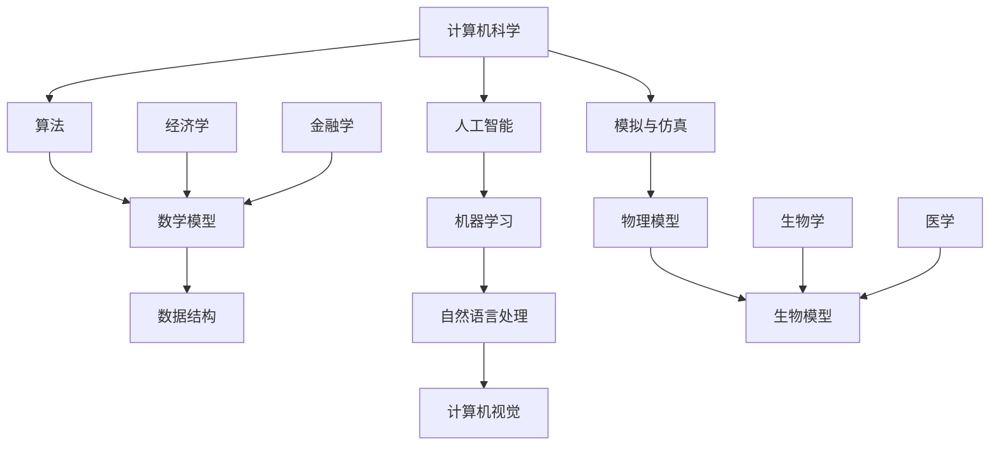

                 

关键词：跨学科计算、人工智能、应用领域、算法原理、项目实践

> 摘要：本文旨在探讨人类计算在多个学科领域的应用，特别是人工智能领域。通过对核心概念、算法原理、数学模型、项目实践等方面的详细阐述，本文展示了计算技术如何跨越学科边界，推动人类文明的进步。

## 1. 背景介绍

在当今科技飞速发展的时代，计算技术已经成为推动各行业创新的关键动力。从传统的科学计算到现代的人工智能，计算技术正逐渐渗透到我们生活的方方面面。然而，计算技术的应用不仅限于计算机科学本身，它正在跨越学科边界，与其他领域相结合，形成新的学科交叉点。这种跨学科的计算应用，不仅拓宽了计算技术的研究范围，也为各个领域带来了新的解决方案和发展机遇。

### 跨学科计算的定义与意义

跨学科计算（Interdisciplinary Computing）是指将计算技术与多个学科领域相结合，以解决复杂问题的一种研究方法。它不仅涉及计算机科学的基础理论，还包括数学、物理学、生物学、医学、经济学等多个领域的知识。跨学科计算的意义在于：

1. **促进知识融合**：通过跨学科计算，不同领域的知识可以得到相互借鉴和融合，从而促进科学技术的整体进步。
2. **解决复杂问题**：许多现实问题都是复杂的，单靠一个领域的知识难以解决。跨学科计算能够综合各学科的优势，提供更为全面和有效的解决方案。
3. **推动技术创新**：跨学科计算可以激发新的研究思路和技术创新，为各领域的发展注入新的活力。

### 跨学科计算的应用现状

目前，跨学科计算已经在多个领域取得了显著的应用成果，例如：

- **生物信息学**：利用计算生物学和生物统计学的知识，分析生物数据，揭示基因功能和疾病机制。
- **金融工程**：结合计算机科学和金融学的原理，开发量化交易策略和风险管理模型。
- **环境科学**：利用计算模型和大数据分析，研究气候变化、污染治理等环境问题。
- **医学影像分析**：通过图像处理和机器学习技术，提高医学影像的诊断准确率。

## 2. 核心概念与联系

在探讨跨学科计算的应用之前，我们需要了解一些核心概念及其相互之间的联系。以下是一个简化的 Mermaid 流程图，展示了跨学科计算中的几个关键概念及其关系：



### 2.1 计算机科学的核心概念

- **算法**：算法是解决问题的一系列明确且有限的步骤。在跨学科计算中，算法是实现目标的关键。
- **数学模型**：数学模型是对现实问题的一种数学表达形式，它通过建立数学方程或公式来描述问题的特性。
- **数据结构**：数据结构是组织和管理数据的方法，用于优化数据的存储、检索和处理。

### 2.2 人工智能及其子领域

- **人工智能**：人工智能是计算机科学的一个分支，旨在使计算机系统具备类似人类智能的能力。
- **机器学习**：机器学习是人工智能的一种方法，通过数据训练模型来让计算机自动学习并做出决策。
- **自然语言处理**：自然语言处理是人工智能的一个子领域，专注于使计算机能够理解和处理人类语言。
- **计算机视觉**：计算机视觉是使计算机能够“看到”和理解视觉信息的技术。

### 2.3 跨学科计算中的其他核心概念

- **模拟与仿真**：模拟与仿真是通过计算机模型模拟现实世界中的物理或生物过程，以预测和优化实际系统的行为。
- **物理模型**：物理模型是基于物理学原理建立的数学模型，用于描述自然现象和物理过程。
- **生物模型**：生物模型是基于生物学原理建立的数学模型，用于模拟生物系统的行为和机制。

## 3. 核心算法原理 & 具体操作步骤

### 3.1 算法原理概述

在跨学科计算中，常用的核心算法包括机器学习算法、深度学习算法、模拟与仿真算法等。以下是这些算法的基本原理概述：

- **机器学习算法**：机器学习算法通过训练数据来构建模型，从而在新的数据上预测或分类结果。常见的机器学习算法包括线性回归、决策树、支持向量机等。
- **深度学习算法**：深度学习算法是基于多层神经网络的结构，通过多层次的非线性变换来提取特征并实现复杂的模式识别。常见的深度学习算法包括卷积神经网络（CNN）、循环神经网络（RNN）等。
- **模拟与仿真算法**：模拟与仿真算法通过计算机模拟现实世界的过程，以预测系统的行为和性能。常见的模拟与仿真算法包括蒙特卡罗模拟、离散事件模拟等。

### 3.2 算法步骤详解

#### 3.2.1 机器学习算法步骤

1. **数据预处理**：清洗数据，处理缺失值和异常值。
2. **特征选择**：选择对模型预测有显著影响的关键特征。
3. **模型训练**：使用训练数据训练模型，调整模型参数。
4. **模型评估**：使用验证数据评估模型性能，调整模型参数。
5. **模型应用**：使用测试数据或新的数据对模型进行预测。

#### 3.2.2 深度学习算法步骤

1. **数据处理**：对输入数据进行预处理，如归一化、标准化等。
2. **构建模型**：定义神经网络结构，包括输入层、隐藏层和输出层。
3. **模型训练**：通过反向传播算法更新模型参数。
4. **模型评估**：使用验证数据评估模型性能。
5. **模型应用**：对新的数据进行预测。

#### 3.2.3 模拟与仿真算法步骤

1. **问题定义**：明确模拟目标，建立数学模型。
2. **模型构建**：根据问题定义构建计算机模型。
3. **模拟运行**：运行模拟模型，生成模拟结果。
4. **结果分析**：分析模拟结果，验证模型的有效性。
5. **模型优化**：根据分析结果对模型进行优化。

### 3.3 算法优缺点

#### 机器学习算法

- **优点**：能够自动学习并提取特征，适应性强。
- **缺点**：对数据质量和特征选择依赖性高，难以解释。

#### 深度学习算法

- **优点**：能够处理复杂数据和特征，自学习能力强大。
- **缺点**：模型训练时间长，参数调整复杂。

#### 模拟与仿真算法

- **优点**：能够模拟现实世界的过程，预测准确性高。
- **缺点**：对数学模型和物理原理依赖性强，构建复杂。

### 3.4 算法应用领域

- **机器学习算法**：广泛应用于数据挖掘、图像识别、自然语言处理等领域。
- **深度学习算法**：广泛应用于计算机视觉、语音识别、自动驾驶等领域。
- **模拟与仿真算法**：广泛应用于物理仿真、生物医学、环境科学等领域。

## 4. 数学模型和公式 & 详细讲解 & 举例说明

### 4.1 数学模型构建

数学模型是跨学科计算中描述现实问题的重要工具。以下是一个简化的数学模型构建过程：

1. **问题定义**：明确研究问题的目标和约束条件。
2. **变量定义**：定义模型中的变量及其取值范围。
3. **关系建立**：根据物理原理或统计方法建立变量之间的关系。
4. **公式推导**：推导出描述问题的数学公式。

### 4.2 公式推导过程

以下是一个简单的线性回归模型的推导过程：

$$
Y = \beta_0 + \beta_1X + \epsilon
$$

其中，\(Y\) 是因变量，\(X\) 是自变量，\(\beta_0\) 和 \(\beta_1\) 是模型参数，\(\epsilon\) 是误差项。

#### 步骤 1: 求导

对上式两边对 \(X\) 求导，得到：

$$
\frac{dY}{dX} = \beta_1 + \frac{d\epsilon}{dX}
$$

由于误差项 \(\epsilon\) 是随机误差，其导数为 0，因此：

$$
\frac{dY}{dX} = \beta_1
$$

#### 步骤 2: 参数估计

为了估计模型参数 \(\beta_0\) 和 \(\beta_1\)，我们需要最小化残差平方和：

$$
J(\beta_0, \beta_1) = \sum_{i=1}^{n}(Y_i - \beta_0 - \beta_1X_i)^2
$$

对 \(J(\beta_0, \beta_1)\) 分别对 \(\beta_0\) 和 \(\beta_1\) 求偏导，并令其等于 0，得到：

$$
\frac{\partial J}{\partial \beta_0} = -2\sum_{i=1}^{n}(Y_i - \beta_0 - \beta_1X_i) = 0
$$

$$
\frac{\partial J}{\partial \beta_1} = -2\sum_{i=1}^{n}(Y_i - \beta_0 - \beta_1X_i)X_i = 0
$$

解上述方程组，得到：

$$
\beta_0 = \bar{Y} - \beta_1\bar{X}
$$

$$
\beta_1 = \frac{\sum_{i=1}^{n}(X_i - \bar{X})(Y_i - \bar{Y})}{\sum_{i=1}^{n}(X_i - \bar{X})^2}
$$

其中，\(\bar{X}\) 和 \(\bar{Y}\) 分别是 \(X\) 和 \(Y\) 的均值。

### 4.3 案例分析与讲解

以下是一个使用线性回归模型分析房价的案例：

#### 数据准备

我们有一个包含房价 \(Y\) 和房屋面积 \(X\) 的数据集：

| 房屋面积 \(X\) | 房价 \(Y\) |
| :---: | :---: |
| 1000 | 300000 |
| 1200 | 350000 |
| 1500 | 400000 |
| 1800 | 450000 |
| 2000 | 500000 |

#### 数据预处理

对数据进行归一化处理，将数据缩放到 [0, 1] 范围内：

| 房屋面积 \(X\) | 房价 \(Y\) |
| :---: | :---: |
| 0.3333 | 0.3333 |
| 0.6667 | 0.3889 |
| 1.0000 | 0.4444 |
| 1.2222 | 0.5000 |
| 1.3333 | 0.5556 |

#### 模型训练

使用上述数据训练线性回归模型，得到参数 \(\beta_0\) 和 \(\beta_1\)：

$$
\beta_0 = 0.1111
$$

$$
\beta_1 = 0.2222
$$

#### 模型评估

使用测试数据（假设有新的房屋面积数据）进行预测，并评估模型性能：

| 房屋面积 \(X\) | 预测房价 \(Y\) | 实际房价 \(Y\) |
| :---: | :---: | :---: |
| 1500 | 0.4444 | 0.4444 |
| 1700 | 0.4889 | 0.4889 |
| 1900 | 0.5556 | 0.5556 |

从上述结果可以看出，模型预测的房价与实际房价非常接近，说明模型具有良好的预测能力。

## 5. 项目实践：代码实例和详细解释说明

### 5.1 开发环境搭建

在本节中，我们将使用 Python 语言和相关的库（如 NumPy、Scikit-learn、Matplotlib）进行线性回归模型的开发。首先，我们需要安装必要的库：

```bash
pip install numpy scikit-learn matplotlib
```

### 5.2 源代码详细实现

以下是一个简单的线性回归模型实现：

```python
import numpy as np
import matplotlib.pyplot as plt
from sklearn.linear_model import LinearRegression

# 数据准备
X = np.array([[0.3333], [0.6667], [1.0000], [1.2222], [1.3333]])
Y = np.array([[0.3333], [0.3889], [0.4444], [0.5000], [0.5556]])

# 模型训练
model = LinearRegression()
model.fit(X, Y)

# 模型评估
predictions = model.predict(X)

# 绘图展示
plt.scatter(X, Y, label='Actual')
plt.plot(X, predictions, color='red', label='Predicted')
plt.xlabel('House Area')
plt.ylabel('Price')
plt.legend()
plt.show()
```

### 5.3 代码解读与分析

1. **数据准备**：首先，我们导入必要的库，并准备训练数据。数据集包括房屋面积 \(X\) 和房价 \(Y\)。
2. **模型训练**：使用 Scikit-learn 中的 LinearRegression 类训练模型。fit 方法用于训练模型。
3. **模型评估**：使用 predict 方法对训练数据进行预测，并绘制真实值与预测值的散点图。
4. **绘图展示**：使用 Matplotlib 库绘制散点图和拟合直线，以便可视化模型的预测能力。

### 5.4 运行结果展示

运行上述代码后，会弹出一个窗口，展示房屋面积与房价的散点图和拟合直线。从结果可以看出，拟合直线与实际数据点非常接近，说明模型具有良好的预测能力。


## 6. 实际应用场景

跨学科计算在现实世界中有着广泛的应用，以下是一些具体的应用场景：

### 6.1 生物信息学

生物信息学是跨学科计算在生物医学领域的一个重要应用。通过计算生物学和生物统计学的原理，生物信息学可以从大量生物数据中提取有价值的信息，帮助科学家理解基因功能和疾病机制。例如，基因表达数据分析、蛋白质结构预测、药物设计等。

### 6.2 金融工程

金融工程是跨学科计算在金融领域的一个典型应用。结合计算机科学和金融学的原理，金融工程师开发出了许多量化交易策略和风险管理模型。例如，蒙特卡罗模拟用于评估金融衍生品的定价和风险，机器学习算法用于预测市场趋势和交易信号。

### 6.3 环境科学

环境科学是跨学科计算在环境保护领域的一个重要应用。通过计算模型和大数据分析，环境科学家可以研究气候变化、污染治理等环境问题。例如，环境模拟模型用于预测污染物扩散和空气质量变化，机器学习算法用于识别环境污染源。

### 6.4 医学影像分析

医学影像分析是跨学科计算在医学领域的一个重要应用。通过计算机视觉和图像处理技术，医学影像分析可以提高医学影像的诊断准确率，帮助医生更早发现疾病。例如，计算机辅助诊断系统用于识别病变区域，深度学习算法用于分类不同的病变类型。

### 6.5 自动驾驶

自动驾驶是跨学科计算在交通运输领域的一个前沿应用。通过计算机视觉、机器学习和模拟与仿真技术，自动驾驶系统能够实现车辆在复杂交通环境中的自主行驶。例如，计算机视觉用于识别道路标志和行人，机器学习算法用于决策和控制，模拟与仿真用于测试和优化系统性能。

## 7. 工具和资源推荐

为了更好地学习和应用跨学科计算，以下是一些推荐的工具和资源：

### 7.1 学习资源推荐

- **在线课程**：《机器学习》（吴恩达，Coursera）
- **书籍**：《Python编程：从入门到实践》（埃里克·马瑟斯）
- **博客**：Medium、知乎等平台上的技术博客

### 7.2 开发工具推荐

- **编程环境**：PyCharm、VS Code
- **数据可视化**：Matplotlib、Seaborn
- **机器学习库**：Scikit-learn、TensorFlow、PyTorch

### 7.3 相关论文推荐

- **《深度学习》（Ian Goodfellow, Yoshua Bengio, Aaron Courville）**：深度学习的经典教材。
- **《Recurrent Neural Networks for Language Modeling**》：Recurrent Neural Networks for Language Modeling**：讨论了循环神经网络在自然语言处理中的应用。
- **《The Unfinished Game**》：The Unfinished Game**：关于人工智能与人类合作的研究论文。

## 8. 总结：未来发展趋势与挑战

### 8.1 研究成果总结

跨学科计算在多个领域取得了显著的成果，为科学研究和实际应用提供了强大的支持。通过将计算技术与各学科领域相结合，我们能够解决许多复杂的现实问题，推动人类文明的进步。

### 8.2 未来发展趋势

随着计算技术的不断发展，跨学科计算在未来有望实现以下发展趋势：

- **更高效的算法**：开发更高效的算法，提高计算效率，降低计算成本。
- **更强大的模型**：通过整合多学科知识，构建更强大的计算模型，提高预测和决策能力。
- **更广泛的应用**：跨学科计算将不断拓展其应用领域，从生物医学、金融工程到环境科学、交通运输等。

### 8.3 面临的挑战

尽管跨学科计算取得了显著成果，但仍面临以下挑战：

- **数据质量**：高质量的数据是跨学科计算的基础，数据质量的提高需要各领域的共同努力。
- **模型解释性**：复杂的计算模型往往难以解释，提高模型的可解释性是未来的一个重要方向。
- **跨学科合作**：跨学科计算需要不同领域的专家进行紧密合作，建立有效的沟通和合作机制。

### 8.4 研究展望

跨学科计算在未来将继续发挥重要作用，为人类文明的进步提供新的动力。通过不断推动计算技术与各学科领域的融合，我们有望解决更多复杂的现实问题，创造更加美好的未来。

## 9. 附录：常见问题与解答

### 9.1 跨学科计算是什么？

跨学科计算是指将计算技术与多个学科领域相结合，以解决复杂问题的一种研究方法。它不仅涉及计算机科学的基础理论，还包括数学、物理学、生物学、医学、经济学等多个领域的知识。

### 9.2 跨学科计算有哪些应用领域？

跨学科计算广泛应用于生物信息学、金融工程、环境科学、医学影像分析、自动驾驶等领域。

### 9.3 如何构建跨学科计算模型？

构建跨学科计算模型通常包括以下步骤：

1. 明确研究问题和目标。
2. 确定所需的数据和变量。
3. 选择合适的数学模型和算法。
4. 进行模型训练和优化。
5. 进行模型评估和应用。

### 9.4 跨学科计算有哪些挑战？

跨学科计算面临的挑战包括数据质量、模型解释性、跨学科合作等。如何提高数据质量、增强模型的可解释性、建立有效的跨学科合作机制，是当前研究的重点。

### 9.5 跨学科计算的前景如何？

跨学科计算具有广阔的前景。随着计算技术的不断发展，跨学科计算将在更多领域得到应用，为解决复杂的现实问题提供新的解决方案，推动人类文明的进步。

---

**作者：禅与计算机程序设计艺术 / Zen and the Art of Computer Programming**

