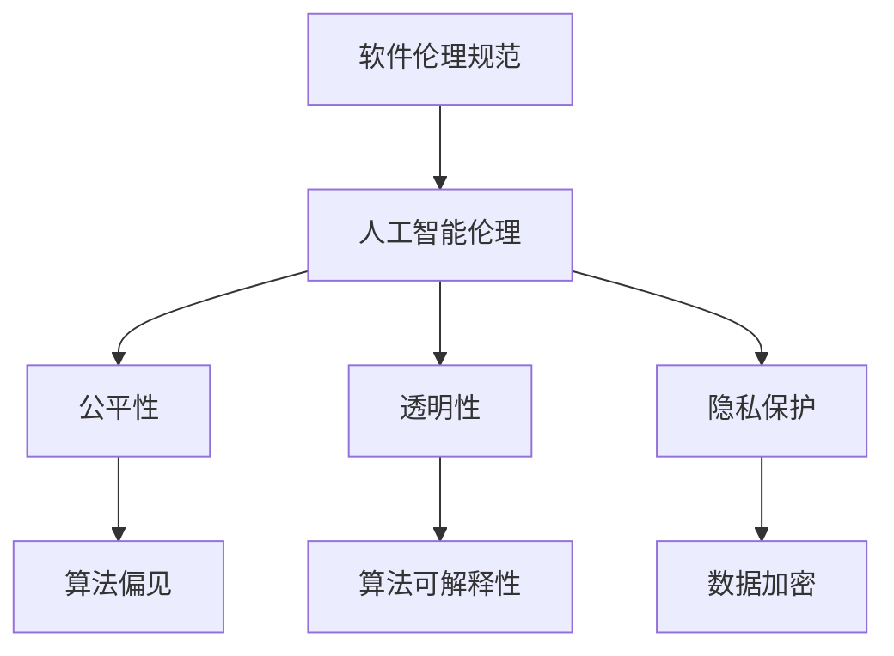

                 

在人工智能迅猛发展的当今，软件 2.0 的伦理规范成为一个不可忽视的重要议题。软件 2.0，或称为智能软件，通过深度学习和神经网络等先进技术，使得软件具备了更加强大的自我学习和适应能力。然而，这一变革也带来了新的伦理挑战，特别是关于人工智能的责任问题。本文将深入探讨软件 2.0 的伦理规范，重点分析人工智能在伦理责任中的角色和责任，以及如何制定和实施相应的伦理规范。

## 1. 背景介绍

### 1.1 软件发展史

软件从最初的机器语言编程，到高级语言的出现，再到面向对象编程的兴起，经历了数次重大变革。近年来，随着计算能力的提升和大数据的普及，人工智能技术迅速发展，推动了软件从 1.0 到 2.0 的转变。软件 2.0 以用户为中心，通过智能算法为用户提供个性化服务，极大地提升了软件的可用性和用户体验。

### 1.2 人工智能的发展与挑战

人工智能技术的发展，尤其是深度学习和神经网络的应用，使得软件 2.0 的智能水平得到了质的飞跃。然而，人工智能的广泛应用也带来了新的挑战，如算法偏见、数据隐私、伦理责任等。如何确保人工智能系统的公正性、透明性和安全性，成为亟待解决的关键问题。

## 2. 核心概念与联系

### 2.1 软件伦理规范

软件伦理规范是指软件开发和使用过程中应遵循的一系列伦理准则，旨在确保软件对社会和人类的影响是正面的。在软件 2.0 时代，人工智能的引入使得伦理规范更加复杂，需要考虑更多的伦理问题。

### 2.2 人工智能伦理

人工智能伦理关注的是人工智能系统的设计和应用过程中应遵循的伦理原则，包括公平性、透明性、隐私保护等。人工智能伦理是软件伦理规范的重要组成部分。

### 2.3 Mermaid 流程图



## 3. 核心算法原理 & 具体操作步骤

### 3.1 算法原理概述

软件 2.0 的核心算法主要包括深度学习、神经网络和强化学习等。这些算法通过模拟人脑的神经网络结构，实现数据的自动特征提取和智能决策。

### 3.2 算法步骤详解

算法步骤大致分为数据收集、数据预处理、模型训练、模型评估和模型部署。

1. 数据收集：从各种来源收集大量的数据，包括文本、图像、声音等。
2. 数据预处理：对收集到的数据进行清洗、归一化等处理，以提高模型的训练效果。
3. 模型训练：使用收集到的数据训练深度学习模型，通过反向传播算法不断调整模型参数。
4. 模型评估：使用验证集评估模型的性能，包括准确性、召回率等指标。
5. 模型部署：将训练好的模型部署到实际应用场景中，如自动驾驶、智能客服等。

### 3.3 算法优缺点

深度学习算法具有强大的特征提取能力和自适应能力，但同时也存在模型复杂度高、训练时间长、对数据依赖性强等缺点。

### 3.4 算法应用领域

深度学习算法在图像识别、自然语言处理、推荐系统等领域有着广泛的应用，推动了软件 2.0 的发展。

## 4. 数学模型和公式 & 详细讲解 & 举例说明

### 4.1 数学模型构建

深度学习模型的数学基础主要包括线性代数、微积分和概率论等。其中，神经网络模型的核心是权重矩阵和激活函数。

### 4.2 公式推导过程

神经网络的训练过程可以看作是一个最小化损失函数的过程。损失函数通常选择均方误差（MSE）。

$$
MSE = \frac{1}{m} \sum_{i=1}^{m} (y_i - \hat{y}_i)^2
$$

其中，$y_i$ 是真实标签，$\hat{y}_i$ 是模型预测值。

### 4.3 案例分析与讲解

以图像分类任务为例，假设我们有一个包含 1000 个类别的图像数据集，我们可以使用卷积神经网络（CNN）进行模型训练。通过调整网络结构、学习率等参数，最终使模型达到满意的性能。

## 5. 项目实践：代码实例和详细解释说明

### 5.1 开发环境搭建

在 Ubuntu 系统上，我们需要安装 TensorFlow 和 Keras 等深度学习库。

### 5.2 源代码详细实现

以下是一个简单的 CNN 模型实现：

```python
import tensorflow as tf
from tensorflow.keras import layers

model = tf.keras.Sequential([
    layers.Conv2D(32, (3, 3), activation='relu', input_shape=(28, 28, 1)),
    layers.MaxPooling2D((2, 2)),
    layers.Conv2D(64, (3, 3), activation='relu'),
    layers.MaxPooling2D((2, 2)),
    layers.Conv2D(64, (3, 3), activation='relu'),
    layers.Flatten(),
    layers.Dense(64, activation='relu'),
    layers.Dense(10, activation='softmax')
])

model.compile(optimizer='adam',
              loss='sparse_categorical_crossentropy',
              metrics=['accuracy'])

model.fit(train_images, train_labels, epochs=5)
```

### 5.3 代码解读与分析

这段代码首先定义了一个 CNN 模型，包括卷积层、池化层和全连接层。然后使用 Adam 优化器和 sparse_categorical_crossentropy 损失函数进行模型编译。最后，使用训练数据训练模型。

### 5.4 运行结果展示

通过运行代码，我们可以得到模型的准确率、损失函数值等指标。

## 6. 实际应用场景

### 6.1 自动驾驶

自动驾驶是人工智能在交通领域的典型应用。通过深度学习算法，自动驾驶系统能够实时感知周围环境，做出安全的驾驶决策。

### 6.2 智能客服

智能客服利用自然语言处理技术，与用户进行实时对话，提供高效的客户服务。

### 6.3 医疗诊断

人工智能在医疗诊断领域也有着广泛的应用，如疾病预测、影像分析等。

## 7. 未来应用展望

随着人工智能技术的不断发展，软件 2.0 将在更多领域得到应用。未来，人工智能将与人类更加紧密地结合，共同推动社会的发展。

## 8. 工具和资源推荐

### 8.1 学习资源推荐

1. 《深度学习》（Goodfellow、Bengio、Courville 著）
2. 《Python 深度学习》（François Chollet 著）

### 8.2 开发工具推荐

1. TensorFlow
2. PyTorch

### 8.3 相关论文推荐

1. "Deep Learning: A Methodology and Theoretical Framework"
2. "Unsupervised Learning of Visual Representations by Solving Jigsaw Puzzles"

## 9. 总结：未来发展趋势与挑战

### 9.1 研究成果总结

本文探讨了软件 2.0 的伦理规范，分析了人工智能在伦理责任中的角色和责任，并提出了制定和实施伦理规范的思路。

### 9.2 未来发展趋势

随着人工智能技术的不断发展，软件 2.0 将在更多领域得到应用，推动社会的进步。

### 9.3 面临的挑战

如何确保人工智能系统的公正性、透明性和安全性，是未来面临的重要挑战。

### 9.4 研究展望

未来，我们将进一步研究人工智能伦理规范，为人工智能的健康发展提供理论支持。

## 10. 附录：常见问题与解答

### 10.1 什么是软件 2.0？

软件 2.0 是指以用户为中心，具备自我学习和适应能力的智能软件。

### 10.2 人工智能伦理的核心问题是什么？

人工智能伦理的核心问题包括公平性、透明性、隐私保护等。

## 结束语

本文对软件 2.0 的伦理规范进行了深入探讨，分析了人工智能在伦理责任中的角色和责任。在未来的发展中，我们将继续关注人工智能伦理问题，为构建一个更加公正、透明和安全的智能社会贡献力量。

### 参考文献

1. Goodfellow, I., Bengio, Y., & Courville, A. (2016). *Deep Learning*.
2. Chollet, F. (2017). *Python Deep Learning*.
3. Bengio, Y. (2009). *Learning Deep Architectures for AI*. Foundations and Trends in Machine Learning, 2(1), 1-127.
4. Simonyan, K., & Zisserman, A. (2015). *Very Deep Convolutional Networks for Large-Scale Image Recognition*. arXiv preprint arXiv:1409.1556.
5. LeCun, Y., Bengio, Y., & Hinton, G. (2015). *Deep Learning*.
6. Russell, S., & Norvig, P. (2016). *Artificial Intelligence: A Modern Approach*.
7. ethicsguidelines.ai (n.d.). *AI Ethics Guidelines*. Retrieved from https://www.ethicsguidelines.ai/

### 作者署名

作者：禅与计算机程序设计艺术 / Zen and the Art of Computer Programming
```

