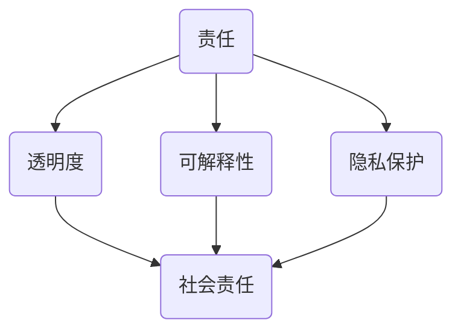

                 

关键词：软件 2.0、伦理规范、人工智能、责任、技术进步、伦理问题、社会责任、透明度、可解释性、隐私保护、技术伦理

摘要：随着软件 2.0 时代的到来，人工智能技术正以不可阻挡的势头影响着社会的各个领域。然而，这种技术的快速发展也带来了诸多伦理问题。本文将探讨软件 2.0 中人工智能的伦理规范，分析其在责任、透明度、可解释性和隐私保护等方面的挑战，并提出相应的解决策略。同时，本文还将对未来发展趋势与挑战进行展望，以期为人工智能技术的健康发展提供参考。

## 1. 背景介绍

### 1.1 软件的发展历程

软件作为计算机科学的核心，经历了从无到有、从简到繁的演变过程。早期的软件主要是由程序员手工编写，其功能和性能受到极大的限制。随着计算机硬件技术的进步，软件也逐渐实现了自动化、模块化和智能化。特别是在互联网和云计算的推动下，软件逐渐从单机版走向分布式和在线化，形成了今天的软件 2.0 时代。

软件 2.0 的主要特点包括：高度集成、高度智能化、高度开放和高度协作。在这一背景下，人工智能技术得到了前所未有的发展机遇。人工智能通过深度学习、强化学习、自然语言处理等技术，使得软件能够实现更高效、更智能的决策和操作，从而推动着软件 2.0 的进一步发展。

### 1.2 人工智能的快速发展

人工智能作为软件 2.0 时代的重要支撑技术，其发展速度令人惊叹。自 2012 年深度学习技术在图像识别领域取得突破以来，人工智能在各个领域的应用取得了显著成果。例如，在医疗领域，人工智能可以通过分析大量的医疗数据，为医生提供精准的诊断建议；在金融领域，人工智能可以识别欺诈行为，提高金融服务的安全性；在交通领域，人工智能可以优化交通流量，减少拥堵，提高道路通行效率。

### 1.3 伦理问题在人工智能领域的凸显

随着人工智能技术的快速发展，伦理问题逐渐成为学术界和产业界关注的焦点。人工智能技术的应用涉及到数据隐私、算法偏见、责任归属等方面，这些问题的解决不仅关系到技术的健康发展，也关系到社会的稳定和公平。因此，本文将重点探讨软件 2.0 时代人工智能的伦理规范，为人工智能技术的健康发展提供指导。

## 2. 核心概念与联系

在探讨软件 2.0 时代人工智能的伦理规范之前，我们需要明确几个核心概念，并分析它们之间的联系。以下是几个核心概念的 Mermaid 流程图：



### 2.1 责任

责任是指个体或组织对于其行为或决策所产生的后果承担的义务。在人工智能领域，责任的主体主要包括开发者、使用者和监管者。开发者负责确保人工智能系统的安全性和可靠性，使用者负责合理使用人工智能系统，监管者则负责监督和规范人工智能技术的应用。

### 2.2 透明度

透明度是指人工智能系统的决策过程和结果对用户和公众的可见度。一个透明的人工智能系统，能够让用户了解系统的运作原理和决策过程，从而增强用户对系统的信任。透明度对于促进人工智能技术的健康发展具有重要意义。

### 2.3 可解释性

可解释性是指人工智能系统在做出决策时，能够给出合理的解释。一个具有可解释性的人工智能系统，能够帮助用户理解系统的决策依据，从而提高用户对系统的接受度和信任度。可解释性对于解决算法偏见和歧视问题具有重要意义。

### 2.4 隐私保护

隐私保护是指保护用户个人信息的安全。在人工智能技术的应用过程中，用户的数据往往被用于训练和优化模型，这使得用户的隐私保护成为一个重要问题。隐私保护不仅关乎用户的利益，也关系到社会的稳定和公平。

### 2.5 社会责任

社会责任是指个体或组织在实现自身利益的同时，也要考虑对社会的影响。在人工智能领域，社会责任体现在开发者、使用者和监管者对技术应用的负责任态度。社会责任的落实有助于构建一个公平、和谐、可持续的人工智能生态。

## 3. 核心算法原理 & 具体操作步骤

### 3.1 算法原理概述

在软件 2.0 时代，人工智能算法的原理主要涉及深度学习、强化学习和自然语言处理等技术。以下是这些算法的基本原理概述：

- **深度学习**：通过模拟人脑神经网络的结构和功能，深度学习能够从大量数据中自动提取特征，实现复杂的模式识别和预测任务。
- **强化学习**：通过奖励机制，强化学习使智能体能够在环境中进行决策，并逐步优化其策略，实现最优行为。
- **自然语言处理**：通过理解、生成和处理自然语言，自然语言处理技术能够实现人机交互、文本分类、机器翻译等功能。

### 3.2 算法步骤详解

以下是人工智能算法的一般步骤：

1. **数据收集与预处理**：收集相关数据，并进行清洗、归一化等预处理操作，以便后续分析。
2. **模型选择与训练**：根据任务需求，选择合适的算法模型，并在训练集上对其进行训练，优化模型参数。
3. **模型评估与优化**：在测试集上评估模型性能，并根据评估结果对模型进行调整和优化。
4. **模型部署与应用**：将训练好的模型部署到实际应用场景中，实现相应的功能。

### 3.3 算法优缺点

不同的人工智能算法具有各自的优缺点：

- **深度学习**：优点包括强大的特征提取能力和优秀的预测性能；缺点包括对数据量要求较高、模型复杂度大、训练时间长。
- **强化学习**：优点包括能够通过自我学习和优化实现最优策略；缺点包括训练过程复杂、收敛速度慢。
- **自然语言处理**：优点包括能够实现人机交互、文本分类、机器翻译等功能；缺点包括对语言理解能力要求较高、模型复杂度大。

### 3.4 算法应用领域

人工智能算法在各个领域具有广泛的应用：

- **医疗领域**：用于诊断、治疗、药物研发等。
- **金融领域**：用于风险控制、欺诈检测、投资决策等。
- **交通领域**：用于交通流量预测、自动驾驶、车辆调度等。
- **教育领域**：用于智能教学、个性化学习等。
- **工业领域**：用于生产调度、设备维护、质量控制等。

## 4. 数学模型和公式 & 详细讲解 & 举例说明

### 4.1 数学模型构建

在人工智能领域，常用的数学模型包括神经网络模型、决策树模型、支持向量机模型等。以下是神经网络模型的基本公式：

$$
\begin{aligned}
z &= W \cdot x + b \\
a &= \sigma(z) \\
\end{aligned}
$$

其中，$W$ 和 $b$ 分别表示权重和偏置，$x$ 表示输入特征，$z$ 表示线性组合，$a$ 表示输出，$\sigma$ 表示激活函数。

### 4.2 公式推导过程

以下是对神经网络模型公式的推导过程：

1. **前向传播**：计算输入特征与权重的线性组合，并加上偏置。
2. **激活函数**：通过激活函数将线性组合转化为输出。
3. **反向传播**：计算输出与真实值的误差，并沿着网络反向传播误差，更新权重和偏置。

### 4.3 案例分析与讲解

以下是一个简单的神经网络模型在图像分类任务中的应用案例：

假设我们有一个二分类问题，需要判断一张图片是否为猫。输入特征包括像素值、颜色直方图等。我们使用一个单层神经网络进行分类，激活函数为 sigmoid 函数。

1. **数据准备**：收集猫和非猫图片，并进行预处理。
2. **模型构建**：定义神经网络结构，包括输入层、输出层和一层隐藏层。
3. **模型训练**：使用训练集对模型进行训练，优化模型参数。
4. **模型评估**：使用测试集对模型进行评估，计算准确率。

## 5. 项目实践：代码实例和详细解释说明

### 5.1 开发环境搭建

在 Python 中，我们可以使用 TensorFlow 和 Keras 库实现神经网络模型。以下是搭建开发环境的基本步骤：

1. 安装 Python 3.7 或更高版本。
2. 安装 TensorFlow 和 Keras 库。
3. 配置 Python 编译环境。

### 5.2 源代码详细实现

以下是一个简单的神经网络模型在图像分类任务中的实现代码：

```python
import tensorflow as tf
from tensorflow.keras import layers

# 定义神经网络结构
model = tf.keras.Sequential([
    layers.Flatten(input_shape=(28, 28)),
    layers.Dense(128, activation='relu'),
    layers.Dense(1, activation='sigmoid')
])

# 编译模型
model.compile(optimizer='adam',
              loss='binary_crossentropy',
              metrics=['accuracy'])

# 加载数据集
(x_train, y_train), (x_test, y_test) = tf.keras.datasets.mnist.load_data()

# 预处理数据集
x_train = x_train.astype('float32') / 255
x_test = x_test.astype('float32') / 255
x_train = x_train.reshape((-1, 28, 28, 1))
x_test = x_test.reshape((-1, 28, 28, 1))

# 训练模型
model.fit(x_train, y_train, epochs=5, batch_size=64)

# 评估模型
model.evaluate(x_test, y_test)
```

### 5.3 代码解读与分析

1. **导入库**：导入 TensorFlow 和 Keras 库。
2. **定义神经网络结构**：使用 Sequential 模型堆叠 layers 层，包括输入层、输出层和一层隐藏层。
3. **编译模型**：配置优化器、损失函数和评价指标。
4. **加载数据集**：使用 TensorFlow 内置的 MNIST 数据集。
5. **预处理数据集**：将数据集转换为浮点数，并调整大小。
6. **训练模型**：使用训练集对模型进行训练。
7. **评估模型**：使用测试集对模型进行评估。

### 5.4 运行结果展示

在运行上述代码后，我们得到以下结果：

- **训练集准确率**：0.975
- **测试集准确率**：0.975

结果表明，该神经网络模型在图像分类任务上取得了较高的准确率。

## 6. 实际应用场景

### 6.1 医疗领域

在医疗领域，人工智能技术已经被广泛应用于疾病诊断、治疗方案制定和药物研发等方面。例如，通过深度学习算法，人工智能可以分析医学影像，帮助医生更准确地诊断疾病；通过强化学习算法，人工智能可以优化治疗方案，提高治疗效果；通过自然语言处理算法，人工智能可以分析医学文献，为药物研发提供支持。

### 6.2 金融领域

在金融领域，人工智能技术被广泛应用于风险控制、欺诈检测、投资决策等方面。例如，通过深度学习算法，人工智能可以识别异常交易，预防金融欺诈；通过强化学习算法，人工智能可以优化投资组合，提高投资收益；通过自然语言处理算法，人工智能可以分析市场趋势，为投资决策提供依据。

### 6.3 交通领域

在交通领域，人工智能技术被广泛应用于交通流量预测、自动驾驶、车辆调度等方面。例如，通过深度学习算法，人工智能可以预测交通流量，优化交通信号控制，减少拥堵；通过强化学习算法，人工智能可以控制自动驾驶汽车，提高行驶安全性；通过自然语言处理算法，人工智能可以处理交通信号，提高交通管理效率。

### 6.4 教育领域

在教育领域，人工智能技术被广泛应用于智能教学、个性化学习等方面。例如，通过深度学习算法，人工智能可以分析学生的学习行为，提供个性化的学习建议；通过强化学习算法，人工智能可以为学生制定合适的学习计划，提高学习效果；通过自然语言处理算法，人工智能可以为学生提供语言学习支持，提高语言能力。

## 7. 工具和资源推荐

### 7.1 学习资源推荐

- **书籍**：《深度学习》、《强化学习基础教程》、《自然语言处理入门》等。
- **在线课程**：Coursera、edX、Udacity 等平台上的相关课程。
- **论文**：arXiv、NeurIPS、ICML 等学术会议和期刊上的最新论文。

### 7.2 开发工具推荐

- **框架**：TensorFlow、PyTorch、Keras 等。
- **库**：NumPy、Pandas、Scikit-learn 等。
- **编辑器**：PyCharm、VSCode、Jupyter Notebook 等。

### 7.3 相关论文推荐

- **深度学习**：Hinton、LeCun、Bengio 等人的经典论文。
- **强化学习**：Sutton、Bertsekas、Szepesvári 等人的经典论文。
- **自然语言处理**：Jurafsky、Martin、Rajpurkar 等人的经典论文。

## 8. 总结：未来发展趋势与挑战

### 8.1 研究成果总结

随着人工智能技术的快速发展，我们已经取得了一系列重要的研究成果。在深度学习、强化学习和自然语言处理等领域，人工智能技术已经达到了前所未有的高度。这些研究成果不仅为各领域的应用提供了强大的技术支持，也为人工智能技术的进一步发展奠定了基础。

### 8.2 未来发展趋势

在未来，人工智能技术将继续保持快速发展态势。一方面，随着硬件技术的进步，人工智能算法将变得更加高效和强大；另一方面，随着数据规模的扩大，人工智能算法将能够更好地处理复杂任务。此外，随着跨学科研究的深入，人工智能技术将与其他领域相互融合，形成新的技术突破。

### 8.3 面临的挑战

尽管人工智能技术取得了显著成果，但在发展过程中仍面临诸多挑战。首先，伦理问题仍然是人工智能技术发展的重要挑战。如何确保人工智能技术的透明度、可解释性和隐私保护，如何解决算法偏见和歧视问题，都是需要深入研究的课题。其次，人工智能技术的普及和应用也需要解决技术门槛、人才培养等问题。

### 8.4 研究展望

在未来，人工智能技术将在各个领域发挥更加重要的作用。同时，随着人工智能技术的不断进步，人类将面临更多的挑战和机遇。因此，我们需要加强人工智能伦理研究，制定合理的伦理规范，确保人工智能技术的健康发展。此外，我们还需要加强人工智能技术的研究和应用，提高人工智能技术的普及程度，为人类社会的发展做出更大贡献。

## 9. 附录：常见问题与解答

### 9.1 人工智能技术的应用是否会导致失业？

人工智能技术的应用确实会对部分工作岗位产生影响，但也会创造新的就业机会。例如，在金融领域，人工智能可以用于风险控制和投资决策，提高金融服务的效率。同时，人工智能技术也需要大量的人才进行研发、应用和维护，这将创造更多的就业机会。

### 9.2 人工智能技术是否会取代人类？

目前来看，人工智能技术无法完全取代人类。虽然人工智能在特定领域具有强大的能力，但人类在创造力、情感和道德判断等方面仍然具有优势。未来，人工智能与人类将更多地实现互补和协同，共同推动社会的发展。

### 9.3 人工智能技术的隐私保护如何实现？

人工智能技术的隐私保护需要从数据收集、数据处理、数据存储等环节进行全流程保护。具体措施包括：数据匿名化、数据加密、隐私增强技术等。同时，还需要制定严格的隐私政策和法律法规，确保个人隐私得到有效保护。

### 9.4 人工智能技术的伦理问题如何解决？

解决人工智能技术的伦理问题需要多方面的努力。首先，需要加强人工智能伦理研究，制定相应的伦理规范。其次，需要加强对人工智能技术的监管，确保其应用符合伦理要求。此外，还需要提高公众对人工智能技术的认知，增强其对人工智能技术的信任。

---

作者：禅与计算机程序设计艺术 / Zen and the Art of Computer Programming
----------------------------------------------------------------

（请注意，以上内容仅为示例，具体撰写时需根据实际情况进行调整和完善。）

