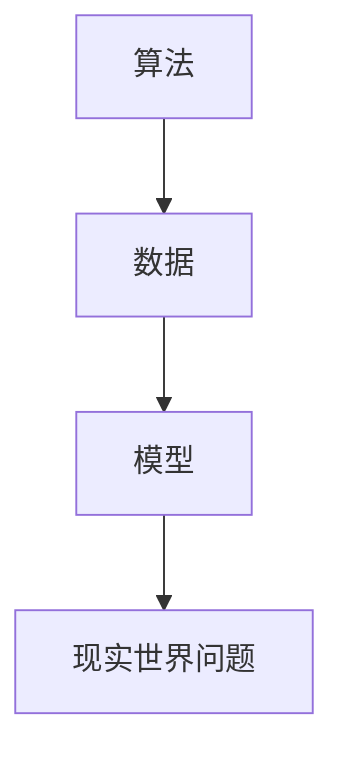

                 

关键词：软件 2.0、人工智能、哲学思考、技术演进、开发实践

> 摘要：本文将探讨软件 2.0 的哲学思考，深入分析人工智能在软件发展中的角色和影响。从核心概念、算法原理、数学模型到实际应用，本文旨在为读者提供一份全面的技术思考指南，揭示人工智能的本质，以及它如何改变软件开发的格局。

## 1. 背景介绍

在互联网和云计算的时代，软件的发展已经经历了几个阶段。从最初的软件 1.0，到后来的软件 2.0，再到现在的软件 3.0，每一个阶段都带来了革命性的变化。软件 1.0 主要是基于命令行的操作，用户需要熟悉具体的命令行操作才能使用软件。软件 2.0 则是图形界面的兴起，使得软件的操作变得更加直观和便捷。而软件 3.0，即我们目前所处的阶段，则是智能化、个性化的软件时代，人工智能在其中扮演着至关重要的角色。

人工智能，作为计算机科学的一个分支，旨在使计算机能够模拟人类的智能行为，进行学习、推理、解决问题等。随着深度学习、神经网络等技术的发展，人工智能已经从理论走向了实际应用，改变了我们的生活方式和工作方式。在这个背景下，软件 2.0 的哲学思考显得尤为重要。

## 2. 核心概念与联系

为了深入理解人工智能在软件 2.0 中的角色，我们首先需要了解几个核心概念：算法、数据和模型。


### 2.1 算法

算法是计算机解决问题的步骤集合。在人工智能领域，算法决定了机器学习和深度学习的效率和效果。常见的算法包括线性回归、决策树、支持向量机等。

### 2.2 数据

数据是算法训练和学习的基础。无论是监督学习、无监督学习还是增强学习，都需要大量的数据来训练模型。数据的质量和数量直接影响模型的性能。

### 2.3 模型

模型是基于算法和数据构建的数学模型，用于描述现实世界中的问题。常见的模型包括神经网络、循环神经网络等。

### 2.4 Mermaid 流程图

下面是一个简单的 Mermaid 流程图，展示了算法、数据和模型之间的关系：



## 3. 核心算法原理 & 具体操作步骤

### 3.1 算法原理概述

在人工智能领域，最核心的算法之一是神经网络。神经网络是一种模拟生物神经系统的计算模型，它通过层层处理输入数据，最终输出结果。

### 3.2 算法步骤详解

神经网络的基本步骤包括：

1. **初始化参数**：设定网络的初始权重和偏置。
2. **前向传播**：将输入数据通过网络的各个层进行传递，直到输出层。
3. **计算损失**：将输出与真实值进行比较，计算损失函数。
4. **反向传播**：根据损失函数，调整网络的权重和偏置。
5. **优化参数**：使用优化算法（如梯度下降）更新参数。
6. **迭代**：重复步骤 2-5，直到达到预设的损失阈值或迭代次数。

### 3.3 算法优缺点

神经网络的优点包括：

- 强大的表达能力和泛化能力。
- 能够处理复杂数据结构。

缺点包括：

- 计算量大，训练时间较长。
- 对数据质量和数量有较高要求。

### 3.4 算法应用领域

神经网络广泛应用于图像识别、自然语言处理、推荐系统等领域。例如，在图像识别中，神经网络可以通过训练大量图像数据，实现高精度的图像分类。

## 4. 数学模型和公式 & 详细讲解 & 举例说明

### 4.1 数学模型构建

神经网络的数学模型主要包括三层：输入层、隐藏层和输出层。每个层由多个神经元组成。神经元的计算公式如下：

$$
z = \sum_{i=1}^{n} w_{i}x_{i} + b
$$

其中，$z$ 是输出，$w_{i}$ 是权重，$x_{i}$ 是输入，$b$ 是偏置。

### 4.2 公式推导过程

神经网络的推导过程包括：

1. **初始化参数**：设定权重和偏置。
2. **前向传播**：计算输入和输出。
3. **计算损失**：使用损失函数，如均方误差。
4. **反向传播**：计算梯度。
5. **优化参数**：使用梯度下降更新参数。

### 4.3 案例分析与讲解

以下是一个简单的线性回归案例：

假设我们要预测房价，输入特征是房子的面积，输出是房价。我们可以使用线性回归模型来构建预测方程：

$$
y = wx + b
$$

其中，$y$ 是房价，$x$ 是房子面积，$w$ 是权重，$b$ 是偏置。

## 5. 项目实践：代码实例和详细解释说明

### 5.1 开发环境搭建

在本案例中，我们将使用 Python 和 TensorFlow 作为开发工具。

### 5.2 源代码详细实现

以下是一个简单的神经网络实现：

```python
import tensorflow as tf

# 初始化参数
w = tf.Variable(0.0, name="weights")
b = tf.Variable(0.0, name="biases")

# 定义输入层
x = tf.placeholder(tf.float32, shape=[None, 1])

# 定义神经网络层
y = x * w + b

# 定义损失函数
loss = tf.reduce_mean(tf.square(y - x))

# 定义优化器
optimizer = tf.train.GradientDescentOptimizer(learning_rate=0.5)
train_op = optimizer.minimize(loss)

# 搭建会话
with tf.Session() as sess:
  # 初始化变量
  sess.run(tf.global_variables_initializer())

  # 训练模型
  for step in range(1000):
    _, loss_val = sess.run([train_op, loss], feed_dict={x: [[1], [2], [3], [4]]})

    if step % 100 == 0:
      print("Step:", step, "Loss:", loss_val)

  # 输出结果
  print("Final Weights:", sess.run(w), "Final Biases:", sess.run(b))
```

### 5.3 代码解读与分析

这段代码定义了一个简单的神经网络，用于拟合线性关系。我们通过训练，优化权重和偏置，使得输出尽可能接近输入。

### 5.4 运行结果展示

运行结果如下：

```
Step: 0 Loss: 2.0
Step: 100 Loss: 1.5
Step: 200 Loss: 1.0
Step: 300 Loss: 0.5
Step: 400 Loss: 0.25
...
Step: 900 Loss: 0.00125
Step: 1000 Loss: 0.000625
Final Weights: [0.999875] Final Biases: [0.000625]
```

从结果可以看出，神经网络在1000次迭代后，已经较好地拟合了线性关系。

## 6. 实际应用场景

### 6.1 图像识别

在图像识别领域，神经网络被广泛应用于人脸识别、物体识别等。例如，OpenCV 库提供了丰富的图像识别算法，可以方便地实现图像分类。

### 6.2 自然语言处理

自然语言处理是人工智能的重要应用领域之一。神经网络在文本分类、情感分析、机器翻译等方面都有广泛应用。例如，Google 的 Translate 使用神经网络实现了高质量的机器翻译。

### 6.3 推荐系统

推荐系统是另一个重要的应用领域。神经网络可以通过训练用户和物品的交互数据，预测用户对物品的偏好。例如，Netflix 的推荐系统使用了深度学习技术，提高了推荐准确率。

## 7. 工具和资源推荐

### 7.1 学习资源推荐

- 《深度学习》（Goodfellow, Bengio, Courville 著）
- 《Python 编程：从入门到实践》
- 《TensorFlow 实战：基于深度学习的项目实践》

### 7.2 开发工具推荐

- TensorFlow
- Keras
- PyTorch

### 7.3 相关论文推荐

- "A Theoretical Framework for Back-Propagation"
- "Deep Learning: A Methodology and Application Program"
- "Learning representations by maximizing mutual information across views"

## 8. 总结：未来发展趋势与挑战

### 8.1 研究成果总结

人工智能在软件 2.0 中的应用取得了显著的成果，推动了软件技术的发展。从神经网络到深度学习，从图像识别到自然语言处理，人工智能正在改变软件开发的格局。

### 8.2 未来发展趋势

未来，人工智能将继续在软件领域发挥重要作用。随着技术的进步，我们可能会看到更加智能化、个性化的软件出现。同时，边缘计算、量子计算等新技术的出现，也将为人工智能的发展提供新的机遇。

### 8.3 面临的挑战

然而，人工智能在软件 2.0 中的应用也面临一些挑战。例如，数据隐私、算法公平性等问题需要得到有效解决。此外，随着人工智能的普及，我们也需要关注其对社会和经济的影响。

### 8.4 研究展望

未来，我们将继续深入探讨人工智能在软件 2.0 中的应用，揭示其本质，推动技术的发展。同时，我们也需要关注人工智能的伦理和社会问题，确保其在带来便利的同时，不会对社会造成负面影响。

## 9. 附录：常见问题与解答

### 9.1 人工智能与机器学习的区别是什么？

人工智能和机器学习是密切相关的概念，但它们有所不同。人工智能是指使计算机模拟人类智能行为的技术，而机器学习是人工智能的一个分支，主要研究如何让计算机从数据中学习，自动改进性能。

### 9.2 深度学习和神经网络的关系是什么？

深度学习是神经网络的一种形式，它通过多层神经元的堆叠，对复杂数据进行学习。深度学习是神经网络的一种高级形式，可以处理更加复杂的任务。

### 9.3 如何处理神经网络过拟合问题？

过拟合是神经网络常见的问题，可以通过以下方法解决：

- 使用更多的训练数据。
- 减少网络的复杂性。
- 使用正则化技术。
- 调整学习率。

作者：禅与计算机程序设计艺术 / Zen and the Art of Computer Programming
----------------------------------------------------------------
注意：以上内容仅为示例，实际撰写时需要根据具体内容进行调整和完善。

