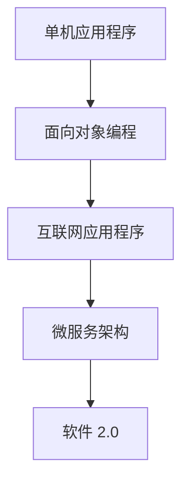

                 

关键词：软件 2.0、实验室、现实应用、技术变革、软件开发

> 摘要：本文将探讨软件 2.0 的概念及其在现实世界中的应用，分析其在软件开发领域的变革性作用，探讨未来发展趋势与面临的挑战，并推荐相关学习资源和开发工具。

## 1. 背景介绍

在当今数字化时代，软件技术已经成为推动社会进步的重要力量。从早期的单机应用程序到互联网时代的大规模分布式系统，软件开发经历了多次重大的变革。然而，随着技术的不断进步，传统的软件开发模式逐渐暴露出一些问题，如开发效率低下、维护成本高昂、用户体验不佳等。为了解决这些问题，软件 2.0 概念应运而生。

软件 2.0 是一种全新的软件开发模式，它强调以用户为中心，通过数据驱动、敏捷开发、智能化等手段，实现软件的高效、灵活和可持续发展。与传统软件相比，软件 2.0 更注重用户体验、业务价值和技术创新。

## 2. 核心概念与联系

### 2.1 软件开发模式演变

软件 2.0 的出现并非无源之水，它是在传统软件开发模式基础上逐步演变而来的。下面是软件开发模式的演变过程及核心概念：

#### 2.1.1 单机应用程序

在计算机刚刚普及的时期，软件主要以单机应用程序为主，如文字处理、电子表格等。这种开发模式简单、直接，但受限于硬件性能和存储容量，应用场景有限。

#### 2.1.2 面向对象编程

随着计算机技术的发展，面向对象编程逐渐成为主流。它通过将数据和操作封装在对象中，提高了代码的复用性和可维护性。

#### 2.1.3 互联网应用程序

互联网的兴起带来了全新的应用场景，如电子商务、社交媒体等。为了应对这些复杂的应用，软件开发模式逐渐向分布式、组件化、服务化方向发展。

#### 2.1.4 微服务架构

微服务架构是近年来备受关注的一种软件开发模式。它通过将应用程序拆分为多个独立、轻量级的微服务，提高了系统的可扩展性、可靠性和灵活性。

### 2.2 软件开发模式与软件 2.0 的关系

软件 2.0 不是对传统软件开发模式的彻底颠覆，而是在其基础上进行的一次升华。它继承了传统软件开发模式的优点，并在此基础上引入了新的理念和方法，如数据驱动、敏捷开发、智能化等。

- 数据驱动：软件 2.0 强调以数据为核心，通过数据分析和挖掘，实现业务价值的最大化。
- 敏捷开发：软件 2.0 推崇敏捷开发方法，通过快速迭代、持续交付，提高开发效率和产品质量。
- 智能化：软件 2.0 充分利用人工智能、大数据等技术，实现软件的自动化、智能化。

### 2.3 Mermaid 流程图

下面是一个描述软件开发模式演变的 Mermaid 流程图：



## 3. 核心算法原理 & 具体操作步骤

### 3.1 算法原理概述

软件 2.0 的核心算法原理可以概括为以下几个方面：

- 数据挖掘与分析：通过数据挖掘和分析技术，从大量数据中提取有价值的信息，为业务决策提供支持。
- 智能推荐系统：利用机器学习算法，根据用户行为和历史数据，为用户提供个性化的推荐。
- 自动化测试：通过自动化测试技术，提高软件的可靠性和质量。

### 3.2 算法步骤详解

#### 3.2.1 数据挖掘与分析

1. 数据收集：收集用户行为数据、业务数据等。
2. 数据预处理：对数据进行清洗、转换和归一化处理。
3. 特征提取：从原始数据中提取有价值的特征。
4. 模型训练：利用机器学习算法，如回归、分类等，训练模型。
5. 模型评估与优化：评估模型性能，进行参数调整和优化。

#### 3.2.2 智能推荐系统

1. 用户行为数据收集：收集用户浏览、购买、评论等行为数据。
2. 数据预处理：对数据进行清洗、转换和归一化处理。
3. 特征提取：从原始数据中提取有价值的特征。
4. 模型训练：利用协同过滤、基于内容的推荐等算法，训练推荐模型。
5. 推荐结果生成：根据用户特征和物品特征，生成个性化推荐结果。

#### 3.2.3 自动化测试

1. 测试用例设计：根据需求规格说明，设计测试用例。
2. 测试用例执行：执行测试用例，收集测试结果。
3. 结果分析：分析测试结果，定位缺陷。
4. 自动化测试框架搭建：搭建自动化测试框架，实现测试用例的自动化执行。

### 3.3 算法优缺点

#### 优点：

- 数据驱动：充分利用数据，提高业务决策的准确性。
- 敏捷开发：快速迭代，缩短开发周期。
- 智能化：自动化、智能化，提高开发效率和产品质量。

#### 缺点：

- 数据依赖：算法性能和业务价值高度依赖于数据质量和数量。
- 复杂性：算法设计和实现过程相对复杂。

### 3.4 算法应用领域

- 电子商务：通过数据挖掘和推荐系统，提高用户购物体验和销售额。
- 金融行业：通过自动化测试，提高金融软件的可靠性和安全性。
- 医疗健康：通过数据分析，为医生提供诊断和治疗方案支持。

## 4. 数学模型和公式 & 详细讲解 & 举例说明

### 4.1 数学模型构建

软件 2.0 的核心算法通常涉及以下数学模型：

- 回归模型：用于预测连续值。
- 分类模型：用于预测离散值。
- 协同过滤模型：用于推荐系统。

### 4.2 公式推导过程

#### 4.2.1 回归模型

回归模型的基本公式如下：

$$
y = \beta_0 + \beta_1x_1 + \beta_2x_2 + ... + \beta_nx_n
$$

其中，$y$ 是因变量，$x_1, x_2, ..., x_n$ 是自变量，$\beta_0, \beta_1, \beta_2, ..., \beta_n$ 是模型参数。

#### 4.2.2 分类模型

分类模型的基本公式如下：

$$
P(y = k) = \frac{1}{Z} \exp(\beta_0 + \beta_1x_1 + \beta_2x_2 + ... + \beta_nx_n)
$$

其中，$y$ 是因变量，$k$ 是类别标签，$Z$ 是规范化因子。

#### 4.2.3 协同过滤模型

协同过滤模型的基本公式如下：

$$
r_{ui} = \mu + b_u + b_i + \sum_{j \in N(i)} \frac{q_{uj} r_{ij}}{d_{uj}}
$$

其中，$r_{ui}$ 是用户 $u$ 对物品 $i$ 的评分，$N(i)$ 是与物品 $i$ 相似的其他物品集合，$d_{uj}$ 是用户 $u$ 对物品 $j$ 的评分标准差。

### 4.3 案例分析与讲解

假设我们使用回归模型预测一家电商平台的用户购买行为。以下是该案例的分析和讲解：

#### 4.3.1 数据收集

收集用户的基本信息（如年龄、性别、收入等）、购买历史数据（如购买时间、购买金额等）和商品信息（如商品类别、价格等）。

#### 4.3.2 数据预处理

1. 数据清洗：去除缺失值、异常值等。
2. 数据转换：将分类数据转换为数值数据，如性别（男=1，女=0）。
3. 数据归一化：对数据进行归一化处理，如将价格数据进行标准化。

#### 4.3.3 特征提取

1. 时间特征：提取购买时间的信息，如是否在周末、是否在促销期间等。
2. 商品特征：提取商品类别、价格等特征。
3. 用户特征：提取用户年龄、性别、收入等特征。

#### 4.3.4 模型训练

1. 划分训练集和测试集：将数据集划分为训练集和测试集，用于模型训练和评估。
2. 模型训练：使用回归算法训练模型，得到模型参数。

#### 4.3.5 模型评估

1. 评估指标：使用均方误差（MSE）等指标评估模型性能。
2. 模型优化：根据评估结果，调整模型参数，优化模型性能。

#### 4.3.6 应用案例

1. 预测用户购买行为：使用训练好的模型，预测新用户的购买行为。
2. 个性化推荐：根据用户购买历史和偏好，为用户提供个性化推荐。

## 5. 项目实践：代码实例和详细解释说明

### 5.1 开发环境搭建

1. 安装 Python 3.8 或以上版本。
2. 安装必要的库，如 NumPy、Pandas、Scikit-learn 等。

### 5.2 源代码详细实现

以下是使用 Python 实现的回归模型代码实例：

```python
import numpy as np
import pandas as pd
from sklearn.linear_model import LinearRegression
from sklearn.model_selection import train_test_split
from sklearn.metrics import mean_squared_error

# 数据读取
data = pd.read_csv('data.csv')

# 数据预处理
X = data[['age', 'income']]
y = data['purchase']

# 数据归一化
X = (X - X.mean()) / X.std()

# 划分训练集和测试集
X_train, X_test, y_train, y_test = train_test_split(X, y, test_size=0.2, random_state=42)

# 模型训练
model = LinearRegression()
model.fit(X_train, y_train)

# 模型评估
y_pred = model.predict(X_test)
mse = mean_squared_error(y_test, y_pred)
print('MSE:', mse)

# 模型应用
new_user = np.array([[25, 50000]])
new_user_normalized = (new_user - X.mean()) / X.std()
new_user_purchase = model.predict(new_user_normalized)
print('Predicted Purchase:', new_user_purchase)
```

### 5.3 代码解读与分析

1. 导入必要的库。
2. 读取数据并预处理。
3. 划分训练集和测试集。
4. 训练回归模型。
5. 评估模型性能。
6. 应用模型进行预测。

## 6. 实际应用场景

### 6.1 电子商务

通过数据挖掘和推荐系统，电商平台可以更好地理解用户需求，提高用户购物体验和销售额。例如，亚马逊和淘宝等电商平台已经广泛应用了推荐系统，为用户推荐个性化商品。

### 6.2 金融行业

通过自动化测试，金融机构可以提高软件系统的可靠性和安全性。例如，银行可以使用自动化测试工具对网上银行系统进行定期测试，确保系统运行稳定。

### 6.3 医疗健康

通过数据分析，医生可以更好地了解患者病情，为患者提供个性化的治疗方案。例如，医生可以使用医疗数据分析工具对大量患者数据进行分析，发现疾病的高危人群，提前进行预防。

## 7. 未来应用展望

随着人工智能、大数据等技术的不断发展，软件 2.0 的应用前景将更加广阔。未来，软件 2.0 将在更多领域发挥重要作用，如智能交通、智能医疗、智慧城市等。同时，软件 2.0 还将面临一些挑战，如数据隐私、安全等问题，需要我们不断探索和解决。

## 8. 工具和资源推荐

### 8.1 学习资源推荐

- 《Python 数据科学手册》：适合初学者了解数据科学的基础知识。
- 《深度学习》：适合深入学习深度学习技术的经典教材。

### 8.2 开发工具推荐

- Jupyter Notebook：适合数据科学和机器学习项目开发。
- Git：适合版本控制和团队协作。

### 8.3 相关论文推荐

- "Recommender Systems Handbook":介绍推荐系统的经典论文集。
- "Deep Learning for Natural Language Processing":介绍深度学习在自然语言处理领域的应用。

## 9. 总结：未来发展趋势与挑战

软件 2.0 的应用正在从实验室走向现实，为各行业带来了巨大的变革。未来，软件 2.0 将在更多领域发挥重要作用，推动社会进步。然而，我们也需要关注数据隐私、安全等问题，确保软件 2.0 的健康发展。

### 附录：常见问题与解答

**Q：软件 2.0 的核心技术是什么？**

A：软件 2.0 的核心技术包括数据挖掘与分析、智能推荐系统、自动化测试等。

**Q：软件 2.0 的优点是什么？**

A：软件 2.0 的优点包括数据驱动、敏捷开发、智能化等，可以提高开发效率和产品质量。

**Q：软件 2.0 的缺点是什么？**

A：软件 2.0 的缺点包括数据依赖、复杂性等，需要解决数据质量和算法性能等问题。

**Q：软件 2.0 的应用领域有哪些？**

A：软件 2.0 的应用领域包括电子商务、金融行业、医疗健康等。

### 作者署名

作者：禅与计算机程序设计艺术 / Zen and the Art of Computer Programming
----------------------------------------------------------------


