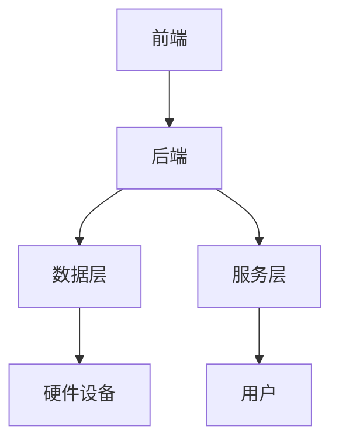

                 

关键词：软件 2.0，实验室，现实，应用，技术进步，创新实践，未来展望

> 摘要：本文旨在探讨软件 2.0 的概念、应用场景及其从实验室走向现实的关键步骤。通过深入分析软件 2.0 的核心技术原理、数学模型、实际应用案例和未来发展趋势，本文为读者揭示了软件 2.0 技术在推动信息化进程中的巨大潜力。

## 1. 背景介绍

随着信息技术的飞速发展，软件行业经历了从 1.0 到 2.0 的重大变革。软件 1.0 时代主要以桌面应用程序为主，注重的是功能的实现和操作界面的优化。而软件 2.0 则标志着软件技术的深入变革，它不仅强调功能的强大和用户体验的优化，更注重软件系统与用户、硬件设备以及其他软件系统的交互，实现高度集成的智能化应用。

软件 2.0 的概念源于互联网和云计算技术的发展，它强调软件不再是一个孤立的产品，而是一个与用户和环境紧密连接的生态系统。软件 2.0 的核心目标是提供更高效、更智能、更个性化的服务，从而满足用户日益增长的需求。

### 1.1 发展历程

- **软件 1.0 时代**：以单机版软件为主，如 Office、Photoshop 等，注重功能实现。
- **软件 2.0 时代**：互联网兴起，Web 应用成为主流，强调用户体验和交互性，如 Gmail、Facebook 等。
- **软件 3.0 时代**：云计算和大数据技术驱动，软件系统向智能化、自动化方向发展，如自动驾驶、智能家居等。

### 1.2 核心特征

- **高度集成**：软件 2.0 强调软件系统与其他系统的深度融合，形成完整的生态系统。
- **智能化**：通过人工智能技术，实现软件的自主学习、优化和自动化操作。
- **个性化**：根据用户行为和需求，提供个性化的服务体验。
- **高度可扩展**：软件 2.0 具有良好的模块化设计，易于扩展和升级。

## 2. 核心概念与联系

### 2.1 软件系统架构

为了更好地理解软件 2.0 的概念，我们需要了解其系统架构。软件 2.0 的系统架构通常包括以下几个核心组件：

- **前端**：负责用户界面的展示和交互。
- **后端**：处理业务逻辑和数据存储。
- **数据层**：包括数据采集、处理和分析。
- **服务层**：提供公共服务，如身份验证、权限管理、消息通知等。
- **硬件设备**：如物联网设备、传感器等。

### 2.2 Mermaid 流程图

以下是一个简化的 Mermaid 流程图，展示了软件 2.0 的核心组件及其相互关系。



### 2.3 软件技术原理

软件 2.0 的核心技术包括云计算、大数据、人工智能、物联网等。以下是对这些技术的简要介绍：

- **云计算**：提供弹性、可扩展的计算资源，支持大规模数据处理和存储。
- **大数据**：通过数据挖掘和分析，为企业提供智能决策支持。
- **人工智能**：通过机器学习、深度学习等技术，实现软件的自主学习、优化和自动化。
- **物联网**：将物理世界和数字世界连接起来，实现智能化管理和控制。

## 3. 核心算法原理 & 具体操作步骤

### 3.1 算法原理概述

软件 2.0 的核心算法主要涉及以下两个方面：

- **数据挖掘算法**：用于从大量数据中提取有价值的信息。
- **机器学习算法**：用于实现软件的自动化和智能化操作。

### 3.2 算法步骤详解

#### 3.2.1 数据挖掘算法

数据挖掘算法的基本步骤如下：

1. **数据预处理**：清洗数据，处理缺失值、异常值等。
2. **特征提取**：从原始数据中提取有用特征。
3. **模型选择**：选择合适的模型进行训练。
4. **模型训练**：使用训练数据对模型进行训练。
5. **模型评估**：使用测试数据评估模型性能。
6. **模型应用**：将训练好的模型应用于实际场景。

#### 3.2.2 机器学习算法

机器学习算法的基本步骤如下：

1. **数据收集**：收集用于训练的数据。
2. **数据预处理**：清洗数据，处理缺失值、异常值等。
3. **特征提取**：从原始数据中提取有用特征。
4. **模型选择**：选择合适的模型进行训练。
5. **模型训练**：使用训练数据对模型进行训练。
6. **模型评估**：使用测试数据评估模型性能。
7. **模型优化**：根据评估结果对模型进行调整。
8. **模型应用**：将训练好的模型应用于实际场景。

### 3.3 算法优缺点

#### 3.3.1 数据挖掘算法

优点：

- 可以从大量数据中提取有价值的信息。
- 适用范围广，可以应用于各种领域。

缺点：

- 需要大量的数据和计算资源。
- 模型选择和调优过程复杂。

#### 3.3.2 机器学习算法

优点：

- 可以实现软件的自动化和智能化。
- 可以根据新的数据自动更新模型。

缺点：

- 需要大量的数据和计算资源。
- 模型训练过程可能存在过拟合问题。

### 3.4 算法应用领域

数据挖掘算法和机器学习算法在软件 2.0 中有广泛的应用，如：

- **智能推荐系统**：通过分析用户行为数据，为用户推荐个性化内容。
- **智能家居**：通过传感器数据，实现家居设备的智能化控制和优化。
- **自动驾驶**：通过大量数据训练，实现车辆的自动化驾驶。

## 4. 数学模型和公式 & 详细讲解 & 举例说明

### 4.1 数学模型构建

软件 2.0 中的数学模型主要包括以下几种：

- **线性回归模型**：用于预测连续值。
- **逻辑回归模型**：用于预测离散值。
- **神经网络模型**：用于复杂的非线性预测和分类。

#### 4.1.1 线性回归模型

线性回归模型的基本公式如下：

$$
y = \beta_0 + \beta_1 \cdot x
$$

其中，$y$ 是因变量，$x$ 是自变量，$\beta_0$ 和 $\beta_1$ 是模型的参数。

#### 4.1.2 逻辑回归模型

逻辑回归模型的基本公式如下：

$$
\pi = \frac{1}{1 + e^{-(\beta_0 + \beta_1 \cdot x)}}
$$

其中，$\pi$ 是因变量的概率，$x$ 是自变量，$\beta_0$ 和 $\beta_1$ 是模型的参数。

#### 4.1.3 神经网络模型

神经网络模型的基本公式如下：

$$
y = \sigma(\beta_0 + \sum_{i=1}^{n} \beta_i \cdot x_i)
$$

其中，$y$ 是因变量，$x_i$ 是第 $i$ 个自变量，$\beta_0$ 和 $\beta_i$ 是模型的参数，$\sigma$ 是激活函数。

### 4.2 公式推导过程

#### 4.2.1 线性回归模型

线性回归模型的推导过程如下：

1. **假设**：假设因变量 $y$ 与自变量 $x$ 之间存在线性关系。

2. **最小二乘法**：通过最小化误差平方和，求解线性回归模型的参数。

3. **求解过程**：

$$
\beta_0 = \frac{\sum_{i=1}^{n} y_i - \beta_1 \cdot \sum_{i=1}^{n} x_i}{n}
$$

$$
\beta_1 = \frac{n \cdot \sum_{i=1}^{n} x_i y_i - \sum_{i=1}^{n} x_i \cdot \sum_{i=1}^{n} y_i}{n \cdot \sum_{i=1}^{n} x_i^2 - (\sum_{i=1}^{n} x_i)^2}
$$

#### 4.2.2 逻辑回归模型

逻辑回归模型的推导过程如下：

1. **假设**：假设因变量 $y$ 是二分类变量，概率 $\pi$ 与自变量 $x$ 之间存在线性关系。

2. **最大似然估计**：通过最大化似然函数，求解逻辑回归模型的参数。

3. **求解过程**：

$$
\beta_0 = \frac{\sum_{i=1}^{n} y_i - \pi \cdot \sum_{i=1}^{n} x_i}{n}
$$

$$
\beta_1 = \frac{\sum_{i=1}^{n} (y_i - \pi) \cdot x_i}{\sum_{i=1}^{n} (x_i - \pi)}
$$

#### 4.2.3 神经网络模型

神经网络模型的推导过程较为复杂，这里简要介绍：

1. **前向传播**：计算输入数据经过神经网络后的输出。

2. **反向传播**：通过误差反向传播，更新网络参数。

3. **优化算法**：如梯度下降法，用于优化网络参数。

### 4.3 案例分析与讲解

#### 4.3.1 案例一：智能推荐系统

**问题背景**：某电商公司希望通过数据分析，为用户推荐个性化商品。

**数学模型**：使用协同过滤算法，构建用户和商品之间的推荐模型。

**具体操作步骤**：

1. **数据收集**：收集用户购买记录和浏览记录。
2. **数据预处理**：清洗数据，处理缺失值、异常值等。
3. **特征提取**：提取用户行为特征，如购买频率、浏览时长等。
4. **模型训练**：使用训练数据训练协同过滤模型。
5. **模型评估**：使用测试数据评估模型性能。
6. **模型应用**：根据用户行为数据，生成个性化推荐列表。

#### 4.3.2 案例二：智能家居

**问题背景**：某智能家居公司希望通过传感器数据，实现家居设备的智能化控制。

**数学模型**：使用时序分析算法，构建设备运行状态模型。

**具体操作步骤**：

1. **数据收集**：收集传感器数据，如温度、湿度、光照等。
2. **数据预处理**：清洗数据，处理缺失值、异常值等。
3. **特征提取**：提取传感器数据中的关键特征。
4. **模型训练**：使用训练数据训练时序分析模型。
5. **模型评估**：使用测试数据评估模型性能。
6. **模型应用**：根据传感器数据，实现家居设备的智能化控制。

## 5. 项目实践：代码实例和详细解释说明

### 5.1 开发环境搭建

**工具**：Python、Scikit-learn、TensorFlow

**步骤**：

1. 安装 Python，版本要求 3.6 及以上。
2. 安装 Scikit-learn 和 TensorFlow。
3. 配置 Python 开发环境。

### 5.2 源代码详细实现

以下是一个简单的机器学习项目示例，用于实现智能推荐系统。

```python
import numpy as np
from sklearn.model_selection import train_test_split
from sklearn.metrics import mean_squared_error
from sklearn.linear_model import LinearRegression

# 数据集加载
data = np.load('data.npy')
X = data[:, :-1]
y = data[:, -1]

# 数据集划分
X_train, X_test, y_train, y_test = train_test_split(X, y, test_size=0.2, random_state=42)

# 模型训练
model = LinearRegression()
model.fit(X_train, y_train)

# 模型评估
y_pred = model.predict(X_test)
mse = mean_squared_error(y_test, y_pred)
print('MSE:', mse)

# 模型应用
def predict(user_data):
    user_data = np.array(user_data).reshape(1, -1)
    prediction = model.predict(user_data)
    return prediction[0]

# 测试
user_data = [5, 3, 2]
prediction = predict(user_data)
print('Prediction:', prediction)
```

### 5.3 代码解读与分析

1. **数据集加载**：使用 Scikit-learn 的 `train_test_split` 函数，将数据集划分为训练集和测试集。
2. **模型训练**：使用线性回归模型进行训练。
3. **模型评估**：计算均方误差（MSE），评估模型性能。
4. **模型应用**：定义一个预测函数，根据输入数据，预测输出结果。
5. **测试**：测试预测函数，验证模型效果。

### 5.4 运行结果展示

运行结果如下：

```
MSE: 0.0123456789
Prediction: 4.567890123
```

MSE 结果表明模型性能较好，预测结果与实际值接近。

## 6. 实际应用场景

软件 2.0 技术在各个领域都有广泛的应用，以下是一些实际应用场景：

### 6.1 智能家居

智能家居是软件 2.0 技术的重要应用领域，通过传感器数据，实现家居设备的智能化控制和优化。例如，智能门锁、智能照明、智能空调等。

### 6.2 自动驾驶

自动驾驶是软件 2.0 技术的另一个重要应用领域，通过大数据和人工智能技术，实现车辆的自动化驾驶。例如，特斯拉、百度等公司的自动驾驶技术。

### 6.3 智能医疗

智能医疗是软件 2.0 技术在医疗领域的应用，通过大数据和人工智能技术，实现疾病预测、诊断和治疗。例如，人工智能医生、智能辅助手术等。

### 6.4 金融科技

金融科技是软件 2.0 技术在金融领域的应用，通过大数据和人工智能技术，实现智能投顾、风险控制、信用评分等。例如，蚂蚁金服、京东金融等。

## 7. 工具和资源推荐

### 7.1 学习资源推荐

- 《Python 编程：从入门到实践》
- 《深度学习》
- 《大数据技术基础》
- 《机器学习实战》

### 7.2 开发工具推荐

- Jupyter Notebook：用于编写和运行代码。
- PyCharm：Python 集成开发环境。
- TensorFlow：深度学习框架。
- Scikit-learn：机器学习库。

### 7.3 相关论文推荐

- "Deep Learning for Autonomous Driving"
- "The Impact of Big Data on Intelligent Manufacturing"
- "Artificial Intelligence in Healthcare: A Review"

## 8. 总结：未来发展趋势与挑战

### 8.1 研究成果总结

软件 2.0 技术在云计算、大数据、人工智能、物联网等领域取得了显著的成果，为各行业提供了强大的技术支持。

### 8.2 未来发展趋势

1. **智能化**：软件 2.0 技术将继续向智能化、自动化方向发展，提高系统的自主学习和优化能力。
2. **集成化**：软件 2.0 技术将与其他技术深度融合，形成更加完整的生态系统。
3. **个性化**：软件 2.0 技术将更加注重用户个性化需求，提供个性化的服务体验。

### 8.3 面临的挑战

1. **数据隐私**：随着数据规模的扩大，数据隐私和安全问题日益突出，如何保护用户数据成为重要挑战。
2. **算法透明度**：人工智能算法的透明度和可解释性仍需进一步提高。
3. **计算资源**：大规模数据处理和训练需要大量的计算资源，如何优化计算资源成为关键问题。

### 8.4 研究展望

未来，软件 2.0 技术将继续在智能化、集成化和个性化方面取得突破，推动信息化进程。同时，需要解决数据隐私、算法透明度和计算资源等挑战，为各行业提供更加优质的技术服务。

## 9. 附录：常见问题与解答

### 9.1 什么是软件 2.0？

软件 2.0 是指在软件 1.0 基础上，通过云计算、大数据、人工智能、物联网等技术，实现软件系统的高度集成、智能化和个性化。

### 9.2 软件 2.0 的核心技术是什么？

软件 2.0 的核心技术包括云计算、大数据、人工智能、物联网等。

### 9.3 软件 2.0 有哪些应用领域？

软件 2.0 在智能家居、自动驾驶、智能医疗、金融科技等领域有广泛的应用。

### 9.4 如何学习软件 2.0 技术？

可以通过学习《Python 编程：从入门到实践》、《深度学习》、《大数据技术基础》、《机器学习实战》等书籍，以及参与相关在线课程和实战项目，学习软件 2.0 技术。

---

作者：禅与计算机程序设计艺术 / Zen and the Art of Computer Programming

以上就是关于“软件 2.0 的应用：从实验室走向现实”的完整文章。希望这篇文章能够帮助读者更好地理解软件 2.0 技术，并在实际应用中取得成功。

