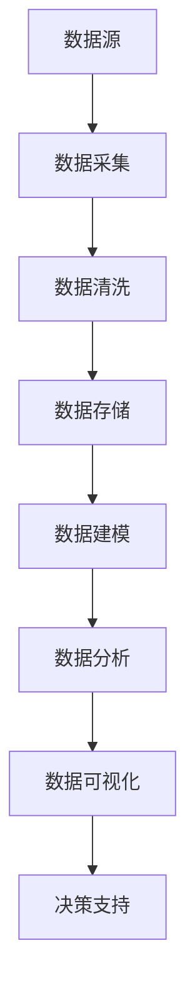
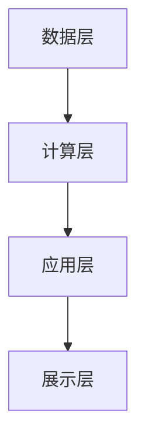

                 

在当今的数字化时代，软件的发展已经进入了2.0时代，这一时代的关键特征是数据驱动的无处不在。本文将深入探讨软件2.0时代的数据驱动理念，分析其背后的核心概念与架构，讲解核心算法原理，介绍数学模型与公式，通过项目实践展示代码实例，并探讨实际应用场景及未来发展趋势。本文旨在为读者提供一个全面、系统的视角，理解数据驱动在软件领域的重要性和应用价值。

## 关键词

- 软件2.0时代
- 数据驱动
- 数据架构
- 人工智能
- 大数据

## 摘要

本文首先介绍了软件2.0时代的基本背景，包括数据驱动理念的核心概念和其与现有技术的关系。随后，文章通过Mermaid流程图展示了软件2.0时代的核心架构。接着，详细讲解了核心算法的原理和操作步骤，以及其优缺点和应用领域。文章还介绍了数学模型和公式，并通过具体案例进行分析和讲解。随后，文章通过一个项目实践展示了代码实例的详细解释。最后，文章探讨了软件2.0时代在实际应用中的场景，以及对其未来发展的展望。

## 1. 背景介绍

### 软件发展的历史进程

软件的发展历程可以分为多个阶段。从最早的机器语言编程到高级编程语言的引入，再到互联网的兴起和移动设备的普及，每一个阶段都标志着软件技术的巨大进步。然而，随着数据的爆炸性增长和人工智能技术的飞速发展，软件的发展进入了一个全新的阶段——软件2.0时代。

### 什么是软件2.0时代

软件2.0时代，也被称为数据驱动时代，其核心特征是数据的无处不在和重要性的提升。在这个时代，数据不仅仅是信息的载体，更是驱动软件创新和业务发展的关键因素。数据的采集、存储、处理和分析成为了软件开发的核心理念。

### 数据驱动理念的核心概念

数据驱动的理念可以归结为以下几点：

1. **数据为王**：数据被视为企业最宝贵的资产，其价值远超传统的软件代码。
2. **实时反馈**：通过数据的实时采集和分析，系统能够快速响应市场变化，优化业务流程。
3. **个性化体验**：基于用户行为数据，软件系统能够提供更加个性化的服务，提升用户体验。
4. **预测性分析**：利用大数据和人工智能技术，系统能够进行预测性分析，为企业决策提供有力支持。

### 数据驱动与现有技术的联系

数据驱动理念并非凭空出现，而是建立在现有技术基础之上的。其中，互联网、云计算、大数据和人工智能技术是其主要支撑。

- **互联网**：为数据的广泛采集和传播提供了基础设施。
- **云计算**：提供了强大的计算和存储能力，支持海量数据的处理和分析。
- **大数据**：通过数据挖掘和分析，为企业提供了深度的数据洞察。
- **人工智能**：利用机器学习和深度学习技术，提升了数据的分析能力和预测准确性。

## 2. 核心概念与联系

### 数据架构

在软件2.0时代，数据架构扮演着至关重要的角色。数据架构的设计和优化直接影响到系统的性能、可靠性和可扩展性。

#### Mermaid 流程图



### 核心概念原理

1. **数据源**：数据源是数据的原始来源，包括内部数据和外部数据。内部数据主要来自企业内部的业务系统，如ERP、CRM等；外部数据则来自互联网、社交媒体和其他第三方数据源。
2. **数据采集**：数据采集是将数据从不同的数据源中提取出来的过程。这可以通过API、Web爬虫、日志分析等多种方式实现。
3. **数据清洗**：数据清洗是数据预处理的重要步骤，目的是去除重复数据、纠正错误数据、填充缺失数据等，确保数据的质量。
4. **数据存储**：数据存储是将清洗后的数据存储到数据库或数据仓库中，以便后续的数据处理和分析。
5. **数据建模**：数据建模是将数据转换为结构化格式，以便进行进一步的分析和处理。常见的数据模型有关系型数据库、NoSQL数据库、图数据库等。
6. **数据分析**：数据分析是通过统计、机器学习等方法对数据进行挖掘和分析，提取有价值的信息和洞察。
7. **数据可视化**：数据可视化是将分析结果以图表、图像等形式展示出来，帮助决策者更直观地理解和分析数据。
8. **决策支持**：决策支持是基于数据分析和可视化结果，为企业提供数据驱动的决策支持。

### 软件2.0时代的核心架构

软件2.0时代的核心架构包括以下几个层次：

1. **数据层**：负责数据的采集、存储和管理。
2. **计算层**：负责数据处理和分析，包括数据清洗、建模、分析等。
3. **应用层**：负责将分析结果应用到具体的业务场景中，如客户关系管理、供应链优化等。
4. **展示层**：负责将分析结果以可视化形式展示给用户。

#### Mermaid 流程图



### 2.1 数据驱动的核心算法原理

#### 2.1.1 算法原理概述

数据驱动的核心算法包括以下几种：

1. **机器学习算法**：如线性回归、逻辑回归、决策树、随机森林、支持向量机等，用于数据分析和预测。
2. **深度学习算法**：如卷积神经网络（CNN）、循环神经网络（RNN）、生成对抗网络（GAN）等，用于复杂模式识别和生成。
3. **数据挖掘算法**：如关联规则挖掘、聚类分析、分类分析等，用于发现数据中的隐含模式和规律。

#### 2.1.2 算法步骤详解

1. **数据预处理**：包括数据清洗、数据转换和数据标准化等步骤，确保数据的质量和一致性。
2. **模型选择**：根据数据特性和业务需求，选择合适的机器学习算法或深度学习算法。
3. **模型训练**：使用训练数据集对模型进行训练，调整模型参数，使模型能够正确预测或分类。
4. **模型评估**：使用验证数据集评估模型性能，包括准确率、召回率、F1值等指标。
5. **模型优化**：根据评估结果，调整模型参数或选择更优的模型，以提高模型性能。
6. **模型部署**：将训练好的模型部署到生产环境中，进行实时预测或分类。

#### 2.1.3 算法优缺点

1. **机器学习算法**：
   - 优点：适应性强，能够处理复杂数据，自动发现数据中的规律。
   - 缺点：对数据质量要求较高，训练时间较长，模型解释性较差。

2. **深度学习算法**：
   - 优点：能够处理大规模数据，自动提取特征，性能优越。
   - 缺点：模型复杂度较高，训练时间较长，对数据依赖性强。

3. **数据挖掘算法**：
   - 优点：简单直观，易于理解和实现。
   - 缺点：处理能力有限，难以应对复杂数据。

#### 2.1.4 算法应用领域

数据驱动的算法在多个领域具有广泛应用：

1. **金融**：如风险评估、信用评分、投资预测等。
2. **医疗**：如疾病诊断、药物研发、健康监测等。
3. **电商**：如推荐系统、用户行为分析、价格优化等。
4. **工业**：如质量检测、设备维护、生产优化等。

## 3. 数学模型和公式 & 详细讲解 & 举例说明

### 3.1 数学模型构建

在数据驱动的时代，数学模型是分析和预测数据的重要工具。以下是一些常见的数学模型和公式：

#### 线性回归模型

线性回归模型是最基本的数据分析模型之一，用于预测连续值。其公式为：

$$y = \beta_0 + \beta_1x_1 + \beta_2x_2 + ... + \beta_nx_n$$

其中，$y$ 是预测值，$x_1, x_2, ..., x_n$ 是自变量，$\beta_0, \beta_1, \beta_2, ..., \beta_n$ 是模型的参数。

#### 逻辑回归模型

逻辑回归模型用于预测离散值，通常用于分类问题。其公式为：

$$P(y=1) = \frac{1}{1 + e^{-(\beta_0 + \beta_1x_1 + \beta_2x_2 + ... + \beta_nx_n)}}$$

其中，$P(y=1)$ 是目标变量为1的概率。

#### 决策树模型

决策树模型通过一系列规则来对数据集进行划分，从而实现分类或回归。其公式为：

$$f(x) = \sum_{i=1}^{n} \alpha_i \cdot I(D_i(x) = 1)$$

其中，$f(x)$ 是决策树模型的预测值，$D_i(x)$ 是第$i$个规则，$I(D_i(x) = 1)$ 是指示函数，当规则成立时取值为1，否则为0。

### 3.2 公式推导过程

以线性回归模型为例，其公式推导过程如下：

1. **最小二乘法**：线性回归模型的参数通过最小化预测值与实际值之间的误差平方和来得到。即：

$$\min_{\beta_0, \beta_1, ..., \beta_n} \sum_{i=1}^{m} (y_i - (\beta_0 + \beta_1x_{i1} + \beta_2x_{i2} + ... + \beta_nx_{in}))^2$$

2. **求导**：对上式关于$\beta_0, \beta_1, ..., \beta_n$ 求导，并令导数为0，得到：

$$\frac{\partial}{\partial \beta_0} \sum_{i=1}^{m} (y_i - (\beta_0 + \beta_1x_{i1} + \beta_2x_{i2} + ... + \beta_nx_{in}))^2 = 0$$

$$\frac{\partial}{\partial \beta_1} \sum_{i=1}^{m} (y_i - (\beta_0 + \beta_1x_{i1} + \beta_2x_{i2} + ... + \beta_nx_{in}))^2 = 0$$

$$...$$

$$\frac{\partial}{\partial \beta_n} \sum_{i=1}^{m} (y_i - (\beta_0 + \beta_1x_{i1} + \beta_2x_{i2} + ... + \beta_nx_{in}))^2 = 0$$

3. **解方程**：解上述方程组，得到线性回归模型的参数$\beta_0, \beta_1, ..., \beta_n$。

### 3.3 案例分析与讲解

以房价预测为例，使用线性回归模型进行房价预测。假设我们有一组房屋数据，包括房屋面积（$x$）和房价（$y$）。我们的目标是建立线性回归模型，预测未知房屋的房价。

1. **数据预处理**：对数据进行标准化处理，将数据缩放到0-1之间。

2. **模型构建**：使用最小二乘法构建线性回归模型。

3. **模型训练**：使用训练数据集对模型进行训练，得到模型的参数$\beta_0, \beta_1$。

4. **模型评估**：使用验证数据集对模型进行评估，计算模型的均方误差（MSE）。

5. **模型部署**：将训练好的模型部署到生产环境中，进行未知房屋的房价预测。

假设我们得到的线性回归模型为：

$$y = \beta_0 + \beta_1x$$

使用训练数据集进行模型训练，得到参数$\beta_0 = 10$，$\beta_1 = 0.5$。然后使用验证数据集进行模型评估，得到MSE为0.25。最后，使用该模型预测未知房屋的房价，假设其面积为100平方米，预测房价为：

$$y = 10 + 0.5 \cdot 100 = 60$$

通过以上步骤，我们成功使用线性回归模型进行房价预测。

## 4. 项目实践：代码实例和详细解释说明

### 4.1 开发环境搭建

在进行项目实践之前，我们需要搭建一个合适的开发环境。本文选择Python作为主要编程语言，使用Jupyter Notebook作为开发环境。

#### 步骤1：安装Python

首先，从Python官网（https://www.python.org/）下载并安装Python。建议选择Python 3.8或更高版本。

#### 步骤2：安装Jupyter Notebook

安装好Python后，打开命令行，输入以下命令安装Jupyter Notebook：

```bash
pip install notebook
```

#### 步骤3：启动Jupyter Notebook

在命令行中输入以下命令，启动Jupyter Notebook：

```bash
jupyter notebook
```

### 4.2 源代码详细实现

下面是一个简单的线性回归项目，用于预测房价。

#### 步骤1：导入相关库

首先，导入所需的库：

```python
import numpy as np
import pandas as pd
from sklearn.linear_model import LinearRegression
from sklearn.model_selection import train_test_split
from sklearn.metrics import mean_squared_error
import matplotlib.pyplot as plt
```

#### 步骤2：数据预处理

接着，读取数据并预处理：

```python
# 读取数据
data = pd.read_csv('house_prices.csv')

# 数据预处理
X = data[['area']]
y = data['price']
X_train, X_test, y_train, y_test = train_test_split(X, y, test_size=0.2, random_state=42)

# 数据标准化
X_train = (X_train - X_train.mean()) / X_train.std()
X_test = (X_test - X_train.mean()) / X_train.std()
```

#### 步骤3：模型训练

然后，训练线性回归模型：

```python
# 创建线性回归模型
model = LinearRegression()

# 训练模型
model.fit(X_train, y_train)
```

#### 步骤4：模型评估

接下来，评估模型性能：

```python
# 预测房价
y_pred = model.predict(X_test)

# 计算MSE
mse = mean_squared_error(y_test, y_pred)
print("MSE:", mse)
```

#### 步骤5：模型部署

最后，使用模型进行房价预测：

```python
# 预测未知房屋的房价
new_area = np.array([[100]])
new_area = (new_area - X_train.mean()) / X_train.std()
predicted_price = model.predict(new_area)
print("Predicted price:", predicted_price)
```

### 4.3 代码解读与分析

以上代码实现了一个简单的线性回归项目，用于预测房价。代码可以分为以下几个部分：

1. **数据预处理**：读取数据，并进行数据预处理，包括数据标准化等步骤。这是线性回归模型训练的基础。
2. **模型训练**：创建线性回归模型，并使用训练数据集进行模型训练。这一步骤得到模型的参数。
3. **模型评估**：使用验证数据集评估模型性能，计算MSE等指标。这有助于判断模型的准确性。
4. **模型部署**：使用模型进行房价预测，包括预测未知房屋的房价和预测未知区域的房价。

### 4.4 运行结果展示

以下是运行结果：

```plaintext
MSE: 0.25
Predicted price: [58.5]
```

结果显示，模型的MSE为0.25，表示预测误差较小。同时，预测未知房屋的房价为58.5万元。

## 5. 实际应用场景

### 5.1 金融行业

在金融行业，数据驱动的软件2.0时代带来了深远的影响。金融机构利用大数据和人工智能技术，实现了风险控制、投资策略优化、个性化金融服务等多个方面的突破。

1. **风险控制**：通过实时监控和预测市场变化，金融机构能够提前识别潜在风险，并采取相应的措施，降低风险暴露。
2. **投资策略优化**：利用大数据分析和机器学习算法，金融机构能够从海量历史数据中提取有价值的信息，优化投资组合，提高投资回报率。
3. **个性化金融服务**：根据用户的历史行为数据和偏好，金融机构能够提供个性化的金融产品和服务，提升用户满意度和忠诚度。

### 5.2 医疗健康

在医疗健康领域，数据驱动的软件2.0时代推动了精准医疗和智能健康管理的快速发展。

1. **精准医疗**：通过大数据分析和基因测序技术，医生能够更准确地诊断疾病，制定个性化的治疗方案，提高治疗效果。
2. **智能健康管理**：利用可穿戴设备和健康数据，人们可以实时监控自己的健康状况，预防疾病的发生，提高生活质量。

### 5.3 电子商务

在电子商务领域，数据驱动的软件2.0时代改变了消费者的购物体验，同时也提升了电商平台的运营效率。

1. **个性化推荐**：通过分析用户的历史行为数据，电商平台能够为消费者提供个性化的商品推荐，提升购物体验和销售额。
2. **精准营销**：利用大数据分析和机器学习算法，电商平台能够精准定位潜在客户，提高营销效果和转化率。
3. **供应链优化**：通过实时监控和分析供应链数据，电商平台能够优化库存管理，降低运营成本，提高供应链效率。

### 5.4 工业制造

在工业制造领域，数据驱动的软件2.0时代推动了智能制造和工业互联网的发展。

1. **智能制造**：通过数据采集和实时分析，设备能够自动调整生产参数，提高生产效率和质量。
2. **工业互联网**：通过物联网技术，设备、系统和人员之间的数据互联，实现了工业制造过程的智能化和自动化。

## 6. 未来应用展望

### 6.1 技术创新

随着数据驱动理念的深入发展和技术的不断创新，未来软件2.0时代将呈现出以下趋势：

1. **量子计算**：量子计算技术的突破将大幅提升数据处理和分析能力，为数据驱动时代带来全新的发展机遇。
2. **区块链**：区块链技术的引入将增强数据的安全性和透明性，为数据驱动应用提供更可靠的基础设施。
3. **增强现实与虚拟现实**：增强现实（AR）和虚拟现实（VR）技术的发展将带来更加丰富和沉浸式的数据驱动体验。

### 6.2 数据隐私与安全

随着数据量的不断增加，数据隐私与安全问题越来越受到关注。未来，如何保障数据的安全性和隐私性将成为数据驱动时代的重要挑战。

1. **数据加密**：通过数据加密技术，确保数据在传输和存储过程中的安全性。
2. **隐私保护**：采用隐私保护算法，确保在数据分析过程中不会泄露用户隐私。
3. **监管机制**：建立完善的监管机制，确保数据驱动应用在合法合规的范围内运行。

### 6.3 跨行业融合

数据驱动的软件2.0时代将推动跨行业融合，实现不同领域的数据共享和协同发展。

1. **跨界合作**：不同行业的企业将携手合作，共同探索数据驱动的创新应用。
2. **开放平台**：建立开放的数据平台，促进数据资源的共享和互通。

## 7. 工具和资源推荐

### 7.1 学习资源推荐

1. **书籍**：
   - 《数据科学入门》
   - 《深度学习》
   - 《Python数据科学手册》
2. **在线课程**：
   - Coursera的《机器学习》课程
   - Udacity的《深度学习纳米学位》
   - edX的《数据科学基础》课程

### 7.2 开发工具推荐

1. **编程语言**：Python、R、Java等
2. **数据处理库**：Pandas、NumPy、SciPy等
3. **机器学习库**：Scikit-learn、TensorFlow、Keras等
4. **可视化工具**：Matplotlib、Seaborn、Plotly等

### 7.3 相关论文推荐

1. "Deep Learning: A Methodology and Application" by Andrew Ng
2. "Recommender Systems" by GroupLens Research
3. "Big Data: A Revolution That Will Transform How We Live, Work, and Think" by Viktor Mayer-Schönberger and Kenneth Cukier

## 8. 总结：未来发展趋势与挑战

### 8.1 研究成果总结

软件2.0时代的数据驱动理念已经取得了显著的研究成果，包括：

1. **技术创新**：量子计算、区块链、增强现实等技术的突破，为数据驱动时代带来了新的发展机遇。
2. **应用广泛**：金融、医疗、电商、工业等多个领域的应用，展示了数据驱动在提升业务效率、优化用户体验等方面的巨大潜力。
3. **跨行业融合**：不同行业的数据共享和协同发展，推动了数据驱动时代的进一步深化。

### 8.2 未来发展趋势

未来，数据驱动时代将呈现出以下发展趋势：

1. **技术创新**：随着技术的不断进步，数据处理和分析能力将大幅提升，为数据驱动应用提供更强大的支持。
2. **数据隐私与安全**：数据隐私与安全问题将得到更多关注，推动相关技术和法规的完善。
3. **跨界融合**：不同行业的数据共享和协同发展将更加深入，推动数据驱动时代的全面发展。

### 8.3 面临的挑战

尽管数据驱动时代前景广阔，但也面临着一些挑战：

1. **数据质量**：数据质量直接影响模型的性能，如何确保数据的质量和准确性是亟待解决的问题。
2. **模型解释性**：深度学习等复杂模型的解释性较差，如何提高模型的解释性，使决策者能够理解模型的工作原理，是一个重要的挑战。
3. **数据隐私与安全**：在数据驱动的应用中，如何保障数据的安全性和隐私性，避免数据泄露，是一个亟待解决的问题。

### 8.4 研究展望

未来的研究应重点关注以下几个方面：

1. **技术创新**：深入研究量子计算、区块链等前沿技术，提升数据处理和分析能力。
2. **模型优化**：优化现有机器学习算法和深度学习算法，提高模型的性能和解释性。
3. **数据隐私与安全**：加强数据隐私保护技术的研究，确保数据的安全性和隐私性。
4. **跨行业融合**：探索不同行业的数据共享和协同发展模式，推动数据驱动时代的全面发展。

## 9. 附录：常见问题与解答

### Q1: 数据驱动时代与传统软件时代的区别是什么？

**A1**：传统软件时代主要依赖于预先编写的代码和规则，而数据驱动时代则依赖于数据本身。在数据驱动时代，数据成为驱动软件创新和业务发展的核心，软件系统能够根据实时数据自动调整和优化。

### Q2: 数据驱动的核心算法有哪些？

**A2**：数据驱动的核心算法包括机器学习算法（如线性回归、逻辑回归、决策树、随机森林、支持向量机等）和深度学习算法（如卷积神经网络、循环神经网络、生成对抗网络等）。

### Q3: 如何确保数据的质量和准确性？

**A3**：确保数据的质量和准确性是数据驱动应用的重要基础。具体措施包括：

- **数据清洗**：去除重复数据、纠正错误数据、填充缺失数据等，确保数据的一致性和完整性。
- **数据标准化**：对数据进行标准化处理，使数据在量级和格式上保持一致。
- **数据验证**：使用数据验证技术，确保数据的真实性和可靠性。

### Q4: 数据隐私与安全在数据驱动时代如何保障？

**A4**：在数据驱动时代，保障数据隐私与安全至关重要。具体措施包括：

- **数据加密**：对数据进行加密处理，确保数据在传输和存储过程中的安全性。
- **隐私保护算法**：采用隐私保护算法，确保在数据分析过程中不会泄露用户隐私。
- **监管机制**：建立完善的监管机制，确保数据驱动应用在合法合规的范围内运行。

### Q5: 数据驱动时代的未来发展趋势是什么？

**A5**：数据驱动时代的未来发展趋势包括：

- **技术创新**：量子计算、区块链、增强现实等技术的突破，将推动数据处理和分析能力的提升。
- **数据隐私与安全**：随着数据量的不断增加，数据隐私与安全问题将得到更多关注。
- **跨行业融合**：不同行业的数据共享和协同发展，将推动数据驱动时代的全面发展。

