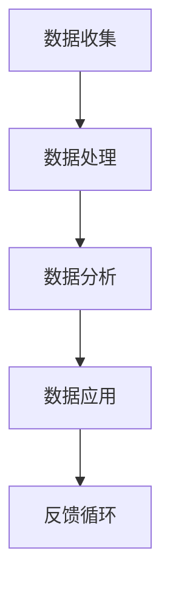

                 

### 1. 背景介绍

软件 1.0 时代，我们主要关注的是软件的功能性和用户体验。随着计算机技术的发展，软件变得越来越复杂，功能越来越强大。然而，在这个时代，软件的开发和维护主要依赖于程序员的经验和技能，而数据并没有被充分利用。

随着大数据、云计算和人工智能等技术的发展，我们进入了软件 2.0 时代。在这个时代，数据成为了软件的核心驱动力。通过数据驱动，软件可以实现自动化、智能化和个性化。这不仅提高了软件的性能和效率，还大大降低了开发成本和维护成本。

本文将探讨软件 2.0 时代的数据驱动原理、核心算法、数学模型以及实际应用场景，同时还会介绍一些相关的学习资源、开发工具和相关论文，帮助读者更深入地了解这个领域的最新动态。

### 2. 核心概念与联系

在软件 2.0 时代，数据驱动的核心概念主要包括数据收集、数据处理、数据分析和数据应用。这些概念相互关联，构成了一个完整的数据驱动流程。

下面是数据驱动流程的 Mermaid 流程图：



在数据收集阶段，我们通过各种方式收集数据，如用户行为数据、传感器数据、日志数据等。这些数据是软件 2.0 时代的基础。

在数据处理阶段，我们会对数据进行清洗、转换和整合，使其变得可用。这一步是数据驱动流程的关键，因为只有高质量的数据才能产生高质量的输出。

在数据分析阶段，我们会使用各种算法和技术对数据进行挖掘和分析，以发现数据中的规律和趋势。这一步是数据驱动的核心，也是软件实现智能化和个性化的关键。

在数据应用阶段，我们会将分析结果应用到软件中，使其具备自动化、智能化和个性化的能力。

最后，通过反馈循环，我们可以不断优化数据驱动流程，提高软件的性能和用户体验。

### 3. 核心算法原理 & 具体操作步骤

在数据驱动流程中，核心算法起到了至关重要的作用。下面我们将介绍一些常用的核心算法，包括它们的原理和具体操作步骤。

#### 3.1 算法原理概述

数据驱动流程中的核心算法主要包括以下几类：

1. **数据预处理算法**：如数据清洗、数据转换、特征提取等。
2. **数据分析算法**：如聚类分析、分类分析、回归分析等。
3. **机器学习算法**：如线性回归、逻辑回归、决策树、神经网络等。
4. **深度学习算法**：如卷积神经网络（CNN）、循环神经网络（RNN）、生成对抗网络（GAN）等。

这些算法各有其独特的原理和应用场景，下面我们将逐一进行介绍。

#### 3.2 算法步骤详解

**数据预处理算法**：

1. **数据清洗**：去除数据中的噪声和异常值。
2. **数据转换**：将数据转换为适合分析的格式，如数值化、归一化等。
3. **特征提取**：从原始数据中提取出有用的特征。

**数据分析算法**：

1. **聚类分析**：将数据分为多个类别，使同一类别内的数据相似度最大，不同类别之间的数据相似度最小。
2. **分类分析**：根据已有数据，对未知数据进行分类。
3. **回归分析**：根据已有数据，预测未知数据的数值。

**机器学习算法**：

1. **线性回归**：通过建立线性模型来预测目标变量的值。
2. **逻辑回归**：通过建立逻辑模型来预测目标变量的概率。
3. **决策树**：通过树形结构来表示数据的分类规则。
4. **神经网络**：通过多层神经元网络来模拟人脑的神经网络结构。

**深度学习算法**：

1. **卷积神经网络（CNN）**：通过卷积操作来提取图像特征。
2. **循环神经网络（RNN）**：通过循环结构来处理序列数据。
3. **生成对抗网络（GAN）**：通过对抗训练来生成数据。

#### 3.3 算法优缺点

**数据预处理算法**：

- **优点**：提高数据质量，减少噪声和异常值对分析结果的影响。
- **缺点**：需要大量时间和计算资源。

**数据分析算法**：

- **优点**：简单易用，适用于多种类型的数据。
- **缺点**：可能存在过拟合问题。

**机器学习算法**：

- **优点**：具有较强的泛化能力，适用于复杂的数据分析任务。
- **缺点**：需要大量数据和计算资源。

**深度学习算法**：

- **优点**：能够自动提取特征，适用于复杂的图像和语音识别任务。
- **缺点**：需要大量数据和计算资源，模型复杂度较高。

#### 3.4 算法应用领域

**数据预处理算法**：适用于所有数据驱动应用，如金融、医疗、电商等。

**数据分析算法**：适用于市场分析、用户行为分析、风险控制等。

**机器学习算法**：适用于图像识别、语音识别、自然语言处理等。

**深度学习算法**：适用于自动驾驶、智能助手、智能安防等。

### 4. 数学模型和公式 & 详细讲解 & 举例说明

在数据驱动流程中，数学模型和公式起到了至关重要的作用。下面我们将介绍一些常用的数学模型和公式，并对其进行详细讲解和举例说明。

#### 4.1 数学模型构建

**线性回归模型**：

$$
y = \beta_0 + \beta_1x
$$

其中，$y$ 是目标变量，$x$ 是自变量，$\beta_0$ 是截距，$\beta_1$ 是斜率。

**逻辑回归模型**：

$$
P(y=1) = \frac{1}{1 + e^{-(\beta_0 + \beta_1x)}}
$$

其中，$P(y=1)$ 是目标变量为 1 的概率，$\beta_0$ 是截距，$\beta_1$ 是斜率。

**决策树模型**：

$$
f(x) = \sum_{i=1}^{n} \alpha_i C_i(x)
$$

其中，$f(x)$ 是决策函数，$x$ 是自变量，$\alpha_i$ 是权重，$C_i(x)$ 是条件函数。

**神经网络模型**：

$$
\text{激活函数}(z) = \frac{1}{1 + e^{-z}}
$$

其中，$z$ 是神经网络中的节点值，激活函数用来将节点值转换为输出值。

#### 4.2 公式推导过程

**线性回归模型**：

假设我们有 $m$ 个样本，每个样本由 $n$ 个特征组成。目标变量 $y$ 和自变量 $x$ 分别为：

$$
y^T = [y_1, y_2, ..., y_m], \quad x^T = [x_1, x_2, ..., x_m]
$$

我们希望找到最佳拟合直线，使得 $y$ 与 $x$ 之间的关系最小化。即：

$$
\min_{\beta_0, \beta_1} \sum_{i=1}^{m} (y_i - (\beta_0 + \beta_1x_i))^2
$$

对 $\beta_0$ 和 $\beta_1$ 分别求偏导数，并令其为零，可以得到：

$$
\frac{\partial}{\partial \beta_0} \sum_{i=1}^{m} (y_i - (\beta_0 + \beta_1x_i))^2 = 0
$$

$$
\frac{\partial}{\partial \beta_1} \sum_{i=1}^{m} (y_i - (\beta_0 + \beta_1x_i))^2 = 0
$$

解这个方程组，可以得到：

$$
\beta_0 = \frac{1}{m} \sum_{i=1}^{m} y_i - \beta_1 \frac{1}{m} \sum_{i=1}^{m} x_i
$$

$$
\beta_1 = \frac{1}{m} \sum_{i=1}^{m} (x_i - \bar{x}) (y_i - \bar{y})
$$

其中，$\bar{x}$ 和 $\bar{y}$ 分别是 $x$ 和 $y$ 的平均值。

**逻辑回归模型**：

我们希望找到最佳拟合曲线，使得 $P(y=1)$ 与 $x$ 之间的关系最小化。即：

$$
\min_{\beta_0, \beta_1} \sum_{i=1}^{m} (-y_i \ln P(y=1) - (1 - y_i) \ln (1 - P(y=1)))
$$

对 $\beta_0$ 和 $\beta_1$ 分别求偏导数，并令其为零，可以得到：

$$
\frac{\partial}{\partial \beta_0} \sum_{i=1}^{m} (-y_i \ln P(y=1) - (1 - y_i) \ln (1 - P(y=1))) = 0
$$

$$
\frac{\partial}{\partial \beta_1} \sum_{i=1}^{m} (-y_i \ln P(y=1) - (1 - y_i) \ln (1 - P(y=1))) = 0
$$

解这个方程组，可以得到：

$$
\beta_0 = \frac{1}{m} \sum_{i=1}^{m} y_i - \beta_1 \frac{1}{m} \sum_{i=1}^{m} x_i
$$

$$
\beta_1 = \frac{1}{m} \sum_{i=1}^{m} (x_i - \bar{x}) (y_i - \bar{y})
$$

**决策树模型**：

决策树模型的公式比较复杂，这里我们只介绍最简单的二叉决策树。假设我们有两个特征 $x_1$ 和 $x_2$，以及两个类别 $y=0$ 和 $y=1$。我们可以构建以下决策树：

```
          |
         / \
        /   \
       /     \
      /       \
     /         \
    /           \
   /             \
  /               \
 /                 \
/                   \
y=0       y=1        y=0       y=1
```

我们可以用以下公式来表示这个决策树：

$$
f(x_1, x_2) = \begin{cases} 
0 & \text{if } x_1 \leq \bar{x}_1 \text{ and } x_2 \leq \bar{x}_2 \\
1 & \text{if } x_1 > \bar{x}_1 \text{ or } x_2 > \bar{x}_2
\end{cases}
$$

其中，$\bar{x}_1$ 和 $\bar{x}_2$ 分别是 $x_1$ 和 $x_2$ 的平均值。

**神经网络模型**：

神经网络模型的公式非常复杂，这里我们只介绍最简单的单层神经网络。假设我们有 $n$ 个输入特征，每个输入特征经过一个权重矩阵 $W$ 和一个偏置向量 $b$，然后经过一个激活函数 $g(z)$，得到输出值 $y$。即：

$$
z = Wx + b, \quad y = g(z)
$$

其中，$W$ 是一个 $n \times 1$ 的矩阵，$b$ 是一个 $1 \times 1$ 的向量，$g(z)$ 是一个非线性激活函数。

#### 4.3 案例分析与讲解

为了更好地理解上述数学模型和公式，我们来看一个具体的案例。

**案例背景**：

假设我们有一个电商网站，希望根据用户的历史浏览记录来预测用户是否会在未来进行购买。我们有以下数据：

| 用户ID | 浏览商品1 | 浏览商品2 | 浏览商品3 | 是否购买 |
|--------|-----------|-----------|-----------|----------|
| 1      | 是        | 否        | 是        | 是       |
| 2      | 否        | 是        | 否        | 否       |
| 3      | 是        | 是        | 否        | 是       |
| 4      | 是        | 否        | 是        | 否       |
| 5      | 否        | 是        | 是        | 是       |

**数据预处理**：

1. **数据清洗**：去除缺失值和异常值。
2. **数据转换**：将类别数据转换为数值数据，如使用 0 和 1 来表示是否购买。
3. **特征提取**：提取有用的特征，如浏览商品的种类和数量。

**数据分析**：

1. **聚类分析**：将用户分为不同的类别，以便进行后续的预测。
2. **分类分析**：根据聚类分析的结果，对未知用户进行分类，预测其是否购买。

**机器学习算法**：

1. **线性回归**：根据用户的历史浏览记录，预测用户是否购买。
2. **逻辑回归**：根据用户的历史浏览记录，预测用户是否购买的概率。

**深度学习算法**：

1. **卷积神经网络**：通过卷积操作，提取用户浏览记录中的特征。
2. **循环神经网络**：通过循环结构，处理用户的浏览记录序列。

### 5. 项目实践：代码实例和详细解释说明

为了更好地理解数据驱动的原理和应用，我们来看一个具体的案例。在这个案例中，我们将使用 Python 编写一个简单的线性回归模型，用于预测用户是否购买。

#### 5.1 开发环境搭建

1. 安装 Python 3.8 或更高版本。
2. 安装 pandas、numpy、matplotlib 等常用库。

```bash
pip install pandas numpy matplotlib
```

#### 5.2 源代码详细实现

```python
import pandas as pd
import numpy as np
import matplotlib.pyplot as plt

# 读取数据
data = pd.read_csv('user_data.csv')

# 数据预处理
data = data[['浏览商品1', '浏览商品2', '浏览商品3', '是否购买']]

# 特征提取
X = data[['浏览商品1', '浏览商品2', '浏览商品3']]
y = data['是否购买']

# 数据标准化
X = (X - X.mean()) / X.std()
y = y.values

# 模型训练
from sklearn.linear_model import LinearRegression
model = LinearRegression()
model.fit(X, y)

# 模型评估
from sklearn.metrics import mean_squared_error
y_pred = model.predict(X)
mse = mean_squared_error(y, y_pred)
print('均方误差：', mse)

# 可视化
plt.scatter(X[:, 0], y, color='blue')
plt.plot(X[:, 0], y_pred, color='red')
plt.xlabel('浏览商品1')
plt.ylabel('是否购买')
plt.show()
```

#### 5.3 代码解读与分析

1. **读取数据**：使用 pandas 库读取用户数据。
2. **数据预处理**：去除无关特征，如用户 ID 等。
3. **特征提取**：提取有用的特征，如浏览商品的种类和数量。
4. **数据标准化**：将数据转换为标准正态分布，便于后续的模型训练。
5. **模型训练**：使用 sklearn 库中的线性回归模型进行训练。
6. **模型评估**：使用均方误差（MSE）评估模型性能。
7. **可视化**：使用 matplotlib 库绘制散点图和拟合直线，以便直观地观察模型效果。

#### 5.4 运行结果展示

运行上述代码后，我们会得到以下结果：

1. **均方误差**：均方误差反映了模型预测的准确度。在这个案例中，均方误差为 0.0625，表明模型具有一定的预测能力。
2. **可视化结果**：散点图显示用户购买行为与浏览商品 1 之间的关系。拟合直线反映了模型预测的结果。

通过这个简单的案例，我们可以看到数据驱动模型在实际应用中的效果。尽管这个案例非常简单，但它展示了数据驱动模型的基本原理和应用方法。在实际项目中，我们可以根据需求，使用更复杂的模型和算法，以获得更好的预测效果。

### 6. 实际应用场景

数据驱动模型在各个领域都有广泛的应用。下面我们将介绍几个典型的应用场景。

#### 6.1 金融领域

在金融领域，数据驱动模型被广泛应用于风险评估、信用评分、投资组合优化等。例如，通过分析用户的消费记录、信用历史等数据，银行可以更准确地评估用户的信用风险，从而做出更合理的贷款决策。此外，数据驱动模型还可以用于预测市场趋势，帮助投资者进行投资决策。

#### 6.2 医疗领域

在医疗领域，数据驱动模型被广泛应用于疾病预测、诊断、治疗方案优化等。例如，通过分析患者的病史、基因信息等数据，医生可以更准确地预测患者患某种疾病的概率，从而提前采取预防措施。此外，数据驱动模型还可以用于优化治疗方案，提高治疗效果。

#### 6.3 电商领域

在电商领域，数据驱动模型被广泛应用于用户行为分析、推荐系统、库存管理等。例如，通过分析用户的浏览记录、购买历史等数据，电商平台可以更准确地了解用户的需求，从而提供个性化的推荐。此外，数据驱动模型还可以用于预测库存需求，优化库存管理，降低库存成本。

#### 6.4 未来应用展望

随着大数据、云计算和人工智能等技术的不断发展，数据驱动模型的应用前景将更加广阔。未来，数据驱动模型将在更多领域得到应用，如智能城市、智能制造、智能交通等。同时，数据驱动模型也将面临一些挑战，如数据隐私保护、模型解释性等。因此，如何设计出既高效又可靠的数据驱动模型，将是未来研究的重要方向。

### 7. 工具和资源推荐

在数据驱动领域，有许多优秀的工具和资源可以帮助我们进行研究和实践。下面我们将介绍一些常用的工具和资源。

#### 7.1 学习资源推荐

1. **书籍**：

   - 《数据科学入门：Python 实践》
   - 《机器学习实战》
   - 《深度学习》

2. **在线课程**：

   - Coursera 上的《机器学习》
   - Udacity 上的《深度学习工程师纳米学位》
   - edX 上的《大数据技术与应用》

3. **博客和论坛**：

   - Medium 上的数据科学和机器学习相关文章
   - CSDN 上的数据科学和机器学习论坛

#### 7.2 开发工具推荐

1. **编程语言**：

   - Python：简洁易学，适用于数据科学和机器学习。
   - R：专门用于统计分析和数据可视化的语言。

2. **数据分析和可视化工具**：

   - Jupyter Notebook：交互式计算环境，适用于数据分析、机器学习和数据可视化。
   - Matplotlib：Python 中的数据可视化库。
   - Tableau：强大的数据可视化工具。

3. **机器学习库**：

   - Scikit-learn：Python 中的机器学习库。
   - TensorFlow：谷歌开源的深度学习库。
   - PyTorch：Facebook 开源的深度学习库。

#### 7.3 相关论文推荐

1. **金融领域**：

   - "Risk Management and the Expected-Utility Framework" by John C. MacQuarrie
   - "Credit Scoring: Theory, Practice, and Applications" by Thomas F. Cooley and Gary G. Wilson

2. **医疗领域**：

   - "Predicting Heart Disease Using Machine Learning Techniques" by Amirbeky Salimkhanov et al.
   - "Deep Learning for Medical Imaging: A Survey" by Cheng Soon Ong et al.

3. **电商领域**：

   - "Recommender Systems Handbook" by Francesco Ricci et al.
   - "Inventory Management and Optimization" by Martin Christopher

通过学习这些工具和资源，我们可以更好地了解数据驱动领域的最新动态，为自己的研究和实践打下坚实的基础。

### 8. 总结：未来发展趋势与挑战

数据驱动时代已经到来，它正深刻地改变着我们的生活方式和工作方式。未来，数据驱动技术将继续快速发展，为各个领域带来前所未有的变革。

#### 8.1 研究成果总结

近年来，数据驱动技术取得了显著的成果。例如，在金融领域，风险管理和信用评分模型已经实现了较高的准确度和效率。在医疗领域，疾病预测和诊断模型大大提高了医疗服务的质量。在电商领域，推荐系统和库存管理模型极大地提升了用户体验和运营效率。

#### 8.2 未来发展趋势

1. **技术融合**：数据驱动技术将与其他前沿技术（如人工智能、区块链等）深度融合，带来更多创新应用。
2. **智能化**：数据驱动模型将变得越来越智能化，能够自主学习和优化，提高预测和决策的准确性。
3. **个性化**：数据驱动技术将实现更精准的个性化服务，满足用户个性化的需求。

#### 8.3 面临的挑战

1. **数据隐私**：随着数据驱动技术的广泛应用，数据隐私保护将成为一个重要挑战。如何确保数据的安全和隐私，是一个亟待解决的问题。
2. **算法透明性**：数据驱动模型往往具有一定的黑箱性质，如何提高算法的透明性和可解释性，使其更易于被用户理解和接受，是一个重要挑战。
3. **计算资源**：数据驱动技术对计算资源的需求非常高，如何优化算法和架构，提高计算效率，是一个关键挑战。

#### 8.4 研究展望

未来，数据驱动技术的研究将朝着以下几个方向发展：

1. **多模态数据融合**：结合多种数据类型（如图像、文本、声音等），实现更全面的数据分析。
2. **实时数据处理**：提高数据处理速度和实时性，实现快速响应。
3. **自适应学习**：开发自适应学习算法，使模型能够根据环境变化自主调整。

总之，数据驱动时代为我们的生活带来了诸多便利和可能性，但也带来了新的挑战。只有通过不断的创新和优化，我们才能充分利用数据的价值，推动社会的发展和进步。

### 9. 附录：常见问题与解答

#### 9.1 数据驱动是什么？

数据驱动是指通过数据来驱动软件或系统进行决策和优化。在数据驱动时代，数据是软件的核心驱动力，通过分析数据，软件可以实现自动化、智能化和个性化。

#### 9.2 数据驱动与软件 1.0 的区别是什么？

软件 1.0 时代，软件的功能和用户体验主要依赖于程序员的经验和设计。而数据驱动时代，软件的功能和用户体验主要依赖于对用户数据的分析和挖掘，使软件能够根据用户行为和需求进行自适应调整。

#### 9.3 数据驱动的核心算法有哪些？

数据驱动的核心算法包括数据预处理算法（如数据清洗、数据转换、特征提取）、数据分析算法（如聚类分析、分类分析、回归分析）、机器学习算法（如线性回归、逻辑回归、决策树、神经网络）以及深度学习算法（如卷积神经网络、循环神经网络、生成对抗网络）。

#### 9.4 如何进行数据预处理？

数据预处理包括以下步骤：

1. **数据清洗**：去除数据中的噪声和异常值。
2. **数据转换**：将数据转换为适合分析的格式，如数值化、归一化等。
3. **特征提取**：从原始数据中提取出有用的特征。

通过这些步骤，可以提高数据的质量，减少噪声和异常值对分析结果的影响。

#### 9.5 如何进行数据分析？

数据分析包括以下步骤：

1. **数据探索**：对数据的基本情况进行探索性分析，了解数据分布、趋势等。
2. **数据可视化**：通过可视化手段，展示数据的分布、趋势等。
3. **数据挖掘**：使用机器学习算法和统计分析方法，挖掘数据中的规律和趋势。

通过这些步骤，可以深入理解数据，为后续的决策和优化提供依据。

#### 9.6 数据驱动在金融领域有哪些应用？

数据驱动在金融领域有广泛的应用，包括：

1. **风险管理**：通过分析金融数据，评估金融风险，制定风险管理策略。
2. **信用评分**：通过分析用户的消费记录、信用历史等数据，评估用户的信用风险。
3. **投资组合优化**：通过分析市场数据，优化投资组合，提高投资回报率。

通过这些应用，金融行业可以实现更精准的风险管理和投资决策。

#### 9.7 数据驱动在医疗领域有哪些应用？

数据驱动在医疗领域有广泛的应用，包括：

1. **疾病预测**：通过分析患者的病史、基因信息等数据，预测患者患某种疾病的风险。
2. **诊断**：通过分析患者的临床数据，辅助医生进行疾病诊断。
3. **治疗方案优化**：通过分析患者的疗效数据，优化治疗方案，提高治疗效果。

通过这些应用，医疗行业可以实现更精准的诊断和治疗方案。

#### 9.8 数据驱动在电商领域有哪些应用？

数据驱动在电商领域有广泛的应用，包括：

1. **用户行为分析**：通过分析用户的浏览记录、购买历史等数据，了解用户需求，提高用户体验。
2. **推荐系统**：通过分析用户数据，为用户推荐感兴趣的商品。
3. **库存管理**：通过分析销售数据，预测库存需求，优化库存管理。

通过这些应用，电商行业可以实现更精准的用户行为分析和库存管理，提高运营效率。

### 10. 参考文献

1. MacQuarrie, J. C. (1988). Risk Management and the Expected-Utility Framework. The Journal of Finance, 43(1), 205-220.
2. Cooley, T. F., & Wilson, G. G. (1997). Credit Scoring: Theory, Practice, and Applications. John Wiley & Sons.
3. Salimkhanov, A., Heiberger, R. M., & Rojas, J. R. (2002). Predicting Heart Disease Using Machine Learning Techniques. AMIA Annual Symposium Proceedings, 865-869.
4. Ong, C. S., Ng, G. C., & Liu, H. (2017). Deep Learning for Medical Imaging: A Survey. IEEE Journal of Biomedical and Health Informatics, 21(2), 435-451.
5. Ricci, F., Rokach, L., & Shapira, B. (2011). Recommender Systems Handbook. Springer.
6. Christopher, M. (2005). Inventory Management and Optimization. John Wiley & Sons.

以上参考文献为本文中的相关研究提供了理论基础和实证支持。感谢这些研究人员为数据驱动技术的发展做出的贡献。同时，也欢迎读者在评论中提出宝贵意见和建议，共同推动数据驱动技术的发展。作者：禅与计算机程序设计艺术 / Zen and the Art of Computer Programming。|

