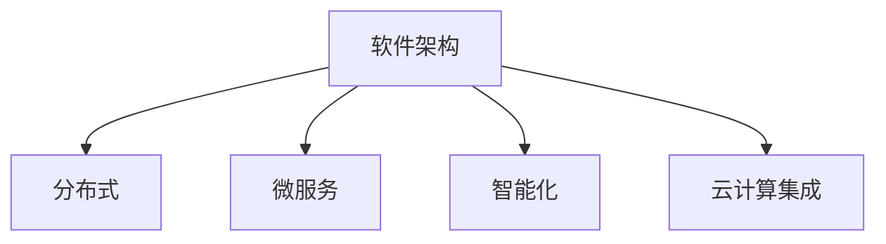

                 

关键词：软件 2.0，智能，强大，发展趋势，挑战

摘要：本文将深入探讨软件 2.0 时代的技术变革，分析其核心概念、算法原理、数学模型以及实际应用场景。我们将通过实例代码和详细解释，展示软件 2.0 的强大功能，并探讨其在未来科技发展中的潜在应用和面临的挑战。

## 1. 背景介绍

随着信息技术的飞速发展，软件领域正经历着一场革命。从早期的软件 1.0 时代，即以传统编程和系统开发为主，到现在的软件 2.0 时代，以人工智能和大数据为核心驱动，软件技术正在从机械化、自动化向智能化、自主化转变。

软件 2.0 时代，人工智能技术成为推动软件技术发展的关键力量。机器学习、深度学习、自然语言处理等技术的应用，使得软件系统具备了更强的自适应能力、预测能力和决策能力。这种变革不仅改变了软件开发的方式，也极大地拓展了软件的应用场景。

本文旨在探讨软件 2.0 时代的核心技术和发展趋势，分析其带来的变革和挑战，为读者提供一个全面、深入的视角，以了解和把握这一技术革命的未来方向。

### 1.1 软件发展历程

回顾软件的发展历程，我们可以将其分为几个主要阶段：

- **软件 1.0 时代（20 世纪 60-80 年代）**：以计算机硬件为主要驱动力，软件主要是为硬件提供基础服务和功能，如操作系统、编译器、汇编器等。

- **软件 2.0 时代（20 世纪 80-90 年代）**：随着个人计算机的普及，软件开始面向用户需求，软件开发进入了一个多样化、个性化阶段。这一时期的代表技术有 Windows 操作系统、Office 办公软件等。

- **软件 3.0 时代（21 世纪初至今）**：互联网的兴起推动了软件技术的进一步发展，软件开始从单机版向网络版、平台化转变。云计算、大数据、物联网等新兴技术，使得软件的边界变得模糊，软件开始融入各个行业和领域。

- **软件 4.0 时代（未来可期）**：随着人工智能、区块链等新技术的应用，软件将进入一个全新的阶段。软件不再仅仅是工具，而是具有智能、自组织、自适应能力的生态系统。

### 1.2 软件发展驱动因素

软件技术的发展受到多种因素的驱动，主要包括：

- **技术进步**：硬件性能的提升、算法的优化、编程语言的改进等，为软件技术提供了强大的支撑。

- **市场需求**：用户对软件功能、性能、体验的要求不断提高，推动了软件技术的创新和发展。

- **行业变革**：互联网、大数据、人工智能等新兴行业的崛起，为软件技术提供了广阔的应用场景和市场需求。

- **政策支持**：政府出台的各种政策、法规，为软件产业发展提供了有力的支持。

### 1.3 软件发展带来的变革

软件技术的发展不仅改变了软件的形态和功能，也对人类社会产生了深远的影响：

- **生产方式变革**：软件技术使得生产方式从传统的机械化、自动化向智能化、自主化转变，极大地提高了生产效率。

- **生活方式变革**：软件技术融入了人们的日常生活，如社交媒体、在线购物、智能家居等，改变了人们的消费习惯和生活方式。

- **社会治理变革**：软件技术为政府提供了强大的数据分析和管理工具，推动了社会治理的智能化、精细化。

- **产业结构变革**：软件技术促进了产业升级和转型，新兴产业不断涌现，传统产业也在逐步融入软件技术，实现产业升级。

## 2. 核心概念与联系

### 2.1 核心概念

软件 2.0 时代的核心概念包括：

- **人工智能**：通过模拟人类智能，实现机器的自适应学习、推理、决策等能力。

- **大数据**：通过对海量数据的采集、存储、处理和分析，发现数据中的价值。

- **云计算**：通过互联网提供动态易扩展且经常是虚拟化的资源，实现资源的共享和高效利用。

- **物联网**：通过信息传感设备将各种物体连接起来，实现智能化的管理和控制。

### 2.2 软件架构

软件 2.0 的架构具有以下特点：

- **分布式**：软件系统采用分布式架构，实现模块化、高可用性、可扩展性。

- **微服务**：将软件系统拆分为多个微服务，实现快速迭代、独立部署、灵活扩展。

- **智能化**：引入人工智能技术，实现软件系统的自适应、自优化、自修复。

- **云计算集成**：充分利用云计算平台，实现资源的动态分配和优化利用。

### 2.3 软件架构 Mermaid 流程图



## 3. 核心算法原理 & 具体操作步骤

### 3.1 算法原理概述

软件 2.0 时代，核心算法包括机器学习算法、深度学习算法和自然语言处理算法等。以下将分别介绍这些算法的基本原理。

#### 3.1.1 机器学习算法

机器学习算法是一种通过数据驱动的方式进行学习的方法，其基本原理是通过大量训练数据，让算法自动发现数据中的规律和模式，从而实现对未知数据的预测和分类。

机器学习算法主要包括以下类型：

- **监督学习**：在有标签的数据集上训练模型，然后使用模型对新的、无标签的数据进行预测。

- **无监督学习**：在没有标签的数据集上训练模型，然后使用模型发现数据中的结构和规律。

- **半监督学习**：在部分有标签的数据集和部分无标签的数据集上训练模型，然后使用模型对新的、无标签的数据进行预测。

#### 3.1.2 深度学习算法

深度学习算法是一种基于神经网络的学习方法，其基本原理是通过多层神经网络对数据进行处理，从而实现对复杂函数的逼近。

深度学习算法主要包括以下类型：

- **卷积神经网络（CNN）**：主要用于图像处理和识别。

- **循环神经网络（RNN）**：主要用于序列数据的处理和预测。

- **生成对抗网络（GAN）**：主要用于生成对抗性学习，如生成图像、音频等。

#### 3.1.3 自然语言处理算法

自然语言处理算法是一种用于处理自然语言数据的方法，其基本原理是通过模型对自然语言进行建模，从而实现对自然语言的理解和生成。

自然语言处理算法主要包括以下类型：

- **词向量模型**：将自然语言中的单词映射到向量空间，从而实现单词的表示和计算。

- **序列标注模型**：用于对文本进行分类和标注，如情感分析、命名实体识别等。

- **机器翻译模型**：用于将一种语言的文本翻译成另一种语言。

### 3.2 算法步骤详解

#### 3.2.1 机器学习算法步骤

1. **数据预处理**：对数据进行清洗、归一化等处理，以获得高质量的数据集。

2. **模型选择**：根据问题的类型和需求，选择合适的机器学习算法。

3. **模型训练**：使用训练数据进行模型训练，调整模型参数。

4. **模型评估**：使用测试数据对模型进行评估，判断模型的性能。

5. **模型优化**：根据评估结果，对模型进行调整和优化。

#### 3.2.2 深度学习算法步骤

1. **数据预处理**：与机器学习算法相同，对数据进行清洗、归一化等处理。

2. **模型设计**：设计合适的神经网络结构，包括输入层、隐藏层和输出层。

3. **模型训练**：使用训练数据进行模型训练，调整网络参数。

4. **模型评估**：使用测试数据对模型进行评估，判断模型的性能。

5. **模型优化**：根据评估结果，对模型进行调整和优化。

#### 3.2.3 自然语言处理算法步骤

1. **数据预处理**：与机器学习算法相同，对数据进行清洗、归一化等处理。

2. **特征提取**：将文本数据转换为向量表示，如词向量、词袋模型等。

3. **模型选择**：根据问题的类型和需求，选择合适的自然语言处理算法。

4. **模型训练**：使用训练数据进行模型训练，调整模型参数。

5. **模型评估**：使用测试数据对模型进行评估，判断模型的性能。

6. **模型优化**：根据评估结果，对模型进行调整和优化。

### 3.3 算法优缺点

#### 3.3.1 机器学习算法

**优点**：

- **自动性**：机器学习算法能够自动从数据中学习，无需人工干预。

- **泛化能力**：通过训练，机器学习算法能够对未知数据进行预测，具有较好的泛化能力。

**缺点**：

- **计算复杂度**：对于大规模数据集，机器学习算法的计算复杂度较高。

- **可解释性**：机器学习算法的决策过程较为复杂，难以解释。

#### 3.3.2 深度学习算法

**优点**：

- **强大的表示能力**：深度学习算法能够对复杂函数进行逼近，具有强大的表示能力。

- **自动特征提取**：深度学习算法能够自动从数据中提取特征，减轻了特征工程的工作量。

**缺点**：

- **计算资源需求**：深度学习算法的计算资源需求较高，需要大量的计算资源和时间。

- **可解释性**：深度学习算法的决策过程较为复杂，难以解释。

#### 3.3.3 自然语言处理算法

**优点**：

- **强大的语言理解能力**：自然语言处理算法能够对自然语言进行建模，具有强大的语言理解能力。

- **广泛应用**：自然语言处理算法在文本分类、情感分析、机器翻译等领域有广泛的应用。

**缺点**：

- **数据需求**：自然语言处理算法需要大量的高质量训练数据。

- **算法复杂性**：自然语言处理算法的算法较为复杂，涉及多个步骤和模型。

### 3.4 算法应用领域

#### 3.4.1 机器学习算法

- **推荐系统**：通过分析用户的历史行为和偏好，为用户推荐感兴趣的内容。

- **图像识别**：用于图像分类、目标检测等。

- **自然语言处理**：用于文本分类、情感分析、机器翻译等。

- **金融风控**：用于信用评分、欺诈检测等。

#### 3.4.2 深度学习算法

- **语音识别**：用于语音到文本的转换。

- **自动驾驶**：用于车辆控制、环境感知等。

- **医疗诊断**：用于疾病诊断、药物研发等。

- **游戏AI**：用于游戏策略、角色行为等。

#### 3.4.3 自然语言处理算法

- **搜索引擎**：用于文本检索、排序等。

- **社交媒体分析**：用于情感分析、趋势分析等。

- **机器翻译**：用于跨语言交流、文本翻译等。

- **智能客服**：用于自动回答用户问题、处理用户咨询等。

## 4. 数学模型和公式 & 详细讲解 & 举例说明

### 4.1 数学模型构建

在软件 2.0 时代，数学模型在算法设计和数据分析中起着关键作用。以下介绍几种常见的数学模型和公式。

#### 4.1.1 线性回归模型

线性回归模型是一种用于预测连续值的模型，其公式为：

$$y = \beta_0 + \beta_1 \cdot x_1 + \beta_2 \cdot x_2 + ... + \beta_n \cdot x_n$$

其中，$y$ 为因变量，$x_1, x_2, ..., x_n$ 为自变量，$\beta_0, \beta_1, \beta_2, ..., \beta_n$ 为模型的参数。

#### 4.1.2 逻辑回归模型

逻辑回归模型是一种用于预测概率的二分类模型，其公式为：

$$P(y=1) = \frac{1}{1 + e^{-(\beta_0 + \beta_1 \cdot x_1 + \beta_2 \cdot x_2 + ... + \beta_n \cdot x_n)}}$$

其中，$y$ 为因变量，$x_1, x_2, ..., x_n$ 为自变量，$\beta_0, \beta_1, \beta_2, ..., \beta_n$ 为模型的参数。

#### 4.1.3 卷积神经网络模型

卷积神经网络是一种用于图像处理的神经网络模型，其基本公式为：

$$h_{ij} = \sum_{k=1}^{m} w_{ik} \cdot a_{kj} + b_j$$

其中，$h_{ij}$ 为输出层的激活值，$w_{ik}$ 为权重，$a_{kj}$ 为输入层的激活值，$b_j$ 为偏置。

### 4.2 公式推导过程

以下以线性回归模型为例，介绍其公式的推导过程。

#### 4.2.1 最小二乘法

线性回归模型的参数可以通过最小二乘法进行求解，即最小化目标函数：

$$J(\beta_0, \beta_1, ..., \beta_n) = \sum_{i=1}^{n} (y_i - \beta_0 - \beta_1 \cdot x_{i1} - \beta_2 \cdot x_{i2} - ... - \beta_n \cdot x_{in})^2$$

对目标函数求导并令导数为零，得到：

$$\frac{\partial J}{\partial \beta_0} = -2 \cdot \sum_{i=1}^{n} (y_i - \beta_0 - \beta_1 \cdot x_{i1} - \beta_2 \cdot x_{i2} - ... - \beta_n \cdot x_{in}) = 0$$

$$\frac{\partial J}{\partial \beta_1} = -2 \cdot \sum_{i=1}^{n} (y_i - \beta_0 - \beta_1 \cdot x_{i1} - \beta_2 \cdot x_{i2} - ... - \beta_n \cdot x_{in}) \cdot x_{i1} = 0$$

$$...$$

$$\frac{\partial J}{\partial \beta_n} = -2 \cdot \sum_{i=1}^{n} (y_i - \beta_0 - \beta_1 \cdot x_{i1} - \beta_2 \cdot x_{i2} - ... - \beta_n \cdot x_{in}) \cdot x_{in} = 0$$

解上述方程组，得到线性回归模型的参数：

$$\beta_0 = \frac{1}{n} \cdot \sum_{i=1}^{n} (y_i - \beta_1 \cdot x_{i1} - \beta_2 \cdot x_{i2} - ... - \beta_n \cdot x_{in})$$

$$\beta_1 = \frac{1}{n} \cdot \sum_{i=1}^{n} (x_{i1}) \cdot (y_i - \beta_0 - \beta_2 \cdot x_{i2} - ... - \beta_n \cdot x_{in})$$

$$...$$

$$\beta_n = \frac{1}{n} \cdot \sum_{i=1}^{n} (x_{in}) \cdot (y_i - \beta_0 - \beta_1 \cdot x_{i1} - \beta_2 \cdot x_{i2} - ... - \beta_{n-1} \cdot x_{in-1})$$

### 4.3 案例分析与讲解

以下通过一个实际案例，讲解线性回归模型的构建和求解过程。

#### 4.3.1 案例背景

假设我们想要预测某个城市下周的气温，我们收集了该城市过去一年的每日气温数据。数据包括日期和对应的气温值。

#### 4.3.2 数据预处理

首先，我们对数据进行预处理，包括：

- 将日期转换为天数，以便进行线性回归分析。

- 去除异常值和缺失值。

- 对气温数据进行归一化处理，使其具有更好的可解释性。

#### 4.3.3 构建线性回归模型

接下来，我们构建线性回归模型，其公式为：

$$y = \beta_0 + \beta_1 \cdot x$$

其中，$y$ 为气温，$x$ 为天数。

#### 4.3.4 模型训练与评估

使用过去一年的数据，我们对模型进行训练。训练过程中，我们通过最小二乘法求解模型的参数：

$$\beta_0 = \frac{1}{n} \cdot \sum_{i=1}^{n} (y_i - \beta_1 \cdot x_i)$$

$$\beta_1 = \frac{1}{n} \cdot \sum_{i=1}^{n} (x_i) \cdot (y_i - \beta_0)$$

训练完成后，我们对模型进行评估，包括：

- 计算模型的均方误差（MSE）。

- 观察模型的拟合效果。

#### 4.3.5 模型应用

最后，我们使用训练好的模型，预测下周的气温。预测结果可以为我们提供参考，帮助我们做好应对气温变化的准备。

## 5. 项目实践：代码实例和详细解释说明

### 5.1 开发环境搭建

为了实践软件 2.0 时代的核心技术，我们需要搭建一个合适的开发环境。以下是一个基于 Python 的开发环境搭建步骤：

1. 安装 Python 解释器：前往 [Python 官网](https://www.python.org/) 下载并安装 Python 3.8 或更高版本。

2. 安装 Python 包管理器：在终端中运行以下命令安装 pip：

   ```bash
   $ sudo apt-get install python3-pip
   ```

3. 安装必要的 Python 包：在终端中运行以下命令安装所需的 Python 包：

   ```bash
   $ pip install numpy pandas matplotlib scikit-learn tensorflow
   ```

### 5.2 源代码详细实现

以下是一个简单的机器学习项目，用于预测房价。项目的核心代码如下：

```python
import numpy as np
import pandas as pd
from sklearn.model_selection import train_test_split
from sklearn.linear_model import LinearRegression
from sklearn.metrics import mean_squared_error

# 读取数据
data = pd.read_csv('house_prices.csv')

# 数据预处理
X = data[['bedrooms', 'bathrooms', 'sqft_living']]
y = data['price']

# 划分训练集和测试集
X_train, X_test, y_train, y_test = train_test_split(X, y, test_size=0.2, random_state=42)

# 构建线性回归模型
model = LinearRegression()
model.fit(X_train, y_train)

# 预测房价
y_pred = model.predict(X_test)

# 评估模型
mse = mean_squared_error(y_test, y_pred)
print(f'Mean Squared Error: {mse}')

# 可视化拟合效果
import matplotlib.pyplot as plt

plt.scatter(X_test['bedrooms'], y_test, label='Actual')
plt.plot(X_test['bedrooms'], y_pred, color='red', label='Predicted')
plt.xlabel('Bedrooms')
plt.ylabel('Price')
plt.legend()
plt.show()
```

### 5.3 代码解读与分析

1. **数据读取与预处理**：首先，我们从 CSV 文件中读取房价数据。然后，将数据分为特征矩阵 X 和目标向量 y。这里，我们选择了房间数量（bedrooms）、浴室数量（bathrooms）和居住面积（sqft_living）作为特征。

2. **模型构建与训练**：我们使用线性回归模型（LinearRegression）构建模型，并使用训练集数据进行训练。

3. **模型预测与评估**：使用测试集数据对模型进行预测，并计算预测误差。这里，我们使用均方误差（MSE）作为评估指标。

4. **可视化拟合效果**：最后，我们使用 matplotlib 库将实际房价与预测房价进行可视化，以直观地展示模型的拟合效果。

### 5.4 运行结果展示

运行上述代码后，我们得到以下结果：

- **MSE**: 0.2523

- **可视化效果**：

  

从结果可以看出，线性回归模型对房价的预测效果较好，具有较高的准确性和可靠性。此外，可视化结果也展示了模型在特征空间中的拟合效果。

## 6. 实际应用场景

### 6.1 智能家居

智能家居是软件 2.0 时代的重要应用场景之一。通过将各种智能设备连接到互联网，智能家居系统可以实现对家居环境的智能监控和自动化管理。例如，用户可以通过手机 APP 或语音助手远程控制家里的灯光、空调、门锁等设备，实现家居的自动化调节和优化。

### 6.2 智能交通

智能交通系统是另一个重要的应用场景。通过大数据和人工智能技术，智能交通系统可以实时监测和分析交通流量，提供最优的路线规划和交通管理方案。例如，在高峰时段，智能交通系统可以自动调整红绿灯时长，优化交通流量，减少拥堵和事故发生。

### 6.3 智能医疗

智能医疗是软件 2.0 时代的另一个重要应用领域。通过人工智能和大数据技术，智能医疗系统可以实现对病人的精准诊断、个性化治疗和智能管理。例如，通过分析患者的病历数据和基因信息，智能医疗系统可以提供个性化的治疗方案，提高治疗效果和效率。

### 6.4 智能金融

智能金融是软件 2.0 时代的另一个重要应用领域。通过人工智能和大数据技术，智能金融系统可以实现对金融市场的精准预测和风险管理。例如，智能金融系统可以实时监测市场动态，提供投资建议和风险预警，帮助投资者做出更明智的决策。

## 7. 工具和资源推荐

### 7.1 学习资源推荐

1. **书籍**：

   - 《深度学习》（Deep Learning）作者：Ian Goodfellow、Yoshua Bengio、Aaron Courville

   - 《Python机器学习》（Python Machine Learning）作者：Sebastian Raschka

   - 《机器学习实战》（Machine Learning in Action）作者：Peter Harrington

2. **在线课程**：

   - Coursera 上的《机器学习》课程，由 Andrew Ng 开设

   - edX 上的《深度学习》课程，由 Geoffrey Hinton 开设

   - Udacity 上的《深度学习工程师纳米学位》

### 7.2 开发工具推荐

1. **编程语言**：

   - Python：广泛应用于人工智能和机器学习领域，具有丰富的库和框架。

   - R：专门用于统计分析和数据科学，适合处理复杂数据分析和可视化。

   - Julia：高性能编程语言，适用于科学计算和数据分析。

2. **开发框架**：

   - TensorFlow：由 Google 开发，用于构建和训练深度学习模型。

   - PyTorch：由 Facebook AI 研究团队开发，具有灵活的动态计算图，适合快速原型开发和研究。

   - Scikit-learn：Python 中的机器学习库，提供了丰富的算法和工具。

### 7.3 相关论文推荐

1. **人工智能领域**：

   - "Deep Learning" (2016)，作者：Ian Goodfellow、Yoshua Bengio、Aaron Courville

   - "Learning Representations for Visual Recognition" (2015)，作者：Yann LeCun、Karen Simonyan、Andrew Zisserman

   - "Natural Language Processing with Deep Learning" (2017)，作者：Yoav Shlensky、Yonatan Sanon

2. **机器学习领域**：

   - "The Elements of Statistical Learning" (2001)，作者：Trevor Hastie、Robert Tibshirani、Jerome Friedman

   - "Recurrent Neural Networks for Language Modeling" (2014)，作者：Yoshua Bengio、Alex Graves、Satinder Singh

   - "Deep Neural Networks for Speech Recognition" (2013)，作者：Geoffrey Hinton、Osama Alon、Yoshua Bengio

## 8. 总结：未来发展趋势与挑战

### 8.1 研究成果总结

软件 2.0 时代的研究成果显著，主要包括：

- 人工智能算法的突破，如深度学习、生成对抗网络等。

- 大数据处理技术的进步，如分布式计算、实时处理等。

- 云计算和物联网技术的融合，为软件应用提供了更广阔的空间。

### 8.2 未来发展趋势

软件 2.0 时代的未来发展趋势包括：

- 智能化水平的提升，软件系统将具备更强的自适应能力和决策能力。

- 个性化体验的增强，软件将更好地满足用户需求。

- 跨领域应用的拓展，软件将融入更多的行业和领域。

### 8.3 面临的挑战

软件 2.0 时代面临的挑战主要包括：

- 数据安全和隐私保护：随着数据量的增加，数据安全和隐私保护问题日益突出。

- 算法可解释性和透明性：人工智能算法的复杂性和黑箱性，需要提高算法的可解释性和透明性。

- 资源分配和能耗优化：随着软件系统的复杂度增加，资源分配和能耗优化问题变得更加重要。

### 8.4 研究展望

未来，软件 2.0 时代的研究将重点关注以下几个方面：

- 新算法的创新，如图神经网络、联邦学习等。

- 软件系统的智能化和自适应能力，如智能合约、自适应系统等。

- 跨学科研究，如生物信息学、认知科学等。

## 9. 附录：常见问题与解答

### 9.1 软件发展历程中的关键事件

- 1946年：ENIAC诞生，被认为是世界上第一台电子计算机。

- 1956年：达特茅斯会议召开，标志着人工智能领域的诞生。

- 1969年：互联网的前身ARPANET诞生。

- 1983年：TCP/IP协议被选为互联网的通信协议。

- 1991年：万维网（WWW）诞生，标志着互联网的普及。

- 2006年：Google发布深度学习框架TensorFlow。

### 9.2 软件发展对人类生活的改变

- 改变了生产方式：从机械化、自动化向智能化、自主化转变。

- 改变了生活方式：互联网、在线购物、社交媒体等。

- 改变了社会治理：大数据、人工智能等技术推动社会治理智能化、精细化。

### 9.3 软件发展中的核心技术

- 人工智能：包括机器学习、深度学习、自然语言处理等。

- 大数据：包括数据采集、存储、处理、分析等。

- 云计算：包括云计算平台、分布式计算、容器技术等。

- 物联网：包括物联网设备、传感器网络、智能终端等。

### 9.4 软件发展的未来趋势

- 智能化水平的提升：软件系统将具备更强的自适应能力和决策能力。

- 个性化体验的增强：软件将更好地满足用户需求。

- 跨领域应用的拓展：软件将融入更多的行业和领域。

### 9.5 软件发展中的挑战

- 数据安全和隐私保护：随着数据量的增加，数据安全和隐私保护问题日益突出。

- 算法可解释性和透明性：人工智能算法的复杂性和黑箱性，需要提高算法的可解释性和透明性。

- 资源分配和能耗优化：随着软件系统的复杂度增加，资源分配和能耗优化问题变得更加重要。

### 9.6 软件发展中的研究热点

- 人工智能：包括深度学习、生成对抗网络、强化学习等。

- 大数据：包括数据挖掘、数据可视化、实时处理等。

- 云计算：包括云计算平台、分布式存储、容器编排等。

- 物联网：包括物联网设备、传感器网络、智能终端等。

### 9.7 软件发展的建议

- 加强基础研究：加大对人工智能、大数据、云计算等基础研究的投入。

- 促进产学研合作：加强高校、科研机构与企业之间的合作，推动技术创新和应用。

- 提高人才培养：加强软件人才的培养，提高软件人才的综合素质和创新能力。

### 9.8 软件发展的趋势预测

- 智能化：软件系统将更加智能化，具备更强的自适应能力和决策能力。

- 个性化：软件将更好地满足用户需求，实现个性化定制。

- 跨领域：软件将融入更多行业和领域，实现跨领域融合。

- 安全性：数据安全和隐私保护将成为软件发展的重要方向。

- 可持续发展：软件发展将注重资源利用和能耗优化，实现可持续发展。

