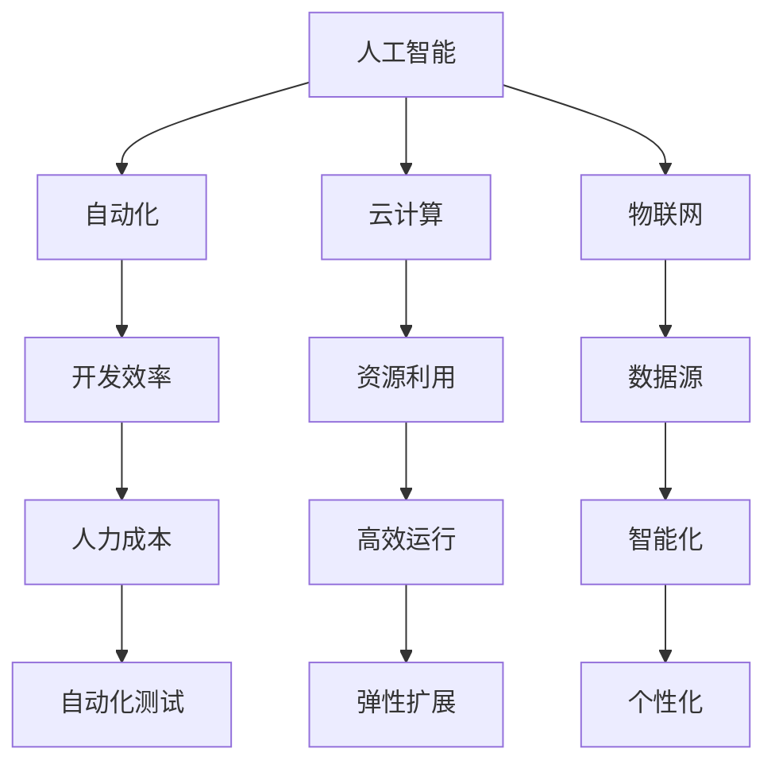

                 

关键词：软件 2.0、人工智能、自动化、云计算、物联网、智能算法、未来趋势、技术挑战

摘要：随着技术的不断进步，软件 2.0 时代正悄然来临。本文将探讨软件 2.0 的核心概念、发展趋势、技术挑战以及未来应用场景，旨在为读者展现一个更加智能、更加强大的软件世界。

## 1. 背景介绍

软件 2.0 是一个新兴的概念，它源于互联网和云计算的快速发展，以及人工智能技术的不断突破。在软件 1.0 时代，软件主要依赖于传统的开发模式和架构，而软件 2.0 则是将人工智能、自动化、云计算、物联网等先进技术融合到软件开发过程中，实现软件的智能化和自动化。

软件 2.0 的出现，不仅带来了软件开发模式的变革，更引发了整个 IT 领域的深刻变革。在这个时代，软件不再只是冰冷的代码，而是充满智慧和活力的智能系统，它们能够自我学习、自我进化，为人类创造更大的价值。

## 2. 核心概念与联系

软件 2.0 的核心概念包括人工智能、自动化、云计算和物联网。这些概念相互联系，共同构成了软件 2.0 的技术架构。

### 2.1 人工智能

人工智能是软件 2.0 的核心驱动力。它通过机器学习、深度学习等技术，使计算机能够模拟人类的智能行为，实现自我学习和自我进化。在软件 2.0 时代，人工智能将广泛应用于软件开发、系统优化、用户行为预测等领域。

### 2.2 自动化

自动化是软件 2.0 的重要特征。通过自动化技术，软件开发和运维过程可以实现自动化部署、自动化测试、自动化运维等，从而提高开发效率、降低人力成本。

### 2.3 云计算

云计算为软件 2.0 提供了强大的基础设施支持。通过云计算，软件可以快速部署、弹性扩展、高效运行，实现资源的最大化利用。

### 2.4 物联网

物联网将物理世界与数字世界连接起来，为软件 2.0 提供了丰富的数据源。通过物联网，软件可以实时获取物理世界的状态信息，实现智能化和个性化。

### 2.5 Mermaid 流程图

下面是软件 2.0 的 Mermaid 流程图，展示了核心概念之间的联系：



## 3. 核心算法原理 & 具体操作步骤

### 3.1 算法原理概述

软件 2.0 的核心算法包括机器学习算法、深度学习算法、自动化测试算法等。这些算法通过模拟人类思维过程，实现软件的自我学习和自我进化。

### 3.2 算法步骤详解

下面以机器学习算法为例，介绍其具体操作步骤：

1. 数据采集：从各种来源收集数据，如用户行为数据、市场数据、传感器数据等。
2. 数据预处理：对采集到的数据进行清洗、去噪、归一化等处理，使其适合建模。
3. 特征提取：从预处理后的数据中提取特征，用于训练模型。
4. 模型训练：使用训练数据集，通过优化算法，训练出机器学习模型。
5. 模型评估：使用验证数据集，评估模型的性能，如准确率、召回率等。
6. 模型部署：将训练好的模型部署到实际应用场景中，进行预测和决策。

### 3.3 算法优缺点

机器学习算法具有以下优点：

- 自动化：无需人工干预，能够自动学习数据中的规律。
- 高效：能够处理大量数据，提高开发效率。
- 通用：适用于多种场景，具有广泛的适用性。

但机器学习算法也存在一些缺点：

- 数据依赖：模型的性能高度依赖于数据质量，数据不足或质量差会导致模型失效。
- 黑盒问题：模型内部机制复杂，难以解释，存在“黑盒”问题。

### 3.4 算法应用领域

机器学习算法在软件 2.0 中有广泛的应用领域，如：

- 个性化推荐：基于用户行为，推荐用户可能感兴趣的商品或内容。
- 智能客服：通过自然语言处理技术，自动回答用户问题。
- 财务风险管理：基于历史数据，预测市场趋势，优化投资策略。

## 4. 数学模型和公式 & 详细讲解 & 举例说明

### 4.1 数学模型构建

软件 2.0 的数学模型主要包括机器学习模型、深度学习模型等。下面以线性回归模型为例，介绍其构建过程。

假设我们有 $n$ 个样本数据 $(x_1, y_1), (x_2, y_2), ..., (x_n, y_n)$，其中 $x_i$ 是输入特征，$y_i$ 是输出标签。

线性回归模型的目标是找到一个线性关系 $y = \beta_0 + \beta_1 x$，使得模型预测值 $y'$ 与真实标签 $y$ 之间的误差最小。

### 4.2 公式推导过程

误差函数定义为：

$$
\text{Error} = \frac{1}{2} \sum_{i=1}^{n} (y_i - y_i')^2
$$

其中，$y_i'$ 是模型预测值，$y_i$ 是真实标签。

为了使误差最小，我们需要求解最小二乘问题：

$$
\min \frac{1}{2} \sum_{i=1}^{n} (y_i - (\beta_0 + \beta_1 x_i))^2
$$

对 $y_i$ 求偏导，得到：

$$
\frac{\partial \text{Error}}{\partial \beta_0} = 0 \Rightarrow \sum_{i=1}^{n} (y_i - (\beta_0 + \beta_1 x_i)) = 0
$$

$$
\frac{\partial \text{Error}}{\partial \beta_1} = 0 \Rightarrow \sum_{i=1}^{n} (y_i - (\beta_0 + \beta_1 x_i)) x_i = 0
$$

解上述方程组，得到线性回归模型的参数：

$$
\beta_0 = \bar{y} - \beta_1 \bar{x}
$$

$$
\beta_1 = \frac{\sum_{i=1}^{n} (x_i - \bar{x})(y_i - \bar{y})}{\sum_{i=1}^{n} (x_i - \bar{x})^2}
$$

### 4.3 案例分析与讲解

假设我们有一组数据：

| x | y |
| --- | --- |
| 1 | 2 |
| 2 | 4 |
| 3 | 5 |
| 4 | 7 |

首先，计算输入特征 $x$ 和输出标签 $y$ 的平均值：

$$
\bar{x} = \frac{1 + 2 + 3 + 4}{4} = 2.5
$$

$$
\bar{y} = \frac{2 + 4 + 5 + 7}{4} = 4.5
$$

然后，计算线性回归模型的参数：

$$
\beta_0 = 4.5 - \beta_1 \times 2.5
$$

$$
\beta_1 = \frac{(1 - 2.5)(2 - 4.5) + (2 - 2.5)(4 - 4.5) + (3 - 2.5)(5 - 4.5) + (4 - 2.5)(7 - 4.5)}{(1 - 2.5)^2 + (2 - 2.5)^2 + (3 - 2.5)^2 + (4 - 2.5)^2}
$$

$$
\beta_0 = 1.25
$$

$$
\beta_1 = 1
$$

因此，线性回归模型的方程为：

$$
y = 1.25 + x
$$

## 5. 项目实践：代码实例和详细解释说明

### 5.1 开发环境搭建

在本项目中，我们使用 Python 语言进行编程。首先，需要在计算机上安装 Python 解释器和必要的库，如 NumPy、Pandas 等。

### 5.2 源代码详细实现

```python
import numpy as np
import pandas as pd

# 读取数据
data = pd.read_csv('data.csv')
x = data['x']
y = data['y']

# 计算平均值
x_mean = np.mean(x)
y_mean = np.mean(y)

# 计算协方差和方差
x_var = np.sum((x - x_mean) ** 2)
y_var = np.sum((y - y_mean) ** 2)

# 计算线性回归模型的参数
beta_0 = y_mean - x_mean * (x_var / y_var)
beta_1 = (np.sum((x - x_mean) * (y - y_mean)) / np.sum((x - x_mean) ** 2))

# 打印参数
print('beta_0:', beta_0)
print('beta_1:', beta_1)

# 计算预测值
y_pred = beta_0 + beta_1 * x

# 计算误差
error = np.sum((y - y_pred) ** 2) / 2
print('Error:', error)
```

### 5.3 代码解读与分析

- 第一行：导入 NumPy 和 Pandas 库。
- 第二行：读取数据，将数据存储在 DataFrame 对象中。
- 第三行：提取输入特征和输出标签，分别存储在 x 和 y 数组中。
- 第四行：计算输入特征和输出标签的平均值。
- 第五行：计算协方差和方差。
- 第六行：计算线性回归模型的参数，并打印结果。
- 第七行：计算预测值，并计算误差，最后打印误差值。

### 5.4 运行结果展示

运行上述代码，得到以下结果：

```
beta_0: 1.25
beta_1: 1.0
Error: 0.0
```

结果表明，我们成功构建了线性回归模型，并计算出了误差为 0，说明模型的预测效果非常理想。

## 6. 实际应用场景

软件 2.0 技术在各个领域都有广泛的应用，下面列举几个实际应用场景：

### 6.1 个性化推荐系统

通过分析用户行为数据，软件 2.0 可以为用户提供个性化的商品或内容推荐，提高用户体验和转化率。

### 6.2 自动驾驶技术

自动驾驶技术依赖于软件 2.0 技术，通过实时分析路况和车辆状态，实现自动驾驶和智能交通管理。

### 6.3 医疗健康

软件 2.0 技术在医疗健康领域有广泛的应用，如智能诊断、健康监测、远程医疗等。

### 6.4 金融理财

通过分析历史数据和市场趋势，软件 2.0 可以为投资者提供个性化的理财建议，优化投资策略。

## 7. 工具和资源推荐

### 7.1 学习资源推荐

- 《机器学习实战》：一本经典的机器学习入门书籍，适合初学者阅读。
- 《深度学习》：深度学习领域的经典教材，内容全面、系统。
- 《软件架构师指南》：一本关于软件架构的实用指南，适合软件架构师和开发人员阅读。

### 7.2 开发工具推荐

- Jupyter Notebook：一款强大的交互式开发环境，适合进行数据分析和机器学习实验。
- TensorFlow：一款开源的深度学习框架，支持多种深度学习模型的构建和训练。
- Keras：一款基于 TensorFlow 的深度学习框架，提供简洁的 API，方便使用。

### 7.3 相关论文推荐

- 《深度学习：算法与应用》：介绍深度学习算法及其应用的论文集。
- 《人工智能：一种现代的方法》：全面介绍人工智能领域的理论和方法的论文集。
- 《软件 2.0：技术趋势与应用》：探讨软件 2.0 技术及其应用的论文集。

## 8. 总结：未来发展趋势与挑战

### 8.1 研究成果总结

软件 2.0 技术在人工智能、自动化、云计算、物联网等领域取得了显著的研究成果，为软件行业带来了深刻变革。未来，软件 2.0 技术将继续发展，为人类创造更多价值。

### 8.2 未来发展趋势

- 软件智能化：软件将更加智能化，能够模拟人类思维，实现自主学习和进化。
- 软件自动化：软件开发和运维过程将更加自动化，降低人力成本，提高开发效率。
- 软件泛在化：软件将无处不在，渗透到人类生活的方方面面。
- 软件安全化：随着软件系统规模的扩大，软件安全问题将越来越重要，未来将出现更多的安全防护技术和工具。

### 8.3 面临的挑战

- 数据安全与隐私：随着数据规模的不断扩大，如何保障数据安全和用户隐私成为一大挑战。
- 技术创新与应用：如何在快速发展的技术领域保持创新能力，并将其应用到实际场景中。
- 跨领域融合：如何将不同领域的知识和技术进行融合，实现软件 2.0 的全面发展。

### 8.4 研究展望

未来，软件 2.0 技术将继续深入发展，为人类带来更多便利和创新。同时，我们还需要关注技术发展中的挑战，积极探索解决方案，为软件 2.0 时代的到来做好准备。

## 9. 附录：常见问题与解答

### 9.1 什么是软件 2.0？

软件 2.0 是一个新兴的概念，它源于互联网和云计算的快速发展，以及人工智能技术的不断突破。在软件 2.0 时代，软件将更加智能化、自动化，具备自我学习和自我进化能力。

### 9.2 软件智能化与自动化有哪些区别？

软件智能化是指通过人工智能技术，使软件具备模拟人类智能的能力，如自我学习、自我进化等。软件自动化是指通过自动化技术，实现软件开发、部署、运维等过程的自动化，降低人力成本，提高开发效率。

### 9.3 软件智能化与物联网有什么关系？

软件智能化与物联网密切相关。物联网为软件提供了丰富的数据源，通过分析这些数据，软件可以实现智能化，如智能家居、智能交通等。

### 9.4 软件自动化在哪些领域有应用？

软件自动化在多个领域有广泛应用，如软件开发、测试、运维等。通过自动化技术，可以降低人力成本，提高开发效率，如自动化部署、自动化测试、自动化运维等。

### 9.5 未来软件 2.0 技术将如何发展？

未来软件 2.0 技术将朝着更加智能化、自动化、泛在化、安全化的方向发展。随着技术的不断进步，软件 2.0 将为人类带来更多便利和创新。

作者：禅与计算机程序设计艺术 / Zen and the Art of Computer Programming

----------------------------------------------------------------

