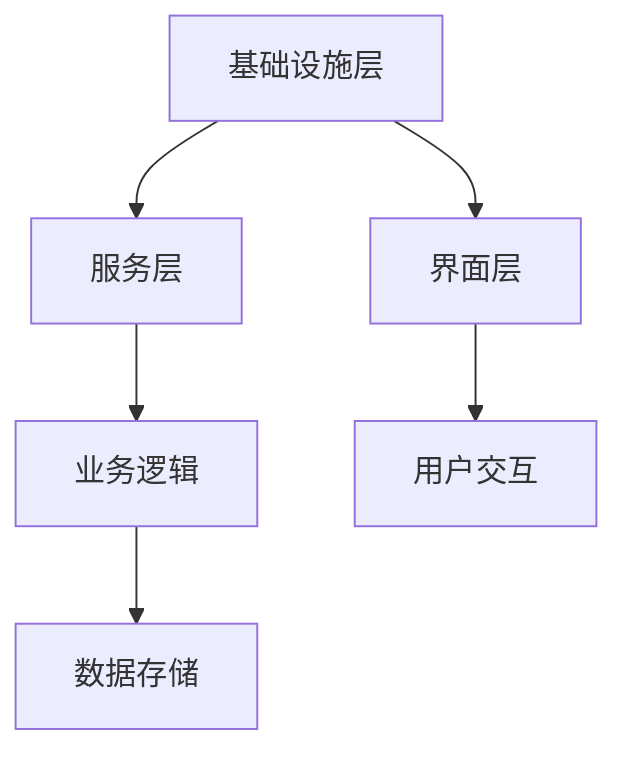

                 

关键词：软件模块化、模块化设计、软件架构、系统整合、代码复用

摘要：本文旨在探讨软件 2.0 时代的模块化设计理念，以及如何将这些模块化组件融合成一个整体，从而提高软件系统的整体性能和可维护性。通过分析模块化的核心概念、算法原理、数学模型以及实际应用场景，我们将揭示模块化设计在现代软件开发中的重要性，并提出未来发展的展望。

## 1. 背景介绍

随着软件复杂度的不断增加，传统的软件设计方法已经无法满足现代软件开发的挑战。软件 2.0 时代的到来，标志着软件系统向着更加模块化、分布式和可扩展的方向发展。模块化设计成为提高软件系统性能、降低开发成本、提升可维护性的关键。

### 1.1 软件模块化的定义

软件模块化是指将软件系统分解为一系列可独立开发、测试和部署的模块，每个模块具有清晰的功能边界和接口定义。模块化设计的核心思想是通过模块化的方法，将复杂的软件系统分解为更小的、易于管理的组件，从而提高系统的可维护性和可扩展性。

### 1.2 模块化设计的优势

模块化设计具有以下优势：

1. **提高开发效率**：模块化设计使得多个开发团队可以并行工作，从而缩短开发周期。
2. **降低开发成本**：通过代码复用，减少重复劳动，降低开发成本。
3. **提升可维护性**：模块化的组件使得代码更容易维护和更新。
4. **增强可扩展性**：模块化设计使得系统可以方便地扩展新功能。

## 2. 核心概念与联系

### 2.1 模块化设计原则

模块化设计遵循以下原则：

1. **高内聚、低耦合**：模块内部具有较高的内聚性，模块之间具有较低的耦合性。
2. **单一职责**：每个模块应负责单一的功能。
3. **模块独立性**：模块应独立运行，不依赖于其他模块。

### 2.2 模块化架构

模块化架构包括以下层次：

1. **基础设施层**：提供系统运行的基础设施，如数据库、缓存、消息队列等。
2. **服务层**：提供核心业务功能，如用户管理、订单处理、支付处理等。
3. **界面层**：提供用户交互的界面，如网页、移动应用等。

### 2.3 模块化流程图



## 3. 核心算法原理 & 具体操作步骤

### 3.1 算法原理概述

模块化算法的核心思想是将软件系统分解为一系列可独立开发的模块，并确保模块之间的高内聚、低耦合。

### 3.2 算法步骤详解

1. **需求分析**：分析软件系统的需求，确定需要实现的模块功能。
2. **模块划分**：根据需求分析，将软件系统划分为多个模块。
3. **模块实现**：独立实现每个模块的功能。
4. **模块测试**：对每个模块进行单元测试和集成测试。
5. **模块部署**：将模块部署到生产环境。

### 3.3 算法优缺点

**优点**：

1. **提高开发效率**：模块化设计使得多个开发团队可以并行工作。
2. **降低开发成本**：通过代码复用，减少重复劳动。
3. **提升可维护性**：模块化的组件使得代码更容易维护和更新。
4. **增强可扩展性**：模块化设计使得系统可以方便地扩展新功能。

**缺点**：

1. **模块间依赖**：模块间的依赖关系可能导致性能问题。
2. **模块化过度**：过度模块化可能导致系统的复杂性增加。

### 3.4 算法应用领域

模块化算法广泛应用于以下领域：

1. **Web 应用开发**：如 Java Spring Framework。
2. **移动应用开发**：如 React Native。
3. **企业级应用**：如 SAP、Oracle。

## 4. 数学模型和公式 & 详细讲解 & 举例说明

### 4.1 数学模型构建

模块化设计的数学模型可以表示为：

\[ M = \{ m_1, m_2, ..., m_n \} \]

其中，\( m_i \) 表示第 \( i \) 个模块，\( n \) 表示模块的总数。

### 4.2 公式推导过程

模块化设计的内聚度和耦合度可以用以下公式表示：

\[ C = \sum_{i=1}^{n} c_i \]
\[ D = \sum_{i=1}^{n} d_i \]

其中，\( c_i \) 表示第 \( i \) 个模块的内聚度，\( d_i \) 表示第 \( i \) 个模块的耦合度。

### 4.3 案例分析与讲解

假设我们有一个电子商务系统，需要实现用户管理、订单处理、支付处理等功能。我们可以将这些功能划分为以下模块：

1. **用户管理模块**：负责用户注册、登录、信息修改等功能。
2. **订单处理模块**：负责订单创建、修改、删除等功能。
3. **支付处理模块**：负责支付接口调用、支付结果处理等功能。

通过模块化设计，我们可以分别实现这些模块，并进行独立测试和部署。这样可以提高开发效率，降低开发成本，并提升系统的可维护性和可扩展性。

## 5. 项目实践：代码实例和详细解释说明

### 5.1 开发环境搭建

假设我们使用 Java 语言开发一个简单的电子商务系统，开发环境如下：

1. JDK 1.8 或更高版本。
2. IntelliJ IDEA。
3. MySQL 数据库。

### 5.2 源代码详细实现

以下是一个简单的用户管理模块的源代码实现：

```java
public class UserManager {
    public void register(String username, String password) {
        // 注册用户
    }

    public void login(String username, String password) {
        // 登录用户
    }

    public void updateInfo(String username, String newPassword, String newEmail) {
        // 更新用户信息
    }
}
```

### 5.3 代码解读与分析

用户管理模块实现了用户注册、登录和更新信息的功能。通过模块化设计，我们可以将用户管理模块与其他模块分离，从而提高系统的可维护性和可扩展性。

### 5.4 运行结果展示

运行用户管理模块后，我们可以看到以下结果：

1. 注册用户：`UserManager.register("user1", "password1")`。
2. 登录用户：`UserManager.login("user1", "password1")`。
3. 更新用户信息：`UserManager.updateInfo("user1", "password2", "user1@example.com")`。

## 6. 实际应用场景

模块化设计在许多实际应用场景中具有重要意义：

1. **Web 应用**：如电商平台、社交媒体等。
2. **移动应用**：如移动游戏、移动办公等。
3. **企业级应用**：如客户关系管理、供应链管理、财务系统等。

## 7. 工具和资源推荐

### 7.1 学习资源推荐

1. 《设计模式：可复用面向对象软件的基础》
2. 《软件架构：实践者的研究方法》
3. 《代码大全》

### 7.2 开发工具推荐

1. IntelliJ IDEA
2. Eclipse
3. Visual Studio Code

### 7.3 相关论文推荐

1. "Modular Software Development: A Methodological Approach"
2. "A Taxonomy of Modular Software Design Methods"
3. "Modular Software Development: An Experience Report"

## 8. 总结：未来发展趋势与挑战

### 8.1 研究成果总结

模块化设计在现代软件开发中已经得到了广泛应用，并取得了显著的效果。未来，模块化设计将继续成为软件开发的关键方向，推动软件系统的性能、可维护性和可扩展性的提升。

### 8.2 未来发展趋势

1. **微服务架构**：随着云计算和容器技术的发展，微服务架构将成为模块化设计的主流。
2. **模块化框架**：将出现更多基于模块化设计的框架，如 React、Vue 等。
3. **模块化工具**：模块化工具将变得更加智能化，自动化程度更高。

### 8.3 面临的挑战

1. **模块依赖管理**：如何有效地管理模块之间的依赖关系，提高系统的性能。
2. **模块划分**：如何合理划分模块，确保模块之间的高内聚、低耦合。
3. **模块复用**：如何最大化地复用模块，降低开发成本。

### 8.4 研究展望

模块化设计在未来将继续发挥重要作用，成为软件开发的核心技术。研究者应关注模块化设计的新方法、新工具和新应用，以推动软件产业的发展。

## 9. 附录：常见问题与解答

### 9.1 模块化设计与面向对象设计的区别？

模块化设计与面向对象设计是两种不同的设计方法。模块化设计强调将软件系统划分为独立的模块，而面向对象设计则强调将系统划分为对象。模块化设计可以应用于面向对象设计，两者并不矛盾。

### 9.2 模块化设计的优缺点有哪些？

模块化设计的优点包括提高开发效率、降低开发成本、提升可维护性和增强可扩展性。缺点包括模块间依赖可能导致性能问题、过度模块化可能导致系统复杂性增加。

### 9.3 模块化设计在 Web 应用开发中的应用？

模块化设计在 Web 应用开发中具有重要意义。通过模块化设计，我们可以将前端、后端和数据库等部分分离，提高系统的可维护性和可扩展性。例如，可以使用 Vue、React 等前端框架，结合 Spring Boot 等后端框架，实现模块化设计。

### 9.4 模块化设计与微服务架构的关系？

模块化设计与微服务架构密切相关。微服务架构是一种模块化设计的实现方式，它将软件系统划分为一系列独立的微服务，每个微服务实现一个特定的功能。模块化设计为微服务架构提供了理论基础和实现方法。

## 作者署名

作者：禅与计算机程序设计艺术 / Zen and the Art of Computer Programming
----------------------------------------------------------------
### 总结

本文全面探讨了软件 2.0 时代的模块化设计理念，分析了模块化的核心概念、算法原理、数学模型以及实际应用场景。通过详细的代码实例和解释，展示了模块化设计在现代软件开发中的重要性。文章最后对未来模块化设计的发展趋势与挑战进行了展望。希望本文能为读者在模块化设计领域提供有益的参考和启示。

