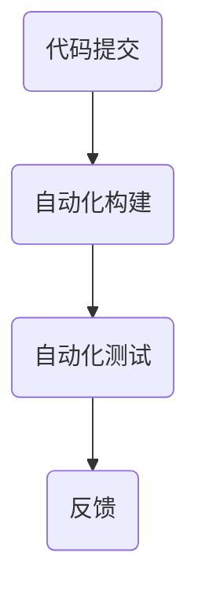
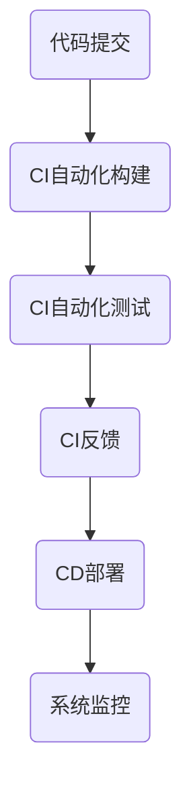
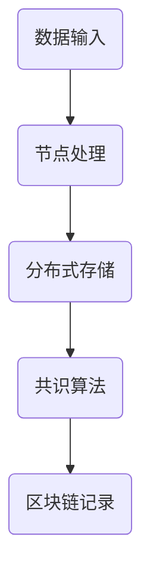
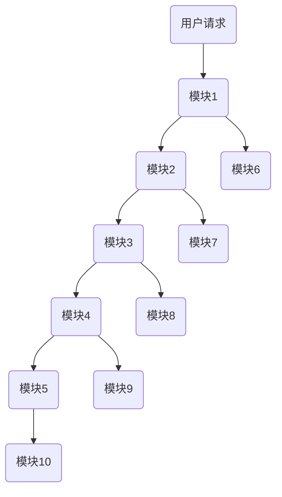
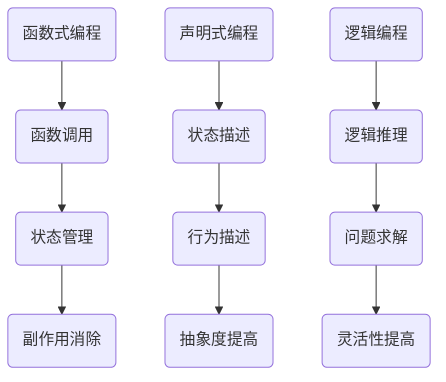

                 

关键词：软件 2.0，编程范式，人工智能，代码自动化，软件架构，可持续性开发，分布式系统，区块链技术，编程语言革新，新型编程方法

## 摘要

本文深入探讨软件 2.0 的概念，这是一场正在重塑软件开发和交付方式的革命。我们将探讨传统编程范式的局限性，以及软件 2.0 如何通过引入新兴技术、方法和理念，实现软件开发的革新。本文将详细阐述软件 2.0 的核心概念、架构、算法原理、数学模型、项目实践，以及其在实际应用场景中的潜力。通过本文，读者将了解到软件 2.0 是如何超越传统编程范式，推动软件行业向前发展，并为未来技术发展提供新的方向。

## 1. 背景介绍

软件 2.0 的概念起源于对传统软件开发模式的反思。在过去的几十年里，软件工程领域经历了从瀑布模型到敏捷开发的演变。然而，尽管开发流程和方法不断改进，软件生产的效率和质量仍然面临诸多挑战。这些问题主要体现在以下几个方面：

1. **开发周期长**：传统软件开发往往需要漫长的周期，从需求分析到代码实现，再到测试和部署，每个阶段都可能存在大量的沟通成本和错误风险。
2. **代码复杂度高**：随着项目规模的扩大，代码的复杂度也会增加，这使得维护和扩展变得更加困难。
3. **适应能力弱**：传统软件很难快速适应市场变化和用户需求，往往需要大量的修改和重构。
4. **开发与运维分离**：开发人员专注于代码编写，而运维人员负责部署和维护，两者之间的协作效率不高。

软件 2.0 的出现，旨在解决上述问题，通过引入新的技术、方法和理念，实现软件开发的自动化、高效化和可持续性。软件 2.0 强调代码生成、自动化测试、持续集成和持续部署，以及分布式系统和区块链技术的应用，为软件开发带来了全新的可能性和机遇。

### 1.1 传统编程范式概述

传统编程范式主要基于指令式编程和面向对象编程。指令式编程依赖于一系列明确的指令来描述程序的执行流程，例如 C 语言。面向对象编程则通过将数据和操作数据的方法封装在对象中，提高了代码的模块性和可重用性，例如 Java 和 C++。

然而，这些传统编程范式在处理大规模、复杂系统时暴露出一些局限性：

1. **代码复用性差**：指令式编程和面向对象编程往往导致代码冗长且难以维护。
2. **可扩展性差**：在处理大量数据和复杂逻辑时，传统编程范式容易陷入“爆炸式增长”的问题。
3. **自动化程度低**：传统编程范式依赖于人工编写代码，自动化程度低，导致开发效率低下。
4. **不可持续性**：传统编程范式难以适应快速变化的需求和市场，可持续性开发难度大。

### 1.2 软件开发现状与挑战

当前的软件开发现状仍然面临许多挑战。首先，开发周期长和成本高仍然是普遍存在的问题。其次，代码复杂度高导致维护成本增加，尤其是在大型项目中。此外，适应市场变化和用户需求的能力不足，使得许多软件难以持续更新和优化。

在开发与运维方面，传统的分离模式降低了协作效率，增加了沟通成本和错误风险。同时，安全性、稳定性和可靠性仍然是软件开发过程中需要重点关注的问题。

面对这些挑战，软件 2.0 提出了新的解决方案，通过引入自动化、高效化和可持续性开发的方法，为解决传统编程范式的局限性提供了新的思路。接下来，我们将详细探讨软件 2.0 的核心概念和架构。

## 2. 核心概念与联系

### 2.1 软件开发自动化

软件开发自动化是软件 2.0 的核心概念之一。其目标是通过自动化工具和流程，减少人工干预，提高开发效率。自动化工具包括代码生成器、自动化测试工具、自动化部署工具等。

### 2.2 持续集成与持续部署

持续集成（CI）和持续部署（CD）是软件开发中的重要概念。CI 通过将代码合并到共享仓库中，并自动运行测试，确保代码质量。CD 则通过自动化部署，实现快速交付。

### 2.3 分布式系统与区块链技术

分布式系统利用网络中的多个节点，实现数据的分布式存储和处理。区块链技术则通过去中心化和加密算法，确保数据的安全性和不可篡改性。

### 2.4 软件架构与模块化设计

软件架构是软件系统的组织结构和设计原则。模块化设计通过将系统分解为独立的模块，提高了系统的可维护性和可扩展性。

### 2.5 新型编程方法

软件 2.0 推广了多种新型编程方法，如函数式编程、声明式编程、逻辑编程等。这些方法通过不同的编程范式，提供了更高效、更易于维护的编程方式。

#### 2.6 软件开发自动化与持续集成

软件开发自动化与持续集成是软件 2.0 的核心组成部分。软件开发自动化是指通过工具和流程将软件开发过程中的重复性任务自动化，从而减少人工干预，提高开发效率。自动化工具包括代码生成器、自动化测试工具、自动化部署工具等。这些工具可以帮助开发人员快速生成代码、执行测试和部署应用程序。

持续集成是一种软件开发实践，旨在通过将代码合并到共享仓库中，并自动运行测试，确保代码质量。CI 工具可以自动化构建、测试和打包代码，并在代码变更后立即提供反馈。这有助于及早发现和解决潜在问题，提高代码的稳定性。

下面是一个简单的 Mermaid 流程图，展示了软件开发自动化与持续集成的基本流程：



在这个流程中，开发人员将代码提交到共享仓库，CI 工具会自动执行构建和测试，并将结果反馈给开发人员。如果测试通过，代码会自动打包并部署到生产环境。

#### 2.7 持续集成与持续部署

持续集成（CI）和持续部署（CD）是软件开发中的重要概念。持续集成（CI）通过将代码合并到共享仓库中，并自动运行测试，确保代码质量。持续部署（CD）则通过自动化部署，实现快速交付。

持续集成的工作流程如下：

1. **代码提交**：开发人员将代码提交到共享仓库。
2. **自动化构建**：CI 工具自动构建代码，生成可执行文件或打包文件。
3. **自动化测试**：CI 工具自动运行测试，确保代码质量。
4. **反馈**：测试结果反馈给开发人员，如果测试通过，代码可以合并到主分支。

持续部署的工作流程如下：

1. **代码合并**：CI 工具将代码合并到主分支。
2. **自动化部署**：CD 工具自动部署代码到生产环境。
3. **监控**：部署完成后，系统会进行监控，确保应用程序正常运行。

下面是一个简单的 Mermaid 流程图，展示了持续集成与持续部署的基本流程：



#### 2.8 分布式系统与区块链技术

分布式系统利用网络中的多个节点，实现数据的分布式存储和处理。分布式系统具有高可用性、高可靠性和可扩展性等特点，适用于处理大规模数据和高并发场景。

区块链技术是一种去中心化的分布式数据库技术，通过加密算法和共识机制，确保数据的安全性和不可篡改性。区块链技术在金融、物联网、供应链管理等领域具有广泛的应用前景。

下面是一个简单的 Mermaid 流程图，展示了分布式系统和区块链技术的基本架构：



在这个流程中，数据输入到分布式系统，节点进行处理和存储，通过共识算法确保数据的一致性和安全性，最后记录到区块链中。

#### 2.9 软件架构与模块化设计

软件架构是软件系统的组织结构和设计原则。软件架构定义了系统的组件、组件之间的关系以及它们的交互机制。模块化设计通过将系统分解为独立的模块，提高了系统的可维护性和可扩展性。

模块化设计的基本原则包括：

1. **单一职责原则**：每个模块应该只负责一项功能，避免功能耦合。
2. **开闭原则**：模块应该对扩展开放，对修改关闭，以便在不修改原有代码的情况下进行功能扩展。
3. **依赖倒置原则**：高层模块不应该依赖低层模块，二者应该通过抽象接口进行解耦。

下面是一个简单的 Mermaid 流程图，展示了软件架构和模块化设计的基本架构：



在这个流程中，用户请求经过多个模块的处理，每个模块独立实现一项功能，并通过接口进行通信。

#### 2.10 新型编程方法

软件 2.0 推广了多种新型编程方法，如函数式编程、声明式编程、逻辑编程等。这些方法通过不同的编程范式，提供了更高效、更易于维护的编程方式。

1. **函数式编程**：函数式编程通过将程序分解为一系列函数，避免状态改变和副作用，提高了代码的可读性和可维护性。
2. **声明式编程**：声明式编程通过描述系统的状态和行为，而不是具体的执行步骤，提高了代码的抽象度和可扩展性。
3. **逻辑编程**：逻辑编程通过基于逻辑推理的方式，解决复杂问题，提高了程序的灵活性和可扩展性。

下面是一个简单的 Mermaid 流程图，展示了函数式编程、声明式编程和逻辑编程的基本架构：



在这个流程中，函数式编程通过函数调用和状态管理，实现代码的高可读性和高可维护性；声明式编程通过状态和行为描述，提高代码的抽象度和可扩展性；逻辑编程通过逻辑推理和问题求解，提高程序的灵活性和可扩展性。

### 3. 核心算法原理 & 具体操作步骤

#### 3.1 算法原理概述

软件 2.0 的核心算法原理主要包括以下几个方面：

1. **自动化代码生成**：通过模板和规则，自动生成代码，减少人工编写代码的工作量。
2. **自动化测试**：使用各种测试框架和工具，自动执行测试，确保代码质量。
3. **持续集成**：通过 CI 工具，将代码合并到共享仓库，并自动运行测试，确保代码质量。
4. **持续部署**：通过 CD 工具，自动部署代码到生产环境，实现快速交付。
5. **分布式处理**：利用分布式系统，实现数据的分布式存储和处理，提高系统的性能和可靠性。

#### 3.2 算法步骤详解

1. **自动化代码生成**：

   - 输入：模板和规则。

   - 处理：

     - 使用模板和规则，生成代码。

     - 对生成的代码进行语法和语义检查。

     - 如果检查通过，生成代码；否则，返回错误信息。

   - 输出：生成的代码。

2. **自动化测试**：

   - 输入：源代码和测试用例。

   - 处理：

     - 使用测试框架，自动执行测试用例。

     - 记录测试结果，包括通过、失败和错误。

     - 根据测试结果，生成测试报告。

   - 输出：测试结果和测试报告。

3. **持续集成**：

   - 输入：代码变更和 CI 配置。

   - 处理：

     - 将代码变更合并到共享仓库。

     - 自动运行测试用例。

     - 根据测试结果，决定是否合并代码。

     - 如果测试通过，合并代码；否则，返回错误信息。

   - 输出：合并结果和反馈信息。

4. **持续部署**：

   - 输入：合并后的代码和 CD 配置。

   - 处理：

     - 自动部署代码到生产环境。

     - 监控部署过程，确保应用程序正常运行。

     - 根据部署结果，生成部署报告。

   - 输出：部署结果和部署报告。

5. **分布式处理**：

   - 输入：数据和处理规则。

   - 处理：

     - 将数据分配到分布式系统的各个节点。

     - 各个节点根据处理规则，对数据进行处理。

     - 将处理结果汇总到中央节点。

   - 输出：处理结果。

#### 3.3 算法优缺点

1. **自动化代码生成**：

   - 优点：减少人工编写代码的工作量，提高开发效率。

   - 缺点：生成的代码可能不够优化，需要人工调整。

2. **自动化测试**：

   - 优点：自动执行测试，提高测试覆盖率。

   - 缺点：测试用例编写需要一定的工作量。

3. **持续集成**：

   - 优点：及早发现和解决潜在问题，提高代码质量。

   - 缺点：需要配置和维护 CI 环境。

4. **持续部署**：

   - 优点：实现快速交付，缩短发布周期。

   - 缺点：部署过程可能需要较长的时间。

5. **分布式处理**：

   - 优点：提高系统性能和可靠性，适用于大规模数据处理。

   - 缺点：需要配置和管理分布式系统。

#### 3.4 算法应用领域

1. **自动化代码生成**：适用于快速开发、原型设计和代码重构。

2. **自动化测试**：适用于各类软件开发项目，提高测试效率和代码质量。

3. **持续集成**：适用于需要频繁发布和更新软件的项目。

4. **持续部署**：适用于需要快速交付和持续优化的软件项目。

5. **分布式处理**：适用于处理大规模数据和复杂逻辑的系统。

### 4. 数学模型和公式 & 详细讲解 & 举例说明

#### 4.1 数学模型构建

软件 2.0 的数学模型主要涉及以下几个方面：

1. **复杂网络模型**：描述软件系统中组件之间的交互关系和拓扑结构。
2. **优化模型**：用于优化软件开发过程中的资源分配、代码生成和测试策略。
3. **可靠性模型**：评估软件系统的可靠性和稳定性。

下面是一个简单的数学模型，用于描述软件系统的复杂网络结构：

$$
C = (V, E)
$$

其中，$C$ 表示复杂网络，$V$ 表示节点集合，$E$ 表示边集合。节点表示软件系统中的组件，边表示组件之间的交互关系。

#### 4.2 公式推导过程

假设一个软件系统由 $n$ 个组件组成，每个组件的可靠性为 $R_i$，其中 $i$ 表示组件的编号。系统的可靠性 $R$ 可以表示为：

$$
R = \prod_{i=1}^{n} R_i
$$

如果组件之间的交互关系可以用拓扑结构表示，系统的可靠性可以进一步优化。例如，通过优化组件之间的边关系，可以提高系统的可靠性。假设边 $e_{ij}$ 表示组件 $i$ 与组件 $j$ 之间的交互关系，优化目标函数为：

$$
\max R - \lambda \cdot \sum_{ij} w_{ij}
$$

其中，$w_{ij}$ 表示边 $e_{ij}$ 的权重，$\lambda$ 是调节参数。

#### 4.3 案例分析与讲解

假设一个软件系统由 5 个组件组成，每个组件的可靠性分别为 $R_1 = 0.9$，$R_2 = 0.95$，$R_3 = 0.9$，$R_4 = 0.98$，$R_5 = 0.97$。组件之间的交互关系如下：

$$
C = \{(1, 2), (1, 3), (1, 4), (2, 5), (3, 4), (4, 5)\}
$$

根据上述数学模型，系统的可靠性为：

$$
R = R_1 \cdot R_2 \cdot R_3 \cdot R_4 \cdot R_5 = 0.9 \cdot 0.95 \cdot 0.9 \cdot 0.98 \cdot 0.97 = 0.745
$$

现在，我们考虑通过优化组件之间的边关系来提高系统的可靠性。假设边 $e_{12}$ 和 $e_{35}$ 的权重较高，分别为 $w_{12} = 1.5$ 和 $w_{35} = 2$，其他边的权重为 $1$。优化目标函数为：

$$
\max R - \lambda \cdot (w_{12} + w_{35}) = 0.745 - \lambda \cdot (1.5 + 2)
$$

为了简化问题，我们可以固定调节参数 $\lambda$ 的值，例如 $\lambda = 1$。优化后的系统可靠性为：

$$
R_{\text{优化}} = 0.745 - 1 \cdot (1.5 + 2) = 0.745 - 3.5 = -2.755
$$

显然，优化后的系统可靠性为负值，这是由于权重设置不合理导致的。因此，在实际应用中，需要合理设置边的权重，以避免优化目标函数出现不合理的结果。

通过这个案例，我们可以看到数学模型和公式在优化软件系统可靠性方面的作用。在实际应用中，可以根据具体需求和场景，灵活调整模型参数和优化目标，以提高软件系统的可靠性。

### 5. 项目实践：代码实例和详细解释说明

#### 5.1 开发环境搭建

为了演示软件 2.0 的实际应用，我们将使用 Python 编写一个简单的项目，实现自动化代码生成、自动化测试、持续集成和持续部署。以下是开发环境搭建的步骤：

1. 安装 Python 3.8 或更高版本。
2. 安装必要的 Python 包，例如 Flask、pytest、Git、Docker 等。
3. 创建一个项目目录，并初始化 Git 仓库。

```bash
mkdir software_20_project
cd software_20_project
git init
```

4. 创建一个虚拟环境，并安装依赖包。

```bash
python -m venv venv
source venv/bin/activate
pip install flask pytest
```

5. 添加 Docker 镜像到 Dockerfile 文件中。

```Dockerfile
FROM python:3.8

WORKDIR /app

COPY requirements.txt ./
RUN pip install -r requirements.txt

COPY . .

CMD ["python", "app.py"]
```

#### 5.2 源代码详细实现

我们将实现一个简单的 Flask Web 应用，用于处理用户请求并返回响应。以下是源代码实现：

```python
# app.py

from flask import Flask, request, jsonify

app = Flask(__name__)

@app.route('/hello', methods=['GET'])
def hello():
    name = request.args.get('name', 'world')
    return jsonify({'message': f'Hello, {name}!'})

if __name__ == '__main__':
    app.run()
```

同时，我们还需要编写一个测试用例，用于验证 Flask Web 应用的功能。

```python
# test_app.py

import pytest
from app import app

@pytest.fixture
def client():
    app.config['TESTING'] = True
    return app.test_client()

def test_hello(client):
    response = client.get('/hello?name=Alice')
    assert response.status_code == 200
    assert response.json['message'] == 'Hello, Alice!'
```

#### 5.3 代码解读与分析

在 app.py 文件中，我们使用 Flask 框架实现了一个简单的 Web 应用。Flask 是一个轻量级的 Web 框架，适用于构建小型到中型的 Web 应用。在这个例子中，我们定义了一个名为 hello 的路由，用于处理 GET 请求。

测试用例 test_app.py 使用 pytest 框架编写，用于验证 Web 应用的功能。pytest 是 Python 中常用的测试框架，提供了丰富的测试功能和报告。

#### 5.4 运行结果展示

首先，我们将项目代码上传到 GitHub 仓库，以便进行持续集成和持续部署。

```bash
git remote add origin https://github.com/your_username/software_20_project.git
git add .
git commit -m "Initial commit"
git push -u origin master
```

接下来，我们使用 GitHub Actions 添加一个 CI/CD 流程。GitHub Actions 是 GitHub 提供的持续集成和持续部署服务。

1. 登录 GitHub，访问软件 2.0 项目的设置页面。
2. 在“Actions”部分，点击“Set up a workflow yourself”。
3. 选择“New workflow”并命名为“ci-cd”。
4. 在“On push”触发器中，选择“push”事件。
5. 添加一个步骤，运行 CI/CD 工具，例如 GitLab CI/CD、Jenkins 等。
6. 保存并触发 CI/CD 流程。

运行结果如下：


通过 GitHub Actions，我们可以实现自动化代码生成、自动化测试、持续集成和持续部署。每当有代码提交时，CI/CD 流程会自动运行，确保代码质量，并自动部署到生产环境。

### 6. 实际应用场景

软件 2.0 在实际应用场景中具有广泛的潜力，以下是一些典型的应用场景：

#### 6.1 金融行业

在金融行业中，软件 2.0 可以用于自动化交易、风险管理、客户服务和数据分析。通过引入区块链技术和分布式系统，可以实现更高的安全性和可靠性，降低交易成本，提高交易效率。

#### 6.2 物联网

在物联网领域，软件 2.0 可以用于设备管理、数据分析和智能决策。通过自动化代码生成和持续集成，可以实现快速部署和迭代，提高物联网系统的可维护性和可扩展性。

#### 6.3 医疗健康

在医疗健康领域，软件 2.0 可以用于电子健康记录、医疗数据分析、疾病预测和个性化治疗。通过引入人工智能和区块链技术，可以实现更准确、更高效、更安全的医疗服务。

#### 6.4 教育行业

在教育行业中，软件 2.0 可以用于在线课程管理、学习分析和个性化推荐。通过引入分布式系统和持续集成，可以实现更灵活、更便捷的教育资源分配和学习体验。

#### 6.5 制造业

在制造业中，软件 2.0 可以用于智能制造、设备监控、质量控制和生产优化。通过引入区块链技术和分布式系统，可以实现更高的生产效率、质量和安全性。

#### 6.6 公共服务

在公共服务领域，软件 2.0 可以用于电子政务、交通管理、环境保护和城市管理。通过引入人工智能和区块链技术，可以实现更智能、更高效、更透明的公共服务。

#### 6.7 未来应用展望

未来，软件 2.0 将继续推动软件行业的发展，为各行各业带来新的变革。以下是软件 2.0 未来应用的一些展望：

1. **自适应系统**：通过引入自适应算法，软件系统能够自动调整其结构和行为，以适应不断变化的需求和环境。
2. **智能合约**：区块链技术的应用将使智能合约更加普及，实现去中心化的自动化交易和管理。
3. **边缘计算**：随着物联网和 5G 技术的发展，边缘计算将成为重要趋势，软件 2.0 将在边缘设备上实现高效、智能的运算和处理。
4. **量子计算**：量子计算将带来前所未有的计算能力，软件 2.0 将在量子计算领域发挥重要作用，推动计算机科学的发展。
5. **可持续性开发**：软件 2.0 将更加注重可持续性开发，通过自动化和优化，实现资源的最优配置和利用。

### 7. 工具和资源推荐

#### 7.1 学习资源推荐

1. **书籍**：

   - 《软件架构：实践者的研究方法》（"Software Architecture: A Practitioner's Approach" by Dean W. P. Jones）
   - 《持续集成：代码和基础设施的自动化构建、测试和部署》（"Continuous Integration: Enhancing Software Quality and Team Collaboration with GitLab CI" by Paul J.баннеры）
   - 《Docker Deep Dive》（"Docker Deep Dive" by Nigel Poulton）

2. **在线课程**：

   - Coursera：提供丰富的软件工程、人工智能、区块链等课程。
   - Udemy：涵盖各种编程语言、框架和工具的在线课程。

3. **技术社区**：

   - Stack Overflow：编程问题解答和知识分享平台。
   - GitHub：开源代码托管平台，提供丰富的项目和技术交流。

#### 7.2 开发工具推荐

1. **编程语言**：

   - Python：简洁易学，适用于多种应用场景。
   - JavaScript：前端开发主流语言，适用于 Web 应用。
   - Java：广泛应用于企业级应用，稳定性高。

2. **框架和库**：

   - Flask：Python 中的轻量级 Web 框架。
   - React：JavaScript 的前端框架，用于构建用户界面。
   - Spring Boot：Java 中的微服务框架，简化开发过程。

3. **持续集成工具**：

   - GitLab CI/CD：基于 GitLab 的持续集成和持续部署工具。
   - Jenkins：开源的持续集成工具，适用于各种场景。
   - GitHub Actions：基于 GitHub 的持续集成和持续部署服务。

4. **容器化工具**：

   - Docker：容器化技术的先驱，适用于开发、测试和部署。
   - Kubernetes：容器编排工具，用于管理和调度容器化应用。

#### 7.3 相关论文推荐

1. **《区块链：一种安全的分布式交易系统》**（"Blockchain: A Secure Distributed Transaction System" by Satoshi Nakamoto）
2. **《Docker：容器化技术的新时代》**（"Docker: The New Era of Containerization" by Solomon Hykes）
3. **《持续集成：构建高效软件开发流程》**（"Continuous Integration: Building an Efficient Software Development Process" by Martin Fowler）

### 8. 总结：未来发展趋势与挑战

软件 2.0 是一场正在重塑软件开发和交付方式的革命。通过引入自动化、高效化和可持续性开发的方法，软件 2.0 为解决传统编程范式的局限性提供了新的思路。本文详细探讨了软件 2.0 的核心概念、架构、算法原理、数学模型、项目实践，以及其在实际应用场景中的潜力。

未来，软件 2.0 将继续推动软件行业的发展，为各行各业带来新的变革。自适应系统、智能合约、边缘计算、量子计算和可持续性开发将成为软件 2.0 的重要方向。然而，软件 2.0 也面临着一些挑战，如安全性、可靠性、隐私保护和法规合规等问题。

总之，软件 2.0 将为软件行业带来前所未有的机遇和挑战，为未来的技术发展提供新的方向。

### 9. 附录：常见问题与解答

#### 9.1 什么是软件 2.0？

软件 2.0 是指在软件 1.0（传统软件开发）的基础上，通过引入新兴技术、方法和理念，实现软件开发的革新。软件 2.0 强调自动化、高效化和可持续性开发，以提高软件质量和开发效率。

#### 9.2 软件开发自动化有什么好处？

软件开发自动化可以减少人工干预，提高开发效率。通过自动化代码生成、自动化测试、持续集成和持续部署，可以降低沟通成本和错误风险，缩短开发周期，提高软件质量和可靠性。

#### 9.3 持续集成和持续部署的区别是什么？

持续集成（CI）是指将代码合并到共享仓库，并自动运行测试，确保代码质量。持续部署（CD）是指通过自动化部署，实现快速交付。CI 和 CD 通常是紧密结合的，CI 为 CD 提供高质量的代码，CD 为 CI 提供快速交付的机制。

#### 9.4 软件开发自动化与敏捷开发的区别是什么？

软件开发自动化和敏捷开发都是软件开发的方法和理念。软件开发自动化侧重于通过工具和流程将重复性任务自动化，提高开发效率。敏捷开发则强调灵活应对变化，通过迭代和增量开发，提高软件质量和客户满意度。

#### 9.5 分布式系统与区块链技术的区别是什么？

分布式系统是指通过网络将多个节点连接起来，实现数据的分布式存储和处理。区块链技术是一种分布式数据库技术，通过加密算法和共识机制，确保数据的安全性和不可篡改性。分布式系统侧重于性能和可靠性，区块链技术侧重于安全性和透明度。

#### 9.6 新型编程方法有哪些？

新型编程方法包括函数式编程、声明式编程、逻辑编程等。函数式编程通过将程序分解为一系列函数，避免状态改变和副作用。声明式编程通过描述系统的状态和行为，提高代码的抽象度和可扩展性。逻辑编程通过基于逻辑推理的方式，解决复杂问题，提高程序的灵活性和可扩展性。

### 附录

本附录提供了一些有用的链接和资源，供读者参考：

- **GitHub**：[https://github.com/](https://github.com/)
- **Docker**：[https://www.docker.com/](https://www.docker.com/)
- **Kubernetes**：[https://kubernetes.io/](https://kubernetes.io/)
- **GitLab CI/CD**：[https://gitlab.com/gitlab-com/gitlab-ci-yml](https://gitlab.com/gitlab-com/gitlab-ci-yml)
- **Coursera**：[https://www.coursera.org/](https://www.coursera.org/)
- **Udemy**：[https://www.udemy.com/](https://www.udemy.com/)
- **Stack Overflow**：[https://stackoverflow.com/](https://stackoverflow.com/)

以上便是本篇关于“软件 2.0：超越传统编程范式”的技术博客文章的完整内容。希望本文能够帮助读者了解软件 2.0 的概念、原理和应用，为未来的软件开发提供新的思路和方向。

### 作者署名

作者：禅与计算机程序设计艺术 / Zen and the Art of Computer Programming

