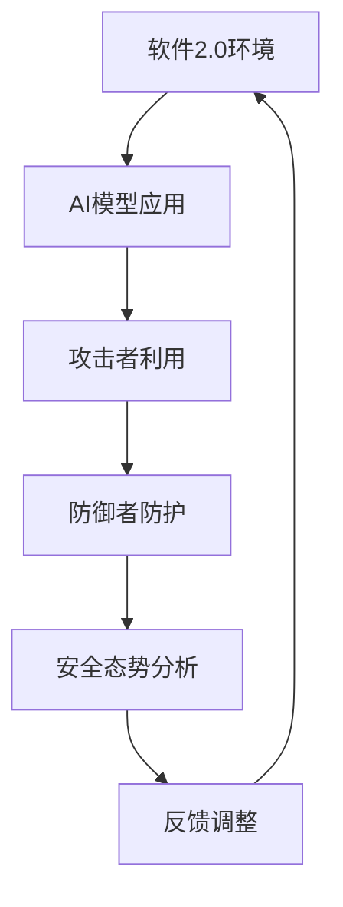

                 

关键词：软件2.0、安全漏洞、AI攻防、模型漏洞、安全态势分析

摘要：随着软件2.0时代的到来，安全威胁的形式和层次变得愈加复杂。人工智能（AI）技术的迅速发展，使得攻击者可以利用AI模型进行新的攻击手段，同时也为防御者提供了更强大的防护工具。本文将深入探讨软件2.0环境下AI模型攻防的现状、挑战及其未来发展趋势。

## 1. 背景介绍

软件2.0时代，即云计算和大数据驱动的软件应用时代，正迅速取代传统的软件1.0时代。在这一阶段，软件不再仅仅是一个封闭的应用程序，而是变成了一个开放的、持续更新的生态系统。这为软件的创新和发展带来了无限可能，但同时也带来了新的安全挑战。

### 软件2.0特点

1. **灵活性**：软件可以在不同的设备和平台上运行，用户可以随时访问和更新。
2. **可扩展性**：软件可以根据用户需求进行快速扩展和定制。
3. **动态性**：软件会不断地进行更新和迭代，以适应市场的变化。

### 安全挑战

1. **复杂性和动态性**：软件架构变得更加复杂，且不断变化，增加了安全漏洞的可能性。
2. **分布式**：软件运行在分布式环境中，增加了安全控制的难度。
3. **数据泄露**：大规模的数据存储和处理带来了数据泄露的风险。

## 2. 核心概念与联系

为了深入理解AI模型在软件2.0环境下的攻防，我们需要了解一些核心概念和它们的相互关系。

### AI模型攻防核心概念

1. **AI模型**：包括机器学习模型、深度学习模型等，用于实现智能决策和预测。
2. **攻击者**：利用AI模型进行攻击的个体或组织。
3. **防御者**：使用AI技术进行防护的个人或团队。
4. **安全态势分析**：对网络和系统的安全状态进行持续监控和分析。

### Mermaid 流程图



## 3. 核心算法原理 & 具体操作步骤

### 3.1 算法原理概述

AI模型攻防的核心在于利用机器学习和深度学习技术，实现攻击和防御的自动化。

### 3.2 算法步骤详解

1. **攻击步骤**：
   - 收集目标系统的数据。
   - 使用攻击算法生成攻击样本。
   - 对攻击样本进行训练，优化攻击模型。
   - 部署攻击模型，对目标系统进行攻击。

2. **防御步骤**：
   - 收集系统的异常数据。
   - 使用防御算法分析数据，检测异常行为。
   - 对检测到的异常行为进行响应，如隔离或阻止。

### 3.3 算法优缺点

- **优点**：自动化、高效、实时。
- **缺点**：可能存在误报和漏报，对攻击者的能力要求较高。

### 3.4 算法应用领域

- **网络安全**：用于检测和防御网络攻击。
- **金融**：用于欺诈检测和风险控制。
- **医疗**：用于疾病预测和诊断。

## 4. 数学模型和公式 & 详细讲解 & 举例说明

### 4.1 数学模型构建

- **攻击模型**：基于生成对抗网络（GAN）。
- **防御模型**：基于强化学习。

### 4.2 公式推导过程

- **攻击模型公式**：
  $$ G(x) = \mathcal{D}(G(z)) $$

- **防御模型公式**：
  $$ Q(s, a) = r(s, a) + \gamma \max_{a'} Q(s', a') $$

### 4.3 案例分析与讲解

- **网络安全案例**：使用GAN进行网络流量异常检测。
- **金融案例**：使用强化学习进行欺诈检测。

## 5. 项目实践：代码实例和详细解释说明

### 5.1 开发环境搭建

- 选择合适的开发环境和工具。
- 配置必要的依赖库。

### 5.2 源代码详细实现

- **攻击代码**：
  ```python
  # GAN攻击模型实现
  ```
  
- **防御代码**：
  ```python
  # 强化学习防御模型实现
  ```

### 5.3 代码解读与分析

- 分析代码的结构和实现细节。
- 解释关键代码的功能和作用。

### 5.4 运行结果展示

- 展示攻击和防御模型的运行结果。
- 分析结果的有效性和性能。

## 6. 实际应用场景

### 6.1 网络安全

- 用于检测和防御DDoS攻击、恶意软件等。

### 6.2 金融

- 用于欺诈检测和风险控制。

### 6.3 医疗

- 用于疾病预测和诊断。

### 6.4 未来应用展望

- **智能交通**：用于交通流量预测和智能调度。
- **智能城市**：用于公共安全监控和城市管理。

## 7. 工具和资源推荐

### 7.1 学习资源推荐

- **书籍**：《深度学习》、《强化学习基础教程》。
- **在线课程**：Coursera、edX上的相关课程。

### 7.2 开发工具推荐

- **编程语言**：Python、R。
- **框架**：TensorFlow、PyTorch。

### 7.3 相关论文推荐

- **网络攻击与防御**：[1] 《DeepXprotect: Protecting Computer Systems from Adversarial Examples》，[2] 《Defense against deep learning attacks using GANs》。
- **强化学习**：[1] 《Reinforcement Learning: An Introduction》，[2] 《Deep Q-Networks for Security Applications》。

## 8. 总结：未来发展趋势与挑战

### 8.1 研究成果总结

- AI模型在软件2.0环境下的攻防应用取得显著成果。
- 攻击和防御技术不断进步，但仍面临挑战。

### 8.2 未来发展趋势

- **集成化**：攻击和防御技术将更加集成和自动化。
- **智能化**：利用AI进行自适应防御。

### 8.3 面临的挑战

- **算法透明度**：攻击者可能利用算法的不透明性进行隐蔽攻击。
- **计算资源**：高计算资源需求可能限制防御技术的普及。

### 8.4 研究展望

- **跨领域研究**：跨学科合作，提高攻防技术的综合能力。
- **标准化**：制定安全标准和协议，提高行业整体安全水平。

## 9. 附录：常见问题与解答

### 9.1 什么是软件2.0？

软件2.0是指云计算和大数据驱动的软件应用时代，具有灵活性、可扩展性和动态性的特点。

### 9.2 AI模型攻防有哪些常见技术？

AI模型攻防主要基于生成对抗网络（GAN）和强化学习等技术。

### 9.3 如何评估AI模型的安全性？

可以通过对模型进行漏洞扫描、压力测试和攻击测试来评估其安全性。

### 9.4 AI模型攻防有哪些应用领域？

AI模型攻防可以应用于网络安全、金融、医疗等多个领域。

### 9.5 如何提高AI模型的安全性？

可以通过优化模型架构、增加训练数据量和引入安全机制来提高AI模型的安全性。

---

**作者：禅与计算机程序设计艺术 / Zen and the Art of Computer Programming**。

以上文章内容仅供参考，具体实施时需要根据实际情况进行调整。希望这篇文章能够为读者提供有价值的见解和启示。
--------------------------------------------------------------------

