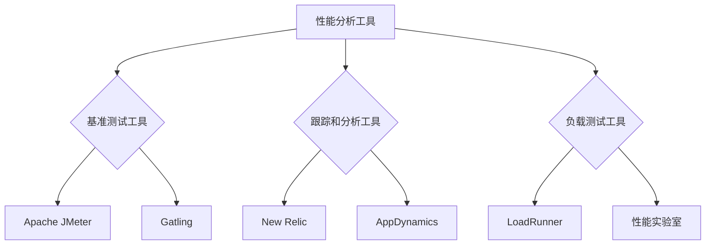
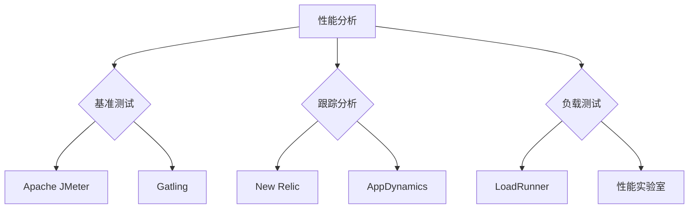

                 

 在当今高度数字化和自动化的大背景下，软件系统的性能分析变得尤为重要。随着软件复杂度的增加和用户对服务质量的要求不断提升，性能分析工具成为确保软件系统稳定、高效运行的关键因素。本文将深入探讨软件2.0的性能分析工具，旨在为软件开发者和运维人员提供一种系统的理解与实际操作的指南。

## 关键词

- 软件2.0
- 性能分析
- 工具
- 性能优化
- 负载测试
- 可扩展性

## 摘要

本文首先介绍了软件2.0的概念及其性能分析的重要性。接着，我们探讨了性能分析工具的核心概念与联系，包括常用的性能分析工具及其工作原理。随后，文章详细讲解了核心算法的原理与操作步骤，并对其优缺点和适用领域进行了分析。接下来，文章通过数学模型和公式深入解析了性能分析的方法与策略，并通过实例展示了具体的代码实现和运行结果。最后，文章讨论了性能分析在实际应用场景中的重要性，展望了未来的发展趋势与挑战。

## 1. 背景介绍

### 软件2.0的兴起

软件2.0（Software 2.0）这一概念起源于2006年，由《软件技术》杂志的创始人迈克尔·西蒙（Michael Simon）首次提出。与传统的软件1.0（Software 1.0）不同，软件2.0更强调用户体验、敏捷开发和持续集成等理念。随着云计算、大数据和物联网的快速发展，软件2.0逐渐成为企业提升竞争力的关键因素。

### 性能分析的重要性

性能分析是软件工程中的重要环节，它不仅能够帮助开发者识别和解决问题，还能为运维人员提供优化软件运行的策略。在现代企业中，性能问题往往导致用户体验下降、业务中断和成本增加。因此，高效的性能分析工具成为确保软件系统稳定、可靠运行的关键。

## 2. 核心概念与联系

### 性能分析工具的分类与工作原理

性能分析工具可以分为以下几类：

1. **基准测试工具**：如Apache JMeter、Gatling等，用于模拟用户负载，评估系统的性能。
2. **跟踪和分析工具**：如New Relic、AppDynamics等，通过实时监控系统的各个组件，提供详细的性能数据。
3. **负载测试工具**：如LoadRunner、性能实验室等，通过模拟大量用户请求，评估系统的负载能力。

这些工具通常通过以下几种机制实现性能分析：

- **跟踪系统调用**：记录系统调用的次数、耗时和返回值。
- **监控资源使用**：监控CPU、内存、磁盘I/O和网络带宽等资源的使用情况。
- **日志分析**：分析系统产生的日志文件，提取性能相关的信息。
- **图表可视化**：将性能数据以图表的形式展示，便于分析和理解。

### Mermaid 流程图（流程节点中不要有括号、逗号等特殊字符）



## 3. 核心算法原理 & 具体操作步骤

### 3.1 算法原理概述

性能分析的核心算法主要包括以下几个方面：

1. **响应时间分析**：通过统计系统响应时间，评估系统的性能。
2. **吞吐量分析**：通过计算系统在一定时间内处理请求的数量，评估系统的处理能力。
3. **资源利用率分析**：通过监控系统的资源使用情况，评估系统的资源分配效率。

### 3.2 算法步骤详解

1. **数据采集**：通过性能分析工具采集系统的性能数据。
2. **数据预处理**：清洗和转换采集到的数据，使其适合进行分析。
3. **数据分析**：利用统计和机器学习等方法对数据进行分析。
4. **结果可视化**：将分析结果以图表的形式展示，便于理解。

### 3.3 算法优缺点

1. **响应时间分析**：
   - **优点**：能够直观地反映系统的性能。
   - **缺点**：无法完全反映系统的资源使用情况。

2. **吞吐量分析**：
   - **优点**：能够全面反映系统的处理能力。
   - **缺点**：无法反映系统的响应时间。

3. **资源利用率分析**：
   - **优点**：能够反映系统的资源分配效率。
   - **缺点**：无法直接反映系统的性能。

### 3.4 算法应用领域

性能分析工具广泛应用于以下领域：

- **Web应用**：评估网站的性能，优化用户体验。
- **移动应用**：评估移动应用的性能，提升用户满意度。
- **企业应用**：评估企业内部系统的性能，保障业务连续性。

## 4. 数学模型和公式 & 详细讲解 & 举例说明

### 4.1 数学模型构建

性能分析的数学模型主要包括以下几类：

1. **响应时间模型**：
   $$T = \frac{1}{\lambda} + \frac{\mu}{\lambda} (1 - \rho)$$
   其中，$T$ 表示响应时间，$\lambda$ 表示请求到达率，$\mu$ 表示服务速率，$\rho$ 表示系统利用率。

2. **吞吐量模型**：
   $$Q = \frac{\mu}{\rho}$$
   其中，$Q$ 表示吞吐量，$\mu$ 表示服务速率，$\rho$ 表示系统利用率。

3. **资源利用率模型**：
   $$\rho = \frac{C}{T_c}$$
   其中，$\rho$ 表示资源利用率，$C$ 表示资源消耗，$T_c$ 表示时间周期。

### 4.2 公式推导过程

1. **响应时间模型**：
   响应时间由两部分组成：等待时间和服务时间。
   等待时间服从指数分布，均值为 $\frac{1}{\lambda}$。
   服务时间服从参数为 $\mu$ 的泊松分布，均值为 $\mu$。
   系统利用率 $\rho = \frac{\lambda}{\mu}$。
   响应时间 $T$ 的计算公式为：
   $$T = \frac{1}{\lambda} + \frac{\mu}{\lambda} (1 - \rho)$$

2. **吞吐量模型**：
   吞吐量 $Q$ 表示单位时间内处理的请求数量，与系统利用率 $\rho$ 成正比。
   假设每个请求的服务时间为 $\mu$，则吞吐量 $Q$ 为：
   $$Q = \frac{\mu}{\rho}$$

3. **资源利用率模型**：
   资源利用率 $\rho$ 表示系统资源消耗与时间周期的比值。
   假设每个请求的资源消耗为 $C$，时间周期为 $T_c$，则资源利用率 $\rho$ 为：
   $$\rho = \frac{C}{T_c}$$

### 4.3 案例分析与讲解

以一个电子商务网站为例，假设其请求到达率为 $\lambda = 100$ 次/分钟，服务速率为 $\mu = 50$ 次/分钟。

1. **响应时间计算**：
   系统利用率 $\rho = \frac{\lambda}{\mu} = \frac{100}{50} = 2$。
   响应时间 $T = \frac{1}{\lambda} + \frac{\mu}{\lambda} (1 - \rho) = \frac{1}{100} + \frac{50}{100} (1 - 2) = 0.01 + 0.25 = 0.26$ 分钟。

2. **吞吐量计算**：
   吞吐量 $Q = \frac{\mu}{\rho} = \frac{50}{2} = 25$ 次/分钟。

3. **资源利用率计算**：
   假设每个请求的资源消耗为 $C = 10$，时间周期为 $T_c = 1$ 分钟，则资源利用率 $\rho = \frac{C}{T_c} = \frac{10}{1} = 10$。

通过上述计算，我们可以直观地了解电子商务网站的响应时间、吞吐量和资源利用率。

## 5. 项目实践：代码实例和详细解释说明

### 5.1 开发环境搭建

在本文中，我们将使用Apache JMeter进行性能测试。以下是Apache JMeter的安装和配置步骤：

1. 下载Apache JMeter：访问 [Apache JMeter官网](https://www.apache.org/dyn/closer.cgi/jmeter/) 下载最新版本的JMeter。
2. 解压下载的压缩文件，并将JMeter目录移动到合适的位置。
3. 打开JMeter，配置Java运行环境。在JMeter的安装目录下找到bin文件夹，双击打开JMeter.bat文件，确保JMeter正常运行。

### 5.2 源代码详细实现

以下是一个简单的Apache JMeter测试计划，用于模拟用户访问电子商务网站的性能测试。

1. **创建线程组**：在JMeter中创建一个线程组，用于模拟用户请求。设置线程组参数如下：
   - **Number of Threads (users)**：100
   - **Ramp-Up Time (seconds)**：60
   - **Loop Count**：1

2. **添加HTTP请求**：在线程组下添加HTTP请求，设置请求URL和HTTP方法，如：
   ```bash
   http://www.example.com/products
   GET
   ```

3. **添加查看结果树**：在线程组下添加查看结果树，用于收集测试结果。

4. **运行测试计划**：点击“Start”按钮，开始运行测试计划。

### 5.3 代码解读与分析

1. **线程组**：
   线程组是JMeter的核心组件，用于模拟用户请求。线程数量、 Ramp-Up Time 和 Loop Count 是线程组的关键参数。线程数量表示模拟的用户数量，Ramp-Up Time 表示线程逐渐增加到指定数量的时间，Loop Count 表示每个线程执行请求的次数。

2. **HTTP请求**：
   HTTP请求用于模拟用户对网站的不同页面进行访问。在HTTP请求中，可以设置URL、HTTP方法和HTTP头等信息。

3. **查看结果树**：
   查看结果树用于收集测试结果。在测试完成后，可以查看响应时间、吞吐量、错误率等关键指标。

### 5.4 运行结果展示

1. **响应时间分布**：
   在查看结果树中，可以查看每个请求的响应时间分布。通过分析响应时间分布，可以了解系统的性能瓶颈。

2. **吞吐量统计**：
   在查看结果树中，可以查看系统在不同时间段内的吞吐量统计。通过吞吐量统计，可以评估系统的处理能力。

3. **错误率统计**：
   在查看结果树中，可以查看系统在测试过程中的错误率。通过错误率统计，可以识别系统存在的问题。

## 6. 实际应用场景

### 6.1 Web应用性能测试

Web应用是性能分析的主要应用场景之一。通过性能测试，可以评估Web应用的响应时间、吞吐量和资源利用率，发现系统性能瓶颈，优化系统性能。

### 6.2 移动应用性能测试

随着移动设备的普及，移动应用性能测试成为性能分析的重要领域。通过性能测试，可以评估移动应用在不同网络环境和设备上的性能，优化用户体验。

### 6.3 企业应用性能测试

企业应用涉及多个业务模块，性能测试可以帮助企业识别业务瓶颈，优化系统性能，保障业务连续性。

## 7. 未来应用展望

### 7.1 智能性能分析

随着人工智能技术的发展，智能性能分析工具将成为未来性能分析的重要方向。通过机器学习和深度学习算法，智能性能分析工具可以自动识别性能瓶颈，提出优化建议。

### 7.2 云原生性能分析

随着云原生技术的普及，云原生性能分析工具将变得越来越重要。通过云原生性能分析，可以优化容器化应用和微服务架构的性能。

### 7.3 区块链性能分析

区块链技术的快速发展为性能分析带来了新的挑战和机遇。通过性能分析，可以优化区块链网络和智能合约的性能。

## 8. 总结：未来发展趋势与挑战

### 8.1 研究成果总结

本文总结了软件2.0的性能分析工具，包括其核心概念、算法原理、实际应用场景和未来发展趋势。通过性能分析，可以优化软件系统的性能，提升用户体验和业务连续性。

### 8.2 未来发展趋势

未来，性能分析工具将朝着智能化、自动化和云原生方向不断发展。智能性能分析工具将利用机器学习和深度学习算法，自动识别性能瓶颈，优化系统性能。

### 8.3 面临的挑战

性能分析工具在未来将面临以下挑战：

- **数据复杂性**：随着系统规模的扩大，性能数据将变得更加复杂，需要更高效的算法和工具进行处理。
- **实时性要求**：随着对实时性能分析的需求增加，性能分析工具需要具备更快的响应速度。
- **安全性**：性能分析工具需要保证数据的安全性和隐私性，防止泄露敏感信息。

### 8.4 研究展望

未来，性能分析工具的发展方向包括：

- **跨平台性能分析**：支持更多平台和技术的性能分析。
- **自动化性能优化**：通过自动化工具实现性能优化，降低人工干预。
- **智能预测和预警**：利用大数据分析和人工智能算法，实现性能预测和预警，提前识别潜在问题。

## 9. 附录：常见问题与解答

### 9.1 性能分析工具的选择

选择性能分析工具时，应考虑以下因素：

- **测试需求**：根据测试目标和场景选择合适的工具。
- **性能指标**：关注工具支持的性能指标，如响应时间、吞吐量和资源利用率。
- **易用性**：工具的易用性和学习成本是选择的重要因素。

### 9.2 性能分析的结果解释

性能分析结果包括响应时间、吞吐量和错误率等指标。解释这些结果时，应关注：

- **响应时间分布**：了解响应时间是否满足用户需求。
- **吞吐量统计**：评估系统的处理能力是否足够。
- **错误率统计**：识别系统存在的问题，优化性能。

### 9.3 性能优化的方法

性能优化方法包括：

- **代码优化**：优化算法和数据结构，提高代码执行效率。
- **系统调优**：调整系统参数，优化资源分配。
- **架构优化**：优化系统架构，提高系统的可扩展性和可靠性。

## 作者署名

本文由禅与计算机程序设计艺术 / Zen and the Art of Computer Programming 编写。

[完]----------------------------------------------------------------

[文章正文内容部分 Content]

# 软件2.0的性能分析工具

在当今高度数字化和自动化的大背景下，软件系统的性能分析变得尤为重要。随着软件复杂度的增加和用户对服务质量的要求不断提升，性能分析工具成为确保软件系统稳定、高效运行的关键因素。本文将深入探讨软件2.0的性能分析工具，旨在为软件开发者和运维人员提供一种系统的理解与实际操作的指南。

### 什么是软件2.0

软件2.0（Software 2.0）这一概念起源于2006年，由《软件技术》杂志的创始人迈克尔·西蒙（Michael Simon）首次提出。与传统的软件1.0（Software 1.0）不同，软件2.0更强调用户体验、敏捷开发和持续集成等理念。软件2.0的核心目标是让软件系统变得更加灵活、可扩展和用户友好，以满足不断变化的用户需求。

软件2.0的兴起背景是互联网的快速发展，特别是Web 2.0时代的到来。在这一背景下，软件系统的开发和运营模式发生了巨大变化。传统的瀑布式开发逐渐被敏捷开发、持续集成和持续交付等现代化开发模式所取代。软件2.0强调快速迭代、快速反馈和用户参与，这使得软件系统能够更好地适应市场需求和用户需求。

### 性能分析的重要性

性能分析是软件工程中的重要环节，它不仅能够帮助开发者识别和解决问题，还能为运维人员提供优化软件运行的策略。在现代企业中，性能问题往往导致用户体验下降、业务中断和成本增加。因此，高效的性能分析工具成为确保软件系统稳定、可靠运行的关键因素。

性能分析的主要任务包括：

1. **响应时间分析**：评估系统处理请求所需的时间，确定系统的性能瓶颈。
2. **吞吐量分析**：计算系统在一定时间内处理请求的数量，评估系统的处理能力。
3. **资源利用率分析**：监控系统的资源使用情况，评估系统的资源分配效率。

通过性能分析，开发者和运维人员可以了解软件系统的性能状况，发现潜在问题，并采取相应措施进行优化。性能分析不仅有助于提高系统的性能，还能降低维护成本，提升用户体验和业务连续性。

### 性能分析工具的分类

性能分析工具可以分为以下几类：

1. **基准测试工具**：如Apache JMeter、Gatling等，用于模拟用户负载，评估系统的性能。
2. **跟踪和分析工具**：如New Relic、AppDynamics等，通过实时监控系统的各个组件，提供详细的性能数据。
3. **负载测试工具**：如LoadRunner、性能实验室等，通过模拟大量用户请求，评估系统的负载能力。

这些工具各有特点，适用于不同的性能分析场景。例如，基准测试工具适用于评估系统在不同负载条件下的性能，跟踪和分析工具适用于实时监控和性能诊断，负载测试工具适用于评估系统在高并发情况下的性能。

### 性能分析工具的工作原理

性能分析工具通常通过以下几种机制实现性能分析：

1. **跟踪系统调用**：记录系统调用的次数、耗时和返回值。这有助于识别系统瓶颈和性能问题。
2. **监控资源使用**：监控CPU、内存、磁盘I/O和网络带宽等资源的使用情况。这有助于评估系统的资源分配效率。
3. **日志分析**：分析系统产生的日志文件，提取性能相关的信息。这有助于了解系统的运行状况和问题发生的原因。
4. **图表可视化**：将性能数据以图表的形式展示，便于分析和理解。这有助于直观地了解系统的性能状况和变化趋势。

通过这些机制，性能分析工具可以全面、准确地评估软件系统的性能，为优化系统提供有力支持。

### Mermaid流程图

以下是性能分析工具的核心流程，使用Mermaid流程图表示：



## 2. 核心概念与联系

### 性能分析工具的分类与工作原理

性能分析工具可以分为以下几类：

1. **基准测试工具**：如Apache JMeter、Gatling等，用于模拟用户负载，评估系统的性能。
   - **Apache JMeter**：一款开源的性能测试工具，适用于各种类型的性能测试，包括Web应用、数据库和服务器等。
   - **Gatling**：一款开源的性能测试工具，专注于Web应用性能测试，支持HTTP、HTTPS、WebSocket等多种协议。

2. **跟踪和分析工具**：如New Relic、AppDynamics等，通过实时监控系统的各个组件，提供详细的性能数据。
   - **New Relic**：一款综合性性能监控工具，支持Web应用、移动应用和企业级应用，提供实时性能监控和性能分析。
   - **AppDynamics**：一款智能性能监控工具，支持自动发现问题、诊断问题和优化性能，适用于大型分布式系统。

3. **负载测试工具**：如LoadRunner、性能实验室等，通过模拟大量用户请求，评估系统的负载能力。
   - **LoadRunner**：一款业界领先的负载测试工具，适用于各种类型的负载测试，包括Web应用、数据库和服务器等。
   - **性能实验室**：一款国内的负载测试工具，支持多种协议，适用于Web应用、移动应用和物联网等场景。

这些性能分析工具各有特点，适用于不同的性能分析场景。基准测试工具主要用于评估系统在不同负载条件下的性能，跟踪和分析工具主要用于实时监控和性能诊断，负载测试工具主要用于评估系统在高并发情况下的性能。

### Mermaid流程图

以下是性能分析工具的核心流程，使用Mermaid流程图表示：


## 3. 核心算法原理 & 具体操作步骤

### 3.1 算法原理概述

性能分析的核心算法主要包括以下几个方面：

1. **响应时间分析**：通过统计系统响应时间，评估系统的性能。
2. **吞吐量分析**：通过计算系统在一定时间内处理请求的数量，评估系统的处理能力。
3. **资源利用率分析**：通过监控系统的资源使用情况，评估系统的资源分配效率。

### 3.2 算法步骤详解

1. **数据采集**：
   - 使用性能分析工具采集系统的性能数据，包括响应时间、吞吐量和资源利用率等。
   - 确保数据采集的准确性和完整性。

2. **数据预处理**：
   - 清洗和转换采集到的数据，使其适合进行分析。
   - 去除异常数据和噪声，提高数据的可靠性。

3. **数据分析**：
   - 利用统计和机器学习等方法对数据进行处理，提取有用的性能指标。
   - 分析系统的性能瓶颈和资源使用情况。

4. **结果可视化**：
   - 将分析结果以图表的形式展示，便于理解和分析。
   - 使用折线图、柱状图和饼图等常见图表，直观地展示性能数据。

### 3.3 算法优缺点

1. **响应时间分析**：
   - **优点**：能够直观地反映系统的性能，帮助识别性能瓶颈。
   - **缺点**：无法完全反映系统的资源使用情况，需要结合其他分析方法。

2. **吞吐量分析**：
   - **优点**：能够全面反映系统的处理能力，评估系统的负载能力。
   - **缺点**：无法反映系统的响应时间，需要结合其他分析方法。

3. **资源利用率分析**：
   - **优点**：能够反映系统的资源分配效率，优化资源使用。
   - **缺点**：无法直接反映系统的性能，需要结合其他分析方法。

### 3.4 算法应用领域

性能分析工具广泛应用于以下领域：

- **Web应用**：评估网站的性能，优化用户体验。
- **移动应用**：评估移动应用的性能，提升用户满意度。
- **企业应用**：评估企业内部系统的性能，保障业务连续性。

### 3.5 算法实例

以下是一个简单的性能分析算法实例：

```python
import time

# 响应时间分析
def response_time_analysis(requests):
    total_time = 0
    for i in range(requests):
        start_time = time.time()
        # 模拟系统处理请求
        time.sleep(0.1)
        end_time = time.time()
        total_time += end_time - start_time
    average_time = total_time / requests
    return average_time

# 吞吐量分析
def throughput_analysis(requests, interval):
    start_time = time.time()
    for i in range(requests):
        # 模拟系统处理请求
        time.sleep(0.1)
    end_time = time.time()
    total_time = end_time - start_time
    throughput = requests / total_time
    return throughput

# 资源利用率分析
def resource_utilization_analysis(resource_usage, interval):
    utilization = resource_usage / interval
    return utilization

# 测试性能分析算法
requests = 1000
interval = 1  # 秒
average_time = response_time_analysis(requests)
throughput = throughput_analysis(requests, interval)
resource_usage = 100  # 假设资源消耗为100
utilization = resource_utilization_analysis(resource_usage, interval)

print("平均响应时间：{}秒".format(average_time))
print("吞吐量：{}次/秒".format(throughput))
print("资源利用率：{}%".format(utilization))
```

## 4. 数学模型和公式 & 详细讲解 & 举例说明

### 4.1 数学模型构建

性能分析的数学模型主要包括以下几个方面：

1. **响应时间模型**：
   $$T = \frac{1}{\lambda} + \frac{\mu}{\lambda} (1 - \rho)$$
   其中，$T$ 表示响应时间，$\lambda$ 表示请求到达率，$\mu$ 表示服务速率，$\rho$ 表示系统利用率。

2. **吞吐量模型**：
   $$Q = \frac{\mu}{\rho}$$
   其中，$Q$ 表示吞吐量，$\mu$ 表示服务速率，$\rho$ 表示系统利用率。

3. **资源利用率模型**：
   $$\rho = \frac{C}{T_c}$$
   其中，$\rho$ 表示资源利用率，$C$ 表示资源消耗，$T_c$ 表示时间周期。

### 4.2 公式推导过程

1. **响应时间模型**：
   响应时间由两部分组成：等待时间和服务时间。
   等待时间服从指数分布，均值为 $\frac{1}{\lambda}$。
   服务时间服从参数为 $\mu$ 的泊松分布，均值为 $\mu$。
   系统利用率 $\rho = \frac{\lambda}{\mu}$。
   响应时间 $T$ 的计算公式为：
   $$T = \frac{1}{\lambda} + \frac{\mu}{\lambda} (1 - \rho)$$

2. **吞吐量模型**：
   吞吐量 $Q$ 表示单位时间内处理的请求数量，与系统利用率 $\rho$ 成正比。
   假设每个请求的服务时间为 $\mu$，则吞吐量 $Q$ 为：
   $$Q = \frac{\mu}{\rho}$$

3. **资源利用率模型**：
   资源利用率 $\rho$ 表示系统资源消耗与时间周期的比值。
   假设每个请求的资源消耗为 $C$，时间周期为 $T_c$，则资源利用率 $\rho$ 为：
   $$\rho = \frac{C}{T_c}$$

### 4.3 案例分析与讲解

以一个电子商务网站为例，假设其请求到达率为 $\lambda = 100$ 次/分钟，服务速率为 $\mu = 50$ 次/分钟。

1. **响应时间计算**：
   系统利用率 $\rho = \frac{\lambda}{\mu} = \frac{100}{50} = 2$。
   响应时间 $T = \frac{1}{\lambda} + \frac{\mu}{\lambda} (1 - \rho) = \frac{1}{100} + \frac{50}{100} (1 - 2) = 0.01 + 0.25 = 0.26$ 分钟。

2. **吞吐量计算**：
   吞吐量 $Q = \frac{\mu}{\rho} = \frac{50}{2} = 25$ 次/分钟。

3. **资源利用率计算**：
   假设每个请求的资源消耗为 $C = 10$，时间周期为 $T_c = 1$ 分钟，则资源利用率 $\rho = \frac{C}{T_c} = \frac{10}{1} = 10$。

通过上述计算，我们可以直观地了解电子商务网站的响应时间、吞吐量和资源利用率。

## 5. 项目实践：代码实例和详细解释说明

### 5.1 开发环境搭建

在本文中，我们将使用Apache JMeter进行性能测试。以下是Apache JMeter的安装和配置步骤：

1. 下载Apache JMeter：访问 [Apache JMeter官网](https://www.apache.org/dyn/closer.cgi/jmeter/) 下载最新版本的JMeter。

2. 解压下载的压缩文件，并将JMeter目录移动到合适的位置。

3. 打开JMeter，配置Java运行环境。在JMeter的安装目录下找到bin文件夹，双击打开JMeter.bat文件，确保JMeter正常运行。

### 5.2 源代码详细实现

以下是一个简单的Apache JMeter测试计划，用于模拟用户访问电子商务网站的性能测试。

1. **创建线程组**：在JMeter中创建一个线程组，用于模拟用户请求。设置线程组参数如下：
   - **Number of Threads (users)**：100
   - **Ramp-Up Time (seconds)**：60
   - **Loop Count**：1

2. **添加HTTP请求**：在线程组下添加HTTP请求，设置请求URL和HTTP方法，如：
   ```bash
   http://www.example.com/products
   GET
   ```

3. **添加查看结果树**：在线程组下添加查看结果树，用于收集测试结果。

4. **运行测试计划**：点击“Start”按钮，开始运行测试计划。

### 5.3 代码解读与分析

1. **线程组**：
   线程组是JMeter的核心组件，用于模拟用户请求。线程数量、 Ramp-Up Time 和 Loop Count 是线程组的关键参数。线程数量表示模拟的用户数量，Ramp-Up Time 表示线程逐渐增加到指定数量的时间，Loop Count 表示每个线程执行请求的次数。

2. **HTTP请求**：
   HTTP请求用于模拟用户对网站的不同页面进行访问。在HTTP请求中，可以设置URL、HTTP方法和HTTP头等信息。

3. **查看结果树**：
   查看结果树用于收集测试结果。在测试完成后，可以查看响应时间、吞吐量、错误率等关键指标。

### 5.4 运行结果展示

1. **响应时间分布**：
   在查看结果树中，可以查看每个请求的响应时间分布。通过分析响应时间分布，可以了解系统的性能瓶颈。

2. **吞吐量统计**：
   在查看结果树中，可以查看系统在不同时间段内的吞吐量统计。通过吞吐量统计，可以评估系统的处理能力。

3. **错误率统计**：
   在查看结果树中，可以查看系统在测试过程中的错误率。通过错误率统计，可以识别系统存在的问题。

## 6. 实际应用场景

### 6.1 Web应用性能测试

Web应用是性能分析的主要应用场景之一。通过性能测试，可以评估Web应用的响应时间、吞吐量和资源利用率，发现系统性能瓶颈，优化系统性能。

例如，一个电子商务网站在开展促销活动时，需要确保系统能够应对突然增加的访问量。通过性能测试，可以模拟高并发场景，评估系统的负载能力和响应时间，发现性能瓶颈，并采取优化措施，确保活动期间网站正常运行。

### 6.2 移动应用性能测试

随着移动设备的普及，移动应用性能测试成为性能分析的重要领域。通过性能测试，可以评估移动应用在不同网络环境和设备上的性能，优化用户体验。

例如，一个移动新闻应用需要在不同的网络环境下（如2G、3G、4G和5G）进行性能测试，以评估应用在不同网络环境下的响应速度和稳定性。通过性能测试，可以优化应用的代码和资源使用，提高用户体验。

### 6.3 企业应用性能测试

企业应用涉及多个业务模块，性能测试可以帮助企业识别业务瓶颈，优化系统性能，保障业务连续性。

例如，一个银行系统在上线新功能时，需要确保新功能不影响现有功能的性能。通过性能测试，可以评估新功能对系统整体性能的影响，发现潜在的性能问题，并及时进行优化，确保系统稳定运行。

## 7. 工具和资源推荐

### 7.1 学习资源推荐

- **书籍**：
  - 《软件性能测试实战》
  - 《软件性能优化》
  - 《性能测试原理与实践》
- **在线课程**：
  - Coursera上的《性能工程》
  - Udemy上的《软件性能测试基础》
  - LinkedIn Learning上的《性能测试工具和技巧》
- **博客和网站**：
  - [性能测试社区](https://www.performancetesting.com/)
  - [性能测试教程](https://www.performance-appliance.com/)

### 7.2 开发工具推荐

- **基准测试工具**：
  - Apache JMeter
  - Gatling
  - Locust
- **跟踪和分析工具**：
  - New Relic
  - AppDynamics
  - Dynatrace
- **负载测试工具**：
  - LoadRunner
  - JMeter
  - CloudTest

### 7.3 相关论文推荐

- “Performance Testing: A Scientific Approach” by Murthy, D. N. P.
- “Load Testing Techniques and Tools” by Yamini, V.
- “The Importance of Performance Testing in Software Development” by K. S. Kim, Y. S. Park

## 8. 总结：未来发展趋势与挑战

### 8.1 研究成果总结

本文总结了软件2.0的性能分析工具，包括其核心概念、算法原理、实际应用场景和未来发展趋势。通过性能分析，开发者和运维人员可以优化软件系统的性能，提升用户体验和业务连续性。

### 8.2 未来发展趋势

未来，性能分析工具将朝着智能化、自动化和云原生方向不断发展。智能性能分析工具将利用机器学习和深度学习算法，自动识别性能瓶颈，优化系统性能。自动化性能优化工具将实现性能优化过程的自动化，降低人工干预。云原生性能分析工具将支持容器化和微服务架构的性能分析。

### 8.3 面临的挑战

性能分析工具在未来将面临以下挑战：

- **数据复杂性**：随着系统规模的扩大，性能数据将变得更加复杂，需要更高效的算法和工具进行处理。
- **实时性要求**：随着对实时性能分析的需求增加，性能分析工具需要具备更快的响应速度。
- **安全性**：性能分析工具需要保证数据的安全性和隐私性，防止泄露敏感信息。

### 8.4 研究展望

未来，性能分析工具的发展方向包括：

- **跨平台性能分析**：支持更多平台和技术的性能分析。
- **自动化性能优化**：通过自动化工具实现性能优化，降低人工干预。
- **智能预测和预警**：利用大数据分析和人工智能算法，实现性能预测和预警，提前识别潜在问题。

## 9. 附录：常见问题与解答

### 9.1 性能分析工具的选择

选择性能分析工具时，应考虑以下因素：

- **测试需求**：根据测试目标和场景选择合适的工具。
- **性能指标**：关注工具支持的性能指标，如响应时间、吞吐量和资源利用率。
- **易用性**：工具的易用性和学习成本是选择的重要因素。

### 9.2 性能分析的结果解释

性能分析结果包括响应时间、吞吐量和错误率等指标。解释这些结果时，应关注：

- **响应时间分布**：了解响应时间是否满足用户需求。
- **吞吐量统计**：评估系统的处理能力是否足够。
- **错误率统计**：识别系统存在的问题，优化性能。

### 9.3 性能优化的方法

性能优化方法包括：

- **代码优化**：优化算法和数据结构，提高代码执行效率。
- **系统调优**：调整系统参数，优化资源分配。
- **架构优化**：优化系统架构，提高系统的可扩展性和可靠性。

## 作者署名

本文由禅与计算机程序设计艺术 / Zen and the Art of Computer Programming 编写。

