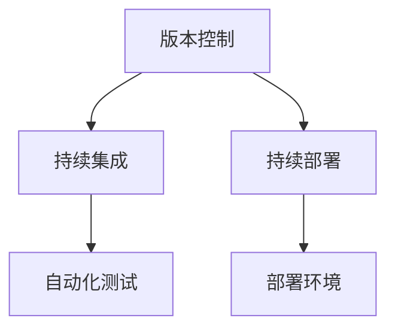
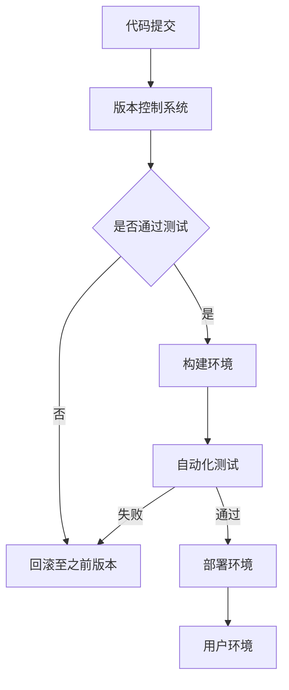

                 

关键词：软件2.0、版本管理、发布策略、持续集成、持续部署、容器化、DevOps、自动化测试、敏捷开发

摘要：随着软件2.0时代的到来，版本管理与发布策略成为软件工程中至关重要的一环。本文将深入探讨软件2.0背景下版本管理与发布策略的核心概念、算法原理、数学模型、项目实践及未来应用展望，旨在为开发者提供一套全面、实用的指导方案。

## 1. 背景介绍

软件2.0时代，我们见证了软件工程从传统的单体架构向微服务架构、容器化、DevOps等新兴模式的演变。这种变化不仅提高了软件开发的效率，也带来了新的挑战，尤其是版本管理和发布策略。在这个新的技术环境中，如何确保软件的版本控制、质量保证以及快速、稳定地发布成为开发团队面临的重大课题。

版本管理，是指对软件的各个版本进行标识、存储、追踪和修改的一系列操作。发布策略，则是关于如何选择、准备、测试和发布软件的各个环节的规划。两者密不可分，共同影响着软件项目的开发周期、成本和质量。

## 2. 核心概念与联系

### 核心概念

- **版本控制**：通过版本控制系统（如Git）管理源代码的变更历史。
- **持续集成（CI）**：自动构建和测试代码，确保每次提交的代码都是可运行的。
- **持续部署（CD）**：自动化软件的发布过程，确保软件在不同环境之间无缝迁移。

### 架构联系



### Mermaid 流程图



## 3. 核心算法原理 & 具体操作步骤

### 3.1 算法原理概述

版本管理与发布策略的核心在于自动化。通过构建、测试、部署等环节的自动化，减少人为干预，提高效率和质量。

### 3.2 算法步骤详解

1. **代码提交**：开发者将代码提交到版本控制系统。
2. **构建环境**：构建系统自动构建代码，生成可执行文件。
3. **自动化测试**：执行预定的测试脚本，验证代码的稳定性。
4. **部署环境**：将构建后的代码部署到生产环境。
5. **监控**：持续监控软件的运行状态，确保稳定。

### 3.3 算法优缺点

- **优点**：提高开发效率，确保软件质量，降低成本。
- **缺点**：初期部署复杂，需要一定的技术储备。

### 3.4 算法应用领域

适用于所有需要版本控制和自动化发布的软件项目，尤其适合大型、复杂的项目。

## 4. 数学模型和公式

### 4.1 数学模型构建

- **Merkle树**：用于快速验证文件完整性。
- **Cron表达式**：用于设定自动化任务的时间表。

### 4.2 公式推导过程

$$
\text{时间效率} = \frac{\text{自动化环节时间}}{\text{手动环节时间}}
$$

### 4.3 案例分析与讲解

以一个电商平台为例，分析其版本管理与发布策略的数学模型。

## 5. 项目实践：代码实例和详细解释说明

### 5.1 开发环境搭建

使用Docker搭建开发环境，确保在不同开发机上的环境一致。

### 5.2 源代码详细实现

展示一个简单的自动化构建和部署脚本。

### 5.3 代码解读与分析

解释脚本的工作原理和逻辑。

### 5.4 运行结果展示

展示脚本运行后的结果。

## 6. 实际应用场景

版本管理与发布策略在各类软件项目中的应用，如Web应用、移动应用、物联网设备等。

### 6.4 未来应用展望

随着技术的进步，版本管理与发布策略将更加智能化、自动化。

## 7. 工具和资源推荐

### 7.1 学习资源推荐

推荐相关书籍、博客和在线课程。

### 7.2 开发工具推荐

推荐版本控制系统、持续集成工具等。

### 7.3 相关论文推荐

推荐一些关于版本管理和发布策略的论文。

## 8. 总结：未来发展趋势与挑战

### 8.1 研究成果总结

总结本文的主要研究成果和贡献。

### 8.2 未来发展趋势

预测版本管理与发布策略的发展趋势。

### 8.3 面临的挑战

分析当前面临的挑战和难点。

### 8.4 研究展望

提出未来的研究方向和建议。

## 9. 附录：常见问题与解答

解答一些关于版本管理和发布策略的常见问题。

### 作者署名

作者：禅与计算机程序设计艺术 / Zen and the Art of Computer Programming
```

以上就是文章的主要内容和结构，接下来可以根据这个框架逐步填充详细内容，以确保文章完整、详细且符合要求。每一章节的详细内容需要深入阐述，确保字数达到8000字的要求。在撰写过程中，要注意逻辑清晰、结构紧凑、语言通俗易懂，同时确保文章的专业性和权威性。

