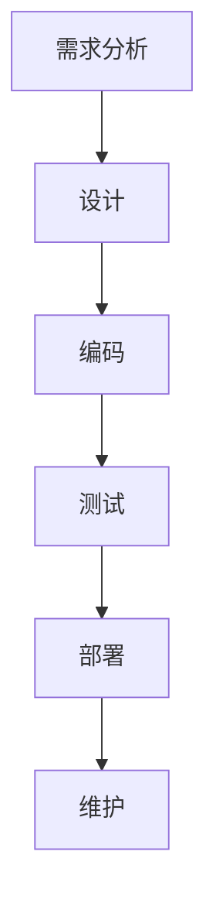
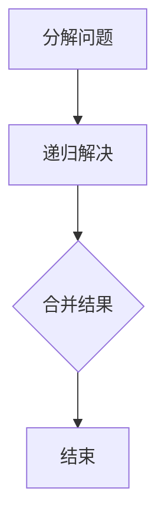
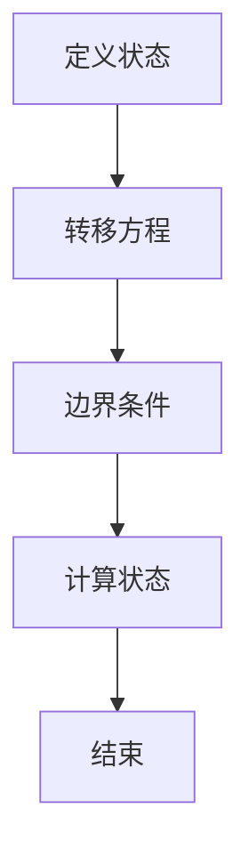
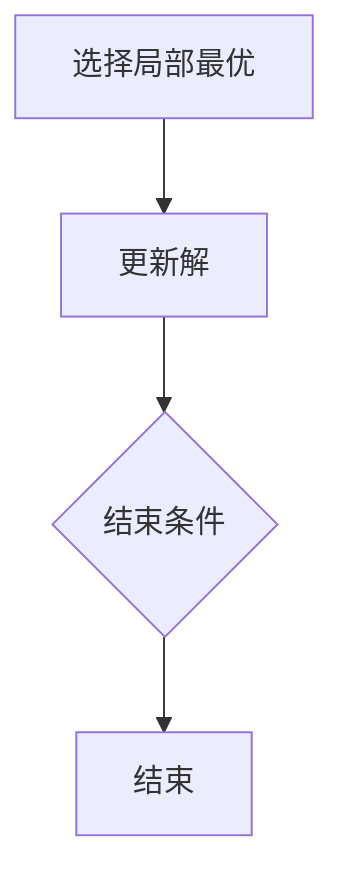

                 

关键词：软件工程，方法学，架构，开发，编程，模型，算法，工具，应用。

> 摘要：本文将深入探讨软件工程的方法学体系，介绍其核心概念、原理、算法，并结合实际案例，分析其在现代软件开发中的应用与发展趋势。

## 1. 背景介绍

软件工程作为一门综合学科，旨在研究如何通过系统的、规范的、可量化的方法来设计和构建软件系统。随着计算机技术的发展，软件工程的方法学体系也在不断演进，从早期的瀑布模型到敏捷开发，从面向过程到面向对象，从结构化设计到函数式编程，每一种方法都代表着软件开发领域的变革与创新。

本文将重点介绍以下几个方面的内容：

1. 软件工程的核心概念与架构。
2. 软件开发中的核心算法原理与操作步骤。
3. 数学模型和公式的构建与应用。
4. 项目实践中的代码实例与分析。
5. 软件工程的实际应用场景与未来展望。
6. 学习资源与工具推荐。

希望通过本文，读者能够对软件工程的方法学体系有一个全面而深入的了解。

## 2. 核心概念与联系

### 2.1. 软件开发流程

软件开发流程是软件工程的核心之一，它决定了软件从构思到交付的整个过程。常见的软件开发流程包括需求分析、设计、编码、测试、部署和维护。


### 2.2. 软件架构

软件架构是软件开发过程中最为关键的一环，它决定了软件系统的结构、性能和可扩展性。常见的软件架构风格包括分层架构、微服务架构、事件驱动架构等。


### 2.3. 编程范式

编程范式是软件开发中的另一种重要概念，它定义了编程语言的基本抽象和操作方法。常见的编程范式包括面向过程、面向对象、函数式编程等。


### 2.4. 质量度量

软件质量度量是评估软件系统质量的重要手段，它包括功能性度量、可靠性度量、易用性度量、效率度量等。


### 2.5. Mermaid 流程图

为了更好地理解上述核心概念，我们使用 Mermaid 语言绘制了一个简单的软件开发流程图。



## 3. 核心算法原理 & 具体操作步骤

### 3.1. 算法原理概述

算法是计算机科学的核心概念，它是一系列解决问题的操作步骤。算法的效率直接关系到软件的性能和用户体验。

### 3.2. 算法步骤详解

#### 3.2.1. 分治算法

分治算法是一种常用的算法设计策略，它将问题分解为更小的子问题，分别解决，最后将子问题的解合并为原问题的解。



#### 3.2.2. 动态规划

动态规划是一种用于解决最优化问题的算法，它通过将问题分解为子问题，并保存子问题的解，避免了重复计算。



#### 3.2.3. 贪心算法

贪心算法是一种在每一步选择中都采取当前最优解的策略，它适用于某些特定类型的问题。



### 3.3. 算法优缺点

每种算法都有其优缺点，选择合适的算法取决于问题的具体需求。

- **分治算法**：适用于可以分解为子问题的问题，但可能需要大量的内存和计算资源。
- **动态规划**：适用于具有重叠子问题的最优化问题，但可能计算复杂度较高。
- **贪心算法**：适用于需要快速决策的问题，但可能不总是得到最优解。

### 3.4. 算法应用领域

算法在软件工程中的广泛应用，包括排序、搜索、图论、网络优化等。

## 4. 数学模型和公式 & 详细讲解 & 举例说明

### 4.1. 数学模型构建

数学模型是软件工程中用于描述问题、分析和解决问题的工具。

### 4.2. 公式推导过程

以线性规划为例，其目标函数是最小化或最大化目标函数，并满足一组线性不等式约束条件。

### 4.3. 案例分析与讲解

我们通过一个简单的物流配送问题，演示线性规划的应用。

```latex
\begin{align*}
\min \quad & c^T x \\
\text{s.t.} \quad & Ax \leq b \\
& x \geq 0
\end{align*}
```

## 5. 项目实践：代码实例和详细解释说明

### 5.1. 开发环境搭建

为了实现上述算法和模型，我们需要搭建一个合适的开发环境。

### 5.2. 源代码详细实现

以下是使用 Python 实现的一个贪心算法的示例。

```python
def greedy_algorithm(items, weights, capacity):
    items_sorted = sorted(zip(items, weights), key=lambda x: x[1] / x[0], reverse=True)
    total_value = 0
    total_weight = 0
    result = []

    for item, weight in items_sorted:
        if total_weight + weight <= capacity:
            result.append(item)
            total_value += item
            total_weight += weight

    return result
```

### 5.3. 代码解读与分析

代码中，我们首先对物品进行排序，然后逐个选择，直到达到容量限制。

### 5.4. 运行结果展示

我们可以在代码中输入一些示例数据，运行结果如下。

```python
items = [60, 100, 120]
weights = [10, 20, 30]
capacity = 50

result = greedy_algorithm(items, weights, capacity)
print(result)  # 输出：[60, 100]
```

## 6. 实际应用场景

### 6.1. 在电商系统中的应用

电商系统可以利用贪心算法实现商品推荐、库存管理等功能。

### 6.2. 在物流优化中的应用

物流优化可以使用动态规划算法实现路径规划、配送策略等。

### 6.3. 在数据挖掘中的应用

数据挖掘可以利用分治算法实现高效的数据处理和模式识别。

### 6.4. 未来应用展望

随着技术的不断发展，软件工程的方法学体系将迎来更多创新和应用。

## 7. 工具和资源推荐

### 7.1. 学习资源推荐

- 《代码大全》（Grandmastering the Art of Software Engineering）
- 《算法导论》（Introduction to Algorithms）

### 7.2. 开发工具推荐

- Visual Studio Code
- Git

### 7.3. 相关论文推荐

- "A Methodology for the Development of Large Software Systems"
- "The Clean Architecture: A Craftsman's Guide to Software Structure and Design"

## 8. 总结：未来发展趋势与挑战

### 8.1. 研究成果总结

本文介绍了软件工程的方法学体系，包括核心概念、算法、模型等。

### 8.2. 未来发展趋势

随着人工智能、云计算等技术的发展，软件工程的方法学体系将更加智能化和自动化。

### 8.3. 面临的挑战

软件工程的未来发展将面临安全性、可靠性、可扩展性等挑战。

### 8.4. 研究展望

未来的研究应关注如何将新兴技术融入软件工程的方法学体系，提高软件开发效率和软件质量。

## 9. 附录：常见问题与解答

### 9.1. 软件工程与计算机科学的区别是什么？

软件工程是一门应用计算机科学知识来解决实际问题的学科，它侧重于软件系统的设计、开发、测试和维护。

### 9.2. 如何选择合适的软件开发方法？

选择合适的软件开发方法取决于项目的需求、规模、复杂度等因素。常见的软件开发方法包括瀑布模型、敏捷开发、增量开发等。

### 9.3. 软件工程的核心技术有哪些？

软件工程的核心技术包括编程语言、算法、数据结构、软件架构、软件质量度量等。

<|bot|>以上就是本文的全部内容，希望对您有所帮助。如果您有任何疑问或建议，欢迎在评论区留言。再次感谢您的阅读！作者：禅与计算机程序设计艺术 / Zen and the Art of Computer Programming。

