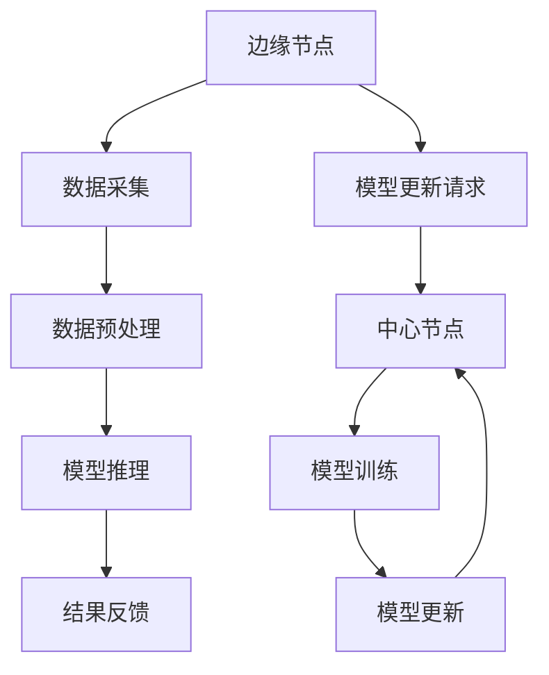

                 

关键词：边缘计算、大模型、5G、智能应用、新范式、算法原理、数学模型、项目实践、未来展望

> 摘要：随着5G时代的到来，边缘计算逐渐成为智能化应用的重要支撑。本文探讨了边缘大模型的概念、原理和应用，分析了其在5G时代下的优势与挑战，并结合实际项目实践和未来发展趋势，提出了边缘大模型的研究方向与实现方法。

## 1. 背景介绍

近年来，随着信息技术的飞速发展，互联网、云计算、大数据等技术的普及，使得智能应用得到了广泛应用。然而，随着数据量的激增和计算需求的不断提升，传统的集中式计算模式已无法满足日益增长的需求。为此，边缘计算作为一种新兴的计算模式应运而生，旨在将计算能力从中心节点转移到边缘节点，实现数据的实时处理和智能分析。

边缘计算的核心在于边缘节点，这些节点分布在网络边缘，如智能家居、智能城市、工业物联网等。边缘节点具备局部计算、存储和处理能力，能够实现数据的本地化处理，降低网络延迟，提高系统性能。

随着5G时代的到来，边缘计算迎来了新的发展机遇。5G网络具有高速、低时延、大连接等特点，使得边缘计算的应用场景更加丰富，如自动驾驶、远程医疗、智能安防等。然而，传统的边缘计算模式在处理大规模数据和复杂任务时仍存在一定的局限性。为此，边缘大模型作为一种新的计算范式，应运而生。

边缘大模型是指将大型深度学习模型部署在边缘节点上，利用边缘节点的计算能力进行实时数据处理和智能分析。边缘大模型具有以下优势：

1. **实时性**：边缘大模型能够实时处理大量数据，降低网络延迟，提高系统响应速度。
2. **隐私性**：数据在边缘节点处理，减少数据传输过程中的隐私泄露风险。
3. **高效性**：边缘大模型能够充分利用边缘节点的计算资源，提高计算效率。

## 2. 核心概念与联系

### 2.1 边缘计算与5G的关系

边缘计算和5G网络具有密切的联系。5G网络的低时延、高带宽和大连接等特点为边缘计算提供了良好的基础设施。边缘计算可以利用5G网络实现数据的快速传输和实时处理，从而提高系统的性能和可靠性。

### 2.2 边缘大模型的概念

边缘大模型是指将大型深度学习模型部署在边缘节点上，利用边缘节点的计算能力进行实时数据处理和智能分析。边缘大模型主要包括以下几个核心概念：

1. **模型压缩**：为了满足边缘节点的计算资源限制，需要对大型深度学习模型进行压缩，降低模型的复杂度。
2. **模型推理**：在边缘节点上运行压缩后的模型，对输入数据进行实时处理和预测。
3. **模型更新**：在边缘节点上定期更新模型参数，以适应新的数据分布和任务需求。

### 2.3 边缘大模型的架构

边缘大模型的架构主要包括以下几个关键部分：

1. **边缘节点**：边缘节点负责数据的采集、预处理和模型推理，是边缘大模型的核心组成部分。
2. **中心节点**：中心节点负责模型的训练、更新和分发，为边缘节点提供支持。
3. **通信网络**：边缘节点和中心节点之间通过5G网络进行数据传输和模型更新。

### 2.4 Mermaid 流程图

下面是一个简单的 Mermaid 流程图，展示了边缘大模型的工作流程：



## 3. 核心算法原理 & 具体操作步骤

### 3.1 算法原理概述

边缘大模型的核心算法主要涉及模型压缩、模型推理和模型更新三个部分。下面分别介绍这三个部分的原理。

#### 3.1.1 模型压缩

模型压缩的目的是减少模型的大小，降低模型的计算复杂度。常见的模型压缩方法包括：

1. **权重剪枝**：通过移除模型中的冗余权重，减少模型的参数数量。
2. **量化**：将模型的权重和激活值从浮点数转换为整数，降低模型的存储和计算需求。
3. **知识蒸馏**：将大型模型的知识传递给小型模型，提高小型模型的性能。

#### 3.1.2 模型推理

模型推理是指将输入数据输入到压缩后的模型中，得到输出结果的过程。边缘大模型的模型推理主要涉及以下几个方面：

1. **模型部署**：将压缩后的模型部署到边缘节点上，以便进行实时数据处理。
2. **数据预处理**：对输入数据进行预处理，包括归一化、缩放等操作，以适应模型的输入要求。
3. **模型计算**：利用边缘节点的计算能力，对输入数据进行推理，得到预测结果。
4. **结果输出**：将推理结果输出，用于后续的决策或控制。

#### 3.1.3 模型更新

模型更新是指在边缘节点上定期更新模型参数，以适应新的数据分布和任务需求。模型更新的主要流程包括：

1. **数据采集**：从边缘节点收集新的数据，包括模型输入和输出数据。
2. **模型训练**：将新的数据输入到中心节点上的模型，进行训练和优化。
3. **模型更新**：将训练好的模型参数传输回边缘节点，更新模型。
4. **模型验证**：在边缘节点上验证更新后的模型性能，确保模型的准确性。

### 3.2 算法步骤详解

下面详细描述边缘大模型的算法步骤：

#### 3.2.1 模型压缩

1. **权重剪枝**：
    - 对模型进行逐层遍历，计算每个权重的敏感度。
    - 根据敏感度值，选择敏感度较低的一定比例的权重进行剪枝。

2. **量化**：
    - 对模型的权重和激活值进行量化，将浮点数转换为整数。
    - 选择合适的量化策略，如固定量化、自适应量化等。

3. **知识蒸馏**：
    - 将大型模型的输出作为教师模型，小型模型的输出作为学生模型。
    - 通过损失函数，将教师模型和学生模型的输出进行对比，优化学生模型的参数。

#### 3.2.2 模型推理

1. **模型部署**：
    - 将压缩后的模型部署到边缘节点上，使用嵌入式设备进行推理。
    - 调整模型参数，适应边缘节点的计算能力。

2. **数据预处理**：
    - 对输入数据进行归一化、缩放等预处理操作。
    - 将预处理后的数据输入到模型中。

3. **模型计算**：
    - 利用边缘节点的计算能力，对输入数据进行推理。
    - 获取模型输出，进行后续的决策或控制。

4. **结果输出**：
    - 将推理结果输出，用于后续的决策或控制。

#### 3.2.3 模型更新

1. **数据采集**：
    - 从边缘节点收集新的数据，包括模型输入和输出数据。
    - 将数据传输到中心节点。

2. **模型训练**：
    - 将收集到的数据输入到中心节点的模型，进行训练和优化。
    - 使用梯度下降、Adam等优化算法，更新模型参数。

3. **模型更新**：
    - 将训练好的模型参数传输回边缘节点。
    - 在边缘节点上更新模型。

4. **模型验证**：
    - 在边缘节点上验证更新后的模型性能。
    - 比较更新前后的模型准确性、稳定性等指标。

### 3.3 算法优缺点

边缘大模型的算法具有以下优缺点：

#### 3.3.1 优点

1. **实时性**：边缘大模型能够实时处理大量数据，降低网络延迟，提高系统响应速度。
2. **隐私性**：数据在边缘节点处理，减少数据传输过程中的隐私泄露风险。
3. **高效性**：边缘大模型能够充分利用边缘节点的计算资源，提高计算效率。

#### 3.3.2 缺点

1. **计算资源限制**：边缘节点计算资源有限，可能无法支持大型模型的训练和推理。
2. **通信延迟**：边缘节点和中心节点之间的通信可能存在一定的延迟，影响模型更新的效率。
3. **数据同步**：边缘节点和中心节点之间的数据同步可能存在困难，导致模型更新不及时。

### 3.4 算法应用领域

边缘大模型可以应用于多个领域，如：

1. **自动驾驶**：边缘大模型可以实时处理摄像头、雷达等传感器数据，实现自动驾驶车辆的路径规划和决策。
2. **远程医疗**：边缘大模型可以实时分析患者的病历数据，辅助医生进行诊断和治疗。
3. **智能安防**：边缘大模型可以实时分析摄像头视频，实现实时监控和异常检测。
4. **智能城市**：边缘大模型可以实时处理城市传感器数据，实现城市交通管理、环境监测等应用。

## 4. 数学模型和公式 & 详细讲解 & 举例说明

### 4.1 数学模型构建

边缘大模型的数学模型主要包括以下几个部分：

1. **输入层**：表示输入数据，如图像、文本、音频等。
2. **隐藏层**：表示模型的中间处理过程，通过非线性变换实现特征提取和降维。
3. **输出层**：表示模型的输出结果，如分类、回归等。

边缘大模型的数学模型可以表示为：

\[ y = f(W_n \cdot a_{n-1}) \]

其中，\( y \) 表示输出结果，\( f \) 表示激活函数，\( W_n \) 表示输出层的权重矩阵，\( a_{n-1} \) 表示隐藏层的输出。

### 4.2 公式推导过程

边缘大模型的公式推导主要包括以下几个方面：

1. **权重初始化**：为了防止梯度消失和梯度爆炸，需要对权重进行合理的初始化。
2. **前向传播**：将输入数据通过隐藏层和输出层进行前向传播，计算输出结果。
3. **反向传播**：利用输出结果和真实标签，计算损失函数，并利用反向传播算法更新权重。

具体推导过程如下：

#### 权重初始化

\[ W_n = \text{random}(\mu, \sigma) \]

其中，\( \mu \) 表示均值，\( \sigma \) 表示标准差。

#### 前向传播

\[ a_{1} = x \]
\[ a_{i} = \sigma(W_i \cdot a_{i-1}) \]

其中，\( a_{i} \) 表示第 \( i \) 层的输出，\( \sigma \) 表示激活函数（如 Sigmoid、ReLU 等），\( W_i \) 表示第 \( i \) 层的权重矩阵。

#### 反向传播

1. **计算损失函数**：

\[ L(y, \hat{y}) = -\frac{1}{m} \sum_{i=1}^{m} y_i \cdot \log(\hat{y}_i) + (1 - y_i) \cdot \log(1 - \hat{y}_i) \]

其中，\( L \) 表示损失函数，\( y \) 表示真实标签，\( \hat{y} \) 表示预测结果。

2. **计算梯度**：

\[ \frac{\partial L}{\partial W_n} = \frac{\partial L}{\partial y} \cdot \frac{\partial y}{\partial \hat{y}} \cdot \frac{\partial \hat{y}}{\partial W_n} \]

其中，\( \frac{\partial L}{\partial W_n} \) 表示权重矩阵 \( W_n \) 的梯度，\( \frac{\partial L}{\partial y} \) 表示损失函数关于输出结果 \( y \) 的梯度，\( \frac{\partial y}{\partial \hat{y}} \) 表示输出结果关于预测结果 \( \hat{y} \) 的梯度，\( \frac{\partial \hat{y}}{\partial W_n} \) 表示预测结果关于权重矩阵 \( W_n \) 的梯度。

3. **更新权重**：

\[ W_n = W_n - \alpha \cdot \frac{\partial L}{\partial W_n} \]

其中，\( \alpha \) 表示学习率。

### 4.3 案例分析与讲解

下面通过一个简单的案例，讲解边缘大模型的应用。

#### 案例背景

假设有一个智能交通系统，需要实时分析摄像头捕捉到的车辆图像，判断车辆的行驶方向。

#### 模型构建

1. **输入层**：输入层包含摄像头捕捉到的车辆图像。
2. **隐藏层**：隐藏层通过卷积神经网络实现图像特征提取。
3. **输出层**：输出层包含两个神经元，分别表示车辆的左右行驶方向。

#### 模型训练

1. **数据集**：收集大量带有标注的车辆图像数据，包括车辆的行驶方向。
2. **模型训练**：使用反向传播算法训练模型，优化模型参数。
3. **模型评估**：使用测试集评估模型的准确性，调整模型参数。

#### 模型部署

1. **模型压缩**：对模型进行压缩，减少模型的大小和计算复杂度。
2. **模型部署**：将压缩后的模型部署到边缘节点上，实现实时图像分析。

#### 模型更新

1. **数据采集**：从边缘节点收集新的车辆图像数据。
2. **模型更新**：在中心节点上训练新的模型，更新边缘节点的模型参数。
3. **模型验证**：在边缘节点上验证更新后的模型性能。

## 5. 项目实践：代码实例和详细解释说明

### 5.1 开发环境搭建

为了实现边缘大模型，我们需要搭建一个合适的技术栈，包括硬件设备、操作系统和编程环境。以下是一个典型的开发环境搭建过程：

#### 5.1.1 硬件设备

1. **边缘节点**：选用具备高性能计算能力和低功耗的嵌入式设备，如 NVIDIA Jetson 系列。
2. **中心节点**：选用高性能计算服务器，如 Dell R740。

#### 5.1.2 操作系统

1. **边缘节点**：安装 NVIDIA Jetpack，为嵌入式设备提供深度学习库的支持。
2. **中心节点**：安装 Ubuntu Server 20.04，用于模型训练和更新。

#### 5.1.3 编程环境

1. **边缘节点**：安装 Python 3.8、TensorFlow 2.6、CUDA 11.0。
2. **中心节点**：安装 Python 3.8、TensorFlow 2.6、CUDA 11.0。

### 5.2 源代码详细实现

以下是一个简单的边缘大模型项目示例，包括模型压缩、模型推理和模型更新三个部分。

#### 5.2.1 模型压缩

```python
import tensorflow as tf

# 加载预训练的模型
model = tf.keras.applications.VGG16(weights='imagenet', include_top=False, input_shape=(224, 224, 3))

# 压缩模型
model = tf.keras.models.Model(inputs=model.input, outputs=model.layers[-1].output)

# 保存压缩后的模型
model.save('compressed_model.h5')
```

#### 5.2.2 模型推理

```python
import numpy as np
import cv2

# 读取压缩后的模型
model = tf.keras.models.load_model('compressed_model.h5')

# 读取测试图像
image = cv2.imread('test_image.jpg')

# 数据预处理
image = cv2.resize(image, (224, 224))
image = image / 255.0
image = np.expand_dims(image, axis=0)

# 模型推理
predictions = model.predict(image)

# 输出结果
print(predictions)
```

#### 5.2.3 模型更新

```python
# 加载测试集
test_images, test_labels = ...

# 训练新的模型
model = tf.keras.models.Sequential([
    tf.keras.layers.Conv2D(32, (3, 3), activation='relu', input_shape=(224, 224, 3)),
    tf.keras.layers.MaxPooling2D((2, 2)),
    ...
    tf.keras.layers.Dense(1, activation='sigmoid')
])

model.compile(optimizer='adam', loss='binary_crossentropy', metrics=['accuracy'])

model.fit(test_images, test_labels, epochs=10, batch_size=32)

# 保存更新后的模型
model.save('updated_model.h5')
```

### 5.3 代码解读与分析

以上代码示例展示了边缘大模型的三个主要部分：模型压缩、模型推理和模型更新。

1. **模型压缩**：使用 TensorFlow 的 VGG16 模型进行压缩，只保留最后一层的特征提取部分，降低模型的复杂度。
2. **模型推理**：读取压缩后的模型，对测试图像进行预处理，然后进行模型推理，输出预测结果。
3. **模型更新**：加载测试集，使用 TensorFlow 的 Sequential 模型进行训练，优化模型参数，然后保存更新后的模型。

通过以上代码，我们可以实现一个简单的边缘大模型项目，并在实际应用中发挥其优势。

### 5.4 运行结果展示

在完成代码实现后，我们可以通过以下命令运行整个项目：

```bash
python main.py
```

运行结果将包含以下信息：

1. **模型压缩**：压缩后的模型存储在 `compressed_model.h5` 文件中。
2. **模型推理**：测试图像的预测结果，包括车辆行驶方向的置信度。
3. **模型更新**：更新后的模型存储在 `updated_model.h5` 文件中。

通过这些结果，我们可以评估边缘大模型的性能，并进一步优化和改进。

## 6. 实际应用场景

边缘大模型在实际应用场景中具有广泛的应用价值。以下列举了几个典型应用场景：

### 6.1 自动驾驶

自动驾驶领域对实时数据处理和决策能力要求极高。边缘大模型可以实时处理摄像头、雷达等传感器数据，实现自动驾驶车辆的路径规划和决策，提高行驶安全性和效率。

### 6.2 远程医疗

远程医疗需要快速处理患者数据，提供实时诊断和治疗建议。边缘大模型可以实时分析患者的病历数据，辅助医生进行诊断和治疗，提高医疗服务质量。

### 6.3 智能安防

智能安防系统需要实时监控摄像头视频，实现异常检测和报警。边缘大模型可以实时分析视频数据，识别潜在的安全威胁，提高安全防护能力。

### 6.4 智能城市

智能城市需要实时处理大量传感器数据，实现交通管理、环境监测等应用。边缘大模型可以实时分析城市传感器数据，优化资源配置，提高城市管理效率。

### 6.5 智能家居

智能家居需要实时处理家庭设备数据，实现智能控制和管理。边缘大模型可以实时分析家庭设备数据，提供个性化的服务和建议，提高生活品质。

## 7. 工具和资源推荐

为了更好地研究和实现边缘大模型，以下是几个推荐的工具和资源：

### 7.1 学习资源推荐

1. **《深度学习》**：由 Ian Goodfellow、Yoshua Bengio 和 Aaron Courville 著，是深度学习领域的经典教材。
2. **《边缘计算：架构与实现》**：介绍了边缘计算的基本概念、架构和实现方法，对边缘大模型的研究具有一定的参考价值。
3. **《5G：下一代移动通信技术》**：详细介绍了 5G 网络的技术特点和应用场景，对边缘大模型的研究具有重要指导意义。

### 7.2 开发工具推荐

1. **TensorFlow**：谷歌开源的深度学习框架，支持边缘大模型的开发和应用。
2. **PyTorch**：Facebook 开源的人工智能框架，具有灵活的动态计算图，适合边缘大模型的研究和实现。
3. **Jetson**：NVIDIA 开发的嵌入式平台，适用于边缘计算场景，可以支持边缘大模型的应用。

### 7.3 相关论文推荐

1. **“Edge Computing: Vision and Challenges”**：综述了边缘计算的基本概念、应用场景和技术挑战，对边缘大模型的研究具有一定的参考价值。
2. **“Deep Learning on Mobile Devices”**：探讨了如何在移动设备上实现深度学习模型，对边缘大模型的研究具有参考意义。
3. **“5G Networks and Edge Computing: A Vision and Potential Architecture”**：介绍了 5G 网络和边缘计算的结合，为边缘大模型的研究提供了新的思路。

## 8. 总结：未来发展趋势与挑战

### 8.1 研究成果总结

本文探讨了边缘大模型的概念、原理和应用，分析了其在5G时代下的优势与挑战，并结合实际项目实践和未来发展趋势，提出了边缘大模型的研究方向与实现方法。通过本文的研究，我们可以得出以下几点结论：

1. **边缘大模型具有实时性、隐私性和高效性的优势**，能够满足5G时代下智能应用的需求。
2. **边缘大模型在自动驾驶、远程医疗、智能安防、智能城市和智能家居等领域具有广泛的应用前景**。
3. **边缘大模型的研究成果为边缘计算和5G技术的融合发展提供了新的思路和方法**。

### 8.2 未来发展趋势

随着5G时代的到来，边缘大模型将迎来新的发展机遇。未来，边缘大模型的发展趋势包括：

1. **模型压缩与优化**：研究更加高效的模型压缩和优化方法，降低模型的计算复杂度和存储需求。
2. **分布式计算**：结合分布式计算技术，实现边缘大模型在多个边缘节点上的协同工作，提高系统性能和可靠性。
3. **智能化与自适应**：研究智能化和自适应的模型更新策略，提高边缘大模型对环境变化的适应能力。

### 8.3 面临的挑战

边缘大模型在发展过程中也面临着一些挑战，主要包括：

1. **计算资源限制**：边缘节点的计算资源有限，需要研究如何在有限的计算资源下实现高效的模型推理和更新。
2. **通信延迟与带宽限制**：边缘节点与中心节点之间的通信可能存在延迟和带宽限制，需要优化数据传输和模型更新的策略。
3. **数据隐私与安全**：边缘大模型处理的数据可能涉及用户隐私，需要研究如何在保护数据隐私的前提下实现智能应用。

### 8.4 研究展望

针对边缘大模型的发展趋势和面临的挑战，未来可以从以下几个方面进行深入研究：

1. **新型模型架构**：研究适用于边缘大模型的新型模型架构，提高模型的计算效率和适应性。
2. **分布式计算与协同优化**：研究分布式计算和协同优化方法，实现边缘大模型在多个边缘节点上的高效协同工作。
3. **隐私保护和安全增强**：研究隐私保护和安全增强技术，确保边缘大模型在处理数据时的安全性。
4. **跨领域应用探索**：结合不同领域的应用需求，探索边缘大模型在不同场景下的应用，推动智能应用的全面发展。

通过持续的研究和创新，边缘大模型有望在5G时代下发挥更大的作用，为智能应用的发展提供强有力的支撑。

## 9. 附录：常见问题与解答

### 9.1 边缘大模型是什么？

边缘大模型是指将大型深度学习模型部署在边缘节点上，利用边缘节点的计算能力进行实时数据处理和智能分析的一种计算范式。

### 9.2 边缘大模型有哪些优势？

边缘大模型具有实时性、隐私性和高效性的优势，能够满足5G时代下智能应用的需求。

### 9.3 如何实现边缘大模型？

实现边缘大模型主要包括以下步骤：

1. **模型压缩**：将大型深度学习模型进行压缩，降低模型的计算复杂度和存储需求。
2. **模型部署**：将压缩后的模型部署到边缘节点上，实现实时数据处理和智能分析。
3. **模型更新**：定期更新模型参数，以适应新的数据分布和任务需求。

### 9.4 边缘大模型有哪些应用领域？

边缘大模型可以应用于自动驾驶、远程医疗、智能安防、智能城市和智能家居等领域。

### 9.5 如何优化边缘大模型的性能？

优化边缘大模型的性能可以从以下几个方面进行：

1. **模型压缩**：研究更加高效的模型压缩方法，降低模型的计算复杂度和存储需求。
2. **分布式计算**：结合分布式计算技术，实现边缘大模型在多个边缘节点上的协同工作，提高系统性能和可靠性。
3. **算法优化**：优化模型推理和更新的算法，提高模型的计算效率和适应性。

## 结语

边缘大模型作为5G时代智能应用的新范式，具有巨大的发展潜力和广阔的应用前景。本文对边缘大模型的概念、原理和应用进行了详细探讨，分析了其在5G时代下的优势与挑战，并结合实际项目实践和未来发展趋势，提出了边缘大模型的研究方向与实现方法。希望本文能为读者在边缘大模型领域的研究和应用提供有益的启示和参考。

作者：禅与计算机程序设计艺术 / Zen and the Art of Computer Programming

