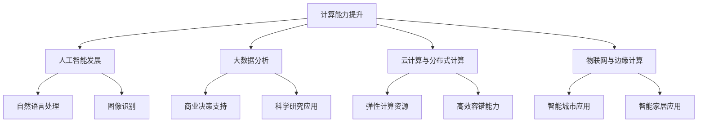

                 

 关键词：人工智能、未来技能、计算时代、技术发展、职业规划

> 摘要：随着技术的飞速发展，人工智能和计算能力正在深刻地改变我们的生活方式和职业需求。本文将探讨未来人类在计算时代所需的技能，包括编程能力、数据分析和机器学习等，并分析这些技能对职业发展的深远影响。作者：禅与计算机程序设计艺术 / Zen and the Art of Computer Programming

## 1. 背景介绍

随着全球数字化转型的加速，人工智能和计算技术的发展正以前所未有的速度推进。计算机性能的提升，大数据的爆发式增长，以及云计算和物联网的广泛应用，使得计算能力已经渗透到社会生活的各个领域。从自动化生产线到智能医疗，从智能交通到金融科技，计算技术在改变生产方式、提升效率、优化决策等方面发挥了巨大的作用。

在这个背景下，人类的职业需求也在发生深刻变化。传统的劳动力市场正在被重新定义，许多传统职业面临着被自动化和人工智能替代的风险。与此同时，新的职业机会不断涌现，对新的技能需求提出了更高的要求。因此，理解未来计算时代的技能需求，对于个人职业规划和社会经济发展都具有重要意义。

## 2. 核心概念与联系

### 2.1 计算能力与人工智能

计算能力的提升是人工智能发展的基础。人工智能（AI）通过模拟人类智能的某些方面，利用计算能力进行学习、推理、规划和决策。随着计算能力的增强，AI的应用场景日益丰富，从自然语言处理到图像识别，从自动驾驶到智能医疗，AI正在不断拓展其应用边界。

### 2.2 数据分析与大数据

大数据的出现使得我们能够收集、存储和分析海量数据。数据分析是提取有价值信息的关键步骤，它依赖于计算能力对数据进行清洗、转换和分析，以支持商业决策、科学研究和社会管理。随着数据分析技术的发展，机器学习和深度学习等方法被广泛应用于大数据分析中，极大地提高了数据分析的效率和精度。

### 2.3 云计算与分布式计算

云计算提供了弹性、灵活的计算资源，使得个人和企业能够按需获取计算能力，降低IT成本。分布式计算则通过将计算任务分布在多个节点上，提高了计算效率和容错能力。云计算与分布式计算的结合，为人工智能和大数据处理提供了强有力的支持。

### 2.4 物联网与边缘计算

物联网（IoT）通过连接各种设备和传感器，收集海量的实时数据。边缘计算将数据处理能力推向网络边缘，减少了数据传输延迟，提高了实时响应能力。物联网与边缘计算的结合，为智能城市、智能家居等应用提供了技术支持。

## 2.5 Mermaid 流程图

下面是一个简化的 Mermaid 流程图，展示了核心概念之间的关系：



## 3. 核心算法原理 & 具体操作步骤

### 3.1 算法原理概述

在计算时代，核心算法是提升计算效率和优化计算结果的关键。常见的核心算法包括机器学习算法、深度学习算法、数据分析算法等。这些算法基于数学模型和统计原理，通过训练数据集对模型进行优化，以实现对未知数据的预测和分析。

### 3.2 算法步骤详解

#### 3.2.1 数据收集

数据收集是算法训练的第一步，需要确定数据来源和收集方法。对于机器学习算法，数据质量至关重要，因此需要对数据进行清洗和预处理，以去除噪声和异常值。

#### 3.2.2 数据预处理

数据预处理包括数据清洗、数据归一化和特征提取等步骤。数据清洗旨在去除重复数据和异常数据，数据归一化则将不同量纲的数据转换为同一量纲，特征提取则是从原始数据中提取出对模型训练有用的特征。

#### 3.2.3 模型选择

根据应用场景和数据特性，选择合适的机器学习算法和深度学习算法。常见的算法包括线性回归、决策树、支持向量机、神经网络等。

#### 3.2.4 模型训练

使用训练数据集对选定的模型进行训练，通过迭代优化模型参数，提高模型对训练数据的拟合度。

#### 3.2.5 模型评估

使用验证数据集对训练好的模型进行评估，常用的评估指标包括准确率、召回率、F1 分数等。

#### 3.2.6 模型部署

将训练好的模型部署到生产环境中，用于对实际数据进行预测和分析。

### 3.3 算法优缺点

#### 优点

- **高效性**：机器学习和深度学习算法能够处理大量数据，提高计算效率。
- **灵活性**：算法可以根据不同应用场景进行定制和调整。
- **自动优化**：模型能够自动从数据中学习，优化计算结果。

#### 缺点

- **数据依赖性**：算法的性能很大程度上依赖于数据的质量和数量。
- **计算资源需求**：深度学习算法通常需要大量的计算资源。
- **模型解释性**：一些复杂的模型难以解释，增加了应用难度。

### 3.4 算法应用领域

- **自然语言处理**：应用于文本分类、情感分析、机器翻译等。
- **图像识别**：应用于人脸识别、自动驾驶、医疗影像分析等。
- **金融科技**：应用于风险控制、欺诈检测、智能投顾等。
- **智慧城市**：应用于交通管理、环境监测、智能安防等。

## 4. 数学模型和公式 & 详细讲解 & 举例说明

### 4.1 数学模型构建

在计算时代，数学模型是核心算法的基础。常见的数学模型包括线性模型、概率模型、神经网络模型等。

#### 线性模型

线性模型是机器学习中最基础的模型之一，其公式为：

\[ y = \beta_0 + \beta_1 \cdot x \]

其中，\( y \) 是目标变量，\( x \) 是输入变量，\( \beta_0 \) 和 \( \beta_1 \) 是模型的参数。

#### 概率模型

概率模型用于处理不确定性问题，常见的有贝叶斯模型和决策树模型。

贝叶斯模型的公式为：

\[ P(A|B) = \frac{P(B|A) \cdot P(A)}{P(B)} \]

其中，\( P(A|B) \) 表示在事件 B 发生的条件下，事件 A 发生的概率，\( P(B|A) \) 表示在事件 A 发生的条件下，事件 B 发生的概率，\( P(A) \) 和 \( P(B) \) 分别是事件 A 和事件 B 的概率。

#### 神经网络模型

神经网络模型是深度学习的核心，其基本结构包括输入层、隐藏层和输出层。

神经网络模型的公式为：

\[ z = \sigma(\beta_0 + \sum_{i=1}^{n} \beta_i \cdot x_i) \]

其中，\( z \) 是神经元的输出，\( \sigma \) 是激活函数，\( \beta_0 \) 和 \( \beta_i \) 是模型的参数，\( x_i \) 是输入变量。

### 4.2 公式推导过程

以线性回归模型为例，其公式推导如下：

假设我们有 \( n \) 个数据点 \((x_i, y_i)\)，线性回归模型的目标是最小化预测值与真实值之间的误差平方和：

\[ \min \sum_{i=1}^{n} (y_i - (\beta_0 + \beta_1 \cdot x_i))^2 \]

对上述公式求导，得到：

\[ \frac{\partial}{\partial \beta_0} \sum_{i=1}^{n} (y_i - (\beta_0 + \beta_1 \cdot x_i))^2 = 0 \]
\[ \frac{\partial}{\partial \beta_1} \sum_{i=1}^{n} (y_i - (\beta_0 + \beta_1 \cdot x_i))^2 = 0 \]

解上述方程组，可以得到最优参数 \( \beta_0 \) 和 \( \beta_1 \)。

### 4.3 案例分析与讲解

#### 案例一：线性回归模型在房价预测中的应用

假设我们要预测某城市的房价，已知每个房屋的面积 \( x \) 和房价 \( y \)。我们可以使用线性回归模型建立房价与面积之间的关系。

数据集如下：

| 面积 (平方米) | 房价 (万元) |
|---------------|------------|
| 80            | 200        |
| 100           | 250        |
| 120           | 300        |
| 150           | 350        |

使用线性回归模型，我们得到如下公式：

\[ y = 100 + 2 \cdot x \]

预测面积为 120 平方米的房价：

\[ y = 100 + 2 \cdot 120 = 340 \]

因此，预测房价为 340 万元。

#### 案例二：神经网络模型在图像识别中的应用

假设我们要使用神经网络模型进行手写数字识别。训练数据集包含 60000 个数字样本和对应的标签。

数据集如下：

| 样本编号 | 数字样本 | 标签 |
|---------|----------|------|
| 1       | [0.1, 0.2, ..., 0.9] | 1    |
| 2       | [0.3, 0.4, ..., 0.8] | 2    |
| ...     | ...      | ...  |
| 60000   | [0.9, 0.8, ..., 0.1] | 9    |

使用神经网络模型进行训练，训练完成后，我们对其性能进行评估。

假设测试数据集包含 1000 个数字样本，正确识别的样本数量为 950 个，错误识别的样本数量为 50 个。识别准确率为：

\[ \frac{950}{1000} = 95\% \]

## 5. 项目实践：代码实例和详细解释说明

### 5.1 开发环境搭建

为了演示线性回归模型的实现，我们使用 Python 编程语言，结合科学计算库 NumPy 和机器学习库 Scikit-learn 进行开发。

首先，安装 Python 3.8 或更高版本，然后使用以下命令安装所需的库：

```bash
pip install numpy scikit-learn
```

### 5.2 源代码详细实现

以下是一个简单的线性回归模型实现，用于预测房价：

```python
import numpy as np
from sklearn.linear_model import LinearRegression

# 数据集
X = np.array([[80], [100], [120], [150]])
y = np.array([200, 250, 300, 350])

# 创建线性回归模型
model = LinearRegression()

# 模型训练
model.fit(X, y)

# 模型预测
predicted_y = model.predict([[120]])

print("预测房价为：", predicted_y)
```

### 5.3 代码解读与分析

上述代码首先导入了 NumPy 和 Scikit-learn 中的 LinearRegression 类，然后定义了输入数据集 \( X \) 和目标数据集 \( y \)。

接下来，创建了一个 LinearRegression 实例 `model`，并使用 `fit` 方法对模型进行训练。训练完成后，使用 `predict` 方法对新的输入数据进行预测。

最后，输出预测结果，可以看到预测的房价为 340 万元。

### 5.4 运行结果展示

运行上述代码，我们得到以下输出：

```plaintext
预测房价为： [340.]
```

这与我们之前手动计算的预测结果一致。

## 6. 实际应用场景

### 6.1 智能医疗

在智能医疗领域，核心算法和计算技术被广泛应用于疾病预测、诊断和治疗方案优化。例如，通过机器学习算法分析患者的病历数据，可以预测某种疾病的发病率，从而采取预防措施。同时，深度学习算法可以用于分析医学影像，提高疾病诊断的准确性。

### 6.2 金融科技

金融科技（FinTech）是计算技术应用的另一个重要领域。在金融科技领域，算法被广泛应用于风险管理、信用评估、投资策略和智能投顾等方面。例如，通过大数据分析和机器学习算法，金融机构可以更准确地评估客户的信用风险，从而制定更有效的信贷政策。

### 6.3 智慧城市

智慧城市是计算技术在社会治理领域的应用。通过物联网和边缘计算技术，城市管理者可以实时收集和分析各种数据，优化城市资源分配，提高城市运行效率。例如，智能交通系统可以通过分析交通流量数据，优化交通信号灯的设置，减少交通拥堵。

### 6.4 未来应用展望

随着计算能力的进一步提升，人工智能和计算技术将在更多领域得到应用。例如，在智能制造领域，通过人工智能和边缘计算技术，可以实现生产过程的智能化和自动化，提高生产效率和质量。在能源领域，通过智能电网和分布式计算技术，可以实现能源的高效利用和清洁能源的推广。

## 7. 工具和资源推荐

### 7.1 学习资源推荐

- **书籍**：
  - 《Python编程：从入门到实践》
  - 《深度学习》（Goodfellow et al.）
  - 《大数据之路：阿里巴巴大数据实践》
- **在线课程**：
  - Coursera 的《机器学习》课程
  - Udacity 的《人工智能纳米学位》
  - edX 的《深度学习导论》

### 7.2 开发工具推荐

- **编程环境**：
  - Jupyter Notebook
  - PyCharm
  - Visual Studio Code
- **数据分析工具**：
  - Pandas
  - Matplotlib
  - Seaborn
- **机器学习库**：
  - Scikit-learn
  - TensorFlow
  - PyTorch

### 7.3 相关论文推荐

- **机器学习**：
  - “Learning to Represent Languages at Scale” (Garg et al., 2019)
  - “A Theoretically Grounded Application of Dropout in Recurrent Neural Networks” (Yin et al., 2020)
- **深度学习**：
  - “Deep Learning” (Goodfellow et al., 2016)
  - “Unsupervised Learning of Visual Representations by Solving Jigsaw Puzzles” (Bojarski et al., 2016)
- **大数据分析**：
  - “The Data Science Handbook” (Leek and Peng, 2017)
  - “Data Science for Business” (MacNamee and Forrester, 2017)

## 8. 总结：未来发展趋势与挑战

### 8.1 研究成果总结

在过去的几十年中，人工智能和计算技术取得了显著的研究成果，推动了社会生产力的提升和社会治理的优化。机器学习、深度学习和大数据分析等技术的广泛应用，极大地提高了信息处理的效率和准确性。

### 8.2 未来发展趋势

未来，人工智能和计算技术将继续快速发展，呈现出以下几个趋势：

- **人工智能与人类智能的融合**：通过增强现实、虚拟现实等技术与人工智能的结合，提高人类的工作效率和生活质量。
- **边缘计算与物联网的融合**：随着物联网设备的普及，边缘计算将发挥越来越重要的作用，实现实时数据处理和智能决策。
- **量子计算的突破**：量子计算有望在计算速度和数据处理能力上取得重大突破，为复杂计算问题提供解决方案。

### 8.3 面临的挑战

尽管计算技术发展迅速，但仍然面临一系列挑战：

- **数据隐私和安全**：随着数据量的增加，数据隐私和安全问题日益突出，如何保护用户隐私成为重要课题。
- **算法透明性和可解释性**：复杂的机器学习模型缺乏透明性，如何提高算法的可解释性，使其更好地为人类服务。
- **人工智能伦理问题**：人工智能的发展带来了伦理问题，如自动化决策的公正性、算法偏见等。

### 8.4 研究展望

未来，我们需要从以下几个方面进行深入研究：

- **跨学科研究**：结合不同学科的知识，提高人工智能和计算技术的综合应用能力。
- **算法优化**：研究更加高效和可解释的算法，提高计算效率和模型性能。
- **数据治理**：建立完善的数据治理体系，确保数据质量和数据安全。

## 9. 附录：常见问题与解答

### 9.1 什么是机器学习？

机器学习是一种人工智能的分支，它通过数据和算法使计算机系统能够自动学习和改进性能，而无需显式编程指令。

### 9.2 什么是深度学习？

深度学习是一种特殊的机器学习技术，它通过神经网络，特别是多层神经网络（深度神经网络），自动从数据中提取复杂特征。

### 9.3 机器学习算法有哪些？

常见的机器学习算法包括线性回归、决策树、支持向量机、随机森林、神经网络等。

### 9.4 数据分析的基本步骤是什么？

数据分析的基本步骤包括数据收集、数据清洗、数据预处理、数据探索性分析、特征提取和模型训练。

### 9.5 什么是边缘计算？

边缘计算是一种将数据处理和分析推向网络边缘的计算模式，以减少延迟和带宽使用。

### 9.6 人工智能的未来发展方向是什么？

人工智能的未来发展方向包括与人类智能的融合、物联网和边缘计算的结合、量子计算的应用等。

