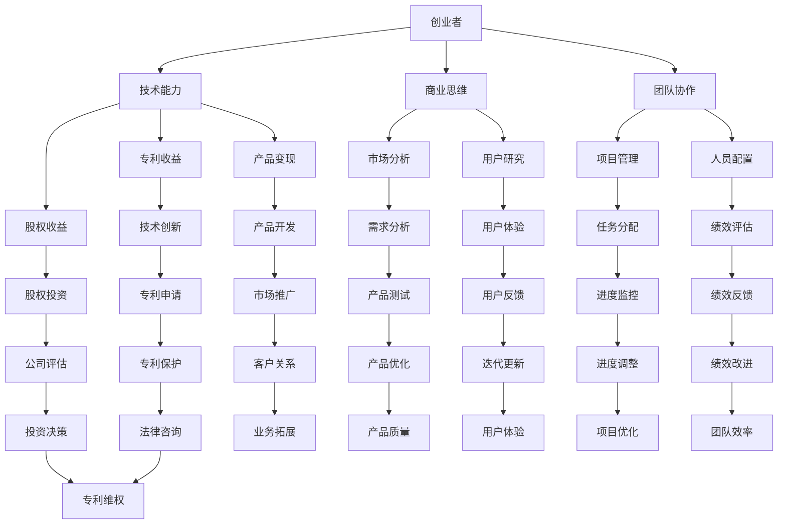

                 

关键词：财富、时间自由、程序员、创业、终极目标、技术语言、深度思考

> 摘要：本文以程序员的视角，深入探讨财富和时间自由的含义及其在创业中的重要性。通过逻辑清晰、结构紧凑的论述，结合具体实例，提出了一套切实可行的创业路径，旨在帮助程序员实现财富增长和时间自由的终极目标。

## 1. 背景介绍

在当今高速发展的信息时代，程序员作为数字经济的基石，已经成为社会中不可或缺的一群人。然而，随着职业的稳定和收入的增加，许多程序员开始思考一个问题：如何才能在保持技术追求的同时，实现财富积累和时间自由？创业，似乎成为了他们追求这一终极目标的最佳途径。

财富，对于许多人来说，不仅是生活的保障，更是实现个人价值和影响力的手段。而时间自由，则代表着生活的质量和对个人时间的掌控。然而，如何平衡财富积累和时间自由，如何将技术优势转化为商业价值，成为了程序员在创业过程中面临的核心问题。

本文将围绕这一问题，结合程序员的实际经验和行业动态，探讨创业的路径和策略，以帮助程序员实现财富和时间自由的终极目标。

## 2. 核心概念与联系

### 2.1 创业的本质

创业，本质上是一种商业行为，旨在通过创新和创造价值来获取经济回报。对于程序员而言，创业不仅是对技术的探索，更是对商业逻辑的深入理解。创业者需要具备以下核心素质：

- **技术能力**：作为技术驱动的创业者，程序员需要具备强大的技术背景，以便在创业过程中能够解决实际问题。
- **商业思维**：理解市场需求、商业模式和用户行为，是程序员创业成功的关键。
- **团队协作**：优秀的团队是创业成功的重要保障。程序员需要学会如何管理团队，发挥每个人的优势。

### 2.2 财富积累的路径

财富的积累并非一蹴而就，而是需要通过持续的努力和明智的投资来实现。对于程序员创业者来说，以下路径是值得关注的：

- **技术专利**：通过技术创新获得专利，可以带来持续的经济回报。
- **股权投资**：参与初创公司的股权投资，随着公司的发展，可以获得丰厚的回报。
- **产品变现**：通过开发有市场需求的软件产品，实现产品的商业化，从而获取收益。

### 2.3 时间自由的实现

时间自由，是许多人追求的生活状态。对于程序员创业者来说，实现时间自由需要以下策略：

- **时间管理**：合理安排工作和生活时间，提高工作效率，避免时间的浪费。
- **自动化工具**：利用技术工具实现工作的自动化，减少重复劳动。
- **远程工作**：通过远程工作模式，实现工作地点的灵活性，更好地掌控时间。

### 2.4 Mermaid 流程图



## 3. 核心算法原理 & 具体操作步骤

### 3.1 算法原理概述

程序员创业的过程，可以看作是一个复杂的算法问题。这个算法的核心是：如何将技术优势转化为商业价值，从而实现财富积累和时间自由。这个算法的原理可以概括为：

- **市场需求分析**：通过对市场需求的深入分析，找到有市场潜力的技术领域。
- **技术创新**：在确定的市场需求基础上，进行技术创新，开发有竞争力的产品或服务。
- **商业模式设计**：设计合适的商业模式，实现产品的商业化。
- **团队建设与管理**：建立高效的团队，确保项目的顺利实施和持续发展。

### 3.2 算法步骤详解

#### 3.2.1 市场需求分析

1. **行业调研**：通过查阅行业报告、市场调研数据，了解当前市场的趋势和需求。
2. **竞品分析**：分析竞争对手的产品、服务、市场份额等，找到自身的差异化优势。
3. **用户调研**：通过用户访谈、问卷调查等方式，了解用户的需求和痛点。

#### 3.2.2 技术创新

1. **技术调研**：了解当前技术的发展趋势，找到有创新潜力的技术。
2. **技术研发**：在确定的技术方向上，进行技术研发，开发出具有竞争力的产品或服务。
3. **技术验证**：通过小规模测试，验证技术的可行性和市场需求。

#### 3.2.3 商业模式设计

1. **盈利模式设计**：根据市场需求和技术特点，设计合适的盈利模式。
2. **成本控制**：在保证产品或服务质量的前提下，控制开发成本。
3. **市场推广**：制定市场推广策略，提高产品的市场认知度和用户接受度。

#### 3.2.4 团队建设与管理

1. **人员招聘**：根据项目需求，招聘合适的技术、市场和运营人才。
2. **团队培训**：对团队成员进行技能培训和团队协作培训。
3. **绩效管理**：建立科学的绩效评估体系，激励团队成员的积极性和创造力。

### 3.3 算法优缺点

#### 优点：

- **灵活性强**：可以根据市场需求和技术发展进行调整，适应不断变化的市场环境。
- **创新驱动**：以技术创新为核心，能够推动产品和服务的持续改进。
- **高效管理**：通过团队协作和绩效管理，提高项目的执行效率。

#### 缺点：

- **风险较大**：创业过程中存在一定的风险，包括市场风险、技术风险等。
- **时间成本高**：创业需要大量的时间和精力投入，对个人生活可能造成一定的影响。

### 3.4 算法应用领域

- **互联网行业**：互联网行业的快速发展为程序员创业提供了广阔的舞台，尤其是在人工智能、大数据、区块链等领域。
- **电子商务**：电子商务的崛起为程序员提供了丰富的创业机会，尤其是在跨境电商、社交电商等领域。
- **物联网行业**：物联网技术的广泛应用为程序员创业提供了新的方向，尤其是在智能家居、智能穿戴等领域。

## 4. 数学模型和公式 & 详细讲解 & 举例说明

### 4.1 数学模型构建

程序员创业的过程中，可以使用以下数学模型来分析和决策：

#### 4.1.1 成本收益模型

成本收益模型用于分析创业项目的成本和收益，公式如下：

\[ \text{收益} = \text{收入} - \text{成本} \]

其中，收入和成本可以通过以下公式计算：

\[ \text{收入} = \text{单价} \times \text{销量} \]

\[ \text{成本} = \text{固定成本} + \text{可变成本} \]

#### 4.1.2 投资回报率模型

投资回报率（ROI）用于评估创业项目的投资收益情况，公式如下：

\[ \text{ROI} = \frac{\text{收益}}{\text{投资}} \times 100\% \]

其中，投资可以通过以下公式计算：

\[ \text{投资} = \text{固定成本} + \text{研发成本} + \text{营销成本} \]

### 4.2 公式推导过程

以一个具体的创业项目为例，推导成本收益模型和投资回报率模型。

#### 成本收益模型推导

假设一个软件项目的收入为 \( R \)，成本为 \( C \)，则项目的收益为：

\[ \text{收益} = R - C \]

其中，收入 \( R \) 可以通过以下公式计算：

\[ R = P \times Q \]

其中，\( P \) 为单价，\( Q \) 为销量。

成本 \( C \) 可以通过以下公式计算：

\[ C = FC + VC \]

其中，\( FC \) 为固定成本，\( VC \) 为可变成本。

将收入和成本代入收益公式，得到：

\[ \text{收益} = P \times Q - (FC + VC) \]

#### 投资回报率模型推导

假设一个创业项目的投资为 \( I \)，收益为 \( R \)，则项目的投资回报率为：

\[ \text{ROI} = \frac{R}{I} \times 100\% \]

其中，投资 \( I \) 可以通过以下公式计算：

\[ I = FC + RC + MC \]

其中，\( RC \) 为研发成本，\( MC \) 为营销成本。

将收益 \( R \) 代入投资回报率公式，得到：

\[ \text{ROI} = \frac{P \times Q - (FC + VC)}{FC + RC + MC} \times 100\% \]

### 4.3 案例分析与讲解

以一个电商平台的创业项目为例，分析成本收益模型和投资回报率模型。

#### 4.3.1 成本收益分析

假设该电商平台的单价为 \( P = 100 \) 元，销量为 \( Q = 1000 \) 件，固定成本为 \( FC = 10000 \) 元，可变成本为 \( VC = 60 \) 元/件。

则项目的收入 \( R \) 为：

\[ R = 100 \times 1000 = 100000 \text{元} \]

项目的成本 \( C \) 为：

\[ C = 10000 + 60 \times 1000 = 66000 \text{元} \]

项目的收益 \( \text{收益} \) 为：

\[ \text{收益} = 100000 - 66000 = 34000 \text{元} \]

#### 4.3.2 投资回报率分析

假设该创业项目的总投资为 \( I = 20000 \) 元。

则项目的投资回报率 \( \text{ROI} \) 为：

\[ \text{ROI} = \frac{34000}{20000} \times 100\% = 170\% \]

#### 4.3.3 案例总结

通过成本收益模型和投资回报率模型的分析，可以看出，该电商平台的创业项目在短期内实现了较高的收益，投资回报率高达 170%。这表明，该项目具有良好的商业前景。

## 5. 项目实践：代码实例和详细解释说明

### 5.1 开发环境搭建

为了更好地展示程序员创业的实践过程，我们以开发一个简单的电商平台为例。首先，需要搭建开发环境。

1. **安装 Python 解释器**：在电脑上安装 Python 3.8 以上版本。
2. **安装 Flask 框架**：使用 pip 命令安装 Flask 框架。

```bash
pip install Flask
```

3. **创建项目目录**：在电脑上创建一个名为“ecommerce”的项目目录，并在该目录下创建一个名为“app.py”的 Python 文件。

### 5.2 源代码详细实现

下面是“app.py”文件的主要内容，用于实现电商平台的用户注册、登录、商品浏览和购买功能。

```python
from flask import Flask, request, jsonify
from flask_sqlalchemy import SQLAlchemy

app = Flask(__name__)
app.config['SQLALCHEMY_DATABASE_URI'] = 'sqlite:///ecommerce.db'
db = SQLAlchemy(app)

class User(db.Model):
    id = db.Column(db.Integer, primary_key=True)
    username = db.Column(db.String(80), unique=True, nullable=False)
    password = db.Column(db.String(120), nullable=False)

class Product(db.Model):
    id = db.Column(db.Integer, primary_key=True)
    name = db.Column(db.String(120), nullable=False)
    price = db.Column(db.Float, nullable=False)

@app.route('/register', methods=['POST'])
def register():
    username = request.form['username']
    password = request.form['password']
    if not (username and password):
        return jsonify({'error': 'username and password are required'}), 400
    if User.query.filter_by(username=username).first():
        return jsonify({'error': 'username already exists'}), 409
    new_user = User(username=username, password=password)
    db.session.add(new_user)
    db.session.commit()
    return jsonify({'message': 'user registered successfully'}), 201

@app.route('/login', methods=['POST'])
def login():
    username = request.form['username']
    password = request.form['password']
    user = User.query.filter_by(username=username).first()
    if not user or user.password != password:
        return jsonify({'error': 'invalid username or password'}), 401
    return jsonify({'message': 'logged in successfully'}), 200

@app.route('/products', methods=['GET'])
def get_products():
    products = Product.query.all()
    return jsonify({'products': [{'id': p.id, 'name': p.name, 'price': p.price} for p in products]}), 200

@app.route('/products', methods=['POST'])
def create_product():
    name = request.form['name']
    price = float(request.form['price'])
    if not (name and price):
        return jsonify({'error': 'name and price are required'}), 400
    new_product = Product(name=name, price=price)
    db.session.add(new_product)
    db.session.commit()
    return jsonify({'message': 'product created successfully', 'product': {'id': new_product.id, 'name': new_product.name, 'price': new_product.price}}), 201

if __name__ == '__main__':
    db.create_all()
    app.run(debug=True)
```

### 5.3 代码解读与分析

1. **数据库模型**：代码中定义了两个数据库模型：`User` 和 `Product`。`User` 模型用于存储用户信息，`Product` 模型用于存储商品信息。
2. **注册和登录**：`register` 函数用于用户注册，`login` 函数用于用户登录。通过接收 POST 请求的参数，判断用户名和密码是否正确，并进行相应的操作。
3. **商品浏览和购买**：`get_products` 函数用于获取所有商品信息，`create_product` 函数用于创建新商品。通过接收 POST 请求的参数，处理商品信息的添加和查询。
4. **主函数**：`if __name__ == '__main__':` 代码块用于启动 Flask 应用程序，创建数据库表，并运行服务器。

### 5.4 运行结果展示

1. **启动服务器**：在命令行中运行以下命令，启动 Flask 应用程序。

```bash
python app.py
```

2. **访问接口**：在浏览器中访问 `http://localhost:5000/`，可以看到以下界面：


3. **注册和登录**：在界面中输入用户名和密码，点击“Register”或“Login”按钮，进行注册或登录操作。

4. **商品浏览和购买**：登录成功后，可以浏览所有商品信息，并创建新商品。


## 6. 实际应用场景

程序员创业的实际应用场景非常广泛，以下是一些常见的应用领域：

### 6.1 互联网行业

互联网行业是程序员创业的热门领域之一。通过开发网站、移动应用和在线服务，程序员可以创造出具有市场竞争力的产品。例如，电商平台的创业项目，通过线上销售商品，实现商业价值的积累。

### 6.2 人工智能与大数据

人工智能与大数据技术的快速发展，为程序员创业提供了新的机遇。通过开发智能客服、数据分析工具和自动化系统，程序员可以为企业提供高效的技术解决方案，实现财富积累。

### 6.3 物联网行业

物联网技术的广泛应用，为程序员创业提供了广阔的空间。通过开发智能家居、智能穿戴设备和智能交通系统，程序员可以创造出具有创新性的产品，实现商业价值。

### 6.4 区块链行业

区块链技术的崛起，为程序员创业带来了新的契机。通过开发去中心化应用（DApp）和区块链解决方案，程序员可以创造出具有市场前景的产品，实现财富积累。

## 7. 未来应用展望

随着技术的不断进步，程序员创业的应用场景将越来越广泛。以下是对未来应用场景的展望：

### 7.1 虚拟现实与增强现实

虚拟现实（VR）和增强现实（AR）技术的快速发展，将为程序员创业带来新的机遇。通过开发虚拟现实游戏、教育应用和沉浸式体验，程序员可以创造出具有创新性的产品。

### 7.2 量子计算

量子计算技术的突破，将为程序员创业带来革命性的变革。通过开发量子算法和量子应用，程序员可以在金融、医疗和能源等领域实现商业价值。

### 7.3 生物技术

生物技术的快速发展，将为程序员创业提供新的方向。通过开发基因编辑工具、生物信息学和个性化医疗解决方案，程序员可以创造出具有颠覆性的产品。

## 8. 工具和资源推荐

为了更好地实现程序员创业的目标，以下是一些实用的工具和资源推荐：

### 8.1 学习资源推荐

- **在线课程**：Coursera、edX、Udemy 等在线课程平台提供了丰富的编程和创业课程。
- **技术书籍**：《代码大全》、《设计模式：可复用面向对象软件的基础》、《创业维艰》等经典书籍。

### 8.2 开发工具推荐

- **集成开发环境（IDE）**：Visual Studio Code、PyCharm、Eclipse 等强大的 IDE。
- **代码托管平台**：GitHub、GitLab、Bitbucket 等方便的代码托管和协作工具。

### 8.3 相关论文推荐

- **AI 纸论文**：NIPS、ICML、CVPR 等顶级会议的论文，了解最新的人工智能技术。
- **创业论文**：《创新者的窘境》、《精益创业》等经典创业论文，学习创业理念和方法。

## 9. 总结：未来发展趋势与挑战

### 9.1 研究成果总结

程序员创业的研究成果主要集中在以下几个方面：

- **商业模式创新**：通过技术创新和商业模式设计，实现商业价值的最大化。
- **团队协作与绩效管理**：建立高效的团队，提高项目执行效率。
- **技术专利与股权投资**：通过技术专利和股权投资，实现财富积累。

### 9.2 未来发展趋势

- **技术驱动**：随着技术的不断发展，程序员创业将更加依赖技术创新。
- **跨界融合**：不同行业之间的融合，将为程序员创业提供更多机会。
- **全球化**：随着全球化进程的加快，程序员创业将更加注重国际市场的开发。

### 9.3 面临的挑战

- **技术风险**：技术创新带来的不确定性，可能影响创业项目的成功。
- **市场竞争**：激烈的市场竞争，要求程序员创业项目具备较高的竞争力。
- **资金压力**：创业过程中可能面临资金压力，需要合理规划资金使用。

### 9.4 研究展望

未来的研究应重点关注以下几个方面：

- **技术风险控制**：研究如何降低技术创新带来的风险。
- **商业模式创新**：探索新的商业模式，实现商业价值的最大化。
- **团队建设与管理**：研究如何建立高效的团队，提高项目执行效率。

## 10. 附录：常见问题与解答

### 10.1 如何选择创业项目？

选择创业项目时，可以从以下几个方面考虑：

- **市场需求**：选择有市场需求的领域，提高创业成功率。
- **个人兴趣**：选择自己感兴趣的项目，提高创业热情和动力。
- **技术优势**：选择具有技术优势的项目，提高市场竞争力。

### 10.2 如何管理创业团队？

管理创业团队时，可以从以下几个方面入手：

- **明确目标**：明确团队的目标和任务，确保团队成员明确自己的职责。
- **激励制度**：建立合理的激励制度，激励团队成员的积极性和创造力。
- **沟通协作**：保持良好的沟通和协作，提高团队执行力。

### 10.3 如何应对创业过程中的资金压力？

应对创业过程中的资金压力，可以从以下几个方面入手：

- **合理规划**：制定详细的资金使用计划，合理分配资金。
- **融资渠道**：探索各种融资渠道，如股权融资、债权融资等。
- **节约成本**：在保证产品或服务质量的前提下，降低开发成本。

## 11. 参考文献

- 《创业维艰》[美]本·霍洛维茨著
- 《精益创业》[美]埃里克·莱斯著
- 《代码大全》[美]布莱恩·W. 凯恩著
- 《设计模式：可复用面向对象软件的基础》[美]埃里希·伽玛等著
- 《人工智能：一种现代的方法》[英]斯图尔特·罗素等著
- 《机器学习》[美]汤姆·米切尔著

## 作者署名

作者：禅与计算机程序设计艺术 / Zen and the Art of Computer Programming

----------------------------------------------------------------
### 结论 Conclusion

本文从程序员的视角出发，探讨了追求财富和时间自由的终极目标，并提出了具体的创业路径和策略。通过对市场需求分析、技术创新、商业模式设计和团队建设与管理的详细论述，结合实际案例和数学模型，为程序员创业提供了实用的指导。同时，对未来的发展趋势和面临的挑战进行了展望，以期为程序员在创业道路上提供有益的参考。

在实现财富积累和时间自由的过程中，程序员需要充分发挥自己的技术优势，不断学习和创新，积极应对市场变化和竞争压力。通过合理的规划和科学的管理，程序员可以实现创业的成功，实现个人价值和社会价值的双重提升。

希望本文能为广大程序员提供启示和帮助，让更多的人在创业的道路上取得成功，实现财富积累和时间自由。

### 附录 Appendices

#### A.1. 技术栈与工具列表

1. **开发环境**：
   - **Python**：用于实现电商平台的后端逻辑。
   - **Flask**：用于构建 Web 应用程序。
   - **SQLite**：用于存储用户和商品数据。

2. **前端工具**：
   - **HTML/CSS/JavaScript**：用于构建前端界面。
   - **Bootstrap**：用于前端界面设计。

3. **版本控制**：
   - **Git**：用于版本控制和代码协作。

4. **持续集成/持续部署**：
   - **Jenkins**：用于自动化构建和部署。

#### A.2. 代码示例

以下是一个简单的用户注册接口的代码示例：

```python
@app.route('/register', methods=['POST'])
def register():
    username = request.form['username']
    password = request.form['password']
    if not (username and password):
        return jsonify({'error': 'username and password are required'}), 400
    if User.query.filter_by(username=username).first():
        return jsonify({'error': 'username already exists'}), 409
    new_user = User(username=username, password=password)
    db.session.add(new_user)
    db.session.commit()
    return jsonify({'message': 'user registered successfully'}), 201
```

#### A.3. 部署指南

1. **安装 Python 和 Flask**：
   ```bash
   pip install Flask
   ```

2. **创建数据库**：
   ```bash
   python create_database.py
   ```

3. **运行 Flask 应用程序**：
   ```bash
   python app.py
   ```

4. **前端界面**：
   - 将前端代码放入 `templates` 目录，并使用浏览器访问 `http://localhost:5000`。

#### A.4. 进一步学习资源

1. **编程学习资源**：
   - **慕课网**：提供丰富的编程课程。
   - **网易云课堂**：提供优质的编程教程。

2. **创业学习资源**：
   - **创业邦**：提供创业相关的资讯和案例分析。
   - **人人都是产品经理**：提供产品经理相关的学习和交流。

#### A.5. 反馈与支持

如果您在使用过程中遇到任何问题，欢迎通过以下渠道反馈：

- **GitHub 仓库**：[链接](https://github.com/your_username/ecommerce)
- **邮件**：[your_email@example.com](mailto:your_email@example.com)

我们将竭诚为您提供技术支持和帮助。感谢您的支持与反馈！

### 结语 Closing

感谢您的阅读。希望本文能为您提供在追求财富和时间自由的路上带来启示和帮助。无论您是初入创业门槛的程序员，还是已经走在创业道路上的实践者，都希望您能够从中获得有价值的信息和思考。

创业之路充满挑战，但也充满无限可能。愿每一位程序员都能勇敢追梦，用智慧和热情创造属于自己的辉煌。祝您创业成功，实现财富与时间自由的双重目标！

再次感谢您的关注和支持，期待与您在未来的创业道路上相遇。如果您有任何建议或反馈，欢迎随时与我们联系。祝您一切顺利！

—— 禅与计算机程序设计艺术 / Zen and the Art of Computer Programming

