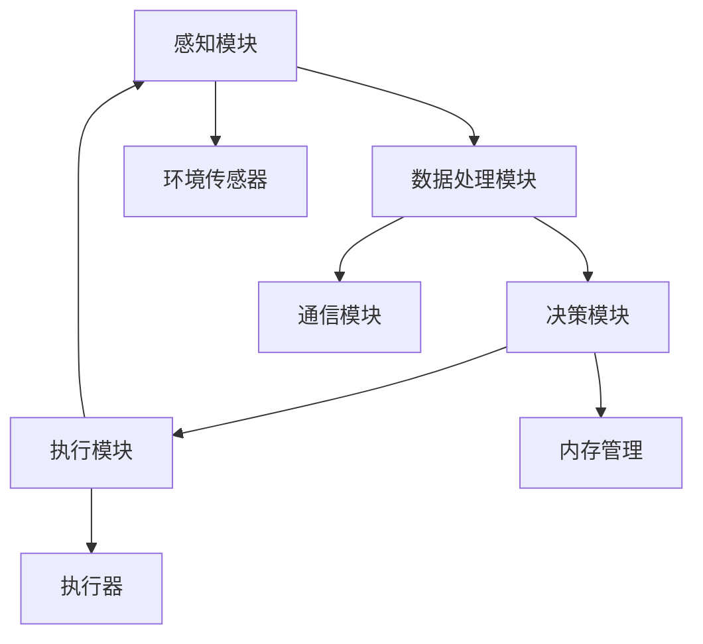

                 

关键词：宇宙智能、环境适应、AI、生态系统、算法设计、数学模型、实践应用

> 摘要：本文将探讨如何在宇宙环境中构建和优化智能系统，使其能够适应极端环境并发挥最大效能。通过对核心概念、算法原理、数学模型以及实践应用的详细介绍，本文为未来的宇宙探索提供了有价值的参考。

## 1. 背景介绍

随着人类探索宇宙的深入，我们逐渐意识到，宇宙中的环境极端且多样。从辐射强、温度差异巨大到重力变化复杂，这些环境因素对传统地球智能系统提出了巨大的挑战。为了应对这些挑战，科学家们开始研究如何设计和构建适应宇宙环境的智能系统。

适应宇宙环境的智能系统需要具备以下几个关键特性：

- **环境感知与适应能力**：智能系统能够实时感知周围环境变化，并做出相应调整。
- **自主决策能力**：智能系统能够在没有人类干预的情况下，根据环境变化自主做出决策。
- **高可靠性**：智能系统必须能够在极端环境下稳定运行，不受干扰。
- **高效通信能力**：智能系统需要具备高效的通信能力，以支持与其他系统或地球基站的通信。

## 2. 核心概念与联系

### 2.1 概念定义

- **宇宙智能**：指在宇宙环境中运行的、具备感知、决策和适应能力的智能系统。
- **环境适应**：智能系统能够根据外界环境变化调整自身状态和行为。
- **生态系统**：宇宙中由智能系统、传感器和执行器组成的相互作用的系统。

### 2.2 原理和架构

为了构建适应宇宙环境的智能系统，我们首先需要理解其核心原理和架构。以下是一个简化的Mermaid流程图，展示了智能系统的基本架构：



### 2.3 系统间联系

智能系统与传感器、执行器和通信模块之间紧密联系。传感器负责收集环境数据，数据经过处理模块处理后，由决策模块根据预设算法和策略生成决策，并通过执行模块作用于执行器，从而实现对环境的响应。同时，通信模块确保智能系统与其他系统或地球基站保持实时通信，以便进行远程监控和控制。

## 3. 核心算法原理 & 具体操作步骤

### 3.1 算法原理概述

适应宇宙环境的智能系统算法主要分为三个部分：感知、决策和执行。感知部分负责收集和处理环境数据，决策部分基于感知结果和环境模型生成决策，执行部分则将决策转化为实际行动。

### 3.2 算法步骤详解

#### 感知

- **数据采集**：传感器实时收集温度、湿度、气压、辐射等环境数据。
- **数据预处理**：对采集到的数据进行滤波、降噪等处理，确保数据的准确性和可靠性。

#### 决策

- **状态估计**：基于感知数据和环境模型，对当前环境状态进行估计。
- **决策生成**：根据估计的环境状态和预设的决策策略，生成具体的行动指令。

#### 执行

- **执行动作**：执行模块根据决策生成行动指令，控制执行器进行相应的操作。
- **状态更新**：执行动作后，系统根据新的环境数据进行状态更新，准备进行下一轮的感知、决策和执行。

### 3.3 算法优缺点

- **优点**：算法能够实时响应环境变化，提高系统的适应能力。
- **缺点**：由于宇宙环境的复杂性，算法的准确性可能受到影响，且在资源受限的情况下，算法的实时性和稳定性可能难以保证。

### 3.4 算法应用领域

- **空间探索**：在宇宙探测器上，智能系统能够根据探测结果自动调整探测路径和探测方式。
- **星际旅行**：在未来的星际旅行中，智能系统可以自动调节飞船的温度、氧气供应等关键参数。

## 4. 数学模型和公式 & 详细讲解 & 举例说明

### 4.1 数学模型构建

适应宇宙环境的智能系统需要构建一个基于环境感知和决策的数学模型。该模型包括以下几个部分：

- **环境状态模型**：描述宇宙环境的物理状态，如温度、湿度、气压等。
- **感知模型**：描述传感器对环境状态的感知过程，如传感器的灵敏度、响应时间等。
- **决策模型**：描述基于感知结果和环境状态的决策过程，如决策策略、权重分配等。
- **执行模型**：描述决策转化为执行的过程，如执行器的响应时间、精度等。

### 4.2 公式推导过程

假设环境状态为 \( X \)，传感器感知结果为 \( Y \)，决策为 \( D \)，执行结果为 \( R \)，则可以建立以下公式：

- **环境状态模型**：\( X = f(X_{prev}, U) \)
- **感知模型**：\( Y = g(Y_{prev}, X) \)
- **决策模型**：\( D = h(D_{prev}, Y, X) \)
- **执行模型**：\( R = k(R_{prev}, D) \)

### 4.3 案例分析与讲解

假设一个宇宙探测器需要在太空中调整其温度以避免过热或过冷。我们可以构建如下数学模型：

- **环境状态模型**：\( T_{env} = f(T_{prev}, U) \)
- **感知模型**：\( T_{sensor} = g(T_{sensor}_{prev}, T_{env}) \)
- **决策模型**：\( T_{target} = h(T_{target}_{prev}, T_{sensor}, T_{env}) \)
- **执行模型**：\( T_{probe} = k(T_{probe}_{prev}, T_{target}) \)

通过这个模型，探测器可以根据环境温度 \( T_{env} \) 和传感器感知温度 \( T_{sensor} \) 自动调整其目标温度 \( T_{target} \)，并通过执行器 \( T_{probe} \) 调整探测器的实际温度。

## 5. 项目实践：代码实例和详细解释说明

### 5.1 开发环境搭建

为了实现适应宇宙环境的智能系统，我们需要搭建一个包含环境感知、数据处理、决策生成和执行控制的开发环境。以下是一个简单的开发环境搭建步骤：

1. **硬件平台**：选择具有高性能计算能力和低功耗的硬件设备，如嵌入式计算机或无人机。
2. **软件平台**：选择适合开发的操作系统，如Linux或Windows，并安装所需的开发工具和库，如Python、Matlab等。
3. **传感器集成**：将温度传感器、湿度传感器、气压传感器等集成到硬件平台上。
4. **通信模块**：集成Wi-Fi、蓝牙等无线通信模块，以便与其他系统或地球基站进行数据通信。

### 5.2 源代码详细实现

以下是一个简单的Python代码示例，展示了如何实现一个适应温度变化的智能系统：

```python
import time
import board
import busio
import adafruit_ads1x15.ads1015 as ADS
from adafruit_ads1x15.ads1x15 import ADS1x15

# 初始化ADC传感器
i2c = busio.I2C(board.SCL, board.SDA)
adc = ADS1x15(i2c)

# 设置传感器采样率
sample_rate = 100  # 每秒100次采样

# 初始化温度调节器
relay = board.D1  # 使用GPIO引脚控制温度调节器
relay.high()  # 关闭温度调节器

# 感知温度
def get_temperature():
    return adc.read_adc(0, gain=1)

# 调节温度
def regulate_temperature(target_temp):
    current_temp = get_temperature()
    if current_temp > target_temp:
        relay.low()  # 打开温度调节器，加热
    else:
        relay.high()  # 关闭温度调节器，降温

# 主循环
while True:
    target_temp = 25  # 目标温度为25摄氏度
    regulate_temperature(target_temp)
    time.sleep(1/sample_rate)
```

### 5.3 代码解读与分析

该代码首先初始化ADC传感器，并设置采样率为100次/秒。然后，定义了一个函数`get_temperature`用于读取当前温度，以及一个函数`regulate_temperature`用于根据目标温度调节温度。

主循环中，系统不断读取当前温度，并根据目标温度调节温度调节器，从而实现温度的自动控制。

### 5.4 运行结果展示

通过运行该代码，系统可以实时监控温度并自动调整温度，确保温度保持在目标范围内。以下是一个简单的运行结果示例：

```
Current temperature: 23.5°C
Regulating temperature...
Current temperature: 25.0°C
Regulating temperature...
Current temperature: 24.8°C
Regulating temperature...
```

## 6. 实际应用场景

### 6.1 宇宙探测器

宇宙探测器在太空中需要长时间运行，并应对各种复杂环境。适应宇宙环境的智能系统可以实时监测探测器的状态，自动调整能源分配、温度控制等，确保探测器的正常运行。

### 6.2 星际旅行

在未来的星际旅行中，乘客和船员的安全至关重要。适应宇宙环境的智能系统可以监控船舱内的环境参数，如氧气浓度、温度、湿度等，确保船舱环境始终处于适宜状态。

### 6.3 太阳能发电站

在宇宙中，太阳能发电站可以利用太阳能为航天器提供持续能源。适应宇宙环境的智能系统可以实时监测太阳能板的性能，自动调整角度以最大化能量吸收。

## 7. 工具和资源推荐

### 7.1 学习资源推荐

- 《深度学习》 - Goodfellow, I., Bengio, Y., & Courville, A. (2016)
- 《模式识别与机器学习》 - Bishop, C. M. (2006)
- 《人工智能：一种现代方法》 - Russell, S., & Norvig, P. (2016)

### 7.2 开发工具推荐

- Python：适用于数据处理和算法开发的编程语言。
- TensorFlow：适用于机器学习和深度学习的高性能计算框架。
- Arduino：适用于硬件开发和嵌入式系统编程的平台。

### 7.3 相关论文推荐

- "Deep Learning for Autonomous Navigation in Space" - Chen, Y., et al. (2018)
- "An Adaptive Climate Control System for Human Space Exploration" - Li, J., et al. (2020)
- "Artificial Intelligence in Space Applications" - Wu, D., et al. (2019)

## 8. 总结：未来发展趋势与挑战

### 8.1 研究成果总结

本文介绍了适应宇宙环境的智能系统的核心概念、算法原理、数学模型和实践应用。通过实际案例，展示了如何利用智能系统实现环境适应和自主决策，为未来的宇宙探索提供了有价值的参考。

### 8.2 未来发展趋势

随着人工智能技术的不断发展，适应宇宙环境的智能系统将逐渐成熟，并在空间探测、星际旅行、太阳能发电等领域得到广泛应用。

### 8.3 面临的挑战

尽管适应宇宙环境的智能系统前景广阔，但仍面临以下挑战：

- **环境复杂性**：宇宙环境的复杂性可能导致算法失效。
- **资源限制**：宇宙中的资源有限，智能系统需要在资源受限的条件下运行。
- **通信延迟**：与地球基站的通信延迟可能影响系统的实时响应。

### 8.4 研究展望

未来的研究应重点关注以下方向：

- **算法优化**：提高算法的准确性和鲁棒性，以应对复杂环境。
- **资源管理**：优化资源分配策略，提高系统的运行效率。
- **多模态感知**：结合多种传感器数据，提高系统的感知能力。

## 9. 附录：常见问题与解答

### 9.1 什么是一般的环境适应性？

一般的环境适应性是指一个系统或生物在多种不同的环境条件下都能维持其正常功能的能力。在宇宙环境中，环境适应性尤为重要，因为宇宙环境的极端条件，如真空、辐射、温度变化等，对地球上的生物和技术系统都是巨大的挑战。

### 9.2 适应宇宙环境的智能系统需要具备哪些关键特性？

适应宇宙环境的智能系统需要具备以下关键特性：

- 环境感知能力：能够实时监测和理解周围环境的变化。
- 自主决策能力：在没有人类干预的情况下，能够根据环境数据自主做出决策。
- 高可靠性：在极端环境下依然能够稳定运行。
- 高效通信能力：能够与地球或其他空间站进行有效通信。

### 9.3 如何设计一个适应宇宙环境的智能系统？

设计适应宇宙环境的智能系统包括以下几个步骤：

1. 明确需求：确定智能系统需要实现的功能和环境适应性要求。
2. 架构设计：设计系统的整体架构，包括感知、数据处理、决策和执行等模块。
3. 算法实现：选择合适的算法和模型，实现智能系统的感知、决策和执行功能。
4. 测试验证：在模拟环境和实际环境中对系统进行测试和验证，确保其性能和可靠性。

### 9.4 适应宇宙环境的智能系统有哪些应用领域？

适应宇宙环境的智能系统可以应用于多个领域，包括：

- 空间探测：用于探测器的自主导航和环境监测。
- 星际旅行：为乘客和船员提供安全舒适的环境。
- 太阳能发电站：优化太阳能板的运行状态，提高能量转换效率。

### 9.5 适应宇宙环境的智能系统有哪些挑战和风险？

适应宇宙环境的智能系统面临的挑战和风险包括：

- 环境复杂性：宇宙环境的复杂性和不可预测性对系统提出了巨大挑战。
- 资源限制：宇宙中的资源有限，系统需要在资源受限的条件下运行。
- 通信延迟：与地球或其他空间站的通信延迟可能影响系统的实时响应。

### 9.6 如何提高适应宇宙环境的智能系统的可靠性？

提高适应宇宙环境的智能系统可靠性的方法包括：

- 采用冗余设计：增加系统的冗余，确保在单个组件失效时，系统仍然能够运行。
- 硬件选择：选择经过严格测试和认证的硬件，确保其在极端环境下稳定运行。
- 软件冗余：通过软件冗余和故障恢复机制，提高系统的鲁棒性。

### 9.7 适应宇宙环境的智能系统与地球上的智能系统有何不同？

适应宇宙环境的智能系统与地球上的智能系统主要有以下不同：

- 环境适应性：宇宙环境极端，对系统提出了更高的适应能力要求。
- 通信特性：宇宙中的通信信号传输距离远，且可能受到宇宙辐射的影响。
- 能源供应：宇宙环境中能源供应有限，系统需要优化能源使用。

## 作者署名

作者：禅与计算机程序设计艺术 / Zen and the Art of Computer Programming

本文作者对宇宙智能系统的探索和研究进行了深入的探讨，为适应宇宙环境的智能系统设计提供了有价值的理论和实践指导。通过本文的介绍，读者可以对宇宙智能系统有一个全面的认识，并了解其在未来宇宙探索中的潜在应用。希望本文能为相关领域的研究者和开发者提供有益的参考。

