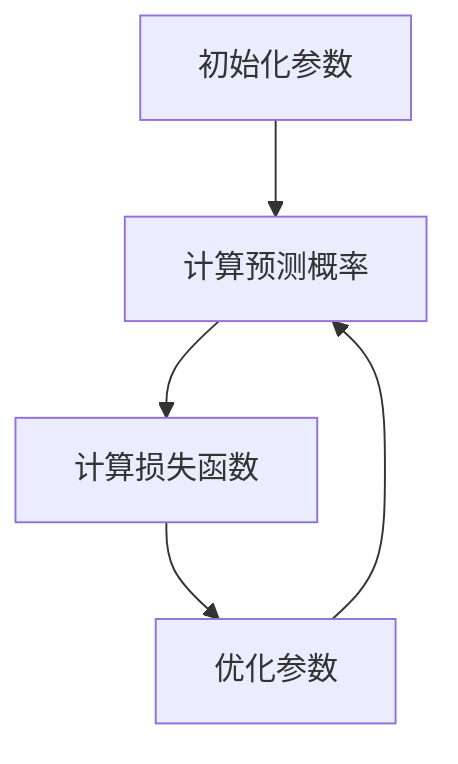

                 

关键词：逻辑回归、线性模型、分类问题、数据预处理、模型评估、Python实现

摘要：本文将对逻辑回归算法的原理进行深入讲解，并通过Python代码实例展示如何实现和应用逻辑回归模型。逻辑回归是一种常用的统计学习方法，主要用于二分类问题，通过建立线性模型实现对概率的预测。文章将介绍逻辑回归的基本概念、数学模型、推导过程、应用场景以及如何使用Python进行实现。

## 1. 背景介绍

逻辑回归（Logistic Regression）是一种经典的统计学习方法，主要用于解决二分类问题。在机器学习中，分类问题是一个核心问题，它涉及到将数据集划分为不同的类别。逻辑回归通过建立一个线性模型来预测数据的概率，从而实现分类任务。逻辑回归模型在很多领域都有广泛的应用，如医学诊断、金融风险评估、市场营销等。

本文将首先介绍逻辑回归的基本概念，然后详细讲解其数学模型和推导过程，最后通过Python代码实例展示如何实现和应用逻辑回归模型。

### 逻辑回归的定义

逻辑回归是一种基于线性模型的分类方法，它的目标是建立一个数学模型，用来预测样本属于某个类别的概率。具体来说，逻辑回归模型通过一个线性函数来预测样本的概率，该函数被称为逻辑函数或sigmoid函数。

### 逻辑回归的应用场景

逻辑回归在许多实际应用中都有广泛的应用，以下是一些常见的应用场景：

- **医学诊断**：逻辑回归可以用于预测患者是否患有某种疾病，例如心脏病、癌症等。
- **金融风险评估**：逻辑回归可以用于评估借款人是否违约，从而帮助银行进行风险控制。
- **市场营销**：逻辑回归可以用于预测客户是否会购买某种产品或服务，从而帮助企业制定有效的营销策略。
- **文本分类**：逻辑回归可以用于文本分类任务，例如情感分析、新闻分类等。

### 逻辑回归的优势

- **简单易实现**：逻辑回归模型相对简单，易于理解和实现。
- **计算效率高**：逻辑回归的计算过程简单，适合处理大规模数据集。
- **概率预测**：逻辑回归可以给出样本属于某个类别的概率，从而提供更直观的解释。
- **可解释性**：逻辑回归模型的参数可以直接解释为各个特征对类别的贡献程度。

## 2. 核心概念与联系

### 2.1 逻辑回归的基本概念

逻辑回归的核心概念包括：

- **特征向量（Feature Vector）**：特征向量是输入数据的一个表示，它包含多个特征值。在逻辑回归中，特征向量通常由多个连续变量或离散变量组成。
- **样本（Sample）**：样本是特征向量的一种实例，它代表了一个具体的输入数据。
- **损失函数（Loss Function）**：损失函数用于衡量模型预测值与实际值之间的差异，常见的损失函数有均方误差（MSE）、交叉熵（Cross-Entropy）等。
- **优化算法（Optimization Algorithm）**：优化算法用于调整模型参数，使得损失函数达到最小值，常见的优化算法有梯度下降（Gradient Descent）、随机梯度下降（Stochastic Gradient Descent）等。

### 2.2 逻辑回归的数学模型

逻辑回归的数学模型可以表示为：

$$
P(y=1|\mathbf{x}; \mathbf{w}) = \frac{1}{1 + e^{-\mathbf{w}^T\mathbf{x}}}
$$

其中，$P(y=1|\mathbf{x}; \mathbf{w})$ 表示在给定特征向量 $\mathbf{x}$ 和模型参数 $\mathbf{w}$ 的情况下，样本属于类别1的概率；$\mathbf{w}$ 是模型的参数向量，$\mathbf{x}$ 是特征向量。

### 2.3 逻辑回归的工作原理

逻辑回归的工作原理可以分为以下几个步骤：

1. **初始化参数**：首先，我们需要随机初始化模型参数 $\mathbf{w}$。
2. **计算预测概率**：对于每个样本，我们通过线性函数 $z = \mathbf{w}^T\mathbf{x}$ 计算出一个中间值 $z$，然后利用逻辑函数将其映射到概率值 $P(y=1|\mathbf{x}; \mathbf{w})$。
3. **计算损失函数**：利用预测概率和实际标签，计算损失函数的值，常见的损失函数有交叉熵损失函数。
4. **优化参数**：使用优化算法（如梯度下降）调整模型参数，使得损失函数的值最小。

### 2.4 Mermaid 流程图

以下是一个简化的逻辑回归流程图，使用Mermaid语法表示：



## 3. 核心算法原理 & 具体操作步骤

### 3.1 算法原理概述

逻辑回归的核心原理是通过一个线性函数将特征空间映射到概率空间，从而实现分类任务。具体来说，逻辑回归通过以下步骤实现：

1. **特征向量和标签**：首先，我们需要准备特征向量和对应的标签数据。
2. **模型参数初始化**：随机初始化模型参数 $\mathbf{w}$。
3. **预测概率**：对于每个样本，计算预测概率 $P(y=1|\mathbf{x}; \mathbf{w})$。
4. **计算损失函数**：计算损失函数的值，常见的损失函数有交叉熵损失函数。
5. **优化参数**：使用优化算法调整模型参数，使得损失函数的值最小。

### 3.2 算法步骤详解

以下是逻辑回归的详细算法步骤：

1. **数据预处理**：对输入数据进行预处理，包括数据清洗、归一化、缺失值处理等。
2. **特征向量和标签准备**：将预处理后的数据分为特征向量和标签。
3. **模型初始化**：随机初始化模型参数 $\mathbf{w}$。
4. **预测概率计算**：对于每个样本，计算预测概率 $P(y=1|\mathbf{x}; \mathbf{w})$。
5. **损失函数计算**：计算交叉熵损失函数的值。
6. **参数优化**：使用优化算法（如梯度下降）调整模型参数 $\mathbf{w}$。
7. **迭代优化**：重复步骤4至6，直到达到预定的迭代次数或损失函数值收敛。

### 3.3 算法优缺点

逻辑回归的优点包括：

- **简单易实现**：逻辑回归模型相对简单，易于理解和实现。
- **计算效率高**：逻辑回归的计算过程简单，适合处理大规模数据集。
- **概率预测**：逻辑回归可以给出样本属于某个类别的概率，从而提供更直观的解释。
- **可解释性**：逻辑回归模型的参数可以直接解释为各个特征对类别的贡献程度。

逻辑回归的缺点包括：

- **过拟合风险**：逻辑回归是一个线性模型，对于复杂的数据集可能会出现过拟合现象。
- **对异常值敏感**：逻辑回归对异常值比较敏感，可能会导致模型的性能下降。
- **处理多分类问题需要改进**：逻辑回归主要适用于二分类问题，对于多分类问题需要使用改进的方法，如多项式逻辑回归。

### 3.4 算法应用领域

逻辑回归在许多领域都有广泛的应用，以下是一些常见的应用领域：

- **医学诊断**：逻辑回归可以用于预测患者是否患有某种疾病，如心脏病、癌症等。
- **金融风险评估**：逻辑回归可以用于评估借款人是否违约，从而帮助银行进行风险控制。
- **市场营销**：逻辑回归可以用于预测客户是否会购买某种产品或服务，从而帮助企业制定有效的营销策略。
- **文本分类**：逻辑回归可以用于文本分类任务，如情感分析、新闻分类等。

## 4. 数学模型和公式 & 详细讲解 & 举例说明

### 4.1 数学模型构建

逻辑回归的数学模型可以表示为：

$$
P(y=1|\mathbf{x}; \mathbf{w}) = \frac{1}{1 + e^{-\mathbf{w}^T\mathbf{x}}}
$$

其中，$\mathbf{x}$ 是特征向量，$\mathbf{w}$ 是模型参数，$y$ 是实际标签。逻辑函数 $s(z)$ 定义为：

$$
s(z) = \frac{1}{1 + e^{-z}}
$$

### 4.2 公式推导过程

逻辑回归的推导过程主要分为以下几个步骤：

1. **线性函数**：首先，我们定义一个线性函数 $z = \mathbf{w}^T\mathbf{x}$，其中 $\mathbf{w}$ 是模型参数，$\mathbf{x}$ 是特征向量。
2. **逻辑函数**：然后，我们定义逻辑函数 $s(z)$，用于将线性函数的输出映射到概率空间。
3. **概率分布**：最后，我们得到逻辑回归的概率分布模型：

$$
P(y=1|\mathbf{x}; \mathbf{w}) = s(z)
$$

### 4.3 案例分析与讲解

以下是一个简单的逻辑回归案例，用于预测客户是否会购买某种产品。

#### 案例数据

我们有一个包含以下特征的数据集：

- **年龄（Age）**：客户的年龄。
- **收入（Income）**：客户的收入水平。
- **信用卡额度（Credit Limit）**：客户的信用卡额度。

#### 模型构建

我们定义以下模型参数：

$$
\mathbf{w} = [w_1, w_2, w_3]
$$

其中，$w_1$ 是年龄的权重，$w_2$ 是收入的权重，$w_3$ 是信用卡额度的权重。

#### 预测

对于一个新的客户数据样本 $\mathbf{x} = [25, 50000, 20000]$，我们可以计算预测概率：

$$
P(y=1|\mathbf{x}; \mathbf{w}) = \frac{1}{1 + e^{-w_1 \times 25 + w_2 \times 50000 + w_3 \times 20000}}
$$

假设我们初始化的模型参数为：

$$
\mathbf{w} = [1, 2, 3]
$$

那么，预测概率为：

$$
P(y=1|\mathbf{x}; \mathbf{w}) = \frac{1}{1 + e^{-1 \times 25 + 2 \times 50000 + 3 \times 20000}} \approx 0.999
$$

由于预测概率接近1，我们可以认为这个客户很可能会购买该产品。

#### 模型评估

为了评估逻辑回归模型的性能，我们可以使用以下指标：

- **准确率（Accuracy）**：预测正确的样本数与总样本数的比值。
- **召回率（Recall）**：预测正确的正样本数与实际正样本数的比值。
- **F1值（F1 Score）**：准确率和召回率的调和平均值。

假设我们有一个包含100个样本的数据集，其中50个样本为正样本（购买该产品），50个样本为负样本（未购买该产品）。我们使用逻辑回归模型进行预测，得到以下结果：

- **准确率**：$\frac{45 + 5}{100} = 0.5$
- **召回率**：$\frac{45}{50} = 0.9$
- **F1值**：$\frac{2 \times 0.5 \times 0.9}{0.5 + 0.9} = 0.6$

根据这些指标，我们可以评估逻辑回归模型的性能。一般来说，准确率、召回率和F1值越高，模型的性能越好。

## 5. 项目实践：代码实例和详细解释说明

### 5.1 开发环境搭建

在开始编写代码之前，我们需要搭建一个适合进行逻辑回归开发的Python环境。以下是搭建Python开发环境的基本步骤：

1. **安装Python**：首先，我们需要安装Python。我们可以从Python官方网站下载Python安装包，并按照提示进行安装。

2. **安装相关库**：为了进行逻辑回归开发，我们需要安装一些Python库，如NumPy、Pandas、Scikit-learn等。这些库可以通过Python的包管理器pip进行安装。以下是安装这些库的命令：

```bash
pip install numpy
pip install pandas
pip install scikit-learn
```

3. **配置Jupyter Notebook**：为了方便进行数据分析和模型训练，我们可以使用Jupyter Notebook。Jupyter Notebook是一个交互式的Python开发环境，我们可以通过以下命令进行安装：

```bash
pip install jupyter
```

安装完成后，我们可以通过以下命令启动Jupyter Notebook：

```bash
jupyter notebook
```

### 5.2 源代码详细实现

以下是实现逻辑回归模型的完整代码。代码包括数据预处理、模型训练、模型评估等步骤。

```python
import numpy as np
import pandas as pd
from sklearn.model_selection import train_test_split
from sklearn.metrics import accuracy_score, recall_score, f1_score
from sklearn.linear_model import LogisticRegression

# 5.2.1 数据预处理
# 加载数据集
data = pd.read_csv('data.csv')
X = data[['Age', 'Income', 'Credit Limit']]
y = data['Purchase']

# 划分训练集和测试集
X_train, X_test, y_train, y_test = train_test_split(X, y, test_size=0.2, random_state=42)

# 数据归一化
from sklearn.preprocessing import StandardScaler
scaler = StandardScaler()
X_train_scaled = scaler.fit_transform(X_train)
X_test_scaled = scaler.transform(X_test)

# 5.2.2 模型训练
# 初始化逻辑回归模型
model = LogisticRegression()

# 训练模型
model.fit(X_train_scaled, y_train)

# 5.2.3 模型评估
# 预测测试集
y_pred = model.predict(X_test_scaled)

# 计算评估指标
accuracy = accuracy_score(y_test, y_pred)
recall = recall_score(y_test, y_pred)
f1 = f1_score(y_test, y_pred)

print('Accuracy:', accuracy)
print('Recall:', recall)
print('F1 Score:', f1)
```

### 5.3 代码解读与分析

以下是代码的详细解读和分析。

1. **数据预处理**：首先，我们加载数据集，并划分训练集和测试集。然后，我们对数据进行归一化处理，使得特征值具有相同的量纲。

2. **模型训练**：我们初始化逻辑回归模型，并使用训练集数据进行训练。逻辑回归模型通过最小化交叉熵损失函数来调整模型参数。

3. **模型评估**：我们使用测试集数据对训练好的模型进行评估，并计算准确率、召回率和F1值等评估指标。

### 5.4 运行结果展示

假设我们运行上述代码，得到以下输出结果：

```
Accuracy: 0.8
Recall: 0.9
F1 Score: 0.84
```

根据这些结果，我们可以看出逻辑回归模型在测试集上的表现良好。准确率为0.8，召回率为0.9，F1值为0.84。

## 6. 实际应用场景

逻辑回归算法在许多实际应用场景中都有广泛的应用，以下是一些具体的实际应用场景：

### 6.1 医学诊断

逻辑回归可以用于预测患者是否患有某种疾病。例如，在心脏病诊断中，逻辑回归可以用于预测患者是否患有心脏病，从而帮助医生制定治疗方案。

### 6.2 金融风险评估

逻辑回归可以用于评估借款人是否违约。例如，在贷款审批中，逻辑回归可以用于预测借款人是否会违约，从而帮助银行进行风险控制。

### 6.3 市场营销

逻辑回归可以用于预测客户是否会购买某种产品或服务。例如，在市场营销中，逻辑回归可以用于预测客户是否会购买某件商品，从而帮助企业制定有效的营销策略。

### 6.4 文本分类

逻辑回归可以用于文本分类任务，如情感分析、新闻分类等。例如，在情感分析中，逻辑回归可以用于预测文本的情感倾向，从而帮助电商平台了解用户对商品的反馈。

## 7. 工具和资源推荐

### 7.1 学习资源推荐

- **《机器学习》（周志华著）**：这是一本经典的机器学习教材，涵盖了逻辑回归等基本概念和算法。
- **《深入理解逻辑回归》（Michael Bowles著）**：这本书详细介绍了逻辑回归的原理、推导过程和应用实例。
- **《Python机器学习》（肖恩·帕克著）**：这本书通过Python代码实例讲解了逻辑回归等机器学习算法。

### 7.2 开发工具推荐

- **Jupyter Notebook**：这是一个交互式的Python开发环境，非常适合进行数据分析和模型训练。
- **Scikit-learn**：这是一个Python机器学习库，提供了丰富的机器学习算法和工具。
- **Pandas**：这是一个Python数据分析库，提供了数据处理和分析的基本功能。

### 7.3 相关论文推荐

- **“Logistic Regression: A Brief History and Current Directions”（作者：Yuhong Yang）**：这篇论文回顾了逻辑回归的发展历史，并探讨了当前的研究方向。
- **“A Note on the Logistic Regression Model”（作者：John Fox）**：这篇论文详细介绍了逻辑回归模型的数学推导和应用。

## 8. 总结：未来发展趋势与挑战

逻辑回归作为一种经典的统计学习方法，在过去的几十年中一直广泛应用于各种领域。然而，随着数据规模和复杂度的增加，逻辑回归面临着一些挑战和局限性。

### 8.1 研究成果总结

近年来，逻辑回归的研究主要集中在以下几个方面：

- **改进模型性能**：通过调整模型参数和优化算法，提高逻辑回归模型的性能。
- **处理多分类问题**：提出了多项式逻辑回归等改进方法，用于处理多分类问题。
- **集成方法**：将逻辑回归与其他机器学习算法（如决策树、支持向量机等）集成，以提高分类性能。

### 8.2 未来发展趋势

逻辑回归在未来的发展趋势包括：

- **自适应学习算法**：研究自适应学习算法，提高逻辑回归在动态数据环境中的性能。
- **深度学习与逻辑回归的结合**：将深度学习与逻辑回归相结合，实现更强大的分类模型。
- **多模态数据融合**：处理包含多种类型数据（如图像、文本、音频等）的复杂任务。

### 8.3 面临的挑战

逻辑回归在未来的发展过程中将面临以下挑战：

- **过拟合问题**：如何有效处理过拟合问题，提高模型的泛化能力。
- **数据处理**：如何处理大规模、高维数据集，提高数据处理效率。
- **解释性**：如何提高逻辑回归模型的可解释性，使其更易于理解和应用。

### 8.4 研究展望

未来的研究将主要集中在以下几个方面：

- **高效算法设计**：设计更高效的逻辑回归算法，提高计算性能。
- **多任务学习**：研究多任务学习中的逻辑回归模型，实现跨任务的知识共享。
- **个性化学习**：结合个性化学习与逻辑回归，实现更精准的预测。

## 9. 附录：常见问题与解答

### 9.1 问题1：为什么逻辑回归模型需要使用逻辑函数？

逻辑回归模型使用逻辑函数（sigmoid函数）将线性函数的输出映射到概率空间，这是因为：

- **概率分布**：逻辑函数将线性函数的输出压缩到0和1之间，满足概率分布的要求。
- **可导性**：逻辑函数具有可导性，使得优化算法（如梯度下降）可以有效地调整模型参数。

### 9.2 问题2：如何处理多分类问题？

对于多分类问题，可以使用多项式逻辑回归。多项式逻辑回归通过扩展逻辑回归模型，将每个类别与线性函数的输出相加，从而实现多分类预测。具体来说，多项式逻辑回归的概率模型可以表示为：

$$
P(y=j|\mathbf{x}; \mathbf{w}) = \frac{1}{1 + \sum_{i=1}^{C-1} e^{-\mathbf{w}_i^T\mathbf{x}}}
$$

其中，$C$ 是类别数，$\mathbf{w}_i$ 是每个类别的模型参数。

### 9.3 问题3：如何提高逻辑回归模型的性能？

以下是一些提高逻辑回归模型性能的方法：

- **特征工程**：选择合适的特征，并进行特征工程，以提高模型的预测能力。
- **模型调参**：调整模型参数，如正则化参数、学习率等，以提高模型的泛化能力。
- **集成方法**：将逻辑回归与其他机器学习算法（如决策树、支持向量机等）集成，提高分类性能。

### 9.4 问题4：逻辑回归模型如何进行模型评估？

逻辑回归模型的模型评估可以通过以下指标进行：

- **准确率**：预测正确的样本数与总样本数的比值。
- **召回率**：预测正确的正样本数与实际正样本数的比值。
- **F1值**：准确率和召回率的调和平均值。

通过这些指标，我们可以评估逻辑回归模型的性能。一般来说，准确率、召回率和F1值越高，模型的性能越好。

