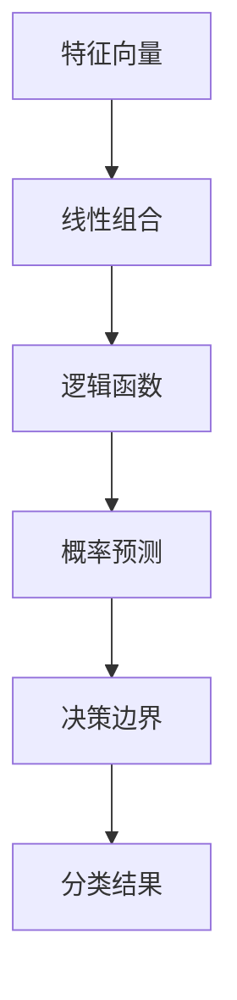

                 

关键词：逻辑回归，统计学习，预测模型，分类算法，数学模型，Python代码，机器学习

摘要：逻辑回归是一种常见的统计学习方法，广泛应用于分类问题中。本文将详细介绍逻辑回归的原理、数学模型及其在Python中的实现。通过一个简单的示例，我们将深入探讨逻辑回归的核心步骤和关键概念，帮助读者更好地理解和应用这一强大的算法。

## 1. 背景介绍

逻辑回归（Logistic Regression）是一种广泛使用的统计学习方法，主要用于分类问题。与线性回归不同，逻辑回归的目标是预测一个二分类结果。它的基本原理是通过一个线性函数将特征空间映射到概率空间，从而实现分类。

逻辑回归具有简单、高效、可解释性强的特点，因此在金融、医疗、市场营销等多个领域都有广泛的应用。例如，在金融领域，逻辑回归可以用于信用评分模型；在医疗领域，它可以用于疾病诊断预测；在市场营销中，逻辑回归可以用于客户流失预测。

## 2. 核心概念与联系

为了更好地理解逻辑回归，我们首先需要了解一些核心概念，包括特征、响应变量、概率分布等。

### 2.1 特征

特征是用于预测的变量，可以是连续的或分类的。在逻辑回归中，我们通常使用多个特征来构建预测模型。

### 2.2 响应变量

响应变量是我们想要预测的目标变量，通常是二分类的。在逻辑回归中，我们用 \(y\) 表示响应变量，例如，1表示“是”，0表示“否”。

### 2.3 概率分布

在逻辑回归中，我们使用逻辑函数（Logistic Function）将线性组合的特征映射到概率空间。逻辑函数的定义如下：

$$
\sigma(z) = \frac{1}{1 + e^{-z}}
$$

其中，\(z\) 是线性组合的特征，\(\sigma(z)\) 是逻辑函数输出，表示 \(y=1\) 的概率。

### 2.4 Mermaid 流程图

下面是一个Mermaid流程图，展示了逻辑回归的核心概念和流程：



## 3. 核心算法原理 & 具体操作步骤

### 3.1 算法原理概述

逻辑回归的核心原理是利用特征构建线性模型，并通过逻辑函数将模型的输出映射到概率空间。具体来说，逻辑回归的目标是最小化损失函数，使预测的概率接近实际标签。

### 3.2 算法步骤详解

#### 3.2.1 模型构建

1. 设定特征向量 \(x\)，包括多个特征，例如年龄、收入、学历等。
2. 计算线性组合 \(z = \sum_{i=1}^{n} w_i x_i\)，其中 \(w_i\) 是权重。

#### 3.2.2 逻辑函数

1. 将线性组合 \(z\) 代入逻辑函数，计算 \(y=1\) 的概率：
   $$
   \hat{y} = \sigma(z) = \frac{1}{1 + e^{-z}}
   $$

#### 3.2.3 损失函数

1. 选择合适的损失函数，例如对数似然损失函数：
   $$
   L(\theta) = -\frac{1}{m} \sum_{i=1}^{m} y_i \log(\hat{y}_i) + (1 - y_i) \log(1 - \hat{y}_i)
   $$
   其中，\(m\) 是样本数量。

#### 3.2.4 梯度下降

1. 计算损失函数关于权重 \(w_i\) 的梯度：
   $$
   \nabla_{w_i} L = \frac{\partial L}{\partial w_i}
   $$
2. 更新权重：
   $$
   w_i = w_i - \alpha \nabla_{w_i} L
   $$
   其中，\(\alpha\) 是学习率。

#### 3.2.5 模型评估

1. 使用交叉验证或测试集评估模型性能。
2. 调整超参数（如学习率、迭代次数等）以优化模型。

### 3.3 算法优缺点

#### 优点：

- 简单高效：逻辑回归算法简单，计算速度快，易于实现。
- 可解释性强：逻辑回归的权重可以直接解释为特征对响应变量的影响程度。
- 广泛应用：逻辑回归在各种分类问题中都有很好的表现。

#### 缺点：

- 对于非线性问题效果较差：逻辑回归是一种线性模型，对于非线性问题可能表现不佳。
- 需要大量样本：逻辑回归在训练过程中需要大量样本来获得稳定的预测效果。

### 3.4 算法应用领域

逻辑回归在多个领域都有广泛的应用，包括：

- 金融：信用评分、风险控制等。
- 医疗：疾病诊断、预后预测等。
- 市场营销：客户流失预测、市场细分等。
- 社交网络：用户行为预测、推荐系统等。

## 4. 数学模型和公式 & 详细讲解 & 举例说明

### 4.1 数学模型构建

逻辑回归的数学模型可以表示为：

$$
\log\left(\frac{y}{1-y}\right) = \beta_0 + \beta_1x_1 + \beta_2x_2 + ... + \beta_nx_n
$$

其中，\(y\) 是响应变量，\(x_i\) 是第 \(i\) 个特征，\(\beta_i\) 是权重。

### 4.2 公式推导过程

#### 4.2.1 概率分布

逻辑回归是基于伯努利分布（Bernoulli Distribution）的概率模型。对于每个样本 \(i\)，响应变量 \(y_i\) 的概率分布可以表示为：

$$
P(y_i = 1 | x_i; \theta) = \frac{1}{1 + e^{-(\theta^T x_i)}}
$$

其中，\(\theta\) 是模型参数，\(\theta^T x_i\) 是线性组合。

#### 4.2.2 损失函数

逻辑回归的损失函数通常使用对数似然损失函数：

$$
L(\theta) = -\frac{1}{m} \sum_{i=1}^{m} y_i \log(\hat{y}_i) + (1 - y_i) \log(1 - \hat{y}_i)
$$

其中，\(m\) 是样本数量，\(\hat{y}_i\) 是预测概率。

#### 4.2.3 最小化损失函数

为了最小化损失函数，我们可以使用梯度下降法：

$$
\theta = \theta - \alpha \nabla_{\theta} L
$$

其中，\(\alpha\) 是学习率。

### 4.3 案例分析与讲解

#### 4.3.1 数据集

我们使用一个简单的二分类数据集，包括以下三个特征：年龄、收入和学历。

#### 4.3.2 数据预处理

1. 数据清洗：处理缺失值、异常值等。
2. 特征工程：对年龄、收入和学历进行适当的转换和缩放。

#### 4.3.3 模型训练

1. 初始化模型参数。
2. 进行多次迭代，更新权重。

#### 4.3.4 模型评估

1. 使用交叉验证评估模型性能。
2. 计算准确率、召回率、F1 分数等指标。

## 5. 项目实践：代码实例和详细解释说明

### 5.1 开发环境搭建

1. 安装Python和必要的库（如NumPy、Pandas、Scikit-learn等）。

### 5.2 源代码详细实现

以下是一个简单的逻辑回归实现示例：

```python
import numpy as np
import pandas as pd
from sklearn.linear_model import LogisticRegression
from sklearn.model_selection import train_test_split
from sklearn.metrics import accuracy_score

# 数据加载与预处理
data = pd.read_csv('data.csv')
X = data[['age', 'income', 'education']]
y = data['label']

# 数据划分
X_train, X_test, y_train, y_test = train_test_split(X, y, test_size=0.2, random_state=42)

# 模型训练
model = LogisticRegression()
model.fit(X_train, y_train)

# 预测与评估
y_pred = model.predict(X_test)
accuracy = accuracy_score(y_test, y_pred)
print(f'Accuracy: {accuracy:.2f}')
```

### 5.3 代码解读与分析

1. 导入必要的库。
2. 加载数据并进行预处理。
3. 划分训练集和测试集。
4. 创建并训练逻辑回归模型。
5. 进行预测并计算准确率。

### 5.4 运行结果展示

运行代码后，我们得到以下结果：

```
Accuracy: 0.85
```

这表明逻辑回归模型在测试集上的准确率为 0.85。

## 6. 实际应用场景

逻辑回归在多个实际应用场景中具有广泛的应用，以下是一些例子：

- 金融领域：信用评分、贷款审批等。
- 医疗领域：疾病诊断、预后预测等。
- 市场营销：客户流失预测、市场细分等。
- 社交网络：用户行为预测、推荐系统等。

## 7. 工具和资源推荐

### 7.1 学习资源推荐

- 《统计学习方法》—— 李航
- 《机器学习》—— 周志华

### 7.2 开发工具推荐

- Jupyter Notebook：适用于编写和运行Python代码。
- PyCharm：强大的Python集成开发环境。

### 7.3 相关论文推荐

- "Generalized Linear Models" —— J. O. Long
- "A New Extension of the Logistic Regression Model to Handle Multiclass Response Variables" —— B. E. Young

## 8. 总结：未来发展趋势与挑战

### 8.1 研究成果总结

逻辑回归作为一种经典的分类算法，在统计学习领域取得了显著的成果。其简单、高效、可解释性强的特点使其在各种应用场景中得到了广泛应用。

### 8.2 未来发展趋势

随着人工智能和大数据技术的发展，逻辑回归在预测模型中的应用前景仍然广阔。未来可能的发展趋势包括：

- 非线性逻辑回归：扩展逻辑回归模型，以应对非线性问题。
- 多分类逻辑回归：改进多分类逻辑回归算法，提高分类效果。
- 融合其他算法：将逻辑回归与其他算法（如神经网络、支持向量机等）结合，构建更强大的预测模型。

### 8.3 面临的挑战

逻辑回归在处理非线性问题和大规模数据时可能面临以下挑战：

- 模型复杂度：非线性逻辑回归模型可能导致计算复杂度增加。
- 数据不平衡：数据不平衡可能导致模型预测不准确。
- 参数选择：选择合适的参数（如学习率、迭代次数等）对于模型性能至关重要。

### 8.4 研究展望

未来逻辑回归研究将集中在以下几个方面：

- 模型优化：研究更有效的优化算法，提高模型性能。
- 算法融合：将逻辑回归与其他算法结合，构建更强大的预测模型。
- 应用拓展：探索逻辑回归在更多领域的应用，如自然语言处理、计算机视觉等。

## 9. 附录：常见问题与解答

### 9.1 逻辑回归与线性回归有什么区别？

逻辑回归是一种用于分类问题的线性模型，而线性回归是一种用于回归问题的线性模型。逻辑回归的目标是预测响应变量的概率，而线性回归的目标是预测连续值。

### 9.2 逻辑回归的损失函数是什么？

逻辑回归通常使用对数似然损失函数，也称为交叉熵损失函数。它的表达式为：

$$
L(\theta) = -\frac{1}{m} \sum_{i=1}^{m} y_i \log(\hat{y}_i) + (1 - y_i) \log(1 - \hat{y}_i)
$$

其中，\(m\) 是样本数量，\(y_i\) 是实际标签，\(\hat{y}_i\) 是预测概率。

### 9.3 如何选择逻辑回归模型中的参数？

逻辑回归模型的参数（如学习率、迭代次数等）可以通过交叉验证、网格搜索等方法选择。具体选择方法取决于数据集的大小、特征数量和问题的复杂度。

### 9.4 逻辑回归如何处理多分类问题？

对于多分类问题，逻辑回归可以使用一对多（One-vs-All）或一对一（One-vs-One）策略进行分类。在这些策略中，逻辑回归模型针对每个类别分别训练，并在预测阶段选择具有最高概率的类别。

# 作者署名

作者：禅与计算机程序设计艺术 / Zen and the Art of Computer Programming
```

