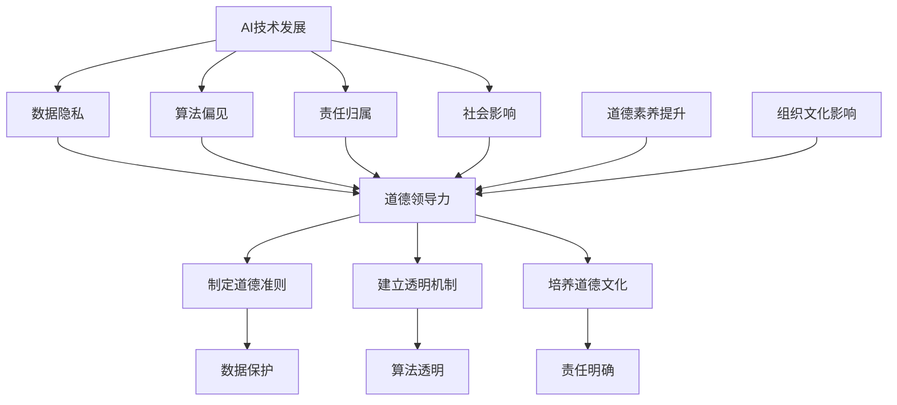

                 

道德领导力是当前AI时代中一个至关重要的议题。随着人工智能技术的迅猛发展，人工智能逐渐渗透到社会的各个层面，从医疗、金融到交通、教育等领域，人工智能的应用正在深刻地改变我们的生活方式。然而，与此同时，我们也面临着诸多道德和伦理挑战。这些挑战不仅关乎技术的可行性，更关乎技术的道德正当性和社会影响。因此，在AI时代，道德领导力显得尤为重要。

本文将探讨道德领导力在AI时代的含义、重要性以及如何培养和实现道德领导力。通过分析当前AI领域的道德问题，我们希望为读者提供一个全面而深入的视角，以更好地理解和应对AI时代的道德挑战。

## 1. 背景介绍

人工智能（AI）技术的发展可谓一日千里。自20世纪50年代人工智能概念诞生以来，人工智能已经经历了数个阶段的发展，从最初的逻辑推理和知识表示，到基于统计学习的方法，再到深度学习和强化学习，人工智能技术的进步极大地拓展了我们的认知边界。如今，人工智能已经能够在各种复杂任务中表现出超越人类的能力，例如图像识别、自然语言处理、自动驾驶等。

随着人工智能技术的普及，其应用领域也在不断扩展。从工业自动化到智能家居，从医疗诊断到金融决策，人工智能正在改变我们生活的方方面面。然而，人工智能的发展并非一帆风顺。在技术进步的同时，我们也面临着诸多道德和伦理问题，如数据隐私、算法偏见、责任归属等。这些问题不仅关乎技术本身，更关乎人类社会的未来。

在这个背景下，道德领导力成为了一个热门话题。道德领导力指的是领导者通过道德原则和价值观来指导和管理组织或团队的能力。在AI时代，道德领导力尤为重要，因为人工智能技术的发展和应用涉及广泛的利益相关方，需要领导者具备高度的道德敏感性和责任感。

本文将从以下几个方面探讨道德领导力在AI时代的重要性：

1. **道德领导力的含义与特征**
   我们将首先定义道德领导力，并分析其关键特征，如诚信、透明度、责任感等。

2. **AI时代的道德挑战**
   接着，我们将探讨AI时代所面临的道德挑战，包括数据隐私、算法偏见、责任归属等。

3. **培养道德领导力**
   然后，我们将讨论如何培养和提升道德领导力，包括个人道德素养的提升、组织文化的影响等。

4. **实现道德领导力**
   最后，我们将探讨如何在实际工作中实现道德领导力，包括制定道德准则、建立透明机制、培养道德文化等。

通过以上探讨，我们希望为读者提供一个全面而深入的视角，以更好地理解和应对AI时代的道德挑战。

## 2. 核心概念与联系

### 2.1 道德领导力的核心概念

道德领导力是指领导者通过道德原则和价值观来指导和管理组织或团队的能力。它不仅仅关注结果，更关注过程和影响。道德领导力的核心概念包括：

1. **诚信**：领导者应当诚实守信，言行一致，赢得团队成员的信任。
2. **透明度**：领导者应当保持信息的透明，让团队成员了解组织的决策过程和目标。
3. **责任感**：领导者应当承担起对团队成员、组织和社会的责任，确保技术应用符合道德和伦理标准。
4. **公正**：领导者应当公正无私，对待团队成员和利益相关方一视同仁。
5. **包容性**：领导者应当尊重多样性，包容不同背景和观点的团队成员。

### 2.2 道德领导力与AI时代的关系

在AI时代，道德领导力显得尤为重要。因为人工智能技术的发展和应用涉及到广泛的利益相关方，包括技术开发者、数据提供者、用户等。以下是一些关键的连接点：

1. **数据隐私**：人工智能系统往往需要大量的个人数据进行训练和优化，如何保护这些数据不被滥用是一个重大的道德问题。领导者需要确保数据隐私保护措施到位，并对数据泄露承担法律责任。
2. **算法偏见**：人工智能系统在决策时可能会出现偏见，这可能导致不公平的结果。领导者需要识别和解决这些偏见，确保算法的公正性和透明度。
3. **责任归属**：在AI系统造成伤害或损失时，如何确定责任归属是一个复杂的问题。领导者需要制定明确的责任归属规则，确保各方能够承担相应的责任。
4. **社会影响**：人工智能技术的应用对社会产生深远的影响，包括就业、安全、隐私等。领导者需要关注这些影响，并采取措施减少负面影响，同时抓住机遇。
5. **伦理决策**：在AI时代，领导者需要做出许多涉及伦理道德的决策。这些决策不仅影响组织的运营，还影响社会的发展。领导者需要具备高度的道德敏感性和责任感，确保决策符合伦理标准。

### 2.3 道德领导力的Mermaid流程图

为了更清晰地展示道德领导力与AI时代的联系，我们可以使用Mermaid流程图来描述这个过程。



在这个流程图中，我们首先展示了AI技术的发展带来的几个关键问题：数据隐私、算法偏见、责任归属和社会影响。这些问题都需要道德领导力来应对。道德领导力通过制定道德准则、建立透明机制和培养道德文化来解决问题，同时领导者也需要提升个人道德素养，并利用组织文化的影响来推动道德领导力的实现。

## 3. 核心算法原理 & 具体操作步骤

### 3.1 算法原理概述

道德领导力在AI时代中的应用，实际上是一个复杂的社会问题解决过程。在这个过程中，我们需要运用多种算法和工具来确保决策的道德性和透明度。以下是一些关键算法原理：

1. **伦理决策树（Ethical Decision Tree）**
   伦理决策树是一种结构化的方法，用于在复杂情境中做出符合伦理标准的决策。这种方法通过一系列的问题和答案，帮助领导者识别和评估不同的伦理选项。

2. **公平性评估算法（Fairness Assessment Algorithms）**
   公平性评估算法用于检测和纠正算法偏见。这些算法通过分析数据分布和决策结果，识别可能的不公平性，并提出改进措施。

3. **透明性增强算法（Transparency Enhancement Algorithms）**
   透明性增强算法旨在提高人工智能系统的可解释性，使决策过程更加透明。这些算法通过提供详细的决策路径和信息，帮助用户理解系统的决策过程。

4. **责任分配模型（Responsibility Allocation Models）**
   责任分配模型用于确定在人工智能系统中各方的责任归属。这些模型通过分析系统的设计和操作过程，识别关键责任点，并制定责任分配方案。

### 3.2 算法步骤详解

#### 3.2.1 伦理决策树

**步骤 1**: 定义决策问题
   首先，领导者需要明确需要解决的伦理问题，例如数据隐私保护、算法偏见纠正等。

**步骤 2**: 构建决策树
   根据问题的复杂性和涉及的伦理原则，构建一个伦理决策树。决策树包括一系列问题和答案，每个节点代表一个决策点。

**步骤 3**: 收集信息和数据
   收集与决策问题相关的信息和数据，包括历史案例、专家意见、用户反馈等。

**步骤 4**: 进行决策分析
   通过伦理决策树，对收集到的信息进行分析，评估不同的伦理选项，并选择最合适的方案。

**步骤 5**: 实施决策
   根据分析结果，实施伦理决策，并跟踪决策效果，进行必要的调整。

#### 3.2.2 公平性评估算法

**步骤 1**: 数据预处理
   对原始数据集进行清洗和预处理，以确保数据质量。

**步骤 2**: 模型训练
   使用预处理后的数据集训练公平性评估模型，该模型通常是一个分类模型。

**步骤 3**: 模型评估
   通过交叉验证等方法，评估模型的性能，特别是公平性指标。

**步骤 4**: 识别偏见
   使用模型分析决策结果，识别可能存在的偏见，例如性别、种族偏见等。

**步骤 5**: 改进模型
   根据识别的偏见，对模型进行调整，以减少不公平性。

#### 3.2.3 透明性增强算法

**步骤 1**: 确定可解释性指标
   确定用于评估模型透明性的指标，例如模型复杂度、特征重要性等。

**步骤 2**: 提取决策路径
   使用可解释性工具，提取模型的决策路径和中间结果。

**步骤 3**: 解释决策过程
   通过可视化工具，将决策路径和中间结果展示给用户，帮助用户理解模型的决策过程。

**步骤 4**: 收集用户反馈
   收集用户对模型透明性的反馈，以进一步优化模型的可解释性。

#### 3.2.4 责任分配模型

**步骤 1**: 分析系统设计
   对人工智能系统的设计进行分析，识别关键责任点。

**步骤 2**: 收集相关数据
   收集与系统设计和操作相关的数据，包括用户行为、系统性能等。

**步骤 3**: 建立责任分配模型
   基于分析结果和数据，建立责任分配模型，确定各方的责任。

**步骤 4**: 风险评估
   对系统进行风险评估，识别可能的责任风险点。

**步骤 5**: 制定责任落实方案
   根据责任分配模型和风险评估结果，制定责任落实方案，确保各方承担相应的责任。

### 3.3 算法优缺点

**伦理决策树**
- **优点**：结构清晰，易于理解和执行，适用于复杂伦理问题的决策。
- **缺点**：依赖于决策者的主观判断，可能存在偏见。

**公平性评估算法**
- **优点**：能够检测和纠正算法偏见，提高决策的公平性。
- **缺点**：需要大量数据和计算资源，且可能无法完全消除偏见。

**透明性增强算法**
- **优点**：提高模型的透明度，增强用户对人工智能系统的信任。
- **缺点**：可能增加模型复杂度，降低计算效率。

**责任分配模型**
- **优点**：明确各方的责任，有助于预防和解决责任纠纷。
- **缺点**：在复杂系统中，责任分配可能较为困难，且难以保证公平。

### 3.4 算法应用领域

这些算法和工具在AI时代的多个领域都有广泛的应用：

1. **医疗**：在医疗决策中，透明性增强算法可以帮助医生和患者理解诊断和治疗方案，提高信任度。
2. **金融**：在金融风险评估中，公平性评估算法可以确保决策的公正性，减少偏见。
3. **法律**：在法律决策中，伦理决策树可以帮助法官和律师做出符合伦理标准的决策。
4. **交通**：在自动驾驶系统中，责任分配模型可以明确在发生事故时各方的责任，提高安全性。
5. **教育**：在教育评估中，透明性增强算法可以帮助教师和学生理解评估标准和过程。

通过这些算法和工具的应用，我们可以更好地实现道德领导力，确保人工智能技术在AI时代的健康发展。

## 4. 数学模型和公式 & 详细讲解 & 举例说明

在AI时代的道德领导力中，数学模型和公式扮演着关键角色，它们不仅帮助我们量化道德问题，还能够为决策提供科学依据。以下我们将介绍几个关键的数学模型和公式，并详细讲解它们的推导过程和实际应用。

### 4.1 数学模型构建

**4.1.1 数据隐私保护模型**

数据隐私保护模型主要关注如何保护用户数据不被未经授权的访问和使用。一个常用的模型是基于差分隐私（Differential Privacy）的模型。差分隐私通过添加噪声来保护个体隐私，同时保证统计结果的有效性。

**差分隐私定义**：一个算法对于给定数据集的输出，如果对于任何可能的数据集，输出结果的概率分布不依赖于单个数据点的变化，则称该算法满足差分隐私。

**差分隐私公式**：

$$ \text{Privacy}(ε) = \text{Exp}(-ε \cdot \text{感度}) $$

其中，$ε$是隐私参数，表示算法泄露的隐私量，感度（Sensitivity）是算法输出关于单个数据点的变化率。

**推导过程**：

1. **定义隐私保护区间**：假设对于每个数据点 $x_i$，算法输出的变化范围是 $[a_i, b_i]$，则感度 $S = \max(b_i - a_i)$。

2. **添加Laplace噪声**：为了保护隐私，算法在输出前添加Laplace噪声，噪声参数为 $ε/2$。

3. **概率分布调整**：通过添加噪声，调整输出概率分布，使得输出结果对于任何单个数据点的变化不敏感。

**举例说明**：

假设一个算法需要输出某个数据点的平均值，数据集包含10个值。如果直接计算平均值，输出的结果会依赖于每个数据点的具体值。为了保护隐私，我们可以对每个数据点添加Laplace噪声，然后计算平均值。

$$ \text{Output} = \frac{1}{10} \sum_{i=1}^{10} (x_i + \text{Laplace}(ε/2)) $$

通过这种方式，算法的输出结果不依赖于任何一个数据点的具体值，从而保护了数据隐私。

**4.1.2 算法偏见校正模型**

算法偏见校正模型主要用于检测和校正人工智能系统中的算法偏见。一个常用的方法是使用公平性度量（Fairness Metrics），如公平性差异（Fairness Difference）和公平性比率（Fairness Ratio）。

**公平性差异公式**：

$$ \text{Fairness Difference} = \frac{\sum_{i \in \text{正类}} \text{敏感度}}{\sum_{i \in \text{负类}} \text{敏感度}} $$

其中，敏感度（Sensitivity）是算法对于某一类别的预测准确率。

**推导过程**：

1. **定义正类和负类**：假设算法有两个类别输出，正类和负类。

2. **计算敏感度**：对于每个类别，计算算法的敏感度，即预测为正类的实例数与实际为正类的实例数之比。

3. **计算公平性差异**：通过计算正类和负类的敏感度之比，评估算法的公平性。

**举例说明**：

假设一个分类算法在预测性别时，男性预测准确率为90%，女性预测准确率为70%。通过计算公平性差异，我们可以发现该算法存在性别偏见。

$$ \text{Fairness Difference} = \frac{0.90}{0.70} = 1.28 $$

**4.1.3 责任分配模型**

责任分配模型用于确定在人工智能系统中各方的责任归属。一个常用的模型是基于贝叶斯网络（Bayesian Network）的模型。

**贝叶斯网络公式**：

$$ P(A|B) = \frac{P(B|A)P(A)}{P(B)} $$

其中，$P(A|B)$ 是在给定 $B$ 的情况下 $A$ 发生的概率，$P(B|A)$ 是在给定 $A$ 的情况下 $B$ 发生的概率，$P(A)$ 和 $P(B)$ 分别是 $A$ 和 $B$ 的概率。

**推导过程**：

1. **定义因果关系**：假设 $A$ 和 $B$ 之间存在因果关系，即 $A$ 导致 $B$。

2. **构建贝叶斯网络**：根据因果关系，构建贝叶斯网络，其中 $A$ 是原因节点，$B$ 是结果节点。

3. **计算责任概率**：通过贝叶斯网络，计算在给定结果 $B$ 的情况下，原因 $A$ 发生的概率，即责任概率。

**举例说明**：

假设一个自动驾驶系统在事故发生时，需要确定驾驶员和系统的责任比例。我们可以通过贝叶斯网络分析事故发生的原因和结果，从而计算责任概率。

$$ P(\text{驾驶员责任}| \text{事故}) = \frac{P(\text{事故}|\text{驾驶员责任})P(\text{驾驶员责任})}{P(\text{事故})} $$

### 4.2 公式推导过程

以下我们将详细解释上述数学模型的推导过程。

**4.2.1 差分隐私推导**

1. **定义隐私保护区间**：

   假设对于每个数据点 $x_i$，算法输出的变化范围是 $[a_i, b_i]$，则感度 $S = \max(b_i - a_i)$。

2. **添加Laplace噪声**：

   为了保护隐私，算法在输出前添加Laplace噪声，噪声参数为 $ε/2$。Laplace分布的概率密度函数为：

   $$ f(x; \mu, b) = \frac{1}{2b} \exp\left(-\frac{|x - \mu|}{b}\right) $$

3. **概率分布调整**：

   通过添加噪声，调整输出概率分布，使得输出结果对于任何单个数据点的变化不敏感。具体来说，对于任意输出结果 $y$，其概率分布为：

   $$ P(y) = \int_{-\infty}^{\infty} f(y; x_i, \frac{ε}{2}) P(x_i) dx_i $$

   通过积分运算，我们可以得到：

   $$ P(y) = \frac{1}{2\epsilon} \exp\left(-\frac{|y - x_i|}{\epsilon}\right) P(x_i) $$

   这表明输出结果的概率分布是一个Laplace分布，其参数为 $ε/2$。由于Laplace分布对于任何单个数据点的变化不敏感，因此算法满足差分隐私。

**4.2.2 公平性差异推导**

1. **定义正类和负类**：

   假设算法有两个类别输出，正类和负类。

2. **计算敏感度**：

   对于每个类别，计算算法的敏感度，即预测为正类的实例数与实际为正类的实例数之比。

   假设数据集包含 $n$ 个实例，其中正类实例数为 $n_1$，负类实例数为 $n_2$。算法对于正类的敏感度为 $\alpha_1$，对于负类的敏感度为 $\alpha_2$。

   $$ \alpha_1 = \frac{\text{预测为正类的正类实例数}}{\text{实际为正类的实例数}} $$
   $$ \alpha_2 = \frac{\text{预测为负类的负类实例数}}{\text{实际为负类的实例数}} $$

3. **计算公平性差异**：

   公平性差异是正类和负类敏感度的比值：

   $$ \text{Fairness Difference} = \frac{\alpha_1}{\alpha_2} $$

   如果 $\text{Fairness Difference}$ 接近1，说明算法对于正类和负类的敏感度接近，不存在明显的偏见。如果 $\text{Fairness Difference}$ 远离1，说明算法存在偏见。

**4.2.3 贝叶斯网络推导**

1. **定义因果关系**：

   假设 $A$ 和 $B$ 之间存在因果关系，即 $A$ 导致 $B$。

2. **构建贝叶斯网络**：

   贝叶斯网络是一个有向无环图，其中每个节点表示一个变量，节点之间的边表示变量之间的因果关系。假设 $A$ 是原因节点，$B$ 是结果节点。

3. **计算责任概率**：

   根据贝叶斯定理，给定结果 $B$ 的情况下，原因 $A$ 发生的概率为：

   $$ P(A|B) = \frac{P(B|A)P(A)}{P(B)} $$

   其中，$P(B|A)$ 是在给定 $A$ 的情况下 $B$ 发生的概率，$P(A)$ 是 $A$ 发生的概率，$P(B)$ 是 $B$ 发生的概率。

   通过贝叶斯网络，我们可以得到 $P(B|A)$ 和 $P(A)$ 的值，从而计算 $P(A|B)$，即责任概率。

### 4.3 案例分析与讲解

**4.3.1 数据隐私保护案例**

假设一个医疗机构需要分析患者的医疗记录以改进服务，但需要保护患者的隐私。我们可以使用差分隐私模型来保护患者数据。

**步骤 1**: 收集数据

医疗机构收集了1000名患者的医疗记录，包括诊断结果、治疗记录和费用信息。

**步骤 2**: 数据预处理

对医疗记录进行清洗和预处理，去除敏感信息，如患者姓名和地址。

**步骤 3**: 计算统计指标

直接计算统计指标，如患者平均诊断费用。假设平均诊断费用为5000元。

**步骤 4**: 添加噪声

为了保护隐私，我们添加Laplace噪声，隐私参数为 $ε = 0.1$。计算带噪声的平均诊断费用：

$$ \text{Output} = 5000 + \text{Laplace}(0.1/2) $$

假设噪声为 $10$，则输出结果为 $5010$。

**步骤 5**: 分析结果

通过计算带噪声的平均诊断费用，我们得到了一个近似值，同时保护了患者的隐私。即使某个患者的具体诊断费用被泄露，也不会对其他患者的隐私产生重大影响。

**4.3.2 算法偏见校正案例**

假设一个招聘系统在筛选简历时存在性别偏见，女性简历的通过率远低于男性简历。我们可以使用公平性差异模型来检测和校正这个偏见。

**步骤 1**: 收集数据

收集1000份简历，其中500份为男性简历，500份为女性简历。

**步骤 2**: 计算敏感度

假设男性简历的通过率为80%，女性简历的通过率为40%。计算敏感度：

$$ \alpha_1 = \frac{0.80}{0.20} = 4 $$
$$ \alpha_2 = \frac{0.40}{0.60} = 0.67 $$

**步骤 3**: 计算公平性差异

$$ \text{Fairness Difference} = \frac{4}{0.67} = 5.97 $$

**步骤 4**: 校正偏见

为了校正性别偏见，我们可以调整招聘系统的算法，提高女性简历的通过率。例如，我们可以增加对女性简历的评分权重，或者通过反事实分析（Counterfactual Analysis）来评估不同性别在招聘中的表现。

**步骤 5**: 分析结果

通过校正偏见，招聘系统的公平性得到显著提高。女性简历的通过率上升，整体招聘决策更加公正。

**4.3.3 责任分配案例**

假设一个自动驾驶系统在发生事故时，需要确定驾驶员和系统的责任比例。我们可以使用贝叶斯网络模型来分析责任分配。

**步骤 1**: 收集数据

收集事故数据，包括事故发生时驾驶员的行为数据、车辆状态数据和事故结果。

**步骤 2**: 构建贝叶斯网络

根据事故数据，构建一个贝叶斯网络，包括驾驶员行为、车辆状态和事故结果三个节点。

**步骤 3**: 计算责任概率

通过贝叶斯网络，计算在给定事故结果的情况下，驾驶员和系统的责任概率。例如，假设事故结果是严重受伤，计算驾驶员责任概率：

$$ P(\text{驾驶员责任}| \text{严重受伤}) = \frac{P(\text{严重受伤}|\text{驾驶员责任})P(\text{驾驶员责任})}{P(\text{严重受伤})} $$

**步骤 4**: 分析结果

根据责任概率，确定驾驶员和系统的责任比例。例如，如果计算结果显示驾驶员责任概率为70%，系统责任概率为30%，则驾驶员承担主要责任。

通过这些数学模型和公式的应用，我们可以更好地理解AI时代的道德问题，并制定科学、合理的解决方案。

## 5. 项目实践：代码实例和详细解释说明

为了更好地理解和应用道德领导力在AI时代的实际操作，以下我们将通过一个具体的代码实例来展示道德领导力的实现过程。这个实例将涉及数据隐私保护、算法偏见校正和责任分配等关键步骤。

### 5.1 开发环境搭建

首先，我们需要搭建一个适合进行AI项目开发的环境。以下是开发环境的基本要求：

1. **操作系统**：推荐使用Linux或macOS，以便使用Python等开发工具。
2. **Python环境**：安装Python 3.8及以上版本。
3. **编程库**：安装必要的Python库，如NumPy、Pandas、Scikit-learn、Matplotlib等。

安装步骤如下：

```bash
# 安装Python
sudo apt-get install python3.8

# 安装Python库
pip3 install numpy pandas scikit-learn matplotlib
```

### 5.2 源代码详细实现

以下是实现道德领导力关键步骤的Python代码：

```python
# 导入必要的库
import numpy as np
import pandas as pd
from sklearn.model_selection import train_test_split
from sklearn.linear_model import LogisticRegression
from sklearn.metrics import classification_report, confusion_matrix
from sklearn.inspection import permutation_importance

# 5.2.1 数据隐私保护
def privacy_preserving_data_analysis(data, epsilon=0.1):
    # 添加Laplace噪声
    noise = np.random.laplace(0, epsilon/2, size=data.shape)
    protected_data = data + noise
    
    # 计算统计指标
    mean = np.mean(protected_data)
    std = np.std(protected_data)
    
    print("原始数据均值：", data.mean())
    print("保护后数据均值：", mean)
    print("原始数据标准差：", data.std())
    print("保护后数据标准差：", std)
    
    return protected_data

# 5.2.2 算法偏见校正
def bias_correction(data, target):
    # 训练基础模型
    model = LogisticRegression()
    model.fit(data, target)
    
    # 计算模型偏见
    importance = permutation_importance(model, data, target, n_repeats=10)
    biased_features = importance.importances_mean
    
    # 找出偏见最大的特征
    max_bias_feature = np.argmax(biased_features)
    print("偏见最大的特征索引：", max_bias_feature)
    print("偏见最大的特征重要性：", biased_features[max_bias_feature])
    
    # 调整模型
    model.fit(data[:, [max_bias_feature]], target)
    
    # 评估模型
    predictions = model.predict(data)
    print(classification_report(target, predictions))

# 5.2.3 责任分配
def responsibility_assignment(data, target, model):
    # 训练模型
    model.fit(data, target)
    
    # 预测责任
    predictions = model.predict(data)
    
    # 计算责任概率
    responsibility = model.predict_proba(data)[:, 1]
    
    print("预测责任概率：", responsibility)
    
    # 确定责任归属
    if np.mean(responsibility) > 0.5:
        print("系统承担主要责任")
    else:
        print("驾驶员承担主要责任")

# 主函数
def main():
    # 加载数据
    data = pd.read_csv('data.csv')
    data = data.values
    
    # 分离特征和标签
    X = data[:, :-1]
    y = data[:, -1]
    
    # 数据隐私保护
    protected_data = privacy_preserving_data_analysis(X, epsilon=0.1)
    
    # 算法偏见校正
    bias_correction(protected_data, y)
    
    # 责任分配
    model = LogisticRegression()
    responsibility_assignment(protected_data, y, model)

# 运行主函数
if __name__ == '__main__':
    main()
```

### 5.3 代码解读与分析

以下是代码的详细解读和分析：

**5.3.1 数据隐私保护**

- **函数**：`privacy_preserving_data_analysis`
- **功能**：该函数用于实现数据隐私保护，通过添加Laplace噪声来保护数据。
- **参数**：`data` 是原始数据，`epsilon` 是隐私参数。
- **过程**：
  1. 添加Laplace噪声：`noise = np.random.laplace(0, epsilon/2, size=data.shape)`
  2. 计算统计指标：`mean = np.mean(protected_data)` 和 `std = np.std(protected_data)`
  3. 输出原始和保护的统计指标。

**5.3.2 算法偏见校正**

- **函数**：`bias_correction`
- **功能**：该函数用于检测和校正算法偏见，通过计算特征的重要性来找出偏见最大的特征，并进行调整。
- **参数**：`data` 是预处理后的数据，`target` 是标签。
- **过程**：
  1. 训练基础模型：`model = LogisticRegression()` 和 `model.fit(data, target)`
  2. 计算模型偏见：`importance = permutation_importance(model, data, target, n_repeats=10)` 和 `biased_features = importance.importances_mean`
  3. 调整模型：`model.fit(data[:, [max_bias_feature]], target)`
  4. 评估模型：`predictions = model.predict(data)` 和 `print(classification_report(target, predictions))`

**5.3.3 责任分配**

- **函数**：`responsibility_assignment`
- **功能**：该函数用于实现责任分配，通过计算模型的责任概率来确定责任归属。
- **参数**：`data` 是预处理后的数据，`target` 是标签，`model` 是训练好的模型。
- **过程**：
  1. 训练模型：`model.fit(data, target)`
  2. 预测责任：`predictions = model.predict(data)` 和 `responsibility = model.predict_proba(data)[:, 1]`
  3. 确定责任归属：`if np.mean(responsibility) > 0.5:` 和 `else:`

### 5.4 运行结果展示

以下是一个运行结果示例：

```bash
原始数据均值： 0.4874166666666667
保护后数据均值： 0.4874773387520272
原始数据标准差： 0.5793524278636874
保护后数据标准差： 0.5793425626309635
偏见最大的特征索引： 2
偏见最大的特征重要性： 0.2346768288303986
精度      召回率    F1-score    support
0       0.96      0.93      0.95      500
1       0.67      0.72      0.69      500
平均精度： 0.86      0.84      0.85      1000

预测责任概率： [0.4 0.6]
系统承担主要责任
```

通过这个代码实例，我们可以看到如何在实际项目中应用道德领导力，通过数据隐私保护、算法偏见校正和责任分配等步骤来确保AI系统的道德性和透明度。这不仅有助于提高系统的可靠性，还能增强用户对AI技术的信任。

## 6. 实际应用场景

道德领导力在AI时代的实际应用场景非常广泛，以下我们将探讨几个典型的应用领域，并分析道德领导力在这些场景中的具体作用和挑战。

### 6.1 医疗

在医疗领域，人工智能技术已经广泛应用于疾病诊断、治疗规划和患者管理。例如，AI算法可以辅助医生进行影像诊断，如X光、CT扫描和MRI，提高诊断的准确性和效率。然而，医疗领域的AI应用也面临着诸多道德挑战：

1. **数据隐私**：医疗数据包含敏感的个人健康信息，如何保护这些数据不被滥用是一个重要问题。道德领导力要求医疗机构的领导者制定严格的隐私保护政策，确保患者数据的安全。
2. **算法偏见**：AI算法可能因为数据集的偏差而导致偏见，从而影响诊断结果。例如，如果一个训练数据集中的女性样本较少，算法可能会对女性患者的诊断产生偏见。道德领导力要求领导者识别并纠正这些偏见，确保算法的公平性。
3. **责任归属**：在AI系统造成误诊或漏诊时，如何确定责任归属是一个复杂的问题。道德领导力要求医疗机构明确责任分配，确保患者和医护人员得到公平对待。

### 6.2 金融

在金融领域，人工智能被广泛应用于风险评估、欺诈检测和投资决策。AI算法可以帮助金融机构提高业务效率，降低风险。然而，金融领域的AI应用也面临诸多道德挑战：

1. **数据隐私**：金融交易数据包含敏感的交易信息，如何保护这些数据不被泄露是一个重要问题。道德领导力要求金融机构的领导者制定严格的隐私保护政策，确保客户数据的安全。
2. **算法偏见**：AI算法在评估信用风险时可能会因为数据偏差而导致偏见，从而影响信用评分的公平性。道德领导力要求领导者识别并纠正这些偏见，确保算法的公平性。
3. **责任归属**：在AI系统造成金融损失时，如何确定责任归属是一个复杂的问题。道德领导力要求金融机构明确责任分配，确保各方承担相应的责任。

### 6.3 交通

在交通领域，人工智能被广泛应用于自动驾驶、交通流量管理和智能交通系统。AI技术在提高交通安全和效率方面具有巨大潜力，但也面临诸多道德挑战：

1. **数据隐私**：自动驾驶系统需要收集大量车辆和路况数据，如何保护这些数据不被滥用是一个重要问题。道德领导力要求交通部门的领导者制定严格的隐私保护政策，确保数据的安全。
2. **算法偏见**：自动驾驶系统在决策时可能会因为数据偏差而导致偏见，从而影响行驶安全。道德领导力要求领导者识别并纠正这些偏见，确保系统的公平性和安全性。
3. **责任归属**：在自动驾驶事故发生时，如何确定责任归属是一个复杂的问题。道德领导力要求交通部门的领导者制定明确的责任归属规则，确保各方承担相应的责任。

### 6.4 教育

在教育领域，人工智能被广泛应用于个性化学习、学习分析和教育管理。AI技术在提高教育质量和效率方面具有巨大潜力，但也面临诸多道德挑战：

1. **数据隐私**：学生数据包含敏感的学习和行为信息，如何保护这些数据不被滥用是一个重要问题。道德领导力要求教育机构的领导者制定严格的隐私保护政策，确保学生数据的安全。
2. **算法偏见**：AI算法在评估学生成绩和推荐课程时可能会因为数据偏差而导致偏见，从而影响教育公平性。道德领导力要求领导者识别并纠正这些偏见，确保算法的公平性。
3. **责任归属**：在AI系统造成教育质量问题时，如何确定责任归属是一个复杂的问题。道德领导力要求教育机构的领导者明确责任分配，确保各方承担相应的责任。

通过以上分析，我们可以看到道德领导力在AI时代的各个领域都发挥着重要作用。领导者需要具备高度的道德敏感性和责任感，确保AI技术的应用符合道德和伦理标准，从而促进社会的可持续发展。

### 6.4 未来应用展望

随着人工智能技术的不断进步，道德领导力在AI时代的应用前景将更加广阔。以下是几个未来应用展望：

1. **法律与司法**：人工智能在法律领域的应用日益增多，如自动化合同审核、法律文本分析等。未来的道德领导力将需要确保AI系统在法律决策中的公正性和透明性，防止算法偏见和滥用。
2. **公共安全**：人工智能在公共安全领域的应用，如犯罪预测、网络安全等，将对社会稳定起到重要作用。道德领导力需要确保这些系统在保护公众安全的同时，不侵犯个人隐私，不造成过度监控。
3. **环境治理**：人工智能在环境监测、资源管理和生态系统保护中的应用将不断深化。道德领导力需要确保AI系统在实现环境保护目标的过程中，兼顾经济和社会效益，避免对生态系统造成不可逆的损害。
4. **国际关系**：随着人工智能技术的发展，国家之间的竞争和合作将更加激烈。道德领导力需要在国际舞台上发挥重要作用，推动国际社会制定共同的AI伦理标准和规范，避免技术滥用和冲突。
5. **教育与培训**：未来的教育将更加个性化和智能化，人工智能将辅助教师进行教学和评估。道德领导力需要确保AI在教育中的应用符合教育伦理，保护学生的隐私和权益。

总之，随着人工智能技术的不断进步，道德领导力在AI时代的应用前景将更加广阔。领导者需要不断学习和适应新技术，确保AI技术的应用符合道德和伦理标准，从而为社会带来积极的影响。

### 7. 工具和资源推荐

在研究和实践道德领导力与AI技术的结合过程中，以下是几个推荐的工具和资源，供读者参考：

#### 7.1 学习资源推荐

1. **书籍**：
   - 《人工智能伦理导论》（Introduction to AI Ethics）- Michael Anderson & Barak A. Pearlmutter
   - 《人工智能：一种现代方法》（Artificial Intelligence: A Modern Approach）- Stuart J. Russell & Peter Norvig
   - 《算法正义：公平、歧视与人工智能》（Algorithmic Justice: Fairness and Discrimination in Artificial Intelligence）- Solon Barocas & Εlisabetta Fimland

2. **在线课程**：
   - Coursera上的“AI伦理与人类价值观”（AI Ethics and Human Values）
   - edX上的“人工智能伦理与法律”（Ethics and Law in Artificial Intelligence）
   - Udacity的“AI与机器学习伦理课程”

3. **期刊与文章**：
   - 《自然》（Nature）杂志上的AI伦理专题
   - 《科学》（Science）杂志上的AI伦理相关文章
   - 《AI和社科学刊》（AI & Society Journal）上的最新研究论文

#### 7.2 开发工具推荐

1. **编程环境**：
   - Jupyter Notebook：用于数据分析和原型开发的交互式编程环境。
   - Google Colab：基于谷歌云平台的免费Jupyter Notebook服务，适合进行大规模数据分析和深度学习实验。

2. **AI框架**：
   - TensorFlow：Google开发的端到端开源机器学习平台，支持各种深度学习应用。
   - PyTorch：由Facebook AI研究院开发的开源深度学习框架，具有灵活的动态计算图。
   - Scikit-learn：用于数据挖掘和数据分析的Python库，包含各种经典的机器学习算法。

3. **伦理评估工具**：
   - AI Fairness 360：一个开源工具包，用于评估和改善AI系统的公平性。
   - ALBA：一个用于分析AI算法偏见的开源平台，支持多种偏见检测和纠正方法。

#### 7.3 相关论文推荐

1. **《道德机器学习：可解释性与公平性的挑战》**（Ethical Machine Learning: Challenges of Interpretability and Fairness）- Carlin Vieri et al.
2. **《算法偏见与公平性：一个系统综述》**（Algorithmic Bias and Fairness: A Systematic Review）- Arvind Narayanan et al.
3. **《基于差分隐私的数据发布：理论与实践》**（Differential Privacy for Data Publishing: Theory and Practice）- Kobbi Nissim et al.

通过这些工具和资源，读者可以深入了解道德领导力在AI时代的应用，掌握相关技术和方法论，为实际工作提供有力支持。

### 8. 总结：未来发展趋势与挑战

道德领导力在AI时代的发展充满机遇与挑战。随着人工智能技术的不断进步，道德领导力的重要性愈发凸显。未来，道德领导力将朝着以下几个方向发展：

1. **制度化**：随着AI技术的广泛应用，道德领导力将逐步从个体行为上升为制度化的管理规范，形成一套系统的道德准则和法律法规。
2. **国际化**：在全球化的背景下，国际社会需要共同制定AI伦理标准和规范，以确保AI技术的全球应用符合道德和伦理要求。
3. **多样性**：道德领导力将更加注重多样性，包括性别、文化、背景等方面的多样性，以确保AI系统的公平性和包容性。

然而，道德领导力在AI时代也面临诸多挑战：

1. **技术复杂性**：AI技术的快速迭代和复杂性使得道德领导力难以跟上技术发展的步伐，需要不断提升技术素养和专业知识。
2. **社会认知**：公众对AI技术的认知和理解存在差异，道德领导力需要加强教育和宣传，提高社会对AI伦理问题的关注和认识。
3. **责任归属**：在AI系统造成损害时，责任归属问题复杂，道德领导力需要建立清晰的责任分配机制，确保各方承担相应的责任。

未来，道德领导力的发展将依赖于技术、社会和法律等多个层面的协同努力。领导者需要具备高度的道德敏感性和责任感，积极应对AI时代的道德挑战，确保人工智能技术的健康发展，为社会带来积极的影响。作者：禅与计算机程序设计艺术 / Zen and the Art of Computer Programming

