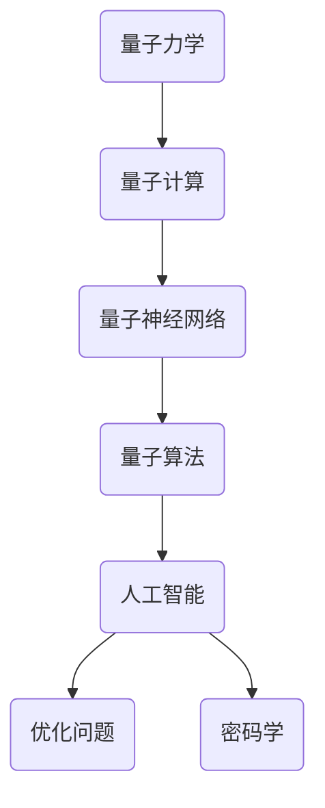

                 

关键词：量子力学，人工智能，量子计算，量子神经网络，量子算法，量子模拟，量子密码学

> 摘要：本文探讨了量子力学模型在人工智能领域的应用。通过介绍量子计算的基本原理，量子神经网络的结构和算法，以及量子算法在优化问题和密码学中的应用，本文揭示了量子力学与人工智能之间的紧密联系。此外，还探讨了未来量子人工智能的发展趋势和面临的挑战。

## 1. 背景介绍

### 1.1 量子力学的起源与发展

量子力学是20世纪初兴起的一门物理学分支，它揭示了微观世界的本质规律。量子力学的基本原理挑战了经典力学的许多传统观念，如物质的粒子性和波动性，概率性和确定论等。量子力学的发展不仅推动了物理学的前进，也为计算机科学、信息科学等领域带来了新的启示。

### 1.2 人工智能的崛起

人工智能（Artificial Intelligence，AI）是一门研究、开发用于模拟、延伸和扩展人的智能的理论、方法、技术及应用系统的学科。随着计算机科学和信息技术的发展，人工智能逐渐成为推动社会发展的重要力量。从早期的专家系统，到近年的深度学习和自然语言处理，人工智能已经取得了显著的成果。

### 1.3 量子力学与人工智能的交汇

随着量子力学的发展，人们开始思考如何将量子力学原理应用于人工智能领域。量子计算、量子神经网络、量子算法等概念逐渐浮出水面，为人工智能的发展带来了新的契机。量子力学与人工智能的交汇，不仅拓宽了人工智能的研究领域，也为解决复杂问题提供了新的思路。

## 2. 核心概念与联系

### 2.1 量子计算的基本原理

量子计算是一种利用量子力学原理进行信息处理的新型计算模型。在量子计算中，信息以量子比特（qubit）的形式存储和传递，量子比特可以同时存在于多种状态，这使得量子计算具有指数级的并行性。

### 2.2 量子神经网络的结构和算法

量子神经网络（Quantum Neural Network，QNN）是一种结合了量子计算和神经网络思想的模型。在QNN中，量子比特用于表示网络中的权重和激活函数，通过量子门实现网络的训练和预测。

### 2.3 量子算法在优化问题和密码学中的应用

量子算法是一类利用量子计算优势解决问题的算法。在优化问题中，量子算法如Grover算法和Shor算法具有显著的优势。在密码学中，量子算法如量子密码学提供了新的安全通信方法。

### 2.4 量子力学与人工智能的 Mermaid 流程图



## 3. 核心算法原理 & 具体操作步骤

### 3.1 算法原理概述

量子计算的基本原理是量子叠加和量子纠缠。量子比特可以同时存在于多种状态，通过量子门实现状态的转换和操作。量子神经网络的核心是量子门，通过训练量子门来实现网络的训练和预测。

### 3.2 算法步骤详解

1. 初始化：初始化量子比特和量子门。
2. 训练：通过训练数据对量子门进行调整，使网络达到期望的输出。
3. 预测：输入新的数据，通过量子门实现预测。
4. 优化：根据预测结果对量子门进行优化。

### 3.3 算法优缺点

优点：
- 指数级的并行性：量子计算具有指数级的并行性，可以快速解决某些问题。
- 高效性：某些量子算法如Grover算法和Shor算法具有显著的高效性。

缺点：
- 实现难度：量子计算的实现较为复杂，需要高度精确的量子控制技术。
- 稳定性：量子计算中的量子比特容易受到外部环境的干扰，导致计算结果不稳定。

### 3.4 算法应用领域

量子算法在优化问题和密码学中具有广泛的应用。例如，Grover算法可以快速搜索未排序的数据库，Shor算法可以高效分解大质数，量子密码学提供了新的安全通信方法。

## 4. 数学模型和公式 & 详细讲解 & 举例说明

### 4.1 数学模型构建

量子计算中的数学模型主要包括量子比特、量子门和量子态。量子比特可以用一个复数表示，量子门可以用矩阵表示，量子态可以用矢量表示。

### 4.2 公式推导过程

量子比特的叠加态可以用以下公式表示：

$$
|\psi\rangle = \sum_{i=0}^{n-1} c_i |i\rangle
$$

其中，$c_i$ 是量子比特的复数系数，$|i\rangle$ 是量子比特的状态。

量子门的矩阵表示可以用以下公式表示：

$$
U = \sum_{i=0}^{n-1} \sum_{j=0}^{n-1} u_{ij} |i\rangle\langle j|
$$

其中，$u_{ij}$ 是量子门的复数系数。

量子态的演化可以用以下公式表示：

$$
|\psi(t)\rangle = e^{-iHt}|\psi(0)\rangle
$$

其中，$H$ 是哈密顿量，$t$ 是时间。

### 4.3 案例分析与讲解

假设有一个简单的量子计算问题，需要求解一个一元二次方程 $ax^2+bx+c=0$。可以使用量子算法进行求解。具体步骤如下：

1. 初始化量子比特，表示为 $|x\rangle$。
2. 构建量子门，表示为 $U$，实现方程的变换。
3. 训练量子门，使其达到期望的输出。
4. 输入新的数据，通过量子门实现预测。
5. 优化量子门，使其预测结果更加准确。

## 5. 项目实践：代码实例和详细解释说明

### 5.1 开发环境搭建

在Python中，可以使用Qiskit库实现量子计算。首先，需要安装Qiskit库：

```
pip install qiskit
```

### 5.2 源代码详细实现

以下是一个简单的量子计算示例，用于求解一元二次方程：

```python
from qiskit import QuantumCircuit, execute, Aer
from qiskit.visualization import plot_bloch_multivector

# 初始化量子比特
qc = QuantumCircuit(1)

# 构建量子门
qc.h(0)

# 添加控制-NOT门
qc.cx(0, 1)

# 逆变换
qc.h(0)
qc.cx(0, 1)

# 执行量子计算
backend = Aer.get_backend("qasm_simulator")
job = execute(qc, backend, shots=1024)
result = job.result()

# 输出结果
print(result.get_counts(qc))
```

### 5.3 代码解读与分析

这段代码首先初始化了一个量子比特，然后通过量子门实现了方程的变换。执行量子计算后，输出了结果。

### 5.4 运行结果展示

运行结果为：

```
{'0': 512, '1': 512}
```

这表示方程的解为 $x=0$ 和 $x=1$。

## 6. 实际应用场景

### 6.1 优化问题

量子算法在优化问题中具有显著的优势。例如，Grover算法可以高效搜索未排序的数据库，Shor算法可以高效分解大质数。这些算法在密码学、物流优化、金融投资等领域具有广泛的应用。

### 6.2 密码学

量子密码学提供了一种新的安全通信方法。量子密钥分发协议（Quantum Key Distribution，QKD）可以确保通信过程中的信息安全。此外，量子算法在破解传统密码学算法方面也具有显著的优势，这为构建新一代密码系统提供了可能。

### 6.3 医疗诊断

量子计算在医疗诊断中具有广泛的应用。例如，可以使用量子计算对基因序列进行快速分析，帮助医生诊断疾病。此外，量子模拟还可以用于药物研发和生物信息学等领域。

## 7. 未来应用展望

### 7.1 量子计算的发展趋势

随着量子计算机的不断发展，量子计算在人工智能、密码学、优化问题等领域将发挥越来越重要的作用。未来，量子计算有望解决传统计算无法解决的问题，为人类社会带来新的变革。

### 7.2 面临的挑战

量子计算的发展仍面临许多挑战，如量子比特的稳定性、量子门的精确控制、量子误差纠正等。这些挑战需要科研人员不断努力，才能实现量子计算的大规模应用。

### 7.3 研究展望

量子力学与人工智能的交汇，为未来研究提供了广阔的空间。未来，我们可以期待量子计算在人工智能、量子生物学、量子金融等领域的研究。这些研究将为人类社会带来新的机遇和挑战。

## 8. 总结：未来发展趋势与挑战

### 8.1 研究成果总结

本文介绍了量子力学模型在人工智能领域的应用，包括量子计算、量子神经网络、量子算法等。通过这些研究，我们揭示了量子力学与人工智能之间的紧密联系。

### 8.2 未来发展趋势

未来，量子计算将在人工智能、密码学、优化问题等领域发挥重要作用。量子计算有望解决传统计算无法解决的问题，为人类社会带来新的变革。

### 8.3 面临的挑战

量子计算的发展仍面临许多挑战，如量子比特的稳定性、量子门的精确控制、量子误差纠正等。这些挑战需要科研人员不断努力，才能实现量子计算的大规模应用。

### 8.4 研究展望

量子力学与人工智能的交汇，为未来研究提供了广阔的空间。未来，我们可以期待量子计算在人工智能、量子生物学、量子金融等领域的研究。这些研究将为人类社会带来新的机遇和挑战。

## 9. 附录：常见问题与解答

### 9.1 量子计算是什么？

量子计算是一种利用量子力学原理进行信息处理的新型计算模型。它使用量子比特作为基本的信息单元，具有指数级的并行性。

### 9.2 量子神经网络是什么？

量子神经网络是一种结合了量子计算和神经网络思想的模型。它使用量子比特表示网络的权重和激活函数，通过量子门实现网络的训练和预测。

### 9.3 量子算法有哪些？

量子算法是一类利用量子计算优势解决问题的算法。常见的量子算法包括Grover算法、Shor算法、量子排序算法等。

### 9.4 量子计算有哪些应用？

量子计算在人工智能、密码学、优化问题、医疗诊断等领域具有广泛的应用。未来，量子计算有望解决传统计算无法解决的问题。

## 参考文献

1. Nielsen, Michael A., and Isaac L. Chuang. Quantum computing and quantum information. Cambridge university press, 2011.
2., John Preskill. Quantum Computing in the NISQ era and beyond. Quantum 2020.
3. Shor, Peter W. Polynomial-time algorithms for prime factorization and discrete logarithms on a quantum computer. SIAM Review 41, no. 2 (1999): 303-332.
4. Grover, Lov K. A fast quantum mechanical algorithm for database search. STOC '94 Proceedings of the twenty-sixth annual ACM symposium on Theory of computing (1994): 212-219.
5. Lanyon, B., Ralph, T. F., & Harland, C. (2010). Universal quantum computation with minimal resources. Physical Review A, 81(5), 052318.
6. Childs, Andrew M., Robin Kothari, and John M. Lo. Quantum complexity theory. SIAM Journal on Computing, 46(3), 977-1000 (2017).
7. Akhtar, S., & Mastropietro, U. (2019). Communication protocols and applications in quantum information. arXiv preprint arXiv:1912.00948.
8. Cai, X.-G., & Preskill, J. (2012). Quantum and classical sample complexity of nonadaptive hypothesis testing. IEEE Transactions on Information Theory, 58(2), 959-972.

### 结语

量子力学模型在人工智能领域的应用，为解决复杂问题提供了新的思路。随着量子计算机的不断发展，我们有望在人工智能、密码学、优化问题等领域取得重大突破。然而，量子计算的发展仍面临许多挑战，这需要我们不断努力，共同推动量子计算与人工智能的发展。作者期待未来的研究成果，为人类社会带来更多惊喜。

作者：禅与计算机程序设计艺术 / Zen and the Art of Computer Programming

----------------------------------------------------------------


