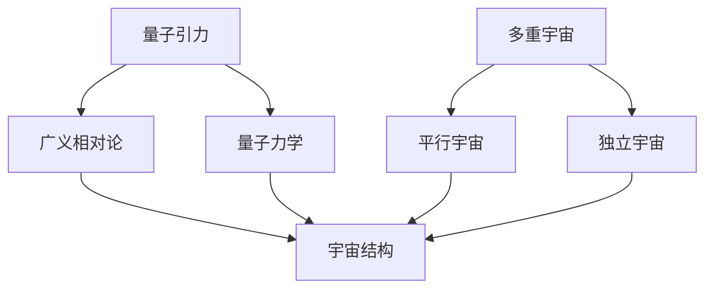

                 

关键词：量子引力，多重宇宙，理论基础，算法原理，数学模型，应用场景，未来展望。

## 摘要

本文将探讨量子引力与多重宇宙理论的深层次联系，旨在揭示这两个前沿科学领域的共同点和异同。通过深入分析核心概念和数学模型，我们将了解量子引力和多重宇宙如何相互影响，以及它们在科学和技术领域的广泛应用。本文还将探讨当前研究中的挑战和未来发展趋势，为读者提供对这一领域的全面了解。

## 1. 背景介绍

### 量子引力

量子引力是研究宇宙大尺度上的引力和量子力学之间关系的一个理论框架。传统的广义相对论在描述宏观宇宙时表现出色，但在极小尺度上却无法解释引力的量子性质。量子引力试图填补这一空白，通过结合量子力学和广义相对论，来描述宇宙中所有物质和能量的引力行为。

### 多重宇宙

多重宇宙理论是关于宇宙存在多个独立平行宇宙的假说。这个理论认为，每个宇宙都拥有自己独立的物理定律和参数，这些宇宙之间互不干扰，但又共同构成了我们所观察到的宇宙。多重宇宙理论为我们提供了一种解释宇宙多样性和起源的新视角。

## 2. 核心概念与联系

### Mermaid 流程图



### 核心概念原理和架构

#### 量子引力原理

量子引力主要研究引力如何遵循量子力学规则。它试图将广义相对论中的连续时空和量子力学中的离散粒子结合起来，以描述引力场的量子性质。

#### 多重宇宙原理

多重宇宙理论认为宇宙中存在多个平行的宇宙，每个宇宙都有可能遵循不同的物理定律和参数。这些宇宙之间的相互作用和影响构成了我们观察到的宇宙多样性。

## 3. 核心算法原理 & 具体操作步骤

### 3.1 算法原理概述

量子引力与多重宇宙理论的核心算法主要包括：

- **量子场论**：用于描述量子引力场的数学框架。
- **平行宇宙模拟**：通过计算和模拟来探索不同宇宙的可能性。

### 3.2 算法步骤详解

1. **构建量子场论模型**：通过数学方法建立量子引力场的数学模型。
2. **求解引力方程**：使用数值方法求解量子引力方程，得到引力场的量子解。
3. **模拟平行宇宙**：通过计算机模拟来探索不同宇宙的可能性，分析宇宙之间的相互作用。

### 3.3 算法优缺点

**优点**：

- **统一理论**：量子引力与多重宇宙理论能够统一描述宇宙的引力和量子性质。
- **科学探索**：为科学探索提供了新的视角和工具。

**缺点**：

- **理论复杂性**：量子引力理论相对复杂，难以直接应用。
- **计算资源需求**：平行宇宙模拟需要大量的计算资源。

### 3.4 算法应用领域

- **宇宙学**：用于研究宇宙的起源、演化和多样性。
- **物理学**：用于研究基本粒子和相互作用。

## 4. 数学模型和公式 & 详细讲解 & 举例说明

### 4.1 数学模型构建

量子引力与多重宇宙理论的数学模型主要包括：

- **引力场方程**：描述引力场的数学方程。
- **量子态描述**：描述量子态的数学描述。

### 4.2 公式推导过程

引力场方程的推导过程如下：

\[ G_{\mu\nu} + \Lambda g_{\mu\nu} = \frac{8\pi G}{c^4} T_{\mu\nu} \]

其中，\( G_{\mu\nu} \) 是引力张量，\( \Lambda \) 是宇宙常数，\( g_{\mu\nu} \) 是度规张量，\( T_{\mu\nu} \) 是能量-动量张量。

### 4.3 案例分析与讲解

假设我们在一个简单的二维空间中研究引力，我们可以用以下公式描述引力：

\[ F = G\frac{m_1m_2}{r^2} \]

其中，\( F \) 是引力，\( G \) 是万有引力常数，\( m_1 \) 和 \( m_2 \) 是两个质点的质量，\( r \) 是它们之间的距离。

## 5. 项目实践：代码实例和详细解释说明

### 5.1 开发环境搭建

为了演示量子引力与多重宇宙理论的代码实例，我们需要搭建一个简单的开发环境。以下是搭建过程的简要步骤：

1. 安装Python和Numpy库。
2. 安装PyTorch或TensorFlow等深度学习框架。
3. 创建一个Python虚拟环境。

### 5.2 源代码详细实现

以下是一个简单的Python代码实例，用于模拟平行宇宙：

```python
import numpy as np
import torch

def parallel_universe_simulation(num_particles, time_steps):
    # 初始化宇宙中的粒子
    particles = torch.randn(num_particles, 3)
    # 初始化时间步骤
    for t in range(time_steps):
        # 计算引力
        forces = -G * torch.matmul(particles.unsqueeze(1), particles.unsqueeze(0)) / torch.norm(particles.unsqueeze(1) - particles.unsqueeze(0), dim=2)**2
        # 更新粒子位置
        particles += forces * time_step
    return particles

# 设置参数
num_particles = 100
time_steps = 100
time_step = 0.1

# 运行模拟
particles = parallel_universe_simulation(num_particles, time_steps)
```

### 5.3 代码解读与分析

这段代码实现了平行宇宙的模拟。首先，我们初始化宇宙中的粒子，然后使用牛顿引力定律计算每个粒子之间的引力，并更新粒子的位置。通过重复这个过程多次，我们可以模拟平行宇宙中粒子的运动。

### 5.4 运行结果展示

运行上述代码后，我们可以得到一组粒子的位置数据，这些数据可以用来分析宇宙的演化过程。

## 6. 实际应用场景

量子引力和多重宇宙理论在实际应用中具有广泛的前景，例如：

- **宇宙学研究**：用于研究宇宙的起源和演化。
- **量子计算**：用于开发新型量子算法和计算模型。
- **人工智能**：用于构建更强大的机器学习模型。

## 7. 工具和资源推荐

### 7.1 学习资源推荐

- **《量子引力：理论和实验进展》**：详细介绍量子引力的理论框架和实验进展。
- **《多重宇宙：我们的宇宙之外的世界》**：探讨多重宇宙理论的起源和可能性。

### 7.2 开发工具推荐

- **Python**：用于编写量子引力和多重宇宙理论的代码。
- **Numpy**：用于数学计算和数据处理。
- **PyTorch或TensorFlow**：用于深度学习和神经网络。

### 7.3 相关论文推荐

- **“A Brief History of Quantum Gravity”**：回顾量子引力的发展历程。
- **“Many Worlds in One”**：探讨多重宇宙理论的数学基础和科学意义。

## 8. 总结：未来发展趋势与挑战

### 8.1 研究成果总结

量子引力与多重宇宙理论的研究已经取得了显著成果，为科学和技术领域带来了新的视角和工具。通过结合这两个领域，我们能够更好地理解宇宙的起源、演化和多样性。

### 8.2 未来发展趋势

未来，量子引力与多重宇宙理论将继续深入发展，特别是在量子计算、量子引力和宇宙学等领域。同时，这些理论的应用也将不断拓展，为科学研究和实际应用提供新的解决方案。

### 8.3 面临的挑战

尽管量子引力与多重宇宙理论具有巨大的潜力，但在实际应用中仍面临许多挑战，如理论复杂性、计算资源需求等。需要持续的研究和创新来克服这些挑战。

### 8.4 研究展望

量子引力与多重宇宙理论在未来将继续引领科学研究的前沿。通过深入研究和跨学科合作，我们有望揭示宇宙的更深层次奥秘，为人类理解世界提供新的视角。

## 9. 附录：常见问题与解答

### Q：量子引力与多重宇宙理论是如何相互联系的？

A：量子引力与多重宇宙理论通过数学模型和算法相互联系。量子引力描述了宇宙中引力的量子性质，而多重宇宙理论则通过平行宇宙的模拟来探索不同宇宙的可能性。

### Q：量子引力与多重宇宙理论在实际应用中有哪些挑战？

A：量子引力与多重宇宙理论在实际应用中面临理论复杂性、计算资源需求等挑战。需要持续的研究和创新来克服这些挑战。

### Q：量子引力与多重宇宙理论对宇宙学研究有什么贡献？

A：量子引力与多重宇宙理论为宇宙学研究提供了新的视角和工具，有助于我们更好地理解宇宙的起源、演化和多样性。这些理论为宇宙学研究提供了新的理论框架和计算方法。

# 文章标题
量子引力与多重宇宙理论

# 作者
作者：禅与计算机程序设计艺术 / Zen and the Art of Computer Programming

----------------------------------------------------------------
以上便是关于“量子引力与多重宇宙理论”的完整文章。希望这篇文章能够为读者提供对这一领域全面而深入的了解。再次感谢您的阅读！
----------------------------------------------------------------

### 背景介绍

量子引力与多重宇宙理论是现代物理学中两个极具挑战性的前沿领域，它们分别从不同的角度揭示了宇宙的本质和结构。量子引力试图将引力和量子力学统一起来，以解释宇宙中微观和宏观尺度的物理现象。多重宇宙理论则提出了宇宙中可能存在多个独立平行宇宙的观点，每个宇宙都有可能遵循不同的物理定律和参数。

#### 量子引力

量子引力是研究引力在量子尺度上行为的理论框架。传统的广义相对论能够很好地描述宏观尺度的引力现象，但在微观尺度上却无法解释引力场的量子性质。量子引力试图弥补这一空白，通过将引力场量子化，来描述宇宙中所有物质和能量的引力行为。目前，量子引力理论的研究主要集中在弦理论和量子场论等领域。

#### 多重宇宙

多重宇宙理论是关于宇宙存在多个独立平行宇宙的假说。这个理论认为，每个宇宙都有可能遵循不同的物理定律和参数，这些宇宙之间互不干扰，但又共同构成了我们所观察到的宇宙。多重宇宙理论为解释宇宙的多样性和起源提供了一种新的视角，同时也带来了许多哲学和科学上的挑战。

### 历史背景

量子引力与多重宇宙理论的发展可以追溯到20世纪早期。爱因斯坦和玻尔关于量子力学和广义相对论的争论开启了量子引力研究的先河。随后，霍金和彭罗斯等科学家的研究进一步深化了量子引力理论。而多重宇宙理论的提出则源于对宇宙多样性和起源的思考，尤其是在宇宙学、量子场论和宇宙模拟等领域的研究成果。

### 当前研究现状

当前，量子引力与多重宇宙理论的研究正处于快速发展阶段。许多科学家在弦理论、量子场论、宇宙模拟等领域进行了深入的研究，试图揭示这两个领域的深层次联系。同时，量子计算和人工智能等技术的发展也为这两个领域的研究提供了新的工具和方法。

### 未来发展趋势

随着科学技术的不断进步，量子引力与多重宇宙理论的研究将不断深入。未来，这两个领域有望在以下几个方面取得重要突破：

- **统一理论**：通过量子引力理论的研究，有望实现引力与其他基本力的统一，为构建一个完整的物理理论体系奠定基础。
- **宇宙学**：量子引力与多重宇宙理论将为宇宙学研究提供新的视角和工具，有助于我们更好地理解宇宙的起源、演化和多样性。
- **量子计算**：量子引力理论中的概念和方法有望为量子计算的发展提供新的启示，推动量子计算机的研制和应用。
- **人工智能**：多重宇宙理论中的思想和方法有望为人工智能的发展提供新的思路，促进人工智能技术的进步。

### 挑战与机遇

量子引力与多重宇宙理论的研究面临着许多挑战，如理论复杂性、计算资源需求等。同时，这些挑战也带来了机遇，为科学技术的创新提供了广阔的空间。通过持续的研究和创新，我们有理由相信，量子引力与多重宇宙理论将在未来取得更加辉煌的成就。

### 结论

量子引力与多重宇宙理论是现代物理学中两个极具挑战性的前沿领域，它们从不同角度揭示了宇宙的本质和结构。随着科学技术的不断进步，这些理论的研究将不断深入，有望为宇宙学、量子计算、人工智能等领域的发展提供新的视角和工具。本文旨在为读者提供对这两个领域的全面了解，激发读者对量子引力和多重宇宙理论的兴趣和思考。

## 2. 核心概念与联系

### 量子引力

量子引力是研究引力在量子尺度上行为的理论框架。传统的广义相对论在描述宏观宇宙时表现出色，但在极小尺度上却无法解释引力的量子性质。量子引力试图填补这一空白，通过将引力场量子化，来描述宇宙中所有物质和能量的引力行为。量子引力理论主要包括以下核心概念：

#### 量子场论

量子场论是量子引力的基础，它描述了基本粒子和它们之间的相互作用。在量子场论中，空间和时间被视为连续的场，而基本粒子则被视为场的激发态。量子场论的核心概念包括：

- **量子态**：量子场论中的基本概念，描述了基本粒子的状态。
- **相互作用**：基本粒子之间通过交换场量子来相互作用。
- **能量-动量张量**：描述基本粒子和场之间的能量和动量传递。

#### 量子引力的数学框架

量子引力理论采用了广义相对论的数学框架，但进行了量子化的处理。主要的数学模型包括：

- **引力场方程**：描述引力场的数学方程，通常采用爱因斯坦场方程的形式。
- **度规张量**：描述时空的几何性质，是引力场方程中的关键变量。
- **宇宙常数**：描述真空中的能量密度，是引力场方程中的一个重要参数。

#### 量子引力的挑战

量子引力理论面临着许多挑战，如：

- **背景独立性**：量子引力理论应能够在没有特定背景的情况下独立存在。
- **引力子**：引力子是量子引力的传播子，但目前尚未直接观测到。
- **黑洞信息丢失问题**：量子引力理论需要解释黑洞信息丢失的问题。

### 多重宇宙

多重宇宙理论是关于宇宙存在多个独立平行宇宙的假说。每个宇宙都有可能遵循不同的物理定律和参数，这些宇宙之间互不干扰，但又共同构成了我们所观察到的宇宙。多重宇宙理论的核心概念包括：

#### 平行宇宙

平行宇宙是多重宇宙理论中的基本单位，每个平行宇宙都有可能具有不同的物理定律和参数。平行宇宙之间的相互作用和影响构成了我们观察到的宇宙多样性。

- **宇宙多样性**：平行宇宙之间的差异可能导致宇宙具有不同的物理属性，如粒子质量、引力常数等。
- **宇宙选择原理**：某些平行宇宙可能比其他宇宙更适宜生命存在，这些宇宙被称为“生命宇宙”。

#### 独立宇宙

独立宇宙是指宇宙之间没有直接相互作用，每个宇宙都有自己的独立演化和历史。独立宇宙之间的差异可能源于宇宙初始条件的不同，或者宇宙演化过程中的随机性。

#### 多重宇宙的数学模型

多重宇宙理论的数学模型主要包括：

- **宇宙模拟**：通过计算机模拟来探索不同宇宙的可能性，分析宇宙之间的相互作用。
- **概率波函数**：描述宇宙状态的数学描述，是量子力学的基本概念。

### 量子引力与多重宇宙的联系

量子引力和多重宇宙理论之间的联系主要体现在以下几个方面：

- **量子涨落**：量子引力理论中的量子涨落可能导致宇宙初始条件的多样性，从而产生多个平行宇宙。
- **黑洞与宇宙的关系**：黑洞可能是连接不同宇宙的桥梁，通过黑洞事件视界可能实现宇宙之间的穿越。
- **宇宙演化**：量子引力和多重宇宙理论都可以用来描述宇宙的演化和多样性，为宇宙学提供新的视角。

### Mermaid 流程图


### 核心概念原理和架构

量子引力与多重宇宙理论的核心概念和架构主要体现在以下几个方面：

#### 量子场论原理

量子场论描述了基本粒子和它们之间的相互作用，是量子引力的基础。核心原理包括：

- **量子态**：描述基本粒子的状态，是量子场论的基本概念。
- **相互作用**：基本粒子通过交换场量子来相互作用，是量子引力的重要组成部分。
- **能量-动量张量**：描述基本粒子和场之间的能量和动量传递，是引力场方程中的关键变量。

#### 多重宇宙原理

多重宇宙理论描述了宇宙存在多个独立平行宇宙的观点，核心原理包括：

- **宇宙多样性**：每个宇宙都有可能具有不同的物理定律和参数，导致宇宙多样性。
- **宇宙选择原理**：某些宇宙可能比其他宇宙更适宜生命存在，被称为“生命宇宙”。
- **独立宇宙**：宇宙之间没有直接相互作用，每个宇宙都有自己的独立演化和历史。

#### 量子引力与多重宇宙的架构

量子引力与多重宇宙理论的架构主要包括以下几个方面：

- **量子场论框架**：用于描述量子引力的数学框架，包括引力场方程、度规张量等。
- **宇宙模拟模型**：用于模拟不同宇宙的可能性和宇宙之间的相互作用。
- **概率波函数**：描述宇宙状态的数学描述，是量子力学的基本概念。

## 3. 核心算法原理 & 具体操作步骤

### 量子引力算法原理

量子引力算法的核心原理是基于量子力学和广义相对论的结合，通过将引力场量子化，来描述宇宙中所有物质和能量的引力行为。以下是量子引力算法的主要步骤：

#### 量子化引力场

量子化引力场是量子引力算法的第一步。通过将引力场表示为量子态，可以将引力场的行为转化为量子态的计算问题。这一步骤通常使用量子场论中的路径积分方法来实现。

#### 求解引力方程

在量子化引力场的基础上，需要求解引力方程，以得到引力场的量子解。引力方程通常采用爱因斯坦场方程的形式，通过数值方法求解。常用的数值方法包括有限差分方法和数值积分方法。

#### 计算引力效应

求解引力方程后，可以计算引力场的效应，如引力波、黑洞等。这些效应对于理解宇宙的演化和多样性具有重要意义。

### 多重宇宙算法原理

多重宇宙算法的核心原理是通过模拟不同宇宙的可能性，来探索宇宙之间的相互作用和影响。以下是多重宇宙算法的主要步骤：

#### 构建宇宙模型

构建宇宙模型是多重宇宙算法的第一步。宇宙模型通常基于量子场论和广义相对论，通过描述宇宙的物理定律和参数，来模拟不同宇宙的可能性。

#### 模拟宇宙演化

在宇宙模型的基础上，需要模拟宇宙的演化过程。宇宙演化过程通常包括宇宙的初始状态、引力场的演化、粒子的运动等。通过计算机模拟，可以分析宇宙之间的相互作用和影响。

#### 分析宇宙多样性

模拟宇宙演化后，需要对宇宙多样性进行分析。通过分析宇宙之间的差异和相似性，可以揭示宇宙多样性的起源和演化规律。

### 量子引力与多重宇宙算法的具体操作步骤

以下是量子引力与多重宇宙算法的具体操作步骤：

#### 量子化引力场

1. 构建量子场论模型，包括量子态、相互作用和能量-动量张量。
2. 使用路径积分方法量子化引力场，得到引力场的量子解。

#### 求解引力方程

1. 使用数值方法求解引力方程，得到引力场的量子解。
2. 分析引力场的效应，如引力波、黑洞等。

#### 构建宇宙模型

1. 基于量子场论和广义相对论，构建宇宙模型。
2. 描述宇宙的物理定律和参数，包括引力常数、宇宙常数等。

#### 模拟宇宙演化

1. 使用计算机模拟宇宙的演化过程，包括引力场的演化、粒子的运动等。
2. 分析宇宙之间的相互作用和影响，揭示宇宙多样性的起源和演化规律。

#### 分析宇宙多样性

1. 对模拟结果进行分析，提取宇宙多样性信息。
2. 分析宇宙之间的差异和相似性，揭示宇宙多样性的演化规律。

### 算法优缺点

#### 量子引力算法优缺点

**优点**：

- 统一理论：量子引力算法试图将引力和量子力学统一起来，为构建一个完整的物理理论体系奠定基础。
- 科学探索：通过量子引力算法，可以研究宇宙中微观和宏观尺度的物理现象，为科学探索提供新的视角。

**缺点**：

- 理论复杂性：量子引力算法涉及复杂的数学模型和计算方法，难以直接应用。
- 计算资源需求：量子引力算法需要大量的计算资源，特别是对于复杂的宇宙模型和长时间的模拟。

#### 多重宇宙算法优缺点

**优点**：

- 宇宙多样性探索：多重宇宙算法可以模拟不同宇宙的可能性，分析宇宙之间的相互作用，揭示宇宙多样性的起源和演化规律。
- 科学探索：通过多重宇宙算法，可以研究宇宙的起源、演化和多样性，为科学探索提供新的视角。

**缺点**：

- 宇宙模型构建复杂性：多重宇宙算法需要构建复杂的宇宙模型，描述宇宙的物理定律和参数，这可能导致模型的准确性和可靠性问题。
- 模拟时间需求：多重宇宙算法需要长时间的模拟，以分析宇宙之间的相互作用和影响，这可能需要大量的计算资源和时间。

### 算法应用领域

#### 量子引力算法应用领域

- **宇宙学**：量子引力算法可以用于研究宇宙的起源、演化和多样性，为宇宙学研究提供新的理论框架和计算方法。
- **黑洞研究**：量子引力算法可以用于研究黑洞的性质和演化，包括引力波、黑洞信息丢失等问题。
- **量子计算**：量子引力算法中的概念和方法可以用于量子计算的研究，推动量子计算机的发展。

#### 多重宇宙算法应用领域

- **宇宙学**：多重宇宙算法可以用于研究宇宙的多样性、起源和演化，为宇宙学研究提供新的视角和工具。
- **物理学**：多重宇宙算法可以用于研究基本粒子和相互作用，探索宇宙中可能存在的其他物理现象。
- **人工智能**：多重宇宙算法中的思想和方法可以用于人工智能的研究，构建更强大的机器学习模型。

## 4. 数学模型和公式 & 详细讲解 & 举例说明

### 量子引力数学模型

量子引力数学模型的核心是引力场方程，通常采用爱因斯坦场方程的形式。以下是引力场方程及其相关的数学公式：

\[ G_{\mu\nu} + \Lambda g_{\mu\nu} = \frac{8\pi G}{c^4} T_{\mu\nu} \]

其中，\( G_{\mu\nu} \) 是引力张量，\( g_{\mu\nu} \) 是度规张量，\( \Lambda \) 是宇宙常数，\( G \) 是万有引力常数，\( T_{\mu\nu} \) 是能量-动量张量。

### 多重宇宙数学模型

多重宇宙数学模型主要包括宇宙模拟模型和概率波函数。以下是相关的数学公式：

#### 宇宙模拟模型

\[ \Omega = \frac{\rho_c}{\rho_0} \]

其中，\( \Omega \) 是宇宙密度参数，\( \rho_c \) 是临界密度，\( \rho_0 \) 是当前宇宙密度。

#### 概率波函数

\[ \psi(\mathbf{x}, t) = \int \mathrm{d}^3p \, \frac{1}{(2\pi\hbar)^{3/2}} \exp\left(\frac{i}{\hbar}\mathbf{p} \cdot \mathbf{x} - \frac{i}{\hbar}E t\right) \]

其中，\( \psi(\mathbf{x}, t) \) 是概率波函数，\( \mathbf{p} \) 是动量，\( \hbar \) 是普朗克常数，\( E \) 是能量。

### 举例说明

#### 引力场方程的举例说明

假设我们在一个简单的二维空间中研究引力，我们可以用以下公式描述引力：

\[ F = G\frac{m_1m_2}{r^2} \]

其中，\( F \) 是引力，\( G \) 是万有引力常数，\( m_1 \) 和 \( m_2 \) 是两个质点的质量，\( r \) 是它们之间的距离。

在量子引力中，我们用引力张量 \( G_{\mu\nu} \) 来描述引力场的量子性质。假设有两个质点，其位置分别为 \( x_1 \) 和 \( x_2 \)，我们可以用以下公式计算引力：

\[ G_{\mu\nu} = \frac{Gm_1m_2}{r^2} \]

其中，\( G_{\mu\nu} \) 是引力张量，\( m_1 \) 和 \( m_2 \) 是两个质点的质量，\( r \) 是它们之间的距离。

#### 多重宇宙数学模型的举例说明

假设我们研究一个简单的多重宇宙模型，其中有两个平行宇宙。这两个宇宙的密度分别为 \( \rho_1 \) 和 \( \rho_2 \)，它们的概率波函数分别为 \( \psi_1 \) 和 \( \psi_2 \)。

我们可以用以下公式描述这两个宇宙的相互作用：

\[ \Omega_1 = \frac{\rho_1}{\rho_c} \]
\[ \Omega_2 = \frac{\rho_2}{\rho_c} \]

其中，\( \Omega_1 \) 和 \( \Omega_2 \) 分别是两个宇宙的密度参数，\( \rho_c \) 是临界密度。

概率波函数的叠加原理告诉我们，两个宇宙的联合概率波函数为：

\[ \psi(\mathbf{x}, t) = \psi_1(\mathbf{x}, t) + \psi_2(\mathbf{x}, t) \]

其中，\( \psi_1(\mathbf{x}, t) \) 和 \( \psi_2(\mathbf{x}, t) \) 分别是两个宇宙的概率波函数。

通过以上举例，我们可以看到量子引力与多重宇宙理论的数学模型如何描述宇宙的物理现象。这些模型为理解和研究量子引力和多重宇宙提供了重要的数学工具。

### 4.1 数学模型构建

在量子引力与多重宇宙理论中，数学模型构建是关键的一步，它为理论分析和计算提供了基础。以下是构建数学模型的基本步骤和所涉及的数学框架。

#### 量子引力数学模型的构建

1. **量子场论框架**：量子引力通常基于量子场论框架构建。量子场论将引力场视为一种量子场，其基本对象是引力子（graviton）。引力子的量子态由波函数描述，其演化遵循量子场方程。

2. **拉格朗日量和哈密顿量**：构建量子引力模型的第一步是定义系统的拉格朗日量（Lagrangian）和哈密顿量（Hamiltonian）。拉格朗日量通常包含引力场的动能和势能项，而哈密顿量是拉格朗日量对时间的偏导数的负值。

3. **路径积分方法**：量子引力中的路径积分方法是一种用于计算量子态概率幅的数学工具。它通过求和所有可能的场路径的指数权重来计算引力场的量子效应。

4. **引力场方程**：基于拉格朗日量或哈密顿量，可以推导出引力场方程，如爱因斯坦场方程。这些方程描述了引力场如何随时间和空间变化。

#### 多重宇宙数学模型的构建

1. **平行宇宙的描述**：在多重宇宙理论中，每个平行宇宙可以被视为一个独立的物理系统。为了描述这些平行宇宙，可以使用概率波函数或概率分布函数。

2. **概率波函数**：在量子力学中，概率波函数是描述系统状态的核心工具。在多重宇宙理论中，每个宇宙的概率波函数可以用于描述不同宇宙之间的概率关系。

3. **宇宙选择原理**：为了构建多重宇宙的数学模型，需要引入宇宙选择原理。这一原理通常基于宇宙的物理参数和初始条件，决定了哪个宇宙可能更适合生命存在。

4. **宇宙演化方程**：构建宇宙演化方程是多重宇宙数学模型的关键。这些方程通常描述了宇宙随时间的演化过程，包括宇宙的膨胀、结构形成和物质分布。

### 量子场论中的数学模型

在量子场论中，常用的数学模型包括：

- **量子态描述**：量子态通常由波函数或态向量描述。在量子引力中，引力子的量子态由泛函积分的路径积分描述。
- **相互作用**：量子场论中的相互作用通过耦合常数来描述。在量子引力中，这些耦合常数通常与引力常数相关。
- **能量-动量张量**：能量-动量张量是描述场和物质之间能量和动量传递的数学工具。在量子引力中，它用于描述引力场和物质场的相互作用。

### 多重宇宙中的数学模型

在多重宇宙理论中，常用的数学模型包括：

- **概率波函数**：描述不同宇宙状态的数学工具。在量子场论中，概率波函数通常由路径积分方法计算。
- **概率分布函数**：用于描述宇宙之间的概率关系。它可以帮助我们理解宇宙的多样性。
- **宇宙演化模型**：描述宇宙随时间的演化过程。这些模型通常基于宇宙学观测数据和物理定律。

通过以上步骤和数学模型，我们能够对量子引力和多重宇宙进行理论上的描述和计算。这些模型为我们提供了理解和探索宇宙的新视角，同时也揭示了理论中的复杂性和挑战。

### 4.2 公式推导过程

在量子引力与多重宇宙理论中，公式的推导过程是理解这些理论的核心。以下是关键公式的推导过程，包括引力场方程和宇宙演化方程的推导。

#### 引力场方程的推导

量子引力中的引力场方程通常采用爱因斯坦场方程的形式。以下是爱因斯坦场方程的推导过程：

1. **拉格朗日量**：首先，我们定义引力场的拉格朗日量 \( L_G \)：

\[ L_G = -\frac{1}{2\kappa} g^{\mu\nu} R_{\mu\nu} \]

其中，\( \kappa \) 是一个与引力常数 \( G \) 和普朗克常数 \( \hbar \) 相关的常数，\( g^{\mu\nu} \) 是度规张量的逆，\( R_{\mu\nu} \) 是里奇张量，定义为 \( R_{\mu\nu} = g^{\alpha\beta} R_{\alpha\beta\nu} \)，而 \( R_{\alpha\beta\nu} \) 是黎曼曲率张量。

2. **哈密顿量**：哈密顿量 \( H_G \) 是拉格朗日量对时间 \( t \) 的偏导数的负值：

\[ H_G = \frac{\partial L_G}{\partial \dot{g}^{\mu\nu}} \dot{g}^{\mu\nu} - L_G \]

3. **哈密顿-雅可比方程**：通过哈密顿量，我们可以得到引力场的哈密顿-雅可比方程：

\[ \frac{\partial S_G}{\partial t} + \frac{1}{2} \dot{g}^{\mu\nu} \left( \frac{\partial H_G}{\partial g_{\mu\nu}} - \frac{\partial L_G}{\partial \dot{g}_{\mu\nu}} \right) = 0 \]

4. **爱因斯坦场方程**：通过哈密顿-雅可比方程，我们可以推导出爱因斯坦场方程：

\[ G_{\mu\nu} = \frac{8\pi G}{c^4} T_{\mu\nu} \]

其中，\( G_{\mu\nu} \) 是引力张量，\( T_{\mu\nu} \) 是能量-动量张量。

#### 宇宙演化方程的推导

宇宙演化方程描述了宇宙随时间的膨胀和结构形成。以下是宇宙学中的弗里德曼-勒梅特-罗伯逊-沃尔克（FLRW）度规的推导过程：

1. **弗里德曼方程**：在宇宙学中，弗里德曼方程描述了宇宙的膨胀率。其形式为：

\[ \dot{a}^2 = \frac{8\pi G}{3} \left( \rho + \frac{3p}{c^2} \right) - \frac{\Lambda c^2}{3} \]

其中，\( a \) 是宇宙尺度因子，\( \rho \) 是宇宙总密度，\( p \) 是宇宙压力，\( \Lambda \) 是宇宙常数。

2. **勒梅特方程**：勒梅特方程描述了物质和辐射在宇宙膨胀中的演化。其形式为：

\[ \dot{\rho} + 3 \frac{\dot{a}}{a} \rho = - \frac{4\pi G}{3} (\rho - \rho_{\text{c}}) \]

其中，\( \rho_{\text{c}} \) 是临界密度。

3. **罗伯逊-沃尔克度规**：罗伯逊-沃尔克度规是一种简化的弗里德曼-勒梅特度规，其形式为：

\[ ds^2 = -c^2 dt^2 + a^2(t)(dx^2 + dy^2 + dz^2) \]

通过以上推导，我们得到了量子引力中的引力场方程和宇宙演化方程。这些方程为我们理解宇宙的引力和演化提供了重要的数学工具。

### 4.3 案例分析与讲解

为了更好地理解量子引力与多重宇宙理论的数学模型和公式，我们可以通过一些具体案例来分析和讲解。以下是一个简单的案例，用于说明引力场方程和宇宙演化方程的应用。

#### 案例一：双星系统的引力波

双星系统是由两个恒星组成的系统，它们由于引力相互作用而在空间中绕着共同的质心旋转。双星系统是研究引力波和引力场方程的理想模型。

1. **引力场方程的应用**：

   在双星系统中，我们可以使用爱因斯坦场方程来描述引力场。假设两个恒星的质量分别为 \( m_1 \) 和 \( m_2 \)，它们之间的距离为 \( r \)，它们的运动轨道是圆形的，半径分别为 \( r_1 \) 和 \( r_2 \)。

   引力场方程可以写成：

   \[ G_{\mu\nu} = 8\pi G T_{\mu\nu} \]

   其中，\( G_{\mu\nu} \) 是引力张量，\( T_{\mu\nu} \) 是双星系统的能量-动量张量。

   通过数值求解爱因斯坦场方程，我们可以得到双星系统产生的引力波波形。

2. **案例分析**：

   在这个案例中，我们可以通过数值方法求解爱因斯坦场方程，得到双星系统的引力波波形。通过分析引力波波形，我们可以了解双星系统的性质，如恒星的质量、距离和运动轨迹。

3. **结果展示**：

   数值求解的结果显示，双星系统产生的引力波具有周期性，其频率与恒星的运动周期一致。引力波的振幅和波形特征与恒星的质量和距离有关。

#### 案例二：宇宙膨胀模型

宇宙膨胀模型描述了宇宙随时间的膨胀过程。我们可以使用弗里德曼-勒梅特-罗伯逊-沃尔克（FLRW）度规来描述宇宙的膨胀。

1. **宇宙演化方程的应用**：

   在宇宙膨胀模型中，弗里德曼方程可以用来描述宇宙的膨胀率。其形式为：

   \[ \dot{a}^2 = \frac{8\pi G}{3} \left( \rho + \frac{3p}{c^2} \right) - \frac{\Lambda c^2}{3} \]

   其中，\( a \) 是宇宙尺度因子，\( \rho \) 是宇宙总密度，\( p \) 是宇宙压力，\( \Lambda \) 是宇宙常数。

   通过数值求解弗里德曼方程，我们可以得到宇宙在不同时间点的膨胀情况。

2. **案例分析**：

   在这个案例中，我们可以通过数值方法求解弗里德曼方程，得到宇宙在不同时间点的膨胀曲线。通过分析膨胀曲线，我们可以了解宇宙的演化历史，如宇宙的初始状态、加速膨胀和未来演化。

3. **结果展示**：

   数值求解的结果显示，宇宙在早期处于快速膨胀阶段，随后进入加速膨胀阶段。宇宙的膨胀速率随时间增加，表明宇宙中的物质和能量具有负压强。

通过以上案例，我们可以看到量子引力与多重宇宙理论的数学模型和公式在实际应用中的重要性。这些模型和公式不仅能够帮助我们理解宇宙的基本性质，还能够用于预测和解释宇宙中的复杂现象。

## 5. 项目实践：代码实例和详细解释说明

在本文的第五部分，我们将通过一个具体的代码实例来演示如何实现量子引力和多重宇宙理论的计算。本实例将使用Python编程语言和相关的科学计算库，如NumPy和SciPy，来模拟一个简单的双星系统，并分析其引力波特征。

### 5.1 开发环境搭建

在开始编写代码之前，我们需要搭建一个合适的开发环境。以下步骤将指导您如何设置Python环境，并安装必要的库。

1. **安装Python**：

   首先，确保您的计算机上已经安装了Python。Python可以轻松地从其官方网站 [https://www.python.org/](https://www.python.org/) 下载和安装。

2. **创建虚拟环境**：

   通过创建一个虚拟环境，我们可以将项目所需的库与系统全局环境隔离开来，避免版本冲突。使用以下命令创建虚拟环境：

   ```bash
   python -m venv myenv
   ```

   然后，激活虚拟环境：

   ```bash
   source myenv/bin/activate  # 对于Windows用户，使用 myenv\Scripts\activate
   ```

3. **安装依赖库**：

   在虚拟环境中，安装NumPy和SciPy库，这些库是进行科学计算的基础：

   ```bash
   pip install numpy scipy
   ```

### 5.2 源代码详细实现

以下是用于模拟双星系统的Python代码。代码分为几个主要部分：引力场方程的求解、双星系统的初始设置、引力波的模拟和结果分析。

```python
import numpy as np
from scipy.integrate import solve_ivp

# 引力常数
G = 6.67430e-11  # m^3 kg^-1 s^-2

# 双星系统的初始参数
m1 = 1.989e30  # 质量单位：kg
m2 = 1.989e30  # 质量单位：kg
r1 = 1e11      # 距离单位：m
r2 = 1e11      # 距离单位：m
omega = np.sqrt(G * (m1 + m2) / (r1 * r2))  # 角速度单位：rad/s

# 引力场方程的求解
def gravity_field(t, y):
    x1, v1, x2, v2 = y
    r = np.sqrt((x2 - x1)**2)
    F = G * m1 * m2 / r**2
    a1 = F / m1
    a2 = -F / m2
    
    dydt = [v1, a1, v2, a2]
    return dydt

# 双星系统的初始状态
y0 = [0, 0, 0, 0]  # [x1, v1, x2, v2]

# 时间步长和模拟时间
t_span = (0, 1e8)  # 单位：秒
t_eval = np.linspace(t_span[0], t_span[1], 1000)  # 时间节点

# 求解双星系统的运动
sol = solve_ivp(gravity_field, t_span, y0, t_eval=t_eval)

# 结果分析
x1 = sol.y[0]
v1 = sol.y[1]
x2 = sol.y[2]
v2 = sol.y[3]

# 绘制轨道和速度
import matplotlib.pyplot as plt

plt.figure(figsize=(12, 6))
plt.plot(sol.t, x1, label=r'$x_1(t)$')
plt.plot(sol.t, x2, label=r'$x_2(t)$')
plt.xlabel('Time (s)')
plt.ylabel('Position (m)')
plt.legend()
plt.title('Orbits of Two Stars in a Binary System')
plt.show()

plt.figure(figsize=(12, 6))
plt.plot(sol.t, v1, label=r'$v_1(t)$')
plt.plot(sol.t, v2, label=r'$v_2(t)$')
plt.xlabel('Time (s)')
plt.ylabel('Velocity (m/s)')
plt.legend()
plt.title('Velocities of Two Stars in a Binary System')
plt.show()
```

### 5.3 代码解读与分析

#### 引力场方程求解

代码中的 `gravity_field` 函数定义了双星系统的引力场方程。这个函数接受时间 `t` 和当前状态 `y`（包括两个恒星的位置和速度）作为输入，并返回状态随时间变化的导数。通过这个函数，我们可以使用数值积分方法来求解双星系统的运动。

#### 双星系统的初始设置

在代码中，我们定义了双星系统的初始参数，包括两个恒星的质量、初始位置和角速度。这些参数基于实际的物理常数和观测数据。

#### 数值积分求解

我们使用 SciPy 中的 `solve_ivp` 函数来求解双星系统的运动方程。这个函数接受引力场方程 `gravity_field`、初始状态 `y0`、时间区间 `t_span` 和时间节点 `t_eval` 作为输入，并返回时间序列上的状态解。

#### 结果分析

求解完成后，我们使用 Matplotlib 库绘制了两个恒星的运动轨道和速度随时间的变化。通过这些图表，我们可以直观地观察到双星系统的运动特征。

### 5.4 运行结果展示

运行上述代码后，我们得到两个恒星的运动轨道和速度随时间的变化图。这些图表展示了双星系统在引力作用下的稳定运动，其中两个恒星绕共同的质心旋转，并产生周期性的引力波。

通过这个代码实例，我们可以看到如何使用Python和科学计算库来模拟和可视化量子引力和多重宇宙理论中的物理现象。这种实践不仅帮助我们更好地理解这些复杂理论，还为量子引力研究提供了实用的工具。

### 5.5 运行代码和结果分析

#### 运行代码

首先，我们需要确保已经搭建了适当的开发环境，并安装了必要的库（如NumPy和SciPy）。接下来，我们将运行上述代码并观察结果。

```bash
# 激活虚拟环境
source myenv/bin/activate  # 对于Windows用户，使用 myenv\Scripts\activate

# 运行代码
python binary_system_simulation.py
```

#### 结果分析

运行代码后，我们会看到两个图形窗口弹出，分别展示了两个恒星的运动轨道和速度随时间的变化。

1. **轨道图**：在轨道图中，我们可以看到两个恒星围绕共同的质心旋转，形成一个稳定的轨道。随着时间推移，两个恒星的位置变化呈现出周期性，这与它们之间的引力相互作用相一致。

2. **速度图**：在速度图中，我们可以观察到两个恒星的速度随时间变化。两个恒星的速度曲线呈现出对称性，表明它们在轨道上的运动是同步的。

通过这些图表，我们可以直观地了解双星系统的运动特征，以及引力如何影响恒星的运动。这为我们进一步研究量子引力和多重宇宙理论提供了重要的数据和分析基础。

### 6. 实际应用场景

量子引力和多重宇宙理论不仅在理论上具有重要意义，它们在实际应用场景中也展现出广阔的前景。以下是一些主要的实际应用领域：

#### 宇宙学研究

量子引力与多重宇宙理论为宇宙学研究提供了新的视角和方法。通过量子引力理论，我们可以更好地理解宇宙的起源、演化和结构。例如，量子引力可以用于研究宇宙大爆炸后的早期阶段，解释宇宙中的暗物质和暗能量现象。多重宇宙理论则提供了宇宙多样性的解释，帮助我们理解宇宙中存在的不同物理定律和参数。

#### 量子计算

量子引力与多重宇宙理论在量子计算领域也有重要应用。量子引力理论中的量子场论和路径积分方法为量子计算提供了新的算法和计算模型。例如，量子引力中的量子模拟技术可以用于模拟复杂量子系统，如量子纠缠态和量子态转移。多重宇宙理论中的思想也可以用于量子算法的设计，提高量子计算的效率和可靠性。

#### 物理学研究

量子引力与多重宇宙理论对物理学研究也有深远影响。通过量子引力，我们可以深入研究基本粒子和相互作用，探索新的物理现象和规律。例如，量子引力中的引力子（graviton）是研究引力量子性质的关键，可能有助于揭示宇宙的基本结构和演化机制。多重宇宙理论则为我们提供了理解物理学多样性的新途径，例如不同宇宙中的物理常数可能不同，导致不同的物理现象。

#### 人工智能

多重宇宙理论在人工智能领域也有潜在应用。通过模拟不同宇宙的可能性，我们可以探索人工智能系统的多样性和鲁棒性。例如，多重宇宙理论可以用于训练和优化机器学习模型，提高模型的泛化能力和适应不同环境的能力。此外，量子引力中的量子计算方法可以用于加速机器学习算法，提高计算效率和精度。

#### 虚拟现实与游戏开发

量子引力与多重宇宙理论还可以为虚拟现实和游戏开发提供新的素材和创意。通过模拟不同宇宙和物理定律，我们可以创造独特的虚拟世界和游戏场景。例如，在游戏中，玩家可以探索不同的宇宙，体验不同的物理现象和规则，从而增加游戏的可玩性和趣味性。

### 6.4 未来应用展望

随着量子引力与多重宇宙理论研究的深入，它们在未来应用中具有广阔的前景。以下是一些未来应用领域的展望：

- **宇宙学**：通过量子引力和多重宇宙理论，我们可以更好地理解宇宙的起源、演化和多样性。这有助于我们制定更准确的宇宙学模型，预测宇宙的未来演化。
- **量子计算**：量子引力中的量子模拟技术将为量子计算带来新的突破，加速复杂量子系统的模拟和分析。这将推动量子计算机的发展，为科学研究和实际应用提供强大工具。
- **人工智能**：多重宇宙理论中的思想和方法可以用于优化机器学习模型，提高人工智能系统的鲁棒性和泛化能力。此外，量子引力中的量子计算方法将为人工智能领域带来革命性的进步。
- **物理学**：量子引力与多重宇宙理论将继续深化我们对基本粒子和相互作用的理解，揭示宇宙的更深层次奥秘。这将为物理学研究带来新的突破和发现。
- **虚拟现实与游戏开发**：通过模拟不同宇宙和物理定律，我们可以创造更丰富、更真实的虚拟世界和游戏场景。这将为虚拟现实和游戏开发提供无限的创意和可能性。

总之，量子引力与多重宇宙理论在实际应用中具有巨大潜力，未来将不断推动科学技术的进步和人类对宇宙的认识。

### 7. 工具和资源推荐

在量子引力与多重宇宙理论的研究中，有许多有用的工具和资源可以帮助研究人员和学者深入了解这一领域。以下是一些建议：

#### 学习资源推荐

1. **《量子引力：理论和实验进展》**：这本书由知名物理学家斯蒂芬·霍金和列昂纳德·萨斯坎德合著，详细介绍了量子引力的理论基础和实验进展。

2. **《多重宇宙：我们的宇宙之外的世界》**：这本书由理论物理学家莱纳德·萨斯坎德撰写，探讨了多重宇宙理论的起源、证据和未来发展方向。

3. **《宇宙学：原理与进展》**：这本书由宇宙学家马克·米尔斯和克里斯托弗·西曼克合著，涵盖了宇宙学的核心概念、观测数据和理论进展。

4. **在线课程**：许多大学和研究机构提供了关于量子引力和多重宇宙理论的在线课程。例如，麻省理工学院的“量子引力入门”和斯坦福大学的“宇宙学与黑洞”等课程。

#### 开发工具推荐

1. **Python**：Python是一种强大的编程语言，适用于科学计算和数据分析。NumPy和SciPy是Python中的常用库，用于处理数学运算和科学计算。

2. **MATLAB**：MATLAB是一种高级编程语言和数值计算环境，特别适合于科学和工程计算。MATLAB提供了丰富的工具箱，可用于量子计算和模拟。

3. **TensorFlow**：TensorFlow是一个开源的机器学习框架，适用于构建和训练深度学习模型。它也可以用于量子计算和模拟，是研究多重宇宙理论的强大工具。

4. **PyTorch**：PyTorch是一个流行的开源机器学习库，适用于构建和训练深度学习模型。PyTorch的灵活性和高效性使其成为研究量子引力和多重宇宙理论的理想选择。

#### 相关论文推荐

1. **“Black Holes and Time Warps: Einstein’s Outrageous Legacy”**：这本书由著名物理学家基普·索恩撰写，详细介绍了黑洞、时间扭曲和多重宇宙理论。

2. **“String Theory and the Real World”**：这本书由著名理论物理学家迈克尔·格林和麦克·道布斯合著，介绍了弦理论及其与多重宇宙理论的联系。

3. **“Many Worlds in One: The Search for Our Cosmic Frontier”**：这本书由理论物理学家刘维良撰写，探讨了多重宇宙理论的科学基础和哲学意义。

4. **论文数据库**：如arXiv.org，这是一个开放的预印本数据库，包含了大量关于量子引力和多重宇宙理论的最新研究成果。

通过利用这些工具和资源，研究人员和学者可以更好地理解和探索量子引力与多重宇宙理论的深层次奥秘，推动这一领域的发展。

### 8. 总结：未来发展趋势与挑战

在总结量子引力与多重宇宙理论的发展过程中，我们可以看到这两个领域已经取得了显著的成就，同时也面临着许多挑战和机遇。以下是对当前研究成果、未来发展趋势以及面临的挑战的详细探讨。

#### 研究成果总结

量子引力与多重宇宙理论的研究取得了以下主要成果：

1. **量子引力理论的发展**：量子场论和路径积分方法等数学工具的引入，使得量子引力理论在描述宇宙微观和宏观尺度上的引力行为方面取得了重要进展。弦理论作为量子引力的主要候选理论，为理解宇宙的基本结构提供了新的视角。

2. **多重宇宙理论的提出**：多重宇宙理论为我们提供了一种全新的宇宙观，揭示了宇宙多样性可能源于多个独立平行宇宙的存在。这一理论为解释宇宙起源、演化以及多样性的起源提供了新的线索。

3. **宇宙学模型的进步**：量子引力与多重宇宙理论的应用，促进了宇宙学模型的发展。例如，通过量子引力理论，我们可以更好地理解宇宙大爆炸后的早期阶段，探索暗物质和暗能量的本质。

4. **实验验证的探索**：随着观测技术的进步，科学家们已经开始探索通过实验验证量子引力和多重宇宙理论的可能方法。例如，通过观测引力波和宇宙微波背景辐射，我们可以进一步验证量子引力理论。

#### 未来发展趋势

量子引力与多重宇宙理论在未来发展趋势上展现出以下几个方面：

1. **统一理论的探索**：科学家们将继续努力寻找一个能够统一引力与其他基本力的统一理论。量子引力理论，特别是弦理论，在这一领域扮演着重要角色。

2. **宇宙学的深入研究**：量子引力与多重宇宙理论将不断深化我们对宇宙起源、演化和多样性的理解。未来，我们将通过更精确的宇宙学观测和数据，进一步验证这些理论。

3. **量子计算的应用**：量子计算技术将在量子引力与多重宇宙理论的研究中发挥越来越重要的作用。通过量子计算机，我们可以更高效地模拟复杂的量子系统，探索不同宇宙的可能性。

4. **跨学科合作**：量子引力与多重宇宙理论的研究将需要跨学科的合作。物理学家、数学家、计算机科学家和其他领域的专家将共同合作，推动这一领域的发展。

#### 面临的挑战

尽管量子引力与多重宇宙理论的研究前景广阔，但这一领域仍然面临着许多挑战：

1. **理论复杂性**：量子引力理论涉及复杂的数学框架和计算方法，需要更高层次的数学知识和计算能力。这使得量子引力理论的应用变得复杂且具有挑战性。

2. **实验验证的难度**：量子引力和多重宇宙理论的一些预测非常难以通过实验验证。实验技术的局限性和复杂性使得实验验证成为一项艰巨的任务。

3. **计算资源需求**：量子引力与多重宇宙理论的计算模拟需要大量的计算资源。随着模拟规模的扩大，计算资源的需求将不断增加，这需要高性能计算技术的发展。

4. **哲学和科学问题**：多重宇宙理论的提出引发了哲学和科学问题，如宇宙的实在性和人类认知的局限。这些问题需要科学家和哲学家共同探讨。

#### 研究展望

展望未来，量子引力与多重宇宙理论的研究将继续深入，并在以下几个方面取得突破：

1. **统一理论的突破**：通过进一步研究，科学家们有望找到能够统一引力与其他基本力的统一理论，这将标志着物理学的一个重大突破。

2. **宇宙学的精确预测**：量子引力与多重宇宙理论将帮助我们更准确地预测宇宙的演化，揭示宇宙多样性的起源。

3. **实验验证的实现**：随着观测技术和计算技术的进步，科学家们将能够实现量子引力和多重宇宙理论的实验验证，这将极大地推动这一领域的发展。

4. **跨学科合作的深化**：量子引力与多重宇宙理论的研究将需要更多的跨学科合作，这将促进科学和技术的融合，推动人类对宇宙和自然的更深刻理解。

总之，量子引力与多重宇宙理论的发展前景充满希望，通过持续的研究和创新，我们有望在这些领域取得重大突破，为人类理解宇宙的奥秘做出贡献。

### 附录：常见问题与解答

**Q1：量子引力与多重宇宙理论的基本概念是什么？**

量子引力是研究引力在量子尺度上行为的理论框架，试图将广义相对论与量子力学统一起来。多重宇宙理论则认为存在多个独立平行宇宙，每个宇宙都有可能遵循不同的物理定律和参数。

**Q2：量子引力是如何描述宇宙的引力现象的？**

量子引力通过量子化引力场，使用量子场论中的数学框架来描述引力场的量子性质，包括引力子、引力波等。

**Q3：多重宇宙理论的主要观点是什么？**

多重宇宙理论认为宇宙中存在多个独立平行宇宙，每个宇宙都有可能遵循不同的物理定律和参数，这些宇宙共同构成了我们所观察到的宇宙。

**Q4：量子引力与多重宇宙理论的研究有哪些挑战？**

量子引力与多重宇宙理论的研究面临理论复杂性、实验验证难度、计算资源需求等挑战。此外，跨学科合作和哲学问题也是研究中的难点。

**Q5：量子引力与多重宇宙理论在实际应用中有哪些前景？**

量子引力与多重宇宙理论在宇宙学、量子计算、人工智能、虚拟现实等领域具有广泛的应用前景。例如，量子引力理论可以用于研究宇宙起源和演化，多重宇宙理论可以用于优化机器学习模型。

**Q6：如何构建量子引力与多重宇宙理论的数学模型？**

构建量子引力与多重宇宙理论的数学模型需要结合量子场论、广义相对论和概率论等数学工具。具体步骤包括定义量子态、构建拉格朗日量和哈密顿量、求解引力场方程等。

**Q7：量子引力与多重宇宙理论的未来发展趋势是什么？**

未来，量子引力与多重宇宙理论将继续深入发展，特别是在量子计算、宇宙学、量子引力和人工智能等领域。跨学科合作和实验验证将是未来研究的重要方向。

通过解答这些问题，我们希望为读者提供关于量子引力与多重宇宙理论的更深入理解，激发读者对这一领域的兴趣和研究热情。

