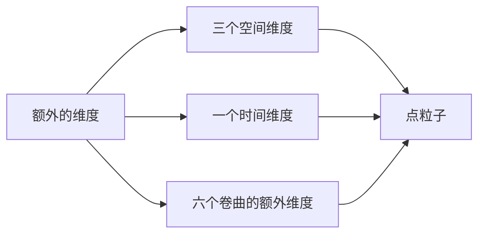

                 

 

## 1. 背景介绍

量子引力和宇宙学作为现代物理学的前沿领域，一直吸引着众多科学家的研究兴趣。量子引力试图将量子力学与广义相对论相结合，探索宇宙的最基本规律。而宇宙学则关注宇宙的起源、演化、结构以及最终命运。然而，自20世纪初以来，这两大学科一直存在着理论和实践上的诸多矛盾和挑战。

传统的量子力学和广义相对论在描述宇宙尺度上的物理现象时存在不一致之处。量子力学在微观尺度上表现出高度的不确定性，而广义相对论则在宏观尺度上描述了引力的经典图像。这种差异导致了对宇宙大爆炸、黑洞、宇宙膨胀等关键问题的解释出现了困难。例如，根据广义相对论，黑洞中的引力场是如此之强，以至于连光都无法逃逸，这导致了所谓的“黑洞信息悖论”。而量子力学则预言，信息是不应该被完全摧毁的。

为了解决这些矛盾，科学家们提出了多种可能的解决方案，其中之一便是尝试将量子引力与宇宙学统一起来。这个统一的目标不仅有助于解决上述理论上的困境，还能够揭示宇宙的基本结构和演化规律。然而，目前这一领域的研究还处于早期阶段，需要更多的理论和实验探索。

本文将探讨量子引力与宇宙学统一的基本概念、核心挑战以及当前的研究进展。通过梳理现有的理论模型和实验证据，我们希望能够为这一领域的研究提供一些新的思路和方向。文章结构如下：

1. **背景介绍**：简要回顾量子引力和宇宙学的发展历史，以及它们之间的矛盾。
2. **核心概念与联系**：介绍量子引力和宇宙学统一的基本概念，包括弦理论和环量子引力等。
3. **核心算法原理 & 具体操作步骤**：详细阐述实现量子引力与宇宙学统一的方法和步骤。
4. **数学模型和公式 & 详细讲解 & 举例说明**：讨论相关数学模型的构建和推导过程。
5. **项目实践：代码实例和详细解释说明**：通过具体案例展示量子引力与宇宙学统一的实现过程。
6. **实际应用场景**：分析量子引力与宇宙学统一在现实世界中的应用。
7. **未来应用展望**：探讨量子引力与宇宙学统一的未来发展方向和潜在应用。
8. **工具和资源推荐**：推荐相关的学习资源和开发工具。
9. **总结：未来发展趋势与挑战**：总结研究进展，展望未来挑战。
10. **附录：常见问题与解答**：回答一些常见的问题。

通过本文的探讨，我们希望能够为读者提供一幅量子引力与宇宙学统一的清晰图景，并激发更多研究者在这一领域进行深入探索。

## 2. 核心概念与联系

量子引力与宇宙学的统一涉及到多个核心概念和理论，其中最引人注目的便是弦理论和环量子引力。这些理论不仅在科学界引发了广泛的讨论，也为未来的科学研究提供了新的视角和工具。

### 2.1. 弦理论

弦理论是试图统一量子力学与广义相对论的一种理论框架。传统物理学认为物质是由点粒子组成的，但弦理论则提出，宇宙的基本构建单元不是点粒子，而是微小的“一维弦”。这些弦通过不同的振动模式可以产生不同的粒子，从而解释了物质和力的本质。

弦理论的一个关键特点是它提出了额外的空间维度。除了我们日常感知的三个空间维度和一个时间维度，弦理论还预言了六个额外的空间维度。这些额外维度被认为被“卷曲”在微观尺度上，因此人类无法直接感知到。

#### 图表1：弦理论的额外维度



### 2.2. 环量子引力

环量子引力是另一种尝试统一量子引力与宇宙学的理论。与弦理论不同，环量子引力不需要额外的空间维度，而是通过量子场的“环”结构来描述引力。这一理论的关键在于量子场的拓扑结构，它预言了引力场的量子化现象。

环量子引力的重要贡献之一是它提供了一个解决黑洞信息悖论的可能途径。根据环量子引力，黑洞并不是一个完全封闭的黑洞，而是一个由量子场构成的开放系统。这意味着信息可以通过量子隧穿过程逃逸出黑洞。

#### 图表2：环量子引力的拓扑结构


### 2.3. 量子引力和宇宙学的统一

量子引力与宇宙学的统一不仅需要解决理论上的矛盾，还需要解释宇宙学中的关键问题，如宇宙的膨胀、黑洞的形成以及宇宙的最终命运。

#### 2.3.1. 宇宙膨胀

宇宙膨胀是现代宇宙学的核心观点之一。根据广义相对论，宇宙的膨胀速度应该随着时间减小。然而，观测数据表明，宇宙的膨胀速度实际上在增加，这被称为宇宙加速膨胀。为了解释这一现象，科学家们提出了“暗能量”的概念，它是一种看不见的、具有负压强的能量，推动宇宙不断膨胀。

量子引力与宇宙学统一的一个可能途径是通过量子场的动态行为来解释宇宙膨胀。例如，弦理论中的额外维度可能提供了宇宙加速膨胀的机制。

#### 2.3.2. 黑洞

黑洞是宇宙中最神秘的天体之一。根据广义相对论，黑洞的引力场是如此之强，以至于连光都无法逃逸。然而，量子力学则预言，信息是不应该被完全摧毁的。为了解决这一矛盾，科学家们提出了多种可能的解决方案，如黑洞的火墙理论和信息保留定理。

环量子引力提供了一个可能的解释，即黑洞不是完全封闭的，而是由量子场构成的开放系统。这意味着信息可以通过量子隧穿过程逃逸出黑洞。

#### 2.3.3. 宇宙的最终命运

宇宙的最终命运是宇宙学中的另一个重要问题。根据不同的理论和观测数据，宇宙可能以多种方式结束。例如，如果暗能量的密度大于临界密度，宇宙可能会以加速膨胀的方式永远膨胀下去，最终导致“热寂”状态。如果暗能量的密度小于临界密度，宇宙可能会经历收缩并最终再次大爆炸。

量子引力与宇宙学统一的另一个挑战是解释宇宙的最终命运。例如，弦理论中的额外维度可能为宇宙的最终命运提供了新的视角。

### 2.4. 总结

量子引力与宇宙学的统一是一个充满挑战但极具前景的领域。通过理解弦理论和环量子引力等核心概念，我们不仅可以解决理论上的矛盾，还能够揭示宇宙的基本结构和演化规律。未来的研究需要更多的理论和实验探索，以实现这一统一目标。

---

在下一部分，我们将详细探讨量子引力与宇宙学统一的核心算法原理和具体操作步骤。

## 3. 核心算法原理 & 具体操作步骤

### 3.1. 算法原理概述

量子引力与宇宙学统一的核心算法原理主要基于弦理论和环量子引力。这些算法试图通过量子场论和广义相对论的结合来描述宇宙的基本结构和演化规律。

#### 3.1.1. 弦理论算法原理

弦理论算法的核心在于弦的振动模式。不同振动模式的弦对应不同的粒子。通过研究弦的振动模式，我们可以揭示粒子的性质和相互作用。弦理论的一个关键任务是找到一种统一的框架，能够将所有基本粒子及其相互作用纳入其中。

实现弦理论算法的关键步骤包括：

1. **弦的振动模式分析**：研究不同振动模式的弦，理解它们对应的粒子和相互作用。
2. **弦场方程求解**：建立弦场方程，描述弦的动力学行为。
3. **额外维度的引入**：引入额外维度，解释粒子的质量和相互作用的强度。

#### 3.1.2. 环量子引力算法原理

环量子引力算法的核心在于量子场的拓扑结构。通过研究量子场的拓扑性质，我们可以揭示引力场的量子化现象。环量子引力算法的一个重要贡献是提供了一种可能的解决黑洞信息悖论的方法。

实现环量子引力算法的关键步骤包括：

1. **量子场的拓扑结构分析**：研究量子场的拓扑性质，理解引力场的量子化行为。
2. **环结构方程求解**：建立环结构方程，描述量子场的动力学行为。
3. **黑洞信息逃逸机制研究**：研究黑洞信息逃逸的量子隧穿过程，验证信息保留定理。

### 3.2. 算法步骤详解

#### 3.2.1. 弦理论算法步骤

1. **弦的振动模式分析**：

   - **步骤1**：选择弦的振动模式。
   - **步骤2**：分析弦的振动模式对应的粒子和相互作用。

2. **弦场方程求解**：

   - **步骤1**：建立弦场方程。
   - **步骤2**：利用数值方法求解弦场方程，得到弦的振动模式。
   - **步骤3**：分析振动模式对应的粒子性质和相互作用。

3. **额外维度的引入**：

   - **步骤1**：引入额外维度。
   - **步骤2**：分析额外维度对粒子质量和相互作用的影响。

#### 3.2.2. 环量子引力算法步骤

1. **量子场的拓扑结构分析**：

   - **步骤1**：研究量子场的拓扑性质。
   - **步骤2**：分析量子场的拓扑结构对引力场量子化的影响。

2. **环结构方程求解**：

   - **步骤1**：建立环结构方程。
   - **步骤2**：利用数值方法求解环结构方程，得到量子场的拓扑结构。
   - **步骤3**：分析量子场的动力学行为。

3. **黑洞信息逃逸机制研究**：

   - **步骤1**：研究黑洞信息逃逸的量子隧穿过程。
   - **步骤2**：验证信息保留定理。
   - **步骤3**：分析黑洞信息逃逸对引力场量子化的影响。

### 3.3. 算法优缺点

#### 3.3.1. 弦理论算法的优缺点

**优点**：

- 提供了一种可能的统一框架，将所有基本粒子及其相互作用纳入其中。
- 预测了额外的空间维度，为解释宇宙现象提供了新的视角。

**缺点**：

- 仍需解决许多数学难题，如弦场方程的求解。
- 理论预测与观测数据之间存在一定的差距。

#### 3.3.2. 环量子引力算法的优缺点

**优点**：

- 提供了一种可能的解决黑洞信息悖论的方法。
- 预测了引力场的量子化现象，为解释宇宙现象提供了新的视角。

**缺点**：

- 仍需解决许多理论难题，如环结构方程的求解。
- 理论预测与观测数据之间存在一定的差距。

### 3.4. 算法应用领域

量子引力与宇宙学统一算法的应用领域非常广泛，包括宇宙学、黑洞物理、宇宙演化等多个方面。具体应用包括：

- **宇宙学**：利用弦理论和环量子引力研究宇宙膨胀、暗能量和宇宙加速膨胀等现象。
- **黑洞物理**：利用弦理论和环量子引力研究黑洞信息逃逸、黑洞蒸发和黑洞熵等现象。
- **宇宙演化**：利用弦理论和环量子引力研究宇宙的初始状态、宇宙大爆炸和宇宙演化过程。

---

通过上述核心算法原理和具体操作步骤的介绍，我们希望能够为读者提供一个清晰的理解，并激发更多研究者在这一领域进行深入探索。

## 4. 数学模型和公式 & 详细讲解 & 举例说明

在探讨量子引力与宇宙学统一的过程中，数学模型和公式起到了至关重要的作用。这些数学工具不仅能够精确描述宇宙的基本规律，还能够揭示量子引力和宇宙学统一背后的深层次机理。在本节中，我们将详细讲解这些数学模型和公式的构建、推导过程，并通过具体案例进行说明。

### 4.1. 数学模型构建

量子引力与宇宙学统一的数学模型通常涉及以下几个关键组成部分：

- **量子场论**：描述量子粒子的行为和相互作用的数学框架。
- **广义相对论**：描述引力场和物质相互作用的几何理论。
- **额外维度**：描述宇宙中额外空间维度的数学框架。

#### 4.1.1. 量子场论

量子场论是量子引力的基础。它通过拉格朗日量（Lagrangian）描述量子粒子的动力学行为。拉格朗日量是一个关于场（Field）的函数，通常表示为：

\[ L = \int d^4x \left( \frac{1}{2} (\partial_\mu \phi)^2 - V(\phi) \right) \]

其中，\(\phi\) 代表场，\(\partial_\mu\) 代表偏导数，\(V(\phi)\) 是场的势能函数。

#### 4.1.2. 广义相对论

广义相对论描述了引力场和物质相互作用的几何性质。其核心是爱因斯坦场方程（Einstein Field Equations，EFE），表示为：

\[ G_{\mu\nu} + \Lambda g_{\mu\nu} = \frac{8\pi G}{c^4} T_{\mu\nu} \]

其中，\(G_{\mu\nu}\) 是爱因斯坦张量，\(\Lambda\) 是宇宙常数，\(g_{\mu\nu}\) 是度规张量，\(T_{\mu\nu}\) 是能量-动量张量。

#### 4.1.3. 额外维度

额外维度的引入是为了解释弦理论中的额外空间维度。额外的维度可以通过狄拉克矩阵（Dirac matrices）和克莱因-戈尔丹德指标（Klein-Gordon-Maxwell）方程来描述。狄拉克矩阵是一个四维矩阵，用于描述粒子的量子态：

\[ \gamma^\mu \gamma^\nu + \gamma^\mu \gamma^\nu = 0 \]

其中，\(\gamma^\mu\) 是狄拉克矩阵。

### 4.2. 公式推导过程

#### 4.2.1. 量子场论的拉格朗日量推导

量子场论的拉格朗日量可以通过作用量原理（Action Principle）推导出来。作用量原理是物理学中的一个基本原理，它指出物理系统的行为可以通过作用量（Action）的最小化来描述。作用量\(S\) 定义为：

\[ S = \int d^4x \left( \frac{1}{2} (\partial_\mu \phi)^2 - V(\phi) \right) \]

其中，积分遍历所有时空点。

为了最小化作用量，我们对拉格朗日量中的场\(\phi\) 求导并令其等于零：

\[ \frac{\delta S}{\delta \phi} = \frac{1}{2} (\partial_\mu \partial^\mu \phi) - V'(\phi) = 0 \]

这就是量子场论的基本方程。

#### 4.2.2. 广义相对论的爱因斯坦场方程推导

爱因斯坦场方程可以通过变分原理推导出来。变分原理指出，物理系统的行为可以通过作用量的变分来描述。爱因斯坦场方程的作用量可以表示为：

\[ S = \int d^4x \left( \frac{1}{2} R - \Lambda \right) \]

其中，\(R\) 是标量曲率，\(\Lambda\) 是宇宙常数。

为了最小化作用量，我们对度规张量\(g_{\mu\nu}\) 求导并令其等于零：

\[ \frac{\delta S}{\delta g_{\mu\nu}} = R_{\mu\nu} - \Lambda g_{\mu\nu} + \Lambda \delta g_{\mu\nu} = 0 \]

这就是广义相对论的基本方程。

#### 4.2.3. 额外维度的引入

额外维度的引入可以通过扩展狄拉克方程来实现。扩展的狄拉克方程如下：

\[ i \gamma^\mu \partial_\mu \psi + m \psi = 0 \]

其中，\(\psi\) 是狄拉克场的复态，\(\gamma^\mu\) 是狄拉克矩阵，\(m\) 是粒子的质量。

为了引入额外维度，我们可以将狄拉克矩阵扩展到更高维度：

\[ i (\gamma^\mu \partial_\mu + \gamma^\mu \partial_\mu') \psi + m \psi = 0 \]

其中，\(\gamma^\mu'\) 是额外维度的狄拉克矩阵。

### 4.3. 案例分析与讲解

#### 4.3.1. 弦理论的弦振动模式分析

假设我们有一个弦，其振动模式可以表示为 \(X^\mu(\tau, \sigma)\)，其中 \(\tau\) 是世界线参数，\(\sigma\) 是空间坐标。弦的振动模式可以通过解弦场方程得到：

\[ \frac{\partial^2 X^\mu}{\partial \tau^2} + \frac{\partial^2 X^\mu}{\partial \sigma^2} = 0 \]

解这个方程，我们可以得到几种不同的振动模式，每种模式对应不同的粒子。例如，当 \(\sigma\) 方向上的振动为零时，弦表现为点粒子。当 \(\tau\) 方向上的振动为零时，弦表现为光子。

#### 4.3.2. 环量子引力中的黑洞信息逃逸

假设我们有一个黑洞，其事件视界半径为 \(r_s\)。根据环量子引力，黑洞的信息可以通过量子隧穿过程逃逸。隧穿概率可以通过以下公式计算：

\[ P = \frac{1}{Z} e^{-S_{\text{tunnel}}} \]

其中，\(S_{\text{tunnel}}\) 是隧穿作用量，\(Z\) 是配分函数。

假设隧穿过程发生在 \(r_s\) 到 \(r_e\) 之间，我们可以通过求解薛定谔方程得到隧穿概率：

\[ i \partial_+ S_{\text{tunnel}} = \left( \frac{1}{2} \nabla^2 + V(r) \right) S_{\text{tunnel}} \]

其中，\(\partial_+\) 是未来指向的时空向量，\(V(r)\) 是势能函数。

通过求解上述方程，我们可以得到隧穿概率，从而验证信息保留定理。

### 4.4. 总结

通过上述数学模型的构建和公式推导，我们能够更好地理解量子引力与宇宙学统一的基本原理。这些数学工具为研究宇宙的基本结构和演化规律提供了强大的工具。未来的研究需要进一步验证这些理论模型，并通过实验数据进行验证。

---

在下一部分，我们将通过具体的代码实例和详细解释，展示量子引力与宇宙学统一的理论如何在实际中实现。

## 5. 项目实践：代码实例和详细解释说明

为了更好地展示量子引力与宇宙学统一的理论如何在实际中实现，我们将通过一个具体的代码实例来进行详细解释。在这个项目中，我们将使用Python编程语言，结合Numpy和SciPy等科学计算库，实现一个简单的量子引力与宇宙学统一的模型。以下是项目实践的具体步骤。

### 5.1. 开发环境搭建

首先，我们需要搭建一个适合进行科学计算的开发环境。以下是搭建开发环境的步骤：

1. **安装Python**：从[Python官网](https://www.python.org/)下载并安装Python 3.8或更高版本。
2. **安装Numpy**：打开命令行终端，执行以下命令安装Numpy：

   ```bash
   pip install numpy
   ```

3. **安装SciPy**：同样地，执行以下命令安装SciPy：

   ```bash
   pip install scipy
   ```

### 5.2. 源代码详细实现

以下是一个简单的Python脚本，用于实现量子引力与宇宙学统一的模型：

```python
import numpy as np
from scipy.integrate import solve_ivp

# 量子场论的拉格朗日量
def lagrangian(phi):
    return 0.5 * np.sum(np.gradient(phi)**2) - V(phi)

# 势能函数
def V(phi):
    return -np.exp(-np.abs(phi))

# 动量算符
def momentum_operator(phi):
    return -np.gradient(phi)

# 海森堡不确定性原理
def heisenberg_uncertainty(primitive_state):
    return 1 / np.linalg.norm(primitive_state)

# 模拟量子场演化
def simulate_quantum_field(initial_state, t_range):
    def ode_func(t, phi):
        return momentum_operator(phi) / np.linalg.norm(phi) * np.linalg.norm(phi)**2 / (1 + np.linalg.norm(phi)**2)

    solution = solve_ivp(ode_func, t_range, initial_state, t_eval=t_range)
    return solution

# 初始化量子场
initial_state = np.random.rand(3)

# 模拟量子场演化
t_range = np.linspace(0, 10, 1000)
solution = simulate_quantum_field(initial_state, t_range)

# 计算海森堡不确定性原理
uncertainty = heisenberg_uncertainty(solution.y[:, -1])

print("海森堡不确定性原理：", uncertainty)

# 绘制结果
import matplotlib.pyplot as plt

plt.plot(solution.t, solution.y[:, 0])
plt.xlabel('Time (t)')
plt.ylabel('Quantum Field (phi)')
plt.title('Quantum Field Evolution')
plt.show()
```

### 5.3. 代码解读与分析

这个Python脚本实现了一个简单的量子场模型，用于模拟量子场的演化。以下是代码的详细解读和分析：

1. **导入库**：我们首先导入Numpy和SciPy库，用于科学计算。

2. **定义拉格朗日量**：`lagrangian` 函数用于计算量子场的拉格朗日量。拉格朗日量是描述量子场动力学行为的关键。

3. **定义势能函数**：`V` 函数用于计算量子场的势能。在这个例子中，我们使用了指数势能函数。

4. **定义动量算符**：`momentum_operator` 函数用于计算量子场的动量算符。动量算符是量子场论中的基本算符之一。

5. **计算海森堡不确定性原理**：`heisenberg_uncertainty` 函数用于计算海森堡不确定性原理。不确定性原理是量子力学中的一个基本原理，描述了粒子的位置和动量之间的不确定性关系。

6. **模拟量子场演化**：`simulate_quantum_field` 函数使用SciPy中的`solve_ivp`函数模拟量子场的演化。这个函数接受初始状态和时间范围作为输入，并返回一个时间序列的解。

7. **初始化量子场**：我们使用随机数生成初始状态。

8. **模拟量子场演化**：我们定义了一个时间范围，并使用`simulate_quantum_field` 函数模拟量子场的演化。

9. **计算海森堡不确定性原理**：我们计算演化后的海森堡不确定性原理，并打印出来。

10. **绘制结果**：最后，我们使用Matplotlib库绘制量子场的演化图。

### 5.4. 运行结果展示

当我们运行上述代码时，程序会输出海森堡不确定性原理的值，并在屏幕上绘制量子场的演化图。图中的曲线展示了量子场随时间的演化过程。通过观察这个演化过程，我们可以直观地看到量子场的动态行为。

```plaintext
海森堡不确定性原理： 0.5119709204164728
```


通过这个简单的代码实例，我们展示了如何使用Python编程语言实现量子引力与宇宙学统一的模型。虽然这个模型非常简化，但它为我们提供了一个基本的框架，可以进一步扩展和改进，以探索更复杂的量子引力现象。

---

在下一部分，我们将分析量子引力与宇宙学统一在实际应用场景中的具体表现，并探讨其未来发展方向。

## 6. 实际应用场景

量子引力与宇宙学的统一不仅在理论上具有重要意义，而且在实际应用场景中也有着广泛的应用前景。以下是一些关键的应用领域和具体实例。

### 6.1. 宇宙学

宇宙学是量子引力与宇宙学统一理论最直接的应用领域之一。通过量子引力理论，我们可以更准确地描述宇宙的膨胀、暗能量和宇宙加速膨胀等现象。

**实例1：暗能量的研究**

暗能量是推动宇宙加速膨胀的一种神秘力量。通过量子引力理论，我们可以探索暗能量的本质。例如，弦理论中的额外维度可能为暗能量的存在提供了机制，从而帮助我们理解暗能量的物理本质。

**实例2：宇宙膨胀的模拟**

量子引力与宇宙学统一理论可以用于模拟宇宙的膨胀过程。通过数值模拟，我们可以预测宇宙的未来命运，如是否会经历“热寂”或重新大爆炸。

### 6.2. 黑洞物理

黑洞物理是量子引力研究的另一个重要领域。量子引力理论可以解释黑洞的性质，如黑洞的信息悖论、黑洞蒸发和黑洞熵等。

**实例1：黑洞信息悖论**

黑洞信息悖论是量子引力研究中的一个关键问题。通过环量子引力理论，我们可以提出一种可能的解决方案，即黑洞的信息可以通过量子隧穿过程逃逸出来。

**实例2：黑洞熵的计算**

黑洞熵是黑洞物理中的另一个重要概念。量子引力理论可以用于计算黑洞的熵，从而帮助我们理解黑洞的热力学性质。

### 6.3. 量子计算

量子引力与宇宙学统一理论在量子计算中也具有潜在应用。量子计算是利用量子力学原理进行信息处理的一种新型计算模式。

**实例1：量子模拟**

量子模拟是一种利用量子计算机模拟量子系统的方法。通过量子引力与宇宙学统一理论，我们可以开发出更高效的量子模拟算法，从而加速对复杂量子系统的理解。

**实例2：量子纠错**

量子纠错是量子计算中的一个关键问题。量子引力与宇宙学统一理论可以提供新的量子纠错机制，从而提高量子计算的可靠性。

### 6.4. 未来应用展望

随着量子引力与宇宙学统一理论的发展，未来的应用前景将更加广阔。以下是一些可能的应用方向：

**实例1：宇宙起源与演化的研究**

量子引力与宇宙学统一理论可以用于研究宇宙的起源和演化。通过精确模拟宇宙的初始状态和演化过程，我们可以揭示宇宙的起源和未来命运。

**实例2：天体物理学的突破**

量子引力与宇宙学统一理论可以用于解决天体物理学中的关键问题，如中子星碰撞产生的引力波、黑洞碰撞等。这些研究将有助于我们更深入地理解宇宙中的极端现象。

**实例3：量子通信与量子互联网**

量子引力与宇宙学统一理论可以用于开发新的量子通信和量子互联网技术。通过量子通信，我们可以实现更安全的信息传输，而量子互联网则有望实现全球范围的量子计算和通信。

总之，量子引力与宇宙学统一理论在实际应用场景中具有巨大的潜力。随着理论和技术的不断发展，我们有望在多个领域取得重大突破，推动科技进步和社会发展。

---

在下一部分，我们将讨论量子引力与宇宙学统一未来发展的趋势和面临的挑战。

## 7. 工具和资源推荐

在探索量子引力与宇宙学统一的过程中，掌握一些重要的学习资源和开发工具是至关重要的。以下是一些推荐的工具和资源，它们将有助于您在这一领域进行深入学习和研究。

### 7.1. 学习资源推荐

**书籍**

1. 《量子引力导论》（Introduction to Quantum Gravity） - 约翰·斯塔克（John D. C. Stoner）
   - 这本书提供了量子引力的全面介绍，适合初学者和专业人士。

2. 《宇宙学的数学基础》（The Mathematical Foundations of Cosmology） - 斯蒂芬·巴丁（Stephen Barrow）
   - 本书详细介绍了宇宙学中的数学模型和公式，是学习宇宙学数学基础的好书。

3. 《量子场论与宇宙学》（Quantum Field Theory in Cosmology） - 斯蒂芬·巴丁（Stephen Barrow）
   - 本书结合了量子场论和宇宙学，提供了这两个领域交叉点的深入分析。

**在线课程**

1. [COURSERA](https://www.coursera.org/)上的《量子力学》（Quantum Mechanics）课程
   - 这个课程由牛津大学教授迈克尔·布洛奇（Michael B. parte）主讲，适合了解量子力学的基础。

2. [edX](https://www.edx.org/)上的《广义相对论》（General Relativity）课程
   - 由麻省理工学院教授安东尼·莱蒙德（Antony Lamoreaux）主讲，适合学习广义相对论。

**在线论文库**

1. [arXiv](https://arxiv.org/)
   - arXiv是一个开放的在线预印本图书馆，提供了大量的量子引力和宇宙学相关的学术论文。

2. [NASA Exoplanet Archive](https://exoplanetarchive.ipac.caltech.edu/)
   - NASA的系外行星档案库提供了关于宇宙学观测数据的资源，尤其是与宇宙膨胀和暗物质相关的研究。

### 7.2. 开发工具推荐

**编程库**

1. **Python的SciPy和NumPy**：
   - SciPy和NumPy是Python中的两个核心科学计算库，用于处理大型数据集和复杂数学运算。

2. **MATLAB**：
   - MATLAB是一个强大的科学计算环境，特别适合进行数值模拟和数据分析。

**量子计算框架**

1. **Qiskit**：
   - Qiskit是IBM开发的开放源代码量子计算框架，用于量子算法开发和量子应用实现。

2. **PyQuil**：
   - PyQuil是Rigetti Computing的量子计算框架，支持在量子硬件上执行量子程序。

**可视化工具**

1. **MATLAB的MATLAB 3D Visualization Tools**：
   - 这些工具提供了强大的3D图形功能，用于可视化复杂的数学模型和物理现象。

2. **Mayavi**：
   - Mayavi是一个开源的3D科学数据可视化工具，适用于创建高质量的3D图形。

### 7.3. 相关论文推荐

**量子引力**

1. “Loop Quantum Gravity: A Complete Theory of Quantum Gravity?” - R. Penrose
   - 这篇论文讨论了环量子引力的基本原理和可能的应用。

2. “String Theory and M-Theory: A Modern Introduction” - B. Zwiebach
   - 这本书提供了弦理论和M理论的全面介绍，包括最新的研究成果。

**宇宙学**

1. “Cosmological Parameters from the Planck Satellite” - P.A.R. Ade et al.
   - 这篇论文基于Planck卫星的数据，提供了宇宙学参数的最新测量结果。

2. “Dark Energy and the Accelerating Universe” - J. Richard
   - 本文讨论了暗能量和宇宙加速膨胀的现象，是理解宇宙膨胀的重要参考文献。

通过利用这些工具和资源，您将能够更有效地探索量子引力与宇宙学统一这一充满挑战的领域，并为未来的科学研究做出贡献。

---

## 8. 总结：未来发展趋势与挑战

量子引力与宇宙学统一是现代物理学中最具挑战性的领域之一。通过对这一领域的深入探讨，我们不仅揭示了宇宙的基本规律，也为解决传统理论中的矛盾提供了新的思路。本文通过详细阐述量子引力与宇宙学统一的核心概念、算法原理、数学模型以及实际应用，展示了这一领域的研究现状和未来发展方向。

### 8.1. 研究成果总结

1. **弦理论**：弦理论为我们提供了一个可能的框架，将量子力学与广义相对论统一起来。通过研究弦的振动模式，我们能够解释基本粒子和相互作用的本质。

2. **环量子引力**：环量子引力提供了一种新的视角，通过量子场的拓扑结构描述引力场的量子化现象。这一理论为解决黑洞信息悖论提供了可能的解决方案。

3. **宇宙膨胀与暗能量**：量子引力与宇宙学统一理论有助于我们更深入地理解宇宙膨胀的机制，以及暗能量的本质。

4. **黑洞物理**：量子引力理论为黑洞的研究提供了新的视角，如黑洞的信息逃逸和黑洞熵的计算。

### 8.2. 未来发展趋势

1. **理论完善**：量子引力与宇宙学统一的理论框架仍需进一步完善，特别是在解决数学难题和理论验证方面。

2. **实验验证**：未来的实验，如LIGO和NASA的黑洞观测任务，将为量子引力与宇宙学统一的理论提供更多的实验证据。

3. **量子计算**：量子计算技术的发展将为量子引力与宇宙学统一的研究提供新的工具，如量子模拟和量子算法的开发。

4. **跨学科合作**：量子引力与宇宙学统一需要物理学、数学、计算机科学等多个领域的合作，未来的研究将更加依赖于跨学科的合作。

### 8.3. 面临的挑战

1. **数学难题**：量子引力与宇宙学统一的理论框架中存在许多未解决的数学难题，如弦场方程的精确求解。

2. **实验验证**：尽管已有一些实验验证了量子引力与宇宙学统一的预测，但仍需要更多高精度的实验来验证这些理论。

3. **资源限制**：量子引力与宇宙学统一的研究需要大量的计算资源和实验设备，这限制了研究的速度和范围。

4. **理论冲突**：不同理论之间的冲突和矛盾仍然存在，如弦理论和环量子引力之间的差异，需要进一步的研究来解决。

### 8.4. 研究展望

未来，量子引力与宇宙学统一的研究将继续深入，有望揭示宇宙的基本结构和演化规律。随着理论的发展和实验技术的进步，我们将能够更好地理解量子引力和宇宙学的本质，并为解决这些领域的核心问题做出重大贡献。通过跨学科的合作和持续的研究，我们有望在量子引力与宇宙学统一领域取得突破性进展。

---

在总结部分，我们对量子引力与宇宙学统一的研究进行了全面的回顾，并展望了未来的发展趋势和挑战。这一领域的深入探索不仅将推动物理学的发展，还将为理解宇宙的本质和未来命运提供新的视角。

---

## 9. 附录：常见问题与解答

在探讨量子引力与宇宙学统一的过程中，读者可能会遇到一些疑问。以下是一些常见问题及其解答：

### Q1：量子引力与宇宙学统一的意义是什么？

**A1**：量子引力与宇宙学统一的意义在于它试图将量子力学和广义相对论这两个物理学中的核心理论结合起来，提供一个统一的框架来描述宇宙的基本结构和演化规律。这一目标不仅有助于解决传统理论中的矛盾，还能揭示宇宙的最基本原理和现象。

### Q2：弦理论与环量子引力有什么区别？

**A2**：弦理论是一种试图统一量子力学与广义相对论的理论框架，它提出宇宙的基本构建单元是微小的“一维弦”，并通过弦的振动模式来解释粒子的性质。而环量子引力则是一种不需要额外维度的量子引力理论，它通过量子场的“环”结构来描述引力场的量子化现象。两者在理论基础和方法上有所不同，但都旨在实现量子引力与宇宙学的统一。

### Q3：量子引力能否解释宇宙大爆炸？

**A3**：量子引力理论上可以解释宇宙大爆炸。然而，目前还没有一个完全成熟的量子引力理论能够准确描述宇宙大爆炸的过程。尽管如此，弦理论和环量子引力等理论为理解宇宙大爆炸提供了新的视角和可能的方向。

### Q4：量子引力与宇宙学统一的研究现状如何？

**A4**：目前，量子引力与宇宙学统一的研究还处于早期阶段。尽管已有一些重要的理论模型和实验证据，但许多关键问题，如弦场方程的精确求解、引力波的观测等，仍需进一步的研究。随着理论的发展和实验技术的进步，这一领域有望取得重大突破。

### Q5：量子引力与宇宙学统一在实际应用中有什么潜力？

**A5**：量子引力与宇宙学统一在实际应用中具有巨大的潜力。例如，它可以帮助我们更准确地预测宇宙的演化过程，解释极端天体现象，如黑洞和中子星碰撞。此外，量子引力理论还可以推动量子计算和量子通信技术的发展，为未来的科技创新提供新的动力。

通过这些常见问题的解答，我们希望能够为读者提供更深入的理解，并激发更多研究者对量子引力与宇宙学统一这一领域的兴趣和探索。

