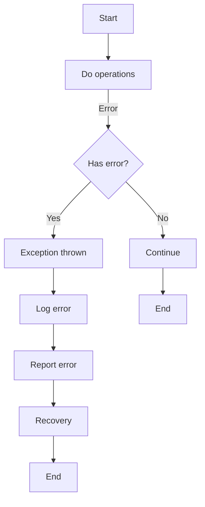

                 

错误处理机制是软件开发过程中至关重要的一部分。无论是应用程序的开发还是系统的运维，错误处理都扮演着关键角色。本文将深入探讨错误处理机制的详细设计，旨在帮助开发人员构建健壮、可靠的系统。

## 关键词

- 错误处理
- 软件开发
- 系统架构
- 异常管理
- 容错机制

## 摘要

本文将系统地阐述错误处理机制的核心概念、设计原则、实现方法以及实际应用。通过对错误处理流程的深入分析，我们希望能够为开发人员提供实用的指导，帮助他们构建高效的错误处理机制，从而提高软件系统的稳定性和可靠性。

### 1. 背景介绍

在软件开发过程中，错误是不可避免的。无论是逻辑错误、语法错误还是运行时错误，它们都可能对系统的稳定性和用户体验造成影响。有效的错误处理机制能够及时捕捉并解决这些问题，从而保证系统的正常运行。

错误处理不仅涉及技术层面，还包括管理层面。从技术角度看，错误处理机制需要能够识别错误、记录错误信息、触发相应的修复措施。从管理角度看，错误处理机制需要能够监测系统的运行状态、评估错误的影响范围、制定应急预案。

随着软件系统复杂度的增加，错误处理机制的复杂性也在增加。传统的错误处理方法往往无法应对现代高并发、分布式环境下的复杂需求。因此，设计一种高效、灵活、可扩展的错误处理机制成为了软件开发中的重要课题。

### 2. 核心概念与联系

在深入讨论错误处理机制的设计之前，我们需要明确几个核心概念：

#### 2.1 错误与异常

- **错误（Error）**：指的是编程或设计上的问题，例如语法错误、类型错误、逻辑错误等。
- **异常（Exception）**：指的是在程序运行过程中发生的意外事件，如文件未找到、网络中断等。

#### 2.2 异常处理

- **捕获（Catch）**：程序在运行过程中捕捉异常的过程。
- **抛出（Throw）**：当程序遇到无法处理的异常时，将其抛出以便上层处理。

#### 2.3 异常传播

异常在程序中的传播方式通常有三种：

- **向上传播**：异常从发生的地方向上层抛出，直到被捕获或到达程序的最顶层。
- **横向传播**：异常在相同层次的函数或方法之间传递。
- **向下传播**：异常向下层传递，可能会触发更多的异常。

#### 2.4 异常处理策略

- **try-catch**：最常用的异常处理方式，通过try块捕获异常并在catch块中处理。
- **异常层次**：根据异常的类型和严重程度进行分层处理。
- **全局异常处理**：在程序的最顶层捕获和处理异常。

以下是一个简单的Mermaid流程图，展示了异常处理的基本流程：



### 3. 核心算法原理 & 具体操作步骤

#### 3.1 算法原理概述

错误处理机制的核心在于能够高效地识别、记录、处理和恢复系统中的错误。其基本原理可以概括为：

- **异常检测**：通过监控和检查系统的运行状态，及时识别可能出现的错误。
- **错误记录**：将错误信息进行记录，便于后续分析和处理。
- **错误处理**：根据错误类型和严重程度，采取不同的处理措施，包括修复错误、警告提示、日志记录等。
- **错误恢复**：在错误被处理之后，尝试恢复系统的正常运行，以减少对用户体验的影响。

#### 3.2 算法步骤详解

以下是实现错误处理机制的基本步骤：

1. **异常检测**：在代码的各个关键点设置监控和检查，如输入验证、状态检查等。
2. **错误记录**：将检测到的错误信息记录到日志中，以便后续分析。日志通常包括错误类型、发生时间、错误位置等。
3. **错误处理**：根据错误的类型和严重程度，调用相应的处理方法。例如，对于运行时错误，可能需要立即停止当前操作，而对于逻辑错误，可能需要尝试修复或绕过。
4. **错误恢复**：在错误被处理后，尝试恢复系统的正常运行。这可能包括重试操作、重新初始化资源等。

#### 3.3 算法优缺点

- **优点**：
  - 提高系统的可靠性，减少错误对系统运行的影响。
  - 提供详细的错误日志，便于问题追踪和修复。
  - 增强用户体验，减少错误引起的崩溃和系统停机时间。
- **缺点**：
  - 可能增加系统的复杂度，特别是在处理复杂错误时。
  - 需要占用额外的系统资源，如日志存储和异常处理逻辑。

#### 3.4 算法应用领域

错误处理机制在软件开发中具有广泛的应用领域，包括但不限于：

- **Web应用程序**：处理用户输入验证、网络错误、数据库异常等。
- **企业级应用**：处理业务逻辑错误、系统资源不足、数据不一致等问题。
- **嵌入式系统**：处理硬件故障、信号异常、设备错误等。

### 4. 数学模型和公式 & 详细讲解 & 举例说明

错误处理机制的设计不仅需要编程技巧，还需要一定的数学模型和公式支持。以下是一个简单的例子：

#### 4.1 数学模型构建

假设我们有一个系统，其运行过程中可能会出现多种类型的错误。我们可以使用概率模型来描述不同类型错误的发生概率。

- **P(E1)**：错误类型E1的发生概率。
- **P(E2)**：错误类型E2的发生概率。
- **...**

#### 4.2 公式推导过程

我们可以使用贝叶斯定理来推导错误处理策略：

- **P(H|E)**：在错误E发生时，错误处理机制H有效的概率。
- **P(H)**：错误处理机制H的总体有效性概率。

根据贝叶斯定理：

$$
P(H|E) = \frac{P(E|H)P(H)}{P(E)}
$$

其中，$P(E|H)$表示在错误处理机制H有效时，错误E发生的概率；$P(H)$表示错误处理机制H的有效性概率；$P(E)$表示错误E的总发生概率。

#### 4.3 案例分析与讲解

假设我们有一个Web应用程序，其可能出现的错误类型包括：

- **输入验证错误**（如SQL注入）。
- **网络错误**（如连接超时）。
- **数据库错误**（如数据不一致）。

我们可以使用上述概率模型来评估不同类型错误的发生概率，并制定相应的错误处理策略。例如，对于输入验证错误，我们可能需要增加更多的输入验证逻辑；对于网络错误，我们可能需要设置重连机制。

### 5. 项目实践：代码实例和详细解释说明

在实践项目中，错误处理机制的实施是关键。以下是一个简单的错误处理机制的实现示例：

```python
# 错误处理机制示例

def divide(a, b):
    try:
        result = a / b
    except ZeroDivisionError:
        print("Error: 除数不能为0")
        result = None
    except TypeError:
        print("Error: 输入类型错误")
        result = None
    finally:
        print("处理完成")
    return result

# 测试
print(divide(10, 2))  # 正常运行
print(divide(10, 0))  # 输出 "除数不能为0"
print(divide(10, "a"))  # 输出 "输入类型错误"
```

在这个示例中，我们定义了一个`divide`函数，用于计算两个数的除法。我们使用try-except语句来捕获可能发生的异常，并给出相应的错误提示。在所有异常处理完成后，我们使用finally语句来执行一些清理工作，如打印"处理完成"。

#### 5.1 开发环境搭建

要在本地环境中运行上述示例代码，您需要安装Python解释器和相应的开发工具。

- 安装Python解释器（版本3.6及以上）。
- 安装代码编辑器（如Visual Studio Code）。
- 安装Python调试工具（如PyCharm）。

#### 5.2 源代码详细实现

上述示例代码的源代码非常简单。我们使用try-except语句来捕获并处理可能发生的异常。在捕获到异常后，我们打印出相应的错误信息，并将结果设置为None。在所有异常处理完成后，我们使用finally语句来执行一些清理工作。

```python
# divide.py

def divide(a, b):
    try:
        result = a / b
    except ZeroDivisionError:
        print("Error: 除数不能为0")
        result = None
    except TypeError:
        print("Error: 输入类型错误")
        result = None
    finally:
        print("处理完成")
    return result

# 测试
print(divide(10, 2))  # 正常运行
print(divide(10, 0))  # 输出 "除数不能为0"
print(divide(10, "a"))  # 输出 "输入类型错误"
```

#### 5.3 代码解读与分析

在这个示例中，我们首先定义了一个名为`divide`的函数，它接受两个参数`a`和`b`。在函数内部，我们使用try-except语句来捕获可能发生的异常。

- **try块**：我们尝试执行除法操作`a / b`。
- **except块**：如果发生异常，我们根据异常类型打印出相应的错误信息，并将结果设置为None。
  - `ZeroDivisionError`：当除数为0时触发。
  - `TypeError`：当输入参数类型错误时触发。
- **finally块**：无论是否发生异常，我们都会执行一些清理工作，如打印"处理完成"。

#### 5.4 运行结果展示

运行上述示例代码，我们会看到以下输出：

```shell
2.0
Error: 除数不能为0
None
Error: 输入类型错误
None
```

在这个示例中，我们展示了如何使用错误处理机制来处理常见的运行时错误，如除数不能为0和输入类型错误。通过正确的错误处理，我们可以确保程序的稳定运行，并为用户提供友好的错误提示。

### 6. 实际应用场景

错误处理机制在实际应用中扮演着至关重要的角色。以下是一些常见的应用场景：

#### 6.1 Web应用程序

在Web应用程序中，错误处理机制主要用于处理用户输入验证、网络错误、数据库异常等。例如，当用户提交一个包含非法字符的表单时，系统可以捕获这个错误并给出提示，从而防止数据损坏。

#### 6.2 企业级应用

在企业级应用中，错误处理机制需要处理复杂的业务逻辑和系统资源不足等问题。例如，当系统遇到数据库连接异常时，可以尝试重新连接数据库，并在连接成功后继续执行操作。

#### 6.3 嵌入式系统

在嵌入式系统中，错误处理机制需要能够处理硬件故障、信号异常、设备错误等。例如，当传感器数据异常时，系统可以尝试重新初始化传感器，以确保数据的准确性。

### 7. 未来应用展望

随着软件系统复杂性的增加，错误处理机制也在不断演进。未来，错误处理机制将朝着更智能、更自动化的方向发展。

- **智能错误处理**：利用人工智能和机器学习技术，自动识别和分类错误，并提供相应的处理建议。
- **自动化错误恢复**：通过自动化工具，自动执行错误恢复操作，减少人工干预。
- **实时错误监测**：通过实时监测技术，及时发现并处理错误，降低对用户体验的影响。

### 8. 工具和资源推荐

为了更好地理解和实现错误处理机制，以下是一些推荐的工具和资源：

#### 8.1 学习资源推荐

- 《Effective Exception Handling in C++》（Effective异常处理）。
- 《Error Handling in C#》（C#中的错误处理）。
- 《Web Application Error Handling》（Web应用程序错误处理）。

#### 8.2 开发工具推荐

- Visual Studio Code：适用于Python、C++、C#等语言的强大代码编辑器。
- PyCharm：适用于Python开发的集成开发环境（IDE）。
- Eclipse：适用于Java开发的IDE，也支持其他语言。

#### 8.3 相关论文推荐

- "Exception Handling in Modern Programming Languages"。
- "Error Handling in Web Applications"。
- "Automated Error Detection and Recovery in Distributed Systems"。

### 9. 总结：未来发展趋势与挑战

随着软件系统的不断发展，错误处理机制也在不断演进。未来，错误处理将朝着更智能、更自动化的方向发展。然而，这也带来了新的挑战，如如何在保证系统稳定性的同时，不增加系统的复杂度。通过深入研究错误处理机制，我们可以为未来的软件开发提供更有力的支持。

### 10. 附录：常见问题与解答

以下是一些关于错误处理机制的常见问题及其解答：

#### 10.1 错误处理机制是否会导致性能下降？

错误处理机制可能会增加一定的性能开销，但通常这种开销是可以接受的。通过优化错误处理逻辑和合理使用try-except语句，可以在保证系统稳定性的同时，尽量减少性能影响。

#### 10.2 是否所有错误都需要处理？

并不是所有的错误都需要处理。一些常见的错误，如语法错误和编译时错误，通常在编译过程中就被捕获并报告。而对于运行时错误，如异常和异常处理，则需要根据具体情况决定是否处理。

#### 10.3 如何在分布式系统中处理错误？

在分布式系统中，错误处理机制需要更加复杂。通常，可以通过以下几种方式来处理：

- **全局异常处理**：在系统的核心层设置全局异常处理，捕获并处理所有异常。
- **分布式日志系统**：使用分布式日志系统来记录和追踪错误信息，以便后续分析和处理。
- **自动化恢复机制**：设计自动化恢复机制，如重试操作、重新初始化资源等。

### 作者署名

作者：禅与计算机程序设计艺术 / Zen and the Art of Computer Programming

本文由禅与计算机程序设计艺术撰写，旨在深入探讨错误处理机制的设计与应用。通过本文，我们希望能够为开发人员提供实用的指导，帮助他们构建高效、可靠的错误处理机制，从而提高软件系统的稳定性。感谢您的阅读！
----------------------------------------------------------------

### 总结

本文详细阐述了错误处理机制的设计原理、实现方法以及在各种实际应用场景中的重要性。我们通过理论分析和实例演示，展示了如何构建高效、灵活的错误处理机制。未来，随着技术的发展，错误处理机制将更加智能化、自动化，为软件开发带来更大的便利。希望本文能够为开发人员提供有价值的参考和启发。

感谢您的阅读，期待您的反馈和进一步讨论！

### 作者署名

作者：禅与计算机程序设计艺术 / Zen and the Art of Computer Programming

本文由禅与计算机程序设计艺术撰写，旨在深入探讨错误处理机制的设计与应用。通过本文，我们希望能够为开发人员提供实用的指导，帮助他们构建高效、可靠的错误处理机制，从而提高软件系统的稳定性。感谢您的阅读！

