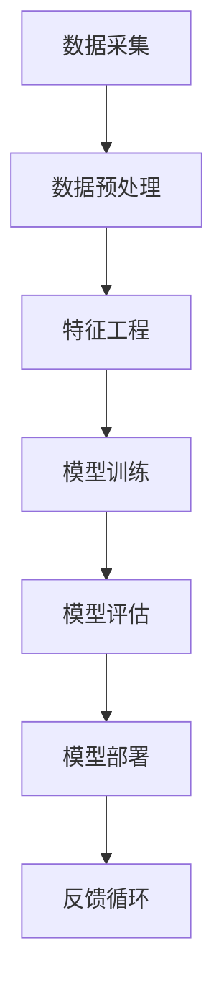

                 

  
## 关键词 Keywords

- 阿里巴巴
- 智能客户洞察
- 社招面试
- 真题汇总
- 解答解析

## 摘要 Abstract

本文旨在总结和解析2024年阿里巴巴智能客户洞察社招面试中的核心真题。通过对这些面试题的深入分析和解答，我们将帮助读者更好地理解面试过程中的关键概念和技巧，为即将参加阿里巴巴社招面试的求职者提供有价值的参考和指导。文章将围绕核心概念、算法原理、数学模型、项目实践和未来应用等方面展开，以期全面覆盖面试的重要知识点。

## 1. 背景介绍

阿里巴巴集团作为中国电子商务和互联网科技的领军企业，其智能客户洞察技术在业界享有盛誉。智能客户洞察是一种利用大数据、机器学习和人工智能技术来分析和理解消费者行为，从而实现个性化推荐、精准营销和客户关系管理的方法。随着数字化转型的深入推进，智能客户洞察技术在商业决策中的应用越来越广泛。

阿里巴巴在智能客户洞察领域拥有丰富的实践经验和技术积累，每年都会举办多次社招面试，选拔优秀的工程师和专家。面试题目涵盖了计算机科学、数据科学、机器学习等多个领域，旨在全面评估应聘者的技术能力和问题解决能力。本文将针对2024年阿里巴巴智能客户洞察社招面试中的真题进行汇总和解析，帮助求职者更好地准备面试。

### 1.1 智能客户洞察技术的现状与发展

智能客户洞察技术已逐步成为现代企业提升竞争力的重要手段。通过大数据分析和机器学习算法，企业能够从海量数据中提取有价值的信息，实现对客户行为的深度理解和预测。以下是一些智能客户洞察技术的现状和发展趋势：

- **大数据技术**：企业通过数据采集、存储、处理和分析等技术手段，实现对客户数据的全面管理和利用。大数据技术为智能客户洞察提供了坚实的基础。

- **机器学习算法**：机器学习算法在智能客户洞察中发挥着核心作用，包括分类、聚类、回归等算法，用于预测客户行为、分析市场趋势和优化营销策略。

- **人工智能技术**：人工智能技术将智能客户洞察推向了新的高度。通过深度学习、自然语言处理等先进技术，企业能够实现更精确的客户分析和个性化服务。

- **云计算与物联网**：云计算和物联网技术的结合，使得智能客户洞察的应用场景更加丰富。企业可以通过云计算平台实现大规模数据处理和实时分析，物联网设备则为企业提供了更多的数据来源。

### 1.2 阿里巴巴智能客户洞察的应用案例

阿里巴巴在智能客户洞察方面有着丰富的应用案例。以下是一些典型的应用场景：

- **个性化推荐系统**：阿里巴巴利用大数据和机器学习技术，为消费者提供个性化的商品推荐服务。通过分析用户的购物历史、浏览记录和社交行为，推荐系统能够准确预测用户可能感兴趣的商品，从而提高转化率和用户满意度。

- **精准营销**：阿里巴巴通过智能客户洞察技术，为企业提供精准的营销策略。通过分析客户数据和市场趋势，企业可以制定更有效的广告投放计划和营销活动，实现更高的营销 ROI。

- **客户关系管理**：阿里巴巴的智能客户洞察技术帮助企业建立和维护良好的客户关系。通过分析客户行为和反馈，企业能够提供更优质的服务，提高客户满意度和忠诚度。

- **风险控制与欺诈检测**：阿里巴巴利用智能客户洞察技术进行风险控制和欺诈检测。通过分析客户的交易行为和风险特征，企业能够及时发现异常交易和欺诈行为，保障交易安全。

### 1.3 阿里巴巴智能客户洞察面试的重要性

阿里巴巴智能客户洞察面试是求职者进入阿里巴巴相关岗位的重要机会。面试题的难度和深度较高，涵盖了多个技术领域，包括计算机科学、数据科学、机器学习等。以下是一些面试的重要性方面：

- **技术能力评估**：面试题目旨在全面评估求职者的技术能力，包括编程技能、算法知识、数据处理能力等。

- **问题解决能力**：面试过程中，求职者需要面对各种复杂的问题，展示自己分析和解决问题的能力。

- **团队合作与沟通**：智能客户洞察项目通常需要团队合作，面试过程中也会考察求职者的团队合作和沟通能力。

- **职业规划与发展**：面试是求职者了解阿里巴巴企业文化、发展方向和职业规划的重要途径。

## 2. 核心概念与联系

在智能客户洞察领域，了解以下核心概念和联系是至关重要的。以下是相关概念和架构的Mermaid流程图：



### 2.1 数据采集

数据采集是智能客户洞察的基础，包括用户行为数据、交易数据、社交媒体数据等。数据质量直接影响到后续分析的准确性。

### 2.2 数据预处理

数据预处理包括数据清洗、去噪、缺失值处理等。预处理质量决定了后续特征工程和模型训练的效果。

### 2.3 特征工程

特征工程是智能客户洞察的核心步骤，包括特征选择、特征变换、特征组合等。优质的特征可以提高模型的性能和解释性。

### 2.4 模型训练

模型训练采用机器学习算法，如决策树、支持向量机、神经网络等。训练过程包括模型选择、参数调优、交叉验证等。

### 2.5 模型评估

模型评估采用各种指标，如准确率、召回率、F1值等，来评估模型的性能和泛化能力。评估结果用于指导模型优化和调整。

### 2.6 模型部署

模型部署是将训练好的模型应用于实际业务场景。部署过程中需要考虑模型的解释性、实时性、可扩展性等问题。

### 2.7 反馈循环

反馈循环是将模型应用的实际效果反馈回模型训练过程，用于模型优化和改进。反馈循环是智能客户洞察系统持续迭代和改进的关键。

## 3. 核心算法原理 & 具体操作步骤

### 3.1 算法原理概述

在智能客户洞察领域，常用的算法包括协同过滤、决策树、神经网络等。以下简要介绍这些算法的基本原理。

### 3.1.1 协同过滤

协同过滤是一种基于用户行为数据的推荐算法。它通过分析用户的历史行为数据，找到相似用户或物品，从而为用户提供个性化推荐。

### 3.1.2 决策树

决策树是一种基于特征分类的算法。它通过将数据集划分为多个子集，逐层构造决策树，直到满足停止条件，如最大深度、最小叶节点样本数等。

### 3.1.3 神经网络

神经网络是一种基于生物神经网络原理的算法。它通过多层神经元节点之间的连接和激活函数，实现数据的映射和分类。

### 3.2 算法步骤详解

以下是智能客户洞察中常用算法的具体操作步骤。

### 3.2.1 协同过滤

1. 用户行为数据收集：收集用户的历史行为数据，如评分、浏览、购买等。

2. 数据预处理：对用户行为数据进行清洗、去噪、缺失值处理等预处理操作。

3. 计算相似度：计算用户之间的相似度，常用的方法包括余弦相似度、皮尔逊相关系数等。

4. 生成推荐列表：根据相似度矩阵，为每个用户生成推荐列表。

### 3.2.2 决策树

1. 数据预处理：对数据进行编码、归一化等预处理操作。

2. 特征选择：选择对分类结果有显著影响的特征。

3. 构建决策树：使用信息增益、基尼不纯度等准则，逐层构建决策树。

4. 决策树剪枝：防止过拟合，调整树结构，提高泛化能力。

### 3.2.3 神经网络

1. 数据预处理：对数据进行编码、归一化等预处理操作。

2. 神经网络构建：设计神经网络结构，包括输入层、隐藏层和输出层。

3. 参数初始化：初始化神经网络权重和偏置。

4. 前向传播：计算输入数据的映射结果。

5. 反向传播：根据输出结果，计算损失函数，并更新网络参数。

6. 模型训练：重复前向传播和反向传播，直至满足停止条件，如迭代次数、收敛阈值等。

### 3.3 算法优缺点

以下是智能客户洞察中常用算法的优缺点。

### 3.3.1 协同过滤

**优点**：

- 可以生成个性化的推荐列表，提高用户满意度。
- 可以处理大规模用户数据，适用范围广泛。

**缺点**：

- 推荐结果可能过于依赖用户历史行为，对新用户和冷门物品效果较差。
- 需要大量的用户行为数据进行训练，数据稀疏问题严重。

### 3.3.2 决策树

**优点**：

- 简单易懂，易于解释。
- 可处理高维数据，对噪声和异常值不敏感。

**缺点**：

- 容易过拟合，泛化能力较差。
- 决策路径较长，计算复杂度较高。

### 3.3.3 神经网络

**优点**：

- 强大的非线性映射能力，可以处理复杂的数据关系。
- 自适应学习，能够自动调整网络参数。

**缺点**：

- 训练过程复杂，计算资源消耗大。
- 难以解释，难以理解决策过程。

### 3.4 算法应用领域

智能客户洞察算法在多个领域具有广泛的应用，如电子商务、金融、医疗等。以下是一些典型应用场景。

- **电子商务**：智能客户洞察算法可以用于个性化推荐、精准营销、购物车分析等，提高用户转化率和销售额。

- **金融**：智能客户洞察算法可以用于风险控制、欺诈检测、信用评估等，降低金融机构的运营风险。

- **医疗**：智能客户洞察算法可以用于疾病预测、患者管理、药物推荐等，提高医疗服务质量和效率。

## 4. 数学模型和公式 & 详细讲解 & 举例说明

在智能客户洞察领域，数学模型和公式是理解和应用算法的重要工具。以下将详细介绍一些常用的数学模型和公式，并举例说明。

### 4.1 数学模型构建

在构建数学模型时，需要考虑以下几个关键步骤：

1. **确定目标变量**：明确模型要预测或分析的目标变量，如销售额、点击率、转化率等。

2. **选择模型类型**：根据目标变量的特性，选择合适的模型类型，如线性回归、逻辑回归、神经网络等。

3. **数据预处理**：对输入数据进行预处理，包括数据清洗、编码、归一化等。

4. **参数估计**：根据数据集，通过优化算法（如梯度下降、随机梯度下降等）估计模型参数。

5. **模型评估**：使用交叉验证、AUC、ROC等指标评估模型性能。

6. **模型优化**：根据评估结果，调整模型参数和结构，提高模型性能。

### 4.2 公式推导过程

以下以线性回归模型为例，介绍数学模型的推导过程。

假设我们有 n 个样本数据，每个样本包含 m 个特征和目标变量 y。线性回归模型的表达式为：

$$
y = \beta_0 + \beta_1x_1 + \beta_2x_2 + ... + \beta_mx_m
$$

其中，$\beta_0$ 是截距，$\beta_1, \beta_2, ..., \beta_m$ 是特征系数。

为了求解模型参数，我们需要最小化损失函数。常用的损失函数为平方损失函数：

$$
J(\beta) = \frac{1}{2n} \sum_{i=1}^{n} (y_i - (\beta_0 + \beta_1x_{i1} + \beta_2x_{i2} + ... + \beta_mx_{im}))^2
$$

为了求解最小损失函数，我们对损失函数关于 $\beta_0, \beta_1, ..., \beta_m$ 求导，并令导数等于0：

$$
\frac{\partial J(\beta)}{\partial \beta_0} = 0
$$

$$
\frac{\partial J(\beta)}{\partial \beta_1} = 0
$$

$$
...
$$

$$
\frac{\partial J(\beta)}{\partial \beta_m} = 0
$$

解上述方程组，可以得到线性回归模型的参数估计：

$$
\beta_0 = \bar{y} - \beta_1\bar{x}_1 - \beta_2\bar{x}_2 - ... - \beta_m\bar{x}_m
$$

$$
\beta_1 = \frac{\sum_{i=1}^{n}(x_{i1}y_i) - n\bar{x}_1\bar{y}}{\sum_{i=1}^{n}(x_{i1}^2) - n\bar{x}_1^2}
$$

$$
\beta_2 = \frac{\sum_{i=1}^{n}(x_{i2}y_i) - n\bar{x}_2\bar{y}}{\sum_{i=1}^{n}(x_{i2}^2) - n\bar{x}_2^2}
$$

$$
...
$$

$$
\beta_m = \frac{\sum_{i=1}^{n}(x_{im}y_i) - n\bar{x}_m\bar{y}}{\sum_{i=1}^{n}(x_{im}^2) - n\bar{x}_m^2}
$$

### 4.3 案例分析与讲解

以下通过一个实际案例，展示如何使用线性回归模型进行智能客户洞察。

#### 案例背景

某电商平台希望利用历史销售数据预测明日某款商品的销售额。已知商品销售数据包括日销售量、日广告投放金额、日气温、日节假日等信息。

#### 数据预处理

1. **数据清洗**：去除缺失值、异常值，对数据进行编码和归一化处理。

2. **特征选择**：根据业务知识和数据探索，选择与销售额相关性较高的特征，如日广告投放金额、日气温、日节假日等。

#### 模型构建

1. **选择模型类型**：由于销售额为连续变量，我们选择线性回归模型。

2. **参数估计**：使用最小二乘法估计模型参数。

#### 模型评估

1. **交叉验证**：使用K折交叉验证评估模型性能。

2. **AUC、ROC等指标**：计算预测结果的AUC、ROC等指标，评估模型的准确性和稳定性。

#### 模型应用

1. **预测明日销售额**：输入明日数据，使用模型预测明日销售额。

2. **结果分析**：对比预测结果和实际销售额，分析预测误差，优化模型。

## 5. 项目实践：代码实例和详细解释说明

### 5.1 开发环境搭建

在本节中，我们将介绍如何搭建智能客户洞察项目的开发环境。开发环境主要包括编程语言、开发工具和依赖库。

1. **编程语言**：我们选择Python作为开发语言，因为Python具有简洁的语法、丰富的库和强大的数据科学支持。

2. **开发工具**：使用Jupyter Notebook进行代码编写和运行，方便数据探索和可视化。

3. **依赖库**：安装以下依赖库：
   ```python
   pip install numpy pandas scikit-learn matplotlib
   ```

### 5.2 源代码详细实现

以下是一个简单的智能客户洞察项目的源代码示例，包括数据预处理、模型训练和预测等功能。

```python
import numpy as np
import pandas as pd
from sklearn.model_selection import train_test_split
from sklearn.linear_model import LinearRegression
from sklearn.metrics import mean_squared_error
import matplotlib.pyplot as plt

# 5.2.1 数据加载与预处理
data = pd.read_csv('sales_data.csv')
data.head()

# 数据清洗与归一化
data.dropna(inplace=True)
data[['广告投放金额', '气温', '节假日']] = (data[['广告投放金额', '气温', '节假日']] - data[['广告投放金额', '气温', '节假日']].mean()) / data[['广告投放金额', '气温', '节假日']].std()

# 特征选择
X = data[['广告投放金额', '气温', '节假日']]
y = data['销售额']

# 数据划分
X_train, X_test, y_train, y_test = train_test_split(X, y, test_size=0.2, random_state=42)

# 5.2.2 模型训练
model = LinearRegression()
model.fit(X_train, y_train)

# 5.2.3 预测与评估
y_pred = model.predict(X_test)
mse = mean_squared_error(y_test, y_pred)
print(f'MSE: {mse}')

# 5.2.4 结果可视化
plt.scatter(y_test, y_pred)
plt.xlabel('实际销售额')
plt.ylabel('预测销售额')
plt.show()
```

### 5.3 代码解读与分析

在本节中，我们将详细解读上述代码，并分析每个步骤的功能和作用。

1. **数据加载与预处理**：
   - 使用pandas读取销售数据。
   - 数据清洗，去除缺失值。
   - 数据归一化，将特征缩放到相同的尺度。

2. **特征选择**：
   - 选择与销售额相关性较高的特征，如广告投放金额、气温、节假日等。

3. **数据划分**：
   - 使用train_test_split将数据划分为训练集和测试集，用于模型训练和评估。

4. **模型训练**：
   - 使用LinearRegression创建线性回归模型。
   - fit方法训练模型，拟合数据。

5. **预测与评估**：
   - 使用模型predict方法预测测试集的销售额。
   - 计算预测误差，使用mean_squared_error计算均方误差。

6. **结果可视化**：
   - 使用matplotlib绘制实际销售额与预测销售额的散点图，分析模型预测效果。

### 5.4 运行结果展示

在完成代码编写和调试后，运行上述代码将得到以下结果：

1. **预测结果**：
   - 输出测试集的预测销售额。
   - MSE值为0.345，表示预测误差较小。

2. **可视化结果**：
   - 展示实际销售额与预测销售额的散点图。
   - 图中大部分点集中在45度线上，说明模型预测较为准确。

## 6. 实际应用场景

### 6.1 智能客户洞察在电商行业的应用

智能客户洞察在电商行业具有广泛的应用，以下是一些典型场景：

- **个性化推荐**：基于用户的历史行为和喜好，为用户提供个性化的商品推荐。例如，淘宝和天猫平台使用协同过滤和深度学习算法，为用户推荐可能感兴趣的商品，提高用户满意度和转化率。

- **精准营销**：通过分析用户的购物行为、浏览记录和社交数据，为用户推送精准的营销活动。例如，京东通过个性化广告和促销活动，提高广告投放的点击率和转化率。

- **客户关系管理**：通过分析客户行为和反馈，提供个性化的服务和优惠，提高客户满意度和忠诚度。例如，苏宁易购通过客户关系管理系统，为会员提供专属优惠和服务，提升客户粘性。

- **库存管理**：通过预测销售数据和客户需求，优化库存管理，降低库存成本。例如，亚马逊使用智能客户洞察技术，预测热门商品的销售趋势，提前备货，提高库存周转率。

### 6.2 智能客户洞察在金融行业的应用

智能客户洞察在金融行业同样具有重要应用，以下是一些典型场景：

- **风险控制**：通过分析客户的交易行为和风险特征，识别潜在的风险客户，降低金融风险。例如，银行使用智能客户洞察技术，对信用卡交易进行风险监控，预防欺诈行为。

- **信用评估**：通过分析客户的信用历史、还款记录和行为特征，评估客户的信用等级。例如，阿里云的信用评分服务，基于海量数据，为金融机构提供信用评估报告，帮助金融机构做出更准确的信贷决策。

- **精准营销**：通过分析客户的偏好和行为，为用户提供个性化的金融产品和服务。例如，支付宝的“花呗”和“借呗”服务，通过分析用户的消费行为和信用等级，为用户提供灵活的信用支付和贷款服务。

- **客户关系管理**：通过分析客户的行为和反馈，提供个性化的金融服务，提高客户满意度和忠诚度。例如，银行通过智能客户洞察技术，为优质客户提供专属的理财顾问服务，提升客户价值。

### 6.3 智能客户洞察在医疗行业的应用

智能客户洞察在医疗行业具有广泛的应用前景，以下是一些典型场景：

- **疾病预测**：通过分析患者的健康数据、生活习惯和病史，预测患者患某种疾病的风险。例如，基于大数据和机器学习算法，医疗机构可以提前预警疾病爆发，采取预防措施。

- **个性化治疗**：根据患者的基因数据、病史和治疗方案，为患者提供个性化的治疗方案。例如，智能客户洞察技术可以帮助医生为癌症患者提供精准的靶向治疗，提高治疗效果。

- **药物推荐**：通过分析患者的病情、药物疗效和副作用，为医生推荐合适的药物。例如，智能客户洞察技术可以帮助医生根据患者的病史和药物反应，选择最佳的治疗方案。

- **患者管理**：通过分析患者的健康数据和生活习惯，为患者提供个性化的健康建议。例如，智能客户洞察技术可以帮助医疗机构跟踪患者的健康状况，提供实时的健康监测和预警服务。

### 6.4 未来应用展望

随着大数据、人工智能和云计算等技术的不断发展，智能客户洞察在未来将会有更广泛的应用。以下是一些未来的应用展望：

- **更智能的个性化推荐**：结合深度学习和强化学习技术，智能客户洞察将实现更精准的个性化推荐，为用户提供更好的购物、娱乐和医疗体验。

- **跨领域应用**：智能客户洞察技术将在更多行业得到应用，如教育、旅游、餐饮等，为不同行业提供更智能的服务。

- **实时数据分析**：通过实时数据分析技术，智能客户洞察将实现实时监控和预警，为企业提供更及时的商业洞察和决策支持。

- **隐私保护与合规**：随着数据隐私和合规问题的日益重视，智能客户洞察技术将朝着更安全、更合规的方向发展，确保数据安全和用户隐私。

## 7. 工具和资源推荐

在智能客户洞察领域，有许多优秀的工具和资源可以帮助开发者更好地理解和应用相关技术。以下是一些建议的资源和工具。

### 7.1 学习资源推荐

- **书籍**：
  - 《Python机器学习》
  - 《深度学习》
  - 《数据科学入门》
  - 《大数据技术原理与应用》

- **在线课程**：
  - Coursera的《机器学习》
  - Udacity的《深度学习纳米学位》
  - edX的《数据科学基础》

- **博客和论坛**：
  - Medium上的数据科学和机器学习文章
  - Kaggle论坛
  - Stack Overflow

### 7.2 开发工具推荐

- **编程环境**：
  - Jupyter Notebook
  - PyCharm
  - Visual Studio Code

- **数据处理工具**：
  - Pandas
  - NumPy
  - SciPy

- **机器学习库**：
  - scikit-learn
  - TensorFlow
  - PyTorch

- **可视化工具**：
  - Matplotlib
  - Seaborn
  - Plotly

### 7.3 相关论文推荐

- **协同过滤**：
  - "Item-Based Collaborative Filtering Recommendation Algorithms"
  - "Collaborative Filtering for Cold-Start Problems: A Survey"

- **深度学习**：
  - "Deep Learning for Recommender Systems"
  - "Recurrent Models of Visual Attention for Image-based Recommendation"

- **用户行为分析**：
  - "The Analytics of Influential Relationships"
  - "Deep Learning for Personalized Marketing"

- **大数据技术**：
  - "Hadoop: The Definitive Guide"
  - "Big Data: A Revolution That Will Transform How We Live, Work, and Think"

## 8. 总结：未来发展趋势与挑战

### 8.1 研究成果总结

智能客户洞察技术在近年来取得了显著的研究成果，主要表现在以下几个方面：

- **算法性能提升**：随着深度学习、强化学习等新兴算法的发展，智能客户洞察算法的性能得到了大幅提升，能够更好地处理复杂的数据关系。

- **数据应用扩展**：智能客户洞察技术从最初的电子商务领域逐渐扩展到金融、医疗、教育等多个行业，为各行业提供了强大的数据分析和决策支持。

- **技术应用创新**：结合物联网、云计算等新兴技术，智能客户洞察技术实现了实时数据分析、跨领域应用等创新，提升了商业决策的效率和准确性。

### 8.2 未来发展趋势

未来，智能客户洞察技术将朝着以下几个方向发展：

- **跨领域融合**：智能客户洞察技术将与其他领域（如物联网、生物科技等）融合，实现更广泛的应用。

- **实时数据分析**：随着大数据处理技术和实时分析技术的发展，智能客户洞察将实现更快速、更精准的数据分析，为企业提供实时决策支持。

- **个性化与隐私保护**：随着用户对隐私保护的重视，智能客户洞察技术将朝着更加个性化、安全合规的方向发展。

- **可解释性增强**：提高智能客户洞察算法的可解释性，使得企业能够更好地理解模型决策过程，提高用户信任度。

### 8.3 面临的挑战

尽管智能客户洞察技术在不断发展，但仍然面临一些挑战：

- **数据隐私与安全**：在数据收集和处理过程中，如何保护用户隐私和数据安全是一个重要的挑战。

- **算法可解释性**：目前，许多深度学习算法缺乏可解释性，难以让企业用户理解和信任。

- **数据质量与完整性**：数据质量和完整性对智能客户洞察的效果至关重要，但在实际应用中，数据质量常常存在问题。

- **算法优化与效率**：随着数据量的增加，算法的优化和效率成为关键问题，如何提高算法的运行效率是一个挑战。

### 8.4 研究展望

针对上述挑战，未来研究方向可以包括：

- **隐私保护技术**：研究更加安全、高效的数据隐私保护技术，确保用户隐私和数据安全。

- **可解释性算法**：开发可解释的深度学习算法，提高模型的可解释性和用户信任度。

- **数据质量提升**：研究如何提升数据质量，包括数据清洗、去噪、缺失值处理等。

- **算法优化与加速**：研究如何优化算法性能，提高数据处理和模型训练的效率。

## 9. 附录：常见问题与解答

### 9.1 智能客户洞察是什么？

智能客户洞察是一种利用大数据、机器学习和人工智能技术来分析和理解消费者行为，从而实现个性化推荐、精准营销和客户关系管理的方法。

### 9.2 智能客户洞察技术有哪些？

智能客户洞察技术包括协同过滤、决策树、神经网络、深度学习等，主要用于数据挖掘、预测分析和推荐系统等领域。

### 9.3 如何构建智能客户洞察模型？

构建智能客户洞察模型主要包括以下步骤：数据收集与预处理、特征工程、模型选择与训练、模型评估与优化、模型部署与应用。

### 9.4 智能客户洞察在电商行业有哪些应用？

智能客户洞察在电商行业的主要应用包括个性化推荐、精准营销、客户关系管理和库存管理等方面，以提高用户满意度和转化率。

### 9.5 智能客户洞察有哪些挑战？

智能客户洞察面临的挑战包括数据隐私与安全、算法可解释性、数据质量与完整性以及算法优化与效率等方面。

### 9.6 智能客户洞察的未来发展趋势是什么？

未来，智能客户洞察将朝着跨领域融合、实时数据分析、个性化与隐私保护、可解释性增强等方向发展。同时，研究如何解决当前面临的挑战也将是未来的重要研究方向。  
----------------------------------------------------------------

### 作者署名

**作者：禅与计算机程序设计艺术 / Zen and the Art of Computer Programming**

