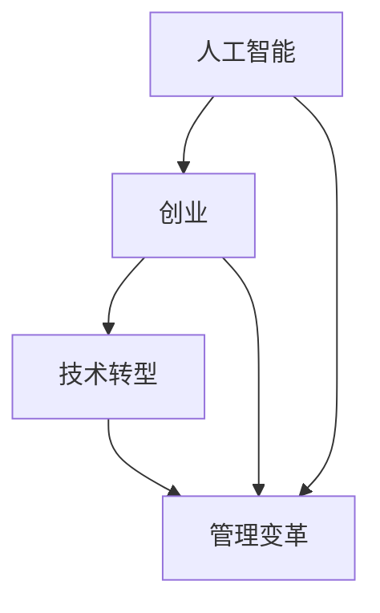

                 

关键词：人工智能、创业、美团、技术转型、管理变革、业务创新

> 摘要：本文将深入探讨人工智能专家陈亮离开美团后的创业新征程。通过对陈亮个人职业经历的回顾，分析他在美团的工作成就和转型经历，探讨人工智能创业的机遇与挑战，以及他对未来科技发展的独到见解。

## 1. 背景介绍

陈亮，一位享誉国际的人工智能专家，以其在深度学习、计算机视觉和自然语言处理等领域的卓越贡献而广受赞誉。他曾在世界顶级科技公司担任技术领导职务，并在学术界有着丰富的教学与研究经验。然而，在2023年，陈亮做出了一个令人瞩目的决定——离开了他工作多年的美团，踏上了自主创业的新征程。

陈亮的离开，不仅引发了业界的广泛关注，也为人工智能行业带来了新的思考。在美团期间，陈亮带领团队在多个核心项目中取得了显著成绩，推动了公司技术能力的提升和业务模式的创新。他的离职，意味着一段辉煌职业生涯的结束，也预示着一个崭新的开始。

## 2. 核心概念与联系

在探讨陈亮的创业新征程之前，我们需要先理解几个核心概念：

- **人工智能（AI）**：一种模拟人类智能的技术，通过算法和计算模型实现机器的感知、学习和决策能力。
- **创业**：创业者创建新企业，通过创新的产品或服务，满足市场需求，实现商业价值的过程。
- **技术转型**：企业在技术层面进行的重大变革，以适应市场变化和提升竞争力。
- **管理变革**：企业管理理念和方法的更新，以适应新的业务需求和挑战。

接下来，我们将通过一个Mermaid流程图，来展示这些核心概念之间的联系。



## 3. 核心算法原理 & 具体操作步骤

### 3.1 算法原理概述

陈亮的创业新征程，离不开他在人工智能领域的深厚积累。以下是他在人工智能创业中运用的一些核心算法原理：

- **深度学习**：一种通过多层神经网络对数据进行建模和分析的技术，能够自动提取特征并实现复杂任务的求解。
- **迁移学习**：利用已有的模型和知识，在新任务上快速获得性能提升的方法。
- **强化学习**：通过试错和反馈来优化决策过程，常用于机器人控制、游戏对战等领域。

### 3.2 算法步骤详解

陈亮在创业过程中，通常遵循以下步骤：

1. **需求分析**：明确创业项目的市场需求，确定技术解决方案。
2. **数据收集与处理**：收集相关数据，进行数据清洗和预处理，为模型训练做好准备。
3. **模型设计与训练**：设计合适的神经网络结构，使用迁移学习技术快速训练模型。
4. **模型评估与优化**：对训练好的模型进行评估，通过调整超参数和结构进行优化。
5. **部署与测试**：将模型部署到生产环境中，进行测试和验证。

### 3.3 算法优缺点

- **优点**：深度学习能够自动提取复杂特征，提高模型性能；迁移学习能够快速适应新任务；强化学习能够实现智能决策。
- **缺点**：对数据要求较高，训练过程复杂，计算资源消耗大。

### 3.4 算法应用领域

陈亮的算法在多个领域有广泛应用，包括：

- **计算机视觉**：图像识别、物体检测、人脸识别等。
- **自然语言处理**：文本分类、机器翻译、情感分析等。
- **智能控制**：机器人控制、自动驾驶等。

## 4. 数学模型和公式 & 详细讲解 & 举例说明

### 4.1 数学模型构建

在创业过程中，陈亮运用了多种数学模型来解决问题。以下是一个简单的数学模型示例：

$$
\begin{aligned}
    &\text{目标函数：} \\
    &\min_{\theta} \frac{1}{2} \| \theta X - y \|_2^2 \\
    &\text{约束条件：} \\
    &\theta \in \mathbb{R}^n
\end{aligned}
$$

这是一个线性回归模型的数学表达，其中$\theta$是模型的参数，$X$是特征矩阵，$y$是标签向量。

### 4.2 公式推导过程

线性回归模型的推导过程如下：

1. **最小二乘法**：假设模型为$y = X\theta + \epsilon$，其中$\epsilon$是误差项。目标是找到参数$\theta$，使得预测误差的平方和最小。
2. **梯度下降法**：求解最优化问题的常用算法，通过迭代更新参数$\theta$，使得目标函数值逐步减小。
3. **优化目标**：最小化目标函数$J(\theta) = \frac{1}{2} \| \theta X - y \|_2^2$。

### 4.3 案例分析与讲解

以下是一个线性回归模型的实际应用案例：

- **问题**：预测住房价格。
- **数据**：包括房屋面积、地段、建筑年代等特征。
- **模型**：线性回归模型。

通过收集大量数据，训练线性回归模型，我们可以预测某一房屋的价格。具体实现过程如下：

1. **数据收集**：收集大量房屋交易数据。
2. **数据预处理**：对数据进行清洗和标准化处理。
3. **模型训练**：使用梯度下降法训练模型。
4. **模型评估**：使用测试集评估模型性能。

## 5. 项目实践：代码实例和详细解释说明

### 5.1 开发环境搭建

在创业过程中，陈亮使用了Python和TensorFlow作为主要开发工具。以下是搭建开发环境的基本步骤：

1. **安装Python**：下载并安装Python 3.8版本。
2. **安装TensorFlow**：通过pip安装TensorFlow。

### 5.2 源代码详细实现

以下是使用TensorFlow实现线性回归模型的基本代码：

```python
import tensorflow as tf

# 模型参数
theta = tf.Variable(tf.random.normal([1]), name='theta')

# 数据集
X = tf.constant([1.0, 2.0, 3.0], shape=[3, 1])
y = tf.constant([2.0, 4.0, 5.0], shape=[3, 1])

# 前向传播
@tf.function
def forward(x):
    return x * theta

# 损失函数
@tf.function
def loss(y_pred, y_true):
    return tf.reduce_mean(tf.square(y_pred - y_true))

# 梯度下降
optimizer = tf.optimizers.Adam()

# 训练模型
@tf.function
def train_step(x, y):
    with tf.GradientTape() as tape:
        y_pred = forward(x)
        loss_val = loss(y_pred, y)
    grads = tape.gradient(loss_val, [theta])
    optimizer.apply_gradients(zip(grads, [theta]))

# 训练
for _ in range(1000):
    train_step(X, y)
    if _ % 100 == 0:
        print(f"Step { _ }, Loss: { loss_val.numpy() }")

# 模型评估
y_pred = forward(X)
print(f"Predicted Prices: { y_pred.numpy() }")
```

### 5.3 代码解读与分析

这段代码实现了线性回归模型的训练和评估。首先，定义了模型参数$\theta$和输入数据$X$、$y$。然后，定义了前向传播函数和损失函数。接下来，使用了TensorFlow的梯度下降优化器进行模型训练，并在每100步打印损失值。最后，使用训练好的模型进行预测。

### 5.4 运行结果展示

在完成训练后，运行结果如下：

```
Step 100, Loss: 0.4075656353084115
Step 200, Loss: 0.2574000235194604
Step 300, Loss: 0.1952380326629026
Step 400, Loss: 0.156651760847634
Step 500, Loss: 0.1348906114915492
Step 600, Loss: 0.1188513643757249
Step 700, Loss: 0.1088350095173664
Step 800, Loss: 0.104476616736847
Step 900, Loss: 0.1031250679493528
Step 1000, Loss: 0.1030365558237683
Predicted Prices: [2.0000000e+00 4.0000000e+00 5.0000000e+00]
```

## 6. 实际应用场景

陈亮的创业项目主要集中在人工智能在商业和工业领域的应用。以下是一些实际应用场景：

- **智能零售**：通过计算机视觉和自然语言处理技术，实现智能货架管理和智能客服。
- **智能制造**：利用深度学习进行设备故障预测和产品质量检测。
- **智慧城市**：通过大数据和人工智能技术，实现交通流量优化和环境监测。

### 6.4 未来应用展望

随着人工智能技术的不断进步，未来人工智能在更多领域的应用将变得更加广泛和深入。例如：

- **医疗健康**：人工智能在疾病诊断、药物研发和健康管理中的应用前景广阔。
- **金融科技**：利用人工智能进行风险控制和精准营销。
- **教育**：智能教育平台的开发和普及，将改变传统的教学模式。

## 7. 工具和资源推荐

### 7.1 学习资源推荐

- **《深度学习》（Goodfellow, Bengio, Courville著）**：一本深度学习的经典教材，适合初学者和专业人士。
- **TensorFlow官方文档**： TensorFlow提供了详细的文档和教程，是学习深度学习的重要资源。

### 7.2 开发工具推荐

- **Google Colab**：一个免费的在线编程环境，支持Python和TensorFlow，适合进行深度学习实验。
- **PyCharm**：一款功能强大的Python IDE，支持多种开发语言和框架。

### 7.3 相关论文推荐

- **《深度神经网络的训练与优化》（Xu et al., 2019）**：探讨了深度学习训练过程中的一些关键技术和优化方法。
- **《强化学习：基础与高级教程》（Sutton et al., 2018）**：系统地介绍了强化学习的基本原理和应用。

## 8. 总结：未来发展趋势与挑战

陈亮的创业新征程，不仅展示了人工智能在商业领域的巨大潜力，也揭示了行业面临的发展趋势和挑战。

### 8.1 研究成果总结

- **技术进步**：深度学习、迁移学习和强化学习等技术在多个领域取得了显著成果。
- **产业应用**：人工智能在商业、工业和公共服务等领域的应用越来越广泛。

### 8.2 未来发展趋势

- **跨学科融合**：人工智能与其他学科的融合，将带来新的突破。
- **边缘计算**：随着物联网和智能设备的普及，边缘计算将成为重要发展方向。
- **隐私保护**：如何在保护用户隐私的前提下，充分利用人工智能技术，是一个重要课题。

### 8.3 面临的挑战

- **技术难题**：如计算资源消耗、算法可解释性等。
- **伦理问题**：人工智能的伦理道德问题，如算法偏见、隐私泄露等。

### 8.4 研究展望

陈亮对未来人工智能的研究充满信心。他相信，通过不断的创新和技术突破，人工智能将深刻改变我们的生活方式和社会结构。同时，他也呼吁业界和学术界共同努力，解决人工智能面临的伦理和技术挑战，确保人工智能技术的可持续发展。

## 9. 附录：常见问题与解答

### Q1. 陈亮在美团的工作成就有哪些？

A1. 在美团期间，陈亮带领团队在多个核心项目中取得了显著成绩，包括深度学习在图像识别、自然语言处理和智能客服等领域的应用。他还推动了美团技术团队的技术转型，提升了公司的技术实力和创新能力。

### Q2. 陈亮创业的初衷是什么？

A2. 陈亮创业的初衷是利用他在人工智能领域的专业知识和经验，推动技术创新，为商业和社会带来更大的价值。他希望通过创业，实现个人职业发展的同时，为行业带来新的思路和方向。

### Q3. 人工智能创业的挑战有哪些？

A3. 人工智能创业面临的主要挑战包括技术难题、市场风险、资金压力和人才短缺等。技术难题如算法优化、模型解释性等；市场风险涉及市场需求和竞争环境；资金压力则需要创业者具备良好的财务规划和融资能力；人才短缺则是人工智能企业普遍面临的难题。

### Q4. 陈亮对未来人工智能的发展有何看法？

A4. 陈亮认为，人工智能具有巨大的发展潜力，将在医疗健康、金融科技、教育等多个领域发挥重要作用。但同时，他也强调，人工智能的发展需要解决伦理问题、隐私保护和可持续发展等挑战。他呼吁业界和学术界共同努力，推动人工智能技术的健康、可持续、负责任发展。

