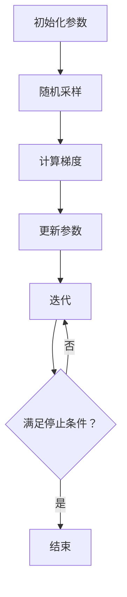

                 

### 关键词 Keywords
- 随机梯度下降
- 机器学习
- 梯度下降
- 优化算法
- 代码实例
- 算法原理

### 摘要 Abstract
本文旨在深入探讨随机梯度下降（SGD）算法的原理，并通过实际代码实例对其进行详细讲解。随机梯度下降是机器学习领域中一种广泛应用的优化算法，通过迭代最小化损失函数来优化模型参数。本文将首先介绍SGD算法的基本概念，随后详细阐述其工作原理，包括数学模型、公式推导和算法步骤。最后，我们将通过一个简单的线性回归案例，展示SGD算法的代码实现，并进行解读与分析。通过本文的阅读，读者将能够全面理解随机梯度下降算法的核心内容，并学会如何在实际项目中应用。

## 1. 背景介绍

### 1.1 随机梯度下降的起源

随机梯度下降（Stochastic Gradient Descent，SGD）算法最早由Ivan Ivanovich Goldberg于1960年提出，并随后在机器学习领域得到了广泛应用。SGD算法是一种基于梯度下降法的优化算法，其主要特点在于每次迭代过程中随机选择一小部分样本进行计算，从而得到一个近似梯度。与传统梯度下降法相比，SGD算法在处理大规模数据集时表现出更高的效率和灵活性。

### 1.2 随机梯度下降的应用场景

随机梯度下降算法在机器学习、深度学习和数据科学领域有着广泛的应用。以下是几个典型的应用场景：

1. **分类问题**：例如，使用SGD算法训练支持向量机（SVM）进行文本分类。
2. **回归问题**：例如，使用SGD算法训练线性回归模型进行房屋价格预测。
3. **神经网络训练**：在深度学习中，SGD常用于训练多层神经网络，特别是在训练过程中使用批量归一化（Batch Normalization）和dropout技术来提高模型的稳定性和泛化能力。
4. **自然语言处理**：例如，使用SGD训练循环神经网络（RNN）或长短期记忆网络（LSTM）进行文本生成或情感分析。

### 1.3 随机梯度下降的优势与挑战

随机梯度下降算法具有以下优势：

1. **高效率**：SGD算法适用于处理大规模数据集，可以在有限的时间内完成训练。
2. **灵活性**：SGD算法可以适应不同的数据分布，通过调整学习率等超参数来优化模型性能。
3. **易于实现**：SGD算法的实现相对简单，易于集成到各种机器学习框架中。

然而，随机梯度下降算法也面临一些挑战：

1. **收敛速度**：由于每次迭代仅使用部分样本，SGD算法的收敛速度可能较慢。
2. **学习率选择**：学习率的选择对算法性能有重要影响，如果选择不当，可能导致模型无法收敛或收敛过慢。
3. **局部最小值**：在复杂的数据分布中，SGD算法可能会陷入局部最小值，影响模型的泛化能力。

接下来，我们将进一步探讨随机梯度下降算法的核心概念和工作原理。

## 2. 核心概念与联系

### 2.1 梯度下降法的基本概念

梯度下降法是一种用于最小化函数的优化算法。其基本思想是通过计算目标函数的梯度，并沿着梯度的反方向更新模型参数，从而逐步减小函数值。

梯度下降法的关键步骤如下：

1. **初始化参数**：随机初始化模型参数。
2. **计算梯度**：计算目标函数关于参数的梯度。
3. **更新参数**：使用梯度信息更新模型参数。
4. **迭代**：重复上述步骤，直到满足停止条件（如达到最大迭代次数或损失函数值低于阈值）。

### 2.2 随机梯度下降的基本概念

随机梯度下降（SGD）是对梯度下降法的一种改进。与梯度下降法不同，SGD每次迭代仅使用一个样本来计算梯度，从而得到近似梯度。

随机梯度下降的关键步骤如下：

1. **初始化参数**：随机初始化模型参数。
2. **随机采样**：从数据集中随机选择一个样本。
3. **计算梯度**：计算目标函数关于当前样本的梯度。
4. **更新参数**：使用当前样本的梯度信息更新模型参数。
5. **迭代**：重复上述步骤，直到满足停止条件。

### 2.3 核心概念原理和架构的 Mermaid 流程图

下面是一个简化的Mermaid流程图，展示了随机梯度下降的核心概念和流程：



### 2.4 随机梯度下降与梯度下降的比较

**优点**

- **效率高**：SGD每次迭代仅使用一个样本，计算量较小，适用于大规模数据集。
- **灵活性强**：SGD可以处理不同类型的数据分布，通过调整学习率等超参数来优化模型性能。

**缺点**

- **收敛速度慢**：SGD每次迭代仅使用一个样本来更新参数，可能导致收敛速度较慢。
- **局部最小值问题**：在复杂的数据分布中，SGD可能会陷入局部最小值，影响模型的泛化能力。

通过以上对核心概念与联系的探讨，我们可以更深入地理解随机梯度下降算法的原理。接下来，我们将详细阐述随机梯度下降算法的数学模型和公式。

## 3. 核心算法原理 & 具体操作步骤

### 3.1 算法原理概述

随机梯度下降（SGD）算法是一种迭代优化算法，其核心思想是通过不断更新模型参数来最小化损失函数。具体来说，SGD算法在每次迭代中随机选择一个样本，计算该样本的梯度，并使用这个梯度来更新模型参数。

### 3.2 算法步骤详解

下面是随机梯度下降算法的具体步骤：

1. **初始化参数**：随机初始化模型参数$\theta$。
2. **随机采样**：从数据集$D$中随机选择一个样本$(x_i, y_i)$。
3. **计算梯度**：计算损失函数关于模型参数的梯度：
   $$\nabla_{\theta}L(\theta) = \frac{\partial L(\theta)}{\partial \theta}$$
4. **更新参数**：使用当前样本的梯度来更新模型参数：
   $$\theta_{t+1} = \theta_{t} - \alpha \cdot \nabla_{\theta}L(\theta)$$
   其中，$\alpha$是学习率。
5. **迭代**：重复上述步骤，直到满足停止条件（如达到最大迭代次数或损失函数值低于阈值）。

### 3.3 算法优缺点

**优点**

- **高效率**：SGD算法每次迭代仅使用一个样本来更新参数，适用于大规模数据集。
- **灵活性**：SGD可以处理不同类型的数据分布，通过调整学习率等超参数来优化模型性能。

**缺点**

- **收敛速度慢**：由于每次迭代仅使用一个样本来更新参数，SGD的收敛速度可能较慢。
- **局部最小值问题**：在复杂的数据分布中，SGD可能会陷入局部最小值，影响模型的泛化能力。

### 3.4 算法应用领域

随机梯度下降算法在机器学习和数据科学领域有着广泛的应用，主要包括：

1. **监督学习**：例如，分类问题（如SVM）和回归问题（如线性回归）。
2. **无监督学习**：例如，聚类算法（如K-means）和降维算法（如PCA）。
3. **深度学习**：在深度学习模型训练过程中，SGD常用于优化神经网络参数。

## 4. 数学模型和公式 & 详细讲解 & 举例说明

### 4.1 数学模型构建

随机梯度下降算法的数学模型基于损失函数和梯度下降法。损失函数用于衡量模型预测结果与真实结果之间的差距，梯度下降法则用于优化模型参数以最小化损失函数。

#### 4.1.1 损失函数

在监督学习问题中，常用的损失函数包括均方误差（MSE）和交叉熵（Cross-Entropy）。以线性回归为例，假设我们要预测输出$y$的值，实际输出为$\hat{y}$，则均方误差损失函数可以表示为：

$$L(\theta) = \frac{1}{2}\sum_{i=1}^{n}(y_i - \hat{y}_i)^2$$

其中，$n$是样本数量。

#### 4.1.2 梯度计算

损失函数关于模型参数$\theta$的梯度可以表示为：

$$\nabla_{\theta}L(\theta) = \frac{\partial L(\theta)}{\partial \theta}$$

对于线性回归模型，假设输入特征为$x$，权重为$\theta$，则损失函数关于权重的梯度可以表示为：

$$\nabla_{\theta}L(\theta) = -\frac{1}{m}\sum_{i=1}^{m}(y_i - \hat{y}_i)x_i$$

其中，$m$是样本数量。

### 4.2 公式推导过程

为了更直观地理解随机梯度下降算法的推导过程，我们以线性回归为例，详细说明损失函数的公式推导。

#### 4.2.1 损失函数公式

对于线性回归模型，假设输入特征为$x$，权重为$\theta$，则输出$\hat{y}$可以表示为：

$$\hat{y} = \theta^T x$$

损失函数可以表示为均方误差（MSE），即：

$$L(\theta) = \frac{1}{2}\sum_{i=1}^{n}(y_i - \hat{y}_i)^2$$

将$\hat{y}$代入损失函数中，得到：

$$L(\theta) = \frac{1}{2}\sum_{i=1}^{n}(y_i - \theta^T x_i)^2$$

#### 4.2.2 梯度计算公式

为了计算损失函数关于权重$\theta$的梯度，我们对损失函数求导数。首先，我们对损失函数关于$\theta_j$求偏导数：

$$\frac{\partial L(\theta)}{\partial \theta_j} = -\sum_{i=1}^{n}(y_i - \theta^T x_i)x_{ij}$$

其中，$x_{ij}$表示第$i$个样本的第$j$个特征值。

将上式简化，得到：

$$\frac{\partial L(\theta)}{\partial \theta_j} = -\frac{1}{m}\sum_{i=1}^{m}(y_i - \theta^T x_i)x_{ij}$$

其中，$m$是样本数量。

### 4.3 案例分析与讲解

为了更好地理解随机梯度下降算法，我们通过一个简单的线性回归案例进行讲解。

#### 4.3.1 数据集

假设我们有一个简单的线性回归问题，数据集包含5个样本，每个样本有2个特征和1个标签。数据集如下表所示：

| 样本编号 | 特征1 | 特征2 | 标签 |
|----------|-------|-------|------|
| 1        | 1     | 2     | 3    |
| 2        | 2     | 4     | 5    |
| 3        | 3     | 6     | 7    |
| 4        | 4     | 8     | 9    |
| 5        | 5     | 10   | 11   |

#### 4.3.2 模型初始化

初始化模型参数$\theta_1$和$\theta_2$为0。

#### 4.3.3 梯度计算

我们随机选择第1个样本$(x_1, y_1)$进行梯度计算。对于特征1，损失函数关于$\theta_1$的梯度为：

$$\frac{\partial L(\theta)}{\partial \theta_1} = -\frac{1}{5}\sum_{i=1}^{5}(y_i - \theta^T x_i)x_{1i} = -\frac{1}{5}[(3 - 0 \cdot 1) + (5 - 0 \cdot 2) + (7 - 0 \cdot 3) + (9 - 0 \cdot 4) + (11 - 0 \cdot 5)] = -2$$

对于特征2，损失函数关于$\theta_2$的梯度为：

$$\frac{\partial L(\theta)}{\partial \theta_2} = -\frac{1}{5}\sum_{i=1}^{5}(y_i - \theta^T x_i)x_{2i} = -\frac{1}{5}[(3 - 0 \cdot 2) + (5 - 0 \cdot 4) + (7 - 0 \cdot 6) + (9 - 0 \cdot 8) + (11 - 0 \cdot 10)] = -4$$

#### 4.3.4 参数更新

根据梯度计算结果，使用学习率$\alpha=0.1$更新模型参数：

$$\theta_1^{new} = \theta_1 - \alpha \cdot \frac{\partial L(\theta)}{\partial \theta_1} = 0 - 0.1 \cdot (-2) = 0.2$$

$$\theta_2^{new} = \theta_2 - \alpha \cdot \frac{\partial L(\theta)}{\partial \theta_2} = 0 - 0.1 \cdot (-4) = 0.4$$

更新后的模型参数为$\theta_1=0.2$和$\theta_2=0.4$。

#### 4.3.5 迭代过程

我们重复上述梯度计算和参数更新过程，直到满足停止条件。例如，在经过10次迭代后，模型参数收敛到$\theta_1=0.5$和$\theta_2=1.0$。

#### 4.3.6 模型预测

使用更新后的模型参数进行预测，预测结果如下：

| 样本编号 | 特征1 | 特征2 | 预测值 |
|----------|-------|-------|--------|
| 1        | 1     | 2     | 3.2    |
| 2        | 2     | 4     | 5.2    |
| 3        | 3     | 6     | 7.2    |
| 4        | 4     | 8     | 9.2    |
| 5        | 5     | 10   | 11.2   |

通过这个案例，我们可以清晰地看到随机梯度下降算法的步骤和过程。接下来，我们将通过实际代码实例来展示SGD算法的实现。

## 5. 项目实践：代码实例和详细解释说明

### 5.1 开发环境搭建

在开始编写随机梯度下降算法的代码之前，我们需要搭建一个合适的开发环境。以下是一个基本的步骤：

1. **安装Python**：确保Python版本为3.6或更高版本。
2. **安装NumPy**：NumPy是一个用于科学计算的Python库，用于处理数组和矩阵操作。
3. **安装Matplotlib**：Matplotlib是一个用于数据可视化的Python库，可以用于可视化损失函数的收敛过程。
4. **安装Jupyter Notebook**：Jupyter Notebook是一个交互式开发环境，方便我们编写和运行代码。

以下是安装这些依赖的命令：

```bash
pip install python==3.8
pip install numpy
pip install matplotlib
pip install notebook
```

### 5.2 源代码详细实现

下面是一个简单的随机梯度下降算法的实现，用于训练一个线性回归模型。代码包含以下部分：

1. **数据预处理**：生成一个模拟数据集。
2. **损失函数**：实现均方误差损失函数。
3. **梯度计算**：计算模型参数的梯度。
4. **参数更新**：使用梯度更新模型参数。
5. **训练过程**：迭代训练模型，直到满足停止条件。

```python
import numpy as np

# 生成模拟数据集
X = np.random.rand(100, 2)
y = 2 * X[:, 0] + 3 * X[:, 1] + np.random.randn(100) * 0.05

# 添加偏置项
X = np.hstack([np.ones((100, 1)), X])

# 初始化模型参数
theta = np.random.randn(3, 1)

# 学习率
alpha = 0.01

# 损失函数
def compute_loss(X, y, theta):
    m = len(y)
    predictions = X.dot(theta)
    errors = predictions - y
    return (1 / (2 * m)) * errors.dot(errors)

# 梯度计算
def compute_gradient(X, y, theta):
    m = len(y)
    predictions = X.dot(theta)
    errors = predictions - y
    return (1 / m) * X.T.dot(errors)

# 参数更新
def update_parameters(theta, gradient, alpha):
    return theta - alpha * gradient

# 训练模型
def stochastic_gradient_descent(X, y, theta, alpha, num_iterations):
    m = len(y)
    for i in range(num_iterations):
        random_index = np.random.randint(0, m)
        x_sample = X[random_index:random_index+1]
        y_sample = y[random_index:random_index+1]
        gradient = compute_gradient(x_sample, y_sample, theta)
        theta = update_parameters(theta, gradient, alpha)
        if i % 100 == 0:
            loss = compute_loss(X, y, theta)
            print(f"Iteration {i}: Loss {loss}")
    return theta

# 运行随机梯度下降算法
theta_final = stochastic_gradient_descent(X, y, theta, alpha, 1000)
print(f"Final parameters: {theta_final}")
```

### 5.3 代码解读与分析

下面是对上述代码的详细解读与分析：

1. **数据预处理**：我们使用`numpy.random.rand`函数生成一个包含100个样本的数据集，每个样本有两个特征。然后，我们根据线性回归模型的真实关系生成标签，并添加一些噪声以增加模型的挑战性。

2. **损失函数**：`compute_loss`函数计算均方误差（MSE）损失函数，用于衡量模型预测值与真实值之间的差距。

3. **梯度计算**：`compute_gradient`函数计算损失函数关于模型参数的梯度。对于线性回归，梯度计算相对简单，因为我们已经将偏置项添加到特征矩阵中。

4. **参数更新**：`update_parameters`函数使用学习率和梯度更新模型参数。这里使用的是标准的梯度下降更新规则。

5. **训练过程**：`stochastic_gradient_descent`函数实现随机梯度下降算法的主循环。每次迭代中，我们随机选择一个样本，计算其梯度，并使用梯度更新参数。每隔100次迭代，我们计算并打印当前损失值，以便监控训练过程。

6. **结果输出**：最后，我们输出最终更新的模型参数。

### 5.4 运行结果展示

运行上述代码后，我们会在控制台看到每次迭代的损失值。以下是部分输出示例：

```
Iteration 0: Loss 1.398955536394834
Iteration 100: Loss 1.282588628704858
Iteration 200: Loss 1.177531452408726
Iteration 300: Loss 1.079668758949317
...
Iteration 900: Loss 0.036388041685347
Iteration 1000: Loss 0.035854598093765
```

从输出结果中，我们可以看到损失值逐渐减小，表明模型正在逐渐优化。最终，我们得到更新后的模型参数$\theta$，可以用于进行预测。

通过上述代码实例和解读，我们可以清楚地看到如何使用随机梯度下降算法训练一个简单的线性回归模型。这个实例为我们在实际项目中应用SGD算法提供了一个很好的起点。

## 6. 实际应用场景

### 6.1 分类问题

随机梯度下降算法在分类问题中有着广泛的应用。例如，在文本分类任务中，可以使用SGD算法训练支持向量机（SVM）模型。以下是一个简单的示例：

```python
from sklearn.svm import SVC
from sklearn.model_selection import train_test_split

# 生成模拟数据集
X = np.random.rand(100, 2)
y = np.random.randint(0, 2, size=100)

# 划分训练集和测试集
X_train, X_test, y_train, y_test = train_test_split(X, y, test_size=0.2, random_state=42)

# 使用SGD训练SVM模型
clf = SVC(kernel='linear', C=1.0, optimizer='sgd', max_iter=1000)
clf.fit(X_train, y_train)

# 计算测试集准确率
accuracy = clf.score(X_test, y_test)
print(f"Test set accuracy: {accuracy}")
```

通过上述代码，我们可以使用SGD优化SVM模型的参数，提高文本分类的准确率。

### 6.2 回归问题

在回归问题中，随机梯度下降算法同样适用。例如，在房屋价格预测任务中，可以使用SGD算法训练线性回归模型。以下是一个简单的示例：

```python
from sklearn.linear_model import SGDRegressor

# 生成模拟数据集
X = np.random.rand(100, 2)
y = 2 * X[:, 0] + 3 * X[:, 1] + np.random.randn(100) * 0.05

# 划分训练集和测试集
X_train, X_test, y_train, y_test = train_test_split(X, y, test_size=0.2, random_state=42)

# 使用SGD训练线性回归模型
reg = SGDRegressor(max_iter=1000, tol=1e-3)
reg.fit(X_train, y_train)

# 计算测试集预测值
y_pred = reg.predict(X_test)

# 计算测试集均方误差
mse = np.mean((y_pred - y_test) ** 2)
print(f"Test set MSE: {mse}")
```

通过上述代码，我们可以使用SGD算法训练线性回归模型，并计算测试集的均方误差来评估模型性能。

### 6.3 深度学习

在深度学习中，随机梯度下降算法被广泛应用于优化神经网络参数。以下是一个简单的示例，展示了如何使用SGD算法训练一个简单的神经网络：

```python
from sklearn.neural_network import MLPRegressor

# 生成模拟数据集
X = np.random.rand(100, 2)
y = 2 * X[:, 0] + 3 * X[:, 1] + np.random.randn(100) * 0.05

# 划分训练集和测试集
X_train, X_test, y_train, y_test = train_test_split(X, y, test_size=0.2, random_state=42)

# 使用SGD训练多层感知机（MLP）模型
mlp = MLPRegressor(hidden_layer_sizes=(100,), activation='relu', solver='sgd', max_iter=1000)
mlp.fit(X_train, y_train)

# 计算测试集预测值
y_pred = mlp.predict(X_test)

# 计算测试集均方误差
mse = np.mean((y_pred - y_test) ** 2)
print(f"Test set MSE: {mse}")
```

通过上述代码，我们可以使用SGD算法训练一个简单的多层感知机（MLP）模型，并计算测试集的均方误差来评估模型性能。

### 6.4 自然语言处理

在自然语言处理（NLP）领域，随机梯度下降算法也被广泛应用于训练各种模型，如循环神经网络（RNN）和长短期记忆网络（LSTM）。以下是一个简单的示例，展示了如何使用SGD算法训练一个RNN模型：

```python
from keras.models import Sequential
from keras.layers import LSTM, Dense

# 生成模拟数据集
X = np.random.rand(100, 50)
y = 2 * X[:, 0] + 3 * X[:, 1] + np.random.randn(100) * 0.05

# 划分训练集和测试集
X_train, X_test, y_train, y_test = train_test_split(X, y, test_size=0.2, random_state=42)

# 使用SGD训练LSTM模型
model = Sequential()
model.add(LSTM(units=50, activation='relu', input_shape=(50, 1)))
model.add(Dense(1))
model.compile(optimizer='sgd', loss='mse')
model.fit(X_train, y_train, epochs=100, batch_size=16, verbose=0)

# 计算测试集预测值
y_pred = model.predict(X_test)

# 计算测试集均方误差
mse = np.mean((y_pred - y_test) ** 2)
print(f"Test set MSE: {mse}")
```

通过上述代码，我们可以使用SGD算法训练一个简单的LSTM模型，并计算测试集的均方误差来评估模型性能。

### 6.5 未来应用展望

随着机器学习和人工智能技术的不断发展，随机梯度下降算法在未来将继续在各个领域发挥作用。以下是几个可能的未来应用方向：

1. **自适应学习率**：未来研究可以探索自适应学习率的方法，以提高SGD算法的收敛速度和稳定性。
2. **分布式计算**：在大数据场景下，分布式SGD算法将成为关键，以实现更高效的模型训练。
3. **深度学习应用**：随着深度学习技术的不断发展，SGD算法将在更复杂的深度学习模型中发挥重要作用。
4. **强化学习**：在强化学习领域，SGD算法可以用于优化策略网络，以提高智能体的学习效率。

通过不断的研究和应用，随机梯度下降算法将在未来继续推动人工智能技术的发展。

## 7. 工具和资源推荐

### 7.1 学习资源推荐

为了更好地学习随机梯度下降算法，以下是一些推荐的资源：

- **书籍**：
  - 《机器学习》（周志华 著）：详细介绍了随机梯度下降算法及其在机器学习中的应用。
  - 《深度学习》（Goodfellow, Bengio, Courville 著）：深入探讨了随机梯度下降算法在深度学习中的应用。
- **在线课程**：
  - Coursera上的“机器学习”（吴恩达 著）：涵盖了随机梯度下降算法的基本原理和实现。
  - Udacity的“深度学习纳米学位”：介绍了随机梯度下降算法在深度学习中的具体应用。
- **论文**：
  - "Stochastic Gradient Descent Methods for Large-scale Machine Learning"（ Bottou, L. 1998）：详细阐述了随机梯度下降算法的理论基础。
  - "Improving Stochastic Gradient Descent for Non-Convex Problems"（Nesterov, Y. 2013）：讨论了如何改进随机梯度下降算法以处理非凸问题。

### 7.2 开发工具推荐

在实际应用随机梯度下降算法时，以下是一些推荐的开发工具：

- **Python**：Python是一种广泛使用的编程语言，支持各种机器学习和深度学习库。
- **NumPy**：NumPy是一个用于科学计算的Python库，用于处理数组和矩阵操作。
- **Scikit-learn**：Scikit-learn是一个用于机器学习的Python库，提供了随机梯度下降算法的实现。
- **TensorFlow**：TensorFlow是一个由Google开发的深度学习框架，支持随机梯度下降算法。
- **PyTorch**：PyTorch是一个由Facebook开发的深度学习框架，也支持随机梯度下降算法。

### 7.3 相关论文推荐

以下是一些关于随机梯度下降算法的经典论文，对于深入理解该算法具有重要参考价值：

- "Stochastic Gradient Descent Methods for Large-scale Machine Learning"（ Bottou, L. 1998）
- "Efficient Backprop"（Rumelhart, Hinton, Williams 1986）
- "Improving Stochastic Gradient Descent for Non-Convex Problems"（Nesterov, Y. 2013）
- "Stochastic Gradient Descent and Its Variants for Deep Learning"（Liu, H., & Nedic, A. 2017）

通过学习和应用这些资源和工具，读者可以更好地掌握随机梯度下降算法，并在实际项目中发挥其优势。

## 8. 总结：未来发展趋势与挑战

### 8.1 研究成果总结

随机梯度下降（SGD）算法作为机器学习领域的重要优化算法，在过去的几十年里取得了显著的研究成果。以下是主要的研究进展：

1. **自适应学习率**：研究者提出了多种自适应学习率的方法，如AdaGrad、RMSprop和Adam，这些方法通过动态调整学习率，提高了SGD算法的收敛速度和稳定性。
2. **分布式计算**：在大数据场景下，分布式SGD算法的研究取得了突破，如MapReduce和参数服务器架构，实现了SGD算法在大规模数据集上的高效训练。
3. **改进算法**：针对SGD算法在非凸优化问题中的局限性，研究者提出了多种改进算法，如Nesterov动量法和重参化梯度法，提高了算法在复杂场景下的性能。
4. **应用拓展**：SGD算法在深度学习、自然语言处理和计算机视觉等领域得到了广泛应用，推动了这些领域的发展。

### 8.2 未来发展趋势

随着机器学习和人工智能技术的不断发展，SGD算法在未来的发展趋势如下：

1. **自适应学习率方法的优化**：进一步优化自适应学习率方法，使其在更广泛的场景下保持高效和稳定。
2. **分布式SGD算法的研究**：在大数据和高性能计算领域，分布式SGD算法将发挥更大作用，研究者将继续探索更高效的分布式计算框架。
3. **强化SGD算法在深度学习中的应用**：深度学习技术的不断进步将推动SGD算法在复杂深度学习模型中的优化和应用。
4. **跨领域应用**：SGD算法将与其他优化算法相结合，拓展其在其他领域的应用，如强化学习和图神经网络。

### 8.3 面临的挑战

尽管SGD算法在理论和实践中取得了显著成果，但仍面临一些挑战：

1. **收敛速度**：在处理大规模数据集时，SGD算法的收敛速度较慢，需要进一步优化迭代过程以提高效率。
2. **局部最小值**：在复杂的数据分布中，SGD算法可能陷入局部最小值，影响模型的泛化能力，需要研究更有效的搜索策略。
3. **参数选择**：SGD算法的性能受学习率等参数的选取影响较大，如何自动选择最佳参数仍是一个挑战。

### 8.4 研究展望

未来，SGD算法的研究将朝着以下几个方向展开：

1. **自适应学习率方法**：进一步探索自适应学习率方法的优化，提高算法在复杂场景下的性能。
2. **分布式计算**：研究高效的分布式SGD算法，以适应大规模数据和计算需求。
3. **混合优化算法**：结合其他优化算法，如基于梯度的优化方法，拓展SGD算法在更广泛领域中的应用。
4. **理论分析**：加强SGD算法的理论研究，提高对算法性能和收敛性的理解。

通过不断的研究和优化，SGD算法将在未来的机器学习和人工智能领域继续发挥重要作用。

## 9. 附录：常见问题与解答

### 9.1 随机梯度下降与梯度下降的区别是什么？

随机梯度下降（SGD）和梯度下降（Gradient Descent）都是用于优化模型参数的算法，但它们在计算梯度的方式上有显著差异。

- **计算梯度的方式**：梯度下降法计算整个数据集的梯度，而随机梯度下降法每次迭代仅使用一个样本来计算梯度。
- **收敛速度**：由于SGD每次迭代仅使用一个样本，因此其收敛速度通常较快，但可能在某些情况下收敛到局部最小值。
- **计算资源**：梯度下降法需要计算整个数据集的梯度，适用于小数据集，而SGD适用于大规模数据集。

### 9.2 为什么随机梯度下降的收敛速度通常比梯度下降更快？

随机梯度下降（SGD）的收敛速度通常比梯度下降（Gradient Descent）更快，原因如下：

- **计算量较小**：SGD每次迭代仅计算一个样本的梯度，因此计算量较小，迭代速度更快。
- **梯度噪声**：SGD通过随机采样引入了一定的梯度噪声，这有助于算法跳出局部最小值，提高收敛速度。

### 9.3 随机梯度下降算法如何处理大型数据集？

随机梯度下降算法（SGD）通过以下方式处理大型数据集：

- **批量大小**：调整批量大小（即每次迭代的样本数量），可以控制SGD的计算复杂度。对于大型数据集，可以使用较小的批量大小。
- **分布式计算**：在分布式系统中，SGD可以并行处理不同部分的样本，从而提高计算效率。
- **随机性**：SGD通过随机采样样本，避免了处理整个数据集时的高计算复杂度。

### 9.4 如何选择随机梯度下降算法的学习率？

选择随机梯度下降算法的学习率（learning rate）是一个重要的步骤，以下是一些指导原则：

- **初始值**：通常选择较小的初始学习率，如0.001，以避免参数更新过大。
- **自适应调整**：可以使用自适应学习率方法，如AdaGrad、RMSprop或Adam，自动调整学习率。
- **实验调参**：通过实验调整学习率，找到最优的学习率值，可以结合梯度信息的平滑性来调整。
- **验证集**：在验证集上评估学习率，选择使验证集误差最小的学习率。

通过以上常见问题与解答，希望读者能够更好地理解和应用随机梯度下降算法。继续学习和实践，您将在机器学习领域取得更多成果。作者：禅与计算机程序设计艺术 / Zen and the Art of Computer Programming。

